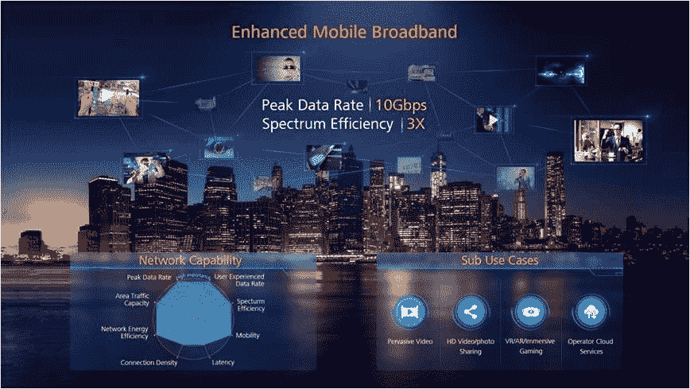
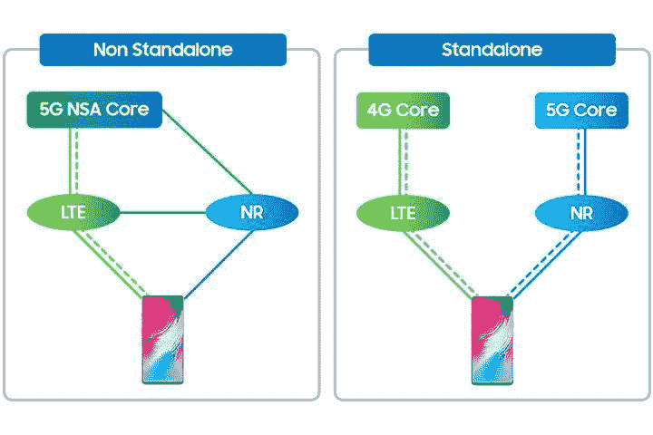
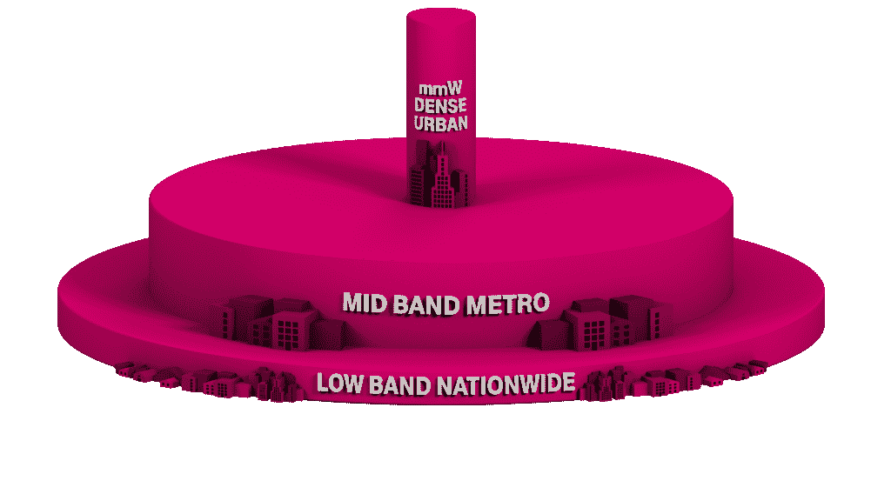
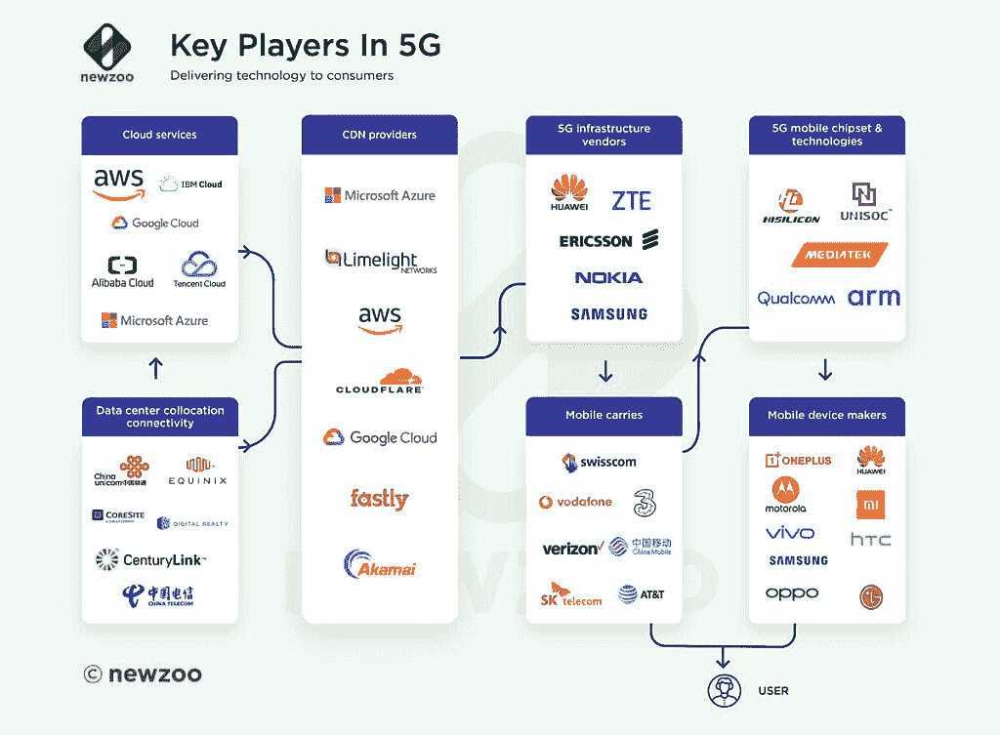
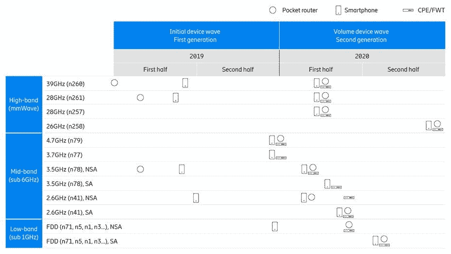

# 5G 权威指南:你需要知道的一切

> 原文：<https://www.xda-developers.com/5g/>

公平地说，在过去几年里，没有一个流行语像 5G 这个词一样具有如此强大的营销影响力。这个词意义重大，以至于整个行业都在推广它。新款智能手机支持 5G。新运营商部署谈论 5G 服务。芯片厂商谈论 5G 调制解调器和 SOC。设备制造商将 5G 作为将“改变用户生活”的“下一件大事”进行促销。“根据你与谁交谈，你会听到关于 5G 的不同说法。它是轻度升级的 4G 移动宽带，还是将连接行业和服务、为大量物联网设备提供动力并作为未来创新的骨干支持的技术？5G 到底是什么？值得炒作吗？

5G 将是本世纪 20 年代移动时代的重要组成部分，很难区分小麦和谷壳。消费者需要注意什么？这是我们对 5G 的深入指导，我们将在其中列出这些问题的答案。

## 5G 是什么？

5G 是第五代移动网络。5G NR(新无线电)是继 4G LTE 之后支持 5G 的空中接口。5G 规范是由行业标准机构 3GPP 开发的。[15 版](https://www.3gpp.org/release-15)完成于 2018 年，[16 版](https://www.3gpp.org/release-16)完成于 2020 年 6 月。

与 4G 类似，5G 是一个支持移动宽带的蜂窝移动网络。它使用 4G 无法使用的额外射频(RF)波，但基本原理是相同的:网络被划分为小区，设备通过连接到运营商安装的节点发射的无线电波来获得蜂窝连接。5G 相对于 4G 的最大好处是容量更大、带宽更高、速度更快。

## 背景

每隔十年左右，移动网络就会根据标准进行一次技术升级。20 世纪 80 年代的 1G 网络是模拟网络。2G GSM 的发布是 1991 年的一个重大里程碑，因为 2G 网络是数字网络。例如，2G 网络带来了对短信的支持。2G 网络有三种类型:GSM、TDMA 和 CDMA。2G GSM 网络后来以 GPRS 和 EDGE(分别为 2.5G 和 2.75G)的形式带来了初级和缓慢的移动数据。用 2G 浏览网页意味着要等几分钟才能加载网页，但这只是移动互联网的开始。

首批商用 3G 网络于 2001 年推出。2G 代表数字语音通话，3G 代表移动数据。就像 2G 一样，3G 有多种类型:W-CDMA(用于全球电话，后来演变为 HSPA)、UMTS 和 CDMA2000 等等。3G 网络花了很长时间才在全球普及；例如，印度直到 2010 年才拥有 3G 网络。虽然移动互联网是 3G 的一个可行的冒险，但数据速度并没有那么好，因为 3G UMTS 在开始时只有 144Kbps 的数据速度目标。HSPA 和 HSPA+ (3.5G)确实提高了数据速度，但在大多数情况下，用 3G 浏览网页是一种缓慢的体验，平均速度从 1Mbps 到 10Mbps 不等。

然后是 4G LTE 网络，从 2010 年开始。4G 是让快速、可用的移动数据成为现实的标准。它的数据下载速度目标是 100Mbps，但如今许多 4G 网络因拥堵而下载速度较低。它开启了拼车等新行业。它以 LTE 语音(VoLTE)的形式带来了基于 IP 的电话技术。4G LTE 是全球 3G (WCDMA/UMTS/HSPA)和 EVDO Rev A 的继任者。4G 网络是迄今为止最好的，支持 4G 的智能手机比以往任何时候都更强大。LTE-Advanced 对 4G 进行了迭代，并且随着每年发布新的调制解调器芯片，4G 不断取得进步。4G 是一项成熟的技术，并且已经改变了世界。

然而，随着不断增长的数据需求，4G 无法跟上。4G 网络开始变得拥挤，随着越来越多的消费者使用它们，数据速度开始下降。

> 新一代细胞时代已经到来。

5G 网络和调制解调器现在已经发展了四年，但商用 5G 在 2019 年才开始成为现实。2020 年，更多 5G 网络铺开，更多 5G 设备上市。对于世界上一半以上的人来说，5G 仍然不是主流现实，但在未来五年内，这种情况将会改变。4G 网络的推出或多或少已经完成，因此，运营商正在将注意力转向 5G。

## 5G 的应用:蜂窝数据和语音、企业解决方案和物联网

5G 是一个广义的术语。一般来说，它在三个领域有应用:

*   移动数据和语音
*   企业解决方案
*   物联网连接

智能手机用户的 5G 处理第一个领域。毫无疑问，企业部门也将从中受益，其应用领域包括无人驾驶汽车、智能城市、医疗领域的应用、智能机械、智能制造等。关于第三个领域，物联网，电信和移动行业多年来一直宣称 5G 将连接大量的物联网(IoT)设备。我们周围的一切都将被连接起来。会发生吗？可能吧。对于智能手机用户来说，后两个领域在学术上很有趣，但第一个领域——移动数据和语音——实际上对最终用户很重要。

 <picture></picture> 

Source: [Huawei](https://www.huawei.com/minisite/hwmbbf15/en/5g-ecosystem.html)

对于智能手机用户来说，5G 指的是更快的数据——在某些情况下快得多。新网络还承诺了难以置信的低延迟，与有线宽带不相上下。对于依赖极低延迟的多人云游戏等用例来说，这将是一件大事。虽然 4G 网络从未设法将延迟降至有线宽带水平，但 5G 有望做到这一点。

5G 还将拥有更高的带宽和网络数据容量。据称，当大量用户开始使用网络时，它不会像 4G 那样不堪重负。对于已经淹没 4G 网络的运营商来说，5G 将代表更高的服务质量、更少的停机时间和更好的客户体验。

不过，这完全取决于速度。5G 规范的目标是 20Gbps 的最大下行速度，比最高的 4G LTE 调制解调器芯片(高达 2Gbps)高出 10 倍。当然，20Gbps 到目前为止只是一个理论上的目标。芯片供应商高通和三星发布的最佳调制解调器芯片在使用毫米波 5G 时，理论上最高可达 10Gbps。

有了这些速度，消费者自然会期望 5G 比他们现有的 4G LTE 网络快一个数量级。不过，事情要比这复杂得多。T-Mobile 和美国电话电报公司的低频段 5G 网络等网络仅比 4G 网络略快。在某些情况下，它们甚至可能更慢。5G 网络不一定意味着它会比 4G 网络快得多，因为它完全是关于无线电频谱的。这里的兔子洞相当深，所以你可以拥有数据下行速度仅为 30-50Mbps 的 5G 网络，而其他中频带 5G 网络可以高达 500-600Mbps。网络各不相同。网络*类型*也各不相同。

## 5G 背后的技术:OFDM、频谱和模式

概括地说，5G 是由支持 4G 的相同技术支持的:正交频分复用(OFDM)。OFDM 是一种数字传输，也是一种在多个载波频率上编码数字数据的方法。它强大而高效，因此是首选技术。5G 融合了频分双工(FDD)和时分双工(TDD)技术，就像 4G (FDD-LTE 和 TDD-LTE)一样。

区分 5G 和 4G 的关键特征是频谱。频谱是用于通过空气传输数据的电磁频率范围。5G 可以使用比 4G 更宽的 RF 波频谱，这使它能够提供更高的速度和更高的数据容量。10-20MHz 的 5G 频谱在低频段如 600MHz 将提供 50Mbps-100Mbps 的速度，但随着频谱的上移，速度也会迅速上升。

4G 频谱也可以重新利用，这要归功于一种叫做动态频谱共享(DSS)的技术。这就是像& T 公司的[这样的运营商正在美国做的事情](https://www.xda-developers.com/att-dynamic-spectrum-sharing-north-texas-boost-5g-speeds-galaxy-s20-lg-v60-galaxy-note-10/)然而，最高的 5G 速度只能通过更高的频率来实现。

5G 有两种模式:非独立模式(NSA)和独立模式(SA)。现在，几乎每个运营商都依赖 NSA 5G。在这里，5G 网络依赖于 4G 基站和 4G 核心网络。这种网络中的数据链路传输使用 4G 网络设施。NSA 对于运营商来说更容易部署，因为他们可以重用他们的 4G 核心网络和网络设施。这里的缺点是它依赖于用于 4G 的旧技术，因此速度不会很高，而延迟不会像 SA 模式下那样低。然而，5G 协议本身仍有一些好处，消费者有望意识到。

 <picture></picture> 

Source: Samsung

SA 模式是运营商真正开始推动的真正的 5G 梦想。[美国的 T-Mobile](https://www.xda-developers.com/t-mobile-launches-first-nationwide-standalone-sa-5g-network/)和威瑞森都提供商用独立 5G 网络，但在& T 目前仍在拖后腿。SA 5G 网络完全独立于 4G，因为它们使用 5G 核心网络和独立的网络设施。这里的数据链路传输不依赖于 4G 技术，这意味着 SA 网络可以承诺更高的速度和更低的延迟。

由最新调制解调器驱动的较新智能手机版本支持这两种模式，这意味着除了当前的 NSA 网络之外，它们还支持未来的 SA 网络。

## 网络频段解释

### Sub-6GHz -低频段和中频段

5G 有两种类型。一个是 6GHz 以下的 5G，可以认为是 4G LTE 的真正继任者。另一个是毫米波 5G (mmWave)。当您读到 1Gbps 下行链路速度和节点视线要求时，您读到的是毫米波。当你读到可靠的 5G 网络实际上在室内工作，真实速度为 100-500Mbps 时，你读到的是低于 6GHz 的速度。

大多数消费者只会体验到低于 6GHz 的频率，因为在全球范围内，运营商已经足够聪明地谨慎对待毫米波。然而，在美国等一些国家，由于最初缺乏可用的 6GHz 以下频谱，运营商(在我看来，这是一种讽刺)首先推出了毫米波。虽然俄罗斯、日本和韩国等国家已经加入了毫米波潮流，但世界上绝大多数国家选择了低于 6GHz 的频率。

然而，这些术语是什么意思呢？

低于 6GHz 的 5G(也称为 sub-6)意味着网络频段的无线电频率低于 6GHz。(题外话，所有 4G 频段都在 6GHz 以下。)另一方面，毫米波意味着频带的无线电频率高于 6GHz。毫米波频段从 24GHz 一直到 100GHz，但实际上，运营商目前已经推出了 26GHz-39GHz 的网络。

6GHz 以下有两种类型:低频段和中频段。

 <picture></picture> 

Source: [T-Mobile](https://www.t-mobile.com/news/media-library/new-5g-layer-cake)

低频带 5G 类似于今天 4G 网络中使用的 FDD-LTE 频带。这些频段具有 T-Mobile 称为 5G“分层蛋糕”的最低无线电频率。例如，T-Mobile 在美国有一个 600MHz 的“全国性”5G 网络，而美国电话电报公司有一个类似的 700MHz 网络。像这样的低无线电频段最适合穿透建筑物、树木等障碍物，并从给定的运营商安装的节点到达尽可能远的地理位置。这使得这些频段成为提供大范围室内覆盖的最佳选择。然而，反过来，它们的低频率意味着它们传输数据的能力最低，这反过来意味着速度不如你对 5G 的预期那么高。

谷歌搜索上的常见问题已经在问:“为什么 5G 这么慢？”在某种程度上，这是美国特有的问题。美国已经在低频带和毫米波上全力以赴，错过了等式中至关重要的中频带部分。T-Mobile 和美国电话电报公司的全国 5G 网络可供数亿人使用，但它们的数据速度一点也不令人印象深刻。它们的下载速度最多只能达到每秒几百兆，但在现实世界中，它们更有可能达到 50-100 兆，速度低至 20-30 兆，这与普通 4G 没有区别。

世界其他地区的 5G 网络，如韩国、日本和英国，没有受到这个问题的困扰，因为他们强调了对中频段的需求。低频网络将继续是分层蛋糕的一部分，但目前，美国过于重视它们。事实上，运营商缺乏必要的关键频谱来使这些低频带网络实现其在数据速度方面的全部潜力，这使得问题变得更加复杂。

中频段是建设 5G 网络的最佳选择。像流行的 3.5GHz 频段和 2.5GHz 频段这样的中频段频率不像低频段频率那样适合穿透障碍物，也不能像毫米波频率那样携带那么多数据。它们在室内覆盖或最高数据速度方面都不是最好的，但它们是最好的全能设备。只要运营商愿意在任何给定位置安装适当数量的节点，中频覆盖是可以接受的。此外，只要有足够的可用频谱供运营商使用，数据速度就不是问题。毕竟，TDD-LTE band 40 (2300MHz)等 4G 频段也属于中频段，Jio 和中国移动等运营商已经分别在印度和中国成功使用了这些频段。

频谱问题是美国运营商遇到障碍的地方。到目前为止，美国三大运营商中没有一家为数亿人推出了中频段网络。在与 Sprint 合并后，T-Mobile 已经开始建设一个中频段网络，但是目前为止只有少数城市可以使用。威瑞森和美国电话电报公司还没有推出中频段 5G 网络，因为他们甚至没有可用的频谱。美国 [FCC 今年早些时候在 C 波段释放了宝贵的频谱](https://www.xda-developers.com/fcc-opens-1200mhz-spectrum-6ghz-band-wi-fi-6e/)，比其他国家晚了很多。威瑞森和美国电话电报公司都已经在 2022 年初推出了他们的中频段网络，比世界其他地方晚了很多，也比两家运营商最初承诺的要晚。

韩国等国家的中频段 5G 网络消费者报告了很高的速度，这是世界其他地区应该效仿的模式。

### 毫米波的争议本质

毫米波 5G 是完全不同的事情。事实证明，电信行业的许多知情人士对毫米波的所有反对意见都是正确的。是的，它确实带来了令人难以置信的高速度——速度通常可以突破下行链路的 1Gbps 障碍。是的，它的延迟确实很低。然而，当你考虑到技术的局限性时，这些都不重要。

毫米波需要一条到运营商安装的节点的视线。毫米波频段使用极高的无线电频率，从 24GHz 开始，一直到 40GHz。这些频率会被建筑物、树木甚至用户的手等障碍物阻挡。即使下雨也会降低信号，这些频率的地理范围只有大约 500 米。这意味着，除非运营商在每条小巷、街道和社区安装节点，否则大多数消费者将永远收不到毫米波信号。你可以使用波束形成，在一部手机中放置多个天线模块，但最终你无法克服物理问题。用于[固定无线接入](https://www.ericsson.com/en/reports-and-papers/ericsson-technology-review/articles/closing-the-digital-divide-with-mmwave-extended-range-for-fwa) (FWA)的毫米波扩展范围目前正在开发中，这将把它的覆盖范围扩大到大约 7 公里，尽管它可能还需要很长时间才能到达消费者手中，并且不会真正与智能手机一起工作。

是的，这些限制是因为物理。这么多频谱在这些高频中未被使用是有原因的。将它们用于实际上依赖无线电波到达最远的移动网络是一个坏主意。原则上这是个坏主意，运营商现在才开始意识到这一点。例如，在美国，T-Mobile 已经停止推广其 mmWave 5G 网络，该网络可在该国选定城市的选定位置使用。美国电话电报公司的毫米波网络甚至不向普通消费者开放，因为它仅限于企业使用。只有威瑞森仍在宣传其毫米波“5G 超宽带”网络，但一旦 1Gbps 速度的新奇因素消失，这些新奇的网络就没有多少用处了。

可以说，毫米波 5G 在用于地标、体育场、会议厅等拥挤环境时效果最佳。我仍然不同意，因为中频段 5G 只是一个更好的妥协。哪个听起来更好:1Gbps 的 5G，当你离开公共地标时信号就会消失；还是 600Mbps 的 5G，当你走进室内时信号会保持不变？我知道我会选择哪一个。此外，这对运营商来说也是一个更容易的选择:花更少的钱安装毫米波节点，并拥有一个可以被更广泛地理区域的更多人使用的网络。

值得庆幸的是，正如我提到的，绝大多数运营商都远离了毫米波。沙特阿拉伯、欧洲和中国等地的 5G 部署都基于中频段，在某些情况下，还辅以低频段。

## 5G 生态系统

没有生态系统，技术本身什么都不是。5G 生态系统由部署 5G 网络的运营商、网络芯片制造商、销售调制解调器芯片以使智能手机连接到这些网络的芯片供应商以及向最终消费者销售手机的设备制造商组成。该行业的其他利益相关者包括政府及其反垄断机构、承包商等。

 <picture></picture> 

Source: [Newzoo](https://newzoo.com/insights/infographics/5g-ecosystem-supply-chain-and-key-players/)

### 运送者

到目前为止，2020 年 6 月，35 个国家已经推出了某种形式的 5G 网络。世界上有 195 个国家，因此在 5G 网络在世界上一半的国家可用之前，还有相当长的路要走。在这一点上，高通会指出，到目前为止，5G 的采用比 4G LTE 更快。根据 GSA 的报告，现在是 2022 年，85 个国家已经按照 3GPP 部署了 5G 网络。

### 芯片供应商

现在，有两种芯片供应商。华为、诺基亚、爱立信、三星和中兴等供应商向运营商出售 5G 网络芯片，以构建基站和运营商节点。由于政治和安全指控，华为被禁止销售或参与美国等许多西方国家的 5G 网络。这让爱立信和诺基亚承担了重任。另一方面，普遍认为华为在网络芯片方面具有技术优势，中国的 5G 网络已经由华为建设。然而，随着对海思的贸易禁令，不清楚未来事情会如何发展。

另一类芯片供应商是那些向智能手机设备制造商出售调制解调器芯片的供应商。高通是主要的例子，但三星系统 LSI 和联发科也发挥了作用。华为海思集团的调制解调器芯片是华为自己用的，但随着海思即将解散，这似乎要结束了。

高通的第一代 X50 5G 调制解调器-RF 系统[早在 2016 年 10 月](https://www.xda-developers.com/qualcomm-announces-x16-and-x50-modems-for-next-generation-snapdragon-8xx-devices-and-5g-connectivity/)就已宣布，它在 2019 年初为第一波 5G 手机提供了动力。7 纳米第二代 [X55 调制解调器-射频系统](https://www.xda-developers.com/qualcomm-snapdragon-x55-5g-modem-2019-android-smartphones/)为一些 2019 年底骁龙 855 手机提供动力，但它在 2020 年开始广泛使用。它与旗舰[骁龙 865](https://www.xda-developers.com/qualcomm-snapdragon-865-processor-specifications-features/) SoC 搭配，后者没有自己的集成调制解调器。高通在 2020 年 2 月宣布了 5 纳米第三代 X60 调制解调器，它出现在下一代高通芯片组中。它带来了不同 5G 模式的载波聚合、更高的下行速度等创新。最新的高通 5G 调制解调器是骁龙 X70，它配备了骁龙 8 Gen 2。

高通还在 2019 年 12 月推出了[高通骁龙 765](https://www.xda-developers.com/qualcomm-snapdragon-765-processor-specifications-features/) ，将 5G 带到了中端价格层，它拥有自己的集成骁龙 X52 5G 调制解调器。它的规格较低，但支持 6GHz 以下和毫米波。2020 年 6 月，该公司宣布推出支持 6GHz 以下 5G(而非毫米波)的[骁龙 690](https://www.xda-developers.com/qualcomm-snapdragon-690-5g-chip/) ，从而将 5G 推向较低的中档价格层。

三星系统 LSI 的第一个 5G 调制解调器是 [Exynos 5100](https://www.xda-developers.com/samsung-announces-5g-modem-exynos-5100/) ，去年为第一批 5G Exynos 手机提供了动力。它的继任者是 [Exynos 5G 调制解调器 5123](https://www.xda-developers.com/samsung-exynos-990-5g-modem-5123-7nm/) ，该调制解调器用于 Galaxy S20 和 Galaxy Note 20 系列的 5G Exynos 990 版本。中端 Exynos 980 SoC 也支持 5G。除了高通，三星是唯一生产和销售毫米波 5G 调制解调器的芯片供应商。Galaxy S20 和 Galaxy Note 20 及更高版本的 5G Exynos 版本支持毫米波。

另一方面，随着新的 5G Dimensity 系列 SOC 的推出，联发科技进入了 5G 时代。该系列即将公布的第一款 SoC 是 2019 年 11 月的[dimension 1000](https://www.xda-developers.com/mediatek-dimensity-1000-7nm-soc-integrated-5g/)。在那次发布之后，它在 2020 年推出了中端[dimension 800](https://www.xda-developers.com/mediatek-dimensity-800-5g-chip-mid-range-phones/)，升级版[dimension 1000+](https://www.xda-developers.com/mediatek-dimensity-1000-plus-new-5g-chip-144hz-display/)和[dimension 820](https://www.xda-developers.com/mediatek-unveils-dimensity-820-5g-soc-upper-mid-range-smartphones/)，以及较低的中端[dimension 720](https://www.xda-developers.com/mediatek-dimensity-720-5g-soc-launch/)。联发科技的 5G 调制解调器选择放弃毫米波支持，选择坚持低于 6GHz。

## 5G 生态系统的现状和未来展望

几年前，5G 生态系统还不成熟，尚未完成。它被降级为价格超过 1000 美元的手机。在 2020 年，生态系统在设备可用性、5G 网络质量、5G 调制解调器质量和网络本身的规模方面已经成熟了很多。一些第一代 5G 手机非常不成熟，以至于出现了奇怪的情况。由于 T-Mobile 与 Sprint 合并，Sprint 版本的一加 7 Pro 5G、Galaxy S10 和 LG V50 ThinQ [不再能连接到任何 5G 网络。在 T-Mobile 上推出的第一代 mmWave 5G 手机无法连接到运营商的全国低频网络。运营商使用不同的网络频段，因此设备制造商必须尽可能多地整合频段，以使解锁手机兼容所有网络。](https://www.xda-developers.com/sprint-oneplus-7-pro-lg-v50-galaxy-s10-lose-5g/)

 <picture></picture> 

Source: [Ericsson](https://www.ericsson.com/en/mobility-report/reports/june-2020/5g-device-outlook)

## 结论

5G 是一个复杂的课题。在本文中，我们只触及了 5G 不同子主题的表面。这里没有涉及的其他子主题包括 5G 作为家庭宽带替代品的潜力，5G 调制解调器的能效，[5G 对旗舰智能手机定价的影响](https://www.xda-developers.com/5g-push-unintentionally-killed-flagship-killer-this-year/)，5G 服务的成本结构，等等。

关于 5G 已经写了很多，而且还会继续写更多，直到它不可避免地被下一代无线技术所取代。关于 5G 的必要性和功效会有很多争论。会有很多营销术语。将会有大量的追加销售。该行业已经在 5G 附近融合，因为这里有很多钱可以赚。不管你喜不喜欢，5G 似乎会一直存在下去。

### 参考

1.  [什么是 5G？——高通](https://www.qualcomm.com/invention/5g/what-is-5g)
2.  [爱立信- 5G 设备可用性报告-2020 年 6 月](https://www.ericsson.com/en/mobility-report/reports/june-2020/5g-device-outlook)
3.  [GSMA-5G 指南](https://www.gsma.com/wp-content/uploads/2019/04/The-5G-Guide_GSMA_2019_04_29_compressed.pdf)