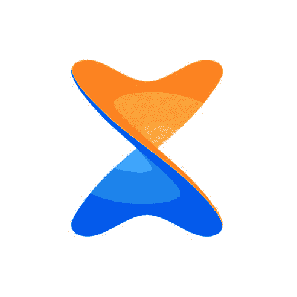

# iPhone 和 Mac 上的隔空投送终极指南:关于超级方便的文件传输解决方案，你需要知道的一切

> 原文：<https://www.xda-developers.com/airdrop/>

隔空投送是 Apple 的文件共享功能，允许您在 Apple 设备之间轻松传输文件。这可以说是最无缝的离线文件传输方法之一，它消除了将文件上传到云端，然后再下载到另一台设备上的需要。它适用于所有现代的苹果手机、T2 的 iPads 和 T4 的苹果电脑。在这篇文章中，我们将谈论你需要知道的关于隔空投送的一切，以及你如何使用它。

## 什么是隔空投送？

隔空投送是苹果公司专有的文件共享功能。它使用特别的 Wi-Fi 连接将照片、视频、文档、网站、地图位置等传输到其他苹果设备。此外，它不需要任何设置，可以自动检测其他正在使用隔空投送的 MAC 或 iPhones。该功能完全离线工作，不需要任何类型的互联网连接。

### 历史

早在 2011 年，隔空投送就作为麦克 OS X 狮子的一部分首次亮相。但它直到 2013 年才作为 iOS 7 的一部分被添加到 iPhone 操作系统中。即使在那时，macOS 隔空投送协议和 iOS 隔空投送协议也不能互操作。

Mac OS X Lion、Mountain Lion 和 Mavericks 中的隔空投送协议仅使用 Wi-Fi，而 iOS 隔空投送协议同时使用蓝牙和 Wi-Fi。因此，为了让隔空投送能在两个平台上互操作，苹果在 OS X Yosemite 上增加了对 iOS 隔空投送协议的支持。但是，传统的 Mac 隔空投送协议仍然用于在运行 OS X 狮子、山狮或 Mavericks 的 Mac 和运行 macOS Mojave 或更旧版本的 Mac 之间传输文件。

苹果最终在 macOS Catalina 中移除了遗留的隔空投送协议。现在，iOS 隔空投送协议被用于在所有现代 iPhones、iPads 和 Mac 电脑之间传输文件。

### 隔空投送是如何工作的？

iOS 隔空投送协议(从现在开始我们称之为隔空投送)使用蓝牙和 Wi-Fi 来识别附近的设备(30 英尺内)并传输内容。它使用蓝牙来检测附近的任何兼容设备。当选择附近兼容的设备进行文件传输时，隔空投送会创建对等 Wi-Fi 连接来完成实际传输。

由于它使用点对点连接，这两台设备不需要在同一个 Wi-Fi 网络上。只要蓝牙和 Wi-Fi 能在两台设备上工作，无论有没有互联网，你都可以在任何地方。也没有文件大小的限制。因此，如果接收设备上有足够的空间，您可以传输任意大小的文件。你也可以在设备之间分享几乎所有的东西。

为了数据安全，隔空投送在点对点网络上使用 TLS 加密，因此您的数据既安全又私密。它还在设备之间创建了防火墙，因此没有人可以通过连接访问您的电话或计算机。

### 哪些设备适用于隔空投送？

隔空投送可以使用 iPhones、iPod touch、ipad 和 MAC 电脑。iPhones 和 iPads 需要运行 iOS 7 或更高版本。若要在 Mac 上使用隔空投送，您必须拥有 2012 年或更高版本的机型(2012 年 Mac Pro 除外)。在 Mac Pro 的情况下，您应该有 2013 年或更新的型号。

如前所述，较旧的 Mac 电脑可以使用传统的隔空投送，但前提是它们运行的是 macOS Mojave 或更旧版本，并且要将文件空投到另一台运行 Mac OS X Lion to Mavericks 的 Mac 电脑上。运行任何比 Lion 更老版本的 macOS 的 MAC 电脑都不支持隔空投送，而传统的隔空投送在 macOS Catalina 中被抛弃了。因此，隔空投送遗产仍然有效的组合非常少。

此外，隔空投送只能用于苹果设备。不支持 Windows 或 Android。安卓有自己的隔空投送替代品，名为 Nearby Share。我们将在文章的后面讨论它。

## 如何使用隔空投送

### 在 iPhone 或 iPad 上打开或关闭隔空投送

你可以在 iPhone 或 iPad 上只为你的**联系人**或**所有人**启用隔空投送功能，或者将其设置为**接收关闭**来禁用它。如果您运行的是 iOS 16.2 或更高版本，那么**所有人**可见性会在 10 分钟后自动恢复为仅**联系人**。

1.  要启用隔空投送，请打开 iPhone 或 iPad 上的**控制中心**。根据您的 iPhone 型号，可以通过从屏幕底部向上滑动或从屏幕右上角向下滑动来打开控制中心。
2.  一旦控制中心打开，长按 **Wi-Fi** 按钮或网络设置卡中的任何地方，你会看到许多与连接相关的选项，包括**隔空投送**。
3.  点击它可以从**接收关闭** *、* **仅联系人**和**所有人**中进行选择。 **Everyone** 表示您附近的任何人都可以向您发送文件。

### 在 Mac 上打开或关闭隔空投送

类似 iPhone 或 iPad，可以在 Mac 上设置隔空投送为**无人*****联系人只***或**人人**。**

 **1.  在 Mac 上打开 **Finder** 。
2.  点击工具条中的**隔空投送**。
3.  在**下通过下拉选择**允许我被发现，选择**无人*****联系人只有***或**人人** *。***

 **## 如何从 iPhone 或 iPad 共享文件

您可以使用隔空投送从任何包含 Share Sheet 的 iOS 或 iPadOS 应用程序发送文件。

1.  打开你试图发送内容的应用。例如，如果您尝试共享一张或多张照片，请打开“照片”应用程序。
2.  选择您要发送的内容，然后点击共享图标。
3.  选择您尝试将文件隔空投送到的联系人或设备。

在 iPhones 和 iPads 之间，你可以传输各种东西，包括照片、视频、通讯录、语音备忘录、网站和地图位置。

## 如何从 Mac 共享文件

从 Mac 上隔空投送文件有多种方法。您可以拖放它们，使用上下文菜单共享它们，或者使用共享表。

1.  在 Mac 上打开 Finder。
2.  找到要共享的文件或文件夹。
3.  右击文件或文件夹，选择**共享**选项下的**隔空投送**。
4.  现在，您可以单击要向其发送文件的设备或联系人。

### 如何使用 Mac 上的“共享”按钮共享文件

除了上下文菜单，您还可以使用**共享**按钮来共享文件。

1.  在你的 Mac 上打开 **Finder** 。
2.  找到并选择要共享的文件。
3.  点击顶栏选项中的**共享**按钮。
4.  选择要向其发送文件的设备或联系人。

### 如何使用拖放功能共享文件

*   在 Mac 上打开 **Finder** 。
*   找到您需要共享的文件。
*   打开一个新的 **Finder** 窗口，从工具条中选择**隔空投送**。
*   现在，您可以将文件从其他 Finder 窗口拖放到隔空投送窗口中的联系人或设备。

从 MAC 上，您可以将文稿、照片、视频、网站、地图位置等发送到 iPhones、ipad、其他 MAC 和 iPod touch。

### 如何接受隔空投送转账请求

当有人使用隔空投送与您共享某些内容时，您会在 Mac 或 iPhone 上看到通知，您可以接受或拒绝它。如果您接受，内容将被传输到您的设备。

但如果你是在 iPhone 上下载，内容会出现在与之兼容的应用程序中。例如，共享的照片将显示在照片应用程序中。不过，共享到 MAC 上的文件会保存在下载文件夹中。

如果您正在与自己共享某些内容，例如从 iPhone 共享到 Mac，您不需要接受传输。如果你在两台设备上使用相同的 Apple ID，所有内容都会自动传输。

## 如何解决隔空投送问题

为确保隔空投送工作顺利，请检查两个设备是否满足以下条件:

*   两个设备都是解锁的，并且彼此在 9 米之内。
*   两者都开启了蓝牙和 Wi-Fi。
*   每部 iPhone 上都关闭了个人热点功能。
*   每台 Mac 都是在 2012 年或之后推出的(除了 2012 年的 Mac Pro ),并运行 OS X Yosemite 或更高版本。一些旧的 MAC 可以使用传统的隔空投送——你可以在上面的*哪些设备可以与隔空投送*一起工作一节中了解到它们。
*   iPhone、iPad 或 iPod touch 正在 iOS 7 或更高版本上运行。
*   两台设备都可以接收隔空投送请求。
*   **阻止所有传入连接**在 **Mac** > **系统首选项** > **安全&隐私** > **防火墙**中未启用。
*   如果隔空投送的可发现性仅限于**联系人**，请确定你们两人都登录了 iCloud，并且在“联系人”部分都有对方的 Apple ID 电子邮件地址和手机号码。
*   在使用旧版隔空投送的旧 Mac 上发送文件时，请确定收件人打开了隔空投送窗口。
*   如果你收到随机的隔空投送请求，在你的 iPhone 或 Mac 上把选项改为**接收关闭** / **无人联系**或**只联系**。

## iOS 上的替代方案

鉴于隔空投送在苹果设备上的深度集成，所有第三方隔空投送替代品都缺乏易用性和整体功能。但是，如果你仍然对隔空投送有些问题，或者想分享苹果设备之外的东西，以下是隔空投送的不错选择。

### **Xender**

Xender 是一个跨平台的文件传输应用程序，允许您共享照片、文档、音乐、视频和其他类型的文件。该应用程序可以在 iOS、Android 和任何带有网络浏览器的设备上使用，包括 Mac 和 PC。它使用点对点 Wi-Fi 来传输文件，所以你不需要上网。

 <picture></picture> 

Xender

##### Xender

Xender 可以免费下载和使用。

### 空中机器人

AirDroid 在很多方面与 Xender 相似，但它包含了更多的功能。您可以通过点对点 Wi-Fi 和互联网传输文件。AirDroid 可以免费下载使用，但是免费版有一些限制。

 <picture></picture> 

AirDroid

##### AirDroid

AirDroid 是一款不错的文件共享应用，包含了很多功能。

## 附近的分享:安卓的隔空投送替代品

在 iOS 上引入隔空投送的几年后，谷歌在 2020 年推出了自己的替代产品，即附近共享。Nearby Share 适用于所有运行 Android 6.0 或更高版本的手机。与苹果只能离线使用的解决方案不同，Nearby Share 可以离线和在线共享内容。它使用蓝牙、蓝牙 LE、WebRTC 和点对点 Wi-Fi 协议来共享内容，并在您发送内容时自动选择最佳协议。除了 Android，Nearby Share 也可以与 Chromebooks 配合使用。

可以在 Android 手机的共享菜单中访问附近的共享，你可以像使用其他任何共享选项一样使用它。它不是 Android 上唯一的文件传输服务，但它是一种跨设备和制造商的服务。

如果你想在 Android 设备和 Windows 电脑之间传输文件，看看我们的指南[如何在 Android 和 Windows 电脑之间传输文件](https://www.xda-developers.com/how-to-transfer-files-between-android-windows/)。

* * *

这是你需要知道的关于隔空投送的一切。你知道有什么更好的替代品吗？请在评论区告诉我们。同时，如果你想买一台新的笔记本电脑或智能手机，我们的[最佳手机](https://www.xda-developers.com/best-phones)和[最佳笔记本电脑](https://www.xda-developers.com/best-laptops)购买指南可以帮到你。此外，我们有一个很棒的教程，教你如何在 Mac 上使用分屏。****