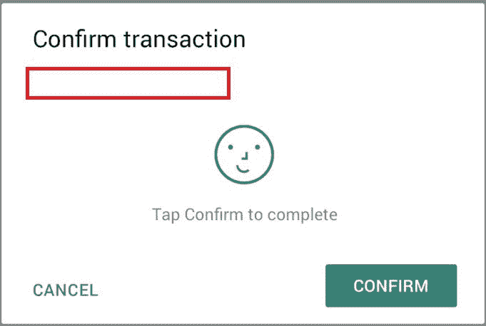

# Android 11 开发者预览版:所有新的隐私和安全功能

> 原文：<https://www.xda-developers.com/android-11-developer-preview-privacy-security-features-changes/>

提前计划，谷歌[今天发布了下一版本 Android OS: Android 11 的第一个开发者预览版](https://www.xda-developers.com/android-11-developer-preview-1-google-pixel)。系统映像可用于 Pixel 2、Pixel 3、Pixel 3a、Pixel 4，但如果您没有这些设备，您也可以通过 Android Studio 仿真器或通用系统映像来尝试开发者预览。虽然谷歌将大部分激动人心的新用户和开发者功能留到了 2020 年谷歌输入输出大会的[上发布，但该公司已经分享了第一个开发者预览版中的大量变化。以下是谷歌在 Android 11 开发者预览版 1 中宣布的所有新的隐私和安全相关功能的汇总。](https://www.xda-developers.com/google-i-o-2020-may-12-14/)

## Android 11 开发者预览版 1 -新的隐私功能

**一次性权限访问**

Android 通过其权限系统控制应用程序可以访问的数据类型。在 Android 6.0 Marshmallow 之前，应用程序要求在安装时被授予权限，因此用户必须在安装之前决定他们是否同意某个应用程序拥有某些权限。Android 6.0 Marshmallow 为一组精选的敏感权限引入了运行时权限，包括位置访问、麦克风访问和相机访问。运行时权限只能在安装后授予，请求权限的应用程序必须通过系统提供的对话框提示用户允许访问。最后，在 Android 10 中，谷歌引入了一个特殊版本的运行时权限，允许用户仅在应用程序处于活跃使用状态时授予访问权限；然而，谷歌只为位置权限引入了“当应用程序正在使用时”选项。

在 Android 11 中，谷歌让用户对其他敏感权限进行更精细的控制，包括摄像头和麦克风访问。该公司在 Android 11 开发者预览版中引入了一个新的“一次性权限”功能，允许用户临时授予应用程序访问权限，只要该应用程序在前台。一旦用户离开应用程序，应用程序将失去访问权限，必须再次请求。

**限定范围的存储更改**

在 [Android 10 beta 2](https://www.xda-developers.com/android-q-beta-2-everything-new/) 中，谷歌提议彻底改变应用程序访问 Android 外部存储的方式。(在这里，外部存储被定义为位于/data/media 中对用户和其他应用可见的数据。)这一被称为“作用域存储”的变化旨在消除 READ_EXTERNAL_STORAGE 权限的过度使用。谷歌 Play 商店上有太多的应用程序请求并被允许访问用户保存私人文档、照片、视频和其他文件的整个外部存储。使用作用域存储，默认情况下，应用程序只能查看自己的私有数据目录。如果某个应用程序在限定范围的存储实施下拥有 READ_EXTERNAL_STORAGE 权限，则它可以查看可通过 MediaStore API 访问的某些媒体文件。或者，应用程序可以使用存储访问框架，让用户通过系统文件选择器手动选择文件。最后，需要广泛访问外部存储的应用程序(如文件管理器)可以使用存储访问框架来请求用户授予应用程序对外部存储根目录的访问权限，从而也授予对其所有子目录的访问权限。

范围存储的实施将对 Android 10 中的所有应用生效，但在开发者的反馈和批评之后，谷歌[放松了改变](https://www.xda-developers.com/google-gives-developers-more-time-android-q-scoped-storage/)，只要求他们针对 API 级别 29 的应用(Android 10)。2020 年 8 月 1 日之后，所有提交给谷歌 Play 商店的新应用必须以 Android 10 为目标，2020 年 11 月 1 日之后对现有应用的所有更新也是如此。此外，在 Android 11 中，文件管理应用程序[的开发者必须向谷歌提交一份声明表](https://www.xda-developers.com/google-file-manager-devs-submit-form-broad-file-storage-access-android-11/)，才能被允许广泛访问外部存储；一旦被接受，文件管理器应用程序将有一个未过滤的 MediaStore 视图，但不能访问外部应用程序目录。

此外，谷歌还在 Android 11 开发者预览版中引入了对作用域存储的其他更改。应用程序可以选择获取原始文件路径，并对媒体商店中的媒体文件执行批量编辑操作。文档已更新，对用户来说更简单。这些变化是在去年的 Android 开发峰会上宣布的，我们承诺在未来的 Android 11 版本中对范围存储进行额外的增强。

## Android 11 开发者预览版 1 -新的安全特性

**手机驾照支持**

自去年年初以来，谷歌一直在 AOSP 开发身份认证 API 和 HAL。此功能为在您的移动设备上安全存储身份证明文件奠定了基础，尤其是符合 ISO 18013-5 标准的移动驾驶执照。谷歌官方[在 Google I/O 2019](https://www.xda-developers.com/android-q-security-privacy-features/) 上宣布了这项功能，现在终于在 Android 11 开发者预览版 1 中支持了。

谷歌在新闻稿中没有对这项功能说太多，但因为这项功能是公开开发的，我们已经知道了很多计划。在 I/O 2019 上，谷歌表示，他们正在与 ISO 合作，以标准化电子护照的实施；我们仍然不知道电子护照何时可用，但美国已经有几个州实施了电子护照或处于试验阶段。谷歌还表示，他们正在努力提供一个 Jetpack 库，以便开发者可以创建身份应用程序。不过，我们不知道开发人员多久才能测试这项功能，因为适当的支持需要设备上有安全的硬件。高通骁龙 865 上的[安全处理单元支持 IdentityCredential API，尽管它可能不支持 API 的直接访问模式，因为 SPU 集成在 SoC 中；直接访问模式将允许用户调出一个存储的电子 ID，即使没有足够的电力来启动 Android。关于这个 API 的更多信息，我推荐](https://www.xda-developers.com/qualcomm-snapdragon-865-spu-dual-sim-dual-standby-drivers-licenses-android-11/)[阅读我们最初的报道](https://www.xda-developers.com/google-android-digital-drivers-license/)，Android 硬件支持的安全团队负责人 Shawn Willden 提供了他的意见。

**新项目主线模块**

Android 10 对新推出的设备的最大变化之一是引入了[项目主线](https://www.xda-developers.com/android-q-project-mainline-security/)，尽管它的名字，但与支持 Android 上的主线 Linux 内核无关。(顺便说一下，该项目被称为通用内核映像，目前仍在开发中。相反，Project Mainline 的目的是让谷歌从原始设备制造商手中夺取关键框架组件和系统应用的控制权。每个主线模块被封装成一个 APK 或者一个顶点文件，并且可以由 Google 通过 Play Store 更新。用户在他们的设备上将更新视为“Google Play 系统更新”(GPSU)，更新以火车的形式定期发布(即它们是同时下载和安装的)。

 <picture></picture> 

The benefits of Project Mainline. Source: Google.

谷歌要求包含特定的主线模块，在谷歌 I/O 2019 时，包括 13 个。现在，谷歌正在 Android 11 开发者预览版 1 中强制要求总共 20 个主线模块。

| 

初始主线模块(@ Google I/O 2019)

 | 

当前主线模块(适用于 Android 11 开发者预览版 1)*

 |
| --- | --- |
| 角 | 强制网络门户登录 |
| 强制网络门户登录 | Conscrypt |
| Conscrypt | DNS 解析器 |
| DNS 解析器 | 文档用户界面 |
| 文档用户界面 | ExtServices |
| ExtServices | 媒体编解码器 |
| 媒体编解码器 | 媒体框架组件 |
| 媒体框架组件 | 模块元数据 |
| 模块元数据 | 网络堆栈 |
| 网络堆栈 | 网络堆栈权限配置 |
| 网络堆栈权限配置 | 许可控制器 |
| 许可控制器 | 时区数据 |
| 时区数据 | **新增权限模块** |
|  | **新媒体提供商模块** |
|  | **新的神经网络 API (NNAPI)模块** |
|  |  |
|  |  |
|  |  |
|  |  |
|  |  |

*注意:在本文发表时，Google 尚未向我们提供当前所需主线模块的完整列表。一旦我们有了完整的列表，我们将更新此表。

**生物计量提示变化**

[Android 9 Pie 推出了](https://www.xda-developers.com/android-p-new-biometrics-api/)biometric prompt API，一个针对生物认证硬件的统一 API。该 API 为开发人员提供了一种通过保存的生物特征来挑战用户的方法，无论是指纹、人脸还是虹膜。在 BiometricPrompt 之前，开发人员必须创建自己的认证对话框，并使用仅支持指纹认证的 FingerprintManager API 来质询用户。在配有虹膜扫描仪的 Galaxy 智能手机上，开发者不得不使用三星的 SDK 来挑战用户。使用 BiometricPrompt，开发人员可以用任何支持的生物识别方法来询问用户，系统会向用户提供对话框。因此，开发人员不再需要担心专门为特定种类的生物识别硬件提供支持，他们也不再需要为身份验证对话框编写 UI 代码。例如， [Pixel 4 的安全面部识别硬件](https://www.xda-developers.com/google-pixel-4-users-wait-developers-add-face-unlock-support/)可以用于使用 BiometricPrompt 的应用程序中的身份验证。

 <picture></picture> 

Facial authentication using BiometricPrompt.

Android 11 开发者预览版 1 中的 BiometricPrompt 有什么新功能？Google 增加了 3 种新的认证类型:强、弱和设备证书。在 Android 11 之前，开发人员只能在使用 BiometricPrompt 时查询设备的安全生物识别硬件——指纹扫描仪、3D 面部识别扫描仪或虹膜扫描仪。从 Android 11 开发者预览版 1 开始，开发者还可以查询被认为“弱”的生物识别方法，如许多手机上基于软件的面部识别解决方案。例如，谷歌[之前将多部三星 Galaxy 手机](https://android.googlesource.com/platform/frameworks/support/+/androidx-master-dev/biometric/biometric/src/main/res/values/devices.xml)列入黑名单，因为它们在尝试基于加密的认证时会返回一个弱面部识别认证器。现在由开发人员决定他们的应用程序需要什么级别的生物认证粒度。

**blob 的安全存储和共享**

一个名为 BlobstoreManager 的新 API 将使应用程序之间共享数据 blobs 变得更加容易和安全。谷歌引用共享机器学习模型的应用程序作为新 BlobstoreManager API 的理想用例。

**平台硬化**

为了减少 Android 的攻击面，谷歌使用 [LLVM 杀毒软件](https://source.android.com/devices/tech/debug/sanitizers)来识别“内存滥用错误和潜在危险的未定义行为。”Google 现在正在将这些基于编译器的杀毒程序的使用扩展到几个安全关键组件，包括 BoundSan、IntSan、CFI 和 Shadow-Call Stack。为了捕捉生产中的内存问题，谷歌正在为所有针对 Android 11 或更高版本的应用程序启用“[堆指针标记](https://source.android.com/devices/tech/debug/tagged-pointers)”。ARMv8 64 位设备支持堆指针标记，其内核支持 ARM 高字节忽略(TBI)，这是一种“硬件在访问内存时忽略指针的高字节”的功能谷歌警告开发者，这些强化改进可能会“出现更多可重复/可再现的应用崩溃”，因此开发者应该在新的 Android 11 开发者预览版上彻底测试他们的应用。为了发现并修复系统中的诸多内存错误，Google 使用了一款名为[硬件辅助 AddressSanitizer](https://source.android.com/devices/tech/debug/hwasan) (HWASan)的内存错误检测工具。谷歌正在 AOSP 构建服务器上提供支持 HWASan 的预构建系统映像[，以防你对查找和修复你自己应用中的内存错误感兴趣。](https://ci.android.com/builds/branches/aosp-master-with-phones-throttled/grid?)

* * *

谷歌肯定会宣布额外的功能来保护用户隐私和提高安全性，所以一定要关注我们的 Android 11 报道，以保持最新。

**[安卓 11 XDA 新闻](https://www.xda-developers.com/tag/android-11/)**