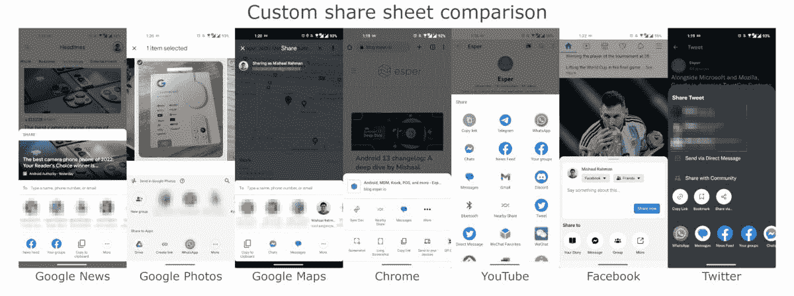

# Android 14 可以带来更一致的分享菜单体验

> 原文：<https://www.xda-developers.com/android-14-could-bring-a-more-consistent-share-menu/>

预计谷歌将在几周内发布第一批 Android 14 的开发者预览版。随着我们越来越接近推出，我们已经开始看到一些关于我们可以期待在即将到来的 Android 升级中看到的一些变化的报告。例如，我们最近了解到 Android 14 可以带来[可更新的根证书](https://www.xda-developers.com/android-14-updatable-root-certificates/)和[要求智能手机支持 AV1](https://www.xda-developers.com/android-14-may-require-av1-decoding/)。现在，来自斯珀的一份新报告表明，这一更新也会给安卓的分享菜单带来急需的改变。

目前，Android 的共享菜单在应用程序和 OEM 皮肤之间并不一致。当您轻按“共享”按钮时，应用程序会生成自定共享表单，而不是系统共享菜单。如所附截图所示，每个应用程序的自定义共享表提供了不同的选项。这大大减慢了分享内容的过程，因为用户不能简单地依靠肌肉记忆来选择目标。

 <picture></picture> 

Image credit: Esper

类似地，不同 OEM Android 皮肤的系统共享菜单也各不相同，对于经常在不同制造商的设备之间切换的用户来说，也存在同样的问题。谷歌似乎意识到了这个问题，可能会在 Android 14 中发布一项改变，使共享菜单体验在应用程序和 OEM 皮肤之间更加一致。

 <picture></picture> 

Image credit: Esper

据*斯珀的*米沙·拉赫曼称，在未来的版本中，谷歌可能会将 Android Sharesheet 移至[项目主线](https://www.xda-developers.com/android-project-mainline-modules-explanation/)模块，以解决共享菜单的不一致问题。为此，谷歌在 Android 13 QPR1 测试版的系统映像中添加了一个新的应用程序。Android 13 QPR1 的源代码显示，新的“Intent Resolver”应用程序将处理 Android“chooser”代码的实现，该代码通过强制用户选择哪个应用程序用于共享操作来调用 Android Sharesheet。

Google 已经将框架选择器代码及其所有依赖项转移到了 AOSP 的一个新仓库中:/packages/modules/intent resolver。Rahman 解释说，AOSP 的/packages/modules 路径“是每个模块化系统组件的源代码仓库，即项目主线模块，驻留。这证明谷歌可以在未来的版本中将 IntentResolver 变成一个新的项目主线模块，这意味着它可以通过 Play 系统更新直接从谷歌接收更新。现在，系统共享菜单只能通过常规的 OTA 更新来更新，因为它是框架包的一部分。此外，原始设备制造商可以大量定制框架共享菜单，但除了通过使用运行时资源覆盖(rro)进行一些轻微的主题化之外，他们可以对谷歌签署和提供的模块做的事情要有限得多。”

通过将 Android Sharesheet 移动到项目主线模块，谷歌将能够在不同 OEM 厂商的 Android 设备上提供更加一致的系统共享菜单。此外，通过 Play 系统更新来更新模块的能力将允许公司在不需要 OTA 更新的情况下跨应用程序试验和改进 share sheet 体验。然而，现在说该公司是否会进行这一变革还为时过早。我们必须等到 Android 14 开发者预览版几周后到来，才能知道谷歌是否会继续进行这项实验，让 Android Sharesheet 成为项目主线模块。

要了解更多关于 Android Sharesheet 及其当前工作方式的信息，请点击下面的链接查看 Mishaal 的详细分析。如果你不熟悉 Android 的项目主线，请前往[我们的深入讲解者](https://www.xda-developers.com/android-project-mainline-modules-explanation/)了解所有模块及其功能。

* * *

**来源:** [斯珀](https://blog.esper.io/android-14-share-menu/)