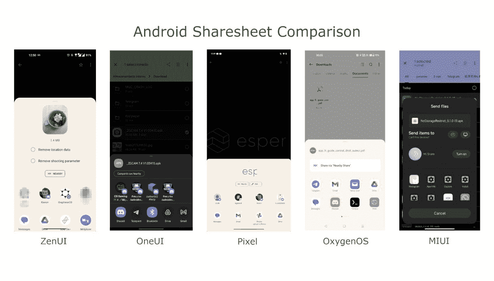

# Android 14“颠倒的蛋糕”:关于谷歌 2023 年的重大更新，你需要知道的一切

> 原文：<https://www.xda-developers.com/android-14/>

Android 大更新最令人兴奋的事情是能够遵循一种模式来体验所有的新功能。谷歌的 [Android 12](https://www.xda-developers.com/android-12/) 更新标志着自 Android 5 Lollipop 以来操作系统最大的视觉重新设计，这要感谢 [Material You](https://www.xda-developers.com/material-you/) 。新的设计理念，以及详尽的新功能列表，使得 Android 12 的外观和感觉与之前的版本完全不同。Android 13 随后出现，并在许多相同的美学选择上加倍努力。现在我们正在转向 Android 14，可能会有更多的变化。

Android 14 的第一个测试版还没有到来，但我们已经有了一些未来会发生什么的线索。每个新版本都会为 Android 系统的不同元素添加新功能和较小的改进。我们现在正在进行我们的第二次开发者预览，我们希望在测试版推出之前至少还有一次。如果你想在一个地方了解关于 Android 14 的所有信息，那么你来对页面了。

## Android 14 叫什么？

两年前，随着 Android 10 的品牌重新设计，谷歌[放弃了其 Android 甜点命名方案](https://www.xda-developers.com/android-10-android-q-brand-redesign/)。然而，该公司的内部开发团队继续使用甜点名称。例如，Android 11 被称为红色天鹅绒，而 Android 12 被称为雪锥。同样，Android 13 也叫[提拉米苏](https://www.xda-developers.com/google-android-13-t-tiramisu-dessert-name/)。自从去年 7 月在 AOSP·格里特的一份承诺中被发现以来，谷歌不再对 Android 14 保密。

对于那些好奇的人，这些是迄今为止所有 Android 版本的甜点名称(内部或公开):

*   安卓 1.5:纸杯蛋糕
*   安卓 1.6:甜甜圈
*   安卓 2.0:克莱尔
*   安卓 2.2: Froyo
*   安卓 2.3:姜饼
*   安卓 3.0:蜂巢
*   安卓 4.0:冰淇淋三明治
*   安卓 4.1:果冻豆
*   安卓 4.4: KitKat
*   安卓 5.0:棒棒糖
*   安卓 6.0:棉花糖
*   安卓 7.0:牛轧糖
*   安卓 8.0:奥利奥
*   安卓 9:馅饼
*   安卓 10:木瓜馅饼
*   安卓 11:红色天鹅绒蛋糕
*   安卓 12:雪锥
*   安卓 13:提拉米苏
*   Android 14:倒挂蛋糕

Android 14 的发布日期还不得而知，但我们怀疑它将遵循与前几年相同的发布节奏。Android 13 于 2022 年 2 月推出了开发者预览版，随后是另一个开发者预览版，然后是四个测试版，直到 Android 13 的最终发布。随着第一个 Android 14 开发者预览版的按时发布和第二个的迅速跟进，我们似乎将遵循与去年类似的发布节奏。

对于开发者来说，如果谷歌遵循与去年相同的发布时间表，你可以期待在第三个测试版左右看到 Android 14 达到“平台稳定性”。平台稳定性是指 API 的最终确定，去年，它与开发者在谷歌 Play 商店上提交针对新 API 级别的应用的能力不谋而合。

## 我的设备会得到 Android 14 吗？

如果你最近有一部谷歌 Pixel 智能手机，比如新的 [Pixel 7 系列](https://www.xda-developers.com/google-pixel-7-review/)，请放心，当 Android 14 推出时，你将是第一批尝到甜头的人之一。它仍然只是开发者预览版(因此，可能不应该安装在你的日常驱动中)，但是你仍然可以试用它。我们还预计其他设备制造商也会加入进来，尽管来自一加和小米等地的设备不会定期更新。换句话说，要小心。

然而，如果你*真的*想在你的智能手机上试用 Android 14，并且没有官方版本，[你可以尝试一个通用的系统映像](https://www.xda-developers.com/android-13-dsu-new-features-performance-improvements/) (GSI)。

## Android 14 到目前为止有什么新功能？

这些是迄今为止在 Android 14 中发现的一些未记录的变化。

### Android 14 可以通过屏幕和闪光提示带来视觉通知

有时很容易错过通知，尤其是当你的手机音量很小或者只设置为振动时。如果你也有听力障碍，那么这两个选项都没有帮助，这就是为什么视觉提示可能是最有用的方式来判断你的手机是否收到通知。不过，有了 Android 14 开发者预览版 2，你可以让相机在收到通知时关闭闪光灯，或者让屏幕闪烁。

### Android 14 可能支持自动确认 PIN 码，而不需要你按回车键

如果你曾经在 Android 上使用过定制 ROM，人们喜欢启用的一个非常常见的功能是，一旦你把它放入手机，它就会自动确认你的 PIN。大多数 Android 手机目前需要你输入 PIN 码，然后点击回车键，但这一变化最终可能会消除这一需要。

默认情况下，DP2 中不会出现这种切换，该功能本身目前似乎也不能在我们的设备上工作。有一个警告说“通过点击 Enter 确认您的 PIN 比使用自动确认更安全”，但这是为了方便起见，如果他们使用 PIN，大多数人肯定会意识到这一点。如果您设置的 PIN 长度少于 6 位，此自动确认正确 PIN 切换将不会出现。

如果您想在设置 PIN 后启用或禁用此功能*，您可以进入设置>安全性&隐私>设备锁定>屏幕锁定并点击右上角的齿轮图标。在这里，您可以使用“自动确认解锁”开关来打开/关闭该功能。*

这个特性目前在 developer preview 2 中不起作用，但是在将来的版本中可能会起作用。

### Android 14 可以让你在你的像素上创建一个表情壁纸

谷歌一直在开发隐藏在开发者旗帜后面的新功能，开发者预览版 2 中的一个功能是[创建表情壁纸](https://www.xda-developers.com/android-14-emoji-wallpaper/)。最近,*《纽约时报》*[发表了一篇文章](https://www.nytimes.com/2023/01/20/technology/google-chatgpt-artificial-intelligence.html),详细介绍了谷歌计划如何对付 ChatGPT。该报告还介绍了该公司目前正在进行的一些图像和视频项目，包括“Pixel 智能手机的壁纸制造商”。在 Android 14 DP2 中，我们在/product 分区中发现了一个新的“表情壁纸”应用程序。它似乎是 Pixel 专用的，因为它的包名是“com . Google . Android . apps . emojiwallpaper ”,并且它需要声明功能标志“com . Google . Android . feature . Pixel _ EXPERIENCE”。

一旦启用，壁纸列表中就会出现一个新的“表情实验室”选项。点击它打开了一个用户界面，让我用各种表情符号创建一个新的壁纸。在创建壁纸时，你可以选择多达 14 个表情符号来包含在设计中，从像“马赛克”、“莲花”、“堆栈”、“喷洒”、“棱镜”这样的图案中进行选择，并在各种颜色之间进行选择。如果你不知道你想要什么样的设计，你可以点击“随机化”按钮，让应用程序创建一个随机化的表情符号壁纸。

一旦你创建了一个壁纸，它会被保存在你的手机壁纸选择的表情实验室部分。不能保证这项功能最终会推广到 Googel Pixel 智能手机上，但它看起来是一项有趣的功能。

### Android 14 的区域偏好功能可以告诉应用程序使用你喜欢的日历和数字系统

Android 是一个全球操作系统，因此，它需要支持人们理解日期、时间和其他区域测量的不同方式，例如华氏温度与摄氏温度以及公里与英里。对于一个应用程序来说，假设用户想要使用什么度量标准并不总是合适的，这就是为什么很多应用程序(尤其是天气应用程序)会*问*你想要使用什么度量标准。谷歌在 Android 13 中增加了每个应用程序的语言设置，现在它似乎正在将这一想法扩展到其他用例。

该公司正在测试 Android 14 中的一项新的“区域偏好”功能，让用户为每个地区设置他们喜欢的温度单位、日历、一周的第一天和数字系统。切换隐藏的开发者标志时,“区域偏好设置”会出现在“设置”>“系统”>“语言和输入”下。

该功能现已在 Android 14 开发者预览版 2 中提供。

### Android 14 可能会为带有触摸板手势和修改键重新映射的键盘带来更好的支持

谷歌一直试图让 Android 在大屏幕设备上更好地工作，由于这些努力，我们现在有了任务栏、活动嵌入、更优化的应用程序、改进的信箱和更好的分屏支持，其中大部分都在 [Android 12L](https://www.xda-developers.com/android-12l/) 中实现。Android 14 DP1 现在有了更好的键盘支持。

Android 14 正准备加入改变修饰键行为的支持。在 Android 14 中，你可以交换 Caps lock、Ctrl、Meta 和 Alt 键的行为，尽管这需要你翻转开发者标志。Android 14 中更新了通用键布局文件，将更多的一些 Linux 键码映射到 Android 键码中。这些变化是:

*   键 120 从(未定义)到最近的应用程序
*   按键 228:键盘背光开关
*   按键 229:键盘 _ 背光 _ 向下
*   按键 230:键盘 _ 背光 _ 开启
*   按键 248:静音
*   按键 418:放大
*   按键 419:缩小
*   关键 528:聚焦

同样，在启用开发者标志后，Android 14 DP1 将在设置下显示新的“触摸板”选项。在这里，您可以切换是否必须点击才能点击，更改滚动方向(反向滚动)，或者切换是否点击触摸板的右下角可以显示更多选项。您还可以调整指针速度，以防默认值太低或太快。甚至还有触摸板手势，通过翻转第二个开发者标志可以启用教程。您可以自定义这些触摸板导航手势，包括:

*   用三个手指向左或向右滑动即可返回
*   用三个手指向上滑动即可回家
*   用三个手指向上滑动，然后按住来打开最近使用的应用程序
*   用三个手指向下滑动来打开通知
*   用四个手指向左或向右滑动来切换应用程序

### Android 14 可以更容易地找到和删除运营商安装的膨胀软件

膨胀软件很难定义，但它本质上是智能手机上超出用户需求的任何预装应用程序。问题是，这些需求因人而异，但我们可能都同意，在用户不知情或不同意的情况下在后台安装的应用程序也算。在 Android 14 DP1 中，有一个隐藏的“后台安装的应用程序”菜单，默认情况下不可访问。你必须翻转一个隐藏的开发者标志才能使它出现，即使这样，它也不会出现在常规版本的设置中。相反，它出现在一个名为“Spa”的特殊版本的设置中，该设置也在开发者标志后面。

这个新的“后台安装的应用程序”界面由一个名为“后台安装控制”的新系统服务支持几个月前，米沙·拉赫曼通过一次 AOSP 事件发现了这项服务存在的证据。当时，有人指出，这项系统服务不仅将用于 Android 14 的新功能(表面上是上面显示的“后台安装的应用程序”页面)，还将用于“几个即将推出的 Android V [Android 15]”功能。

正如你从上面的截图中看到的，最终用户可以发现静默安装的应用程序，如果他们愿意，可以删除它们，似乎由 adb 安装的应用程序或前台活跃的应用程序不会显示在列表中。这在某些设备上可能很有用，在这些设备上，[插入运营商的 SIM 卡](https://www.reddit.com/r/assholedesign/comments/nfqbdl/verizon_installs_17_apps_when_you_put_in_their/)会触发十几个不需要的应用程序的后台安装。

### Android 14 的预测性后退手势可以让你在向后滑动时预览你要去的地方

在 Android 中向后滑动是不可预测的，这有一个很大的原因。当你浏览应用程序时，Android 会记录你所经过的目的地，称为 back stack。这是为了在您刷卡返回时，系统会将您带到正确的目的地。然而，在 Android 13 之前，系统无法确切知道后退手势会把用户带到哪里。如果你在返回堆栈的末尾滑动返回，你会直接回到之前打开的应用程序。这对用户来说并不明显，这可能意味着他们会失去在应用程序中的地位。

然而，[随着 Android 14](https://www.xda-developers.com/android-14-predictive-back-gesture/) 的发布，这种情况将会改变。Android 13 已经实现了一个非常基本的形式，当用户返回到他们的启动器时，它会向用户显示。Android 14 现在会给你一个预览，告诉你你将会回到什么样的状态。

这是一个很小的变化，但很受欢迎，它使 Android 系统更加直观。新的过渡动画在 DP1 中默认是禁用的，在我们的视频中，我们仍然必须[在开发者选项中启用预测性背部动画设置](https://developer.android.com/guide/navigation/predictive-back-gesture#dev-option)，我们还必须使用一个应用程序，该应用程序在中选择新的预测性背部手势行为。

### Android 14 将允许你限制应用程序可以访问的照片，即使它们不使用照片选择器

照片拾取器 API 是 Android 13 的亮点之一，由于 Project Mainline，它已经被反向移植到运行 4.4+的 Android 设备上。它允许用户选择应用程序可以访问的照片和视频，这样它就不会完全访问你设备上的所有照片和视频。然而，应用程序必须真正支持照片拾取器 API，许多应用程序并不支持，尽管这在 Android 14 中并不重要。

从 Android 14 开始，当一个针对 API 级别 33 的应用程序触发运行时权限对话框，要求用户授予他们 READ_MEDIA_VIDEO 或 READ_MEDIA_IMAGES(或两者都有)时，Android 14 可能会在权限对话框中插入一个新条目，上面写着“选择照片”。点击此条目将启动新版本的照片选择器，允许用户选择他们希望授予应用程序访问权限的照片或视频。该应用随后只能访问用户特别选择的那些媒体项目，除非用户选择扩展对附加媒体项目的访问，或者授权该应用访问图像和视频的整个媒体商店集合。

权限对话框中的这个条目在 Android 14 DP1 中默认不显示，因为它的可见性由开发者标志控制。希望谷歌在最终版本中启用它，因为它是一个主要的隐私保护 API。

### Android 14 准备增加一个应用克隆功能

[谷歌正在测试一项新的“克隆应用”功能](https://www.xda-developers.com/android-14-app-cloning/)在 [Android 14](https://www.xda-developers.com/android-14/) 中，它将让你“创建一个应用的第二个实例，这样你就可以同时使用两个账户”用户可以通过设置>应用>克隆应用下的设置应用使用该功能，如下图所示。

当你通过“克隆应用”功能克隆你的第一个应用时，Android 会创建一个所谓的“克隆用户配置文件”，并将该应用安装到该配置文件中。之后克隆的任何应用程序都会安装到之前创建的相同克隆描述文件中。由于克隆配置文件不与父用户配置文件共享应用程序数据，这意味着你克隆的任何应用程序都不会保留你的登录信息或设置，因此你必须从头开始设置它们。如果您决定不再需要克隆的应用程序，您可以通过“克隆的应用程序”页面或标准的“应用程序信息”界面删除该应用程序。

以前克隆应用程序的唯一方法是使用 adb 克隆它们，因为该功能实际上是在 Android 12 中添加的。一些原始设备制造商也推出了克隆应用的选项，甚至还有第三方应用利用工作配置文件来克隆应用。不过，这是一个专门适用于谷歌 Pixel 设备的原生解决方案。

Android 的共享菜单有问题已经很久了。虽然过去的更新试图修复它，但它在 Android 的 OEM 版本甚至应用程序之间并不一致，总的来说，它只是一片混乱。下面的截图正好说明了我的意思。

 <picture></picture> 

Image credit: Esper

这个问题甚至存在于同样以 AOSP 为基地的不同原始设备制造商之间。

 <picture></picture> 

Image credit: Esper

令人欣慰的是，据[其他报道](https://blog.esper.io/android-14-share-menu/)称，在未来的版本中，谷歌可能会将 Android Sharesheet 移动到[项目主线](https://www.xda-developers.com/android-project-mainline-modules-explanation/)模块，以解决共享菜单的不一致问题。为此，谷歌在 Android 13 QPR1 测试版的系统映像中添加了一个新的应用程序。Android 13 QPR1 的源代码显示，新的“Intent Resolver”应用程序将处理 Android“chooser”代码的实现，该代码通过强制用户选择哪个应用程序用于共享操作来调用 Android Sharesheet。

通过将 Android Sharesheet 移动到项目主线模块，Google 现在可以在来自不同 OEM 的 Android 设备上提供更加一致的系统共享菜单。它还将允许该公司尝试什么可行，什么不可行，在不需要大规模系统更新的情况下进行改进。还没有证实谷歌会继续进行这项工作，但是看起来很有可能。

### 可更新的根证书即将到来

根证书是公钥基础设施(PKI)的核心，它们由可信证书颁发机构(CA)签名。但是，有时这些 ca 变得不可信，需要有一种方法让设备接收新的证书，以确保完全访问互联网。在之前的 Android 中，分发新证书的唯一方式是通过 OTA 更新，因为它们存储在手机的系统分区中。

[这种情况将在未来](https://www.xda-developers.com/android-14-root-certificates-updatable/)发生变化，很可能是在 Android 14 上，因为谷歌正在让你手机上的根商店(基本上是告诉你手机接受什么证书的商店)成为 Conscrypt 主线模块的一部分，可以通过 Google Play 系统更新进行更新。这对大多数用户来说无关紧要，但如果一个主要的认证机构突然一夜之间变得不可信，它可以保护您的手机免受潜在的互联网灾难。

### 健康连接可能会成为 Android 14 的一部分

Android 上有无数的健康追踪应用程序，但并不是每一个应用程序都会涵盖你可能想要追踪的每一个重要信息。应用程序可以也确实选择与其他应用程序单独共享数据，但在以前，没有一个健康应用程序可以利用的 API 来共享数据。 [Health Connect](https://www.xda-developers.com/health-connect) 是谷歌对这个问题的答案，能够充当这些跟踪应用程序的中介，彼此共享数据。如果 MyFitnessPal 想要从 Samsung Health、Fitbit 和 Google Fit 获取数据，它以前需要直接与这些应用程序进行交互。在这种情况下，它只需要连接到 Health Connect，Health Connect 将为它处理所有这些连接。

健康连接今天实际上可以在谷歌 Play 商店上使用，但问题是它没有预装在你的手机上，所以不是每个人都知道它。谷歌已经表示打算至少在*的一些*手机上预装该软件，据推测，该公司正在等待测试版结束后再这样做。有报道称它将会随 Android 14 一起发布，并且很有可能作为一个主线模块。这还没有得到证实，但是有很多强有力的证据表明这是事实。

### 告别安卓光束

在 Android 10 中被弃用后，谷歌将*最终*从 AOSP 移除 Android Beam，[根据 Android Gerrit](https://www.xda-developers.com/android-beam-permanent-removal-android-14/) 上的提交。Android Beam 可以用来连接两个设备，轻松开始数据传输。它已经被 neighborhood Share 取代了，neighborhood Share 本质上做的是同样的事情，所以没什么大不了的。

然而，最大的问题是附近的份额依赖于谷歌移动服务(GMS)，这意味着谷歌基本上从 AOSP 拿走了一项功能，并将其隐藏在一项专有服务的背后，而这项服务不属于 AOSP。这意味着没有(或不可能，如华为)加入谷歌自己的转基因生物许可协议的制造商将错过一个功能。

### 通过卫星打招呼

谷歌负责 Android 的高级副总裁 Hiroshi Lockheimer 表示，Android 14 将支持卫星通信。他说，谷歌正在“为卫星设计”，该公司很高兴支持合作伙伴“在下一版本的 Android 中实现所有这些”鉴于来自苹果等公司的压力，[最近也为 iPhone 14 系列引入了卫星支持](https://www.xda-developers.com/iphone-14-series-emergency-sos-via-satellite-communication/)，这似乎是该行业的发展方向。

## Android 14 开发者预览版 2:公布的功能

Android 14 开发者预览版 2 带来了更多的变化，尽管大多数是针对开发者的。

### 隐私和安全

Photo Picker 是 Google 随 Android 13 推出的 API。应用程序不需要请求任何权限来访问用户通过照片选择器选择的项目，这使得它成为一种保护隐私的方式来与应用程序共享照片和视频。我们已经在第一个 Android 14 开发者预览版中[启用了这个功能，但它基本上允许你选择你允许应用程序访问的照片。](https://www.xda-developers.com/android-14-photo-picker-forced/)

此外，Android 14 添加了[凭据管理器](https://www.xda-developers.com/android-credential-manager-api-alpha/)作为平台 API，它通过支持用于检索和存储凭据的 API 使登录变得更容易用户配置的凭据提供者，如密码管理器。它还支持密钥，这是[无密码认证的新行业标准](https://www.xda-developers.com/google-passkeys-chrome-android/)，比使用用户名和密码登录应用程序更安全。它将允许用户为应用程序创建密钥，并将它们存储在谷歌密码管理器中。存储的密钥将在登录到同一个 Google 帐户的设备之间同步。

最后，还有更安全的隐含意图，针对 Android 14 的应用程序需要在发送 PendingIntent 或绑定服务时授予权限，以便在后台启动活动。

### 改进的应用体验

Android 14 引入了许多 PackageInstaller APIs，以简化和改善安装 apk 时的用户体验，[尤其是那些来自第三方应用商店的 apk](https://www.xda-developers.com/android-14-new-apis-app-stores/)。其中包括:

*   **requestUserPreapproval()** :允许用户推迟下载 APK，直到安装被批准。
*   **setRequestUpdateOwnership()**:允许安装程序指示它负责应用程序的未来更新。
*   **setDontKillApp()** :可以在应用程序使用时，通过拆分 apk 无缝安装应用程序的可选功能。

## Android 14 开发者预览版 1:公布的功能

[Android 14 开发者预览版 1](https://www.xda-developers.com/android-14-developer-preview-1/) 给表格带来了很多变化。虽然一些更有趣的对最终用户来说是隐藏的，但是 Google *也宣布了一些有趣的更新和改变。其中包括:*

随着 Android 成为定制化的代名词，一些改变不仅有助于定制你的智能手机，也有助于帮助那些可能有额外的可访问性需求的用户。这包括非线性缩放的更大字体，每个应用程序的语言偏好，以及支持法语、德语和西班牙语等性别语言的语法变形 API。

### 隐私和安全性改进

随着 Android 14 的推出，谷歌在隐私和安全方面的一些改进上加倍努力，这些改进是它多年来一直在积累的。首先，作为迄今为止针对恶意软件最积极的举措之一，谷歌已经阻止了针对 Android SDK 级或更低级别的应用程序的安装。这是因为一些恶意软件或其他危险的应用程序会以 SDK 22 为目标，以避免受到 Android 6.0 棉花糖引入的运行时权限模型的影响。开发者和爱好者仍然可以使用下面的 [adb](https://www.xda-developers.com/install-adb-windows-macos-linux/) 命令安装旧的应用程序。

```
adb install --bypass-low-target-sdk-block FILENAME.apk
```

还有其他改进，包括更安全的隐式意图，更安全的动态代码加载，以及要求应用程序将动态 Context.registerReceiver()定义为导出或未导出。

### 后台流程优化

影响智能手机电池寿命的很多因素不仅仅是前台发生的事情，还有后台发生的事情。应用程序需要后台进程运行来接收信息或给你通知，因此，谷歌优化了后台广播。一旦应用程序进入[缓存状态](https://developer.android.com/guide/components/activities/process-lifecycle)，应用程序就会接收[上下文注册的](https://developer.android.com/guide/components/broadcasts#context-registered-receivers)广播，因为对上下文注册的接收器的广播可能会排队，只有在应用程序脱离缓存状态时才会发送给应用程序。此外，一旦应用程序脱离缓存状态，一些重复的上下文注册广播，如 [BATTERY_CHANGED](https://developer.android.com/reference/android/content/Intent#ACTION_BATTERY_CHANGED) ，可能会在交付之前合并为一个最终广播。

谷歌现在在前台服务应该是什么方面也走得更远了/它们是为最高优先级的面向用户的任务保留的，以便 Android 可以改善资源消耗和电池寿命。还有新的作业，比如用户发起的数据传输类型。

### 应用兼容性

Google 正在引入对 OpenJDK 17 的支持，以便在即将到来的开发者预览版中完全启用 Java 17 特性。得益于项目主线[，谷歌表示，超过 6 亿台设备将能够接收到包括这些变化在内的最新艺术更新。](https://www.xda-developers.com/android-project-mainline-modules-explanation/)

谷歌还将使开发者能够切换新功能，这些功能位于开发者选项中。

## 如何在你的谷歌 Pixel 设备上下载并安装 Android 14 开发者预览版 2

您可以轻松下载 Android 开发者预览版 2，如果您不确定如何安装 Android 14，请务必查看我们的指南。

谷歌正式发布了针对 Pixel 7 Pro、Pixel 7、Pixel 6 Pro、Pixel 6、Pixel 5a 5G、Pixel 5 和 Pixel 4a (5G)的开发者预览更新。您还可以在 Android Studio 的 Android 模拟器中使用 64 位系统映像。