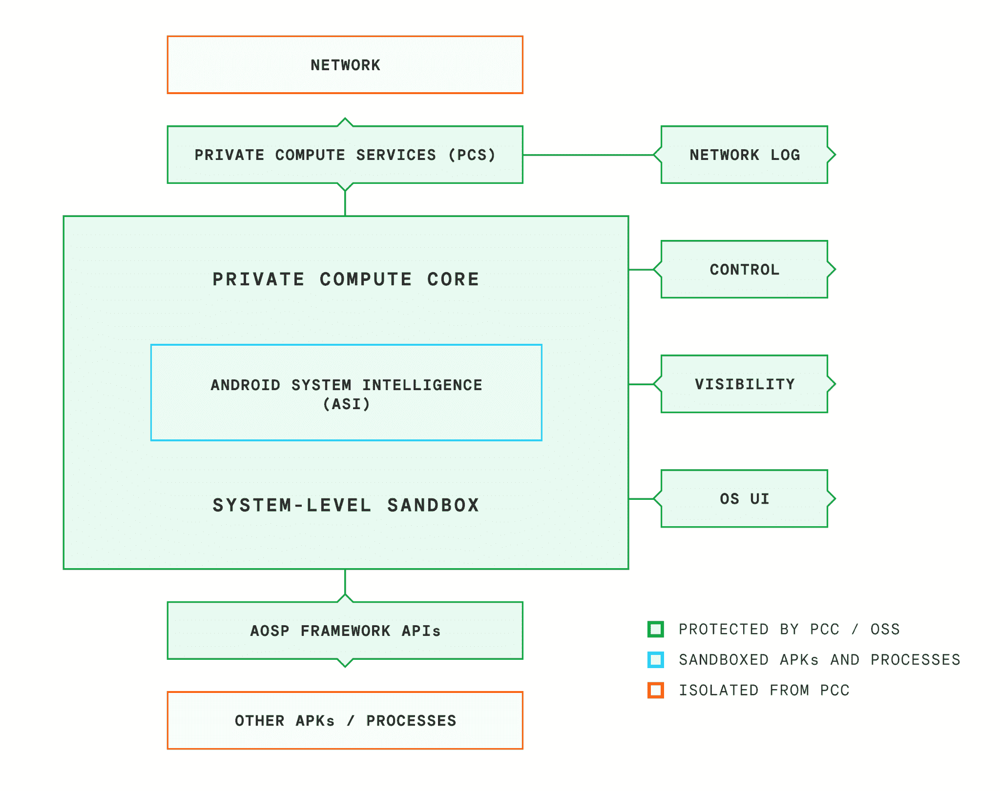

# 谷歌官方解释了 Android 的私有计算核心是如何工作的

> 原文：<https://www.xda-developers.com/android-private-compute-core-explanation/>

谷歌在 Android 12 中引入了几个新的隐私和安全设置，包括启用/禁用摄像头和麦克风的新开关，显示摄像头和麦克风何时使用的指示器，新的隐私仪表盘等等。尽管该公司对这些功能提供了详细的解释，但它只提供了 Android 新的私人计算核心的简要概述。

在去年的 I/O 开发者大会上，谷歌透露，私人计算核心是一个安全分区，用于处理设备上的敏感用户数据，类似于用于密码和生物数据的分区。该公司补充说，它将用于几个人工智能驱动的功能，如实时字幕、正在播放和智能回复，但它没有详细说明这些功能是如何工作的。这让我们[猜测它使用了一个被称为“microdroid”](https://www.xda-developers.com/private-compute-core/)的 Android 虚拟机，直到去年年底一位谷歌人[分享了一些见解](https://twitter.com/MishaalRahman/status/1473450220646248452)并揭示了私人计算核心与运行虚拟机无关。谷歌现在终于提供了一个官方解释，揭示了 Android 的私人计算核心到底是做什么的，以及它是如何工作的。

在一篇新的博客文章中，谷歌解释说，私有计算核心(PCC) *“是 Android 操作系统内部的一个安全、隔离的数据处理环境，它让你可以控制内部的数据，例如决定是否、如何以及何时与他人共享。通过这种方式，PCC 可以启用 Live Translate 等功能，而无需与包括谷歌在内的服务提供商共享连续的传感数据。PCC 是 Protected Computing 的一部分，这是一个技术工具包，它改变了数据处理的方式、时间和位置，以从技术上确保其隐私和安全。”*

## Android 的私有计算核心是如何工作的

Android 的私人计算核心基本上保持了敏感数据，如实时翻译、立即播放和智能回复等功能对其他子系统保密。为此，Google 利用了进程间通信(IPC)绑定和隔离进程等技术。这些技术包含在 Android 开源项目中，可以通过公开可用的表面如 Android 框架 API 来控制。

 <picture></picture> 

Android Private Compute Core architecture overview

由于谷歌不断更新其人工智能功能，它也需要保持 PCC 中运行的机器学习模型最新。为了在不损害敏感数据的情况下做到这一点，谷歌利用联合学习和分析，并监控网络呼叫，以使用[私人计算服务](https://www.xda-developers.com/private-compute-services-android-12/)提高模型的性能。私有计算服务在私有计算核心和云之间提供了一个保护隐私的桥梁，使谷歌能够通过安全的路径提供更新的人工智能模型和沙盒机器学习功能的其他更新。沙盒功能和私有计算服务之间的通信通过从数据中删除标识信息的开源 API 进行。

为了进一步提高透明度，谷歌[发布了一份技术白皮书](https://arxiv.org/abs/2209.10317)，详细介绍了保持 PCC 数据机密的数据保护措施，其流程和机制，以及连续传感功能的隐私结构图。此外，该公司最近[开源了私人计算服务](https://github.com/google/private-compute-services)，允许 Android 社区独立检查控制数据管理和出口政策的代码。