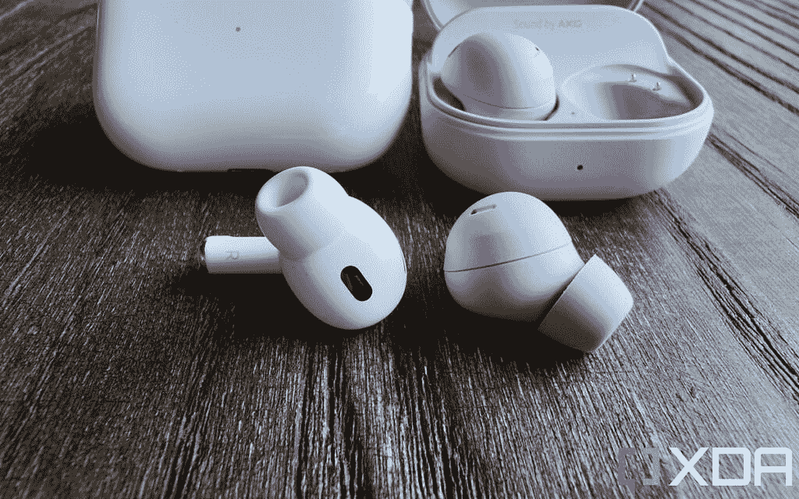
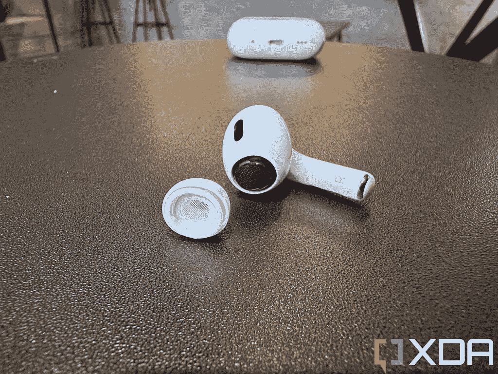

# AirPods Pro 2 vs Galaxy Buds 2 Pro:该买哪个？

> 原文：<https://www.xda-developers.com/apple-airpods-pro-2-vs-samsung-galaxy-buds-2-pro/>

苹果和三星是世界上最大的两家智能手机制造商，在美国、加拿大和韩国等主要市场，它们几乎是两个默认的智能手机选项。因此，对于消费者和我们这些科技媒体人来说，比较这两个品牌的产品是很自然的。这场战斗现在已经蔓延到了无线耳塞领域。是的，苹果和三星多年来一直在发布无线耳塞，但这是这两个品牌首次在一个月内分别发布顶级耳塞，分别是 [AirPods Pro 2](https://www.xda-developers.com/airpods-pro-2-review/) 和 [Galaxy Buds 2 Pro](https://www.xda-developers.com/samsung-galaxy-buds-2-pro-review/) 。

对每个品牌的粉丝来说，好消息是两个耳塞都非常棒，这是我做过的最接近的比较之一。通常，我对我的评论很有主见，我不会回避宣布一个明确的赢家。但是这一次真的可以归结为你使用的手机生态系统。即便如此，我认为 AirPods 和 Galaxy Buds *应该只用于 iOS 或 Android 的观点有点言过其实。虽然 AirPods Pro 2 现在确实存在与 Pixel 7 系列的兼容性问题，但这似乎是一个独家的 Pixel 问题。AirPods 可以很好地与三星、一加或小米设备兼容。同样，在我评测 [iPhone 14 Pro Max](https://www.xda-developers.com/apple-iphone-14-pro-max-review/) 的两周时间里，Galaxy Buds 2 Pro 一直运行良好。*

***关于本文:**洪乙心香港和三星香港分别给我提供了一对二代 AirPods Pro 和 Galaxy Buds 2 Pro。这两个品牌在这篇文章中都没有任何投入。*

##### 苹果 AirPods Pro 2

尽管 AirPods Pro 2 的结构紧凑，但它有很多功能，包括主动噪音消除(ANC)、杜比 Atmos 内容和无线充电。

Galaxy Buds 2 Pro 是最新上架的 TWS 鞋之一。与旧的 Buds Pro 相比，这些高端耳塞的设计略有不同，更小。它们还支持降噪、3D 音频等功能。

* * *

## 苹果 AirPods Pro 2 vs 三星 Galaxy Buds 2 Pro:规格

| 

规格

 | 

苹果 AirPods Pro 2

 | 

三星 Galaxy Buds 2 Pro

 |
| --- | --- | --- |
| **尺寸&重量** | 

*   外壳:45.2 x 60.6 x 21.7mm 毫米(每个)
*   芽:30.9 x 21.8 x 24mm 毫米

 | 

*   芽:19.9 x 21.6 x 18.7mm 毫米(每个)
*   外壳:50.1 x 50.2 x 27.7mm 毫米

 |
| **电池和充电** | 

*   *   未指定电池大小
    *   Case 为 AirPods Pro 2 充电五次
    *   闪电端口充电
    *   Qi 无线充电
    *   MagSafe 充电

 | 

*   *   耳塞:61 毫安时(每个)
    *   外壳:515 毫安时
        *   无线充电支持

 |
| **扬声器和麦克风** | 

*   *   11 毫米驱动器
    *   气孔
    *   三个麦克风

 | 

*   由 AKG 调谐的 10 毫米驱动器
*   气孔
*   三个麦克风

 |
| **连通性** |  |  |
| **传感器和其他功能** | 

*   *   主动噪声消除
    *   透明模式
    *   空间音频
    *   IPX4 防水性

 | 

*   主动噪声消除
*   透明模式
*   空间音频
*   对话模式
*   IPX7 防水性

 |
| **颜色** | 怀特（姓氏） | 紫色、黑色、白色 |

* * *

## 苹果 AirPods Pro 2 vs 三星 Galaxy Buds 2 Pro:设计和硬件

虽然苹果第二代 AirPods Pro 和三星 Galaxy Buds 2 Pro 看起来没有什么不同，但在其他地方有很多相似之处。两者价格相同，三星的 Buds 价格为 229 美元，比 AirPods Pro 的 249 美元便宜 20 美元。

两者都提供蓝牙 5.3 连接，重量差不多，每芽略多于 5 克，两者都通过出色的主动噪音消除和透明模式提供出色的音频。

 <picture></picture> 

The AirPods Pro 2 (left) and the Samsung Galaxy Buds 2 Pro.

就外观而言，第二代 AirPods Pro 看起来几乎与第一代 AirPods 相同，唯一明显的区别是外壳右侧有一个挂绳夹，底部有一个小扬声器孔。后一部分可以让箱子发出哔哔声，如果你把箱子放错了地方，这很有用。

内部到处都有改进:虽然 AirPods Pro 在每个 bud 中的 11 毫米驱动器保持不变，但苹果已经重新设计了驱动器的位置，加上新的 H2 芯片，使 AirPods 能够比第一代 AirPods Pro 提供明显更饱满、更丰富的音频。新芯片还改进了主动噪声消除和透明模式。电池寿命也更长，AirPods Pro 一次充电可以持续六个小时，如果你打开带有头部跟踪的空间音频，预计大约四个半小时。这款保护套还增加了五次完全充电，它可以通过典型的 [Qi 无线充电器](https://www.xda-developers.com/best-qi-wireless-charger/)，Apple Watch 充电器，iPhone MagSafe 充电器或过时的 Lightning 端口进行充电。

与此同时，Galaxy Buds 2 Pro 也进行了内部改进，但三星给了 Buds 一个新的外观，有更活泼的颜色和哑光涂层。我是后者的粉丝，因为它不像 AirPods Pro 上的光滑表面那样吸引指纹和污迹。我也认为 AirPods Pro 只有白色，有点无聊。

Buds 2 Pro 有一个由音频品牌 AKG 微调的 10 毫米驱动器，它可以在一次充电后使用 ANC 播放 5 小时，不使用 ANC 播放 6 小时。

 <picture></picture> 

AirPods Pro, like the Galaxy Buds 2 Pro, have removable silicon tips.

就贴合性和舒适性而言，由于可拆卸的硅尖，两者都可以舒适地放入我的耳朵。相比三星的三种尺寸，苹果确实给了你四种尺寸的硅头，所以 AirPods Pro 可以适应更大范围的耳朵尺寸。

AirPods Pro 显然有这些从耳朵里伸出来的杆，我从来都不是这种外观的忠实粉丝。就我个人而言，我更喜欢 Galaxy Buds 2 Pro 在我耳边的样子，因为它们更低调。然而，茎确实让花蕾更容易进出我的耳朵，因为有东西可以抓住。阀杆也为控制提供了更多的空间。像以前一样，你可以通过点击或长按茎干上的这个锯齿状凹槽来控制音频播放，但这个新版本增加了对滑动动作的支持，这可以控制音量。

在 Buds 2 Pro 上，你必须点击 Buds 的实际背面，这样做有点尴尬，因为你正压着你的耳朵，并且只支持点击和长按，而不是滑动。但你仍然可以通过 Galaxy Wearable 应用程序中定制的特定操作来调节音量。

* * *

## 苹果 AirPods Pro 2 vs 三星 Galaxy Buds 2 Pro:设置和软件

这两款耳塞都可以很容易地与各自品牌的手机配对。我第一次打开 AirPods Pro 盖子时，我的 iPhone 14 Pro Max 上弹出了一个图形，问我是否要配对 AirPods Pro。当我第一次打开 Galaxy Buds 2 Pro 盖子时，同样的过程发生在我的 [Galaxy Z Fold 4](https://www.xda-developers.com/samsung-galaxy-z-fold-4-review/) 上。如果你正在与另一个品牌的手机配对，比如说小米，你必须手动跳转到手机的设置并配对。

为了充分利用 Galaxy Buds 2 Pro，我们建议您下载并安装 Galaxy Wearable app，它可以对声音输出(如 EQ 和音量)进行更精确的控制，并为点击操作分配特定的操作。例如，默认情况下，你不能在 Galaxy Buds 2 Pro 上直接调节音量，你必须在 Galaxy Wearable 应用程序中分配该设置。

AirPods Pro 在这方面无缝得多——没有什么可下载的。一旦配对，你的 iPhone 的设置将显示一个新的 AirPods 控制面板。就像 Galaxy Wearable 应用程序一样，在 AirPods 设置中，你可以重新分配双击或长按 AirPods 时的操作。老实说，苹果已经设计好了它，所以你可以使用 AirPods，而不会感觉到需要进入设置。

### 是的，他们可以用彼此的手机工作

正如我所说，我在 2021 年的大部分时间里都在 Android 手机上使用 AirPods Max，我也有几天在 iPhone 14 Pro Max 上使用 Galaxy Buds 2 Pro。对于这两个 bud，如果你是跨平台的，你必须手动配对。你不会用任何一个 buds 获得任何粒度控制，因为 Android 手机显然不会显示 AirPods 设置面板，而且 iOS 中也没有 Galaxy 可穿戴应用程序。

但音频质量在我听来不错，即使如果你使用的是运行 OneUI 4.1 或更高版本的 Galaxy 手机，并且从支持 24 位音频的服务流媒体，Galaxy Buds 2 Pro 据称可以输出更高保真的 24 位音频。老实说，我不能说 Spotify streams 在 AirPods 上与 iPhone 配对时比三星手机更好，Galaxy Buds 2 Pro 也是如此。

在另一个品牌的设备上使用耳塞时，你确实会失去一些特定的功能——你不会获得空间音频，或者无法访问 Siri 或谷歌助手。我知道有些人可能会认为这些是交易破坏者，这很公平。有些人可能需要一直使用 Siri。但对我来说，它们没有大到让我避免交叉配对。正如我所说，我经常在 Android 设备上使用 AirPods Max。我最关心的是音频和 ANC 质量，这两套设备都能交付。

* * *

## 苹果 AirPods Pro 2 vs 三星 Galaxy Buds 2 Pro:声音和特殊功能

当我几周前评测 Galaxy Buds 2 Pro 时，我说它的 10 毫米 AKG 调谐驱动器发出的音频质量轻松超过了最初的 2019 款 AirPods Pro 的音频质量。第二代 AirPods Pro 以令人信服的方式做出了回应。

对我来说，两个耳塞的音频输出都是顶级的。我认为 Galaxy Buds 2 Pro 仍然有更饱满的低音，更有冲击力，但 AirPods Pro 似乎更适合人声，这在我听鼻音播客(比尔·西蒙斯)时特别明显。AirPods Pro 2 的声音听起来比三星的 buds 更“真实”，数字化程度更低。但当我听一个叫做 Quest 的部落的经典嘻哈音乐时，我更喜欢三星的声音。

主动噪声消除(ANC)在这两方面都有惊人的效果。我住在地球上最嘈杂的城市之一，这些花蕾很好地阻挡了我周围的噪音。就纯粹屏蔽不想要的噪音而言，我要说这些对我的耳朵来说是一个虚拟的纽带，但我确实想给苹果加分，因为 AirPods Pro 将逐渐从透明模式过渡到 ANC 模式(反之亦然)，环境噪音将渐强/渐弱。在 Galaxy Buds 2 Pro 上，它就像一个翻转的开关一样突兀——声音会突然切断或回来。

我还认为 AirPods Pro 的透明模式比 Galaxy Buds 2 Pro 的听起来更自然一些。前者真的感觉我什么都没穿，只是正常的听东西。但三星回来了一个我非常喜欢的智能功能:对话模式。基本上，三星的 buds 会在检测到我的声音时自动降低音量并切换到透明模式。这个想法是，我可以戴着 Galaxy Buds 2 Pro 戴上 ANC，但我可以开始对话，而不需要手动切换到透明模式。不喜欢或者不需要的人可以关闭这个功能。但这对我很有用。

### 语音助手

显然，AirPods Pro 可以与 Siri 配合使用，而 Galaxy Buds 2 Pro 可以连接 Bixby(默认)或谷歌助手。两个耳塞都可以大声给我读收到的短信，但只有 AirPods Pro 允许我通过语音听写来回复。

### 麦克风

两套耳塞都有三个麦克风，在测试通话中，对方说他们可以很容易地听到我的声音。对方确实提到我在 Galaxy Buds 2 Pro 上听起来有点远，可能是因为 AirPods Pro 的杆离我的嘴近了几英寸。

### 抗水性

最后，如果你是一个在水周围的人，Galaxy Buds 2 Pro 的评级为 IPX7，而 AirPods Pro 的评级为 IPX4，这意味着三星的 Buds 可以短时间完全浸没在水中，而 AirPods Pro 只能承受水的飞溅。

* * *

## 苹果 AirPods Pro 2 vs 三星 Galaxy Buds 2 Pro:该买哪个？

我个人更喜欢 Galaxy Buds 的外观，但 AirPods 更容易处理。我认为 Galaxy Buds 的音乐播放稍微丰富一些，但 AirPods 更擅长播放播客。我认为 AirPods Pro 有更好的透明模式，但我喜欢 Galaxy Buds 2 Pro 可以自动切换到它。

最终，我没有明确的赢家并不重要，因为这些产品迎合了两种不同的人群。对于 iPhone 用户来说，如果预算允许，他们几乎总是会选择 AirPods，如果你想享受生态系统的协同效应，这样做是有意义的。在较小的程度上，三星或安卓用户可能会购买 AirPods 以外的东西，因为 AirPods 从来没有真正被认为是值得购买的。所以这两个耳塞似乎并没有去追逐对方的目标客户群。

所以你应该挑选什么取决于你在哪个阵营，即使交叉使用是可能的和可行的:苹果用户应该坚持 AirPods Pro 2，而安卓和三星用户应该坚持 Galaxy Buds 2 Pro。

##### 苹果 AirPods Pro 2

尽管 AirPods Pro 2 的结构紧凑，但它有很多功能，包括主动噪音消除(ANC)、杜比 Atmos 内容和无线充电。

Galaxy Buds 2 Pro 是最新上架的 TWS 鞋之一。与旧的 Buds Pro 相比，这些高端耳塞的设计略有不同，更小。它们还支持降噪、3D 音频等功能。