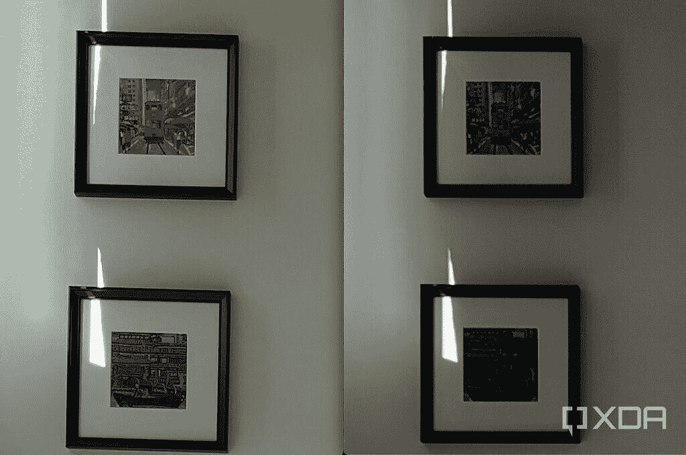
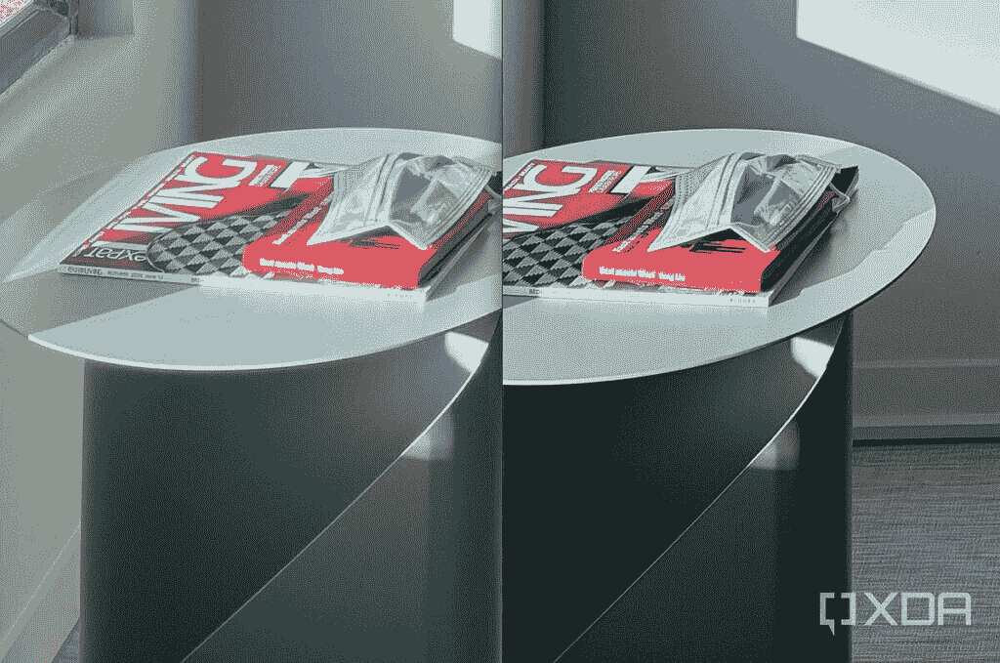
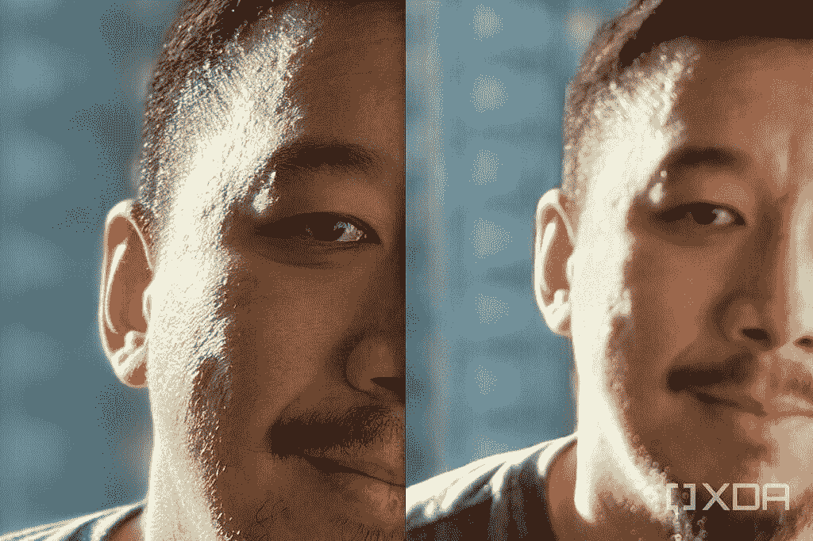

# 苹果 iPhone 12 Pro Max vs 三星 Galaxy Note 20 Ultra:相机枪战

> 原文：<https://www.xda-developers.com/apple-iphone-12-pro-max-vs-samsung-galaxy-note-20-ultra-camera-shootout/>

尽管美国手机极客知道有很多品牌推出了很棒的高端智能手机，但对于普通消费者来说，他们唯一真正的选择似乎仍然是苹果和三星。因此，每年这个时候，都有必要将最新的 iPhone 与最新的 Galaxy Note 进行比较，因为它们代表了全球消费者最主流、最普遍的两款高端手机。随着苹果和三星都声称各自的顶级旗舰产品在相机方面取得了重大突破，我们认为是时候在 [iPhone 12 Pro Max](https://www.xda-developers.com/apple-iphone-12-pro-max-hands-on-preview/) 和[三星 Galaxy Note 20 Ultra](https://www.xda-developers.com/samsung-galaxy-note-20-ultra-review-exynos/) 之间展开一场相机大战了。

## 苹果 iPhone 12 Pro Max vs 三星 Galaxy Note 20 Ultra:规格对比

| 

规范

 | 

苹果 iPhone 12 Pro Max

 | 

三星 Galaxy Note 20 Ultra

 |
| --- | --- | --- |
| **构建** | 

*   铝制中框
*   “陶瓷盾牌”玻璃正面和玻璃背面

 | 

*   铝制中框
*   玻璃正面和背面

 |
| **尺寸&重量** | 

*   160.8 x 78.1 x 7.4 毫米
*   226 克(全球)
*   228 克(美国)

 | 

*   164.8 x 77.2 x 8.1 毫米
*   208 克

 |
| **显示** | 

*   超级视网膜 XDR 有机发光二极管显示器
*   2,778 x 1,284

 | 

*   6.9 英寸有机发光二极管显示屏
*   1440 x 3088 分辨率
*   高达 120Hz 的刷新率

 |
| **SoC** |  | 

*   骁龙 865+或 Exynos 990

 |
| **存储选项** |  |  |
| **电池&充电** | 

*   3，687 毫安时电池，符合认证列表
*   带 MagSafe 的 15W 无线充电
*   7.5W Qi 无线充电

 | 

*   4，500 毫安时电池
*   25W 有线充电
*   15W 无线充电

 |
| **安全** |  | 

*   显示指纹扫描仪

 |
| **后置摄像头** | 

*   **主要:** 12MP
*   **次要:** 12MP，超广角
*   **第三:** 12MP 长焦

 | 

*   **主要:** 108MP，f/1.8，PDAF，激光自动对焦，OIS，1/33”传感器
*   **次要:** 12MP，f/2.2，超广角，120 FoV
*   **第三:** 12MP，f/3.0，5 倍潜望镜变焦
*   激光传感器

 |
| **前置摄像头** |  |  |
| **端口** | 专有闪电端口 | USB-C |
| **连通性** | 

*   5G:低于 6GHz
*   超宽带
*   支持 2×2 MIMO 的 wi-Fi 6(802.11 ax)
*   蓝牙 5.0

 | 

*   5G:低于 6GHz
*   超宽带
*   wi-Fi 5(802.11 AC)
*   蓝牙 5.0

 |
| **软件** | iOS 14 | 一个基于 Android 11 的 UI |
| **其他特征** |  |  |

## 苹果 iPhone 12 Pro Max vs 三星 Galaxy Note 20 Ultra:相机硬件和设计

在过去的几年里，华为和小米等中国手机品牌一直在用更多的像素、更大的传感器和更多的镜头来填充规格表，而三星和苹果则稳扎稳打，坚持使用在纸面上看起来平淡无奇的相机硬件。

这两款相机都非常好，但在如何处理图像处理方面存在关键差异

2020 年是苹果和三星都决定加入相机硬件军备竞赛的一年。三星的主要推动力是在春季推出的 Galaxy S20 Ultra，其特点是带有大型图像传感器的 108MP 摄像头，以及一个[潜望镜变焦镜头](https://www.xda-developers.com/periscope-camera-vs-telephoto-camera/)——Note 20 Ultra 是该系统的一个改进。与此同时，苹果公司今年秋天发布了四款 iPhone，但声称仅针对最大的 iPhone 12 Pro Max 型号进行了重大的硬件改进，即一种类似于“真实”相机中使用的 IBIS(体内图像稳定)技术的“传感器转换”技术，以及一个更大的图像传感器。

除了现在标准的宽、超宽、变焦三倍焦距设置，每台设备都有一个额外的传感器:iPhone 12 Pro Max 配备了一个激光雷达(光探测和测距)传感器，主要用于 AR 技术，但苹果公司也表示，它有助于夜间对焦(剧透警告:我将 12 Pro Max 与没有激光雷达的标准 iPhone 12 进行了比较，看不出对焦能力的差异)。

与此同时，三星给 Galaxy Note 20 Ultra 配备了一个激光传感器，以帮助 108MP 传感器的对焦，这在 Galaxy S20 Ultra 上有点不可靠(剧透:Note 20 Ultra 的自动对焦比 S20 Ultra 有所改善，但与其他顶级手机相比仍有点不稳定)。

尽管如此，两者都是非常强大的系统，它们看起来也很像，拥有引人注目的大而突出的模块。在正面周围，iPhone 12 Pro 配备了一个 1200 万像素的摄像头，安装了 Face ID 面部扫描系统，形成了一个巨大的缺口，而三星在一个微小的打孔切口中使用了 100 万像素的自拍镜头。不管怎样，规格说明到此为止，让我们开始测试吧。

## 测试 1:主摄像头，白天拍摄

不出所料，这两款相机在这种情况下都非常非常好。但是它们在处理图像的方式上有一些关键的不同。总的来说，苹果的图像处理在寻找动态范围的最佳平衡方面更胜一筹，但 Galaxy Note 20 Ultra 的图像略显清晰，因为它有更多的像素可供使用(即使考虑到发生的像素宁滨)。例如，下面的场景是一个相对具有挑战性的镜头，非常刺目的阳光穿过窗户的下半部分，而上半部分的遮光窗帘在房间和人类主体的脸上投下了深深的阴影。

即使没有放大，我们也可以看到 iPhone 12 Pro Max 的图像更好地照亮了阴影部分——而没有吹灭透过窗户的刺目光线。

拉近镜头，我们可以看到 12 Pro Max 的镜头中的实际绘画，而 Note 20 Ultra 的镜头则很模糊。

 <picture></picture> 

iPhone 12 Pro Max (left) and Galaxy Note 20 Ultra (right).

现在，更好的照明不一定意味着更好的拍摄。有人可能会说 Galaxy Note 20 Ultra 的照片更忧郁、更大气。但客观的是，Note 20 Ultra 的照片稍微更详细，更清晰。当我们放大口罩和茶几上的书时，可以看到不同之处。

 <picture></picture> 

iPhone 12 Pro Max (left); Galaxy Note 20 Ultra (right).

转到另一张白天拍摄的照片，情况基本相同:Galaxy Note 20 拍摄的照片略清晰，更好地显示了树叶和路面的纹理，但对云的曝光略有过度。

*苹果 iPhone 12 Pro Max(左)vs 三星 Galaxy Note 20 Ultra(右)*

我注意到的另一件事是，iPhone 12 Pro Max 有一个更快、更灵敏的快门 Galaxy Note 20 Ultra 的快门本身并不*慢*，但它确实需要额外的节拍。每当我将两部手机对准行驶中的汽车并同时按下快门按钮时，Note 20 Ultra 的照片中车辆总是在更远处——因为照片比 12 Pro Max 晚一秒钟拍摄。

*苹果 iPhone 12 Pro Max(左)vs 三星 Galaxy Note 20 Ultra(右)*

但苹果也倾向于保持颜色过于自然，而三星不怕做出调整，以产生它认为更令人愉悦的照片——你知道吗，在很大程度上，我更喜欢三星的颜色科学。看看这些叶子看起来有多美观。它们在 Galaxy Note 20 Ultra 的图像上是橙色和充满活力的，在 iPhone 12 Pro Max 的照片上则是沉闷和古板的。

但是白天拍照很容易。让我们进入更具挑战性的测试...

## 测试 2:主摄像头，夜间或弱光拍摄

Galaxy Note 20 Ultra 的主摄像头传感器尺寸为 1/1.33”，是智能手机中第二大传感器(华为 P40 Pro 和华为 Mate 40 Pro 的尺寸为 1/1.28”)。苹果没有透露其图像传感器的确切尺寸，但拆解显示，按照苹果的标准，它很大，但与三星和华为的产品相比仍然很小。但 Note 20 Ultra 也需要比 iPhone 12 Pro Max 更多的光线，因为它有更多的像素(1.08 亿)要填充。此外，正如[谷歌 Pixel 5 已经证明的那样，](https://www.xda-developers.com/apple-iphone-12-vs-google-pixel-5-comparison/)软件智能对于低光性能来说可以说与硬件一样重要。

这第一组，虽然是在晚上拍摄的，勉强算低光拍摄，因为香港街道上有太多的灯光，但它仍然是一个暗示，随着我们越来越暗，会发生什么。

两张照片都拍得非常好，尽管有无数的光源和阴影、黑暗区域的混合，但基本上保持了适当的平衡。Galaxy Note 20 Ultra 的颜色科学倾向于变冷，从而减少了 iPhone 12 Pro Max 照片中的黄色色调。从技术上讲，12 Pro Max 的颜色更准确，因为荧光街灯有一点黄色，但同样，我更喜欢三星的颜色科学。如果我们放大，Note 20 Ultra 的拍摄更清晰，噪点更少。这是一个趋势，将继续在这一部分。

转到一个更黑暗的场景。首先必须提到的是，iPhone 12 Pro Max 和去年的 iPhone 11 一样，只要场景足够暗，就会默认开启夜间模式。你可以在 iPhone 上关闭夜间模式，但这是一个两步的过程。重点是苹果想让夜间模式自动接管，而用户甚至不会注意到；然而几乎所有的安卓手机仍然需要你手动选择夜间模式。在下面的设置中，12 Pro Max 打开了夜间模式。我当时没有打开 Galaxy Note 20 Ultra 的夜间模式，但两张照片的亮度相当均匀。

或许是因为 iPhone 12 Pro Max 需要使用计算技巧(夜间模式)来拍摄照片，而 Galaxy Note 20 Ultra 可以使用更大的图像传感器来拍摄照片，三星的照片在平衡方面略胜一筹——霓虹灯“Petix and chill”标志在 12 Pro Max 上有点突出。

下一组颜色更深。虽然有光线从玻璃门后穿过(照片的左侧)，但院子里的植物(照片的右侧)对我来说几乎是漆黑一片。由于 iPhone 12 Pro Max 开启了夜间模式，击败了 Note 20 Ultra 的常规拍摄。

为了公平起见，我在 Note 20 Ultra 的夜间模式下拍摄了另一张照片，这里它变得更近了——在苹果的照片中，植物的照明仍然更好，但它也吹灭了来自公寓内部的光线。

## 苹果 iPhone 12 Pro Max vs 三星 Galaxy Note 20 超测 3:超宽摄像头，日拍

iPhone 12 Pro Max 和 Galaxy Note 20 Ultra 都配备了 120 度视野的超宽相机。在第一次测试中，我在一辆移动的出租车上以快速瞄准拍摄的方式拍摄了两张照片，12 Pro Max 在清晰度和曝光方面完全达到了拍摄要求。Note 20 Ultra 严重熄灭了来自驾驶室外部的灯光。

但我认为这是因为 Galaxy Note 20 Ultra 需要更长的时间来处理场景和拍摄平衡的照片，因为当我后来在一个静止的房间里拍摄另一组照片时，我给了取景器更多的时间来瞄准场景，然后拍摄，Note 20 Ultra 找到了更好的平衡。透过那个房间的窗户有一点绿色，这在 iPhone 12 Pro Max 的镜头中得到了准确的体现，但我再次喜欢三星决定做出改变，制作一个颜色更具视觉吸引力的镜头。

就失真校正或照片边缘的清晰度而言，两个超宽传感器都差不多，所以至少在白天，这真的取决于你喜欢自然的颜色还是更强烈的颜色。

## 测试 4:超宽相机，夜间或弱光拍摄

对超宽相机的真正考验是在弱光环境下，因为这是这些传感器一直在努力的地方。Galaxy Note 20 Ultra 的超宽有更好的更适合进光的硬件，1/2.55”传感器和 f/2.2 光圈，而 iPhone 12 Pro Max 的超宽是 1/3.6”传感器和 f/2.4 光圈。尽管 iPhone 12 Pro Max 自动打开了光线模式，但 Note 20 Ultra 的拍摄效果更好，更清晰。

*苹果 iPhone 12 Pro Max(左)vs 三星 Galaxy Note 20 Ultra(右)*

在适度黑暗的拍摄中，两款手机的超宽拍摄效果都很好——与去年的 iPhone 11 手机或 Galaxy Note 10 系列相比有了明显的进步。

*苹果 iPhone 12 Pro Max(左)vs 三星 Galaxy Note 20 Ultra(右)*

## 测试 5:人像/散景拍摄

iPhone 12 Pro Max 使用 2.5 倍的长焦镜头拍摄人像，而 Galaxy Note 20 Ultra 使用其主摄像头，这意味着如果从同一地点拍摄，12 Pro Max 的人像会有更近的裁剪。

*苹果 iPhone 12 Pro Max(左)vs 三星 Galaxy Note 20 Ultra(右)*

两款手机都可以产生出色的边缘检测和自然的奶油散景效果。我确实发现 iPhone 12 Pro Max 的散景模糊看起来更真实，但这主要是主观的。然而，如果你在第二组中放大，你会看到 Galaxy Note 20 Ultra 的照片丢失了我脸上的许多细节——可能是因为这是一张在恶劣背光下具有挑战性的肖像。

 <picture></picture> 

iPhone 12 Pro Max (left); Galaxy Note 20 Ultra (right).

对于无生命的物体，两者都做得很好，但都无法与谷歌 Pixel 5 相媲美，因为苹果和三星的手机通常需要几秒钟才能锁定无生命的物体。总的来说，我喜欢 iPhone 12 Pro Max 的人像功能。

*苹果 iPhone 12 Pro Max(左)vs 三星 Galaxy Note 20 Ultra(右)*

## 测试 6:变焦镜头

尽管苹果对其新的长焦镜头进行了大肆宣传，该镜头提供了 2.5 倍的光学变焦，而不是苹果多年来使用的 2 倍，但这仍然是三星的一面倒的胜利，因为 Galaxy Note 20 Ultra 使用了比传统长焦镜头略胜一筹的[潜望镜变焦](https://www.xda-developers.com/periscope-camera-vs-telephoto-camera/)技术。Note 20 Ultra 不仅可以放大 50 倍，而 iPhone 12 Pro Max 最多可以放大 12 倍，而且即使在 5 倍和 12 倍的范围内，Note 20 Ultra 的拍摄也更加清晰和详细。例如，下面的一组都是 5x 的照片。

在 12 倍时:

晚上，同样的故事重演。

尽管苹果大肆宣传其新的长焦镜头是 2.5 倍变焦，而不是 2 倍变焦，但这仍然是三星的一面倒的胜利

## 苹果 iPhone 12 Pro Max vs 三星 Galaxy Note 20 超测 7:自拍

与多年来的情况一样，苹果的自拍在处理肤色时更加真实和自然，而三星则应用了一种美颜滤镜，使皮肤变得光滑和明亮。作为一个皮肤有缺陷的人，我经常更喜欢三星的处理方式，因为它更能抚平我所有的皮肤缺陷，但我完全理解为什么有些人(或许多人)更喜欢 iPhone 的逼真方式。

iPhone 12 Pro Max 最大的优势在于弱光环境下的自拍，因为和所有其他镜头一样，夜间模式会自动打开。你甚至不用思考，只需瞄准射击。在最后一个样本中，在一个非常黑暗的院子里拍摄，两张自拍照都在细节和噪声中挣扎，但在 Galaxy Note 20 Ultra 上尤为糟糕。尽管如此，我还是会在任何一天接受一个小的打孔切口。

*苹果 iPhone 12 Pro Max(左)vs 三星 Galaxy Note 20 Ultra(右)*

## 测试 8:视频

Galaxy Note 20 Ultra 可以拍摄高达 8K 分辨率的视频，并具有其他专业模式，如“实时聚焦视频”，以视频形式应用散景效果。即使这两者都很好——它们并不——无论如何，这些都是小众的噱头。大多数消费者想要的视频是动态视频的稳定和适当的曝光。在这两方面，iPhone 12 Pro Max 都轻松战胜了 Note 20 Ultra，夜间领先优势不断扩大。

## 结论:三星在技术领域胜出，苹果在对普通消费者更重要的领域胜出

说到主摄像头的性能，真是难分伯仲。总体来说，我更喜欢 Galaxy Note 20 Ultra 的色彩科学，如果你真的想裁剪，图像会稍微清晰一些，但三星的手机也有轻微的快门延迟，如果没有足够的时间处理，动态范围也不会处理得很好。Note 20 Ultra 在变焦镜头方面遥遥领先，同时在超宽传感器方面也取得了另一项胜利。

 <picture></picture> 

Samsung Galaxy Note 20 Ultra

##### 三星 Galaxy Note 20 Ultra

三星 Galaxy Note 20 Ultra 拥有市场上最好的屏幕和最好的相机之一。它的 108 百万像素摄像头可以拍摄出清晰明亮的照片，而潜望镜变焦镜头可以达到 50 倍。

然而，iPhone 12 Pro Max 拍摄的人像、自拍和视频更好，我认为，对普通消费者来说，这些比 12 倍变焦或夜间超广角拍摄更重要。我想如果我必须在这场相机比较中选出一个赢家，我会以微弱优势将胜利赋予 iPhone 12 Pro Max。

 <picture></picture> 

iPhone 12 Pro Max

##### 苹果 iPhone 12 Pro Max

苹果最新和最大的特点是一种新的相机硬件，包括一个更大的图像传感器和一个更长的远摄变焦镜头。这绝对是本年度最强大的摄像系统之一。

尽管如此，Galaxy Note 20 Ultra 相机真的很好 Android 中最全面的相机系统。