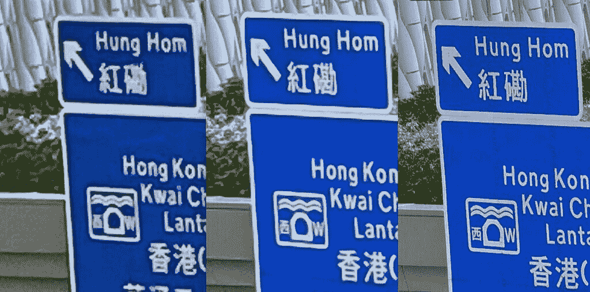

# iPhone 12 vs Pixel 5 相机枪战:苹果的新传感器能打败谷歌的计算能力吗？

> 原文：<https://www.xda-developers.com/apple-iphone-12-vs-google-pixel-5-camera-shootout-comparison/>

当谷歌开始制造 Pixel 时，它可能想到了 iPhone 一款谷歌可以对软件和硬件拥有完全发言权的设备，一款代表最纯粹版本的 Android 的设备，或许会成为默认的 Android 手机。虽然谷歌从未真正实现这一目标 Pixel 从未卖得很好，Pixel 5 实际上已经退出了高端旗舰领域，在较低层次上竞争。但尽管如此，Pixel 5 仍然拥有市场上可以说是最好的主摄像头。随着今年 iPhone 12 和谷歌 Pixel 5 的价格接近，我们认为是时候在苹果和谷歌 2020 年最主流的手机之间进行一场老式的相机大战了，以找出谷歌 Pixel 5 和苹果 iPhone 12 哪个更好？

## 苹果 iPhone 12 vs 谷歌 Pixel 5:规格对比

| 

规范

 | 

苹果 iPhone 12

 | 

谷歌像素 5

 |
| --- | --- | --- |
| **建造** | 

*   铝制中框
*   玻璃正面和背面
*   用于玻璃保护的“陶瓷护罩”

 | 

*   一体式再生铝车身
*   玻璃前部
*   大猩猩玻璃 6

 |
| **尺寸&重量** | 

*   146.7 x 71.5 x 7.4mm 毫米
*   162 克(全球)/ 164 克(美国)

 | 

*   144.7 x 70.4 x 8 毫米
*   151 克

 |
| **显示** | 

*   6.1 英寸超级视网膜 XDR 有机发光二极管显示屏
*   2，532 x 1，170 分辨率，460 PPI

 | 

*   6 英寸有机发光二极管显示器
*   2，340 x 1，080 分辨率，432 PPI

 |
| **SoC** |  |  |
| **存储选项** |  |  |
| **电池&充电** | 

*   2，815 毫安时电池，符合认证列表
*   带 MagSafe 的 15W 无线充电
*   7.5W Qi 无线充电

 | 

*   4，080 毫安时电池
*   12W Qi 无线充电
*   18W 有线充电

 |
| **安全** | Face ID(原深感摄像头面部识别) | 后置指纹传感器 |
| **后置摄像头** | 

*   **主要:** 12MP
*   **次要:** 12MP，超广角

 | 

*   **主:**1220 万像素索尼 IMX363
*   **次要:** 16MP，超广角

 |
| **前置摄像头** | 12MP，f/2.2 | 800 万像素 f/2.0 |
| **端口** | 专有闪电端口 | USB-C |
| **连通性** | 

*   5G:低于 6GHz
*   超宽带
*   支持 2x2 MIMO 的 wi-Fi 6(802.11 ax)
*   蓝牙 5.0

 | 

*   5G:低于 6GHz
*   超宽带
*   wi-Fi 5(802.11 AC)
*   蓝牙 5.0

 |
| **软件** | iOS 14 | 安卓 11 |
| **其他特性** | 

*   IP68
*   颜色:黑色、白色、红色、蓝色、绿色

 | 

*   IP68
*   颜色:绿色、黑色

 |
| **定价** | 起价 799 美元 | 起价 699 美元 |

## 相机:硬件和设计

两款手机都在手机背面左上角的圆形方形模块中配备了双摄像头系统。iPhone 12 主要使用 12MP，f/1.6 镜头拍摄，而 Pixel 5 的主摄像头是 12.2MP f/1.7 传感器。iPhone 12 的超宽镜头是一个 12MP，f/2.4 的传感器，具有 110 度的宽视野。Pixel 5 的超宽同时是一个 16MP，f/2.2 的射手，拥有 107 度的视野。

在正面周围，iPhone 装有另一个用于自拍的 12MP 传感器，它与一系列用于面部扫描的其他传感器一起装在一个巨大的凹槽中。Pixel 5 的 800 万像素自拍摄像头与 iPhone 的宽边框相比只是一个小点。

## 相机应用程序:用户界面和功能

与其他 Android 品牌的相机用户界面相比，这两款相机应用程序的用户界面都相对简单。例如，这两款设备都没有“专业”(手动)模式，因为苹果和谷歌都认为，普通智能手机用户最好只是指向和拍摄，让计算智能处理所有调整。我同意普遍的看法，但作为一个更有经验的用户，我确实怀念在飞行中调整白平衡或快门速度的能力。

苹果和谷歌都认为，普通智能手机用户最好只需指向和拍摄

尽管如此，Pixel 5 的用户界面确实提供了滑块来实时调整高光和阴影，我觉得这比 iPhone 的整体曝光转盘更有用。这两款手机都允许在拍照后进行大量定制。你可以做任何事情，从裁剪，调整对比度，色温。

每部手机都在一个特定的领域擅长拍摄后编辑:Pixel 5 在拍摄后提供卓越的照片编辑，能够应用不同的人像滤镜，甚至在看起来非常真实的脸部周围应用新的人像照明。

与此同时，iPhone 12 的相机应用程序允许实时编辑视频——不仅仅是调整视频长度这样的简单调整，你甚至可以将视频裁剪成不同的纵横比，或旋转方向。所有 Android 手机都需要一个单独的(通常是付费的)视频编辑应用来完成这些事情。

## 苹果 iPhone 12 vs 谷歌 Pixel 5:一般摄影

让我们从第一组开始:这些都是在一致的、稳定到良好的灯光下拍摄的照片——对于任何现代智能手机相机来说，这都是相对容易的拍摄。这一组的重点是看每部手机如何处理色彩科学和细节。记住，本文中的每一组照片都会按这个顺序显示:先显示 iPhone 12，再显示 Pixel 5。由于本文中的照片被略微压缩，我有这个 [Flicker 相册](https://www.flickr.com/photos/190493029@N08/albums/72157716653488522)中所有照片的全分辨率版本。

*照片按这个顺序:先 iPhone 12，再 Pixel 5*

在我的电脑显示器上浏览这些照片，总的主题是 iPhone 12 拉进了光线更好的照片，如果我放大到实际大小，iPhone 12 的照片通常更清晰，噪点更少。例如，在显示“Mamaday”咖啡店的前两张照片中，如果您查看全尺寸图片，您可以在 iPhone 12 图像上比在 Pixel 5 图像上看到咖啡馆的内部略好。同样的还有狗的照片——当我进入 100%视图时，这只狗的脸、皮毛和尾巴在 iPhone 12 的照片上更加详细。

(记住，本文中的每组照片都是按照这个顺序来的:iPhone 12，然后是 Pixel 5)

在红色出租车的夜间拍摄中，两张照片看起来都很棒，各种灯光下的曝光都很合适，但一旦我放大，Pixel 5 的照片在暗点处变得更暗，细节变得柔和，特别是角落的左下角。在 iPhone 12 的照片中，你可以更好地看到路面和轮胎的纹理。

然而，仅仅是在较小的外形尺寸上观看它们——比如说，在手机屏幕上——我通常更喜欢 Pixel 5 的照片，主要是因为我喜欢 Pixel 较冷的色彩科学，而不是苹果过于温暖的色调。

## 苹果 iPhone 12 vs 谷歌 Pixel 5:高对比度拍摄

接下来，让我们试试更有挑战性的东西。这些都是在高对比度的场景中拍摄的，这意味着照片的一部分光线很好，一部分被阴影淹没。iPhone 12 和谷歌 Pixel 5 都是顶级相机，因为这里的每个镜头看起来都很平衡。一个较小的手机摄像头，如中档的摩托罗拉或诺基亚，会吹出的亮点。见鬼，即使是三星大约 2017 年的旗舰相机也会熄灭所有的灯，特别是在我房间的倒数第二组，面对一扇窗户和一个电脑屏幕。

*照片是这样的顺序:先 iPhone 12，再 Pixel 5*

谷歌 Pixel 5 处理高对比度照片的能力略好于苹果 iPhone 12

我认为总体来说，Pixel 5 处理这些镜头的能力比 iPhone 12 好一点。这是有意义的，因为像这样具有挑战性的动态范围的拍摄需要计算摄影技巧，而不是硬件。Pixel 在这方面一直领先，尽管苹果和华为已经缩小了很多差距。不过，每当我放大到一个明亮的区域，像素的曝光似乎只是让我的眼睛更舒服一点。iPhone 12 感觉有点太亮了。

在上面的场景中，窗外的场景在 iPhone 12 的图像上有点褪色。Pixel 5 找到了更好的平衡——我的电脑屏幕的颜色在 Pixel 5 的照片上看起来也稍微好一些。对于下面的镜头，我认为在 Pixel 5 的镜头上，阳光充足的部分有更多鲜艳的颜色。

## 苹果 iPhone 12 vs 谷歌 Pixel 5:主摄像头夜拍

接下来，用主 1x/主摄像头进行夜间拍摄。我不愿意称这些为“低光镜头”，因为香港，即使在晚上，也是一个非常明亮的城市。相机也同意我的看法，因为 iPhone 12 和 Pixel 5 在昏暗的环境下拍摄时都会自动打开夜间模式，而夜间模式只在最后一组中打开。相反，我有一个单独的部分来真正淡化文章。

*照片是这样的顺序:先 iPhone 12，再 Pixel 5*

总的来说，我更喜欢 Pixel 5 几乎每一个镜头的色彩科学。尤其是第三组两个街道标志。有一些关于像素颜色科学的东西吸引了我，天空特别蓝，阴影特别忧郁。当然，这都是主观的。

## 苹果 iPhone 12 vs 谷歌 Pixel 5:超宽相机上的夜拍

由于智能手机超广角相机必须覆盖如此宽的画布，并且传感器比主相机小，因此在太阳下山后，图像质量往往会大幅下降。iPhone 12 和 Pixel 5 都通过自动进入夜间模式来解决这个问题。

*照片按这个顺序:先 iPhone 12，再 Pixel 5*

结果相当可观。像素 5 的图像趋于更亮和更均匀；但 iPhone 12 的图像噪音更少，视角更广、更独特。这两款相机拍摄的照片都不能放大很多，因为细节都相对柔和。然而，我认为超广角相机的目的是展示整个场景，那么谁会放大呢？这是一场势均力敌的比赛，我想我可能会给 Pixel 5 一点胜利。

## 肖像/散景

我预计这一次 Pixel 5 会轻松获胜，因为最后几个像素产生了绝对最佳的人像照片(又名散景图像)，模糊的景深效果看起来比其他手机更自然，以及主体周围的边缘检测也更好。但令我惊讶的是，iPhone 12 一直保持在这里，只是在咖啡的散景拍摄中明显失利。这是 iPhone 的一个巨大飞跃，因为即使在去年的 iPhone 11 上，我也发现散景效果只对人类有效，对其他人无效。

*照片按这个顺序:先 iPhone 12，再 Pixel 5*

走近一看，我可以看到 Pixel 5 的边缘检测功能在我的头发周围，皱巴巴的纸灯看起来稍微更自然一些。然而，我并不喜欢 Pixel 如何重建我的皮肤。

我认为总体上我更喜欢 iPhone 的人像，尽管人工散景效果稍差。但对于无生命的物体，Pixel 5 的拍摄效果显然更好。

## 苹果 iPhone 12 vs 谷歌 Pixel 5:自拍

iPhone 12 和 Pixel 5 都可以拍摄出优秀的、逼真的自拍，最后一部分(逼真)是好是坏取决于你的个人喜好。你也可以拍摄标准自拍或选择人工散景，效果也相当自然。总的来说，iPhone 12 照亮了我的脸，但我喜欢 Pixel 5 自拍中我脸上阴影的忧郁氛围。在最后一组中，我在一辆有点暗的出租车里逆光拍摄，两者都很好地曝光了窗外的场景。我真的不知道谁是赢家——胜负难分。

## 变焦镜头

iPhone 12 和 Pixel 5 都没有专用的光学变焦摄像头，所以你得到的只是数字变焦。iPhone 12 的最大值只有 5 倍，而 Pixel 5 可以达到 7 倍。下面的第一张图是 1x 的照片，供参考。然后，我们看看这两款手机在 2 倍和 5 倍时能做些什么。由于这些完全是数字变焦，谷歌卓越的计算摄影再次胜出也就不足为奇了，因为 Pixel 5 的 5 倍变焦显然比 iPhone 12 糟糕的 5 倍变焦要好。谷歌将其变焦技术宣传为“超分辨率变焦”，这种技术采用多帧捕捉技术来提取额外的细节——它确实有效。

但是，公平地说，作为一个在 2020 年使用过一堆中国手机的人，iPhone 和 Pixel 的变焦镜头都没有打动我。华为 Mate 40 Pro 的 5X 变焦让这些变得不可思议。

 <picture></picture> 

5x zoom shots with the iPhone 12 (left), Pixel 5 (middle) and Mate 40 Pro (right).

## 极弱光拍摄

这些镜头是在非常黑暗的场景中拍摄的。第一个场景是在香港为数不多的黑暗小巷中拍摄的，而第二个场景是晚上在我的卧室里拍摄的，所有的灯都关了，只有窗外的一些光线。在我看来，这一幕几乎是漆黑一片。当然，这两款手机拍摄这些照片时都开启了夜间模式。

*照片按这个顺序:先 iPhone 12，再 Pixel 5*

由于这两种拍摄都严重依赖于计算摄影，在人眼甚至看不到的地方人工插入光线，所以放大和像素偷窥没有太大意义，因为两者在细节上都非常柔和。直到几年前，当华为率先推出华为 P20 Pro 的夜间模式时，这些镜头才可能被任何移动设备捕捉到。

然而，如果我必须判断这些照片，我会说像素保持了更自然的颜色，更接近真实生活，但 iPhone 12 的照片噪音和伪像更少。

## 苹果 iPhone 12 vs 谷歌 Pixel 5:视频

下面的剪辑中收集了几个视频，包括在移动的面包车上拍摄的白天剪辑，晚上的步行剪辑，以及在相对较低的光线条件下的自拍 vlog 测试。iPhone 12 几乎在每一个片段中都有更好的稳定性，在白天有更好的颜色，但在晚上，Pixel 5 的镜头在我眼中有更悦目的颜色。在动态范围和曝光方面，这是一个掷硬币，iPhone 12 以微弱优势获胜，如果我必须选择的话。在自拍视频剪辑过程中，Pixel 5 在拾取我的声音方面做得更好，尽管 iPhone 12 的声音“更饱满”。在像素剪辑中，我的声音更大，更容易听到，但也是平的。在 iPhone 12 片段中，我的声音被环境噪音淹没，但你听到我声音中更多的低音。看看他们，自己决定吧。

## 结论:软件是相机最重要的部分

苹果和谷歌再次证明，对于移动相机来说，软件甚至比硬件更重要，因为尽管这两款手机在像素数量或传感器尺寸方面拥有非常普通的相机硬件，但它们仍然可以算作市场上最好的相机之一。当然，一部[三星 Galaxy Note 20 Ultra](https://www.xda-developers.com/samsung-galaxy-note-20/) 或华为 Mate 40 Pro 可以在这些相同的测试中与这两款手机短兵相接(在某些情况下，甚至可以击败)，但三星和华为正在使用更强大的硬件，如更大的传感器和更多的像素(因此，也有更高的定价)。

谷歌在制作人像照片方面的软件智能仍然是同类中最好的，苹果的视频录制能力仍然领先于其他所有人。但这两款相机对大多数人来说如此伟大的原因在于它的易用性。相机应用程序易于导航，没有三星或华为相机 UI 的杂乱，对焦速度很快。在色彩科学方面，iPhone 12 和 Pixel 5 的所有照片也是一致的，这一点我对其他任何安卓手机都不敢肯定。

谷歌在制作人像照片方面的软件智能仍然是同类中最好的，苹果的视频录制能力仍然领先于其他所有人。

总的来说，如果我必须选择一个相机冠军，我会选择 Pixel 5，因为我更喜欢它的颜色科学。但这完全是个人喜好。

 <picture></picture> 

Apple iPhone 12

##### 苹果 iPhone 12

与去年的 iPhone 相比，iPhone 12 的摄像头在硬件上略有改进，但由于采用了 5 纳米 SoC，苹果已经加快了计算摄影的步伐。

 <picture></picture> 

Google Pixel 5

Pixel 5 的相机硬件可能已经老了，但谷歌的计算摄影能力仍然是业内最好的——尽管竞争对手正在迎头赶上。