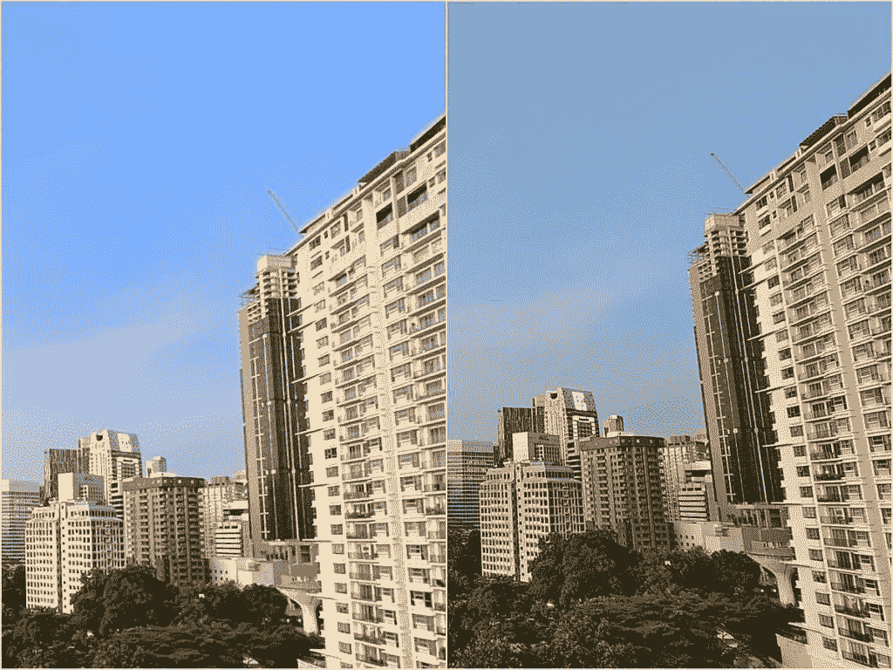
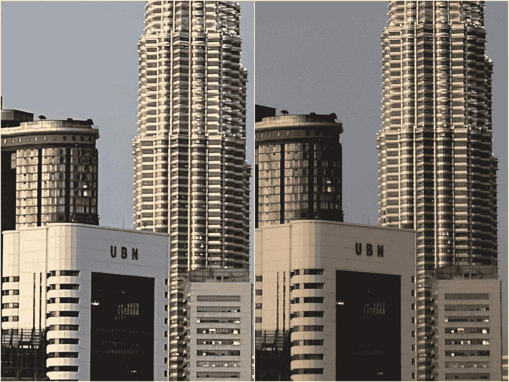
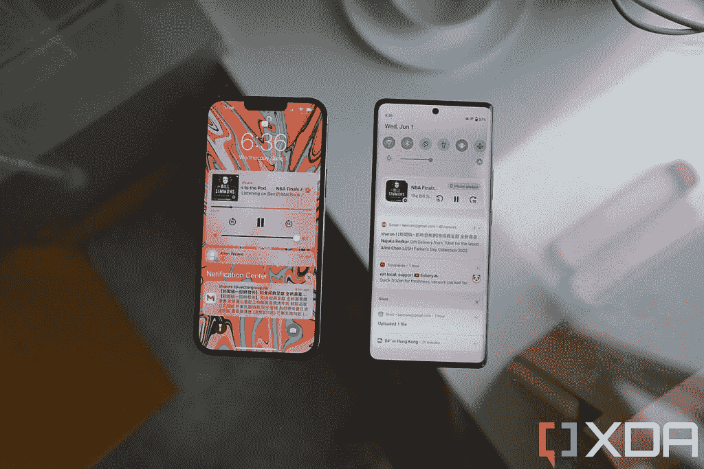

# 苹果 iPhone 13 Pro Max vs Vivo X80 Pro:愿最好的相机胜出！

> 原文：<https://www.xda-developers.com/apple-iphone-13-pro-max-vs-vivo-x80-pro/>

Vivo X80 Pro 是最新上市的 Android 旗舰产品，在与 Galaxy S22 Ultra 的[对决中，它不仅保持了自己的优势，而且可以说赢了。](https://www.xda-developers.com/samsung-galaxy-s22-ultra-vs-vivo-x80-pro/)因此，我们很自然地将 X80 Pro 与另一个主流大牌挑战者进行比较: [iPhone 13 Pro Max](https://www.xda-developers.com/apple-iphone-13-pro-max-review/) 。

 <picture></picture> 

iPhone 13 Pro

##### 苹果 iPhone 13 Pro Max

iPhone 13 Pro Max 是苹果在移动领域提供的最大、最差的产品。它拥有世界上最强大的移动 SoC 和令人印象深刻的摄像头。

 <picture></picture> 

Vivo X80 Pro

##### Vivo X80 Pro

Vivo X80 Pro 是目前所有智能手机中我们投票选出的最佳主摄像头，其余部分也非常好。

## 苹果 iPhone 13 Pro Max vs Vivo X80 Pro:规格

| 

规范

 | 

Vivo X80 Pro

 | 

苹果 iPhone 13 Pro Max

 |
| --- | --- | --- |
| **构建** | 

*   铝制中框
*   大猩猩玻璃 Victus 回
*   大猩猩玻璃 Victus 正面

 | 

*   不锈钢中框
*   玻璃背面
*   陶瓷屏蔽玻璃正面

 |
| **尺寸&重量** | 

*   164.6 x 75.3 x 9.1 毫米
*   219 克

 | 

*   160.8 毫米 x 78.1mm 毫米 x 7.65mm 毫米
*   240 克

 |
| **显示** | 

*   6.78 英寸 AMOLED
*   3200 x 1440 像素
*   高达 120Hz 的可变刷新率

 | 

*   6.7 英寸超级视网膜 XDR 有机发光二极管
*   促销刷新率在 10Hz 和 120Hz 之间

 |
| **SoC** | 

*   高通骁龙 8 代 1

 |  |
| **闸板&存放** |  | 

*   6GB
*   128GB/256GB/512GB/1TB

 |
| **电池&充电** | 

*   4700 毫安时
*   80W 有线快速充电(充电器包含在包装盒中)
*   50W 无线充电

 | 

*   4373 毫安时
*   20W 有线快速充电
*   7.5W 无线充电
*   15W MagSafe 无线充电
*   大多数地区包装盒中没有充电器

 |
| **安全** | 超声波显示指纹扫描仪 | Face ID |
| **后置摄像头** | 

*   **初选:** 50MP 宽，三星 GNV，f/1.57，1/1.31”，OIS
*   **次要:** 48MP 超宽，索尼 IMX 598，f/2.2，万向节技术
*   **第三:** 12MP 长焦，索尼 IMX 663，f/1.6，2x 光学
*   **四元:** 8MP 潜望镜，f/3.4，5 倍光学变焦

 | 

*   **初级:** 12MP 宽，f/1.5 光圈，1.9μm
*   **次要:** 12MP 超宽，f/1.8 光圈
*   **第三:** 12MP 长焦，3 倍光学变焦，f/2.8
*   **四季:**激光雷达相机

 |
| **前置摄像头** | 32MP | 12MP |
| **端口** | USB-C | 闪电 |
| **音频** | 立体声扬声器 | 立体声扬声器 |
| **连通性** | 

*   5G(毫米波)
*   支持 2x2 MIMO 的 Wi-Fi 6 (802.11ax)
*   蓝牙 5.2
*   国家足球联盟

 | 

*   5G(低于 6 GHz 和毫米波)
*   支持 4×4 MIMO 和 LAA 的千兆级 LTE
*   支持 2×2 MIMO 的 Wi-Fi 6 (802.11ax)
*   蓝牙 5.0

 |
| **软件** | 安卓 12 之上的 FunTouchOS 12 | iOS 15 |
| **其他功能** | 

*   双物理 SIM
*   红外线增强器

 | 双物理 SIM 或双 eSIM 支持 |

***关于本文:**这个对比是在测试了孔提供的一台 iPhone 13 Pro Max 和 Vivo Global 提供的 Vivo X80 Pro 之后写的。本文还包括 XDA 主编 Aamir Siddiqui 使用他个人的 iPhone 13 Pro 和 Vivo India 提供的 X80 Pro 提供的信息。Vivo India 还带着 Aamir 和其他印度媒体人以及 YouTubers 去迪拜参加了一个以手机为中心的沉浸式会议。Vivo 也围绕这款手机在 XDA 开展了一项活动，但这是由独立于编辑团队的赞助团队处理的。三星和 Vivo 在这篇文章中都没有任何投入。*

* * *

## 苹果 iPhone 13 Pro Max vs Vivo X80 Pro:设计和硬件

除非你刚从昏迷中醒来，否则我没有太大的必要用文字来描述 iPhone 13 Pro Max 的样子吧？这是一款大而笨重的旗舰产品，前后都是玻璃，侧面是不锈钢的——后一部分给了手机厚重的砖块般的感觉。在我看来，苹果的扁平盒状设计看起来不错，给了手机一种权威的机器氛围，这与大多数安卓旗舰产品形成了对比，大多数安卓旗舰产品都被温和的曲率所包裹。Vivo X80 Pro 绝对符合这种氛围，它的玻璃背面有一层柔软的磨砂涂层，用我的手摸起来像丝一样光滑。

人们普遍认为 iPhone 13 Pro Max 太大，拿起来不舒服

我个人不喜欢这两款手机的手感:我不喜欢 Vivo 光滑的磨砂背面，iPhone 13 Pro Max 的平坦侧面导致棱角分明的角落钻入我的手掌。当然，这些只是我的观点，但我确实认为 iPhone 13 Pro Max 太大了，拿起来不舒服是一个广泛的观点。阿米尔确实认为 Vivo X80 Pro 非常符合他的口味，同时也对 iPhone 的块状设计有同样的担忧。

两个屏幕看起来都很棒——华丽、充满活力的有机发光二极管面板达到了 120 赫兹的峰值刷新率。在我看来，iOS 比 Vivo 的 FunTouchOS 更好地处理 120Hz，因为 iPhone 的动画在我看来更流畅。最大屏幕亮度大约是均匀的。Vivo X80 Pro 的屏幕没有那么糟糕，与 iPhone 13 Pro Max 的缺口相比，只有一个小的打孔切口，所以在 Vivo X80 Pro 上观看全屏视频更令人愉快。

不过，这是有原因的，因为它不仅有一个 1200 万像素的自拍相机，还有苹果的原深感摄像头系统——一系列可以 3D 映射我们面部的传感器，用于安全的面部识别。Vivo 的打孔相机只是一个普通的自拍相机，但像素密度更高的 32MP 相机。Vivo 依靠高通的 3D Sonic Max 解决方案来实现其光学指纹传感器:因此，与大多数 Android 设备相比，你可以获得更宽的指纹感应区域，具有双指纹感应的能力，以及更快的设置和识别。Vivo 出色地实现了这一点，所以你不太可能错过 iPhone 13 Pro 的人脸识别。

为这些手机提供动力的是苹果和高通的最新 SOC:iPhone 13 Pro Max 的 A15 Bionic 和 X80 Pro 的骁龙 8 Gen 1——尽管苹果的芯片在技术上是 2021 年的芯片，但它仍然比 2022 年的高通芯片更强大，但这种差异只会在渲染视频等更复杂的任务中才会被注意到。

苹果没有透露内存配置或电池大小，但拆机显示，iPhone 13 Pro Max 配备了 6GB 内存和 4，352 毫安时电池，比 Vivo X80 Pro 提供的内存(12GB 内存和 4，700 毫安时电池)要少，但现实世界的结果并没有反映这一点。由于苹果比几乎任何安卓手机都有更好的硬件和软件协同，iphone 可以在性能上更有效，因此需要更少的内存或更小的电池。我将在性能部分更详细地介绍这一点，但剧透一下 iPhone 13 Pro Max 的电池寿命比 Vivo X80 Pro 更好。

这两款手机都具备旗舰智能手机的所有优点:立体声扬声器、IP68 防水防尘、出色的触觉和无线充电。iPhone 13 Pro Max 的扬声器和触觉明显优于 Vivo X80 Pro，但反过来，Vivo 在充电方面取得了重大胜利——无论是有线还是无线，它都可以以快得多的速度充电，Vivo 在包装中包括了充电器。

* * *

## 苹果 iPhone 13 Pro Max vs Vivo X80 Pro:相机

对于光学，iPhone 13 Pro Max 封装了一个简单的三重 12MP 镜头设置，覆盖了超宽、广角和长焦焦距。除了苹果的深度融合图像处理算法和自动开启的夜间模式，这款 iPhone 相机没有太多的技巧或噱头——没有像素宁滨，也没有专业的侧镜头。Vivo X80 Pro 做得更多，它有一个四镜头系统，包括两个光学变焦长度的双变焦镜头，其中一个镜头由一个微型万向节系统支撑。每块玻璃上都有蔡司 T 型涂层，因此它们减少了镜头眩光，主摄像头和超宽摄像头都使用像素宁滨技术，以实现更大的微米像素尺寸。在 Vivo 的相机硬件拍摄照片和照片出现在照片库中之间有更多的处理。Vivo 专有的 V1+是一种专用的成像芯片，专门用于处理图像处理。苹果也有自己的图像处理硬件，它只是 A15 仿生的一部分。

让我们首先检查所有镜头的照片一致性。在下面一组相对理想的光线条件下拍摄的照片中，我们可以看到 iPhone 在保持主镜头和超宽镜头之间的色温一致方面做得更好，而 Vivo 在天空的阴影中表现出一些偏差。两台主相机都拍摄出了一张清晰、对比度适中、色彩准确的出色照片。即使当我放大到 100%像素窥视，这是一个虚拟的领带。其他镜头就不是这样了。

在超宽镜头中，如果我放大 100%，我可以看到 iPhone 的超宽在边缘处有很多软件——这并不令我惊讶，因为 Vivo X80 Pro 的超宽像素密度更高，并使用了更大的图像传感器尺寸。超广角镜头之间的图像清晰度差异在夜间应该更明显，这标志着 Vivo 的胜利。

 <picture></picture> 

100% crops, ultra-wide shots, iPhone 13 Pro Max (left) and X80 Pro (right).

然而，iPhone 13 Pro 的 3 倍变焦真的很好——可能是业内最好的长焦变焦镜头。在下面的裁剪中，我拍了一张 iPhone 3x 倍变焦的照片，通过打孔使画面更接近 Vivo 的 5 倍潜望镜变焦镜头，我们可以看到两张照片的图像清晰度几乎相同，而 X80 Pro 的照片噪音稍微小一些。但如果我们真的将变焦水平提高到 15 倍，那么 X80 Pro 的拍摄会更清晰一些，因为归根结底，拥有潜望镜技术总是比没有好。

 <picture></picture> 

Crops of a 3x iPhone 13 Pro Max shot (left) and a 5x X80 Pro shot (right).

但上述场景被认为是现代智能手机容易拍摄的，如果我们转向更具挑战性的场景，如弱光条件或逆光，那么我们开始看到 Vivo 的卓越硬件取得了一些明显的胜利。在下面的设置中，我们可以看到现在是 iPhone 在主摄像头和超宽摄像头之间显示出颜色科学的偏差，因为 iPhone 13 Pro Max 的超宽摄像头本身并没有自然地吸收大量光线，它需要使用两秒钟的长夜模式来产生镜头。Vivo 的超宽相机有一个更大的图像传感器，并使用像素宁滨技术，所以它可以正常拍摄下面的照片，就像在白天拍摄一样。

*iPhone 13 Pro Max 以上，Vivo X80 Pro 以下*

如果我们移动到更低的光线场景，如下面由 Aamir 在黎明前的清晨拍摄的场景，我们可以看到 Vivo X80 Pro 能够更好地为天空和火焰找到合适的曝光。

一般来说，Vivo X80 Pro 拍摄的照片更亮，如果我们放大，会更详细

当我去年秋天[评测 iPhone 13 Pro](https://www.xda-developers.com/apple-iphone-13-pro-review/) /Pro Max(它们有完全相同的相机系统)时，我注意到 iPhone 真的很难曝光，经常在对比强烈的场景中吹出明亮的光源，我认为苹果的软件更新已经解决了一些问题，因为 iPhone 13 Pro Max 在下面拍摄窗外阳光明媚的城市景观时表现得令人惊讶。但总的来说，Vivo X80 Pro 拍摄的照片更亮，如果我们放大，更详细。

我确实认为 iPhone 13 Pro Max 拍摄的人像照片更具美感，因为 iPhone 的 3 倍长焦变焦镜头非常好，但除此之外，对于几乎所有的静态照片情况，我更喜欢 Vivo X80 Pro 的相机。

对于视频，Vivo X80 Pro 的主摄像头与长期视频冠军 iPhone 的视频镜头相比保持得非常好，但后者仍然获胜，因为 iPhone 13 Pro Max 可以在拍摄过程中无缝切换所有三个镜头。Vivo X80 Pro 不能-如果你开始用主相机拍摄，那么你不能切换到超宽，任何变焦都是数字变焦。

尽管如此，Vivo X80 Pro 引入了一种新的“电影肖像”视频模式，可以说它与 iPhone 13 Pro Max 自己的电影模式一样好。

总的来说，我想说 Vivo X80 Pro 的摄像头系统有更高的天花板，但也有更低的地板，这意味着当 Vivo 表现出色时，它非常非常好，但有一些基本的东西，比如在拍摄视频时切换镜头的能力，Vivo 仍然没有做好。iPhone 13 Pro Max 是功能更强的摄像机，拥有更好的长焦变焦镜头。但差异非常小，两者都是令人惊叹的相机，不会让最终用户失望。

* * *

## 苹果 iPhone 13 Pro Max vs Vivo X80 Pro:软件

这又是一场 iOS 与 Android 的对决，我想大多数读者都已经有了自己的看法。但这里是我的看法:我一直更喜欢 Android 而不是 iOS，因为前者更具可定制性，允许我做更多的事情(如[轻松下载应用](https://www.xda-developers.com/how-to-sideload-install-android-app-apk/)，或将文件保存在适当的文件系统中)，但我知道 iOS 更完善，周围有更好的硬件生态系统和第三方应用生态系统。

 <picture></picture> 

iOS 15 on the iPhone 13 Pro Max and FunTouch 12 on the Vivo X80 Pro.

当我同时测试这两款手机时，这种感觉确实存在。Vivo 的 FunTouch OS 是高度可定制的，允许我改变从主屏幕移动到指纹动画的所有动画。我也喜欢在浮动窗口中打开应用程序，我经常这样做。后一部分是我大部分时间将 Android 手机作为日常驾驶的主要原因——我希望能够在手机上执行多任务。iPhone 13 Pro Max 的屏幕很大，无法一次显示多个应用程序，这令人沮丧。

然而，iOS 被一个更加完善的生态系统所包围，这是 Android 和 Vivo 仍然无法比拟的。我说的不仅仅是与其他苹果设备的协同作用，比如我可以在 iPhone 上录制语音备忘录，几秒钟后同一片段就会出现在我的 iPad 上，或者我可以在 iPhone 上直接访问我的 MacBook 的主屏幕文件——这些都是很棒的功能，但需要你购买更多的苹果硬件。但即使你没有任何其他苹果硬件，你仍然可以从 iPhone 上获得比安卓手机更好的应用支持中受益。如果你只使用最受欢迎的、全球通用的应用程序，这一点并不明显——脸书和 Twitter 在 Android 上的运行和在 iPhone 上一样好。但如果你使用较小的地区性应用，比如香港的银行应用、新加坡的酒店入住应用或意大利的打车应用，那么很有可能*的 iOS 版应用运行得更好。*

iOS 被一个更加完美的生态系统包围，这是 Android 和 Vivo 仍然无法比拟的

这意味着即使我的主 SIM 卡在一年的大部分时间里都在一部 Android 手机中，但由于优越的应用程序情况，我总是在附近有一部 iPhone。这在短期内不可能改变。

* * *

## 苹果 iPhone 13 Pro Max vs Vivo X80 Pro:性能和续航

众所周知，iPhone 13 Pro Max 中的苹果 A15 仿生芯片比 Vivo X80 Pro 中的高通骁龙 8 Gen 1 芯片更强大，基准测试数据再次证明了这一点。但问题是，[骁龙 8 代 1](https://www.xda-developers.com/qualcomm-snapdragon-8-gen-1/) 是*仍然是一个非常强大的*芯片，所以在我的大多数日常使用中，我真的没有看到性能上的差异，这不像 iPhone 13 Pro Max 启动应用程序更快或能够更快地处理语音命令。

我注意到的是编辑视频——我拍摄了很多视频剪辑，在上传到 Instagram 之前，我通常会对剪辑进行快速修剪和偶尔的裁剪(直接在手机的原生照片库应用程序中),渲染过程在 iPhone 13 Pro Max 上大多数时间都是即时的，但在 Vivo X80 Pro 上需要等待 10 秒钟。同样，当我通过 Insta360 的应用程序导出 360 视频时，在 iPhone 上的过程也比在任何一款 [2022 安卓旗舰](https://www.xda-developers.com/best-android-phones/)上快得多。

苹果 A15 仿生芯片比骁龙 8 Gen 1 更强大，但在大多数日常任务中你不会注意到它

其他一般性能方面也有利于 iPhone:苹果的设备有更响亮、更全面的扬声器设置，更好的触觉，更好的电池寿命。事实上，iPhone 13 Pro Max 可能是我过去几年测试过的所有手机中电池续航时间最好的——我可以完成整整 12 到 13 个小时的工作，剩余电量远远超过 30%。120Hz 屏幕时代还没有安卓旗舰手机能做到这一点。尽管如此，Vivo X80 Pro 通常也能持续一整天 12-13 个小时(只是最后剩下的电池更少)，所以这对我来说不是什么大问题。不管我是带着剩余 32%还是 17%的电池回家，都没有那么重要。此外，Vivo X80 Pro 充电速度快得多，并且包括充电器，因此这些都是实实在在的胜利。

* * *

## 苹果 iPhone 13 Pro Max vs Vivo X80 Pro:哪款手机更好？

如果你在家记录分数，我得到了 Vivo X80 Pro 在摄影、工作效率方面的软件和观看内容的显示沉浸感方面的胜利。但 iPhone 13 Pro Max 是一款更好的摄像机，电池寿命更长，对于重度游戏或编辑/渲染视频等密集型任务来说更强大。

还有价值因素，这可以说是 Vivo 的一个胜利:iPhone 13 Pro Max 和 Vivo X80 Pro 在世界大部分地区的价格都在 1100 美元左右，但 Vivo 的手机配有屏幕保护器、漂亮的人造革外壳、有线耳塞和快速充电器。在像印度这样的地区，iPhone 13 Pro Max 和 Vivo X80 Pro 之间的差价超过 640 美元(如果你比较 256GB 的变种，大约为 750 美元)，在这一点上，Vivo X80 Pro 凭借纯粹的价值轻松获胜。

但最终，这整个对比主要是爱好者或好奇者的一次练习，因为现实是 iOS 用户可能不会心血来潮地跳到 Android，而 iPhone 13 Pro Max 对于包括美国在内的世界主要地区来说更容易购买。但是，如果你正在市场上购买一部新手机，并且 Vivo X80 Pro 在你所在的地区有售，你至少可以知道你正在购买一部顶级的高级 Android 手机，拥有最好的静态照片相机。

 <picture></picture> 

iPhone 13 Pro

##### 苹果 iPhone 13 Pro Max

iPhone 13 Pro Max 是苹果在移动领域提供的最大、最差的产品。它拥有世界上最强大的移动 SoC 和令人印象深刻的摄像头。

 <picture></picture> 

Vivo X80 Pro

##### Vivo X80 Pro

Vivo X80 Pro 是目前所有智能手机中我们投票选出的最佳主摄像头，其余部分也非常好。