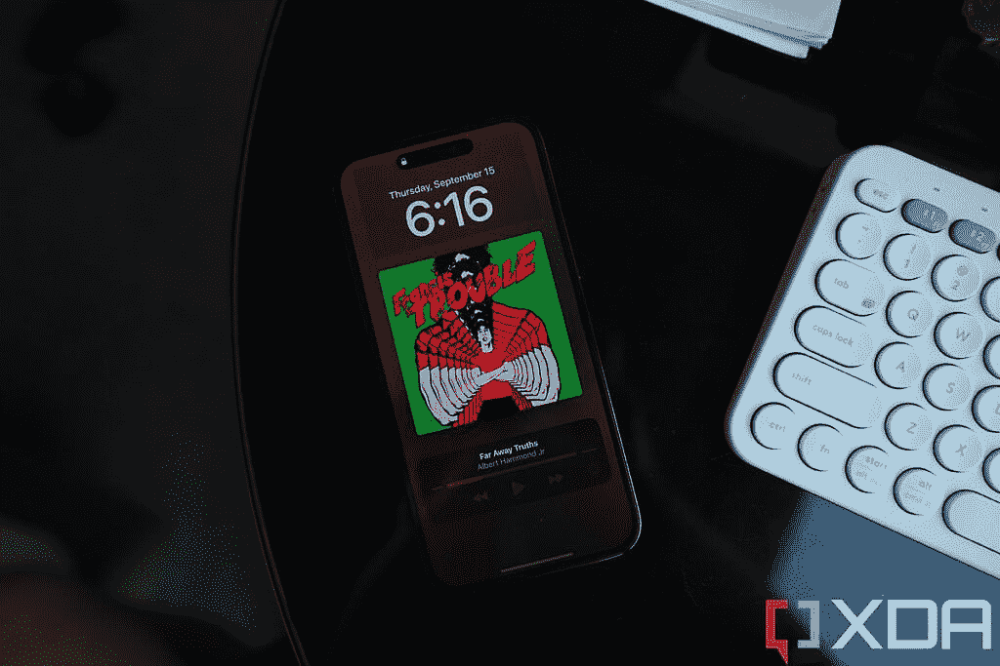
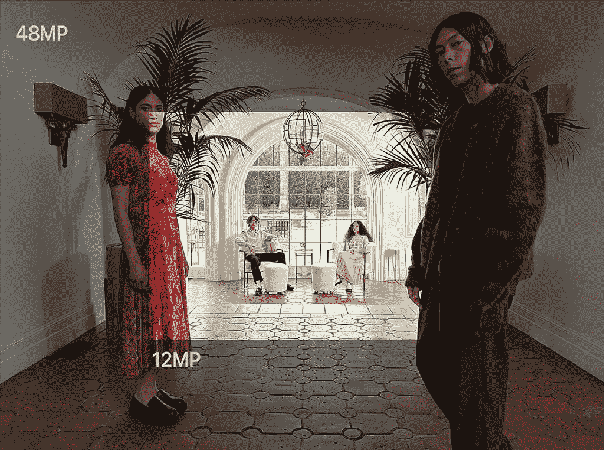
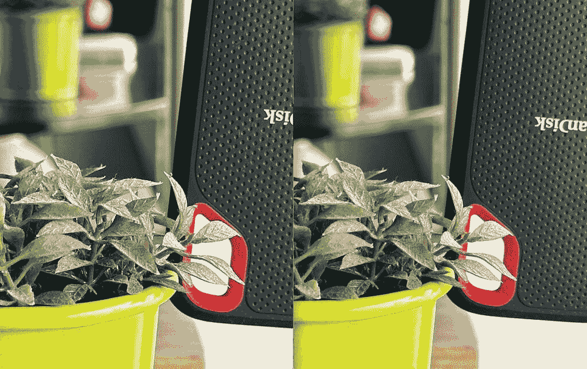
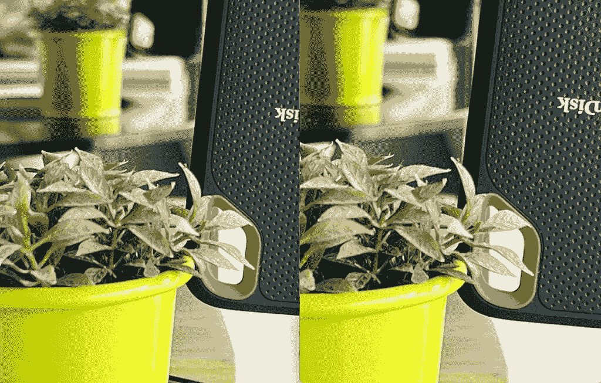
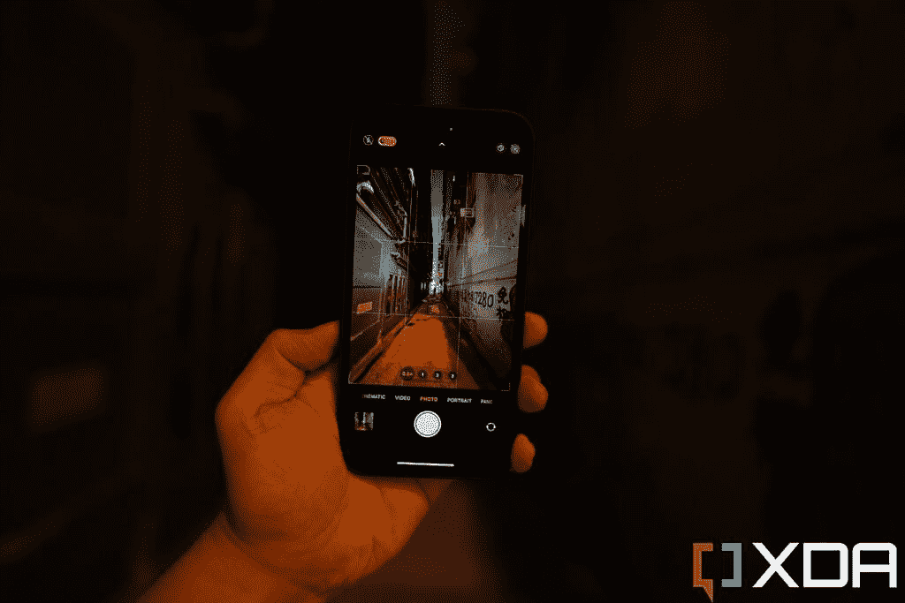

# 苹果 iPhone 14 Pro Max 评测:迄今为止最“专业”的 iPhone

> 原文：<https://www.xda-developers.com/apple-iphone-14-pro-max-review/>

自 2019 年的 iPhone 11 系列以来，苹果一直在推出“专业”iPhone，但直到今年的 iPhone 14 Pro 手机，它才真正在专业和非专业 iPhone 之间进行了有意义的区分。这种分离在一定程度上要归功于真正的创新:iPhone 14 Pro 和 Pro Max 引入了一种全新的用户界面，这种界面在过去几周内已经在科技行业引发了讨论，并且很有可能在不久的将来引发 Android 手机用户界面的彻底变革。Pro iPhones 还为 iPhone 引入了有史以来像素密度最高的相机，这种相机开辟了一种新的光学变焦长度，并提高了专业人士在照片编辑方面的能力。

然而，另一个分离因素是由于残酷的商业策略:苹果决定回收去年的硅用于标准的 [iPhone 14](https://www.xda-developers.com/apple-iphone-14/) 设备，因此只有 iPhone 14 Pro 和 Pro Max 获得新的 A16 仿生芯片。

这些决定应该会让专业版 iPhones 比前几年更受欢迎，对消费者来说，好消息是，苹果基本上兑现了宣传。我已经使用 iPhone 14 Pro Max 八天了，这是[苹果在一段时间内发布的最好的 iPhone](https://www.xda-developers.com/best-iphone/)，也是最值得“Pro”称号的一款。然而，对我来说，最大的问题是，它是否有足够的改进，让我不再偏爱[安卓和可折叠手机](https://www.xda-developers.com/best-phones/)。

顺便说一下:除了屏幕和电池尺寸，iPhone 14 Pro 和 iPhone 14 Pro Max 都是一样的。因此，尽管我只测试了 14 Pro Max，但这篇评论的大部分内容也适用于较小的 iPhone 14 Pro。

## 苹果 iPhone 14 Pro 和 Pro Max:价格和可用性

iPhone 14 Pro 和 Pro Max，以及标准的 iPhone 14，现在可以在世界各地的苹果商店和零售商那里买到。价格在下面，但是总会有来自不同零售商的[交易](https://www.xda-developers.com/best-apple-iphone-14-deals/)。

*   iPhone 14 Pro Max 128 GB 存储起价 1099 美元，1TB 存储最高 1599 美元
*   iPhone 14 Pro 128 GB 存储起价 999 美元，1TB 存储最高 1499 美元

* * *

## iPhone 14 Pro 和 14 Pro Max:规格

|  | 

iPhone 14 Pro

 | 

iPhone 14 Pro Max

 |
| --- | --- | --- |
| **处理器** |  |  |
| **正文** | 

*   147.5 x 71.5 x 7.85 毫米
*   206 克

 | 

*   160.7 x 77.6 x 7.85 毫米
*   240 克

 |
| **显示** | 

*   6.1 英寸 Super Retina XDR 显示屏
*   2556 x 1179 像素分辨率，460 ppi
*   支持 HDR、推广技术(120Hz)、True Tone 技术、始终显示、动态岛和 2000 尼特最大亮度。

 | 

*   6.7 英寸 Super Retina XDR 显示屏
*   2796 x 1290 像素分辨率，460 ppi
*   支持 HDR、推广技术(120Hz)、True Tone 技术、始终显示、动态岛和 2000 尼特最大亮度。

 |
| **摄像机** | 

*   专业后置摄像头系统:
    *   主:48MP，1.78
    *   超宽:12MP，2.2 英寸
    *   长焦:12MP，1.78

*   TrueDepth 前置摄像头:12MP，1.9

 | 

*   专业后置摄像头系统:
    *   主:48MP，1.78
    *   超宽:12MP，2.2 英寸
    *   长焦:12MP，1.78

*   TrueDepth 前置摄像头:12MP，1.9

 |
| **内存** |  |  |
| **电池** | 

*   长达 75 小时的音频播放

 | 

*   长达 95 小时的音频播放

 |
| **连通性** |  |  |
| **电阻** |  |  |
| **安全** |  |  |
| **操作系统** |  |  |
| **颜色** | 

*   太空黑
*   银
*   金色的
*   深紫乐队

 | 

*   太空黑
*   银
*   金色的
*   深紫乐队

 |
| **材料** | 

*   玻璃背面
*   不锈钢框架

 | 

*   玻璃背面
*   不锈钢框架

 |
| **价格** |  |  |

***关于这篇评测:*** 苹果给我提供了一台 iPhone 14 Pro Max 进行测试。该公司在这篇文章中没有任何投入。

* * *

## 苹果 iPhone 14 Pro Max:设计和硬件

*   几乎与 iPhone 13 Pro Max 相同的尺寸、结构和手感
*   业界最亮的屏幕——即使在最强烈的阳光下也能完美使用

尽管 iPhone 14 Pro Max 比 iPhone 13 Pro Max 带来了几项重大的硬件改进，但新手机的外观和感觉与上一代产品非常相似。除了几毫米和几克之外，整体尺寸几乎相同，同样的“陶瓷护罩”(强化玻璃)和不锈钢侧面包裹着新型号。所有的按钮和警告滑块都在原来的位置。换句话说，如果你拿过或近距离看过一部 [iPhone 13 Pro Max](https://www.xda-developers.com/apple-iphone-13-pro-max-review/) (见鬼，甚至是一部 iPhone 12 Pro Max)，14 Pro Max 会觉得非常熟悉。

重量为 240 克，宽度为 77.6 毫米(三英寸多一点)，客观上来说，这是一款大手机，由于侧面坚硬平坦，它甚至比三星 Galaxy S22 Ultra 更难拿。如果你正在考虑 14 Pro Max，但之前没有拿过 12 或 13 Pro Max，我建议你在商店里检查一下这款设备，看看你是否能处理大批量。如果不是，标准的 iPhone 14 Pro 更容易管理，重量为 206 克，宽度为 71.5 毫米(约 2.8 英寸)。请注意，带有尖角的平边会扎进你的手掌，所以我建议你使用这款手机[和一个好的外壳](https://www.xda-developers.com/best-apple-iphone-14-pro-max-cases/)。

当然，最大的视觉变化是[备受讨论的药丸形切口，](https://www.xda-developers.com/apple-dynamic-island-editorial/)取代了凹口，成为容纳苹果原深感摄像头系统的手段。到目前为止，几乎每个阅读这篇文章的人都知道苹果公司已经设计了一个名为“动态岛”的交互式用户界面，它给人一种切口可以改变形状和大小的错觉。动态岛更多的是一个软件特性，所以我将在下面适当的部分讨论这个问题。

### 显示

6.7 英寸的有机发光二极管显示器今年明显更亮，亮度高达 2000 尼特。这是迄今为止任何智能手机中最亮的显示屏，它如此明亮，以至于当你在室内使用它时，你可能不需要超过 25%的亮度。对于这些产品拍摄的大部分，我实际上不得不将屏幕亮度降低到 10-15%，以确保屏幕在照片中不会出现爆裂(太亮)。

这是迄今为止所有智能手机中最亮的显示屏

从凹口到岛状切口的切换意味着屏幕中的中断与以前不同。有些人，比如我的同事 Karthik，认为浮动岛实际上位于屏幕下方比凹槽更远的位置比以前更分散注意力。我不同意他的观点，但出于某种原因，我认为一个独立的孤岛切口比连接到顶部挡板的切口更干净。

### 字面上的“永远在线”显示

iPhone 13 Pro 手机已经改用 LTPO 面板，这意味着刷新率可以自动调整以节省能源。但苹果表示，今年的 Pro 屏幕在节能方面做得更好，这使得该公司最终推出了一款永远在线的显示器(AOD)。在安卓系统上，AOD(在 2016 年的 LG G6 和三星 Galaxy S7 中首次引入现代安卓手机)几乎总是黑屏，显示时间文本、通知图标，可能还有更多信息，如日历上的下一个事件。 [Oppo 的 ColorOS 13](https://www.xda-developers.com/oppo-coloros-13-beta-hands-on/) 为 AOD 增添了一些特色，它采用了更丰富多彩的布局和完整的音乐播放器控制，但从根本上说，它仍然是一个最小的黑屏，只显示了一些重要信息。

苹果对此有何看法？从字面上来理解“永远在线”的部分:当手机被锁定且不使用时，你的整个锁屏会变暗一点。您仍然可以清楚地看到壁纸和您为锁屏选择的任何小部件。

苹果可以做到这一点，而不会对 iPhone 14 Pro 手机的电池产生负面影响，这是一个令人印象深刻的技术壮举——这不仅仅是因为 LTPO 面板可以低至 1 赫兹——许多安卓手机屏幕也可以做到这一点——这也是因为苹果将其 A16 仿生处理器的一小部分专用于控制 AOD。苹果甚至内置了智能功能，如果 iPhone 用户戴着 Apple Watch 并离开了放置 iPhone 的房间，它会自动完全关闭屏幕。

无论它在技术上多么令人印象深刻，我都不喜欢 AOD 一直开着。如果你上次打开 Spotify 或 Apple Music，让壁纸甚至专辑封面可见对我来说有点分散注意力。例如，如果我在黑暗的房间里看电影，我的手机正面朝上，我仍然可以在我的周边视觉中看到我的壁纸和小工具。下面这张照片？这是 AOD 在工作——拍照时手机是锁着的。

 <picture></picture> 

This is also an Always-On Display on a sleeping iPhone 14 Pro Max.

### 硅:A16 仿生

iPhone 14 Pro Max 运行在苹果 A16 Bionic 上，这是一个 4 纳米、六核 SoC，有 160 亿个晶体管(比 A15 Bionic 多 10 亿个)，它是移动领域最强大的芯片，击败了安卓系统中的任何东西，包括[高通骁龙 8 加第 1 代](https://www.xda-developers.com/qualcomm-snapdragon-8-plus-gen-1-benchmarks/)。

A16 Bionic 由两个性能核心和四个效率核心组成，具有五核 GPU 和 16 核神经引擎。或许更重要的是，苹果将 GPU 的内存带宽增加了 50%，这有助于新的 ISP(图像信号处理器)。

这在现实世界中意味着什么？老实说，对于大多数正常的智能手机用户来说，这并不意味着什么。对于大多数人来说，移动芯片已经变得非常强大。如果你像大多数人一样使用智能手机进行社交媒体、电子邮件、短信和轻度游戏，A16 Bionic 当然可以让一切快速流畅地运行——但 A15 Bionic、A14 Bionic 或高通骁龙 888 也可以。

当你执行密集任务时，你会看到 A16 Bionic 的好处，比如使用 iPhone 14 Pro 的新动作模式或光子引擎(稍后在相机部分会有更多介绍)，或者如果你正在导出视频或使用 AR 应用程序。不过，面向未来是一件好事。

 <picture></picture> 

Apple A16 Bionic's GeekBench score vs the Snapdragon 8 Plus Gen 1's score.

其余的硬件部分都很棒——触觉引擎可以说是同类中最好的，扬声器发出的声音足够大，我经常在淋浴时将手机用作播客/音乐播放器，IP68 等级确保我不必担心手机被弄湿。

A16 仿生比大多数普通用户需要的更强大——但它是经得起未来考验的

### SIM 卡托盘(或缺少托盘)

苹果在美国推出的 iPhone 14 系列设备的一个重大变化是取消了 SIM 卡托盘，转而支持 e SIM。正如我的同事亚当·康威最近写的关于 T1 的文章，这也是一个有很多争论的话题，而且这似乎不会以任何方式使消费者受益。苹果声称 eSIMs 简单易用，虽然对于从运营商那里购买手机并使用多年的普通美国人来说可能是这样，但对于像我这样几乎每周都要换手机的人来说，几乎肯定会有额外的麻烦。

尽管如此，这是一个我还没有处理的问题，因为苹果只是移除了美国手机中的 SIM 卡托盘。我的香港单位保持双 SIM 卡插槽一如既往。

新的 iPhone 相机在评论中有自己的专用部分，这是一个很大的部分。

* * *

## 苹果 iPhone 14 Pro Max:软件

*   苹果跨设备的软件协同仍然是同类最佳的
*   动态岛现在主要是视觉天赋，但它可能会带来实际的好处

iPhone 14 Pro Max 开箱运行 iOS 16。我们自己的常驻苹果专家 Mahmoud Itani 写了一篇关于 iOS 16 功能的的[全面分析，所以如果你想知道该软件的细节，可以去看看。](https://www.xda-developers.com/ios-16/)

我呢，对 iOS 是又爱又恨。我喜欢动画的流畅以及 iOS 与其他苹果产品的无缝连接。例如，我把这部 iPhone 带到一家我已经几年没去过的老咖啡店，当它自动连接到 WiFi 时，我感到很惊讶。我还通过从旧 iPhone 转移来设置这部 iPhone，不仅旧照片和联系人等明显的东西都被保留下来，而且我不必重新登录任何社交媒体应用程序或在线银行服务，一切都可以立即工作。安卓就不是这样了，每次我设置一部新手机，我都要重新输入一堆应用程序的密码来登录和启动。

还有一些新的软件功能，比如碰撞检测，它使用 iPhone 的传感器和苹果的软件算法，显然可以智能地理解你何时遭遇了车祸，并自动向紧急服务机构发出警报。还有卫星连接，让 iPhone 在没有任何手机信号的情况下发送紧急服务短信。我无法测试这两个新功能，因为(谢天谢地)在审查期间我没有出过车祸，而且卫星服务还没有对公众开放。

### 动态岛

自从苹果推出带 notch 的 iPhone X 以来，它一直是很多很多争论的话题。大多数人一开始都很讨厌它，其他品牌也拿它开玩笑，但是你猜怎么着？一年之内，几乎每一部在 iPhone X 之后发布的安卓手机都有这个缺口。虽然铁杆 Android 粉丝仍然会拿刻痕开玩笑，但现实世界中数以千万计的刻痕 iPhones 证明普通消费者并不特别在意。

值得称赞的是，苹果从未动摇过。苹果没有像一些 Android 手机那样试图通过数字挡板隐藏它，而是走了另一条路，告诉开发者不要试图隐藏它，而是不要去管它。随着新的 island cutout，苹果公司又向前迈进了一步，要求每个人都来看看它。

在设置新的 iPhone 14 Pro Max 的 30 秒内，当我到达 Face ID 注册屏幕时，这个岛屿已经吸引了我的目光。在过去的 iPhones 中，扫描我的面部的页面只是在一系列设置屏幕中显示为下一页。在 14 Pro Max 上，一个矩形框从切口中掉了出来。动画非常流畅，面部扫描框的下降感觉像是有重力，就好像这个岛是一个疲惫的旅行者把一个手提箱扔在地上。

一旦设置好 iPhone，动态岛的大小通常会根据您正在执行的任务而变化。例如，每当 Face ID 需要介入时，这个岛就会水平扩张。当我在 Spotify 上开始一首歌时，当我滑出 Spotify 应用程序去做其他事情时，应用程序会飞到岛上，然后稍微扩展，在左侧显示专辑封面艺术和一个小的音乐波浪栏，随着曲调重击。作为一个收集唱片并在 Coachella 成为主流之前参加过 Coachella 的前潮人音乐极客，在个人设备上看到一张小小的专辑封面让我喜笑颜开。

点击音乐栏的专辑封面，Spotify 将再次完全打开。我估计这是因为 Spotify 的工程师还没有时间为新 iPhone 设计。我认为，几周后，一旦 Spotify 做出了必要的改变，它可能会打开一个浮动的音乐控制盒，就像许多第一方应用程序现在已经做的那样。例如，当 iPhone 的原生录制应用程序正在录制时，在岛上轻按会展开一个浮动菜单，让我暂停或停止录制。

目前，只有少数第三方应用程序支持动态岛。但鉴于这是苹果，我毫不怀疑我们会在几个月内看到广泛的支持，如果不是几周的话。

动态岛是否从根本上改变了我们使用 iPhone 的方式？没有，是噱头吗？可能吧。但我还是喜欢。虽然不可否认，我对我的电子产品的审美很着迷，但比起无线充电速度或手机的引导程序是否可以解锁，我更关心动画的流畅性和超薄边框尺寸。

* * *

## 苹果 iPhone 14 Pro Max:相机

*   4800 万像素主摄像头和新的光子引擎改善了弱光性能
*   切换镜头时令人瞠目结舌的视频稳定性和流畅性

首先，你在这篇文章中看到的照片是压缩的。我上传了一些未压缩的全尺寸图片到 Flickr。

### 相机有什么新功能？

*   48MP 主摄像头，更大的传感器，用于超宽和自拍
*   3 倍长焦保持不变

新的 48MP 宽(主)摄像头带来了几个好处。第一个也是最明显的好处是，它允许苹果公司将像素宁滨应用于其照片，这实质上是将四个像素的光线信息打包成一个。这导致在低光下更好的性能，而不需要诉诸夜间模式。

第二个好处是，我们还可以使用所有 4800 万像素拍摄 RAW 文件(或者像摄影师所说的那样，“RAW 拍摄”)。RAW 文件是未压缩的无损文件，保留了相机传感器能够捕捉的所有数据。顺便说一句，苹果称他们的原始文件为“ProRaw”。

第三个好处是，像素密度更高的主摄像头允许苹果裁剪到传感器的中间部分，以产生苹果所谓的“2 倍光学长焦”镜头。

 <picture></picture> 

A promotional image shared by Apple shows how the "2x optical telephoto" crops into the 48MP sensor.

我将在文章的后面谈到提到的前两个升级——像素宁滨和 48MP ProRAW。让我们从检查新的“2 倍光学变焦”开始

### 三个镜头，四种焦距

iPhone 14 Pro Max 的主相机系统有三个镜头，分别覆盖超宽(13mm)、宽(24mm)和 3 倍长焦(77mm)。广角镜头比以前略宽(从 26 毫米到 24 毫米)，但除此之外，自 iPhone 11 以来一直有三个光学焦距。

但正如上一节所提到的，苹果正在宣传第四种光学焦距，一种 2 倍变焦(48 毫米)，可以嵌入主相机传感器，产生“无损光学 2 倍变焦”镜头。下面是在四个焦距拍摄的四张照片。

请注意，苹果在保持所有三个镜头(和四个焦距)的色彩科学一致性方面做得很好(霓虹灯的最后一个 3 倍变焦镜头除外，它的亮度有点偏移)。与 Android 品牌相比，这是苹果一直擅长的事情，Android 品牌中的一些仍然会用非常不同的颜色科学制作广角和超广角镜头。

最大的问题是:2 倍变焦真的无损光学质量吗？答案是多半。在良好的照明下，2 倍变焦镜头看起来非常清晰，当裁剪成与实际的 3 倍光学变焦镜头匹配时，质量足够接近，这是一个非常好的变焦。

 <picture></picture> 

iPhone 14 Pro Max, 2x zoom (left), 3x zoom (right), cropped to match framing evenly.

现在，如果我用 iPhone 13 Pro Max 拍摄的 2 倍和 3 倍照片做同样的事情，我们可以看到旧款 iPhone 的 2 倍变焦在细节上明显更柔和。

 <picture></picture> 

iPhone 13 Pro Max, 2x zoom (left), 3x zoom (right), cropped to match framing evenly.

但这里有一个问题:iPhone 14 Pro Max 的 2 倍变焦只能在真正良好的照明下达到近乎无损的质量。上面的植物样本是在阳光直射的窗户旁边拍摄的。如果我像素偷窥另一个在餐厅拍摄的 2 倍变焦，它远没有那么干净。

 <picture></picture> 

iPhone 14 Pro Max, 2x zoom (left), 3x zoom (right), cropped to match framing evenly.

请记住，餐厅甚至没有那么暗，所以你真的需要在白天拍摄阳光直射，以获得无损的 2 倍变焦。否则，它只是另一个数字变焦。

如果你想知道，iPhone 14 Pro Max 的变焦能力仍然低于配备专用潜望镜变焦镜头的手机，如 [Pixel 6 Pro 的 4x 潜望镜](https://www.xda-developers.com/google-pixel-6-pro-camera-review/)。

### iPhone 14 Pro Max 相机比 iPhone 13 Pro Max 相机好多少？

我们已经确定 14 Pro Max 的 2 倍变焦优于 13 Pro Max 的 2 倍变焦(如果光线很好的话)。但是其他镜头呢？

对于主摄像头，在白天的场景中，我没有看到太大的差异。但是在晚上，iPhone 14 Pro Max 的图像处理产生了*更多*令人愉悦的颜色。

上面这组 iPhone 13 Pro Max 的夜拍看起来很糟糕——整个场景只是变亮了，几乎没有对比度。iPhone 14 Pro Max 似乎明白“越亮并不总是越好”，实际上保持阴影，你知道，越暗。这很可能是苹果新的“光子引擎”在起作用，这是苹果的机器学习计算摄影算法，它拍摄同一张照片的多个版本，试图在管道中尽可能早地保留未压缩的数据，以产生具有更好细节和颜色的镜头。

请注意，本节中捕捉的所有镜头都是在没有使用 ProRaw 的情况下拍摄的——我们将在下一节中讨论这一点。

由于更大的图像传感器和光子引擎，iPhone 14 Pro Max 的超宽在弱光情况下也优于 13 Pro Max 的超宽。

这些超宽镜头是在一个非常黑暗的小巷中拍摄的(见下图)。两款相机都需要夜间模式，但 14 Pro Max 的夜间模式不需要那么多时间(我会说 1/3 秒比 2/3 秒)。14 Pro Max 的镜头有更多更贴近现实生活的自然色彩。

 <picture></picture> 

This is how dark the alley was at the time.

如果我们进行像素窥视，我们可以看到 14 Pro Max 的镜头噪点略少。

 <picture></picture> 

Ultra-wide, iPhone 14 Pro Max (left); iPhone 13 Pro Max (right).

这些差异单独看起来可能很小，但把它们加起来 iPhone 14 Pro Max 不需要那么长的夜间模式，它的颜色更准确，照片的噪音稍微少一些——这些都不是微不足道的改进。

请记住，我倾向于在极具挑战性的拍摄场景中进行相机测试(在黑暗的小巷中逆光拍摄)，因为我想真正测试它们。在一个光线充足的白色房间里给一个物体拍照作为测试没有太多意义。

### 在 ProRAW 拍摄

自 iPhone 12 系列以来，iPhone 已经能够以 ProRaw 拍摄，但 14 Pro 手机可以以 48MP 的全分辨率拍摄，这允许在不牺牲细节的情况下进一步裁剪，正如前面提到的，ProRAW 保留了完整的无损图像数据信息——至少与 iPhone 相机传感器可以接受的一样多。

如果你是一个普通的智能手机摄影师，你可能会想“如果 RAW 文件带来更多的图像信息，那么为什么不是所有的智能手机都一直用 RAW 拍摄呢？”答案是因为 RAW 文件的大小要大得多，更重要的是，拍摄 RAW 违背了智能手机的计算摄影技巧，如 HDR、像素宁滨和光子引擎。

拍摄 RAW 的目的是让摄影师可以将文件带到照片编辑软件中，对颜色和光线进行更改(因此，图像尽可能保留更多数据至关重要)。在很大程度上，只有严肃的摄影师有技巧(或者愿意花时间)去做这件事。大多数人更希望智能手机的计算摄影智能能够处理并拍摄出精彩的照片。RAW 拍摄是一个很好的选择，但大多数智能手机用户不想或不知道如何使用它。

例如，我之前展示的一辆红色车顶的小型货车(在香港，这些被称为红色小型巴士，一种公共交通工具)的照片，我也是在 ProRAW 中拍摄的，当我在 Mac 上打开图像时，它默认在 Adobe Lightroom 中打开，而不是通常的 Mac 照片浏览器。

默认情况下，图像是昏暗的，但当我摆弄图像调节滑块时，我发现我可以在不熄灭灯光的情况下增加曝光。因为这是一个原始图像，它保留了更多的动态范围供我实验。我还可以放大照片，比典型的 12MP 照片放大得多。

只需稍作调整，我就能得到两张光线和情绪截然不同的照片。

### 出色的肖像

多年来，iPhone 一直拥有出色的人像模式，具有自然的人工散景(拍摄后可以调整)，以及更自然的肤色(不像亚洲品牌那样试图美白或平滑皮肤)。iPhone 14 Pro Max 的新之处在于，默认人像焦距现在是 2 倍，而不是 13 Pro Max 中的 3 倍。苹果公司表示，2 倍焦距更适合人像，因为 3 倍变焦有时有点太近了。我大部分同意。这是使用数字作物 2 倍变焦，这已经被证明在良好的照明非常好，但在弱光下有点不太详细。

如果你想要一致的人像质量，又不想担心光线不足会发生什么，你可以随时恢复使用 3 倍光学长焦变焦镜头拍摄。

您可以通过增加或减少人工散景来调整拍摄后的人像，并应用不同的照明。这些都不是新东西——你可以在 iPhones 上做很多年——但还是值得简单强调一下。

### 动作模式提高了 iPhone 已经是同类最佳的稳定性

iPhone 一直擅长的另一件事是视频录制，特别是在镜头切换时的视频稳定性和视频流畅性。在下面的视频样本中，我在一辆行驶的汽车中，在三个镜头之间放大和缩小(数码变焦到 9 倍)，一切都非常稳定。我印象特别深刻的是，即使在 9 倍变焦时，画面也非常稳定。

如果这种行业最佳的稳定水平还不够，苹果公司增加了一种新的 EIS(电子图像稳定)模式，名为“动作模式”。要明确的是，过去的 iPhones 有 EIS，但动作模式是一种更高级的形式，比平时更多地裁剪到主传感器中，并使用苹果的机器学习来应用高级滚动校正。问题是视频分辨率最高为 2.8K(没有 4K 录音)，你需要良好的照明，但即使这样，我也能在晚上使用动作模式，它工作得非常好，正如在下面的 30 秒剪辑中可以看到的。更让我印象深刻的是，我可以全速奔跑(也显示在下面的剪辑中)，而且镜头保持稳定。

正当安卓旗舰手机在视频性能上赶上 iPhone 时，苹果再次扩大了领先优势。

### 自拍很自然

尽管 iPhone 14 Pro Max 的自拍相机搬到了一个岛上，但它比以前的 iPhone 有所改进:它的光圈更快(f/1.9)，并具有自动对焦功能。

我不是一个自拍的人，但我认为 iPhone 的前置摄像头系统在 TrueDepth 传感器的帮助下，一直能够捕捉自然的自拍，人像照明非常好。你也可以在事后调整肖像。

### 另一组抛光的摄像机，天花板比以前更高

在过去的几年里，我在 XDA 或社交媒体上的文章中一直直言不讳地说，iPhone 12 和 13 系列相机相当不错，但不是智能手机领域中最好的。这主要是因为顶级 Android 品牌正在使用具有更大图像传感器的主摄像头，以及像潜望镜变焦镜头这样的特殊硬件技术。

iPhone 14 Pro Max 并没有完全颠覆剧本——对于拍摄霓虹闪烁的亚洲城市的夜景，我仍然更喜欢谷歌 Pixel 6 Pro 或 Vivo X80 Pro 的神秘 HDR 的更酷的赛博朋克色调。如果我拍摄特写镜头，我更喜欢自然的景深和更自然的外观[小米 12S Ultra](https://www.xda-developers.com/xiaomi-12s-ultra-review/) (见下面的样本——小米的图像没有过度锐化，景深更强)。如果我们谈论变焦能力，三星的 10 倍潜望镜变焦镜头仍然是业界最好的。

但请注意，所有这些情况都是静态照片，而且大多是用主相机拍摄的。最好的安卓品牌已经开发出了令人敬畏的主摄像头来拍照，但在所有摄像头之间的协同作用以及视频录制等其他领域仍然缺乏完善。例如，在拍摄视频时切换镜头仍然会导致大多数 Android 视频剪辑出现明显的抖动。iPhone 没有这些问题。

一个强有力的例子是，iPhone 14 Pro 手机拥有最完美、最全面的相机系统。

iPhone 14 Pro 和 Pro Max 是否拥有最好的主摄像头还很有争议(我会投反对票)，但可以肯定的是，iPhone 14 Pro 手机拥有*最完美、最全面的摄像头系统。*与往年不同的是，今年 iPhone 14 Pro 的主摄像头有更高的天花板，过去 iPhone 受到小传感器或像素不足的阻碍。

* * *

## 苹果 iPhone 14 Pro Max:性能、续航、充电

*   超长电池寿命
*   A16 仿生超级强大

使用 iPhone 14 Pro Max 作为我的主要手机，带来了惊讶和沮丧。我们已经确定，这款手机运行在最强大的硅上，软件与其他苹果配件配合得非常好，有时这种体验似乎很神奇。举个例子，我刚刚把新的 [AirPods Pro 2](https://www.xda-developers.com/apple-airpods-pro-2/) 拆箱，连接到我的 iPhone 上测试音频。然后我切换到我的 MacBook 上继续写这篇评论，惊讶地看到 AirPods 已经自动将连接转移到这台笔记本电脑上。

但是每两件让我高兴的事情，就有一件让我恼火。我喜欢 iPhone 14 Pro Max 可以修剪和裁剪我刚刚拍摄的视频，并几乎即时渲染新文件(而在最强大的 Android 手机上完成同样的任务需要 10 秒钟)。我很惊讶电池的性能如此之好，尽管这个永远在线的显示器展示了如此多的东西。但我讨厌苹果仍然不让我控制我的主屏幕网格，所以当我想放五六个应用程序时，我只能在我的 dock 中放四个应用程序。我讨厌 iOS 仍然非常不单手友好，需要从右上角滑动才能放下控制中心，唯一的解决方法是笨拙地实现单手模式。显示器看起来绝对华丽，但我很恼火，一次只能显示一个应用程序。

我可以继续说下去。公平地说，我可能是一个比大多数人都更挑剔的用户，作为一个经常换手机的人，我有更多的理由抱怨。许多长期使用 iPhone 的用户根本不介意控制中心很难到达，因为他们没有使用过让这个操作更容易的手机用户界面。

我在前面几段暗示过这一点，但 iPhone 14 Pro Max 的另一点是它绝对有史诗般的电池寿命。到目前为止，在将近九天的使用中，手机从来没有在我的一天结束之前没电过——我是一个非常重度的用户。在一天 13 到 14 个小时的时间里，我一直有 7 到 8 个小时的时间在屏幕前。

iPhone 14 Pro Max 仍然做得相当差的是充电。苹果没有透露其手机的确切充电速度，但它肯定是较慢的一方，特别是当 Android 手机在常规情况下达到 80W-120W 时。之前的 iPhone 13 Pro Max 被判定为 27-30W 左右，现在似乎也是如此。这意味着，如果你关掉大电池，你可以在一个半小时以上的时间里保持充电状态。无线充电甚至更慢，唯一可取的因素是 MagSafe 仍然一如既往地好，为无线充电器和其他配件提供了良好的抓握连接。反向无线充电是 iPhone 14 Pro 系列仍然没有的功能。

* * *

## iPhone 14 Pro Max 是适合你的智能手机吗？

**你应该买 iPhone 14 Pro Max 如果:**

*   您是 iPhone 11 或更旧版本的 iPhone 用户，并且希望升级
*   你想要智能手机中最好的摄像机
*   你在社交媒体工作，或者用手机创作大量内容
*   你想要一部功能强大的手机，什么都能做好(嗯，也许除了多任务处理)

**你不应该买 iPhone 14 Pro Max 如果:**

*   你已经拥有了 iPhone 13 Pro Max
*   你不喜欢又大又重的手机
*   您喜欢用户界面更具可定制性或更具动态外形的手机

iPhone 14 Pro Max 再次成为一款极其强大和精致的大手机，可以处理大多数人对手机的任何要求。有像我一样的小众发烧友用户，他们更喜欢有更长潜望镜变焦镜头的手机，或者可以增加屏幕尺寸让我做更多事情的手机。但是像我这样的人是少数。对于大多数人来说，iPhone 14 Pro Max 已经大材小用，绰绰有余了。

对于他们来说，这个决定实际上可以归结为“我是想花更多的钱来使用 Pro Max，还是想处理体积庞大的问题？还是省钱买普通 Pro 甚至标配 iPhone 14？”这是读者必须自己决定的事情。

对于我们这些发烧友来说，iPhone 14 Pro Max 只在几个方面明显胜于我们最喜欢的安卓设备——更好的摄像头和更强大、更高效的芯片。除此之外，Galaxy S22 Ultra 仍然有更好的变焦镜头，小米 12S Ultra 可以拍摄更好的静态照片，Galaxy Z Fold 4 之类的东西仍然让我的移动工作生活比任何 iPhone 都更容易。基本上，iPhone 14 Pro Max 是目前最好的 iPhone，但它不足以动摇 Android 的死忠。电话也没有动摇我。作为我的全职手机，我仍然会回到 Fold 4，因为我可以在那里同时打开三个应用程序。

 <picture></picture> 

Apple iPhone 14 Pro

A16 驱动的 iPhone 14 Pro Max 是 2022 年最高端的苹果手机。它支持动态岛和始终显示功能。

 <picture></picture> 

Supcase Unicorn Beetle Style Case (Sponsored)

##### SUPCASE UB 风格 iPhone 14 Pro Max 保护套

除了简约纤薄的外形之外，这款保护套还提供了三种不同的颜色可供选择。

现在，如果苹果有朝一日制造出一款具有相同软硬件协同功能的可折叠 iPhone(理想情况下是一个潜望镜变焦镜头)，那么即使是我也可能不得不跳槽，将 iPhone 作为我的日常司机。你在听吗，苹果？