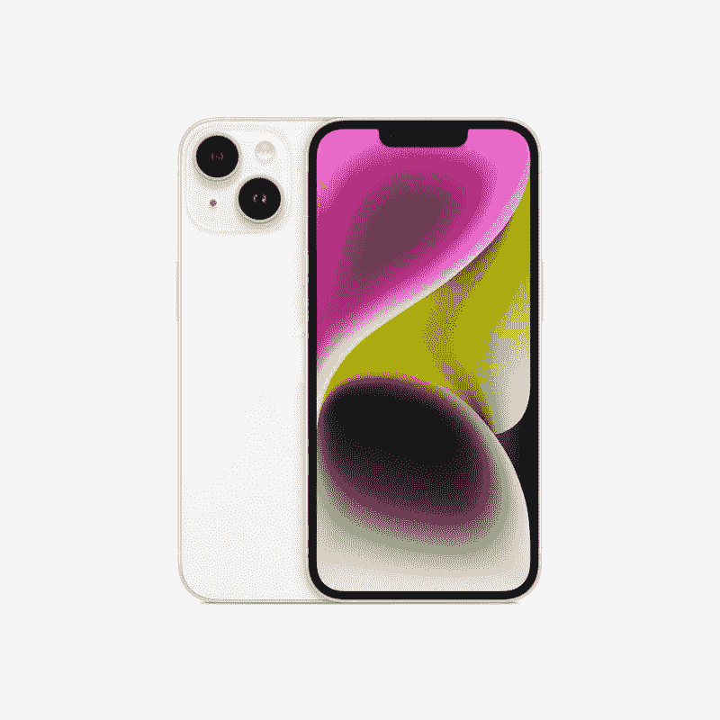

# 苹果 iPhone 14 回顾:伟大智能手机有史以来最迭代的更新

> 原文：<https://www.xda-developers.com/apple-iphone-14-review/>

iPhone 14 是一个令人难以置信的小更新，任何头脑清醒的 iPhone 13 拥有者都不应该考虑升级到它。iPhone 14 甚至没有达到从其前身升级的最低要求，这一事实提醒人们苹果对智能手机市场的不可思议的控制，以及它如何能够摆脱其他人根本无法摆脱的争议性举措。你能想象任何一个 Android 品牌发布一款与前代相同芯片组的旗舰，并且侥幸成功吗？

iPhone 14 是苹果试图卖给你的旧瓶子里的老酒，只是换了个新标签。好吧，我有点夸张了。这里有一些值得注意的升级，还有一个最大的变化苹果在发布会上甚至没有提到(但稍后会有更多)。今年硬件升级的清单相对较少。你会得到与去年相同的芯片组，但增加了一个额外的 GPU 核心，一个全新的自拍相机，一个改进的主摄像头，基本的卫星连接和碰撞检测。此外，美国型号还放弃了物理 SIM 卡插槽，以完全拥抱 eSIM 未来。

正如你所看到的，没有多少可以说服 iPhone 13 和 iPhone 12 的所有者做出改变。标准机型和专业机型之间的差距比以往任何时候都大，因为大多数酷功能，包括动态岛，新的 A16 仿生芯片组和 48MP 主摄像头，都是 iPhone 14 Pro 和 iPhone 14 Pro Max 独有的。这也意味着有更多的动机支付额外的钱在专业型号上，因为你得到的优势和津贴更明确，更容易合理化。

iPhone 14 在一个熟悉的包中提供了改进的摄像头和卫星连接。

## 苹果 iPhone 14:规格

| 

规格

 | 

苹果 iPhone 14

 |
| --- | --- |
| 尺寸和构造 | 

*   铝制中框
*   玻璃正面和背面
*   前玻璃的“陶瓷护罩”
*   146.7 x 71.5 x 7.8mm 毫米
*   172 克

 |
| 显示 | 

*   6.1 英寸有机发光二极管显示屏，
*   2556 x 1179 像素分辨率，460 PPI
*   60Hz 刷新率
*   HDR 显示器，真实色调，宽颜色(P3)
*   800 尼特最大亮度，1200 尼特峰值亮度(HDR)

 |
| 照相机 | 

*   **主** : 12MP 宽，f/1.5 光圈，1.9μm
    *   传感器移位 OIS
    *   七元素透镜
    *   5 倍数码变焦

*   **次要:** 12MP 超宽，f/2.4 光圈

 |
| 电池 | 

*   3，279 毫安时，支持长达 20 小时的视频播放
*   20W 有线充电
*   15W MagSafe 充电
*   7.5W Qi 无线充电

 |
| SoC、RAM 和存储 | 

*   A15 仿生芯片组
*   6GB 内存
*   128GB、256GB 和 512GB

 |
| 传感器 | 

*   Face ID
*   晴雨表
*   高动态范围陀螺仪
*   高 g 加速度计
*   近程传感器
*   双环境光传感器

 |
| 港口 | 

*   苹果闪电港
*   没有耳机插孔

 |
| 操作系统（Operating System） |  |
| 颜色；色彩；色调 | 

*   午夜，紫色，星光，蓝色，红色

 |
| IP 等级 | 

*   IP68 防水防尘等级

 |
| 连通性 | 

*   5G(低于 6 GHz 和毫米波)
*   支持 4×4 MIMO 和 LAA 的千兆级 LTE
*   支持 2×2 MIMO 的 Wi-Fi 6 (802.11ax)
*   蓝牙 5.3
*   超宽带(UWB)
*   国家足球联盟

 |
| 价格 | 

*   799 美元(128GB)
*   899 美元(256GB)
*   1099 美元(512GB)

 |

***关于这篇评论:**这部 iPhone 14 是我个人购买的。苹果在这篇文章中没有任何编辑意见。该评论是在使用该设备 10 天后撰写的。*

* * *

## 苹果 iPhone 14:价格和可用性

iPhone 14 以及 iPhone 14 Plus、iPhone 14 Pro 和 [iPhone 14 Pro Max](https://www.xda-developers.com/apple-iphone-14-pro-max-review/) 现在已经可以在全球范围内从苹果商店和其他官方零售渠道购买。标准的 iPhone 14 起价 799 美元，但是你可以通过利用[交易和折扣](https://www.xda-developers.com/best-apple-iphone-14-deals/)来节省很多。

*   iPhone 14 的基本型号起价为 799 美元，512GB 型号的起价为 1099 美元。
*   它有蓝色、紫色、午夜、星光和(产品)红色。

* * *

## 设计与展示

*   iPhone 14 的设计和显示屏与 iPhone 13 完全相同。
*   然而，苹果重新设计了手机的内部架构。

如果你试图找出 iPhone 14 和 iPhone 13 之间的任何视觉差异，你会发现没有，除了不同的配色。你看到的是和去年一样的外观设计。这不是一件坏事，因为 iPhone 13 是一款非常坚固的手机，但你不禁会觉得标准的 iPhone 系列急需进行设计改革。顶部仍然有那个难看的凹口，如果你主要使用弯曲背面的手机，平坦的侧轨需要一些时间来适应。无论如何，这都不是一部难看的手机，但你能为同样的设计兴奋几次呢？

iPhone 14 比 iPhone 13 轻 2g，不出所料，当我把两部手机并排放在一起时，这种差异并不明显。前部仍然由陶瓷保护罩保护，而扁平的铝制框架提供了令人放心的握感。正如你所料，这款手机握在手中感觉非常棒——坚固无比。然而，我必须承认，在这些年只使用弯曲背面的 Android 手机后，我发现 iPhone 14 因其锋利的边缘而不舒服。但这很容易解决[保护壳](https://www.xda-developers.com/best-apple-iphone-14-cases/)。

起初，我考虑买 iPhone 14 Plus，因为我担心 6.1 英寸的尺寸对我来说太小了。但在使用 iPhone 14 十多天后，我觉得这是最完美的尺寸——不太小，也不太大。

我们都喜欢和欣赏的静音开关还在，我们都讨厌和希望已经死亡的不需要的闪电端口也在。苹果已经在美国机型上移除了物理 SIM 托盘，以支持 eSIM，但欧洲和亚洲的用户仍然可以在左侧找到它。

虽然 iPhone 14 从外观上看起来与 iPhone 13 一样，但在引擎盖下却截然不同。正如 iFixit 的拆机事件所揭示的那样，苹果彻底重新设计了 iPhone 14 的内部架构，使其成为迄今为止最可修复的 iPhone。这是维修权利运动的一大胜利，对于那些喜欢长时间握着手机的人来说也是一个好消息。

iPhone 14 的 6.1 英寸显示屏与去年相同。这是一台 OLED 面板，分辨率为 1170 x 2532，具有 DCI-P3 宽色域，支持 HDR10+和杜比视觉。正如您所料，这是一款高质量的面板，提供逼真的色彩、深黑色和出色的视角。遗憾的是，苹果仍然将更高刷新率的 Pro Motion 显示器限制在 Pro 机型上。因此，你必须忍受 60Hz 的面板。但除此之外，这里没什么好抱怨的。就色彩准确度和亮度而言，这是这个价位上你能买到的最好的显示器之一。

在最大设置下，面板变得足够亮，即使在强烈的阳光下我使用它也没有问题。苹果的 True Tone 功能已经上市，它会根据你的周围照明自动调整白平衡和照明，使文本和内容更容易看。然而，没有类似于 iPhone 14 Pro 和 Pro Max 的永远显示或动态岛。该显示器还应用了疏油涂层，使其更容易擦掉指纹和污迹。然而，[使用屏幕保护器](https://www.xda-developers.com/best-apple-iphone-14-screen-protectors/)仍然是个好主意。

* * *

## iPhone 14:摄像头

*   iPhone 14 的主摄像头更新了更宽的光圈和更大的像素尺寸。
*   一如既往的精彩视频性能。

虽然 Pro 型号获得了全新的 48MP 主摄像头，但标准的 iPhone 14 和 14 Plus 选择了与其前辈类似的更保守的 12MP 双摄像头设置。有一个 12MP 的主拍摄镜头，现在有一个更大的光圈——f/1.5，而 iPhone 13 上的 f/1.6——和一个更大的 1.9μm 像素尺寸，以改善弱光性能。超宽摄像头看似没什么变化。

在大白天，iPhone 14 拍摄出令人愉悦的照片，与真实的色彩有着密切的关系，与三星更饱和和充满活力的色调相比，有时可能会显得有点沉闷。如果你喜欢更丰富的色彩和更高的对比度，你可以随时从相机设置转向摄影风格。

在光天化日之下，iPhone 14 可以拍摄出令人愉悦的照片

主摄像头拍摄的照片具有精确的白平衡、精确且可重复的曝光以及非常小的噪点。图像通常解决了大量的细节，但我们也观察到一些照片中树叶和水的过度锐化。高对比度场景也处理得相当好，相机在高光和阴影细节之间取得了良好的平衡。然而，动态范围并不像我们在 iPhone 14 Pro 或[小米 12S Ultra](https://www.xda-developers.com/xiaomi-12s-ultra-review/) 上看到的那样宽，这导致了特定条件下的高光溢出，例如在强烈的阳光下或逆着太阳拍摄时。但在审查期间，这种情况很少发生，大多数时候，苹果的图像处理在控制高光和阴影方面做得很好。此外，iPhone 14 的超快速自动对焦和传感器移位 OIS 使得在开车或乘公交车旅行时拍摄出色的风景照片成为可能。

### 低光照片

主相机的低光照片非常出色，细节保留良好。它们具有精确的色彩、高对比度和低亮度噪声。当光线较暗时，夜间模式会自动启动，并通过照亮较暗的部分来帮助显示场景中的更多细节。低光照片也受益于苹果新的图像管道光子引擎，该引擎声称可以将超宽相机的中低光性能提高 2 倍，主相机的中低光性能提高 2.5 倍。基本上，光子引擎在成像过程中更早地对原始数据应用深度融合的计算。苹果公司表示，这将导致更好的色彩再现，保留微妙的纹理，以及照片中更多的细节。

我在弱光下简单比较了 iPhone 14 和 iPhone 13，没有发现照片质量有任何显著改善。iPhone 14 能够保留更多细节，并输出略亮的照片，但这些差异只有在仔细检查和像素偷窥后才能明显看出。

### 视频性能

iPhone 14 上的三个摄像头都能够以 60fps 的速度拍摄 4K 视频。您还可以拍摄杜比视觉格式的 HDR 视频，具有 10 位高动态范围。在真实世界的性能方面，iPhone 14 提供了惊人的视频性能，可以轻松超越这个价格范围内的竞争对手 Android 智能手机。无论您选择哪种格式或分辨率，镜头看起来都非常流畅，展示了出色的动态范围、出色的细节和丰富的色彩，无论是在日光还是弱光条件下。

iPhone 14 提供了惊人的视频性能，在这个价格范围内可以轻松超越竞争对手的 Android 智能手机

我对视频性能的唯一问题是在光线明亮的区域拍摄时，相机镜头会产生过多的眩光和反光。这些问题在晚上尤其明显(见第三个视频样本)。

iPhone 13 上首次出现的电影模式仍在这里，但现在它在 4K 以 30fps 和 4K 以 24fps 可用。当多个主体在画面中时，这仍然是一个偶然事件，需要很多努力，但玩起来很有趣。

还有一个名为动作模式的新视频功能，即使在激烈的运动和活动中，如跑步或骑自行车，也可以捕捉超级流畅的手持视频。它确实平滑了抖动和振动，但是你需要确保场景中有充足的光线。否则，你会得到模糊的画面。另外，你被限制在 2.8K 分辨率。就像电影模式一样，偶尔玩玩也不错，但在大多数情况下，用标准视频模式拍摄会更好。

### 改进的自拍相机

iPhone 14 上最大的相机升级是自拍相机，与 iPhone 14 Pro 和 iPhone 14 Pro Max 上的相机相同。新的 1200 万像素原深感摄像头拥有更宽的 f/1.9 光圈和自动对焦功能。新相机的自拍照非常出色，提供了准确的肤色渲染，宽动态范围和出色的对比度。然而，iPhone 14 坚持自拍尽可能真实，捕捉一切细节，这可能会让那些习惯于过度处理或平滑外观的自拍的人感到厌烦。自拍相机上有人像模式，效果很好——它使用 Face ID 的结构光 3D 扫描仪进行更精确的边缘检测。

iPhone 14 没有用于深度估计的 3D 激光雷达传感器，但它可以很好地捕捉人像照片——只要照明条件良好。苹果的边缘检测仍然无法与三星和谷歌的边缘检测相提并论，所以你会注意到 iPhone 14 有时无法准确识别主体，并模糊了头发等更精细的细节。

总的来说，这里几乎没有什么可抱怨的，因为 iPhone 14 的摄像头很少出现故障。在大多数情况下，你可以瞄准并拍摄，然后自信地走开，因为你已经完美地捕捉到了这一瞬间。我很惊讶我很少需要拍第二张照片，这是我在使用其他手机时经常要做的。无论光线条件如何，您都可以依靠这款相机系统拍摄可靠的照片和视频。没有多少智能手机能提供这种安心感，对于想要轻松拍出好照片的普通用户来说，这是一种激励。

* * *

## 表演

*   iPhone 14 包装了去年的 A15 仿生芯片组，但增加了一个 GPU 核心。
*   整体性能非常出色，但 60Hz 的显示屏意味着滚动感觉缓慢。

标准 iPhone 首次没有采用苹果最新、最棒的芯片组。新的 A16 仿生芯片组是今年 Pro 机型的专属，而标准机型不得不满足于与 iPhone 13 系列相同的 A15 芯片组。这很可能会开创一个新趋势，即所有未来的 iPhone，包括即将推出的 iPhone 15，都将继续采用一年前的芯片组。这意味着那些想要得到最新苹果硅胶的人现在必须为 Pro 型号支付更多的钱。

尽管如此，iPhone 14 内部的 A15 芯片仍然是市场上最强大的智能手机芯片组之一，可以轻松击败高通最新和最棒的骁龙 8 Plus Gen 1。它有两个运行速度为 3.23GHz 的性能内核和四个运行速度为 1.82GHz 的效率内核

尽管 iPhone 14 的芯片组与前代相同，但它在性能上有了一些改进。首先，新型号有一个 5 核 GPU，苹果称比 iPhone 13 的 4 核 GPU 快 18%。其次，这款手机的内存为 6GB，高于 iPhone 13 的 4GB。最后，它有一个更新的内部设计，更好的热量管理。

由于 60Hz 的面板，iPhone 14 的滚动感觉不太流畅

说到现实世界的性能，iPhone 14 是一款快速可靠的产品。应用和游戏启动迅速，iOS 的动画一如既往的流畅丝滑。游戏性能也不是问题。我试用了 Genshin Impact 和 Call of Duty，它们大部分运行都很流畅。当你长时间玩游戏时，设备开始变热，但没有严重的性能限制或丢帧等问题。

虽然整体性能非常出色，但滚动是另一回事。iPhone 14 继续使用 60Hz 面板，这意味着与具有更高刷新率显示屏的手机相比，在系统中滚动和移动感觉不太流畅。如果你正在从 iPhone 11 升级，或者从未使用过更高刷新率显示屏的手机，你没有什么可担心的。但作为一个一直在专门使用 120Hz 显示屏的 Android 手机的人，这种差异立即就显而易见，并感到非常不和谐。iOS 动画在掩盖这一缺点方面发挥了作用，但不足以弥补这一缺点。当苹果是唯一一个仍在其高端手机上配备 60Hz 面板的智能手机品牌时，它没有理由不包括更高刷新率的显示屏。如今，即使是廉价的安卓智能手机也配备了 90Hz 或 120Hz 的面板。希望随着 iPhone 15 的推出，这种情况最终会有所改变。

* * *

## 电池寿命和充电

*   iPhone 14 提供全天电池续航时间。
*   充电速度还是真的很慢。

iPhone 14 配备了 3279 毫安时的电池，比 iPhone 13 的 3240 毫安时电池增加了 39 毫安时。凭借这一微小的容量提升和其他效率改进，苹果承诺比去年的型号多一个小时的续航时间。但是，充电速度一点也没有提高。这款手机采用 USB 供电时最高功率为 20W，采用 MagSafe 时为 15W，采用 Qi 无线充电时仅为 7.5W。

iPhone 13 的电池寿命已经很长了，iPhone 14 也没有什么不同。在我使用这款手机的 10 天里，它一直提供一整天的电池，平均 4.5 到 5 小时的屏幕时间。即使在我频繁使用电话的周末，我也不觉得自己需要在睡觉前快速充值。只要您开始一天的工作时电池电量超过 80%,并且没有长时间玩高要求的游戏，那么您应该不会有任何问题来获得一整天的使用量。

与一加和小米所能提供的相比，iPhone 14 的 20W 充电速度慢得令人痛苦。更不用说它仍然使用专有的闪电线。使用 20W 或更快的充电器，你可以获得 50%的电量，这并不算太糟糕。但从 0 到 100%大约需要两个小时，如果你像我一样被超快充电速度的手机宠坏了，这似乎是一段漫长的时间。

我们知道，从长远来看，疯狂的充电速度会对电池的健康造成严重破坏，我们当然不希望或希望苹果达到一加或 Oppo 的程度。也就是说，20W 肯定是保守的，稍微提高到 25W 或 30W 就很好了——这是 iPhone 15 愿望清单上的又一项内容。

* * *

## 软件

*   iOS 16 的新的、高度可定制的锁屏有很多值得喜欢的地方。

iPhone 14 开箱即可运行 iOS 16，并配备了几个令人兴奋的功能。最令人兴奋的是新的锁屏体验。有各种各样的定制来完全个性化锁定屏幕的外观和感觉。您可以从许多不同的照片样式中选取，更改字体和颜色，给主屏幕添加模糊效果等等。此外，你还可以添加锁屏小工具，快速浏览通常需要解锁设备和打开应用程序的重要信息。这些包括日历事件、提醒、天气、股票更新和新闻快讯。

您一次可以在锁定屏幕上添加多达五个 widgets。你可以设置多个锁屏，每个锁屏都有自己的小工具和对焦模式，通过滑动可以轻松地在它们之间切换。

还有一个聪明的照片剪切功能，让您只需长按主题即可删除照片的背景。然后，您可以将该主题复制并粘贴到照片编辑应用程序中，或者与朋友分享以供娱乐。同时，视频中的实时文本是一个很好的功能，可以让你从暂停的视频中复制文本。当你在看教程并想快速记下一些东西时，这非常方便。

iOS 16 中其他值得注意的新增功能包括取消发送和编辑 iMessages 的功能，在锁定屏幕上显示记分卡和正在进行的锻炼的实时活动，对实时文本和焦点模式的改进，键盘的触觉反馈，安全检查等等。如果你想了解更多关于新软件的信息，请查看我们在 iOS 16 上的单独功能。

* * *

## 连接、通话质量和音频

*   卓越的连接和通话质量。
*   立体声扬声器声音很大。

坠机检测和卫星连接是 iPhone 14 的两个新功能。碰撞检测的工作原理类似于谷歌的汽车碰撞检测。该功能使用新的高 g 力加速度计和三轴陀螺仪来检测您是否遭遇了车祸，并可以自动通知您的联系人和紧急服务。Apple Watch Series 8 上也有。通过卫星紧急求救是 iPhone 14 的主要亮点之一。当你迷路或被困在一个没有手机连接的偏远地方时，它可以帮助你向紧急服务机构发送信息。该功能在发布时不可用，所以我无法测试它。它将于 11 月在美国和加拿大上线。目前还不清楚它以后是否会进入其他市场。

iPhone 14 提供了卓越的网络性能。在我的评估期间，我从未遇到过意外掉线或连接问题。5G 在印度还不可用，所以我无法测试，但我在 Jio 和 Airtel 的 LTE 网络上获得了出色的下载和上传速度。通话质量也一直相当不错；有些人甚至称赞我的声音有多清晰，并问我是不是用新手机打来的。至于立体声扬声器，它们真的很吵，是我测试过的最好的扬声器之一。只要你不把音量滑块推到最大，它们就能提供干净的声音和强劲的低音，因为音频在接近最大音量时会开始失真。

* * *

## 该不该买 iPhone 14？

**你应该买 iPhone 14 如果:**

*   你用的是 iPhone 11 或更旧的手机。
*   你想要一部不费吹灰之力就能拍摄出色照片和视频的手机。
*   你想要一部相对容易维修的手机。
*   您预见到 SOS 卫星连接功能的使用，并生活在受支持的市场中。

**你不应该买 iPhone 14 如果:**

*   你有一部 iPhone 13 或 iPhone 12。
*   你想要一台长焦相机。
*   你想要更高刷新率的显示器和快速充电。

如果从同比改进的角度来看，iPhone 14 是有史以来最大的增量升级。你甚至可以说苹果对 iPhone 14 的“如果它没坏，就不要修理它”这句话有点太认真了，因为它实际上是一部 iPhone 13，它本身是 iPhone 12 的一个小进步。但对于来自 iPhone 11 或 iPhone XS 的人来说，这是一次值得的升级，因为商店里有许多值得注意的改进和完善，他们肯定会注意到并欣赏。这就是说，iPhone 14 是一款好产品，但 iPhone 13 几乎同样出色。

底线是 iPhone 14 玩起来太安全了，这使得 Pro 机型今年更有吸引力，也是突出的选择。动态岛，全新的 48MP 摄像头，A16 芯片组都是为 iPhone 14 Pro 阵容保留的。

苹果再次选择 60Hz 的决定令人难以接受，尤其是考虑到几乎每个 OEM 厂商都已经转向更高刷新率的面板。事实上，iPhone 14 是这个价位唯一配备标准 60Hz 面板的智能手机。虽然 iPhone 14 承诺通过光子引擎大幅改善低光相机性能，但在大多数情况下，这种差异很难察觉，特别是在主相机上。我也看不出为什么像光子引擎这样的软件功能不能扩展到 iPhone 13 Pro 或 iPhone 13，它们有相同的处理包。

iPhone 14 通过卫星发送紧急求救信号是一个很酷的功能，但它在发布时不是实时的。此外，它将仅限于美国和加拿大，所以它不太可能成为其他市场的决定因素。该功能还将在免费试用到期后转向付费计划，具体细节目前还不清楚。

 <picture></picture> 

Apple iPhone 14

iPhone 14 由 A15 仿生芯片组驱动，并提供改进的摄像头。

 <picture></picture> 

SUPCASE Unicorn Beetle Style Case (Sponsored)

##### SUPCASE UB 风格的 iPhone 14 保护套

除了简约纤薄的外形之外，这款保护套还提供了三种不同的颜色可供选择。

没有令人信服的理由选择 iPhone 14 而不是去年的 iPhone 13，除非你想要卫星 SOS(甚至还没有)，稍微好一点的摄像头，或者更容易修理的手机。以折扣价拿起 iPhone 13 看起来是一个明智的选择。你不会错过任何重要的事情。