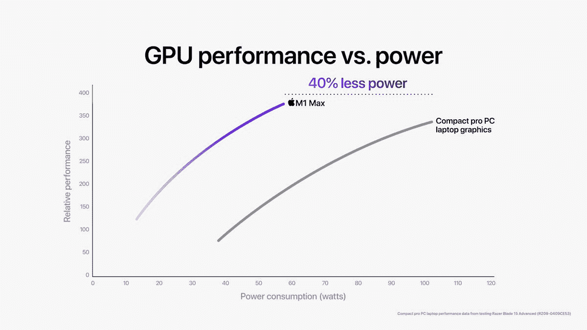
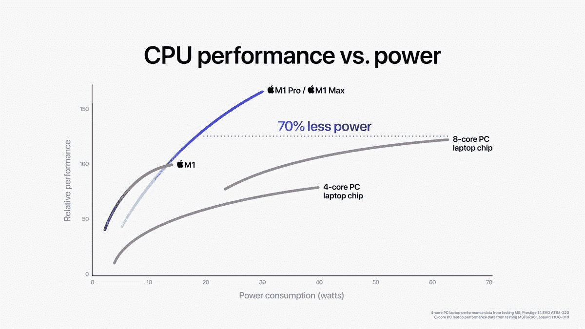
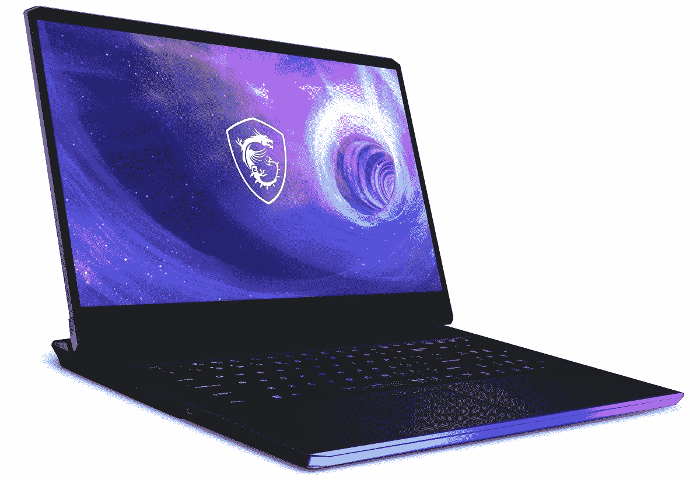

# 苹果 M1 系列 vs 英特尔酷睿 i9-12900HK:笔记本电脑 CPU 哪个好？

> 原文：<https://www.xda-developers.com/apple-m1-vs-intel-core-i9-12900hk/>

英特尔新的 [Alder Lake 处理器](https://www.xda-developers.com/intel-12th-gen-alder-lake/)凭借主板上一些令人印象深刻的性能数据，在业界掀起了一股巨浪。正如我们在[对 Core i9-12900HK](https://www.xda-developers.com/intel-core-i9-12900hk-review/) 的评论中提到的，它是目前最强大的芯片之一。事实上，即使是 Alder Lake H 系列的其他处理器看起来也非常有前途。但是，酷睿 i9-12900HK 如何与苹果芯片相抗衡呢？那么，在这篇文章中，我们将看看苹果 M1 与英特尔酷睿 i9 12900HK 的比较，以找出哪台笔记本电脑的 CPU 更好。

我们将主要比较苹果 M1 Pro 和 M1 Max 性能芯片与英特尔酷睿 i9-12900HK。我们认为几年前推出的原始 M1 还不足以对抗新的酷睿 i9 处理器。我们也没有考虑新的 M1 超进行比较，因为它本质上是苹果台式电脑的工作站 CPU。你可以看看我们的[苹果 M1 Ultra 与英特尔 Alder Lake 台式机 CPU 对比](https://www.xda-developers.com/m1-utra-vs-intel-12th-gen/)，看看结果如何。

## 规范

在我们开始比较之前，让我们先来看看英特尔和苹果与本次比较相关的所有处理器的规格。

以下是苹果 M1 系列芯片的纸面外观:

| 

规格

 | 

**苹果 M1**

 | 

**苹果 M1 Pro**

 | 

**苹果 M1 Max**

 | 

**苹果 M1 超**

 |
| --- | --- | --- | --- | --- |
| **CPU 内核** | 多达 8 个内核 | 多达 10 个内核 | 多达 10 个内核 | 多达 20 个内核 |
| **CPU 性能核心** | 4 | 8 | 8 | 16 |
| **CPU 效率 c0res** | 2 | 2 | 2 | 4 |
| **GPU 核心** | 最多 8 个 | 16 岁以下 | 24 或 32 | 64 岁以下 |
| **神经引擎核心** | 16 | 16 | 16 | 32 |
| **制造过程** | 5 纳米 | 5 纳米 | 5 纳米 | 5 纳米 |
| **晶体管** | 一百六十亿 | 337 亿 | 570 亿 | 1140 亿 |
| **统一内存** |  |  |  |  |
| **内存带宽** | 68.25 GB/秒 | 200 GB/秒 | 400 GB/秒 | 800 GB/秒 |

虽然较旧的 M1 处理器不如英特尔的许多 H 系列芯片强大，但我们仍然希望将其添加到规格表中，让您了解苹果的硅产品系列会有什么样的表现。

以下是英特尔酷睿 i9-12900HK 的纸上规格:

| 

规格

 | 

**英特尔酷睿 i9-12900HK**

 |
| --- | --- |
| **内核** | 14 (6P + 8E) |
| **螺纹** | 20 |
| **基频** | 2.5GHz (P 内核)&#124; 1.8GHz (E 内核) |
| **最大涡轮频率** | 5.0GHz (P 内核)&#124; 3.8GHz (E 内核) |
| **三级高速缓存** | 24MB |
| **默认 TDP** | 45W |
| **最大涡轮功率** | 115 瓦 |
| **处理器显卡** | 96EU |

## 表演

看一下规格表，很明显苹果的老 M1 芯片与酷睿 i9-12900HK 并不完全匹配。我们只关注 4 个性能和 2 个效率内核，而不是 6 个性能和 8 个效率内核。虽然 M1 驱动的 MacBook Air/Pro 将更加节能，但我们认为它在性能方面无法与 Core i9 竞争。这就是为什么我们认为您应该将 M1 Pro 或 M1 Max 视为酷睿 i9-12900HK 芯片的潜在竞争对手。

苹果 M1 Pro 和 M1 Max 都有高达 10 核的 CPU，而不是 14 核的 i9。它们都有 8 个性能内核和 2 个效率内核。虽然 Core i9 拥有更高效的内核，但我们仍然认为苹果笔记本电脑将更加节能，这是由于许多其他因素，包括硬件-软件集成、包含所有基本组件的统一芯片等等。我们测试了苹果的新 14 英寸 MacBook，看看它在我们的评论中与 Core i9-12900HK 相比如何。让我们快速浏览一下一些基准测试分数，看看哪一个更好。

在 Geekbench 5 测试中，基于英特尔酷睿 i9-12900HK 的 MSI Raider GE76 笔记本电脑最终在单核和多核测试中分别获得了 1774 分和 12630 分。搭载 M1 Pro 的 MacBook Pro 最终在相同的单核和多核测试中分别获得了 1755 分和 9954 分。Core i9 的多核得分较高，主要是因为它拥有更多内核。另一方面，M1 Max 芯片在这次测试中能够与 Core i9 的一般性能相媲美。

| 

产品

 | 

规范

 | 

单核的

 | 

多核

 |
| --- | --- | --- | --- |
| **微星攻略 GE76** | 核心 i9-12900 香港，RTX 3080 钛 | 1,774 | 12,630 |
| **苹果 MacBook Pro** | M1 专业 | 1,755 | 9,954 |
| **苹果 MacBook Pro** | M1·马克斯 | 1,780 | 12,720 |

继续进行 Cinebench R23 测试，采用酷睿 i9-12900HK 的 MSI Raider GE76 在单核和多核测试中分别获得了 1，833 和 14，675 的成绩。您可以在下表中查看 M1 Pro 和 M1 Max 的性能。再一次，M1 Max 芯片接近匹配 Core i9 的一般性能，而 M1 Pro 有点挣扎。

| 

产品

 | 

规范

 | 

单核的

 | 

多核

 |
| --- | --- | --- | --- |
| **微星攻略 GE76** | 核心 i9-12900 香港，RTX 3080 钛 | 1,833 | 14,675 |
| **苹果 MacBook Pro** | M1 专业 | 1,530 | 9,552 |
| **苹果 MacBook Pro** | M1·马克斯 | 1,529 | 12,258 |

为了了解这些笔记本电脑在视频渲染测试中的表现，正如你所见，微星笔记本电脑击败了装有 Adobe Premiere Pro 的 M1 Pro，但在 Davinci Resolve 中落后。

| 

产品

 | 

软件

 | 

渲染时间

 |
| --- | --- | --- |
| **微星攻略 GE76** | Adobe Premiere Pro | 10:52 |
|  | 达芬奇决心 | 6:17 |
| **苹果 MacBook Pro** | Adobe Premiere Pro | 29:46 |
|  | 达芬奇决心 | 2:25 |

总体而言，可以肯定地说，在以 CPU 为中心的基准测试中，新的英特尔酷睿 i9-12900HK 的性能优于 M1 Pro 和 M1 Max。即使在涉及图形单元的测试中，MSI 也能够与 MacBook Pro 相抗衡。然而，笔记本电脑在图形和 3D 工作负载方面的性能将取决于 Windows 笔记本电脑与英特尔芯片一起使用的独立 GPU 的类型。例如，微星突袭机 GE76 使用的是英伟达 GeForce RTX 3080 Ti 笔记本电脑 GPU。你需要或者至少一个 RTX 3070 Ti 笔记本电脑 GPU 来匹配 M1 专业或 M1 最大的图形性能。这就是 M1 Pro 和 M1 Max 芯片上图形单元的强大之处。

你可以买到一台配备多达 16 核图形芯片的 M1 Pro，以及一台配备多达 32 核图形芯片的 M1 Max。虽然英特尔的集成虹膜图形已经取得了很大进展，但它们仍然无法与苹果的集成图形处理器相媲美。苹果的芯片还受益于统一内存，这进一步有助于实现更好的性能。由于 M1 芯片有单一的内存来源，而不是有不同的系统内存和图形内存，所以内存共享的延迟非常低。苹果带有统一内存的集成图形芯片也有助于提高能效。在下一节中会有更多的介绍。

 <picture></picture> 

Image: Apple

## 电池寿命

在我们结束这个比较之前，我们认为值得谈论一下电池寿命，因为我们毕竟是在看笔记本电脑芯片。正如我们在 [M1 Max 驱动的苹果 MacBook Pro 评测](https://www.xda-developers.com/apple-macbook-pro-2021-m1-max-review/)中提到的，我们能够在剩余 60%以上电池的情况下结束整整 8 小时的工作日。当然，这还不包括任何照片或视频编辑工作量，但这仍然是一个令人印象深刻的数字。事实上，即使编辑和渲染 12 分钟的 4K 视频也只消耗了 22%的电池电量。这些数字是您在采用英特尔酷睿 i9-12900HK 处理器的高性能计算机上不太可能看到的。

苹果的 M1 Pro 和 M1 Max 芯片比英特尔在其 H 系列中提供的任何产品都更节能。苹果公司没有为这些设备的芯片宣传任何 TDP，但在性能功耗比方面，它绝对击败了英特尔芯片或任何其他芯片。虽然英特尔酷睿 i9 的整体性能输出可能更高，但苹果的 M1 Pro 和 M1 Max 芯片提供了更好的性能功耗比。

 <picture></picture> 

Image: Apple

现实世界中的一个好处是，即使是最消耗资源的任务，如在 MacBook Pro 上编辑照片或视频，也不必连接充电器。一台高性能英特尔架构笔记本电脑将由于缺乏足够的功率而开始减速。更不用说，M1 Pro 和 M1 Max 还拥有强大的集成显卡，其功耗远远低于高性能英特尔架构笔记本电脑上的独立显卡。正如我们前面提到的，你至少需要一个 RTX 3070 Ti 笔记本电脑 GPU 来匹配新 M1 芯片的一般图形性能，这些图形单元消耗更多的功率。苹果的统一内存总体功耗也更低，这也有助于提高能效。

## 定价和可用性

英特尔的新酷睿 i9-12900HK 已经面向原始设备制造商提供，我们已经开始看到采用这种特殊芯片的新笔记本电脑。微星突袭机 GE76 是第一批采用这种芯片的笔记本电脑之一，我们相信更多的笔记本电脑将会上市。苹果的 M1 Pro 和 M1 Max 的 MacBook Pro 笔记本现在也可以购买。我们在下面留下了购买这两款笔记本电脑的链接，请务必查看。

 <picture></picture> 

MacBook Pro 16

##### 苹果 MacBook Pro 16 英寸(2021)

新款苹果 MacBook Pro 笔记本可以配置其他 M1 Pro 或 M1 Max 处理器。

 <picture></picture> 

MSI Raider GE76

##### 微星突袭机 GE76

微星突袭机 GE 76 配备了英特尔酷睿 i9-12900HK CPU 和英伟达 GeForce RTX 3080 Ti 独立 GPU。

## 应该买哪个？

正如我们前面提到的，英特尔新推出的第 12 号 Alder Lake 比我们过去看到的任何品牌都有显著改进。即使与苹果最好的移动芯片相比，Core i9-12900HK 也能够保持自己的优势，并表现出更好的性能。当然，12900HK 不是最节能的芯片，但你可以看看英特尔第 12 代系列的其他处理器，包括 Alder Lake P 系列和 U 系列。

在英特尔驱动的 Windows 笔记本和苹果的 MacBook Pro 之间做出选择也取决于个人偏好。如果你是一个游戏玩家，想要运行所有现代 AAA 游戏的绝对最佳性能，那么你最好购买一台酷睿 i9 驱动的游戏笔记本电脑。但如果你是一个内容创作者，尤其是一个深深投入苹果生态系统和 macOS 的人，那么你必须选择 MacBook Pro 笔记本。