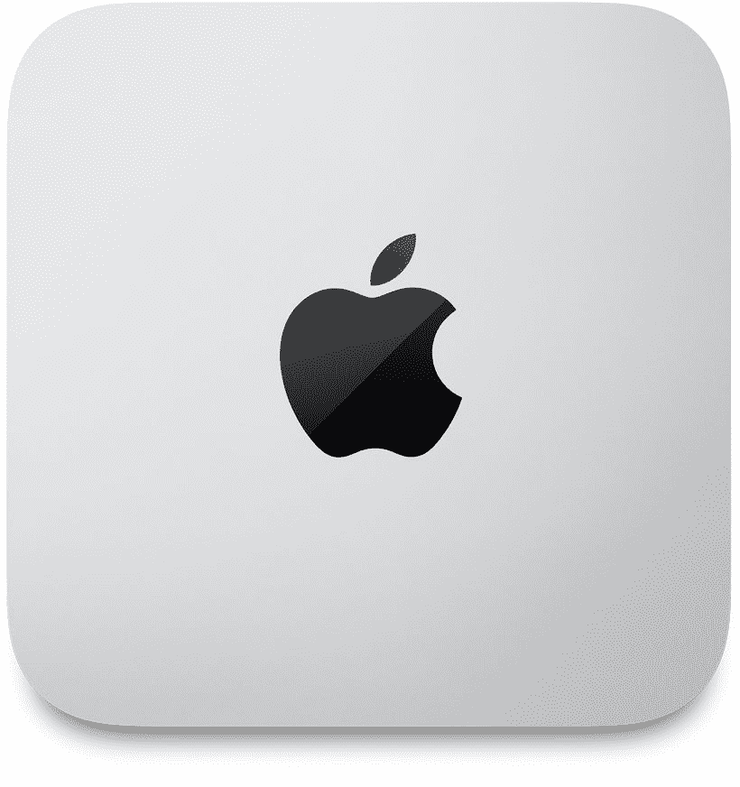

# 苹果 Mac 工作室与 M1 超审查:大小不重要

> 原文：<https://www.xda-developers.com/apple-mac-studio-m1-ultra-review/>

苹果新 Mac Studio 的占地面积是 Mac Mini 的两倍半。就体积和大部分尺寸而言，它比任何配备台式机专用显卡的英特尔架构电脑都要小。当你看着它的时候，它非常明显，但当你使用它的时候，它就不那么明显了，因为这东西是一头野兽，它是苹果迄今为止最好的 Mac。

这是 Mac Studio 真正与众不同的地方。它不仅功能强大，而且采用了在过去根本不可能实现的封装。我最近[评测了英特尔 NUC 12 至尊版](https://www.xda-developers.com/intel-nuc-12-extreme-dragon-canyon-review/)，这是你在打包全功能英特尔 CPU 和适当的专用显卡时可以得到的最小包装。Mac Studio 仍然很小，小到可以放在你的桌子上，放在你的显示器下。

最大的缺点仍然是缺乏适当的 Windows 支持。您可以通过 Parallels 中的虚拟化在 ARM 上运行 Windows，但这与在 Intel Mac 上的 Boot Camp 中原生运行不同。我很想看看像 *Forza Horizon 5* 这样的游戏在 M1 Ultra 上的表现，但这仍然是不可能的。

但是，如果您正在进行像编辑 8K 视频这样的创造性工作，或者坦率地说，任何可以利用多线程处理的工作，您都不会错过这一点。凭借所有这些能力，它只是静静地坐在你的桌子上(没错；我悄悄说)在后台。

我还想说明的是，对于大约 99%的用户来说，Mac Mini 完全能够满足你的所有需求。这适用于需要大量资源来编辑高分辨率视频的创作者，需要多线程处理 3D 渲染的专业人士，或者类似的人。

然而，它的起价为 1999 美元，是购买配备 M1 Max 处理器的电脑最便宜的选择。如果你需要更多，总有 M1 超。

 <picture></picture> 

Apple Mac Studio

##### 苹果 Mac 工作室

Apple Mac Studio 是为需要所有功能的创作者和其他专业人士设计的

## Mac Studio 定价和可用性

*   购买 Mac Studio 时，M1 Max 型号的起价为 1999 美元，M1 Ultra 型号的起价为 3999 美元。
*   大多数人不需要 M1 超芯片组。

苹果的 Mac Studio 在 3 月 8 日的一次活动中推出，并于 3 月 18 日上市。虽然有大量的配置可供选择，但有两个主要选项，M1 Max 芯片组和 M1 超。

在 Mac Studio 发布之前，我们只在 MacBook Pro 笔记本电脑中看到过 [M1 Max。超高端，而且是猛兽。但是，如果你在非常罕见的 M1 最大的阵营中，对你来说还不够野兽，还有 M1 超。M1 Ultra 基本上是两个 M1 Max 芯片组粘在一起，使用苹果公司称为 UltraFusion 的过程。](https://www.xda-developers.com/macbook-pro-2021/)

显然，M1 超是更强大的方式比 M1 最大，但它也是不必要的绝大多数用户。也要贵一倍。M1 Max 型号起价 1999 美元，是 M1 Max 电脑中最便宜的选择，而 Mac Studio 的 M1 Ultra 型号起价 3999 美元。

性能和价格也不是差异的终点。由于采用了铜散热模块，M1 Ultra 型号的重量增加了两磅，而 M1 Max 型号使用了普通的铝制散热器。

这里的关键是理解你自己的需求。基本上，如果你还不知道你需要一个 M1 超，你可以轻松地拿起一个 M1 最大，为自己节省几千美元。

## Mac Studio 规格

| 

处理器

 | 苹果 M1 超芯片 20 核 CPU，16 个性能核心和 4 个效率核心 48 核 GPU 32 核神经引擎 800GB/s 内存带宽 |
| 

记忆

 | 64GB 统一内存 |
| 

储存；储备

 | 1TB 固态硬盘 |
| 

港口

 | 四个 Thunderbolt 4 端口，支持:Thunderbolt 4(最高 40Gb/s) DisplayPort USB 4(最高 40Gb/s) USB 3.1 Gen 2(最高 10Gb/s)两个 USB-A 端口(最高 5Gb/s) HDMI 端口 10Gb 以太网 3.5 毫米耳机插孔(M1 Ultra):两个 Thunderbolt 4 端口(最高 40Gb/s) SDXC 卡插槽(UHS-II) |
| 

视频支持

 | 同时支持多达五个显示器:通过 USB-C 支持多达四个专业显示器 XDR(60Hz 时的 6K 分辨率和超过 10 亿种颜色)和通过 HDMI Thunderbolt 4 数字视频输出支持通过 USB-C Thunderbolt 2 的原生显示端口输出、DVI 和 VGA 输出使用适配器(单独销售)支持 HDMI 显示器视频输出使用 HDMI 转 DVI 适配器(单独销售)支持一个显示器的高达 4K 分辨率和 60Hz DVI 输出 |
| 

声音的

 | 内置扬声器 3.5 毫米耳机插孔，高级支持高阻抗耳机 HDMI 端口支持多声道音频输出 |
| 

连通性

 | Wi-Fi 802.11ax Wi-Fi 6 无线网络兼容 IEEE 802.11a/b/g/n/ac 蓝牙蓝牙 5.0 无线技术以太网 10Gb 以太网(Nbase-T 以太网，使用 RJ-45 连接器支持 1Gb、2.5Gb、5Gb 和 10Gb 以太网) |
| 

大小

 | 高:3.7 英寸(9.5 厘米)宽:7.7 英寸(19.7 厘米)深:7.7 英寸(19.7 厘米)重(M1 超极本):7.9 磅(3.6 千克) |
| 

电气和操作要求

 | 线路电压:100–240 伏交流频率:50 赫兹至 60 赫兹，单相最大持续功率:370 瓦工作温度:50 至 95 华氏度(10 至 35 摄氏度)存储温度:–40 至 116 华氏度(–40 至 47 摄氏度)相对湿度:5%至 90%无冷凝工作海拔:测试高度高达 16，400 英尺(5000 米) |
| 

在盒子里

 | Mac Studio 电源线 |
| 

操作系统（Operating System）

 | 马科斯 |
| 

价格

 | $3,999 |

这些是我看过的模型的规格。如果你选择 M1 Ultra，这是 Mac Studio 的基本型号。如果你选择 M1 Max，价格是它的一半，尽管你的内存更少，存储空间更小，前端口不是 Thunderbolt，重量也轻了两磅。M1 Max 型号更轻的原因是 M1 Ultra 需要额外的硬件来散热。

## 设计:Mac Studio 足够小，可以放在显示器下

*   Mac Studio 的尺寸为 7.7x7.7x3.7 英寸，占用了 Mac Mini 的空间，但高度约为 Mac Mini 的 2.5 倍。
*   它预示着 MAC 中 USB Type-A 的回归，但保留了一堆 Thunderbolt 端口。

当苹果首次宣布其定制 Arm 处理器的硬件时，它将性能作为一种价值主张，事实上，它正在做高通和微软无法做到的事情:与英特尔的性能相匹配。但那些最初的产品 Mac Mini、MacBook Air 和 13 英寸 MacBook Pro——都采用了与其前辈相同的机箱。

随着 24 英寸 iMac 和现在的 Mac Studio 等产品的出现，我们实际上看到了利用新处理器的新设计。请记住，这真的与性能没多大关系。更多的是关于性能- *每瓦*，改变功率包络。由于散热要求的变化，以及苹果能够将所有东西放在单个芯片组上，而不是 CPU 加巨型显卡，PC 的机身可以小得多。

这就是我们从 Mac 工作室得到的。这款产品的尺寸为 7.7 英寸乘 7.7 英寸，因此它在你的桌面上占据的空间与 Mac Mini 完全相同。它的高度为 3.7 英寸，而 Mac Mini 的高度为 1.4 英寸，因此大约是两个半 Mac Mini 单元叠在一起。从任何标准来看，这都是一台迷你电脑，但从任何标准来看，它都不具备迷你性能。英特尔的 NUC 12 至尊版尺寸为 14.1x7.4x4.7 英寸。

如果你在五年前告诉我，我能够在如此小的封装中获得如此高的性能，我会说这是不可能的，因为直到最近，这还是不可能的。

它的重量也是 7.9 磅。如果你在寻找一台搭载英特尔处理器的电脑，比如搭载酷睿 i9-12900 和 RTX 显卡的电脑，你不会找到太多低于 20 磅的电脑。

### 港口回来了

我已经很久没有说过苹果设备上不缺少端口了，但是现在我们来了。在背面，有四个 Thunderbolt 4 端口，以及两个 USB 3.2 Gen 1 Type-A 端口。还有一个 10Gbps 以太网端口、HDMI 和一个 3.5 毫米音频插孔。Thunderbolt 4 端口支持 USB4，数据传输速度为 40Gbps，或者您可以在一台显示器上连接两台 4K 显示器。或者，你可以将 6K 显示器连接到四个 Thunderbolt 端口中的每一个，然后通过 HDMI 端口添加第五个。

值得注意的是，无论您选择哪种处理器，五是支持的显示器总数。对于最初的 M1，如果你有一个带 HDMI 端口的设备(如 Mac Mini)，总数量是两个，一个没有。

对我来说很有趣的是 3.5mm 音频插孔在背面。这告诉我，苹果计划让你把它用于外置扬声器，而不是耳机。耳机要走 iPhone 路线，就是像 AirPods 一样用蓝牙耳塞。Mac Studio 确实有内置扬声器，很不错。它不会赢得任何奖项，但它完成了任务。

在正面，还有两个 Thunderbolt 4 端口和一个 SD 读卡器。这些前端端口用于快速访问您可能经常拔掉的东西，如 SD 卡。如果耳机插孔实际上是为耳机设计的，那么这就是你所期望的耳机插孔。注意，如果你去 M1 最大，这些前端口不是雷电。它们只是普通的老式 USB 型端口。

银色的设计是银色的，极简，哦，那么苹果。这感觉像是完美的设计，因为它传达的微妙外观使表演感觉更加大胆。

## 性能:M1 超是野兽，但你会知道你是否需要它

*   M1 超是强大的，尤其是在多线程工作负载方面。
*   很安静，你永远听不到风扇旋转的声音。

从一开始，我就想明确一点，没有任何可靠的人工基准可以证明任何苹果硅芯片有多强大。你会看到很多 Geekbench 的分数(你也会在这里看到)，但记住这一点非常重要，Geekbench 只是一个 CPU 测试。在某些方面，英特尔在 Geekbench 测试中完全击败了所有苹果芯片。

然而，苹果的 M1 处理器系列还包括定制显卡、统一内存等。苹果有一个完整的包装，它的设计包含了可以协同工作的部件，每个部件都可以提升其他部件。Cupertino 公司绝对是在利用其拥有从硬件到软件的整个堆栈的独特优势。

在我们开始这些基准测试之前，让我们先来谈谈以前的 8K 视频渲染测试。我采用了我们在 [16 英寸 MacBook Pro (M1 Max)评测](https://www.xda-developers.com/apple-macbook-pro-2021-m1-max-review/)中使用的同一组 8K 30fps 视频剪辑，并在 M1 Ultra 上导出它们。使用 Adobe Premiere Pro 耗时 11 分 43 秒，使用 DaVinci Resolve 耗时 1 分 22 秒。相比之下，MacBook Pro 中的 M1 Max 在 Premiere Pro 中用了 21 分 11 秒。当然，Adobe 在苹果芯片上还不是很好，你会从 DaVinci Resolve 或 Final Cut Pro 获得*更好的结果。*

### 基准测试表明，真正的优势在于多线程性能

现在，我们来谈谈 Geekbench 5 和 Cinebench R23 的成绩。这两个都是 CPU 测试，但尽管它们并没有告诉我们全部，但它们可以给我们一些背景，也许可以帮助你决定你需要什么样的苹果芯片。

| 

产品

 | 

Geekbench 单核

 | 

产品

 | 

Geekbench 多核

 |
| --- | --- | --- | --- |
| [惠普 omn ---- l(酷睿 i9-12900K)](https://www.xda-developers.com/hp-omen-45l-desktop-review/) | 1,921 | Mac 工作室(M1 超) | 23,778 |
| [CLX Ra(酷睿 i9-11900K)](https://www.xda-developers.com/clx-ra-gaming-pc-review/) | 1,803 | 惠普 omni corning l(酷睿 i9-12900K) | 15,723 |
| Mac 工作室(M1 超) | 1,776 | NUC(酷睿 i9-12900) | 13,355 |
| [微星攻略 GE76(酷睿 i9-12900HK)](https://www.xda-developers.com/intel-core-i9-12900hk-review/) | 1,774 | 微星突袭机 GE76(酷睿 i9-12900HK) | 12,630 |
| NUC(酷睿 i9-12900) | 1,767 | 惠普 OMEN 台式机 30L(酷睿 i9-10900K) | 10,933 |
| MacBook Pro (M1 专业版) | 1,755 | MacBook Pro (M1 专业版) | 9,954 |
| [iMac (M1)](https://www.xda-developers.com/imac-24-inch-review/) | 1,740 | iMac (M1) | 7,676 |

| 

产品

 | 

单芯 Cinebench

 | 

产品

 | 

Cinebench 多核

 |
| --- | --- | --- | --- |
| 惠普 omni corning l(酷睿 i9-12900K) | 1,894 | Mac 工作室(M1 超) | 24,095 |
| 微星突袭机 GE76(酷睿 i9-12900HK) | 1,833 | 惠普 omni corning l(酷睿 i9-12900K) | 23,659 |
| NUC(酷睿 i9-12900) | 1,806 | NUC(酷睿 i9-12900) | 16,316 |
| 三星 Galaxy Book Pro 2 360(酷睿 i7-1260P) | 1,649 | 惠普 OMEN 台式机 30L(酷睿 i9-10900K) | 15,266 |
| Mac 工作室(M1 超) | 1,534 | 微星突袭机 GE76(酷睿 i9-12900HK) | 14,675 |

看看这两个 CPU 测试，很明显，您从 M1 Ultra 获得的最大好处是多线程性能。尤其是当你将它与其他苹果硅芯片进行比较时，它们具有相同的统一内存优势。如果你比较 M1 Ultra 和普通老 M1 的单核分数，没有太大的区别。记住，这些都是基于同一个芯片，所以有道理。

Mac 工作室可以接受你扔给它的任何东西，除了游戏。

就像我说的，这些基准测试并不是系统性能的正确快照，但是它们应该让你对你需要什么样的 Mac 有一点概念。配备 M1 处理器的 Mac Mini 非常适合大多数用户。如果你想要权力，有一个 M1 最大的 Mac 工作室。当你进入 M1 超领域时，你应该明白只有不到 1%的用户需要，或者甚至可以利用。

最大的缺点是不能原生运行 Windows。老实说，凭借 M1 Ultra 的强大功能，我很想使用 Boot Camp 在 Arm 上安装 Windows 并运行一些 AAA 游戏，甚至使用 Windows 11 提供的 x64 仿真。我试着在 Parallels 中这样做，但我无法安装游戏。

但相反，这是一台专注于从高端 8K 视频渲染到 3D 建模的任何东西的机器。任何同时运行大量任务的东西，例如名称中带有“渲染”一词的东西，都将受益于这款 20 核 CPU 和 48 核 GPU 中的额外内核和线程。由于我们不关注游戏(只是不要为了游戏而购买 Mac)，我们可以很容易地说，对于可以利用它的用例类型来说，这是同类最佳的。

底线是，如果你的工作将受益于 M1 超，甚至 M1 最大，你可能已经知道了。如果是，那么您只需知道这是同类最佳产品。

### 天气比你想象的要凉爽

事情是这样的。如果你在五年前告诉我，你有一台这么强大的机器，而且它可以放在这么大的机箱里，我会告诉你它会融化。得益于 Arm 处理器，我们可以获得更高的性能功耗比，从而支持这些类型的设计。

| 

闲置的

 | 

Adobe Premiere Pro

 | 

Adobe Premiere Pro + Lightroom

 |
| --- | --- | --- |
|  |  |  |

多线程性能是 M1 超真正闪耀的地方，你仍然不会听到任何嘈杂的风扇。

空转时，M1 超似乎挂在 38 度左右。当我在 Premiere Pro 中运行我上面谈到的相同的 8K 导出时，它接近 60 度，然后当我在 Lightroom 中添加导入和导出大约 1，900 张图像时，我将它提高到几乎 80 度。

真正疯狂的是，你甚至听不到风扇打开的声音。有一些强大的基于英特尔的个人电脑，感觉就像你在一个喷气发动机旁边工作。这东西完全安静。这只是那些感觉不应该是可能的事情之一，那是因为在不久前，这是不可能的。

## 该不该买 Mac Studio？

我在总结评论时总是说，一款产品并不适合所有人，因为没有一款产品适合所有人，但 Mac Studio 尤其如此。一般人不应该买这个。大多数人认为 Mac Mini 会更好。

**谁应该购买苹果 Mac Studio:**

*   具有密集、多线程工作流程的人员
*   编辑高分辨率、高帧率视频的创作者
*   渲染 3D 模型或使用 CAD 的设计师
*   希望在一个小得不可思议的封装中获得强大功能的客户

**谁不该买苹果 Mac Studio:**

*   需要机器来提高工作效率的用户
*   游戏玩家
*   临时用户

Mac 工作室绝对狂野。它不仅具有同类最佳的性能，而且还采用了体积极小的机箱。如果你想做 Mac Studio 能做的事情，用基本上是迷你电脑的东西来做这件事是疯狂的想法，然而我们在这里。而且很安静。唯一的坏消息是它不能原生运行 Windows，这对游戏玩家来说是个不利因素。