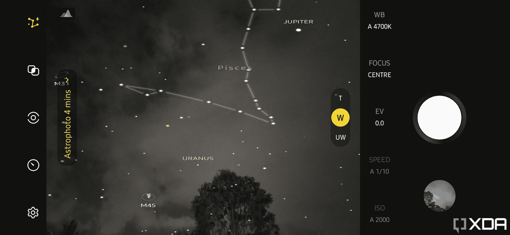

# 以下是如何在三星 Galaxy S22 上使用天体摄影模式

> 原文：<https://www.xda-developers.com/astrophotography-mode-on-samsung-galaxy-s22/>

谷歌的天体摄影模式于 2019 年首次亮相，以其独特的捕捉夜空的能力惊艳了所有人。它在观星爱好者中一炮而红，因为它让专业摄影师的业余爱好变得更容易为拥有智能手机的业余爱好者所接受。自首次在 Pixel 4 上亮相以来，该模式没有发生任何重大变化，但即使在今天，它仍然是 Pixel 手机的亮点之一，因为竞争对手的高端智能手机上缺乏类似的东西。

三星的 Galaxy S22 系列没有任何天文摄影模式，因此错过了这个标志，但它现在通过一个变通办法解决了这个问题。它正在更新其专家 RAW 相机应用程序，以包括一个新的“天体照片”模式。虽然这不是 Pixel 天文摄影模式的全面替代方案，但它为夜间摄影爱好者提供了一种使用三星最新的 Galaxy S22 系列手机捕捉清晰明亮天空的方法。在这篇文章中，我们将告诉你如何在 [Galaxy S22](https://www.xda-developers.com/samsung-galaxy-s22-review/) 上开始使用 astrophoto 模式。让我们开始吧！

带有 Astrophoto 模式的更新后的专家 RAW 相机应用程序将只能在运行 One UI 5 的三星 Galaxy S22 系列手机上工作。

在我们开始之前，让我们快速浏览一下这个教程的一些先决条件，好吗？

*   要实现这一点，你首先需要的是三星的专业 RAW 相机应用程序本身。你可以从[银河商店](https://galaxystore.samsung.com/prepost/000005977497?langCd=en)下载。
*   你还需要一部运行三星新的 One UI 5 软件的 Galaxy S22 系列手机，用于 astrophoto 模式。在这个特定的教程中，我们使用的是运行一个 UI 5 beta 软件的普通 Galaxy S22 智能手机。
*   最后，你需要一个带智能手机支架的三脚架来固定你的 Galaxy S22 系列设备。我们在下面留下了一个购买链接，但你可以使用任何你选择的三脚架。

##### Joby 紧紧抓住一个大猩猩支架

如果你拍摄大量照片或录制视频，Joby GripTight ONE GorillaPod 支架是与智能手机搭配的完美配件。只要符合规格，您可以将此支架用于任何智能手机。

在三星的专家 RAW 相机应用程序中使用 Astrophoto 模式非常简单。按照下面提到的简单步骤开始拍摄夜空:

*   一旦你将智能手机安装在三脚架上，只需启动 Expert RAW 相机应用程序，并寻找一个按钮来启用 astrophoto 模式。它位于显示屏的右上角。
*   选择此按钮打开一个菜单覆盖，其中包含启用天空向导和调整拍摄持续时间的选项。
*   如果你想知道的话，天空指南将会让你精确定位星座、恒星群等等。这是对应用程序的一个很好的补充，让拍摄夜空变得更加互动和有趣。

 <picture></picture> 

Sky guide feature on Samsung's Expert RAW camera app

*   尽管专家 RAW 相机应用程序都是手动控制的，但启用 astrophoto 模式将禁用调整 ISO 和速度的选项。但是，在开始采集之前，您仍然可以调整其余的设置。
*   然后，您可以根据光线和其他拍摄条件调整剩余的相机设置，以尝试和完善您的拍摄。

*   一旦你准备好了，只需选择快门按钮，等待手机完成捕捉场景。

一旦应用程序完成拍摄，您将看到最终的照片，以及启动 Adobe Lightroom 对原始图像进行调整的选项。您还可以选择共享图像或删除图像以捕捉新图像。

最终结果将取决于影响天文摄影的各种因素。当谈到完善天体摄影的拍摄条件时，有许多因素要考虑。也许最重要的事情之一是确保至少 10 英里内没有主要的光源。你可以利用“光污染地图”这样的应用程序来找到你所在城市周围最黑暗的区域。我们强烈建议走出大都市捕捉夜空，这个应用程序将帮助您找到正确的景点。

几种天气条件也会影响天文摄影，所以确保你不试图在多云天气拍摄星星也很重要。被厚厚的云层覆盖的天空不适合天文摄影，所以我们建议使用天气应用程序来确定外出的最佳时间。Android 上并不缺少天气应用，但你可能会想看看“地下天气”之类的东西，看看月相、空气质量指数和风速等其他数据。

在拍摄夜空的详细照片时，你只能控制这么多，但一些准备工作会让你在探险中变得容易得多。

这就是你如何在三星的 Expert RAW 相机应用程序中使用新的 Astrophoto 模式来拍摄非常详细的星星照片。这种模式没有被纳入三星的原生相机应用这一事实有点令人失望，因为像 [Galaxy S22 Ultra](https://www.xda-developers.com/samsung-galaxy-s22-ultra-review/) 这样的高端设备可以真正充分利用这些功能。然而，我们预计这种情况将随着明年年初上市的未来 Galaxy 设备而改变。

我们使用了一个三星 Galaxy S22 来整理这个 Astrophoto 模式教程。它是 Galaxy S22 系列三款产品中最小的一款，但它提供的旗舰体验与高端三星设备相同。

*你在你的 Galaxy S22 系列设备上试过吗？请在下面的评论中分享你的想法。*