# 华硕 Chromebook CX9 vs 三星 Galaxy Chromebook 2

> 原文：<https://www.xda-developers.com/asus-chromebook-cx9-vs-samsung-galaxy-chromebook-2/>

CX9 和 Galaxy Chromebook 2 的 i3 型号也有类似的价格。Galaxy Chromebook 2 的 Core i3 型号零售价为 699 美元，而 CX9 的 Core i3 型号的价格为 749 美元。当然，相似之处不止于此。这两款设备都具有明亮的显示屏、充足的 RAM 和存储空间，以及出色的构建质量。在这次比较中，我们将看看这些 Chromebooks 之间的主要差异，并看看哪种设备在每个类别中都名列前茅。我们将讨论显示质量、性能、电池寿命等。

| 规格 | 华硕 Chromebook CX9 | 三星 Galaxy Chromebook 2 |
| --- | --- | --- |
| **尺寸&重量** | 

*   12.7 英寸 x 8.1 英寸 x 0.7 英寸
*   2.5 磅

 | 

*   12.0 英寸 x 8.0 英寸 x 0.55 英寸
*   2.7 磅

 |
| **显示** | 

*   14 英寸 FHD 纳米边缘(1920*1080)
*   16:9，有光泽
*   400 尼特
*   1149 美元机型上的触摸屏

 | 

*   13.3 英寸 FHD QLED 显示屏(1920*1080)
*   最大 1920 x 1080 @60Hz
*   390 尼特
*   触摸屏

 |
| **处理器** | 

*   最高可配英特尔酷睿 i7-1165G7 处理器 2.8 GHz
*   12M 高速缓存，最高 4.7 GHz，4 核(酷睿 i7)
*   英特尔 Iris Xe 显卡(1149 美元)

 | 

*   英特尔赛扬 5205U(基本型号)
*   英特尔酷睿 i3 10110 u(149 美元升级版)
*   英特尔 UHD 显卡

 |
| **风筒&储存** | 

*   8GB 或 16GB LPDDR4X 内存
*   128 或 512 GB M.2 NVMe PCIe 3.0 固态硬盘存储

 | 

*   4GB 或 8GB LPDDR3 RAM
*   64 或 128GB eMMc 存储

 |
| **电池&充电** | 

*   长达 14 小时
*   50 瓦时、3S1P、3 芯锂离子电池

 | 

*   长达 10 小时
*   45.5 瓦时(5920 毫安时)

 |
| **安全** | 

*   泰坦 C 安全芯片
*   肯辛顿锁槽
*   指纹扫描仪

 | 

*   可信平台模块(TPM)

 |
| **前置摄像头** | 

*   带隐私快门的 720p 高清摄像头

 |  |
| **面向世界的摄像机** |  |  |
| **端口** | 

*   HDMI 2.0b
*   音频插孔
*   USB 3.2 第二代 A 型
*   2x Thunderbolt 4 支持显示/供电

 | 

*   微型 SD 插槽
*   音频插孔
*   2 个 USB-C 端口

 |
| **音频** | 

*   内置阵列扬声器，由 Harman Kardon 驱动

 | 

*   2 个扬声器 x5 瓦峰值功率，每个带外壳

 |
| **连通性** | 

*   Wi-Fi 6(802.11ax)+BT5.0(双频)2*2
*   蓝牙 5.0

 | 

*   Wi-Fi 6(802.11ax)+BT5.0(双频)2*2
*   蓝牙 4.0

 |
| **软件** | Chrome OS | Chrome OS |
| **其他特性** | 

*   经过 MIL-STD-810H 测试
*   USI 笔支架
*   内置 LED 数字键盘

 | 

*   有嘉年华红和水星灰两种颜色
*   USI 笔支架
*   二合一设计

 |

**About this comparison:**

我个人拥有 CX9 的酷睿 i7 型号和 Galaxy Chromebook 2 的酷睿 i3 型号。为了进行比较，我借鉴了我在家里和办公室使用这两款设备的经验。请记住，在性能特定的任务方面，Core i3 CX9 在基准测试中更接近 Galaxy Chromebook 2。除了性能之外，所有型号的设备在构建质量、键盘舒适度、显示质量和其他方面都具有可比性。你可以在上表中查看每款 Chromebook 不同型号之间的差异。

## 设计和制造质量

[caption align = " align center " width = " 900 "]

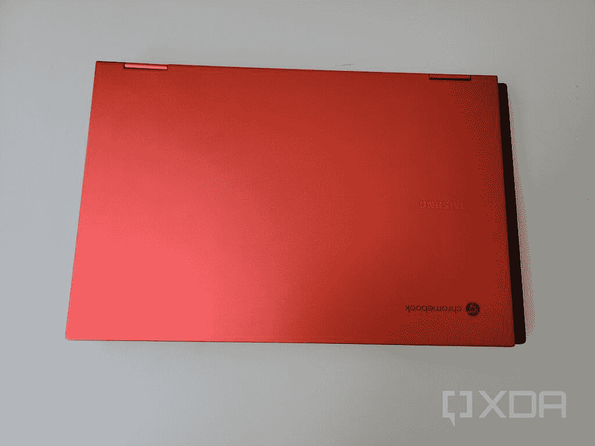

CX9 在 Galaxy Chromebook 2 的右侧略微突出。[/caption]这两款 Chromebooks 的外观和感觉都很棒。我个人非常喜欢三星整个产品系列的设计语言。从智能手机到电视再到 Chromebooks，三星知道如何做出看起来很棒、很突出的东西。Galaxy Chromebook 2 也不例外，尤其是嘉年华红。另一方面，华硕确实加强了他们对 CX9 的设计。你可以看出他们在 CX9 的包装上花了很多心思。大多数 Chromebook，包括 Galaxy Chromebook 2，都装在一个平淡无奇的棕色可回收盒子里，但 CX9 盒子有点大。当我收到邮寄的包裹时，我想知道他们包括了什么需要这么大的盒子。事实证明，棕色的外盒只是为了保护装有 CX9 的光滑的海军蓝产品盒。你还可以得到一个单独的较小的深蓝色盒子，里面放着充电砖和电缆。

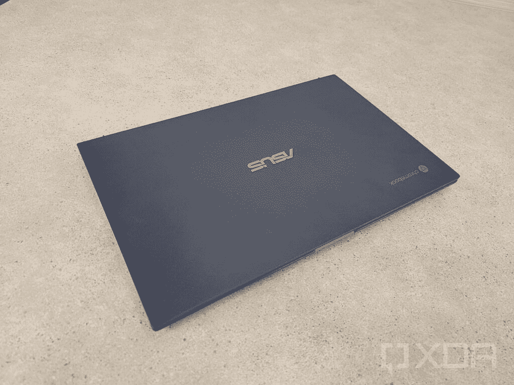

在 Galaxy Chromebook 2 上，铝制机箱感觉坚固而充实，随身携带是一种享受。冷金属的触感让塑料机身的 Chromebook 感觉不太理想。如果你喜欢在人群中脱颖而出，Galaxy Chromebook 2 上的嘉年华红色肯定会令人眼花缭乱。红色是如此明亮，以至于我在亚利桑那州明亮的阳光下拍摄的几张照片看起来几乎是橙色的。CX9 的官方产品介绍称该设备的颜色为黑色，但很明显它更像深蓝色而不是黑色。无论如何，这都是 Chromebook 上真正独特的颜色，就像三星的嘉年华红一样。第一次拿起 CX9，它的设计之轻、之坚固几乎令人震惊。重量不到 2.5 磅，这是市面上最轻的 14 英寸 Chromebooks 之一。但同时，底盘的刚性也是无与伦比的。

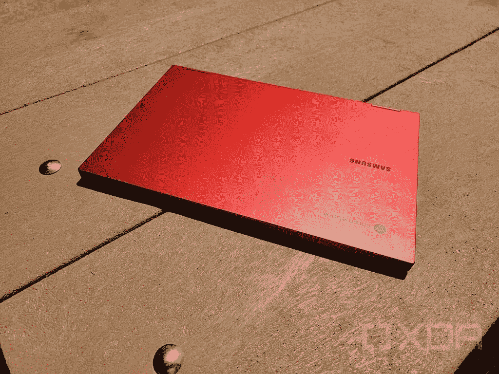

虽然这两款设备都有很好的框架，但就刚性而言，CX9 显然是赢家。Galaxy Chromebook 2 的底盘有一定程度的弯曲，如果你抓住它的一角，它可能会弯曲得太多，我不喜欢。你可以从任何一边或角落拿起 CX9，而不会感觉到丝毫的弯曲。对于 Chromebooks 来说，这有点反常，这让 CX9 在我心目中脱颖而出。

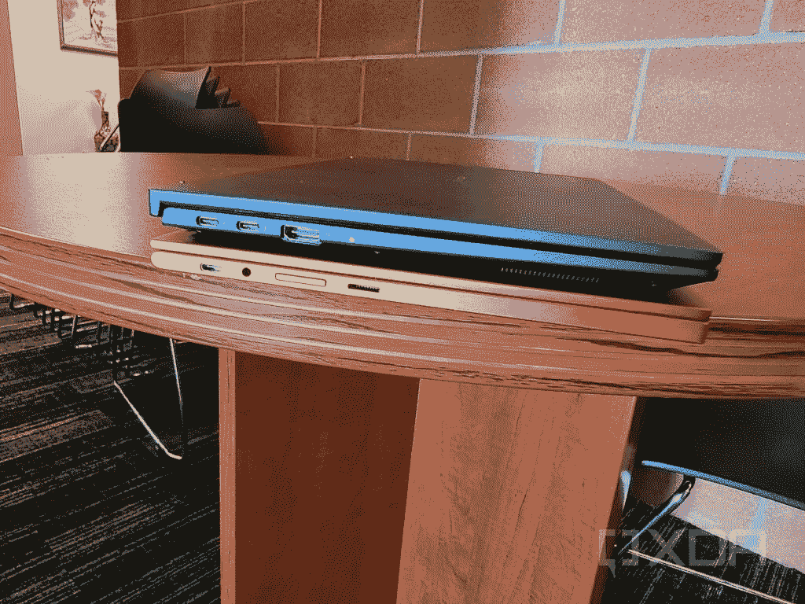

在比较笔记本电脑时，我最喜欢的测试之一是单手打开测试。你知道，你能用一只手打开盖子吗？这看起来是一件小事，但却是你每天都会遇到的可用性问题。不幸的是，Galaxy Chromebook 2 需要双手才能打开盖子。华硕 Chromebook CX9 的情况稍好一些——你可以用一只手打开它，但你需要慢慢提起盖子，以免将灯底座抬离桌子或书桌。考虑到每台笔记本电脑的轻型框架，这些结果并不令人惊讶。

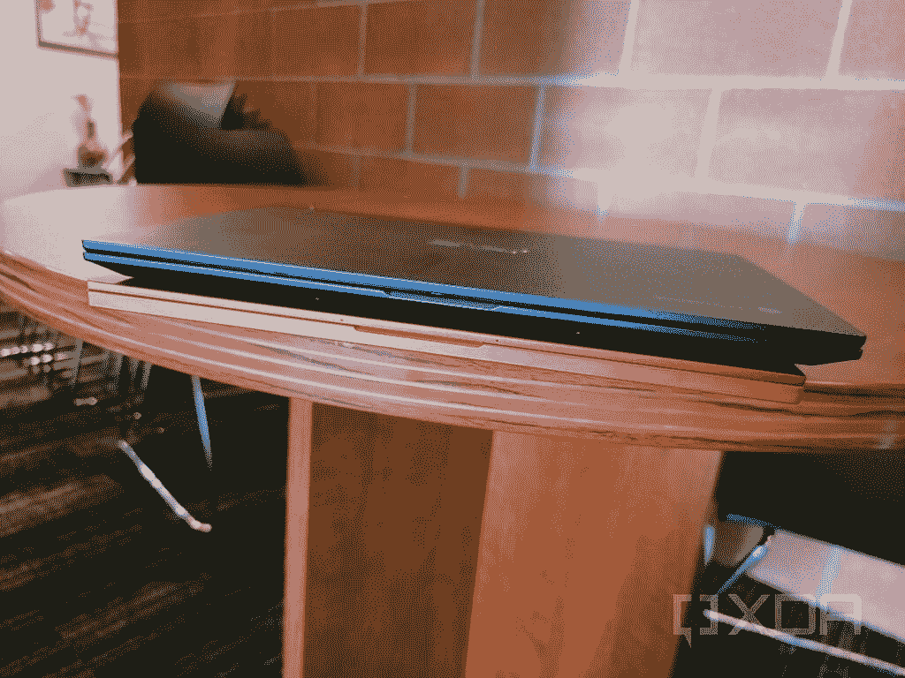

另一个关键区别是 Galaxy Chromebook 2 的二合一功能。您可以将键盘完全折叠起来，将此设备用作平板电脑。CX9 屏幕实际上可以 180 度旋转平放，但不能完全折叠成平板电脑形状。这实际上只是设计上的差异，因此您必须决定是否需要 2 合 1 功能。我猜 CX9 刚性优势的一部分是它需要适应平板电脑模式，采用更坚固的铰链。

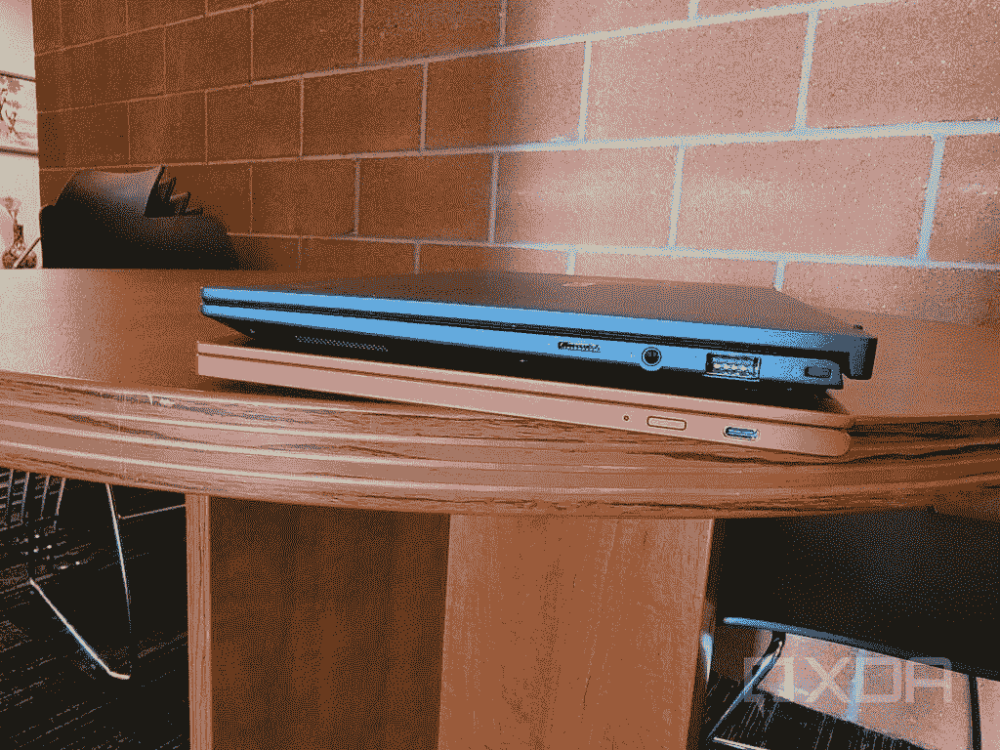

向可用端口移动。在 CX9 上，你有两个

[Thunderbolt 4](https://www.xda-developers.com/best-thunderbolt-4-laptops/)

端口，具有供电能力。一个 HDMI 3.0b 端口和一个 USB 3.2 Gen 2 Type-A 端口，以及一个 3.5 毫米耳机插孔。肯辛顿锁插槽完善了设备侧面的可用端口。Galaxy Chromebook 2 具有 2 个 USB-C 端口、microSD 插槽和 3.5 毫米耳机插孔。CX9 具有明显的连接优势。缺少 HDMI 或 USB-A 端口是我在 Galaxy Chromebook 2 上的一大缺点。Thunderbolt 4 当然是 CX9 的亮点，但这更多的是锦上添花。

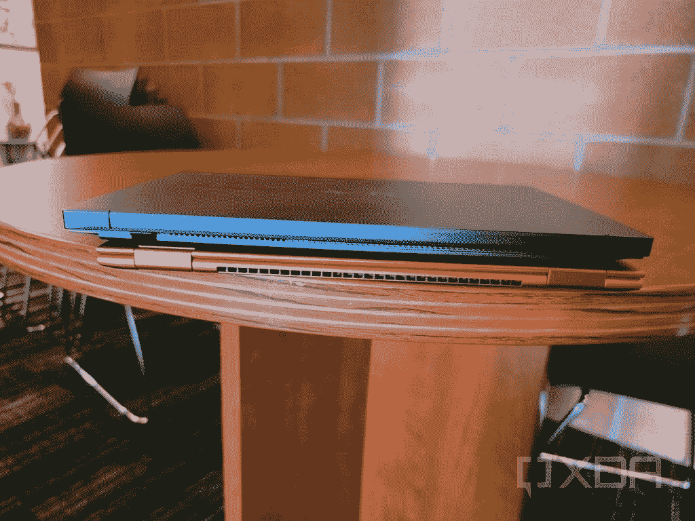

总的来说，CX9 具有更好的构建质量和端口可用性。虽然 Galaxy Chromebook 2 有点薄，但它没有那么轻，而且有点弯曲。构建质量之战势均力敌，但 CX9 仅在端口可用性方面就真正领先。具有前瞻性的 Thunderbolt 4 端口非常棒，但对大多数消费者来说，提供 HDMI 和 USB-A 也是一笔更大的交易。

## 显示器和音频

CX9 显示屏的亮度完全符合规格表上广告的 400 尼特。如果面板在室外条件下超过 400 尼特，我不会感到惊讶。我在亚利桑那州的阳光下用了一会儿我的 CX9，在我的屏幕上看任何东西都没有问题。

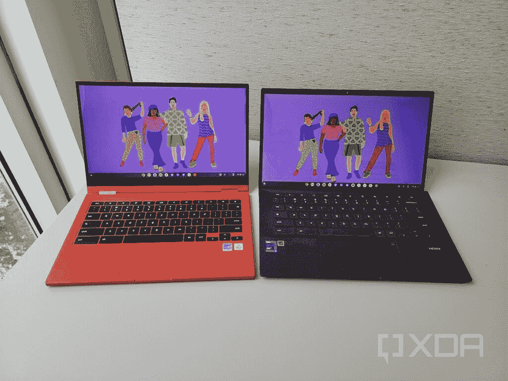

在 115 度的高温下进行广泛的户外测试非常困难，但我对这款 Chromebook 的亮度非常满意。把它和我的 Galaxy Chromebook 2 放在一起，面板至少一样亮。鉴于三星在异常明亮的显示屏方面的声誉，华硕在这方面确实有所成就。老实说，CX9 在亮度方面有一点优势，这有点令人震惊。13.3 英寸 QLED 1920 x 1080 无疑是 Galaxy Chromebook 2 上最突出的组件。虽然你不再像最初的 Galaxy Chromebook 那样拥有 4K 显示屏，但 Chromebook 上有史以来第一个全高清 QLED 显示屏令人印象深刻。它还覆盖了 100%的 DCl-P3 色域，如果你想在笔记本电脑上进行轻松的照片编辑，这很有用。在这款 Chromebook 上，从网飞传输内容和在体育场玩游戏绝对是一种享受。鲜艳的色彩和令人印象深刻的黑色水平也给在线图文并茂的内容带来了生机。当您比较这些设备的色彩质量和黑色水平时，这是 CX9 略显不足的地方。在我看来，Galaxy Chromebook 2 显示屏看起来更有吸引力，黑色更深。与 Galaxy Chromebook 2 相比，CX9 看起来也有点模糊，或者至少没有那么清晰。当然，当谈到颜色配置文件时，偏好会有所不同。尽管如此，我认为显示器质量类别(亮度除外)在这场战斗中属于三星。

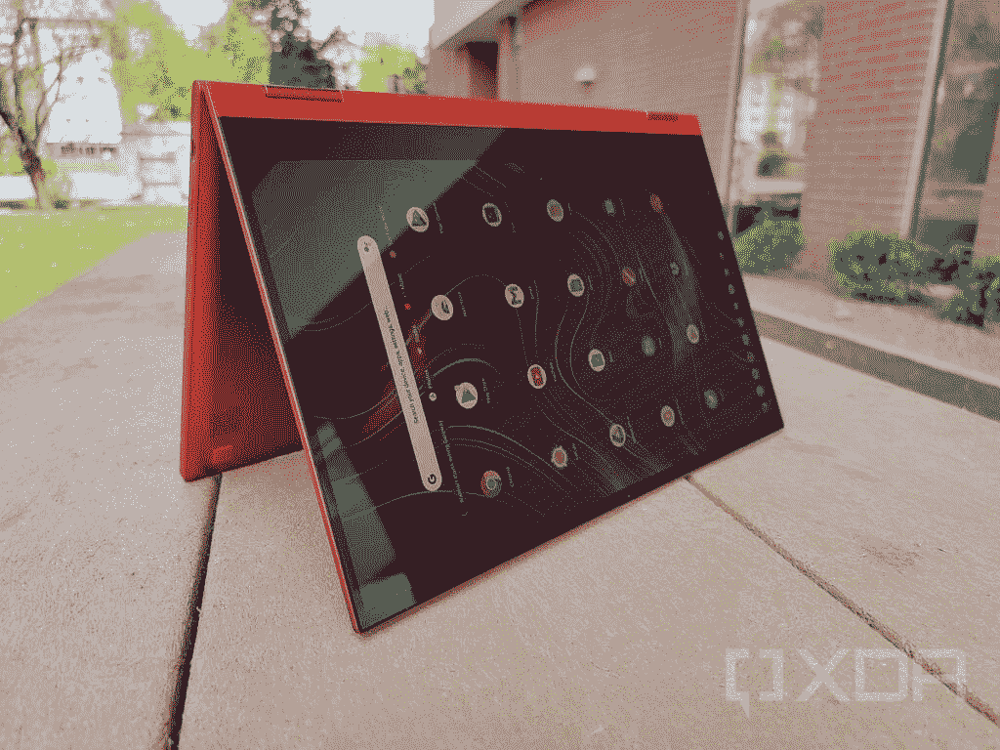

在比较这些显示器时，宽高比是另一个区分因素。CX9 有一个相当宽的 16:9 宽高比，我不是一个出于生产力目的的超级粉丝。Galaxy Chromebook 2 略高的 16:10 宽高比实际上感觉更宽敞。如果您编辑大量文档或以写作为生，在选择新笔记本电脑时，这是一个重要的考虑因素。

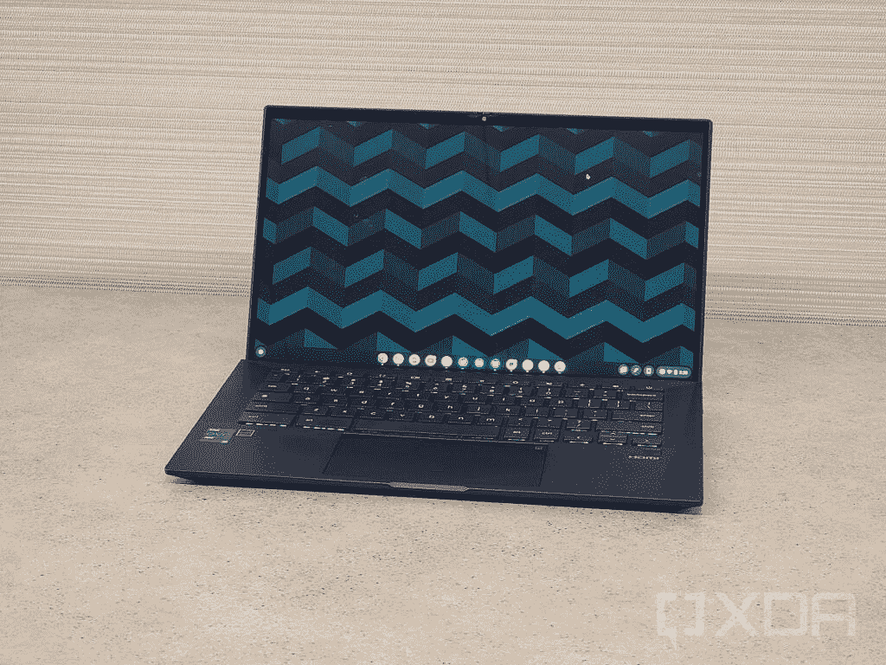

CX9 和 Galaxy Chromebook 2 的音频质量都相当令人失望。CX9 上的扬声器被吹捧为由哈曼卡顿调谐，但声音输出相当平庸。他们完成了观看网飞或 YouTube 的工作，但对我来说他们不够大声。三星在其网站和宣传材料中吹嘘 Galaxy Chromebook 2 中包含的“智能放大器音频”，但很难欣赏扬声器定位如此糟糕的更大声的放大器。总的来说，在这两款 Chromebooks 上，任何严肃的音频会话都需要耳机。

## 键盘和触摸板

如果你在工作中使用 Chromebook，键盘和触摸板是最重要的两个方面。在写我的完整评论时，我花了两周时间分别用 CX9 和 Galaxy Chromebook 2 作为我的主要工作笔记本电脑。

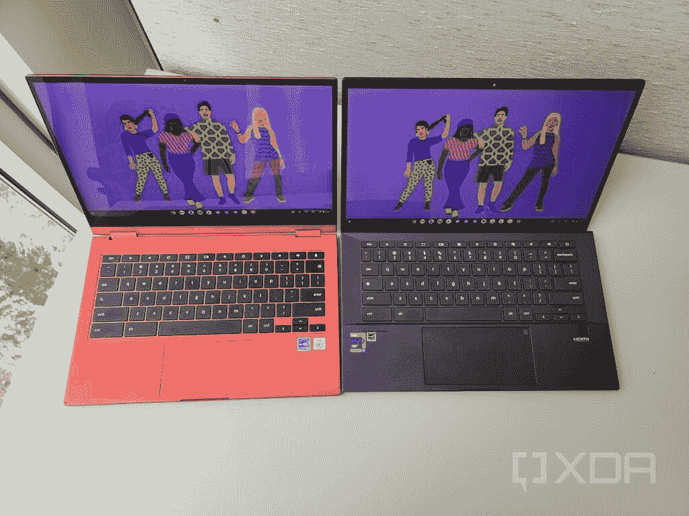

我在 XDA 的大部分工作包括撰写文章、编辑图片，以及通过 Slack 和 Asana 与团队成员互动。我使用 CX9 和 Galaxy Chromebook 2 来完成所有这些任务，但也用 Python/MATLAB 编写了一些简单的代码，并用 LaTeX 排版。对于一台 13.3 英寸的 Chromebook 来说，Galaxy Chromebook 2 上的键盘感觉相对宽敞。键程相当浅，但考虑到轻薄的机身，这是意料之中的。我能够在这个键盘上准确快速地打字..键盘上的背光相当明亮和均匀。我在使用中没有发现任何实质性的轻微出血。黑色键帽与红色机箱形成了惊人的对比，在打开时也提供了一个非常漂亮的设备。

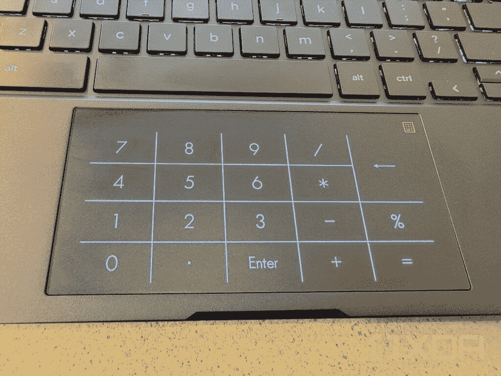

CX9 的键盘简直太棒了。不仅琴键有合适的移动量，而且由于框架的刚性，你也不会感觉到任何不稳定。你可以在这个键盘上敲几个小时而手指不会疲劳。我的打字体验非常快速和准确。当你打开 CX9 时，NanoEdge 设计还可以稍微抬起键盘。这种外观不是每个人都喜欢的，但我认为它提供了更符合人体工程学的打字体验。背光也很出色，较暗的键帽提供了很好的对比度，在黑暗中也有很好的可视性。说到底，CX9 键盘长时间使用更令人愉快。在 CX9 上长时间打字后，我感觉舒服多了。Galaxy Chromebook 2 还不错，但它也不是我为那些每天在笔记本电脑上写几个小时的人推荐的键盘。

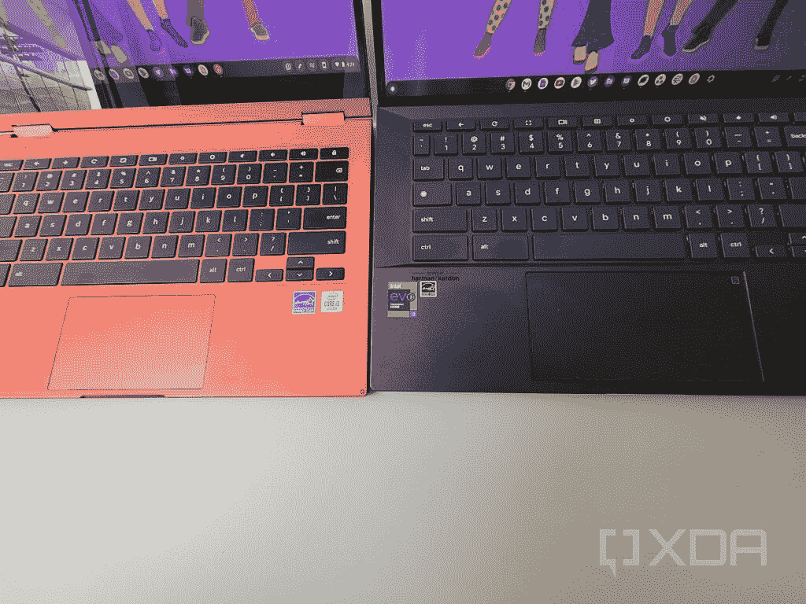

我很高兴地报告 CX9 上的触摸板在质量上等同于键盘。这是 Chromebook 上可用的较大的玻璃触摸板之一。额外的空间使 UI 导航变得轻而易举。如果您喜欢令人满意的点击和高质量的触觉反馈，CX9 触摸板不会让您失望。

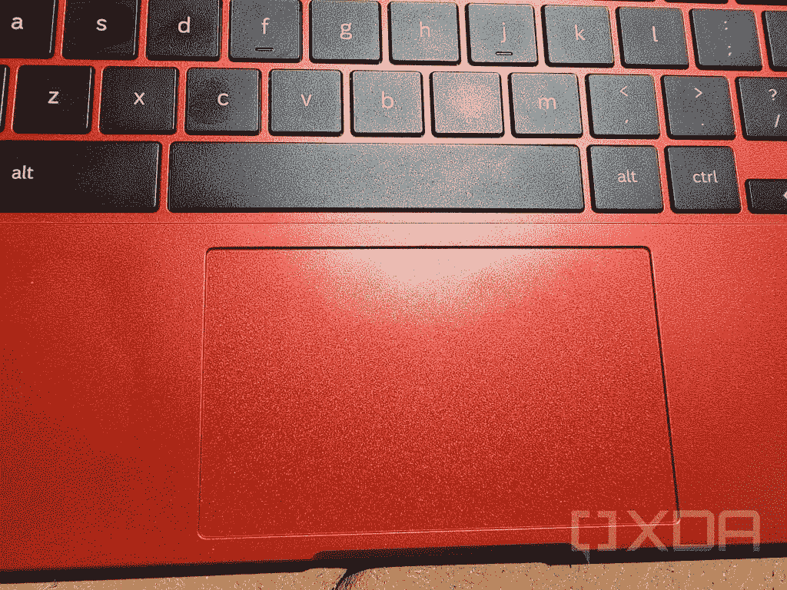

至于 Galaxy Chromebook 2 上的触控板，还可以。滚动和手势都很好，但我的设备上的触摸板在点击时有点模糊。也许这只是运气不好，但我也因为长时间使用 Pixelbook Go 和 MacBook Pro 触摸板而被宠坏了。另外，触摸板对于日常使用来说似乎有点小。如果 Galaxy Chromebook 2 是你的常规工作机，我肯定会建议你使用外置鼠标或触控板。三星还移除了第二代设备中的指纹传感器，这是华硕 Chromebook CX9 键盘下方的另一个额外功能。

## 性能和电池寿命

Galaxy Chromebook 2 的性能至少部分受到您购买的型号的影响。在低端，配备 4GB 内存和 64GB 存储的赛扬型号可能不适合处理视频编辑等高端任务。另一方面，我使用的 Core i3 型号在处理我扔给它的一切方面给人留下了相当深刻的印象。在 Galaxy Chromebook 2 上，我运行了几个要求苛刻的 Linux 应用程序，如 GIMP、MATLAB 和 Kdenlive。基本照片和视频编辑是无缝的。粉丝们很少参与进来，只有当我在 Kdenlive 中导出 4K 的视频或者在 MATLAB 中运行一个要求很高的脚本时，才能听到他们的声音。当然，在 Chrome OS 上，用户界面的导航几乎完美无缺。笔记本电脑或平板电脑模式没有延迟，所有各种帐篷模式都如您所料。

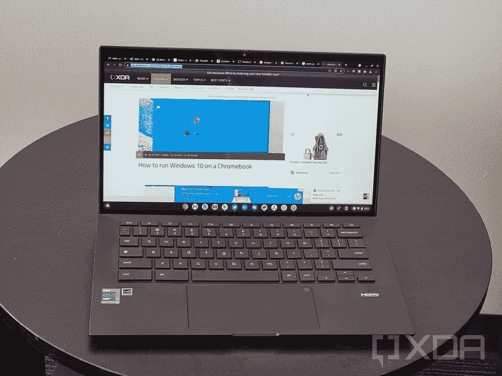

CX9 的日常性能非常出色，这与 Tiger Lake i7 和 16GB 内存是一致的。在这款设备上运行 Android 和 Linux 应用非常流畅。我甚至运行非常密集的 Linux 应用程序，如 MATLAB，完全没有问题。如果你在 Linux 上做大量资源密集型的工作，并且打开了大约 50 个 Chrome 标签，粉丝们偶尔会加入进来，但在我看来这是相当合理的。即便如此，在过去的两周里，在我的任何一次使用中，风扇都没有发出令人难以置信的声音。我花了相当多的时间玩了几个 Android 游戏，Stadia 和《我的世界》，希望也能测试 CX9 的游戏极限。也许不出所料，我从未用 CX9 碰壁。没有丢帧，没有延迟，没有任何问题。今年晚些时候，当 Borealis 为 Chrome OS 提供官方 Steam 支持时，内部 Iris Xe 图形的真正潜力将会实现。在那之前，如果你买了一台 CX9，你可以感到安慰的是，这是第一台专为游戏应用程序打造的 Chromebook。

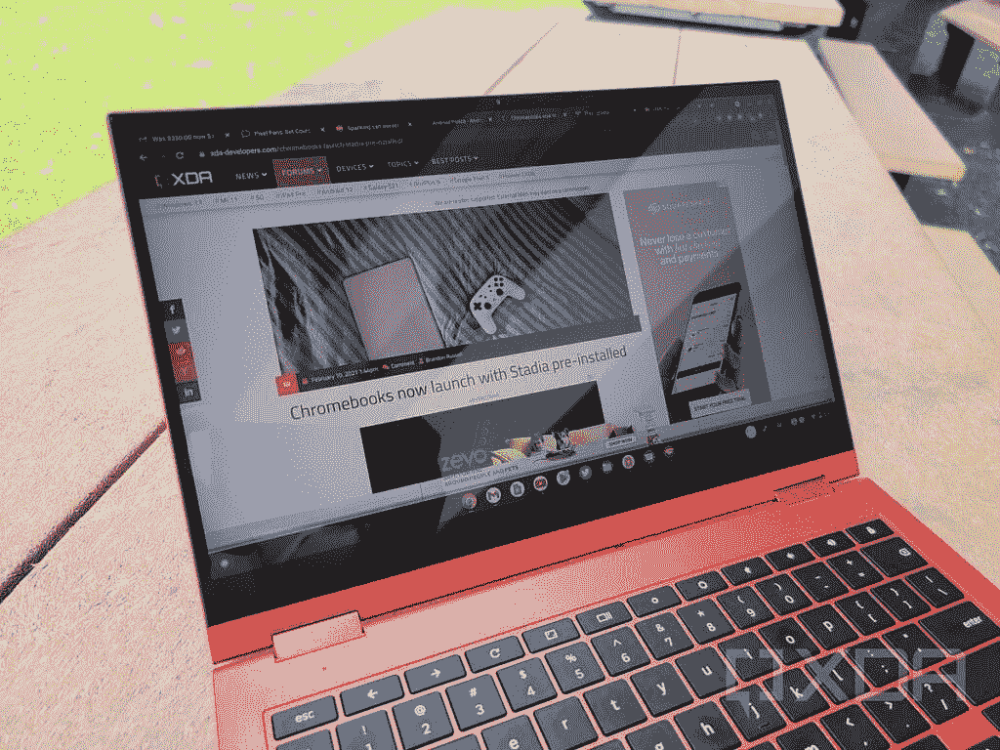

请记住，在我的比较中，基准测试非常有利于 CX9，在我个人拥有的机器中，Tiger Lake Core i7 比 Galaxy Chromebook 2 中的第 10 代 Core i3 强得多。CX9 的 Core i3 型号在这方面与 Galaxy Chromebook 2 更接近，但我手头没有 CX9 的 i3 型号进行测试。对于仅仅运行一堆 Chrome 标签页或编写文档的用户来说，这些基准可能也没有太大意义。另一方面，如果你想在 Chromebook 上用 Linux 进行大量计算，或者最终用 Borealis 玩 Steam 游戏，1149 美元的 CX9 肯定是赢家。实际上，两款 Chromebooks 的电池续航时间相当相似。华硕声称 CX9 的续航时间为 14 小时，三星宣传 Galaxy Chromebook 2 的续航时间为 13 小时。这两个估计都不接近。如果你打开大量的 Chrome 标签，并在其他基本的生产力应用程序中工作，你可以安全地预计每天使用约 7-8 小时。对于要求更高的游戏或使用 Kdenlive 的 Linux 计算，我能够在这两台机器上运行大约 4-5 个小时。电池性能相当中等，在这一类中没有什么可兴奋或不安的。

## 高级功能

说到额外的功能，CX9 有明显的优势。除了前面提到的键盘下方的指纹扫描仪，你还可以获得内置的 LED 数字键盘，网络摄像头隐私保护罩，更不用说里面的虹膜 Xe 图形。所有这些项目都完美无缺。正如你所料，指纹扫描仪非常快。有一个指纹登录选项非常好——每一个高级 Chromebook 都应该有生物识别安全性。Galaxy Chromebook 2 上指纹扫描仪的移除(来自最初的 Galaxy Chromebook)令我失望。

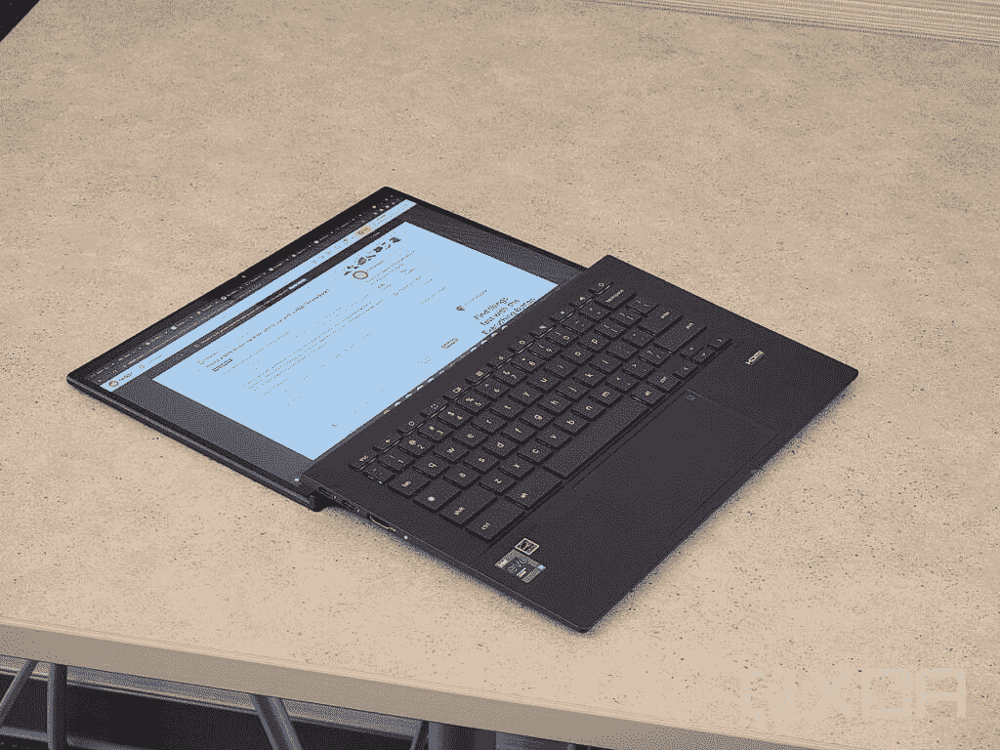

让我们来讨论一下 CX9 最独特的功能，内置的 LED 数字键盘。这对我来说是一个很大的卖点，因为我在我的学术工作中做了相当多的数字运算。在如此紧凑的外形中拥有一个专用的数字键盘非常方便。背光的激活也是无缝的。在使用数字键盘处理电子表格时，您还可以使用触摸板本身进行点击。我赞赏华硕的创新，为 Chromebook 带来了许多高级用户需要的功能。

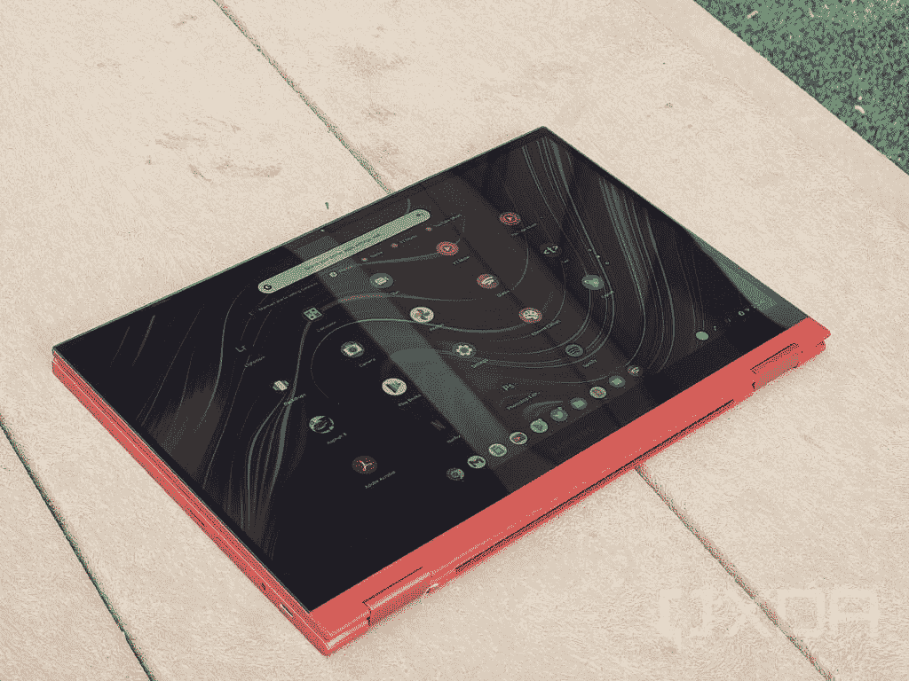

Galaxy Chromebook 2 擅长的一个领域是笔记。当用 USI 笔记笔记时，2 合 1 设计更加方便，在更昂贵的型号上，这两种 Chromebooks 都支持这种设计。在 CX9 设备上做笔记很棘手。CX9 不是二合一敞篷车，但由于铰链设计，它可以平放。尽管这仍然不是一种理想的写作体验。当你认真做笔记时，键盘会妨碍你的手掌。

## 结论:你应该买哪款 Chromebook？

三星 Galaxy Chromebook 2 是迄今为止

[best Samsung Chromebook](https://www.xda-developers.com/best-samsung-chromebooks)

在外面。毫无疑问，CX9 是

[best ASUS has to offer](https://www.xda-developers.com/best-asus-chromebooks/)

。两款 Chromebooks 都有一些同类最佳的功能。Galaxy Chromebook 2 的显示屏对我来说是一个赢家。它不仅看起来更好，16:10 的宽高比也更适合工作或学校应用。

### 三星 Galaxy Chromebook 2

通过 Galaxy Chromebook 2，三星取消了一些高端功能，但也大幅降低了价格。作为第一款采用 QLED 显示屏的 Chromebook，该机仍然为大多数用户提供了充足的动力和时尚。

**Affiliate Links**

Samsung

[View at Samsung](https://shop-links.co/link/?exclusive=1&publisher_slug=xda&article_name=ASUS+Chromebook+CX9+vs+Samsung+Galaxy+Chromebook+2%3A+Which+should+you+buy%3F&article_url=https%3A%2F%2Fwww.xda-developers.com%2Fasus-chromebook-cx9-vs-samsung-galaxy-chromebook-2%2F&u1=UUxdaUeUpU3898&url=https%3A%2F%2Fwww.samsung.com%2Fus%2Fcomputing%2Fchromebooks%2F12-14%2Fgalaxy-chromebook2-fiesta-red-chrome-os-13-3-xe530qda-ka1us%2F)

除了显示屏，CX9 在其他几个关键类别中也是赢家。您不仅可以获得更新的英特尔芯片，还可以获得更耐用的设计、更快的固态硬盘存储、卓越的键盘和更宽敞的触控板。事实上，CX9 还拥有许多 Galaxy Chromebook 2 上没有的高级功能。CX9 的高端 i7 型号也是面向未来的，因为我们正在为 Chrome OS 上的 Steam 游戏的未来做准备。

### 华硕 Chromebook CX9

华硕 Chromebook CX9 是你今天能买到的整体最好的 Chromebook。拥有令人惊叹的轻巧和坚固的结构、令人印象深刻的规格和众多先进功能。如果你想要一台 Chromebook 用于严肃的工作或娱乐，CX9 可以满足你。

**Affiliate Links**

ASUS

[View at Asus](https://store.asus.com/us/item/202107AM140000008/laptopschromebook-ASUS-Chromebook-CX9%2C-14%E2%80%9D-Touchscreen-Full-HD-NanoEdge-Display%2C-Intel-Core-i7-1165G7-Processor%2C-512GB-PCIe-SSD%2C-16GB-RAM%2C-USI-Stylus-Support%2C-NumberPad%2C-Chrome-OS%2C-Magnesium-alloy%2C-CX9400CEA-DS762T)

这两款设备都是很好的选择，对于大多数用户来说，酷睿 i3 型号应该足够了。如果你在 Chromebook 上观看大量媒体，并且主要用于内容消费和轻度生产力，我会推荐 Galaxy Chromebook 2。如果您计划创建内容，将 Chromebook 用作主要工作设备，或者想要玩一些严肃的游戏，请选择华硕 Chromebook CX9。