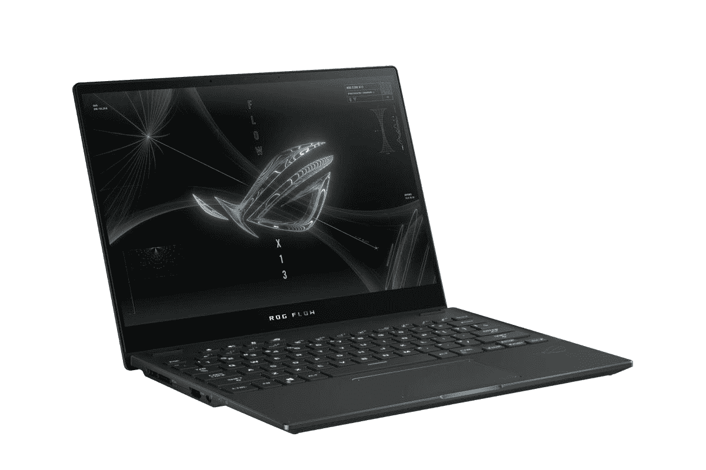

# 华硕 ROG 流 X13 审查:最强大的 2 合 1 游戏笔记本电脑

> 原文：<https://www.xda-developers.com/asus-rog-flow-x13-review/>

通常，当我们谈论 2 合 1 笔记本电脑时，更多的是时尚的设计和便携性。但华硕正在将其提升到一个全新的水平。新款 ROG Flow X13 是一款超便携的 13 英寸笔记本电脑，可以为移动游戏提供一些支持。但是，如果你想全力以赴，只需插入 ROG XG Mobile，它装载了高达[英伟达 GeForce RTX 3080](https://www.xda-developers.com/nvidia-geforce-rtx-30-series-mobile-gpus-for-laptops-officially-announced/) 以获得令人惊叹的高端游戏体验。

外部 GPU 并不是一个新概念。我们过去曾看到制造商试图销售带有 Thunderbolt 端口的超薄笔记本电脑，这些端口可以连接到全尺寸的外部 GPU。唯一的问题是外部 GPU 外壳很大。此外，Thunderbolt 也有一定的速度限制。华硕通过制造一种真正紧凑的移动坞站成功解决了这一问题，这种坞站不仅易于在背包中携带，还可以容纳一个带有各种 I/O 端口的 RTX 3080。该公司没有使用传统的 Thunderbolt，而是使用一种特殊的 PCIe 连接器，无需任何额外的软件或驱动程序即可无缝工作。只要插上电源，你就可以开始工作了。我有机会玩笔记本电脑，下面是我的经历。

## 华硕 ROG 流 X13:规格

| 

规格

 | 

华硕 ROG 流量 X13

 |
| --- | --- |
| **尺寸&重量** |  |
| **显示** | 

*   13.4 英寸 WQUXGA (3840 x 2400) IPS
    *   60Hz 刷新率
    *   16:10 的比例
    *   116% sRGB
    *   85% DCI-P3
    *   300 尼特亮度
    *   自适应同步
    *   Pantone 已验证

 |
| **处理器** | 

*   AMD 锐龙 5900HS (3.1GHz / 4.5GHz)

 |
| **GPU** | 

*   AMD 镭龙集成显卡
*   NVIDIA GeForce GTX 1650 Max-Q (4GB)

 |
| **闸板&存放** | 

*   16GB LPDDR4X RAM
*   1TB 2230 NVMe PCIe 3.0 固态硬盘

 |
| **电池&充电器** | 

*   62 小时
*   100W 充电器
*   支持 100W USB PD 充电

 |
| **输入/输出** | 

*   HDMI 2.0b
*   ROG XG 移动接口
*   2x Type C USB 3.2 Gen 2
*   3.5mm 组合音频插孔

 |
| **连通性** | 

*   Wi-Fi 6 (802.11ax)
*   蓝牙 5.1(双频)

 |
| **操作系统** |  |
| **其他特征** |  |

***关于本次评测:**华硕印度派出的 ROG Flow X13 (4k 显示屏，16GB RAM，1TB 存储)仅供测试使用。下面的意见是基于 15 天的常规使用笔记本电脑。华硕没有投入到这篇文章的内容。*

## 设计:隐秘但不完美

Flow X13 是一款 13 英寸超便携 2 合 1 笔记本电脑，这意味着铰链允许显示屏完全折叠，并可在不同模式下使用。事实上，在帐篷模式下使用笔记本电脑实际上有助于提高性能(稍后将详细介绍)。这台机器重 1.3 千克，非常轻便，便于携带，我发现它放在我的桌子上和床上都非常舒适。

仔细一看，可以看出华硕在 Flow X13 的设计上玩得很稳妥。没有响亮的品牌或 RGB 照明，除了箭头键正下方的一个微妙的纹理 ROG(玩家国度)标志，盖子底部的一个小小的 ROG 金属铭牌，以及显示屏下的系列名称。我所欣赏的是华硕对纹理和图案的关注。盖子和底盖的纹理对角线赋予了它独特的外观，如果你从一个角度看它，你可以看到分裂三角形的设计，这已经成为所有 ROG 笔记本电脑的主食。同样，你可以看到掌托上以及内部更细的对角线。

尽管是由镁合金制成的，但这款笔记本给人一种非常塑料的感觉。此外，全黑，隐形完成似乎有点低调和静音，但这只是一个非常个人的选择，因为它看起来一点也不差。我确实注意到内壳和外壳吸引污迹，虽然很容易擦掉，但我对所用材料的质量有很高的期望。

来到端口，华硕已经塞进了全尺寸的 USB 和 HDMI 端口。还有一个 USB Type-C 端口，一个 3.5 毫米音频插孔，以及由可拆卸硅胶盖保护的 XG Mobile 外部 GPU 的专有连接器。值得注意的是，这个连接器分为两部分，其中较小的一半是 USB-C 端口，支持数据传输和给笔记本电脑的电池充电。

考虑到笔记本电脑的外形因素，我认为这是一组健康的端口。至于排气孔，有两个位于显示器铰链旁边，一个位于右侧。扬声器放在底部，所以有点受限，音频表现也就一般。

最令人失望的设计选择是电源按钮。首先，放置在右边缘，而不是在键盘的顶角。喜欢平板电脑方向的用户可能会喜欢这一点，但它与身体齐平，很难定位。最重要的是，它有一个嵌入式指纹识别器，在我两周的测试中，它似乎不是很准确。

[sc name="pull-quote" quote= "电源按钮放置不当，嵌入式指纹扫描仪不太准确。"]

卸下 11 颗螺丝，就可以卸下底部面板，让您接触到内部部件。你可以看到 RAM 是焊接的，甚至微小的英特尔 Wi-Fi 模块也嵌入到主板上。M.2 固态硬盘是唯一一个隐藏在小型散热垫下的用户可升级部件。值得注意的是，该笔记本电脑只能容纳一台 M.2 2230，因此可能很难获得一台。

## 显示器:适用于大多数用例

13.4 英寸显示屏具有光滑的表面，作为第一款提供 16:10 纵横比的华硕游戏笔记本电脑，您可以获得更多的垂直覆盖范围。边框两侧相当薄，但顶部和底部不太薄。非常规的长宽比也意味着你在观看内容的时候会看到黑带。华硕在这款笔记本上内置了一个网络摄像头，不像 [ROG 西风系列](https://www.xda-developers.com/asus-rog-zephyrus-g15-review/)，所以你不必依赖外部摄像头。触摸屏面板由 Gorilla 玻璃保护，并提供 4K (3840 x 2400 像素)60Hz 刷新率选项或 120Hz 刷新率的全高清(1920 x 1200 像素)选项。在我看来，选择后者更有意义，因为你可以欣赏更高的帧速率。话虽如此，华硕给了我们一个配备 4K 面板的单元，这还不错，但我更喜欢更快的帧速率，而不是更高的像素数量。该显示器还支持华硕捆绑在盒子中的手写笔。它没有什么特别的地方，我也不是很喜欢写作或素描，所以我根本就没想过要用它。

这听起来像是一个令人印象深刻的纸面显示器，因为华硕列出的面板为 13.4 英寸，提供 116%的 sRGB 覆盖率，86%的 Adobe RGB 和 85%的 DPI-P3 色彩空间。它提供自适应同步功能，也经过 Pantone 验证。我喜欢显示器上的颜色，因为它们看起来很有冲击力，它也应该适合一些创造性的工作，如照片或视频编辑。它被评为提供 300 尼特的亮度，它不是超级亮，但它完成了工作，我在室内使用它没有任何问题。

虽然我不太确定 4K 分辨率的面板。这款笔记本电脑超越了游戏的范畴，适合各种用户。这可能是华硕有这个选项的原因，但在 13.4 英寸，我认为全高清面板非常好。话虽如此，我在 Flow X13 上观看视频非常开心，特别是因为有不同的模式选项，可以方便地在几乎任何地方使用。在游戏方面也是如此，尽管我希望华硕给了我 120Hz 的刷新率选项。

## 键盘和触摸板

键盘的外观和手感都很好，布局与 ROG Zephyrus G15 相同。按键之间有很大的间距，按键出奇的好，尤其是考虑到笔记本电脑有多纤薄。你还可以在顶部找到音量、麦克风静音/取消静音的专用键，以及启动军械库机箱软件的键。正如我上面提到的，没有花哨的 RGB 照明，所以你必须妥协，使用简单的白色背光，可以使用更多的亮度。

触摸板比大多数 13 英寸笔记本电脑上的触摸板要小，这是因为键盘的布局，尤其是顶部的专用键。我真的不介意大小，但喜欢使用手势的人可能会觉得很难使用。

此外，不要按照上面的图片，因为触摸板的表面是光滑的，纹理线位于玻璃面板下方。总的来说，这不是我迄今为止使用过的最好的触摸板，但它确实完成了任务。

## 性能:2 合 1 笔记本电脑上最强大的 CPU

华硕提供了“超新星版”的 ROG 流 X13，可与 AMD 最新的[锐龙 9 5980HS](https://www.xda-developers.com/amd-ryzen-5000-mobile-7nm-zen-3/) 八核处理器一起使用。还有笔记本电脑的标准版，也就是我得到的那款，它配有[锐龙 9 5900HS](https://www.xda-developers.com/amd-ryzen-5000-mobile-7nm-zen-3/) ，具有八个核心，最大时钟速度高达 4.5GHz。笔记本电脑还配有 16GB 的焊接 LPDDR4X 内存和 1TB NVMe PCIe 第三代固态硬盘用于存储。NVIDIA GeForce GTX 1650 GPU 拥有 4GB DDR 6 显存，额定功率高达 40W，考虑到机箱有多纤薄，这还算不错。为了控制温度，华硕使用了 Thermal Grizzly 的液态金属导热膏和双“弧形流”风扇，风扇有 84 个不同厚度的叶片，以增加气流。

[sc name = " pull-quote " quote = " AMD 锐龙 9 5900HS 如此紧凑的外形是华硕的一项大胆举措。"]

从下面的结果可以看出，这款笔记本电脑成功通过了所有 CPU 密集型基准测试。与我去年评测的搭载英特尔第 10 代酷睿 i7 和 RTX 2080 超级处理器的联想军团 7i 相比，ROG Flow X13 在 Cinebench R20、Cinebench R15、Geekbench 5 和 PC Mark 10 上击败了它。但谈到 3D 基准，GTX 1650 只是一个普通的图形芯片组。这就是 ROG XG 手机的用武之地。

|  | 

Cinebench R20(多核/单核)

 | 

Cinebench R15 (多核/单核)

 | 

Cinebench R15 OpenGL

 | 

Geekbench 5 (多核/单核)

 | 

PC Mark 10

 | 

3D 标记时间间谍极限

 | 

3D 标记时间间谍

 | 

3D Mark Firestrike Ultra

 | 

3D Mark Firestrike Extreme

 | 

3D 标记 Firestrike

 |
| --- | --- | --- | --- | --- | --- | --- | --- | --- | --- | --- |
| 华硕 ROG 流 X13(性能模式) | 4231 &#124; 542 | 1526 &#124; 228 | 130.35fps | 7455 &#124; 1413 | 5888 | 1457 | 2995 | 1756 | 3546 | 7299 |
| 华硕 ROG 流量 X13(涡轮模式) | 4546 &#124; 561 | 1931 &#124; 231 | 144.25fps | 7653 &#124; 1402 | 6068 | 1516 | 3333 | 1734 | 3721 | 7741 |
| 华硕 ROG 流 X13 + XG 手机(RTX 3080) | - | - | 145.13fps | - | - | 5659 | 11527 | 6912 | 12720 | 23631 |

至于游戏，入门级的 NVIDIA GeForce GTX 1650 在某些第一人称射击游戏中表现良好。例如，我能够在 Apex Legends 上获得接近 85-90fps 的速度，并且所有的图形设置都被拉下。《古墓丽影的崛起》在最大设置下可以达到 30-35fps，在最低设置下可以达到 55fps，而《星球大战绝地归来》在最低图形设置和垂直同步关闭的情况下平均可以达到 70fps。从本质上讲，笔记本电脑的游戏性能并不具有突破性，但也不可怕。事实上，这是在这种尺寸和厚度的超薄笔记本电脑上可以获得的最佳游戏体验。当然，通过 ROG XG Mobile 添加 RTX 3080 的强大功能完全改变了这种情况，给你带来了图形性能的大幅提升。

| 

比赛

 | 

低设置(1080p，外部显示器)

 | 

高设置(1080p，外部显示器)

 |
| --- | --- | --- |
| Apex 英雄 | 75fps~ | 144fps~ |
| 古墓丽影的崛起 | 55fps~ | 118fps~ |
| 星球大战绝地堕落秩序 | 72fps~ | 115fps~ |
| 永恒的毁灭 | 82fps~ | 130fps~ |
| Forza 4 | 86fps~ | 110fps~ |

ROG XG mobile 是最小的 eGPU 坞站之一，可装载 16GB RTX 3080 GPU。它总共支持 8 个 PCIe 3.0 通道，是基于 Thunderbolt 的 eGPU 的两倍，因此允许更宽的带宽。遗憾的是，这是以专有连接器为代价的，这意味着你只能使用 ROG XG Mobile 和 Flow X13。除了提供图形性能，该坞站还配有各种端口，包括四个 USB Type-A、一个 SD 读卡器、一个 HDMI 2.0a、一个显示端口和一个千兆以太网端口。我收到了 RTX 3080 型号，它带有一个定制的主板，内置 NVIDIA 芯片组，配有吹风机式冷却风扇和散热解决方案，以及一个迷你 280W 内置电源。总的来说，坞站相当紧凑，可以放在笔记本电脑旁边的背包中随身携带。我只是希望连接笔记本电脑的电缆更长，内置的支架更坚固。

关于笔记本电脑的另一个问题是底部有限的穿孔，风扇无法吸入新鲜空气。然而，热量大部分都在控制之中，因为我没有看到 CPU 在各种任务期间超过 90.8 摄氏度或 GPU 超过 72 摄氏度。在玩游戏时，笔记本电脑的键盘中心上方会变热，而掌托会变暖。华硕建议您可以在帐篷模式下获得这款笔记本电脑的最佳性能，因为它可以为内部冷却风扇提供不间断的气流。

内部 SSD 是西部数据 PC SN530 NVMe SSD，支持 PCIe Gen3 x4 接口，速度高达 2,400MBps，虽然不是最快的，但对于包括游戏在内的大多数工作负载来说已经足够快了。我通过运行 CrystalDiskMark 快速确认了峰值读写速度。

说到电池性能，这款笔记本的续航时间在 6 到 7 个小时之间。这主要包括我每天使用 10-15 个浏览器标签的工作流程，在 YouTube 上观看视频，在 Photoshop 上编辑照片，以及在 Spotify 上播放流媒体音乐。我还在 YouTube 上用 4K 视频循环测试了电池，显示亮度设置为 50%。持续了将近六个小时。对于配有 4K 面板的笔记本电脑来说，这并不可怕。捆绑的 100W 充电器相当紧凑，而且还支持 USB 供电，这意味着你可以使用大多数现成的充电器甚至是一个电源组来为电池充电。你需要注意的是，像大多数游戏笔记本电脑一样，独立 GPU 的全部潜力只有在连接到捆绑的充电砖时才能得到利用。

[sc name = " pull-quote " quote = " USB-C 充电使携带小型充电器变得非常方便，尤其是对于经常外出的用户来说。"]

## 结论:独特、昂贵、小众

ROG 流 X13 不像今天市场上的任何笔记本电脑，使它成为一个独特的和有吸引力的建议。华硕凭借这款产品重新定义了二合一类别，并证明了当谈到[伟大的游戏笔记本电脑](https://www.xda-developers.com/best-gaming-laptops/)时，并不缺乏创新。

不得不说，Flow X13 是钱能买到的最强大的 13 英寸笔记本电脑，这要归功于强大的八核 AMD 锐龙 9 5900HS 处理器。看到这款小巧轻便的笔记本电脑发挥出的性能，令人印象深刻。就我个人而言，构建质量和设计有点参差不齐，但老实说，我没有任何重大抱怨。我能想到的唯一竞争对手是 Razer Blade 13 Stealth，但在 Flow X13 上选择 AMD 的锐龙处理器绝对摧毁了任何阻碍它的东西。至于 ROG XG Mobile，它可以增强图形功能，使笔记本电脑能够与成熟的游戏巨头相媲美。

尽管这是一件昂贵的事情。这款笔记本电脑的价格为 1500 美元，如果你打算购买 eGPU 坞站，RTX 3080 型号的笔记本电脑需要额外支付 1500 美元(尽管组合购买要便宜 300 美元左右)。但是，如果您想要一款时尚、紧凑的笔记本电脑，可以携带它去工作，然后回家以最佳性能享受游戏，这可能是市场上最好的解决方案。

华硕还开始销售 ROG 流 X13 与新的英伟达 GeForce RTX 3050 图形处理器，应该提供比板载 GTX 1650 更好的性能。如果你愿意放弃紧凑的机箱或不喜欢外部 GPU 设置，我会建议你选择新的 ROG Zephyrus G14 或类似价格的 G15。

这款笔记本电脑在印度正式发售的起点是₹1,19,990，而 ROG XG Mobile eGPU dock 的 RTX 3070 版本的起点是₹69,990，RTX 3080 版本的起点是₹1,39,990。

 <picture></picture> 

ASUS ROG Flow X13

##### 华硕 ROG 流量 X13

华硕 ROG Flow X13 是一款独特的 13 英寸 2 合 1 游戏笔记本电脑，配有强大的 AMD 锐龙 9 CPU，可以对接至最高可配英伟达 RTX 3080 的 eGPU。