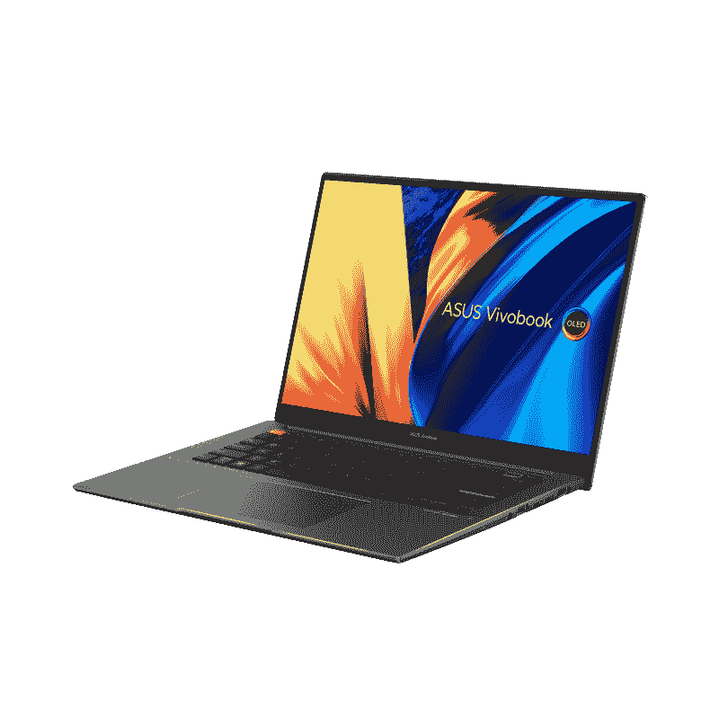

# 华硕 Vivobook S 14X 有机发光二极管评论:有机发光二极管从来没有看起来这么好

> 原文：<https://www.xda-developers.com/asus-vivobook-s-14x-s5402-review/>

华硕 Vivobook S 14X 有机发光二极管是市场上首批拥有 120Hz 有机发光二极管显示屏的产品之一，非常可爱。毕竟，[有机发光二极管笔记本电脑](https://www.xda-developers.com/best-oled-laptops/)一开始就令人愉快，[华硕](https://www.xda-developers.com/best-asus-laptops/)绝对投资在它的屏幕上使用这项技术。除此之外，高刷新率也是厨师的拿手好戏。

不幸的是，这个产品有一些缺点。它仍然使用 720p 网络摄像头，45W 英特尔第 12 代处理器没有配备任何专用显卡。事实上，性能甚至比不上我测试过的处理器不太强大的设备。

不过，总的来说，华硕 Vivobook 14X 有机发光二极管拥有目前笔记本电脑中最好的显示屏，因此它提供了非常棒的体验。

 <picture></picture> 

Asus Vivobook S 14X S5402

##### 华硕 Vivobook S 14X S5402

华硕 Vivobook S 14X S5402 以合理的价格集成了一些高级功能，具有 120Hz 有机发光二极管显示屏、强大的 CPU 等。

**浏览此评论:**

## 华硕 Vivobook S 14X 有机发光二极管:定价和可用性

*   华硕 Vivobook S 14X 有机发光二极管售价 1099.99 美元
*   华硕送去审查的型号是好事多独有的，比其他配置更划算

华硕 Vivobook S 14X 有机发光二极管 S5402 型号现已上市，公司送我审核的型号为 Costco 独家。它包括英特尔酷睿 i7-12700H、12GB DDR4 内存、512GB 固态硬盘，当然还有 14.5 英寸 2.8K 120Hz 有机发光二极管显示屏。

当然，还有其他配置。事实上，虽然华硕发给我的型号是午夜黑，但它也有太阳银和沙灰色等颜色。然而，如果你不是好市多的会员，有一些坏消息。有一款酷睿 i5 SKU，将在亚马逊、百思买和 B&H 等供应商处出售，实际上与好市多的酷睿 i7 SKU 售价相同，为 1099.99 美元。

## 华硕 Vivobook S 14X 有机发光二极管:规格

| 

处理器

 | 英特尔酷睿 i7-12700H 处理器 2.3 GHz (24M 高速缓存，最高 4.7 GHz，6P+8E 内核) |
| 

制图法

 | 英特尔 Iris Xe |
| 

身体

 | 32.23 x 23.09 x 1.79 ~ 1.79 厘米(12.69 英寸 x 9.09 英寸 x 0.70 英寸~ 0.70 英寸)，1.63 千克(3.59 磅) |
| 

显示

 | 屏幕与机身比例:87 %14.5 英寸，2.8K (2880 x 1800)有机发光二极管 16:10 纵横比，LED 背光，0.2 毫秒响应时间，120Hz 刷新率，550 尼特峰值亮度，100% DCI-P3 色域，1，000，000:1，VESA 认证显示器 HDR 真黑 500，10.7 亿种颜色，防眩光显示器，有害蓝光减少 70%，SGS 护眼显示器，屏幕 |
| 

记忆

 | 12GB DDR4 |
| 

储存；储备

 | 512GB M.2 NVMe PCIe 4.0 固态硬盘 |
| 

港口

 | 1 个 USB 2.0 Type-A1x USB 3.2 Gen 1 Type-A2x Thunderbolt 4 支持显示器/电源传输 1 个 HDMI 2.0a1x 3.5mm 毫米组合音频插孔 |
| 

键盘

 | 背光 Chiclet 键盘，1.4 毫米按键行程 |
| 

照相机

 | 720p 高清摄像头，带隐私快门 |
| 

声音的

 | 智能放大器技术内置扬声器内置阵列麦克风 harman/kardon(主流),支持 Cortana 和 Alexa 语音识别 |
| 

电池

 | 70 瓦时、3S1P、3 芯锂离子电池 |
| 

电源

 | C 型，90W 交流适配器，输出 20V DC，4.5A，90W，输入:100～240v 交流 50/60Hz 通用 |
| 

颜色；色彩；色调

 | 午夜黑太阳银沙灰色 |
| 

操作系统（Operating System）

 | Windows 11 主页 |
| 

价格

 | $1,099.99 |

## 设计:它由铝制成，设计巧妙

*   它有午夜黑、太阳银和沙灰色
*   有两个 USB Type-A 端口，但其中一个是 USB 2.0

华硕发给我的型号是午夜黑，但它也有太阳能银和沙灰色。你真的可以把它想象成一台黑色的笔记本电脑。与其他原始设备制造商不同，华硕在外观设计上没有使用任何闪亮的品牌。事实上，有华硕 Vivobook 品牌是用黑色文字压印在盖子上的。

它由铝制成，重 3.59 磅。这比配备专用显卡的笔记本电脑更轻，但比超极本更重。毕竟，华硕 Vivobook S 14X 确实在超极本和强大的 [creator 笔记本电脑](https://www.xda-developers.com/best-creator-laptops/)之间自成一类。它有 45W H 系列 CPU，但没有专用显卡。

就端口而言，我认为华硕犯了一个严重的错误。在左侧，有一个 USB 2.0 型端口。我个人认为 USB 2.0 到现在应该已经死得很惨烈了，可惜没有。右侧有一个 USB 3.2 Gen 1 端口，这意味着作为最终用户，您必须知道设备上两个 USB Type-A 端口的区别。

例如，如果你去插入一个 4K 网络摄像头，你绝对需要使用右边的那个，但如果你不知道两者之间的区别，这将需要一点时间来找出问题所在。在意识到 USB 2.0 和 USB 3.2 Gen 1 的区别之前，你甚至可能会认为一个端口坏了。

同样在右侧的是一个 HDMI 2.0 端口和双 Thunderbolt 4 端口，这两个端口都可以用来充电。显然，Thunderbolt 4 还为你提供了 40Gbps 的数据传输速度，连接外部 GPU 的能力，以及在单个端口上连接两个 4K 显示器或一个 8K 显示器的能力。连接外部 GPU 的功能很棒，因为它已经有了 H 系列处理器，所以它可以成为移动中的工作笔记本电脑，但当你回家时，你可以使用单电缆解决方案来连接强大的显卡，并将其变成游戏笔记本电脑。

## 显示器:华硕 Vivobook S 14X 拥有同类最佳的显示器

*   14.5 英寸屏幕为 2,880x1,800 有机发光二极管，刷新率为 120Hz
*   不幸的是，网络摄像头是 720p 的

我们开始在 PC 市场上看到的一个非常酷的东西是高刷新率显示器。就像 PC 硬件中任何实际有用的新东西一样，它起源于移动市场。在此之前，高刷新率是专门针对游戏玩家的，游戏显示器的问题是，它们通常只适合游戏。现在，我们实际上看到了一些非常好的消费类显示器，它们具有高刷新率，看起来也很舒服。

我们见过 120Hz 的显示器，我们见过 90Hz 的有机发光二极管显示器，但华硕给我们的是 2.8K 120Hz 的有机发光二极管显示器，这是我迄今为止在笔记本电脑上见过的最好的显示器。当你在“设置”中打开高刷新率时，这是一种令人愉快的体验。

Windows 笔记本电脑上这些高刷新率显示器的唯一问题是，它们绝对会耗尽电池寿命。英特尔的处理器在笔记本电脑上做不到高通的处理器在手机上做不到的事情。最重要的是，这款笔记本电脑配有一个耗电处理器。

从我的测试来看，华硕 Vivobook S 14X 支持 100% sRGB、95% NTSC、97% Adobe RGB 和 100% P3，这真是*令人印象深刻。关键是，你甚至不需要把它调到 120 赫兹就能成为笔记本电脑上最好的显示器之一。太棒了。*

上面的显示器测试显示了您对有机发光二极管显示器的预期，黑电平从 0%亮度到 100%保持不变，对比度高达 13，240:1。

网络摄像头有物理隐私保护装置，但坏消息是摄像头仍然是 720p。FHD 网络摄像头正变得越来越受欢迎，如果你有很多视频电话和会议，你可能会想要一个更高质量的网络摄像头。

## 键盘:一般，没问题

*   Chiclet 风格的键盘很好，但仅此而已

关于键盘，我要说的一点是它很精确，这可能是最重要的一点。没有任何遗漏的击键或双击。除此之外，感觉很一般。总的来说，键盘声音很大，没有联想 ThinkPad 或惠普 EliteBook 的那种结实感。

正如你所看到的，它有标准的 Chiclet 风格的按键，当然，它是背光的。它有一些独特的地方，比如橙色的 Esc 键和 Enter 键上的标记，这对一些人来说可能是有用的视觉增强。

触摸板相当大，很不错。我希望在产品的未来迭代中看到它变得更大，但现在这样很好。

电源按钮兼作指纹传感器，由于没有红外摄像头，这是该设备上唯一的生物认证方法。它工作得很好，当你按下它而不是在它启动后扫描你的指纹。

## 性能:没有专用显卡的 H 系列处理器不会给人留下太深刻的印象

*   英特尔第 12 代处理器为 45W，但性能指标评测结果不佳

华硕送我的 Vivobook S 14X S5402 单元包括一个 Core i7-12700H，12GB RAM，没有专用显卡。不幸的是，这不是很好。我觉得某些品牌使用没有 dGPU 的 H 系列处理器变得越来越普遍，我不喜欢这样。我曾经和像惠普这样的主要原始设备制造商谈过，他们总是在下一代产品中放弃这种做法。

我所说的 45W CPUs 通常用于游戏笔记本电脑和移动工作站。它们面向那些需要尽可能多的功能的人，并且倾向于搭配强大的专用显卡。为提高工作效率而制造的笔记本电脑通常配备 15W 的 U 系列处理器，尽管其中一些现在配备了 28W 的芯片。

额外的 CPU 能力显然会增加电池的成本，但性能并没有显著提高。如果你在做创造性的工作，你可能想找一些具有专用图形的东西，这可以是一个较低层次的 dGPU，如用于 Photoshop 和 Lightroom 的 Nvidia GeForce RTX 3050。对于生产力来说，45W 的 CPU 不会带来任何有意义的收益。

集成的 Iris Xe 显卡与酷睿 i7-1260P 中的显卡完全相同，有 96 个执行单元，主频为 1.4GHz。时钟速度比酷睿 i7-1255U 中的显卡稍高。

华硕 Vivobook S 14X S5402 中的酷睿 i7-12700H 也没有很好的基准测试。令人震惊的是，这些分数比我在一台配备酷睿 i7-1255U 处理器和集成显卡的笔记本电脑上得到的分数还要低。为了清楚起见，这些单元是在电源滑块设置为最佳性能的情况下插入的。我甚至对 Vivobook 进行了工厂重置，并再次进行了测试，试图找到一种让它做得更好的方法。它没有。

|  | 

华硕 Vivobook S 14XCore i7-12700H

 | 

戴尔 Inspiron 灵越 14 二合一酷睿 i7-1255U

 | 

戴尔 XPS 15 9520 酷睿 i7-12700H，RTX 3050 Ti

 | 

联想 Yoga 9i 14Core i7-1260P

 |
| --- | --- | --- | --- | --- |
| 

PCMark 10

 | 5,233 | 5,305 | 6,640 | 5,616 |
| 

3DMark:时间间谍

 | 1,202 | 1,507 | 4,535 | 1,678 |
| 

极客工作台

 | 1,510 / 6,014 | 1,711 / 6,700 | 1,774 / 11,580 | 1,736 / 9,525 |
| 

电影院长凳

 | 1,629 / 9,015 | 1,724 / 6,797 | 1,797 / 11,695 | 1,638 / 7,757 |
| 

交叉标记(总体/生产力/创造力/响应时间)

 | 1,356 / 1,389 / 1,342 / 1,300 | 1,428 / 1,450 / 1,464 / 1,265 | 1,855 / 1,735 / 2,052 / 1,671 |  |

您可以看到它与英特尔产品线的其他产品(最新的 U 系列酷睿 i7 和新的 P 系列酷睿 i7)相比的情况，但我还想展示与具有相同处理器和一些较低层专用显卡的笔记本电脑相比的得分差异。然而，请注意，Geekbench 和 Cinebench 都是专门的 CPU 测试，所以从理论上讲，Vivobook 应该在这两项测试中与戴尔 XPS 15 9520 相匹配。我无法让它这样做。

屏幕设置为 120 赫兹时，电池续航时间约为 3 小时，屏幕设置为 60 赫兹时，电池续航时间约为 5 小时，这与我的预期大致相同。许多公司都引用了很大的电池寿命数字，但这通常是当你实际插入现实用例时的结果。

我还得说，我用这台笔记本电脑做的电池测试比用其他的少。方法总是将电源滑块设置为平衡，并将屏幕亮度设置为舒适的水平，但性能最终真的成为这样一个痛点，我只是对没有插上电源感到沮丧。

## 你应该买华硕 Vivobook S 14X 有机发光二极管吗？

华硕 Vivobook S 14X 的一大特点是显示屏，当然，这并不适合所有人。

**谁应该购买华硕 Vivobook S 14X S5402:**

*   想要绝对最佳显示质量的人
*   希望在旅途中提高工作效率并在家中拥有外部 GPU 连接的游戏玩家
*   希望物超所值的客户

**谁不应该买华硕 Vivobook S 14X S5402:**

*   需要专用图形的创作者
*   想要普通生产力笔记本电脑的人
*   参加很多虚拟会议的人

华硕 Vivobook S 14X 的问题是，我很难弄清楚这到底属于哪一类。我不会称之为创造者笔记本电脑；毕竟，我在上面编辑了所有这些照片，坦率地说，它在电池寿命方面有所欠缺。与此同时，想要高效笔记本电脑的人最好选择 U 系列或 P 系列处理器。尽管如此，你还是可以花 1100 美元买到一个 2.8K 120Hz 的屏幕，所以有很大的价值。