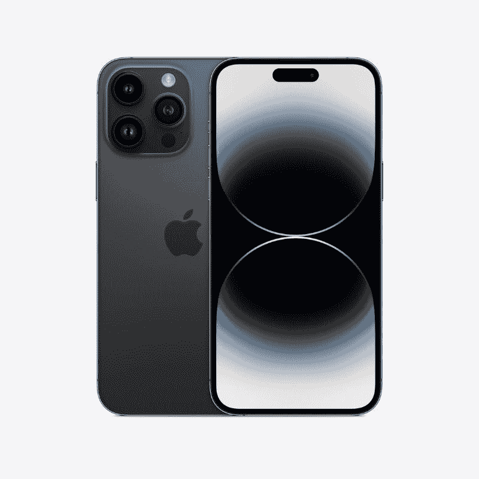
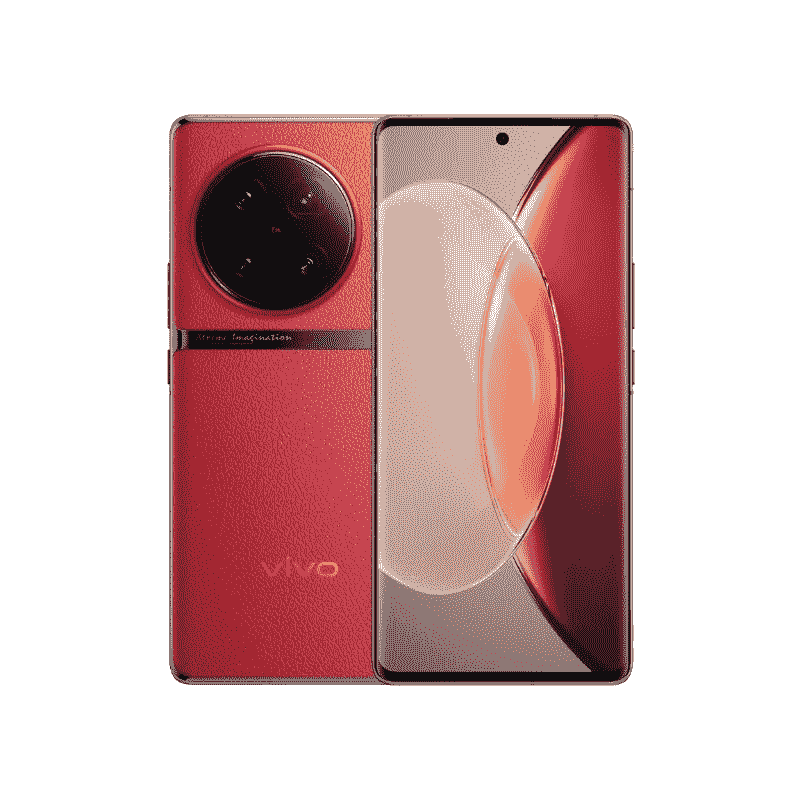

# 2023 年最佳手机

> 原文：<https://www.xda-developers.com/best-android-phones-india/>

今年 2023 年对于智能手机来说是一个令人兴奋的开始，三星发布了其 [Galaxy S23 系列](https://www.xda-developers.com/samsung-galaxy-s23/)，顶级机型带来了令人惊叹的 200MP 摄像头，一加以实惠的价格回归其根源，Oppo 和 Honor 在欧洲和整个亚洲推出了可折叠手机。帮助小米和 Vivo 赢得赞誉的 1 英寸索尼 IMX989 传感器也将在 2023 年成为更多旗舰。所有关于智能手机无聊的说法似乎都言过其实了。

我们在 XDA 测试几乎地球上的每一部智能手机，所以这里有我们关于最好的智能手机的专家指南，包括[最好的安卓](https://www.xda-developers.com/best-android-phones/)和[最好的 iPhone](https://www.xda-developers.com/best-iphone/) ，这取决于你的预算或需求。

## 最佳智能手机:iPhone 14 Pro

在这个时候选择 iPhone 14 Pro 是一个非常艰难的决定，因为有很多值得挑战的人。老实说，具体对我来说，我宁愿使用更大的 [iPhone 14 Pro Max](https://www.xda-developers.com/apple-iphone-14-pro-max-review/) 或 Vivo X90 Pro Plus 而不是 iPhone 14 Pro，因为它们分别提供更好的电池寿命和相机性能，但这个列表是为公众，即所谓的普通消费者编写的，对大多数人来说，iPhone 14 Pro 是性能，价值和可用性的最佳组合。

这里有很多值得喜欢的地方，首先是去掉了凹口，取而代之的是一个药丸形状的切口。苹果设计了一种新的用户界面——前面提到的动态岛——给人一种错觉，即切口可以根据你对手机的操作改变形状和大小。例如，播放音乐，你会看到专辑封面和一个音乐波酒吧旁边的剪切。在苹果地图上导航，你会看到岛上有一个箭头指引你去你应该去的地方。不是每个人都会喜欢这个新的用户界面，但我们中的许多人认为它很聪明，并有可能改善我们访问手机上无数信息的方式。

接下来，苹果这次还提高了相机性能，为 iPhone 14 Pro 和 Pro Max 提供了一个新的 48MP 相机，用于拍摄像素分格的 12MP 照片。主摄像头和超宽摄像头的图像传感器的尺寸也有所增加，因此 iPhone 14 Pro 和 Pro Max 不必经常求助于夜间模式。视频稳定也通过“动作模式”得到了巨大的改善，这是一种创造奇迹的 EIS 形式。虽然新 iPhone 在静态摄影部门的排名还存在争议，但它绝对是视频录制冠军。

还有新的苹果 A16 仿生，这是迄今为止手机中最强大的硅，它非常节能。我已经说过 iPhone 14 Pro Max 的电池续航时间很长，但 iPhone 14 Pro 也不差，能够完成一整天 12 到 13 个小时的繁重使用，还有些剩余电量。尽管 iPhone 14 Pro 有一个新的永远在线显示屏，实际上永远在线。

所有这些因素加在一起，使 iPhone 14 Pro 成为你能买到的最精致、整体最好的手机之一。当然，如果你是 Android 粉丝，我们建议你看看下面的其他选项。但如果你是一名普通消费者，正在寻找一款性能良好、耐用多年、保持转售价值、拥有强大软硬件生态系统的手机，那么 iPhone 14 Pro 就是不二之选。

最佳综合成绩

iPhone 14 Pro 为迄今为止最高端的 iPhone 带来了新的正面设计、升级的摄像头和新的全能苹果硅。

## 最实惠的旗舰:一加 11

这一类别是为那些密切关注智能手机市场并希望拥有一部规格、功能和价值最佳组合的手机的人设计的。是的，有些人会反对我们将 699 美元的手机称为“负担得起的”，但 OnePluss 11 是为那些想要一部高端旗舰手机而又不疯狂花钱的人准备的。此外，一加 11 提供了 120 赫兹的显示屏，三镜头相机系统和高通骁龙 8 第二代。这可能不是一般的负担得起，但对于你所得到的来说是负担得起的。

[一加 11](https://www.xda-developers.com/oneplus-11-review/) 带回了一加 10 Pro 的顶级设计，其摄像头模块由不锈钢制成，与铝栏杆无缝融合。它的 120 赫兹 LTPO 3.0 有机发光二极管屏幕华丽而节能，软件一如既往地快速运行，三摄像头系统出奇地好，色彩准确，快门快速。尤其是 5000 万像素的主摄像头，在面对顶级相机时表现非常出色，在曝光处理方面甚至比最新的 iPhone 还要好。2 倍变焦镜头不太够得上其他手机的长度，但它有一个相对较大的 1/1.56 英寸变焦镜头传感器，这导致人像的强烈散景和更好的进光能力。

配备一加内部冷却系统的骁龙 8 Gen 2 在这里大放异彩，即使在运行密集型任务时也能保持手机凉爽。事实上，我们将这个位置给一加 11 而不是谷歌 Pixel 7 的一个重要原因是，骁龙 8 Gen 2 比张量 G2 更有能力，加上一加 11 有更好的显示屏。

最佳实惠旗舰

一加 11 是该公司的回归，以低于三星的价格提供近乎旗舰的体验。

## 最实惠的准旗舰智能手机:谷歌 Pixel 7

谷歌 Pixel 7 Pro 是更好的手机，但对大多数人来说, [Pixel 7](https://www.xda-developers.com/google-pixel-7-review/) 是更好的选择。两款手机共享大部分相同的硬件，Pro 只是获得了更高的刷新率和变焦镜头。对于大多数人来说，这两个特点不足以证明 250 美元的价格差异。售价 599 美元的 Pixel 7 可以说是目前最超值的手机，但凭借 90Hz 的显示屏和“仅仅”双摄像头系统，它不应该被称为旗舰——尽管它已经足够接近了。

Pixel 7 延续了 Pixel 6 的演变，由谷歌定制设计的第二代 Tensor G2 芯片将手机的机器学习能力提升到了另一个水平。该显示器虽然“仅仅”90Hz，但仍然很好看，具有 FHD+分辨率和准确的色彩输出。它也比 6.3 英寸的 Pixel 6 略小，是一款舒适的单手手机。这里的双摄像头系统采用了与 Pro 相同的硬件:50MP 主传感器和 12MP 超宽传感器。他们都很棒。

4，335 mAh 电池比较小。它实际上比 Pixel 6 的电池小，但由于 Tensor G2 的效率，电池寿命仍然很好。Pixel 7 上的软件也是它最大的亮点之一。这款手机自带 Android 13，鉴于它是一个像素，你可以真正享受 Android 13 的方式。谷歌在这一代引入了很多人工智能功能，包括实时翻译、魔法橡皮擦、面部去模糊等等。谷歌还承诺为 Pixel 7 提供 3 年的 Android 版本升级和 5 年的安全补丁。这使得手机面向未来，您可以长时间使用它。

如果你正在寻找一部特别是在相机方面表现出色的手机，并且拥有干净和最新的软件，那么 Pixel 7 绝对不会错。

 <picture></picture> 

Google Pixel 7

最实惠的差点旗舰

Pixel 7 以低廉的价格为旗舰手机配备了第二代 Tensor SoC、更亮的显示屏和改进的摄像头。

## 最佳预算智能手机:一加诺德 N20

[一加诺德 N20](http://www.xda-developers.com/oneplus-nord-n20-5g-hands-on/) 最初售价 299 美元，但后来降到了 229 美元，在这个价格上，很难在美国找到一款功能更强的手机。以 iPhone 13 Pro Max 或 Galaxy S22 Ultra 四分之一的价格，你可以获得 5G 手机、坚固的主摄像头和漂亮的设计。

虽然 6.4 英寸的屏幕只有 60Hz，但它是 OLED 面板，所以你会得到有力、生动的颜色。这个 60Hz 的面板也有助于 4，500 mAh 的电池持续一整天，如果你确实需要充值，包装中有一个 33W 的快速充电块。还有一个耳机插孔，也支持 5G。

主 6400 万像素的摄像头在良好的照明条件下很好，但不要被大的第二个摄像头镜头(和较小的第三个镜头)所迷惑:这些只是 200 万像素的传感器，没有什么作用。不过在美国这个价位，一个好的后置摄像头还是可以接受的。

否则，通常的一加 zippy 软件可以在这里找到，虽然 OxygenOS 失去了一些特性，但与其他 Android 品牌相比，它仍然是一个干净和简约的软件。

 <picture></picture> 

OnePlus Nord N20

##### 一加北部 N20

最佳预算

一加诺德 N20 是一款面向美国市场的平价 Android，设计简洁，性能稳定。

甚至“预算”的定义也因人而异，单一的选择可能无法正确理解所有人的细微差别。如果你正在寻找更多的选择，这里有一些其他的[非常便宜的安卓手机](https://www.xda-developers.com/best-cheap-android-phones/)供你考虑。

## 最佳大型可折叠智能手机:三星 Galaxy Z Fold 4

Galaxy Z Fold 3 纠正了很多最初对可折叠手机的担忧。三星设法增加了防水性，同时减轻了重量，降低了价格。2022 年的 [Galaxy Z Fold 4](https://www.xda-developers.com/samsung-galaxy-z-fold-4-review/) 主要是迭代变化，虽然每个变化都相对较小，但它们一起进一步完善了一个已经非常精致的可折叠手机。

这一次，三星将铰链突起缩小了一点，以便 Fold 4 在折叠形式下握持起来更舒适一点。更重要的是，三星把那些节省下来的宝贵的几毫米都给了屏幕，所以 Fold 4 的屏幕比 Fold 3 略宽。三星还进一步将重量减轻到 263 克，成为小米 Mix Fold 2 之后第二轻的可折叠大屏幕。

相机也得到了一些急需的改进。三星将 Fold 4 的主传感器升级为 50MP，1/1.55 英寸的传感器，大大增加了进光量。与 Fold 3 相比，Fold 4 在主相机和变焦相机摄影方面带来了相当明显的改进。特别是这里的 3 倍变焦镜头，比上一代的 2 倍镜头有了巨大的飞跃。

三星还改进了软件，让 Fold 4 更容易进入多任务模式。以前，需要三次点击才能进入分屏模式，现在在某些情况下只需一次点击即可。Fold 4 和以前的 Fold 一样，由于屏幕更大，所以可以提供更好的多任务处理能力。无论是在谷歌文档中记笔记时在 Gmail 中阅读新闻稿，还是与 WhatsApp 并排运行 Twitter，Fold 4 更大的屏幕和改进的软件都让体验感觉更加无缝。无论你如何称呼它，它本质上是一个口袋电脑，你可以随身携带，完成一些重要的工作，或者享受其他手机无法提供的媒体消费。

所有这些都由骁龙 8 Plus Gen 1 SoC 处理，这意味着无论你运行多少应用程序，你在手机上做的一切都是快速而敏捷的。去年引入的 S Pen 支持也回来了，因此艺术家或笔记者可以充分利用更大的画布。

内部显示器是一个 120 赫兹的 OLED 面板，带有一个下显示前置摄像头(UDC)，使屏幕具有身临其境的感觉。如果你经常在手机上玩游戏，甚至阅读大量电子书，那么你不会找到比这更好的手机了，这要感谢那巨大的显示屏。三星还将外壳显示器升级为 120Hz 面板，使事情更加统一。该手机现在还具有 IPX8 防水功能，使其成为最耐用的可折叠手机之一。

Z Fold 4 拥有骁龙 8 Plus Gen 1、出色扬声器和 7.6 英寸的大屏幕，非常适合玩游戏或看电影。虽然相机不是周围最好的，但对大多数人来说，它们仍然很好，足够了。

 <picture></picture> 

Samsung Galaxy Z Fold 4

最佳大型可折叠

三星 Galaxy Z Fold 4 是三星最完美的大型可折叠手机，并将其变得更好，采用了更少干扰的铰链，新的处理器和更好的摄像头。

## 最佳小型可折叠智能手机:三星 Galaxy Z Flip 4

Galaxy Z Flip 3 是近年来最时尚的智能手机之一，而 [Galaxy Z Flip 4](https://www.xda-developers.com/samsung-galaxy-z-flip-4-review/) 明智地带回了完全相同的外观，但有更多的颜色定制选项。我们喜欢双色饰面和折叠时的小巧尺寸。但是不要把小尺寸误认为动力不足。与 Fold 4 一样，Z Flip 4 是有史以来最耐用的可折叠手机，具有 IPX8 防水性能和“装甲铝”构建材料。

对于那些觉得现代 Android 手机太大、难以装入口袋的人来说，Flip 4 是一款非常棒的设备。展开后，6.7 英寸、1080 x 2640 显示屏的外观和行为与任何其他顶级三星屏幕一样，具有鲜艳的颜色、顶级的清晰度和高达 120Hz 的快速刷新率，可实现流畅的动画。

Flip 4 的新功能是高通骁龙 8 Plus Gen 1 处理器，它具有更强的 GPU 和更高的电池效率。后者很重要，因为电池寿命在以前的翻转中一直是一个轻微的弱点。虽然 Flip 4 不会赢得任何电池续航奖，但如果你不太用力，它现在可以全天使用。

三星还改进了外部“覆盖显示器”的软件，允许用户在较小的 1.9 英寸显示器上打开任何应用程序。当然，一些应用程序在狭窄的空间里看起来很傻，但其他应用程序会从中受益。例如，你可以直接从外部屏幕滚动 Spotify 播放列表。

虽然这里的一对 1200 万像素摄像头在硬件方面并不出色，但三星的计算摄影非常智能，因此它将有助于用人工智能的欺骗来补偿旧的硬件，以产生通常充满活力和细节丰富的照片。当然，有了 Flex 模式，Flip 4 也可以用很多有创意的方式拍摄。总的来说，Flip 4 是对一款优秀的小型可折叠手机的反复改进。

 <picture></picture> 

Samsung Galaxy Z Flip 4

最佳小型可折叠

Galaxy Z Flip 4 是那些想要更便携和时尚的手机的理想手机。这是一部翻盖式手机，折叠起来时有一个小显示屏。

## 最佳智能手机相机:谷歌 Pixel 7 Pro

凭借一个功能强大的 5000 万像素主摄像头和一个相对较大的图像传感器，一个 5 倍潜望镜变焦镜头，可以使用传感器内裁剪来产生近 10 倍的光学变焦，以及一个扫描超宽相机，[谷歌像素 7 Pro](https://www.xda-developers.com/google-pixel-7-pro-camera-review/) 拥有一个非常强大的相机系统。但是，可以说它是最好的，是它背后的大脑:谷歌张量 G2。谷歌的第二代硅利用谷歌无所不能的机器学习能力来检查镜头捕捉的图像数据，然后生成具有令人敬畏的动态范围、细节和清晰度的图像。

谷歌的机器学习还实现了几个智能摄影技巧，如 Action Pan 和 Night Sight，前者在可能几乎不动的对象周围创建运动模糊效果，后者在黑暗的场景中奇迹般地引入光线。

视频功能此前一直是像素方面的弱点，但 Pixel 7 Pro 也在这方面有所改善，画面稳定，色彩和平衡出色。您甚至可以应用人工模糊，使素材看起来更像电影。

在其他地方，Pixel 7 Pro 也是一款非常好的手机，具有独特的设计，120Hz 的有机发光二极管屏幕，以及快速灵活的性能。显然，安卓的软件情况也是最好的，因为这是谷歌的*安卓手机*。作为一个整体进入平台的所有东西将首先到达像素。

 <picture></picture> 

Google Pixel 7 Pro

##### 谷歌 Pixel 7 Pro

最佳相机

谷歌 Pixel 7 Pro 对大多数人来说是最好的傻瓜相机，因为它几乎总能拍出好照片。这也是一款出色的全能手机，配有 6.7 英寸有机发光二极管显示屏。

## 最通用的智能手机相机:Galaxy S23 Ultra

三星的绝对顶级手机 Galaxy Ultra 系列连续三年保持着“最多功能”的地位，这要归功于它是唯一一款配备 10 倍光学变焦的宽发布手机(华为也有两款配备 10 倍变焦镜头的手机，但它们大多在中国销售)，以及通常的超宽、宽、长焦焦距。今年的 [S23 Ultra](https://www.xda-developers.com/hands-on-samsung-galaxy-s23-ultra/) 将主摄像头升级到 200MP 传感器，这不仅允许手机使用 16 合 1 像素宁滨进行更多的计算欺骗，还允许手机使用传感器内作物来实现另一个近光学变焦长度。今年剩余时间在北美推出的任何手机都不太可能接近挑战这种多功能水平。

该软件包的其余部分非常出色，但并不令人兴奋，因为它要么有相同的组件，要么有预期的一代颠簸。S23 Ultra 运行在最新的高通骁龙 8 Gen 2 上，Galaxy 有点超频，特别是对这款手机来说，6.8 英寸的显示屏比去年的更亮。除此之外，几乎所有其他东西——从 S Pen 到 ultrawide 和两个变焦镜头到显示指纹扫描仪——都是与去年的 S22 Ultra 相同的组件。

这未必是一件坏事，因为 Galaxy S22 Ultra 在过去的一年中仍然是最受欢迎的手机，而 Galaxy S23 Ultra 将轻松保持这一头衔。

最全能的相机

Galaxy S23 Ultra 是市场上最好的手机之一，装有全新的 200MP 传感器，精致的设计，为 Galaxy 芯片组定制的骁龙 8 Gen 2，以及一个 UI 5.1。

## 最佳大智能手机:iPhone 14 Pro Max

如果你想要一部大得不像话的手机，那么 [iPhone 14 Pro Max](https://www.xda-developers.com/apple-iphone-14-pro-max-review/) 是你应该看看的手机，它采用了 6.7 英寸的方形设计。iPhone 13 Pro Max 已经是一款非常大的手机，新的 14 Pro Max one 通过增加一点厚度(从 7.7 毫米到 7.9 毫米)超越了它。作为回报，你可以获得比以前型号更长的电池寿命，这使得 iPhone 14 Pro 轻松成为目前任何智能手机的电池续航冠军。

iPhone 14 Pro Max 放弃了这一地位，转而支持动态岛，这一直有点分裂，但我们在 XDA 这里将它视为一种与我们每天从智能手机上获得的所有信息进行互动的新的创造性方式。

由于新的 4800 万像素主摄像头可以拍摄 1200 万像素的照片，相机性能有所提高，超宽相机的图像传感器也略大。这意味着 iPhone 14 Pro Max 可以在黑暗的场景中吸收大量的光线。事实上，有时照片可能太亮了，但你可以在设置中调低亮度。iPhone 14 Pro Max 带回了令人敬畏的视频功能，甚至更好的稳定性，这要归功于苹果公司称为“动作模式”的新 EIS 模式。

然后是 A16 Bionic，它仍然是当今移动行业最好的 SoC。对于在手机上执行游戏、编辑和渲染视频等密集型任务，iPhone 14 Pro Max 将是一个完美的选择。除了原始性能，苹果的硬件和软件集成在移动领域是无与伦比的，这意味着你将获得移动行业最好的硬件和软件协同。

 <picture></picture> 

Apple iPhone 14 Pro

最佳大手机

iPhone 14 Pro Max 是库比蒂诺推出的最大、最好的手机。它也是一个绝对的发电站。

## 最佳小型手机:iPhone 13 mini

去年秋天苹果发布时没有 iPhone 14 Mini，所以如果你喜欢小手机， [iPhone 13 mini](https://www.xda-developers.com/apple-iphone-13-mini-review/) 就是你要的手机。这东西不只是小；*它很小*。这是一部大多数人都能轻松单手使用的手机。尽管它的尺寸很小，但由于苹果 A15 仿生芯片和优化的 iOS，它仍然是最强大的手机之一。苹果甚至在这一代的更新中改进了 iPhone 12 mini 低于标准的电池寿命。

iPhone 13 mini 是小型手机发烧友的梦想成真。苹果终于推出了一款旗舰手机，它拥有强大的顶级内部部件，可以轻松放入你的牛仔口袋中。小型手机已经成为过去，直到苹果公司通过 iPhone 12 mini 重新推出这一类别。然而，小尺寸带来了一个大缺点:平均电池寿命。

像 iPhone 12 mini 这样的小型手机，电池的大小是有限制的，这意味着手机的电池寿命低于标准。iPhone 13 mini 解决了这个问题，并最终为 2022 年像任何其他手机一样使用小型手机提供了一个强有力的案例。电池寿命是 iPhone 13 mini 带来的最大升级，据我们称，仅此一项就是一大胜利。我们现在有了一部紧凑型手机，不需要在下午充电。

虽然电池的容量增加了，但电池寿命增加的主要原因是苹果公司的 A15 仿生芯片。它比去年的 A14 Bionic 更节能，同时也是最强大的芯片组之一。iPhone 13 mini 也是一个性能怪兽，可以轻松玩最图形密集型的游戏。您还可以直接从手机上拍摄和编辑 4K 60fps 视频，并可以选择在新的电影模式下录制视频。显示屏虽然仍停留在 60Hz，但比 iPhone 12 mini 的凹口更小，亮度略高。

由于该系列很可能一去不复返，iPhone 13 mini 也可以被视为收藏家的物品。这可能是苹果生产的最后一款小型手机。

 <picture></picture> 

Apple iPhone 13 Mini

##### 苹果 iPhone 13 Mini

最佳小型手机

如果你想要一部可以单手轻松使用的小手机，iPhone 13 mini 就是你想要的手机。

## 最佳小型安卓手机:华硕 Zenfone 9

华硕 Zenfone 9 是一款小巧但功能强大的手机，如果你想要一款运行 Android 的小手机，这是一个明确的选择。Zenfone 9 采用 5.9 英寸有机发光二极管屏幕，尺寸为 146.5 x 68.1 x 9.1 毫米，重量仅为 165 克，是一款非常容易使用和单手握持的手机。我们 XDA 的许多人实际上认为 Zenfone 9 的 5.9 英寸屏幕是完美的“小”尺寸，因为 iPhone 13 mini 的 5.4 英寸面板对于大多数现代内容来说有点太窄了。

华硕不只是把手机做小了，叫一天。华硕还赋予了它一些独特的功能，例如支持主 50MP 摄像头的万向节稳定系统。这使得手机拍摄更流畅的平移视频。然后是手机的右侧，它有一个侧装指纹扫描仪/电源按钮，音量摇杆和一个触摸感应面板，允许用户快速启动应用程序或操作。

引擎盖下是高通骁龙 8 Plus Gen 1，其能效允许 4,300 mAh 的电池为除了最重用户之外的所有用户全天供电。所有其他智能手机也很棒。前面提到的显示器是一个 120 赫兹的面板，超宽相机产生有力的全景照片。见鬼，甚至还有一个耳机插孔。

华硕的软件对初学者来说很容易使用，但对高级用户来说也非常有益，因为它充满了快捷的手势，如点击、滑动或与触摸感应侧面板互动。我们也很喜欢这款手机的整体外观，它有一个聚碳酸酯背板，提供了砂岩般的抓地力纹理，以及大型对称的相机环。

 <picture></picture> 

Asus Zenfone 9

##### 华硕 Zenfone 9

最佳小型安卓手机

华硕 Zenfone 9 无疑是目前最好的小型安卓手机。但即使你不考虑尺寸，它仍然是一款非常强大的智能手机。

## 最佳游戏智能手机:华硕 ROG 手机 6 Pro

如果你经常玩手机游戏，并且想要一款能跟上游戏进度的设备，那么看看[华硕 ROG 手机 6 Pro](https://www.xda-developers.com/asus-rog-phone-6-pro-review/) 就够了。在速度极快、极其流畅的 165Hz 有机发光二极管显示屏、高通骁龙 8 Plus Gen 1 SoC、6,000 mAh 大电池、双前置立体声扬声器和高达 18GB 的 RAM 之间，没有一款智能手机能够更好地处理移动游戏。

当然，因为这是一款游戏手机，ROG 手机 6 Pro 也有“AirTriggers”，这是手机右侧的功能性电容触摸板，当手机侧放或玩游戏时，它可以作为肩膀触发器。还有一个背面显示屏，名为“ROG 视觉”，虽然它没有做太多，但它确实允许你通过赋予它更多的天赋来炫耀手机。

从我们的测试来看，ROG Phone 6 是一款性能卓越的手机，能够以 60 帧/秒的速度运行游戏，几乎没有掉线。所有的基准测试也都名列前茅。在相机前面，你有一个主系统，包括 50MP IMX766 主传感器，13MP 超宽(f/2.4)和 2MP 微距设置，以及 12MP 自拍相机。这款手机拍摄的照片清晰、有力，总体来说不错，但视频录制并不是最棒的，因为镜头的稳定性很差，并且要处理突然的光线变化。

作为一款游戏手机，相机自然不是展会的明星，但这里的光学系统可以被认为是坚固的。华硕包装了索尼 IMX766 50MP 传感器作为主要拍摄者，13MP 超宽和 5MP 微距相机。这里没有专用的长焦选项，但华硕使用 50MP 传感器在明亮的光线下以 2 倍无损拍摄。天黑了就转数码变焦。这些相机不会赢得任何奖项，但对大多数人来说已经足够好了。

 <picture></picture> 

ASUS ROG Phone 6 Pro

##### 华硕 ROG 手机 6

最佳游戏手机

华硕 ROG 手机 6 是一款绝对的手机，拥有 165 赫兹的屏幕，6000 毫安时的电池，18GB 的内存，以及最新最强大的安卓芯片。你还需要什么来玩游戏？

## 最佳国际智能手机:Vivo X90 Pro Plus

有很多手机可以进入这个名单，但 [Vivo X90 Pro+](https://www.xda-developers.com/vivo-x90-pro-plus-review/) 获得了冠军，因为它拥有绝对最新的移动组件，这是这个名单上的其他手机所没有的。Vivo X90 Pro+由高通骁龙 8 Gen 2 驱动，使用 UFS 4.0 存储，并配有 6.8 英寸三星 E6 有机发光二极管显示屏，分辨率为 2K，采用 LTPO 4.0 技术。然后是相机，由索尼 IMX989 1 英寸传感器和一对非常强大的变焦镜头组成。超宽和自拍相机也很出色。

处理图像处理的是 Vivo 的 V2 成像芯片，如果你读过我们对[之前 Vivo 旗舰](https://www.xda-developers.com/vivo-x80-pro-review/)的评论，你就会知道 Vivo 的 V 芯片具有非常好的 HDR 功能。事实上，如果这款手机在全球销售(应该在 2023 年初)，我们会将它命名为最佳拍照手机。但截至目前，这款手机仍仅限于中国市场。

 <picture></picture> 

Vivo X90 Pro Plus

##### Vivo X90 Pro Plus

最佳国际

Vivo X90 Pro Plus 拥有目前名单上所有手机中最前沿的移动组件。但到目前为止，这款手机只在中国销售，明年 1 月可能会在全球推出。

* * *

现在有很多好手机可供选择，我们希望这个指南能有所帮助。我们认为 iPhone 14 Pro 是大多数人的最佳全能选择，但 Galaxy S23 Ultra、一加 11 和谷歌 Pixel 7 也是非常好的替代品。我们将定期更新该列表，因此请务必经常查看，或者下次您在市场上购买新手机时查看。