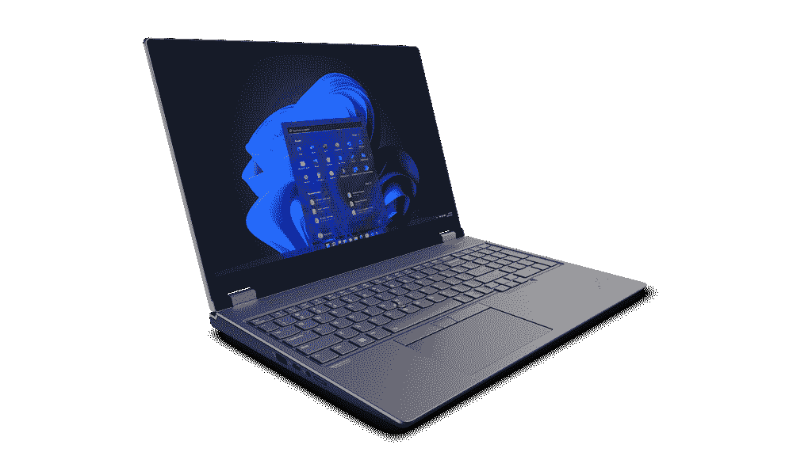
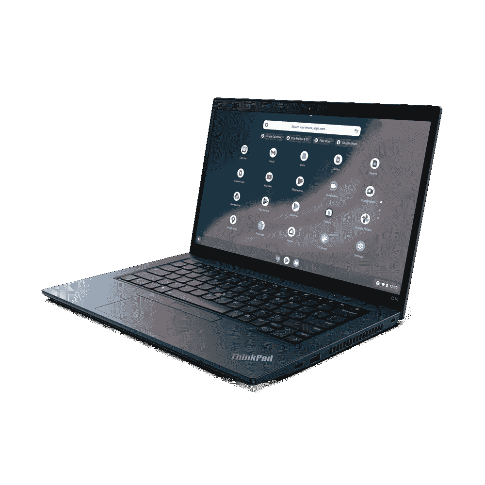

# 2023 年最佳联想 ThinkPads

> 原文：<https://www.xda-developers.com/best-thinkpads/>

联想的 ThinkPad 品牌长期以来一直是商务设备的代名词。ThinkPad 系列最初是由 IBM 生产和销售的，IBM 在其日本的大和实验室设计了这款笔记本电脑，但联想在 2005 年收购了 IBM 的个人电脑业务。从那时起，笔记本电脑就有了联想品牌，但它们仍然面向同样的受众。所有的 ThinkPad 笔记本电脑都是为商业用户设计的，但它们仍然能够脱颖而出。如果您正在为自己寻找最好的 ThinkPads，我们可以为您提供帮助。

正如我们所提到的，ThinkPad 系列有许多不同的风格，从更经济的选择到高性能的产品。它们都保留了 ThinkPad 品牌经典感觉，但它们仍然设法彼此相当不同。虽然它们与你可能记得的相差不远，但它们也有许多现代特征。这些是你能买到的最好的笔记本电脑，尤其是对商业用户来说。这些是你今天能买到的最好的。

## 整体最佳:ThinkPad X1 Carbon Gen 10

[ThinkPad X1 Carbon](https://www.xda-developers.com/lenovo-thinkpad-x1-carbon-gen-10-review/) 是 ThinkPad 家族中最古老的成员，但它每年都有很好的改进。这款经典翻盖手机保留了您喜爱的 ThinkPad 系列的元素，但它不断添加更多现代功能。

首先，它配备了第 12 代英特尔酷睿处理器，最高可配英特尔酷睿 i7-1280P，该处理器来自英特尔新的 P 系列产品，具有 28W TDP。这是一款 14 核 20 线程处理器，速度可达 4.8GHz，此外它还配有 Iris Xe 显卡，这意味着它也可以处理一些较轻的 GPU 工作负载。您还可以为它配置高达 32GB 的 LPDDR5 内存和 2TB 的固态硬盘，这样的内存量几乎可以确保您永远不会受到内存的限制。通过这种方式，您可以处理非常大的数据库、编码项目或具有大量图层的图像编辑，因此您没有什么可担心的。此外，你还有足够的储物空间。

ThinkPad X1 Carbon 的 14 英寸显示屏也很棒，不过这取决于你选择的型号。首先，值得注意的是这是一个 16:10 显示屏，虽然没有 3:2 面板那么高，但已经比许多其他笔记本电脑的 16:9 显示屏有所改进。更高的屏幕意味着更大的表面积，这意味着更多的空间用于 UI 元素和文本，从而更好地阅读和提高工作效率。这里的基本配置相当简单，全高清+面板(1920 x 1200)，仅此而已。然而，你可以添加一个触摸屏或隐私保护装置(使你周围的人看不见屏幕)，选择稍微锐利的 2.2K (2240 x 1400)面板，或者直接选择更高级的选项。今年的新品是 2.8K (2880 x 1800) OLED 面板，得益于有机发光二极管的优势，它既清晰又充满活力。但是，如果你想要最高的分辨率，你仍然可以选择超高清+ (3840 x 2400) IPS 面板，并可选触摸支持，这是另一个重要的选择。

今年 X1 Carbon 型号的一大升级是网络摄像头，现在几乎在所有配置中都默认为 1080p 传感器。你可以选择添加 Windows Hello 面部识别功能(一些显示器配置默认包含该功能)，甚至还有一个带计算机视觉的新 MIPI 摄像头选项，这意味着笔记本电脑可以判断你何时靠近或远离它，从而根据需要唤醒或锁定自己。

就设计而言，这就是你所了解和喜爱的 ThinkPad X1 Carbon。黑色的表面，红色的口音，以及图标功能，如跟踪点和触摸板上的重复鼠标按钮都在这里，并占了上风。这是一款彻头彻尾的 ThinkPad，但仍然很现代，这意味着它的重量仅为 2.48 磅，厚度仅为 15.36 毫米，因此它超级便携，易于随身携带。如果 ThinkPads 是用来完成工作的，那么它可以让你在任何地方完成工作。

这也是因为你可以买到带有可选蜂窝连接的 ThinkPad X1 Carbon，尽管这适用于列表中的大多数笔记本电脑。你可以用 LTE Cat16 或 5G 来配置它，这取决于你在多大程度上想要让自己适应未来。您还可以通过两个 Thunderbolt 4 端口、两个 USB Type-A 端口、HDMI 和一个耳机插孔获得大量的物理连接。这里涵盖了您可能拥有的所有基本需求，就像您对商用笔记本电脑的需求一样。

ThinkPad X1 Carbon 出现了这么久也就不足为奇了。这是一款功能强大的笔记本电脑，在保持其 ThinkPad 特性的同时不断发展。对于大多数用户来说，这是最好的 ThinkPad，每年都是一个简单的推荐。关于这一点，联想已经宣布了 ThinkPad X1 Carbon Gen 11(T1)，但几个月后才会推出。它的升级有些小，所以如果你现在买这个型号的话还是没问题的。

##### 联想 ThinkPad X1 碳第 10 代

联想 ThinkPad X1 Carbon 是一款集现代功能于一身的经典商务笔记本电脑。它具有高端性能、高度可配置的规格和出色的连接选项。

## 最佳 AMD 笔记本电脑:ThinkPad Z13

直到最近，联想从未真正尝试过制造高端 AMD ThinkPad，但 ThinkPad Z13(T1)将改变这一点，而且它做得非常好。它不仅仅是一台出色的 AMD 笔记本电脑，它还是 ThinkPad 设计语言的演变，它看起来美丽而独特。

在性能方面，联想 ThinkPad Z13 由 AMD 锐龙 Pro 6000 系列处理器提供支持，它甚至拥有顶级配置的专属处理器——AMD 锐龙 7 Pro 6860Z。这是 AMD 锐龙 7 Pro 6850U 的略微增强版本，它配备了 8 个核心，16 个线程，速度提升至 4.73GHz，使其成为目前最快的笔记本电脑处理器之一。除了快速的 CPU，这款处理器还包括新的 AMD 镭龙图形 680M GPU，这可能是目前任何笔记本电脑上最快的集成 GPU。高达 32GB 的内存和 1TB 的固态硬盘完善了性能，使其成为真正的顶级体验。

除了性能，联想 ThinkPad Z13 还提供了出色的显示体验。它有一个 13.3 英寸的面板，长宽比为 16:10，这是联想今年做的很多事情。基本型号是全高清+ (1920 x 1200)面板，如果你愿意，你可以在其上添加触摸支持。然而，它也有漂亮的 2.8K (2880 x 1800)有机发光二极管选项，给你一个更清晰的图像，以及更鲜艳的颜色，真正的黑色和更高的对比度。你没有 X1 Carbon 那么多选择，但这些仍然是很好的展示。

网络摄像头也很棒。ThinkPad Z13 在显示屏上方配备了大型摄像头模块，其中包含一个 1080p 网络摄像头，具有 Windows Hello 面部识别功能。这是默认配置，已经很棒了，但如果你想要更好的图像质量，你可以升级到带有独立 RGB 和 IR 传感器的型号。这意味着你有一个摄像头用于视频通话，一个用于 Windows Hello，这使得网络摄像头的图像更好看。

然而，设计是 ThinkPad Z13 最有趣的方面之一，因为它看起来与普通的 ThinkPad 非常不同。它有几种颜色，一种灰色，一种黑色，边缘带有青铜色。后者还包括一个素食皮革盖子，让它更有高级感。这两种型号看起来和感觉都很棒，但并不乏味，我认为大多数 ThinkPads 都是如此。不过，像 TrackPoint 这样的功能仍然存在，但现在你可以在使用 TrackPoint 的同时点击触摸板本身，而不是在触摸板上有重复的鼠标按钮，这使得触摸板的整体尺寸更大，设计更加现代。笔记本电脑本身只有 13.99 毫米厚，重量为 2.78 磅，因此它仍然超级便携，易于携带到任何地方。

ThinkPad Z13 还有最后一个亮点，那就是支持 USB4。这一最新版本的 USB 协议为您提供了类似于 Thunderbolt 4 的功能，ThinkPad Z13 是首批支持该协议的 AMD 笔记本电脑之一。这意味着凭借 40Gbps 的带宽，这些端口支持高速外设、坞站和显示器。除了两个 USB4 端口，ThinkPad Z13 只有一个耳机插孔，这意味着端口选择没有太多变化。尽管如此，这些端口给你很大的可扩展性。当然，蜂窝连接也是一种选择，尽管只有 4G LTE 可用。

坦率地说，联想 ThinkPad Z13 不仅是最好的 ThinkPad 之一，也是当今最好的 AMD 笔记本电脑之一，而且可能是最好的笔记本电脑之一。它真正推动了 AMD 笔记本电脑的发展，它做得太好了，不推荐是不可能的。

 <picture></picture> 

Lenovo ThinkPad Z13

##### 联想 ThinkPad Z13

联想 ThinkPad Z13 是联想最具现代感的 ThinkPad，它采用高端 AMD 锐龙处理器。

## 最佳 Arm 笔记本电脑:ThinkPad X13s

联想今年正在努力实现“第一”，它不仅制造了第一款高端 AMD ThinkPad，而且我们还获得了第一款基于 Arm 的 ThinkPad。再一次，这不仅仅是推动 ThinkPad 阵容本身，它是计算行业的前沿。

这里，我们主要指的是笔记本电脑内部的处理器。联想 ThinkPad X13s 是市场上第一款使用全新高通骁龙 8cx Gen 3 处理器的笔记本电脑，这是对前两代产品(几乎完全相同)的重大升级。这是一个高达 3GHz 的八核处理器，与前代产品相比，它的 CPU 性能提高了 85%，GPU 性能提高了 60%，这是一个重大改进。这款处理器可以在更高效的封装中提供高端笔记本电脑体验，您可以将其与高达 32GB 的 RAM 和 1TB 的固态硬盘搭配使用，以实现顶级体验。

ThinkPad X13s 的显示屏也很棒，尽管它不像大多数其他 ThinkPad 那样提供那么多选项。这是一个 13.3 英寸的面板，纵横比为 16:10，分辨率为全高清+ (1920 x 1200)。不幸的是，这是你得到的唯一选择，但如果你喜欢的话，你可以选择添加触摸支持。对于这种尺寸来说，这仍然是一个相当不错的屏幕，我们真的没有什么大的抱怨。

联想 ThinkPad X13s 还拥有最好的网络摄像头之一，是一个支持 1080p 视频的 5MP 传感器。默认情况下不包含 Windows Hello 面部识别，但它是一个升级选项。你可以选择混合 RGB 和 IR 传感器，或者选择带有两个独立传感器的 MIPI 相机，它可以提供更好的图像质量。不管怎样，你会对这台相机有一个非常好的体验。

虽然这款笔记本电脑的内部组件非常现代，并具有开创性，但外部却是你对 ThinkPad 的所有期望。你得到了经典的黑色表面，红色的口音，甚至像触摸板上的跟踪点和复制鼠标按钮等功能。它并没有试图脱颖而出，如果你是 ThinkPad 的粉丝，你可能会喜欢这样。然而，这是一款极其便携的笔记本电脑，厚度仅为 13.4 毫米，起始重量为 2.35 磅。

至于端口，像这样薄的笔记本电脑只能做这么多。你有两个 USB Type-C 端口，一个耳机插孔和一个 SIM 卡插槽，就是这样。如果你购买集线器，USB-C 端口确实给你一些扩展空间，但这是像这样的超薄笔记本电脑的典型情况。还有可选的 5G 连接，你可以选择是否只需要低于 6GHz 的 5G 或毫米波支持。这是只有 Arm 笔记本电脑通常提供的功能，大多数英特尔或 AMD 设备只支持低于 6GHz 的 5G，所以这很有意思。

无论你是 ThinkPad 粉丝还是 Arm 上的 Windows 爱好者，联想 ThinkPad X13s 都是一款非常引人注目的设备。它绝对值得被认为是最好的 ThinkPads 之一。

 <picture></picture> 

Lenovo ThinkPad X13s

##### 联想 ThinkPad X13s

联想 ThinkPad X13s 是第一款基于 Arm 的 ThinkPad，它配备了强大的骁龙 8cx Gen 3 处理器。

## 最佳可变形笔记本电脑:联想 ThinkPad X1 Yoga Gen 7

翻盖式笔记本电脑很棒，对很多人来说，它们就是你所需要的。但如果你像我一样，那么拥有一台可变形笔记本电脑几乎是一项要求，而 [ThinkPad X1 Yoga](https://www.xda-developers.com/lenovo-thinkpad-x1-yoga-gen-7-review/) 可能是满足这一需求的最佳商务笔记本电脑。这是一款顶级规格的高端设备，在大多数方面与 X1 Carbon 相似，这只能是一件好事。

先说性能。联想 ThinkPad X1 Yoga 采用第 12 代英特尔酷睿处理器，特别是 28W P 系列。最高可配英特尔酷睿 i7-1280P 处理器，为您提供 14 个内核、20 个线程和高达 4.8GHz 的速度，在各种日常任务中都能获得出色的性能。像往常一样，集成的英特尔 Iris Xe 显卡为较轻的工作负载提供了一些 GPU 能力。其余规格包括高达 32GB 的内存和 1TB 的固态硬盘，这是您获得顶级体验所需的一切。

显示器也非常类似于 ThinkPad X1 Carbon，但由于这是一款可转换的显示器，所以触摸和笔支持是必然的——事实上，笔就包含在笔记本电脑中，所以您随时可以使用。这是一个 14 英寸的面板，长宽比为 16:10，基本型号具有全高清+ (1920 x 1200)分辨率。你可以在这种配置的基础上添加抗污涂层或隐私屏幕，或者选择超高清+ (3840 x 2400) OLED 面板，它不仅非常清晰，而且看起来令人惊叹，具有鲜艳的颜色和真正的黑色。该面板还包括防污涂层，并覆盖 100%的 DCI-P3，以获得最佳的视觉体验。

对于网络摄像头，我们正在考虑基本配置中的另一个 1080p 网络摄像头，如果您想更方便地解锁您的 PC，可以选择添加 Windows Hello 面部识别。您还可以选择添加计算机视觉支持，以便笔记本电脑可以检测到您何时离开或靠近它，并做出相应的反应。联想在大多数笔记本电脑上都使用了出色的网络摄像头，这也不例外。

就设计而言，ThinkPad X1 Yoga 基本上是另一款 ThinkPad，但它没有采用经典的黑色机箱，而是采用了风暴灰色。与其他 ThinkPads 相比，它令人惊讶地感觉新鲜，但你所期望的一切都还在。这包括经典的红色口音，以及跟踪点和复制鼠标按钮等功能。它的厚度仅为 14.95 毫米，重量为 3.04 磅，大约相当于你预期的 14 英寸铝制笔记本电脑的重量。绝对是一款非常便携的机器。

至于端口，设置可能感觉很熟悉。两个 Thunderbolt 4 端口、两个 USB Type-A 端口、HDMI 和一个耳机插孔构成了一个全面的电源，确保您可以使用这款笔记本电脑的大多数外围设备，不会有太大问题。当然，除此之外，还有蜂窝网络支持，根据您的喜好，可以选择 4G LTE (Cat16)或 5G。

这基本上是 ThinkPad X1 Carbon 的敞篷版，只是颜色不同，各处的配置也不同。如果一台是最好的笔记本电脑，这肯定是你今天能买到的最好的可变形 ThinkPad。已经有一款 [ThinkPad X1 Yoga Gen 8](https://www.xda-developers.com/lenovo-thinkpad-x1-yoga-gen-8) 在路上，但它还没有上市，也不是一个巨大的升级，所以你可以购买这款机型，仍然非常好。

 <picture></picture> 

Lenovo ThinkPad X1 Yoga Gen 7

##### 联想 ThinkPad X1 Yoga Gen 7

ThinkPad X1 Yoga Gen 7 是一款可变形的商务笔记本电脑，具有顶级的配置和漂亮的显示屏

## 最佳性能:ThinkPad X1 Extreme Gen 5

到目前为止，我们一直在寻找联想阵容中最便携的机器，但如果你不太关心便携性，而是更关心糟糕的性能，那该怎么办？嗯，最新一代的 [ThinkPad X1 Extreme](https://www.xda-developers.com/lenovo-thinkpad-x1-extreme-gen-5-review/) 给了你这一点，但它的设计仍然考虑到了一些移动性。

首先，让我们谈谈性能，因为这是一个野兽。它配备了第 12 代英特尔酷睿 H 系列处理器(45W 型号)，并且您可以通过最高配置英特尔酷睿 i9-12900H 博锐 CPU 来获得它。是的，这是一个能够提升到 5GHz 的 14 核 20 线程 CPU，所以你可以放心，几乎任何你想做的事情，你都可以做到。您可以搭配高达 16GB 显存的 NVIDIA GeForce RTX 3080 Ti 显卡，为您提供内容创作甚至游戏所需的全部功能。你还可以获得高达 64GB 的内存和 2TB 的固态硬盘存储(4TB，只有使用 GeForce RTX 3050 Ti GPU)，所以你不能要求更多。

显示器有几种不同的配置，但它始终是 16 英寸的显示器，长宽比为 16:10。基本型号是全高清+ (1920 x 1200)面板，这是体面的，但升级更有趣一点。在最新的型号中，有一个新的选择，即具有 165Hz 刷新率的四高清+ (2560 x 1600)面板，如果您想使用笔记本电脑玩游戏，这是理想的选择。这个面板也有 500 尼特的亮度，而不是 300 尼特，所以它在户外更有用。但如果你想要更清晰的屏幕，你可以升级到 4K+显示器(3840 x 2400)，这将亮度水平提高到 600 尼特，并增加了对杜比视觉和 DisplayHDR 400 认证的支持。你也可以在 4K+面板上增加一个触摸屏，但不是在基本款上。

不出所料，联想 ThinkPad X1 Extreme Gen 5 还配备了一个 1080p 网络摄像头，你可以添加一个用于 Windows Hello 面部识别的红外传感器。像许多其他 ThinkPads 一样，您也可以选择添加计算机视觉支持，以便笔记本电脑可以智能地检测您何时在它面前并想要使用它，或者何时您离开它。

在设计方面，ThinkPad X1 Extreme 给人的感觉仍然很像 ThinkPad，只是更厚一点。标志性的设计元素都在这里，但笔记本电脑的厚度为 17.9 毫米，重量为 4.14 磅。对于这些规格来说，这仍然是令人印象深刻的轻薄，尽管根据您的配置，它肯定会变得更重。除此之外，这是一个彻头彻尾的 ThinkPad。

至于端口，和往常一样，设置非常全面。你有两个 Thunderbolt 4 端口，两个 USB Type-A 端口，HDMI，一个耳机插孔和一个 SD 读卡器。由于强大的内部功能，笔记本电脑还使用了专有的充电连接器。蜂窝连接(特别是 5G)也是一个选项，但你必须坚持使用 Nvidia GeForce RTX 3050 Ti GPU，因为更强大的 GPU 会占用笔记本电脑太多的空间。尽管如此，有选择权还是很好的。

如果性能是您最优先考虑的问题，或者如果您想要一台可以用来工作和玩游戏的笔记本电脑，联想 ThinkPad X1 Extreme 是联想产品系列中的最佳选择。

 <picture></picture> 

Lenovo ThinkPad X1 Extreme Gen 5

##### 联想 ThinkPad X1 Extreme Gen 5

联想的 ThinkPad X1 Extreme 是你能找到的最强大的商务笔记本电脑之一。凭借英特尔最新的 H 系列处理器、NVIDIA RTX 显卡以及高内存和存储配置，您别无所求。

## 最佳工作站:ThinkPad P16

如果您对移动性的理解仅仅是将您的 PC 从一个办公室带到另一个办公室，并且您想要终极的笔记本电脑性能，那该怎么办？这就是像 ThinkPad P16 这样的移动工作站可能正是您正在寻找的。这是一台糟糕的机器，几乎没有任何便携性的外表，但却能提供你想要的所有功能。

事实上，这是一款非常强大的笔记本电脑，是首批采用英特尔全新 HX 系列处理器的笔记本电脑之一。这些处理器的默认 TDP 为 55W，接近台式机级别。您可以选择英特尔酷睿 i9-12950HX，这是一款 16 核 24 线程处理器，最高可提升至 5GHz，实现终极工作站性能。如果这还不够，ThinkPad P16 还配备了高达英伟达 RTX A5500 显卡，这是英伟达产品线中最强大的专业 GPU。这是一台绝对的笔记本电脑，你可以在上面做任何你想做的事情。更明显的是，您可以在两个 M.2 插槽中配置高达 128GB 的 DDR5 RAM 和高达 8TB 的 SSD 存储。

顾名思义，ThinkPad P16 的显示屏是 16 英寸的面板，长宽比为 16:10。基本配置也就全高清+ (1920 x 1200)而已，尚可但不惊艳。然而，有一些很好的升级选项，包括一个四高清+ (2560 x 1600)面板和两个超高清+ (3840 x 2400)选项。一个是 IPS 面板，不支持触摸，但亮度高达 600 尼特，另一个是支持多点触摸的 OLED 面板，但亮度最高为 400 尼特。两者在户外都应该是可见的，总体来说，这些都是很好的展示选择。在这个尺寸下，任何高于全高清+的都已经很棒了。

当然，和往常一样，显示屏上方有一个 1080p 的网络摄像头，你也可以选择添加 Windows Hello 面部识别支持。然而，这里没有计算机视觉的选择。

就像我们上面说的，便携性并不是这台笔记本电脑真正关心的东西。它的厚度高达 30 毫米，起始重量为 6.5 磅，所以你不会想把它带到任何地方。它应该是强大的，而不是超级便携的。从外观上看，它肯定非常像 ThinkPad，但它给桌子带来了一些新的设计元素，比如一条红色的线穿过后部，缠绕在排气孔和端口周围，类似于一些游戏笔记本电脑的做法。其他一些红色的口音仍然在这里，随着其他标志性的 ThinkPad 设计元素，所以它绝对是真实的阵容的根源。

最后是端口，ThinkPad P16 装了不少。同样，它从游戏笔记本电脑中汲取了一些灵感，背面有几个端口，包括 HDMI、两个 Thunderbolt 4 端口和电源连接器。只要你的笔记本电脑还在桌上，这些端口就一定会被使用，所以它们更难接近是有道理的。在侧面，你有两个 USB Type-A 端口，一个常规的 USB Type-C 端口，一个耳机插孔，一个 SD 读卡器和一个可选的 nano-SIM 卡插槽。如果你选择添加蜂窝连接，SIM 卡插槽是可用的，ThinkPad P16 为你提供了 4G LTE (Cat16)而不是 5G 的选项。

我们已经说过了，但这是一个糟糕的笔记本电脑，它可以处理你扔给它的任何东西。它价格昂贵，体积庞大，但如果你想要终极移动工作站，这是最好的 ThinkPad。

 <picture></picture> 

Lenovo ThinkPad P16

##### 联想 ThinkPad P16

如果你需要一台绝对强劲的笔记本电脑，ThinkPad P16 正是你需要的。它配备了英特尔酷睿 HX 系列处理器，高达 128GB 的内存和 8TB 的存储空间。

## 最佳经济型笔记本电脑:ThinkPad E14 Gen 4

我们不可能都买得起最高端的设计和花哨的功能。有时，我们只需要价格合理、功能齐全的可靠产品。对于这些人来说，联想 ThinkPad E14 Gen 4 可能是最好的选择。通常，当我们说“预算”时，我们的目标是 600 美元以下的价格，但实际上很难找到这么便宜的 ThinkPad，所以这只能归功于折扣。

有采用英特尔或 AMD 处理器的 E14 型号，但如果你预算有限，AMD 型号现在更受欢迎。它配备了 AMD 锐龙 5000 系列处理器，从四核八线程的锐龙 3 5425U 开始，能够提升到 4.1GHz，因此性能已经非常稳定。您还可以获得 8GB 的开箱内存(有一个免费插槽供以后升级)，以及一个 256GB 的固态硬盘来存储您的文件。

这是该列表中第一台也是唯一一台没有 16:10 宽高比的笔记本电脑，而是坚持更传统的 16:9。这是这个价格的预期，这里的一线希望是，至少它默认为全高清(1920 x 1080)分辨率，所以它是一个非常清晰的屏幕。它有点暗淡，在基本配置中为 250 尼特，但这是像这样的廉价笔记本电脑的预期。如果您的预算允许，您可以升级到 300 尼特的面板。

这款笔记本电脑的一个不妥协之处是网络摄像头。每种配置都包括一个全高清摄像头，这意味着您可以在视频通话和会议期间看起来更好。联想的高端笔记本电脑也都有 1080p 网络摄像头，但很高兴看到这种面向预算的产品没有被排除在外。遗憾的是，Windows Hello 面部识别功能不可用，但如果你想轻松解锁电脑，可以使用指纹识别器。

设计相当普通，但如果你喜欢 ThinkPads，这未必是一件坏事。它不是超级轻薄，重 3.5 磅，厚度 17.9 毫米，但仍然足够便携。除此之外，它是一款经典的黑色 ThinkPad，带有红色的口音和功能，如带有重复鼠标按钮的 TrackPoint 和用于网络摄像头的隐私快门。

端口方面，有一个 Thunderbolt 4，这是一个非常好的功能，加上两个 USB Type-A 端口，HDMI，一个耳机插孔和一个可选的 RJ45 以太网端口。这些涵盖了所有的基础知识，这几乎是这个列表中唯一一台内置以太网的笔记本电脑，所以如果你喜欢使用有线连接，它会很棒。然而，没有蜂窝连接的选项，这有点令人失望。

它可能不在最昂贵的 ThinkPad 的水平上，但如果你想要一台便宜的商务笔记本电脑，ThinkPad E14 Gen 4 是最好的选择之一。

##### 联想 ThinkPad E14 Gen 4

ThinkPad E14 Gen 4 是一款经济实惠的商务笔记本电脑，可以满足您的所有基本需求。它还保留了经典的 ThinkPad 设计。

## 最佳 Chromebook: ThinkPad C14

当然，并不是每个人都是 Windows 用户，所以联想也生产一些 ChromeOS 笔记本电脑，尽管如果你特别想买一台 ThinkPad，那么 ThinkPad C14 Chromebook 确实是你目前唯一的选择。

从它的内部规格开始，我们拥有高达英特尔酷睿 i7-1265U 处理器，这意味着您可以获得多达 10 个内核和 12 个线程，加速速度高达 4.8GHz。这是一个非常好的 CPU，速度足够快，可以为您提供出色的 Chrome 操作系统体验，它还包括英特尔 Iris Xe 集成显卡。除此之外，您还可以为笔记本电脑配置高达 16GB 的内存和 256GB 的固态硬盘。这听起来可能不太令人印象深刻，但 Chrome OS 是一个非常轻量级的操作系统，它非常依赖云，所以这非常棒。

ThinkPad C14 Chromebook 的显示屏相当标准，但它可以很好地完成工作。这是一个 14 英寸的面板，典型的纵横比为 16:9，并且具有全高清分辨率。基本型号不支持触摸，只有 250 尼特的亮度，但有一个稍微亮一点的显示器选项，亮度为 300 尼特，支持触摸，如果可以的话，我们肯定会推荐升级。

谢天谢地，联想没有在网络摄像头上偷工减料，这是另一个 1080p 传感器，确保你在视频通话中看起来清晰。没有基于红外的面部识别，因为它不被 Chrome OS 支持，但如果你想更容易地解锁你的电脑，有一个可选的指纹识别器。

就设计而言，ThinkPad C14 Chromebook 看起来与标准的 ThinkPad 非常相似，只是底盘不是黑色的，而是深渊蓝——这与黑色相差不远。你可以看出它是蓝色的，但它是一种非常暗的色调，在办公室环境中看起来也一样好。除此之外，所有标志性的 ThinkPad 设计元素都在这里，尽管这款笔记本电脑是由塑料制成的，而不是使用任何金属。它也不是一款特别轻薄的笔记本电脑。它的起始重量为 3.44 磅，厚度为 19.83 毫米，因此从各方面考虑，它都相当厚实。

至于港口，有一个坚实的选择。您有两个 USB Type-C 端口，根据您是否选择博锐处理器，它们可以具有 USB4 (20Gbps)或 Thunderbolt 4 (40Gbps)速度。此外，两个 USB Type-A 端口、HDMI、一个耳机插孔和一个 microSD 读卡器完善了设置，为您提供了充足的覆盖范围。您还可以为笔记本电脑配置可选的蜂窝连接，它以 4G LTE (Cat9)的形式出现。

它不完全是一台超级高端笔记本电脑，但 ThinkPad C14 是最好的 Chrome OS 操作系统 ThinkPad 之一，也是唯一一台采用英特尔最新硬件的笔记本电脑。考虑到它的规格，它也相当便宜，在撰写本文时起价仅为 347 美元。

 <picture></picture> 

Lenovo ThinkPad C14

##### 联想 ThinkPad C14 Chromebook

对于 Chromebook 粉丝来说，联想 ThinkPad C14 通过高端处理器和全方位固态显示屏提供了全方位的固态体验。

* * *

这些就是我们认为你现在能买到的最好的 ThinkPads。除了 ThinkPad X1 Carbon，我们没有别的选择，因为它是这个家族中最具标志性的成员。它拥有顶级的性能、大量的配置选项(包括令人惊叹的有机发光二极管显示屏)，以及超薄轻巧的经典 ThinkPad 设计。

当然，也许这种设计不是你的风格，或者你想要更强大的东西，所以这里有很多适合每个人的选择。所有这些笔记本电脑都带有 ThinkPad 品牌的血统，你会发现它们都有许多相似的功能。对联想的产品不感兴趣？看看我们列出的[最佳惠普笔记本电脑](https://www.xda-developers.com/best-hp-laptops/)和[最佳戴尔笔记本电脑](https://www.xda-developers.com/best-dell-laptops/)，看看是否有更适合你口味的。