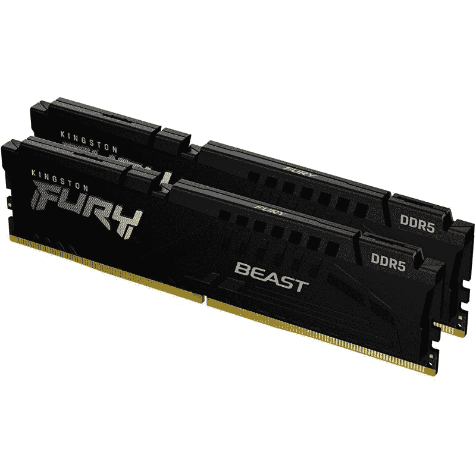
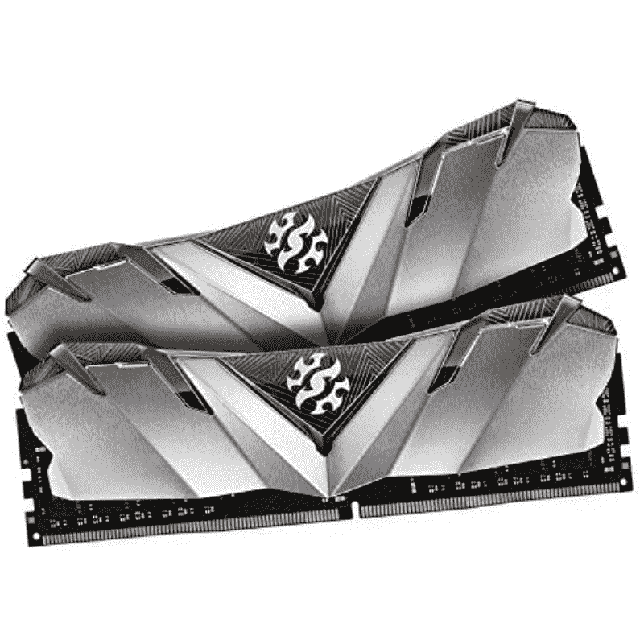

# DDR4 vs DDR5 RAM:有什么不同，应该买哪个？

> 原文：<https://www.xda-developers.com/ddr4-vs-ddr5/>

新的[第 12 代英特尔酷睿处理器](https://www.xda-developers.com/intel-12th-gen-alder-lake/)和 AMD 的锐龙 6000 系列移动 CPU 都已上市，支持 DDR5 内存模块。即将推出的 [AMD 7000 系列](https://www.xda-developers.com/amd-teases-ryzen-7000-processor-am5/)台式机处理器也将支持 DDR5 RAM，这意味着我们将在未来几个月内看到大量的 DDR5 内存。DDR5 标准带着许多改进进入市场。其中一些比另一些更重要，但它们都呼应了为更好的表现敞开大门的想法。但是我们所说的改善有多大呢？DDR5 与 DDR4 相比，有哪些新特性需要立即制定升级计划。

在本文中，我们将看看 DDR4 与 DDR5 RAM 的对比，告诉您需要了解的一切。我们将检查规格，以突出一些关键差异，并尝试了解性能差异，看看哪一种更适合您的下一款游戏电脑。

## DDR4 与 DDR5:有何不同

DDR5 RAM 模块在物理上与现有的 DDR4 记忆棒完全相同。不过，这不一定是个惊喜。与 DDR3 到 DDR4 的过渡不同，新的 DDR5 与前代相比没有新的或额外的引脚数量。它保留了 288 引脚的排列，但引脚排列略有不同。然而，真正的区别在于架构设计层面。DDR4 模块有一个 64 位通道，而 DDR5 DIMMs 有两个独立的 32 位通道。突发长度也增加了一倍，从 8 字节增加到 16 字节。现在，让我们来详细了解一些主要区别:

### 带宽和容量

DDR5 内存模块的最大优势之一是它们带来了更高水平的带宽。这一点现在比以往任何时候都更加重要，因为我们不断推出具有大量内核的新处理器。例如，[英特尔酷睿 i9-12900K](https://www.xda-developers.com/intel-core-i9-12900k-vs-amd-ryzen-5950x/) ，总共有 16 个内核。即使是像酷睿 i5-12400 这样的相对低功耗的主流部件也有六个内核。主流 PC 市场只会在未来获得内核数量更高的更好的 CPU，因此这是需要考虑的最重要的事情之一。

JEDEC(联合电子设备工程委员会)规定了从 DDR4-1600 到 DDR4-3200 的 DDR4 数据速率。对于 DDR5，指定为 DDR5-3200 至 DDR5-6400。也就是说，可以有把握地说，你会看到 DDR5-4800 作为基线，而后者随着标准的成熟而不断增加。

DDR5 标准带来的另一个东西是高容量的高密度内存模块。虽然 DDR4 模块的最高内存芯片容量为 16Gb，但 DDR5 的内存芯片容量是 16Gb 的四倍，最高可达 64Gb。理论上，我们每个模块可以有多达 128GB 的内存，这远远超过任何 DDR4 记忆棒所能提供的内存。在我们开始看到 128GB 容量的 DDR5 模块之前还有一段时间，但我们已经在市场上有 64GB 的套件和 2x32GB 的记忆棒。

### 工作电压

电源效率也是 DDR5 内存模块的主要话题之一。从表面上看，DDR5 内存模块的工作电压为 1.1V，低于 DDR4 的 1.2V。这对于每个套件来说肯定是不同的，因为它们已经超频或具有更高的 bin 内存，时间更紧。我们已经看到 DDR4 模块扩展到 1.6V，可以肯定地说，DDR5 将进一步增加，以达到更高的值。市场上已经有 DDR5 模块，DDR5-6800 的电压高达 1.35V。随着更快的内存速度成为优先事项，DDR5 的工作电压也将攀升至新高。此外，新的英特尔至尊内存配置文件(XMP) 3.0 支持多达五个 XMP 配置文件，其中两个自定义配置文件直接保存在 SPD 上。

还值得指出的是，主板不负责 DDR5 模块的电压调节。这些新模块具有电源管理 IC (PMIC) - 5V 用于主流模块，12V 用于服务器级 DIMMs。PMIC，如果你不知道，使用来自主板的 5V 输入，并将其转换为可用的电压。PMIC 有很多优点，包括改进的电压调节、强信号和低噪声。这绝对是一个好的变化，但它使 RAM 模块变得昂贵，并且是目前 DDR5 供应短缺的主要原因之一。

## DDR4 与 DDR5 RAM:规格

现在，我们已经讨论了内存标准之间的一些主要差异，让我们来看一下主要差异，以总结从 DDR4 到 DDR5 的过渡(基准规格):

| 

特征

 | 

DDR4 内存

 | 

DDR5 RAM

 |
| --- | --- | --- |
| **记忆速度** | 1600MHz - 3200Mhz | 4800 兆赫-8400 兆赫 |
| **模具密度** | 16Gb SDP-> 64GB DIMM | 64Gb SDP-> 256 GB DIMM |
| **电压** | 1.2V | 1.1V |
| **电源管理** | 主板上 | 关于 DIMM PMIC |

现在，这个问题已经解决了，是时候比较每个标准的模块了，看看这些变化在现实世界中是如何反映的。

## DDR4 与 DDR5 RAM:性能

在这个特殊的比较中，我们将使用 Kingston Fury Beast DDR5 内存和英特尔酷睿 i9-12900K。对于 DDR5 测试，我们选择的主板将是 Gigabyte Z690 Aorus Pro DDR5 兼容平台。您还可以获得与 DDR4 套件兼容的主板版本，这是我们在保持硬件测试相同的情况下进行比较时使用的版本。

英特尔新推出的 Alder Lake-S 台式机 CPU 是首批上市的支持 DDR5 内存的消费级处理器。AMD 还宣布其新的锐龙 6000 系列移动 CPU 和即将推出的锐龙 7000 系列桌面芯片支持 DDR5，但它们尚未上市。可以肯定地说，英特尔已经在这一点上击败了 AMD。因此，在这次测试中，我们将英特尔酷睿 i9-12900K 处理器与 Kingston Fury Beast DDR5-4800 32GB 内存套件配对。这是一个双通道套件，带有两个 16GB DDR5 模块和一个集成散热器。

默认情况下，Kingston Fury Beast DDR5 内存模块在 1.1V 的 DDR4-4800 下运行。它以 JEDEC 指定的 38-38-38 时序运行。然而，快速访问 XMP 3.0 将提高狂怒兽到 DDR5-6000 与 CL40 和 1.35V

不言而喻，DDR4 和 DDR5 模块必须在相似的系统配置中运行。我们在类似的测试台上比较了 32GB (2X16GB) DDR5 内存和等效的 32GB (2X16GB) DDR4 套件。市场上 DDR5 模块的缺乏限制了我们可以用于该测试的模块数量，但是当我们获得其他套件时，我们将尝试在该比较中添加更多模块的基准数量。

下面快速浏览一下我们能够针对这一特定测试运行的一些基准:

| 

基准

 | 

金士顿狂怒野兽 32GB(2X16) DDR5-5200 C40

 | 

阿达塔 XPG GAMMIX D30 32GB(2x 16)DDR 4-3600 C18

 |
| --- | --- | --- |
| **PCMark 10(越高越好)** | 12,145 | 11,628 |
| **Cinebench R23 - Multi(越高越好)** | 27,086 | 27,140 |
| **Blender - BMW(越低越好)** | 87 | 88 |
| **电晕 1.3 - RT** **(越低越好)** | 54 | 54 |
| **手刹 x264，。mkv 到. mp4(越低越好)** | 123 | 131 |
| **手刹 x265，。mkv to .mp4** **(越低越好)** | 283 | 291 |

正如你所看到的，基准数据显示了一些意料之中的结果。就基准数据而言，DDR5-4800 C38 的性能明显优于 DDR4-2666 C18。如上表所示，当您将 DDR4 模块的内存速度提升到 DDR4-3600 时，这种性能增量会降低。与 DDR5-4800 相比，DDR4-4000 C16 的性能差异非常小。

虽然新的 DDR5 内存模块的传输速度非常出色，但我们认为在内存计时和延迟方面仍有很大的改进空间。不过，DDR5 仍处于起步阶段。我们会给它更多的时间来成熟和主导市场上的 DDR4 模块。

## DDR4 与 DDR5 RAM:兼容性

正如我们在本文中多次提到的，DDR5 内存仅与目前市场上的第 12 代英特尔酷睿处理器兼容。这包括三个未锁定的部分- 12600K、12700K 和 12900K -但即使是阵容中的其他主流 CPU 也支持 DDR5。兼容 DDR5 的 AMD CPUs 尚未上市，但它们已经宣布上市，而且比你想象的要快。

上述英特尔芯片也与 DDR4 内存模块兼容，这就是为什么我们能够使用相同的 CPU 测试这两种标准。然而，你需要一个独立的 DDR4 兼容主板。这是因为包括 Z690、H670、B660 和 H610 在内的所有英特尔 600 系列芯片组[主板](https://www.xda-developers.com/best-motherboard/)要么支持 DDR5 内存，要么支持 DDR4，而不是两者都支持。你必须决定在可预见的未来坚持哪种标准，然后再为你基于阿尔德湖的个人电脑购买这些 [LGA 1700 主板](https://www.xda-developers.com/best-lga-1700-motherboard/)。至于锐龙 7000 系列芯片，嗯，AMD 支持的芯片组将如何处理内存兼容性仍有待观察，所以我们将在 7000 系列发布会上谈论更多。

## DDR4 vs DDR5 RAM:买哪个好？

我们已经看到了 DDR4 和 DDR5 内存模块之间的主要差异，以及一些基准测试数据，展示了一些真实的性能测试。现在是最重要的问题——你应该为你的下一个 PC 版本买哪一个？好吧，这个问题的答案，至少在 2022 年初写这篇文章的时候，取决于你对 PC 构建的预算以及你采购 DDR5 RAM 套件的难易程度。

 <picture></picture> 

Kingston Fury Beast DDR5 RAM

##### 金士顿狂怒野兽 DDR5 内存

Kingston Fury Beast DDR5 是上市的 DDR5 RAM 套件之一。这个特殊的模块支持高达 6000MHz 的速度。

由于第 12 代英特尔 Alder Lake 主板仅支持一种内存标准，因此只有在您有预算的情况下，放弃 DDR4 内存转而使用 DDR5 才有意义。我们收集的[最佳 DDR4 RAM](https://www.xda-developers.com/best-ddr4-ram/) 和[最佳 DDR5 RAM](https://www.xda-developers.com/best-ddr5-ram/) 套件会告诉你在价格上有显著的差异。将这一点添加到整体构建中，您将最终为 DDR5 支付大笔平台入门成本。更不用说，在库存中找到 DDR5 内存模块也不是特别容易。

 <picture></picture> 

XPG Gammix D30 DDR4 RAM

##### XPG Gammix D30 DDR4 RAM

XPG Gammix D30 DDR4 RAM 模块有几种不同的款式。内存速度从 2666Mhz 到 3600MHz 不等。

因此，如果您正在考虑第 12 代英特尔构建的预算紧张，那么我们建议选择一款速度相对较高的体面 DDR4 内存套件。绝对能跟上目前市面上 DDR5 模块的收成。根据 DDR5 库存的可用性、随后的价格变化以及更成熟的套件在更短时间内的到来，未来可能会有所变化。我们一定会在以后重新审视这个比较，看看事情是如何变化的。与此同时，我们认为还有其他组件可以花更多的钱，包括最好的 [M.2 固态硬盘](https://www.xda-developers.com/best-m-2-ssd/)、[最好的 CPU 冷却器](https://www.xda-developers.com/best-cpu-coolers/)、[最好的 PC 机箱](https://www.xda-developers.com/best-pc-case-gamers/)等等。

如果您对 DDR4 和 DDR5 的比较有任何疑问，请在下面留言告诉我们。与往常一样，您也可以加入我们的 [XDA 计算论坛](https://forum.xda-developers.com/c/xda-computing.12289/)与社区中的其他专家互动，讨论您的构建，获得产品推荐，等等。