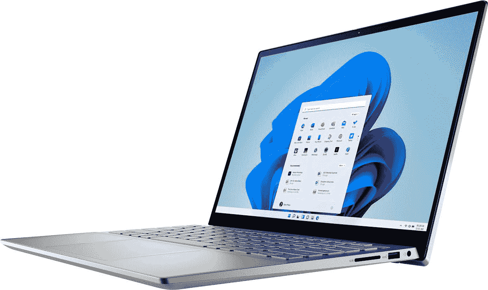

# 戴尔 Inspiron 灵越 14 二合一(2022)评测:一款超值的主流笔记本电脑

> 原文：<https://www.xda-developers.com/dell-inspiron-14-2-in-1-2022-review/>

在过去的几周里，戴尔的新款 Inspiron 灵越 14 二合一笔记本电脑一直是令人愉快的主流笔记本电脑，我真的很喜欢它在过去几周里所做的改进。屏幕是 16:10，还有一些像三边触摸板这样的整洁的设计变化。也有很多价值。这台机器的价格刚刚超过 1000 美元，这是较高端的型号。起价 849.99 美元，你仍然可以得到一台配有全高清网络摄像头的笔记本电脑。

尽管它并不完美。最大的问题是，坦率地说，它没有一个很好的屏幕，所以如果你需要一个超级色彩准确的工作流程，这不是你的笔记本电脑。它也没有 Thunderbolt，所以你必须确保 USB 3.2 Gen 2x2 对你来说足够了。

但同样，这为 1050 美元提供了很多。虽然我们看到越来越多的[笔记本电脑配备了 1080p 网络摄像头](https://www.xda-developers.com/best-laptops-1080p-webcam)，但在这个更主流的价格点上，它们仍然很少见，所以这是一个真正的价值指标。

 <picture></picture> 

Dell Inspiron 14 2-in-1

##### 戴尔 Inspiron 灵越 14 二合一设备

Dell Inspiron 灵越 14 二合一笔记本电脑是一款主流笔记本电脑，采用高端设计，价格低廉，配有 FHD 网络摄像头、16:10 显示屏和第 12 代处理器。

**浏览此评论:**

## 戴尔 Inspiron 灵越 14 二合一(2022)的定价和可用性

*   戴尔 Inspiron 灵越 14 二合一设备起价 849.99 美元

戴尔 Inspiron 灵越 14 二合一设备在 Dell.com 和百思买只有两种配置，价格分别为 849.99 美元和 1049.99 美元。入门级配备酷睿 i5-1235U、8GB DDR4、512GB 固态硬盘和 1，920x1，200 显示屏。另一款将 CPU 换成了酷睿 i7-1255U，将双 4GB 内存换成了两个 8GB 内存。

不过在某个时候应该会有更多的配置出现。戴尔发给我的评论指南中的规格表承诺了其他选项，包括酷睿 i3 配置、高达 32GB 的内存和高达 2TB 的固态硬盘。戴尔可能只是从一些更常见的配置开始，许多公司现在都在这样做。

## 戴尔 Inspiron 灵越 14 二合一笔记本电脑(2022):规格

| 

处理器

 | 第 12 代英特尔酷睿 i7-1255U (12MB 高速缓存，最高 4.7 GHz，10 个内核) |
| 

制图法

 | 英特尔 Iris Xe 显卡 |
| 

身体

 | 0.62 英寸–0.70 英寸 x 12.36 英寸 x 8.96 英寸(15.70–17.86 x 314 x 227.50 毫米)，3.61 磅。(1.63 千克)带 54W 电池 |
| 

显示

 | 14.0 英寸 16:10 FHD+ (1920 x 1200) Truelife 触摸窄边框 WVA 显示屏 |
| 

记忆

 | 16GB，2x8GB，DDR4，3200MHz |
| 

储存；储备

 | 512GB M.2 PCIe NVMe 固态硬盘 |
| 

港口

 | 1 个 HDMI 输出 1.41 USB 3.2 Gen 1 Type-A2 USB 3.2 Gen 2 x2 Type-C，带 PowerDelivery 和 Video1 3.5mm 毫米耳机/麦克风组合 jackSD 读卡器 |
| 

投入

 | 精密触摸板防泼溅，背光 |
| 

多媒体

 | 集成式宽屏 FHD (1080p)摄像头，带摄像头快门和临时降噪功能带 Waves MaxxAudio Pro 的立体声扬声器集成式双阵列麦克风 |
| 

电池

 | 4 芯电池，54 瓦时(集成)65 瓦电源适配器(C 型) |
| 

颜色

 | 铂金银 |
| 

安全性

 | 带 Windows Hello(可选)网络摄像头隐私快门的指纹识别器 |
| 

操作系统（Operating System）

 | Windows 11 主页 |
| 

价格

 | $1,050 |

## 设计:它有一个全尺寸的 SD 卡读卡器

*   它由铝制成，有铂银两种颜色
*   有一个全尺寸的 SD 读卡器

戴尔 Inspiron 灵越 14 二合一设备看起来像一台[戴尔笔记本电脑](https://www.xda-developers.com/best-dell-laptops/)。我这么说的意思是，如果让我给你画一张我所期望的典型戴尔笔记本电脑的图片，这就是我最终会得到的结果。它由铝制成，有传统的铂银颜色，盖子上印有闪亮的戴尔徽标。鉴于[低廉的价格](https://www.xda-developers.com/best-cheap-laptops/)，感觉真的很溢价。

许多 Inspiron 机型的一个巧妙之处在于，转轴的设计可以抬起底座。这意味着当盖子打开时，底座实际上并没有平放在你的桌子上。因为它被抬起来了，所以空气流通更好，性能也更好。

Dell Inspiron 灵越 14 二合一笔记本电脑是一种即将消亡的 14 英寸笔记本电脑，配有全尺寸 SD 卡插槽。

它只有 3.61 磅，有点重，尽管坦率地说，当我看规格表时，我有点惊讶地发现它竟然这么重。T4 并不觉得它很重，相信我，我对笔记本电脑的不同重量非常敏感。这个带在身边感觉很舒服。如果它确实感觉有点重，有一个更轻的选项，配备更小的电池。

这台笔记本电脑上有一个有趣的端口选择，包括两个 USB Type-C，一个 USB Type-A，HDMI，一个耳机插孔和一个 SD 读卡器。我知道；一个 *SD 读卡器*。如今，全尺寸 SD 卡读卡器似乎非常罕见，即使你找到了，也通常是在 15 或 16 英寸的笔记本电脑上，这些笔记本电脑是为将要编辑视频的创作者设计的。如果你正在寻找一台带全尺寸 SD 读卡器的 14 英寸笔记本电脑，在找到另一台之前，你会花很多时间去寻找。

两个 USB Type-C 口都不是 Thunderbolt，很可惜。有趣的是，它们是 USB 3.2 Gen 2x2，我不认为我实际上在一个产品中见过它。说点题外话，这是 USB 一代奇怪而疯狂的工作方式。USB 3.0 支持 5Gbps 速度，并被更名为 USB 3.1 Gen 1。当 USB 3.1 问世时，USB 3.1 Gen 2 是 10Gbps 速度的实际新标准。然后 USB 3.2 出现了，你猜对了，一切都重新命名了。USB 3.1 Gen 1(原来是 USB 3.0)变成了 USB 3.2 Gen 1，USB 3.1 Gen 2 变成了 USB 3.2 Gen 2。新的是 USB 3.2 Gen 2x2，支持 20Gbps 的速度。

USB 3.2 Gen 2x2 基本上被跳过，而支持 40Gbps 速度的 USB4。尽管如此，如果它不会是 Thunderbolt 4 / USB4，它是 USB 3.2 Gen 2x2 也很好。我平时看到的非迅雷笔记本电脑连那个都没有。

## 显示器:现在是 16:10，但它需要工作

*   14 英寸显示器现在是 16:10，但色域没有达到标准
*   网络摄像头是 1080p

顾名思义，Dell Inspiron 灵越 14 二合一笔记本电脑的屏幕对角线为 14 英寸。与去年的型号相比，最大的变化是现在的长宽比为 16:10，而不是 16:9。这意味着它更高，表面积更大，这太棒了。分辨率为 1,920x1,200。

不幸的是，一切都改变了。色域测试似乎显示了与我们在之前型号上看到的几乎完全相同的结果。

它支持 64%的 sRGB、46%的 NTSC、48%的 Adobe RGB 和 48%的 P3。这些数字足够低，以至于我怀疑我的传感器有问题，但当我回顾去年的模型时，我经历了这些困惑。我进行了工厂重置，测试了其他显示器，看看是否会得到不同的结果，等等。

问题是，显示器看起来并不像应该那么糟糕，至少如果你没有把它放在其他东西旁边的话。事实上，它的可视角度非常高。但事实就是如此。这里有两个关键问题。一个是，如果你关心照片和视频编辑，你会重视颜色的准确性，所以如果这是你的困扰，你会想要远离这台笔记本电脑。

另一个关键问题是，如果你使用便携式显示器，体验有点不和谐。我用的是旁边的 15.6 英寸便携式有机发光二极管显示器，很明显两者孰优孰劣。

亮度最高为 283 尼特，这不是特别亮，在户外使用时会出现问题。事实上，你应该可以从这篇文章中的一些图片中看出这一点。对比度最大值为 1，290:1，没问题。

有一点非常棒，那就是网络摄像头。这款笔记本电脑配有 1080p 摄像头，这在这个价位还是很少见的。在家办公和视频通话的年代真的很好看。它还有一个隐私快门，当你不想它意外打开时使用。

## 键盘:触摸板设计独特

*   它有标准的 Chiclet 风格的按键，指纹传感器中有一个电源按钮

这款笔记本电脑的键盘非常坚固，使用任何戴尔笔记本电脑上都能找到的 Chiclet 式按键。我真的很喜欢这款的手感；按一个键需要恰到好处的力量，而且不会太深。当然，它也是背光的。

三面触摸板赋予了它独特的外观。

你会在右上角看到，电源按钮兼作指纹传感器。不幸的是，我仍然必须指出，与其他所有在电源按钮上放置指纹传感器的公司不同，戴尔不会在你按下按钮时扫描你。这款笔记本电脑在开机后会扫描你，所以不像其他笔记本电脑那样无缝。也没有红外摄像头，所以这是你唯一的生物认证方法。

这里的大故事是触摸板。我从来没有见过另一个像它一样的，因为它是一个非常独特的设计。有一片玻璃横跨整个掌托，正如你从图像中看到的，触摸板三面都被切掉了。很整洁。似乎丝毫不影响使用；显然，你不能点击顶角，反正你也不会。这很酷，看起来有点不同。我喜欢它，甚至除了三边触摸板，我还喜欢掌托上的玻璃。

## 性能:它采用英特尔第 12 代 U 系列处理器

*   英特尔新的第 12 代 U 系列处理器有助于提高工作效率

对于采用英特尔技术的笔记本电脑来说，这是一个奇怪的时代。如果你一年前买了一台 14 英寸的笔记本电脑，它配备了英特尔 15W 处理器，也称为 U 系列。随着第 12 代的推出，一些超极本将采用全新的 28W P 系列器件。我见过其他笔记本电脑甚至包括 45W H 系列 CPU，而没有专用显卡。

有趣的是，所有这些都有利弊。一些配备 H 系列处理器的笔记本电脑实际上没有这台配备 15W U 系列处理器的笔记本电脑的性能指标评测好。毕竟，有更多的权力通过一个机箱，而不是真正设计来处理它。对于那些功率更高、性能更好的 CPU，这是以电池寿命为代价的。这就是为什么我们看到一些笔记本电脑，如新的联想 Yoga 9i，配备了 75 瓦时的电池。

英特尔第 12 代 U 系列是生产力的完美选择。

对于生产力来说，U 系列无疑是一个不错的选择。它的电池寿命是最好的，而且不会随着时间的推移出现性能问题。我会说，对于照片和视频编辑任务，您应该转向更高功率的处理器。要我说，P 系列对照片编辑有意义，H 系列搭配专用显卡最适合视频编辑。虽然我现在已经测试了几台配备 H 系列处理器和集成显卡的笔记本电脑，但实际上我不会购买任何一台。

是的，我确实注意到这台笔记本电脑在某些任务上卡住了，比如 Lightroom Classic 导出。这就是我所说的高效笔记本电脑。这个东西非常适合在 web 浏览器、Office、Slack、OneNote 等环境中工作。

对于基准测试，我运行了 PCMark 10、3DMark: Time Spy、Geekbench、Cinebench 和 Crossmark。

|  | 

戴尔 Inspiron 灵越 14 二合一酷睿 i7-1255U

 | 

[戴尔 Inspiron 灵越 14 二合一设备](https://www.xda-developers.com/dell-inspiron-14-2-in-1-review/)锐龙 7 5700U

 | 

[联想 Yoga 9i](https://www.xda-developers.com/lenovo-yoga-9i-2022-review/) 酷睿 i7-1260P

 |
| --- | --- | --- | --- |
| 

PCMark 10

 | 5,305 | 5,320 | 5,616 |
| 

3DMark:时间间谍

 | 1,507 | 1,256 | 1,678 |
| 

Geekbench 5(单/多)

 | 1,711 / 6,700 | 1,151 / 6,091 | 1,736 / 9,525 |
| 

Cinebench R23(单/多)

 | 1,724 / 6,797 | 1,233 / 7,768 | 1,638 / 7,757 |
| 

交叉标记(总体/生产力/创造力/响应时间)

 | 1,428 / 1,450 / 1,464 / 1,265 |  |  |

正如你所看到的，PCMark 10 的分数与上一代的 AMD 型号相似，尽管这些锐龙 5000 处理器在没有连接到电源时受到了巨大的性能打击。您还可以看到，今年的模型在其他领域显示了一些有意义的收获，例如单核 CPU 测试，这对真实世界的性能非常重要。我还赠送了联想 Yoga 9i，因为我想展示 U 系列和 P 系列处理器之间的区别。

英特尔的第 12 代处理器采用了全新的混合架构，现在共有 10 个内核和 12 个线程，而前几代处理器只有 4 个内核和 8 个线程。这是一件大事，但有一点已经改变，只有两个核心是性能核心，或 P 核心。其余的是效率核心或 E 核心。如果您想要两个以上的 P 核心，您必须选择 P 系列。

就电池寿命而言，它相当不错。随着电源设置为平衡，屏幕处于中等亮度，我得到的最好成绩是 6 小时 52 分钟，这真是太棒了。平均而言，它超过了五个小时，与市场上的其他产品相比，这仍然是非常好的。当然，这都是在利用它提高生产力的同时。当我开始编辑照片时，电池寿命下降到略低于四小时。

## 该不该买戴尔 Inspiron 14 二合一(2022)？

正如我在这篇评论中提到的，这款笔记本电脑有优点也有缺点，这些优点和缺点适用于不同的使用情况，因此并不适合所有人。

**您应该购买 Dell Inspiron 灵越 14 二合一(2022)笔记本电脑，如果:**

*   你在寻找一些生产力很高的东西
*   你需要一台在家办公的笔记本电脑
*   电池寿命对您很重要

**在以下情况下，您不应购买 Dell Inspiron 灵越 14 二合一设备:**

*   你需要霹雳
*   你在做创造性的工作，比如照片和视频编辑

大概要考虑的最大因素就是显示器了。如果颜色对您的工作流程真的很重要，那么这款笔记本电脑不适合您。如果您正在寻找适合工作的设备，那么戴尔 Inspiron 灵越 14 二合一笔记本电脑非常合适。