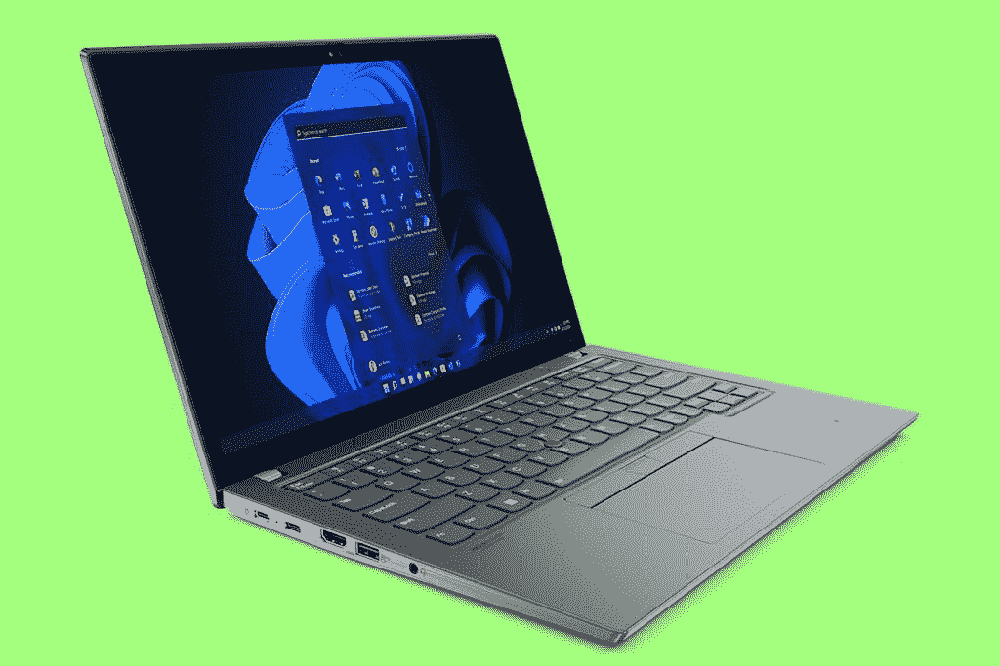
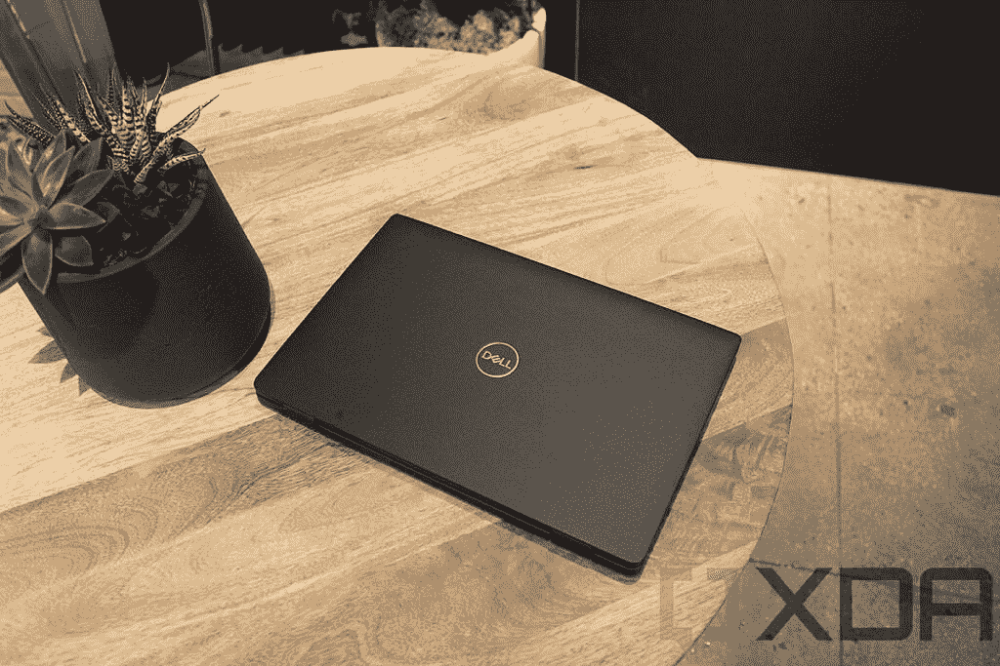
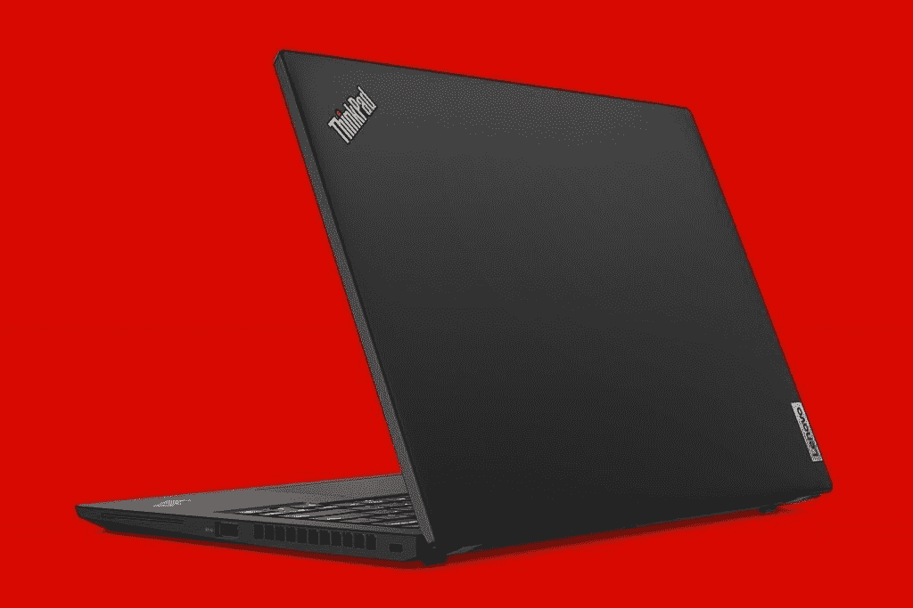
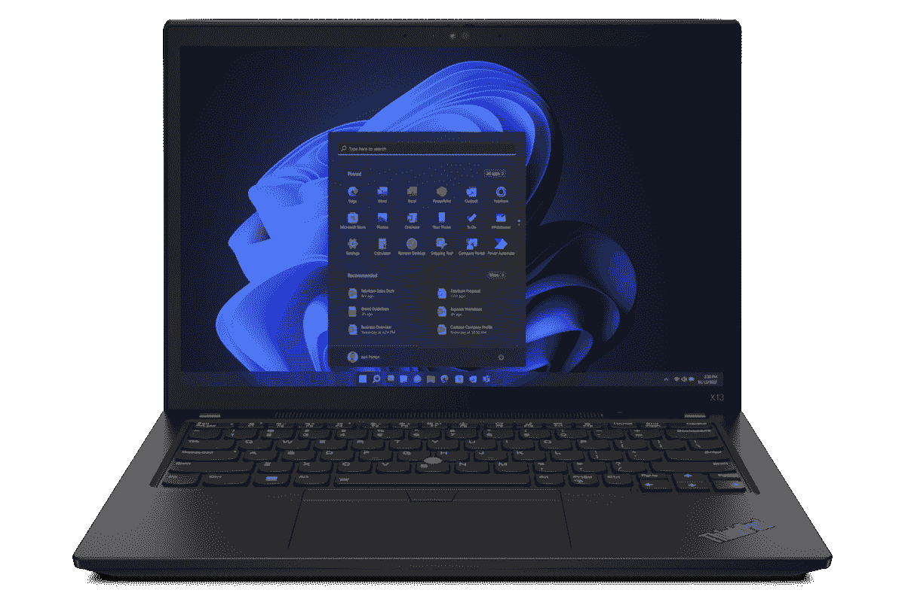

# 戴尔 Latitude 7330 与联想 ThinkPad X13 Gen 3:哪个更好？

> 原文：<https://www.xda-developers.com/dell-latitude-7330-vs-lenovo-thinkpad-x13-gen-3/>

过去几个月，我们已经看到了一系列新设备的推出，它们都采用了英特尔和 AMD 的全新处理器。其中许多都是商务笔记本电脑，可以说，今年有一些很好的选择。其中，戴尔 Latitude 7330 和联想 ThinkPad X13 Gen 3 是年度最佳商务笔记本电脑之一的两大热门竞争者。

因此，如果你在这两者之间挣扎，我们理解，我们会帮助你。我们将对 Dell Latitude 7330 和联想 ThinkPad X13 Gen 3 的功能、规格和设计进行比较，以便您确定最适合您需求的产品。首先，有一点值得一提，Latitude 7330 可以作为 2 合 1 笔记本电脑或传统翻盖电脑提供，这一点非常重要。ThinkPad X13 只是一台翻盖式笔记本电脑，不过如果你想要一台敞篷车，还有 ThinkPad X13 Yoga。说完这些，让我们来看看其他的不同之处。

**浏览本文:**

## 戴尔 Latitude 7330 与联想 ThinkPad X13 Gen 3:规格

|  | 

戴尔 Latitude 7330

 | 

联想 ThinkPad X13 Gen 3

 |
| --- | --- | --- |
| **操作系统** |  |  |
| **CPU** | 

*   第 12 代英特尔酷睿 i5-1235U (10 个内核，12 个线程，最高 4.4GHz，12MB 高速缓存)
*   第 12 代英特尔酷睿 i5-1245U 博锐企业版(10 个内核，12 个线程，最高 4.4GHz，12MB 高速缓存)
*   第 12 代英特尔酷睿 i7-1255U (10 个内核，12 个线程，最高 4.7GHz，12MB 高速缓存)
*   第 12 代英特尔酷睿 i7-1265U 博锐企业版(10 个内核，12 个线程，最高 4.8GHz，12MB 高速缓存)

 | 

*   **英特尔:**
    *   p 系列:
        *   英特尔酷睿 i5-1240P (12 个内核，16 个线程，最高 4.4GHz，12MB 高速缓存)
        *   英特尔酷睿 i5-1250P (12 个内核，16 个线程，最高 4.4GHz，12MB 高速缓存)
        *   英特尔酷睿 i7-1260 处理器(12 个内核，16 个线程，最高 4.7GHz，18MB 高速缓存)
        *   英特尔酷睿 i7-1270P (12 个内核，16 个线程，最高 4.8GHz，18MB 高速缓存)
        *   英特尔酷睿 i7-1280P (14 个内核，20 个线程，最高 4.8GHz，24MB 高速缓存)
    *   u 系列
        *   第 12 代英特尔酷睿 i3-1215U (6 个内核，8 个线程，最高 4.4GHz，10MB 高速缓存)
        *   第 12 代英特尔酷睿 i5-1235U (10 个内核，12 个线程，最高 4.4GHz，12MB 高速缓存)
        *   第 12 代英特尔酷睿 i5-1245U (10 个内核，12 个线程，最高 4.4GHz，12MB 高速缓存)
*   **AMD**
    *   AMD Ryzern 5 Pro 6650U (6 个内核，12 个线程，最高 4.5GHz，16MB 高速缓存)
    *   AMD 锐龙 7 Pro 6850U (8 核 16 线程，最高 4.7GHz，16MB 高速缓存)

 |
| **图形** |  | 

*   **英特尔**
    *   英特尔 Iris Xe(酷睿 i5、i7)
    *   英特尔 UHD 显卡(酷睿 i3)
*   **AMD**
    *   AMD 镭龙 660M 显卡(锐龙 5)
    *   AMD 镭龙 680M 显卡(锐龙 7)

 |
| **显示** | 

*   **笔记本电脑**
    *   13.3 英寸 16:9 全高清(1920 x 1080)，250 尼特，45% NTSC，防眩光
    *   13.3 英寸 16:9 全高清(1920 x 1080)，400 尼特，100% sRGB，防眩光，超低功耗(也提供超轻配置)
    *   13.3 英寸 16:9 全高清(1920 x 1080)，300 尼特，72% NTSC，防眩光，触摸
*   **二合一**
    *   13.3 英寸 16:9 全高清(1920 x 1080)，300 尼特，100% sRGB，防反光，防脏，超低功耗，康宁大猩猩玻璃 6 DXC，触摸，笔支持

 | 

*   13.3 英寸 16:10，最高可达 Quad HD+ (2560 x 1600)，400 尼特
    *   提供触摸、杜比视觉选项

 |
| **存储** |  |  |
| **公羊** | 

*   8GB DDR4 3200MHz
*   16GB DDR4 3200MHz
*   32GB DDR4 3200 MHz

 | 

*   8GB LPDDR5 4800MHz(英特尔)/6400MHz (AMD)
*   16GB LPDDR5 4800MHz(英特尔)/6400MHz (AMD)
*   32GB LPDDR5 4800MHz(英特尔)/6400MHz (AMD)

 |
| **电池** | 

*   3 芯 41 瓦时电池
*   4 芯 58 瓦时电池
    *   高达 90W 的 USB Type-C 电源适配器

 | 

*   41 瓦时电池(长达 11.5 小时)
*   54.7 瓦时电池(长达 15.5 小时)

 |
| **端口** | 

*   2 个 Thunderbolt 4(USB C 型)
*   1 个 USB 3.2 第 1 代 A 型
*   1 个 HDMI 接口
*   3.5 毫米耳机插孔
*   Nano SIM 卡插槽(可选)
*   智能卡读卡器(可选)

 | 

*   **英特尔:** 2 个迅雷 4 (USB Type-C)
*   **AMD:** 1 个 USB 4(C 型)，1 个 USB 3.2(C 型)
*   2 个 USB 3.2 第 1 代 A 型
*   1 个 HDMI 2.0b 接口
*   3.5 毫米耳机插孔
*   Nano SIM 卡插槽

 |
| **音频** | 

*   Waves MaxxAudio Pro 的双扬声器设置
*   双降噪麦克风

 | 

*   杜比音频扬声器系统
*   杜比语音话筒

 |
| **摄像机** | 

*   720p 高清相机，带相机快门
*   1080p 全高清+红外摄像头，带快速登录和环境光传感器，带摄像头快门

 | 

*   高达全高清 1080p +红外网络摄像头，带隐私快门

 |
| **Windows Hello** | 

*   红外网络摄像头(可选)
*   指纹传感器(可选)

 | 

*   指纹识别器(可选)
*   红外摄像机(可选)
*   磁贴就绪(英特尔型号)
*   安全核心电脑

 |
| **连通性** | 

*   英特尔无线 6E
*   蓝牙 5.2
*   蜂窝选项:

 | 

*   Wi-Fi 6E
*   蓝牙 5.2
*   蜂窝选项:

 |
| **颜色** |  |  |
| **尺寸(WxDxH)** | 

*   **非触控笔记本电脑:** 306.5 x 199.95 x 16.96 毫米(12.07 x 7.67 x 0.67 英寸)

 | 

*   305.8 x 217.56 x 18.1 毫米(12.04 x 8.56 x 0.71 英寸)

 |
| **重量** | 

*   **笔记本电脑**:起始重量为 967 克(2.13 磅)
*   **二合一**:起始重量 1.36 千克(3.0 磅)

 | 

*   起始重量为 1.19 千克(2.62 磅)

 |
| **价格** | 起价 1899 美元 | 起售价为 1，119 美元(AMD)/1，179 美元(英特尔) |

## 显示屏:联想 ThinkPad X13 拥有 16:10 的屏幕

这两款笔记本电脑最明显的区别之一与显示屏有关。这是 ThinkPad X13 Gen 3 真正领先的一个领域，这要归功于它的 16:10 面板，这大大提高了工作效率。最近，我们看到越来越多的高纵横比显示器，尤其是在高端笔记本电脑上，ThinkPad X13 就是其中之一。使用更高的屏幕，您可以获得更多的内容空间，无论是网页上的文本、Excel 中的行还是 Adobe Premiere 等应用程序上的 UI 元素。它还可以达到非常清晰的 Quad HD+分辨率(2560 x 1600)，这也可以根据您的设置一次显示更多内容。你也可以用触摸和杜比视觉支持来配置它。

 <picture></picture> 

Lenovo ThinkPad X13 Gen 3

同时，Dell Latitude 7330 也有 13.3 英寸的面板，但它采用了更传统的 16:9 宽高比。对于许多用户来说，这仍然很好，但一旦你习惯了更高的显示器，就很难再回头了。它有全高清分辨率(1920 x 1080)，这是最大的配置。您可以将其配置为支持触摸，甚至可以选择 2 合 1 型号，它还支持活动笔，让您可以将笔记本电脑用作平板电脑。如果你想要一台联想的二合一设备，你可以试试 ThinkPad X13 Yoga Gen 3。

 <picture></picture> 

Dell Latitude 7330

至于声音，这两款笔记本电脑都有双立体声扬声器，这大约是你对 13 英寸笔记本电脑的期望。戴尔正在利用其与 Waves MaxxAudio 的通常合作关系，而联想只是说其扬声器支持杜比音频。这两款笔记本电脑还配有用于通话的双麦克风。

这两款笔记本电脑都可以选择 1080p 网络摄像头和 Windows Hello。

在显示屏上方，两款笔记本电脑都提供了全高清摄像头和红外摄像头的选项，支持 Windows Hello 面部识别。这是一个可选的升级，两者在默认配置中都可能有一个 720p 的网络摄像头。尽管如此，只要有 1080p 的选项就很好，如果你打算进行视频通话和会议，这是一个值得的升级，因为你会看起来更好。

## 设计:ThinkPad 是标志性的，但 Latitude 更现代一些

谈到设计，让我们从便携性开始，这是戴尔 Latitude 7330 击败联想 ThinkPad X13 Gen 3 的关键领域之一。Latitude 7330 配备了新的“超轻”配置，采用镁制机箱，这意味着它的起始重量仅为 2.13 磅。如果您选择铝制或碳纤维型号，它会变得更重，如果您选择 2 合 1，则更重，起始重量为 3 磅，但如果选择更轻的型号，那就更好了。它的厚度也只有 16.96 毫米。

 <picture></picture> 

Dell 7330 Ultralight configuration

相比之下，联想 ThinkPad X13 Gen 3 的起始重量为 2.62 磅，因此其基本配置要重得多，而且厚度为 18.1 毫米。Dell Latitude 7330 无疑更加便携，但值得记住的是，如果您选择铝合金或碳纤维款式，这将是一个更接近的搭配。

至于长相，这真的取决于你想要什么。ThinkPad X13 Gen 3 的设计保持了 ThinkPad 家族的标志性外观，采用红色点缀的黑色机箱。你也可以得到风暴灰，但整体看起来是相似的。此外，像红色的跟踪点和重复的鼠标按钮也在这里。如果你喜欢传统的 ThinkPad 设计，这很好，但其他人可能会觉得它过时了，没有吸引力。

 <picture></picture> 

Lenovo ThinkPad X13 in Villi Black

同时，Dell Latitude 7330 采用金属表面，外观更加时尚。颜色主要取决于你得到的材料。镁和碳纤维模型是一种非常暗的银色，而铝是一种浅得多的颜色。无论如何，它看起来更干净，更时尚，加上它没有像指点杆这样的传统功能，所以它总体上感觉更现代一些。然而，这也不是一个令人兴奋的设计。

## 端口和连接:联想 ThinkPad X13 有 5G 选项

最后，我们来看看两台笔记本电脑上的端口，它们没有什么不同。Dell Latitude 7330 有两个 Thunderbolt 4 端口、一个 USB Type-A 端口、HDMI 和一个耳机插孔，以及一个可选的 nano-SIM 插槽和智能卡读卡器。对于这种尺寸的商用笔记本电脑来说，这已经是一个可靠的设置了。

另一方面，联想 ThinkPad X13 Gen 3 也有类似的设置，但它没有为智能卡读卡器腾出空间，而是增加了一个 USB Type-A 端口(总共两个)。这对更多的用户来说可能更有用，但是拥有智能卡阅读器在更具体的情况下也会有帮助。有一点需要注意的是，AMD 版本的 ThinkPad X13 不支持 Thunderbolt 4，但它确实在其中一个端口上提供了 USB 4 支持，所以它应该仍然支持 [Thunderbolt docks](https://www.xda-developers.com/best-thunderbolt-docks/) 和它们的大部分功能。

ThinkPad X13 Gen 3 提供可选的 5G 支持。

不过，ThinkPad X13 Gen 3 在无线连接方面有明显的优势。这是这两款笔记本电脑中唯一一款支持 5G 蜂窝网络的选项。这两款笔记本电脑都有 4G LTE 选项，即使您远离安全的 Wi-Fi 网络，也可以保持与互联网的连接。然而，有了 5G，你可以获得更快的速度，特别是随着时间的推移和技术的发展。另一方面，5G 是一个昂贵的升级，所以有。正如你所料，这两款笔记本电脑都支持 Wi-Fi 6E 和蓝牙 5.2。

## 表演

仅查看本页顶部的规格表，联想 ThinkPad X13 Gen 3 和戴尔 Latitude 7330 似乎有很多共同点，但这不一定是真的。这两款电脑都配备了英特尔的第 12 代处理器，但 ThinkPad 也提供了 AMD 锐龙 6000 芯片的选项。我们也不知道联想在 ThinkPad X13 内部使用的是 U 系列还是 P 系列处理器，所以还是少了一些变数。如果联想决定使用 P 系列处理器，ThinkPad X13 Gen 3 将具有很大的性能优势。

无论如何，让我们看看这里的选项。英特尔的 P 系列产品阵容最大限度地发挥了英特尔酷睿 i7-1280 P(14 核 20 线程)的优势，而 U 系列则升级到了酷睿 i7-1265 U(10 核 12 线程)。与此同时，AMD 锐龙 6000 PRO 系列由锐龙 7 PRO 6850U 引领。所有这些模型都是最近的，基准分数不足以描绘一幅非常清晰的画面，但我们可以了解它们之间的比较。我们还将比较每个系列中的一些中端机型。

|  | 

英特尔酷睿 i7-1280P( [参见测试](https://browser.geekbench.com/v5/cpu/13331030))

 | 

英特尔酷睿 i7-1265U( [参见测试](https://browser.geekbench.com/v5/cpu/12860339))

 | 

AMD 锐龙 7 Pro 6850U( [见测试](https://browser.geekbench.com/v5/cpu/12901659))

 |
| --- | --- | --- | --- |
| Geekbench 5(单核/多核) | 1,790 / 9,312 | 1,253 / 6,643 | 1,530 / 7,520 |

需要说明的是，基准测试分数并不一定代表整体性能，特别是这个测试只测试了 CPU。不过，您可以了解一下这些处理器的性能。英特尔的 28W P 系列处理器应该提供更好的性能，但所有这些都将有助于快速笔记本电脑。只有在工作负载非常密集的情况下，您才需要这种顶级性能。

在图形方面，英特尔 Iris Xe 与 P 系列和 U 系列不会有太大不同，尽管您会注意到酷睿 i5 和酷睿 i7 型号之间的差异。但是由于新的镭龙 600M 显卡，这是 AMD 应该进一步领先的一个领域。AMD 表示，这种集成 GPU 比 NVIDIA GeForce MX450 更快，因此如果你需要一些轻度游戏或 3D 渲染的额外性能，它将是最佳选择。

ThinkPad X13 内部的 AMD 处理器拥有更强大的显卡。

在内存方面，两款笔记本电脑都配备了高达 32GB 的内存，戴尔已经证实其笔记本电脑将使用 DDR4 内存，但联想尚未具体说明其使用的是什么。至于存储，联想提供高达 2TB 的配置，是 Latitude 7330 的两倍。至于电池，两款笔记本电脑都有类似大小的电池选项，所以假设两侧的配置相同，它们应该有类似的性能。

## 戴尔 Latitude 7330 与联想 ThinkPad X13 Gen 3:最终想法

看了所有这些之后，可以公平地说 ThinkPad X13 Gen 3 在几个方面是一款更有趣的笔记本电脑。它为您提供了 AMD 和英特尔处理器的选择，它具有更好的生产力显示器，并且可以选择支持 5G。

不过，也许最重要的是，它也更实惠。联想 ThinkPad X13 Gen 3 的起价仅为 AMD 版的 1119 美元，英特尔版的 1179 美元。这比起价 1899 美元的 Dell Latitude 7330 便宜 700 多美元。不过，公平地说，我们不知道这些基本配置包括什么，因为这两款笔记本电脑都还没有上市。

Dell Latitude 7330 也有一些好处。如果你选择镁底盘，它明显更轻更薄。此外，它有一个更现代的设计，虽然这是非常主观的。你可能还会喜欢内置智能卡阅读器的选项，这是 ThinkPad 所没有的。

最终，你更喜欢哪一款取决于你，但联想 ThinkPad X13 Gen 3 的优势可能对更多用户更具吸引力。我们仍然需要等待每个型号中使用的处理器的一些额外细节，但一般来说，这是我们的建议。

如果你想买这两款笔记本电脑中的任何一款，你可以使用下面的链接。否则，你可以查看一下你现在能买到的[最佳戴尔笔记本电脑](https://www.xda-developers.com/best-dell-laptops/)或[最佳 ThinkPad](https://www.xda-developers.com/best-thinkpads/)，这样你就能看到每家公司提供的更多信息。

 <picture></picture> 

Dell Latitude 7330

##### 戴尔 Latitude 7330

Dell Latitude 7330 是一款优质、轻便的商用笔记本电脑，有翻盖式和折叠式两种外形。

 <picture></picture> 

Lenovo ThinkPad X13 Gen 3

##### 联想 ThinkPad X13 Gen 3

联想 ThinkPad X13 采用了标志性的 ThinkPad 设计以及英特尔和 AMD 版本的强大规格。