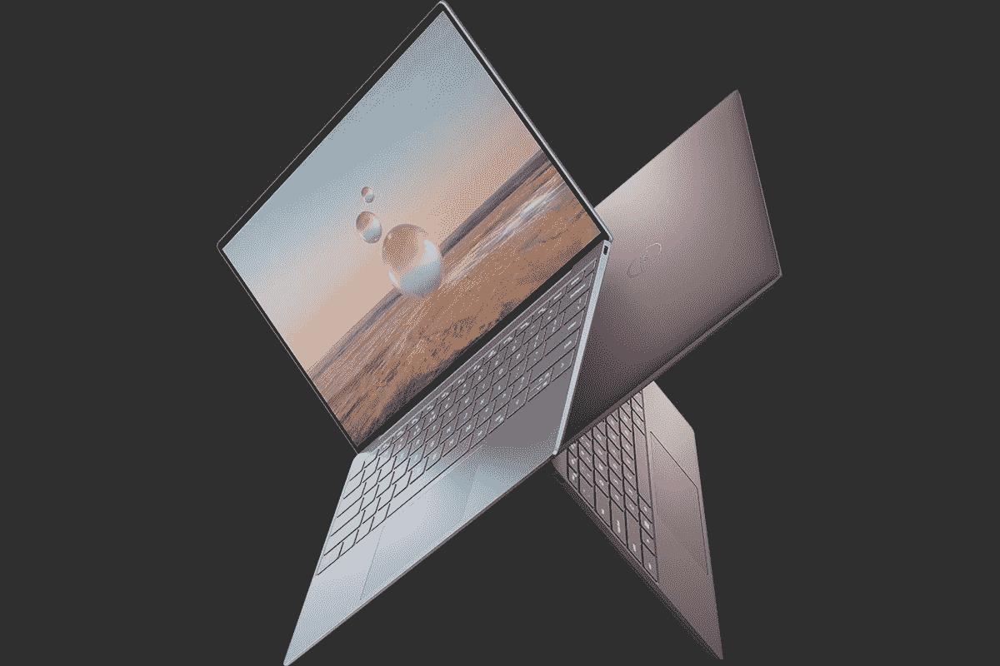

# 戴尔 XPS 13 (2022) vs MacBook Pro 13 (2022):你该买哪个？

> 原文：<https://www.xda-developers.com/dell-xps-13-2022-vs-macbook-pro-13-2022/>

戴尔和苹果最近推出了一些 2022 年的新笔记本电脑，对戴尔 XPS 13 进行了重大更新，对 T2 MacBook Pro 13 英寸进行了微小更新。这是你每年可以买到的[最好的笔记本电脑](https://www.xda-developers.com/best-laptops/)中的两款，即使苹果没有对其笔记本电脑做出大量改变，也有充分的理由让你更喜欢这两款中的任何一款。

在本文中，我们将比较 2022 款戴尔 XPS 13 和 MacBook Pro 13，看看哪一款适合您。它们都是顶级笔记本电脑，但在规格和软件方面也有很大不同。让我们仔细看看这些笔记本电脑的独特之处，以及您为什么想要其中一款。

**浏览本文:**

## 戴尔 XPS 13 (2022 年)与 MacBook Pro 13 (2022 年):规格

|  | 

戴尔 XPS 13 (2022)

 | 

MacBook Pro 13 英寸(2022)

 |
| --- | --- | --- |
| **操作系统** | 

*   Windows 11
*   Ubuntu 20.04

 | 

*   macOS Monterey(可升级到 macOS Ventura)

 |
| **CPU** | 

*   第 12 代英特尔酷睿 i5-1230U (12W，10 核，12 线程，最高 4.4 GHz，12MB 高速缓存)
*   第 12 代英特尔酷睿 i7-1250U (12W、10 核、12 线程、最高 4.7 GHz、12MB 高速缓存)

 | 

*   苹果 M2 8 核 CPU (4 个高性能核心，4 个高效核心)

 |
| **图形** | 

*   英特尔 Iris Xe 显卡(最高 96 个欧洲单位)

 |  |
| **显示** | 

*   13.4 英寸 FHD+ (1920 x 1200) InfinityEdge 非触摸，500 尼特，防反光
*   13.4 英寸 FHD+(1920 x 1200)infinity edge touch，500 尼特，防反光
*   13.4 英寸 UHD+(3840 x 2400)infinity edge touch，500 尼特，防反光

 | 

*   13.3 英寸液态视网膜(IPS)，2560 x 1600，500 尼特，P3 宽色彩，真实色调

 |
| **存储** | 

*   256GB PCIe 4 固态硬盘
*   512GB PCIe 4 固态硬盘
*   1TB PCIe 4 固态硬盘

 | 

*   256GB 固态硬盘
*   512GB 固态硬盘
*   1TB 固态硬盘
*   2TB 固态硬盘

 |
| **闸板** | 

*   8GB 双通道 DDR5 5200MHz
*   16GB 双通道 DDR5 5200MHz
*   32GB 双通道 DDR5 5200MHz

 | 

*   8GB 统一内存
*   16GB 统一内存
*   24GB 统一内存
*   内存带宽高达 100 GB/秒

 |
| **电池** |  |  |
| **端口** | 

*   2 个 Thunderbolt 4(USB C 类)端口
    *   含 USB 型至 A 型适配器
    *   USB Type-C 至 3.5 毫米适配器可选

 | 

*   2 个 Thunderbolt 4(USB C 类)端口
*   3.5 毫米耳机插孔

 |
| **音频** | 

*   双立体声扬声器(4W 总输出)
*   双阵列麦克风

 | 

*   立体声扬声器，支持杜比全景声的空间声音
*   三麦克风阵列

 |
| **摄像机** |  | 

*   720p FaceTime 高清摄像头，配有高级图像信号处理器

 |
| **生物认证** | 

*   指纹读取器
*   红外照相机

 |  |
| **连通性** | 

*   英特尔 Wi-Fi 6E 1675 AX211 (2x2)
*   蓝牙 5.2

 |  |
| **Colorar.dsff** |  |  |
| **尺寸(WxDxH)** | 

*   11.63 × 7.85 × 0.55 英寸(295.4 × 199.4 × 13.99 毫米)

 | 

*   11.97 x 8.36 x 0.61 英寸(304.1 x 212.4 x 15.6 毫米)

 |
| **尺寸** | 

*   起始重量为 2.59 磅(1.17 千克)

 |  |
| **价格** | 起价 999 美元 | 起价 1299 美元 |

## 操作系统:Windows 或 macOS

这是一个非常明显的区别，但我们不能不提它。显然，这两款机器运行的是不同的操作系统，戴尔 XPS 13 运行的是 Windows 11，MacBook Pro 13 英寸配备的是 macOS Monterey。如果你要买一台笔记本电脑，很有可能你已经熟悉了这两个操作系统中的任何一个，如果是的话，你可能已经知道该买什么了。大多数人可能会坚持更熟悉的东西。

但是除了熟悉之外，还有更好的理由来选择这两种操作系统。Windows 11 的优势在于它是世界上最受欢迎的桌面操作系统(嗯，Windows 作为一个整体是这样的)。这意味着你可以从开发者那里获得数十年的支持，而且你想要的绝大多数 PC 应用程序都可以在 Windows 上使用，其中许多是 Windows 独有的。 [Windows 11](https://www.xda-developers.com/windows-11/) 还有一个好处就是拥有更加一致和简化的界面，同时保留了一些用户喜欢摆弄的高级配置选项。随着 [Windows 11 版本 22H2](https://www.xda-developers.com/windows-11-22h2/) 的更新，更多的 UI 改进也将到来。

另一方面，macOS 是一个在内容创作者和创意专业人士中非常知名的操作系统。这在很大程度上要归功于苹果开发的视频编辑工具 Final Cut Pro，它通常被认为是市场上最好的。由于它吸引了创意专业人士，许多其他创意应用程序，如 Adobe 的 Creative Cloud，都支持 macOS，有时在 MAC OS 上比在 Windows 上运行得更好。macOS 有时也被认为对初学者更友好，所以它可能是第一台笔记本电脑的好选择。而且，就像 Windows 11 一样，macOS 每年都会免费获得更新，比如即将发布的 [macOS Ventura](https://www.xda-developers.com/macos-ventura/) 。

## 性能:苹果 M2 芯片速度快，效率高

从性能开始，两款笔记本电脑自然都比上一代产品有所升级，但最终，MacBook Pro 脱颖而出。苹果 M2 芯片是对上一代产品的重大升级，CPU 性能比 M1 快 18%。

自然，戴尔 XPS 13 配备了第 12 代英特尔处理器，这也是对第 11 代机型的升级，但戴尔也从英特尔的 U9 系列从 15W 处理器切换到 12W 处理器。这意味着处理器功耗更低，但性能也不如 15W 处理器。苹果 M1 已经击败了英特尔的第 11 代处理器，这也适用于苹果 M2 对抗第 12 代处理器。

根据苹果的测试，苹果 M2 可以提供几乎两倍于英特尔酷睿 i7-1255U 的性能，同时使用相同的 15W 功率，正如你在上面看到的。但这是与英特尔的 15W 处理器相比，戴尔使用的是更弱的 12W CPUs。这意味着苹果的优势可能更大。即使英特尔处理器速度更快，耗电量更大，苹果 M2 仍然更快。

苹果 M2 在集成显卡方面有更大的优势。这是对苹果 M1 的一次重大升级，而英特尔几乎没有改变其处理器中集成的 GPU。因此，在使用相同电量的情况下，苹果 M2 的 GPU 比英特尔 Iris Xe 显卡快 2.3 倍，即使英特尔 GPU 使用更多的电量，苹果仍然遥遥领先。同样，这是与 15W 英特尔处理器相比而言的。英特尔的 U9 系列通常具有明显较慢的显卡，因此戴尔 XPS 13 可能会更加落后。

这还包括英特尔酷睿 i7 处理器。戴尔 XPS 13 从较弱的 Core i5 开始，虽然这种方式明显更便宜，但速度也会更慢。

苹果宣称 MacBook Pro 的电池续航时间高达 20 小时。

这不仅仅是原始的性能。从这两张图中可以明显看出，虽然苹果 M2 速度更快，但耗电量也更低，这意味着它消耗电池的速度要慢得多。事实上，苹果宣称 MacBook Pro 的电池续航时间高达 20 小时，而戴尔承诺在全高清+显示配置下，酷睿 i5 处理器的电池续航时间高达 12 小时，酷睿 i7 处理器的电池续航时间高达 11 小时。

除此之外，戴尔在内存方面确实有优势，提供高达 32GB 的 LPDDR5 内存，而 MacBook Pro 上只有 24GB 的统一内存。然而，值得注意的是，苹果的统一内存可能更快，因为它内置于处理器本身，加上 CPU 和 GPU 可以随时平等地访问内存。最后，在存储方面，苹果给你提供了高达 2TB 的选项，而戴尔最高为 1TB，所以这是 MacBook Pro 的另一个胜利。然而，MacBook Pro 上的 RAM 和存储升级非常昂贵，所以如果你想要顶级型号，就有点难推荐了。

## 显示器和声音:戴尔 XPS 13 升级到 4K+

转到显示器，哪一个更好取决于你愿意花多少钱。Dell XPS 13 (2022)配备了 13.4 英寸显示屏，在其基本配置中，这是一个无触摸支持的全高清+ (1920 x 1200)面板。您可以在显示屏上添加触摸功能，或者升级到 4K+ (3840 x 2400)面板，默认情况下该面板包含触摸功能。这是这种尺寸的笔记本电脑上最好的显示器之一，尽管它还没有上市。

另一方面，MacBook Pro 有一个单一的配置，那就是 13.3 英寸的面板，分辨率为 Quad HD+ (2560 x 1600)。这使得两个显示器在尺寸和长宽比上几乎相同。在基本配置中，MacBook Pro 是一个更好的选择，但如果你花额外的钱，你可以从戴尔 XPS 13 获得更好的显示效果。公平地说，Dell XPS 13 的起价确实低得多，因此升级更有保证。然而，同样值得注意的是，在这种尺寸的显示器上，Quad HD+和 4K+之间的清晰度差异不会那么显著，而且它对电池寿命有很大的影响。

在显示器上方，这两款笔记本电脑仍在使用 720p 摄像头，它们是 2022 年仍在使用这种摄像头的极少数高端笔记本电脑之一。大多数其他人已经转向 1080p 传感器。苹果的网络摄像头有着更好的记录，苹果 M2 芯片内置的高级 ISP 可能有助于 MacBook Pro 获得更好的图像质量。然而，戴尔 XPS 13 配备了 Windows Hello 面部识别，这是一大优势。苹果只提供触控 ID 进行生物认证，XPS 13 也有指纹识别器，所以戴尔在这方面领先。

最后，在声音方面，两款笔记本电脑都有一对立体声扬声器，它们应该能够提供足够坚实的音频体验，尽管它们都不可能让你大吃一惊。不过，戴尔和苹果都倾向于在较大的笔记本电脑上配备出色的扬声器，所以这些扬声器应该还是相当不错的。

## 设计:戴尔 XPS 13 更小更轻

设计是 Dell XPS 13 可能更好的另一个领域，尽管这无疑是一个非常主观的话题。不过，戴尔 XPS 13 实际上更小更轻。它在每个维度上都更小，包括厚度，为 13.99 毫米，而 MacBook Pro 为 15.6 毫米。起始重量为 2.59 磅，也比苹果笔记本电脑的 3 磅重量轻得多。

至于它更主观的一面，戴尔 XPS 13 更有趣，因为它有相对独特的颜色。你可以在天空(浅蓝色)和棕色(深红色)之间选择。这也与以前的模式大相径庭。

与此同时，MacBook Pro 13 英寸坚持使用久经考验的银色和太空灰选项。如果你是经典 MacBook 外观的粉丝，这可能对你有用，但它也变得相当无聊，因为最近几乎每台笔记本电脑都是银色的，特别是在高端市场。

键盘也值得一提，特别是因为 MacBook Pro 13 英寸仍然有一个触摸栏，而不是物理功能行。取决于你是否是它的粉丝，这可能会让你倾向于一台笔记本电脑或另一台。苹果基本上已经远离了 Touch Bar，所以看起来它可能没有太多的粉丝。

## 端口:两款笔记本电脑都有限量供应

最后，来到港口，这些笔记本电脑都不是特别令人印象深刻。戴尔 XPS 13 配有两个 Thunderbolt 4 端口，而 MacBook Pro 也有两个 Thunderbolt 端口，外加一个耳机插孔。它实际上比戴尔的笔记本电脑内置了更多的端口，但戴尔在包装盒中提供了一个 USB Type-C 到 Type-A 适配器和一个 Type-C 到 3.5 毫米插孔适配器。

戴尔 XPS 13 支持整套 Thunderbolt 功能。

然而，这里的核心区别在于这些 Thunderbolt 端口的能力。苹果的 M2 芯片有一些很大的局限性:首先，它只能支持一个超过 Thunderbolt 的显示器(尽管 DisplayLink docks 可以支持更多)；另外，它不能支持外部 GPU。

戴尔 XPS 13 支持整套 Thunderbolt 功能，因此这些都不是问题。您可以连接多个显示器，如果您想玩游戏，还可以使用外部 GPU 将 XPS 13 变成游戏装备。当然，凭借其 12W 处理器，它永远不会成为台式机的替代品，但通过这种方式调整一些设置，它可能可以处理大多数现代游戏。

## 戴尔 XPS 13 (2022 年)与 MacBook Pro 13 (2022 年):最终想法

看完所有这些，你应该买哪台笔记本电脑呢？嗯，这真的取决于你的个人喜好，但两者都有明显的优势。我们会说 MacBook Pro 可能更有吸引力，但它的起价确实高得多，而且苹果让 RAM 和存储等升级选项非常昂贵。

由于非常高效的苹果 M2 处理器，MacBook Pro 13 可以提供更高的性能，同时还具有更长的电池寿命。统一内存也有助于提高性能。在显示器方面，MacBook Air 也在清晰度和效率之间取得了很好的平衡，而戴尔则迫使你在较低的显示器和分辨率高于必要水平且耗电量大的显示器之间进行选择。

但如果你想最大限度地利用存储空间和内存，苹果会为这些升级额外收取 1200 美元，而戴尔 XPS 13 的价格要低得多。戴尔 XPS 13 的 4K+型号尚未上市，但在所有其他规格都达到极限的情况下，它的价格为 1599 美元，而 MacBook Pro 的价格高达 2499 美元。这是一个巨大的差异。

此外，戴尔 XPS 13 的性能仍然非常好，而且它实际上有一些优势，如更大的 RAM、更紧凑的漂亮设计和更强大的端口，因为它支持整套 Thunderbolt 功能。

如果你打算购买入门级配置，MacBook Pro 可能更值得，但如果你想升级一些组件，戴尔 XPS 13 的价格更合理，可能更容易推荐。不过，归根结底，这两款都是很棒的笔记本电脑，如果你想要其中一款，你可以在下面购买。否则，如果你想看看这些品牌的其他选择，你可以看看[最佳 MAC 电脑](https://www.xda-developers.com/best-macs/)或[最佳戴尔笔记本电脑](https://www.xda-developers.com/best-dell-laptops/)。

 <picture></picture> 

Dell XPS 13 9315

##### 戴尔 XPS 13 9315

全新的戴尔 XPS 13 进行了彻底的重新设计，有天空色和棕色可选。它也是有史以来最薄最轻的 XPS 笔记本电脑。

 <picture></picture> 

MacBook Pro (2022)

##### 苹果 MacBook Pro 13 英寸(2022)

2022 款 MacBook Pro 配备了新的苹果 M2 处理器，性能甚至超过了 M1 型号。