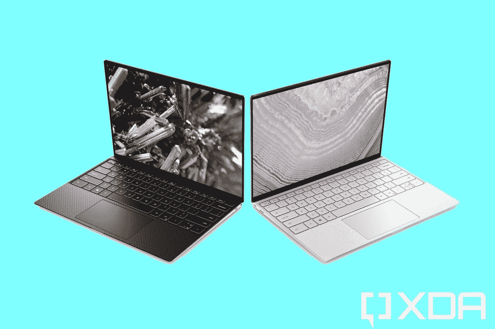

# 戴尔 XPS 13 9310 评测:有机发光二极管让这款笔记本电脑更加甜美

> 原文：<https://www.xda-developers.com/dell-xps-13-9310-review/>

众所周知，戴尔 XPS 13 是

[best laptops](https://www.xda-developers.com/best-laptops/)

在附近，对吗？哦太好了。感谢大家的阅读！

开玩笑的。当谈到 XPS 13 时，有太多的东西可以谈论，让我惊讶的是，该产品系列如何随着每一代的发展而不断变得更好。我记得 XPS 13 是一台小型楔形 PC，配有银色铝制机箱和碳纤维编织键盘。然后戴尔增加了更多的颜色，最后将网络摄像头移到了屏幕上方，就在去年，它重新设计了旗舰产品 13 英寸笔记本电脑。

重新设计的型号是戴尔 XPS 13 9300，而新的 XPS 13 93 *10* 几乎只是一个规格提升。它包括英特尔老虎湖处理器、[雷电 4](https://www.xda-developers.com/best-thunderbolt-4-laptops/) 、更快的内存和 Iris Xe 显卡。另一个重大变化是，它配备了有机发光二极管显示器，在我们的评论单元。鉴于显示器转向了更大的 16:10 宽高比，供应商花了更长时间来选择有机发光二极管。

## 戴尔 XPS 13 9310:规格

| 

中央处理器

 | 第 11 代英特尔酷睿 i7-1185G7 处理器(12MB 高速缓存，最高 4.8GHz，4 核) |
| 

制图法

 | 虹膜 Xe，96EU |
| 

身体

 | 

*   295.7 x 198.7 x 14.8 毫米(11.64 x 7.82 x 0.58 英寸)
*   1.27 千克(2.8 磅)

 |
| 

显示

 | 

*   13.4 英寸 3.5K (3456 x 2160) InfinityEdge 有机发光二极管触摸显示屏，
*   DisplayHDR 500，400 尼特，
*   100% DCI-P3 色域，100，000:1 对比度，0.65%防反射、防污迹

 |
| 

记忆

 | 16GB LPDDR4x 双通道 SDRAM，4267MHz |
| 

储存；储备

 | 512GB PCIe 3 x4 固态硬盘 |
| 

电池

 | 52 瓦时电池(集成)，45 瓦交流适配器 |
| 

港口

 | 

*   (2)霹雳 4
*   (1) microSD 读卡器
*   1 个 3.5 毫米音频插孔

 |
| 

声音的

 | 

*   使用 Waves MaxxAudio Pro 专业调谐的立体声扬声器
*   立体声扬声器 2.5W x 2 = 4W 峰值
*   3.5 毫米耳机/麦克风组合插孔，带
*   360 度 Waves NX 3D 虚拟环绕，通过耳机进行头部跟踪
*   Waves MaxxVoice Pro 支持 VoIP 的双麦克风阵列–支持 Cortana 远场

 |
| 

网络摄像头

 | 宽屏高清(720 p)2.25 毫米网络摄像头 |
| 

投入

 | 

*   触摸显示屏(可选)
*   2 个数字阵列麦克风
*   全尺寸背光 chiclet 键盘；1.0 毫米行程
*   玻璃表面精密触摸板
*   电源按钮中的 Windows Hello 指纹识别器和上边框中的高清(720p) Windows Hello 摄像头
*   用于显示器背光控制的环境光传感器

 |
| 

建筑

 | 

*   CNC 加工的磨砂铝，带北极白色编织玻璃纤维掌托(防紫外线和防污涂层)
*   触控面板上的窄边框康宁大猩猩玻璃 6

 |
| 

操作系统（Operating System）

 | Windows 10 主页 |
| 

价格

 | $1,899.99 |

与往常一样，Dell XPS 13 由整块 CNC 加工的铝制成。是的，机箱甚至比几年前的更小，戴尔曾声称 XPS 13 是 11 英寸机箱中的 13 英寸笔记本电脑。

戴尔没有改变它的信息，但这种说法不像以前那么真实了。当第一代 XPS 13 推出 InfinityEdge 显示屏时，没有其他公司像戴尔一样做窄边框。如今窄边框可能更常见了，但大多数边框仍然没有 XPS 13 上的窄。

它仍然有戴尔 XPS 系列闻名的灰银色，但该公司发给我的型号是霜白色，带有白色玻璃纤维编织掌托。这是更漂亮的颜色选项，我想戴尔知道这一点。我真的不确定为什么经典色还是默认；例如，它仍然是 XPS 17 唯一的颜色。

这款 XPS 13 9310 型号重 2.8 磅，对于铝制笔记本电脑来说相当轻。如果你选择没有触摸屏的 XPS 13 9310 型号，那么它的重量只有 2.64 磅；这实际上是铝制笔记本电脑中最轻的了。当然，更轻的笔记本电脑是存在的，但你必须考虑更轻的材料，如碳纤维或镁。XPS 13 9310 相当薄，为 14.8mm，实际上比之前的设计更厚，但它没有那种楔形。

XPS 13 9310 对于铝制笔记本电脑来说相当轻。

不过，让我们来谈谈端口，因为这实际上非常重要。戴尔实际上在重新设计时取消了一个 USB 端口，但它不是 USB A 型端口。旧型号甚至没有 USB 型端口，这是不会回来了。

现在，戴尔 XPS 13 9310 只有两个 Thunderbolt 4 端口、一个 microSD 卡插槽和一个 3.5 毫米音频插孔。戴尔 XPS 13 9300 有两个雷电 3 端口，但戴尔一直使用最低雷电 3 规格。这意味着他们没有使用所有四条通道并获得 40Gbps，而是获得了 20Gbps 的速度。他们还在一个端口上只支持一台 4K 显示器，而不是两台。

Thunderbolt 4 将所有四个通道设置为最低规格。这意味着现在，您可以将两台 4K 显示器连接到一个端口。这一点很重要，尤其是因为很多人都在家工作，你可能需要多显示器设置，同时仍然保留一个端口用于扩展坞或其他设备。

凭借戴尔 XPS 13 9310，Thunderbolt 4 在很大程度上是一种升级。

这在雷电 3 是可能的，所以当我们谈论 Thunderbolt 4 是否是从[雷电 3](https://www.xda-developers.com/best-thunderbolt-3-laptops/) 升级而来时，这在很大程度上取决于我们正在谈论的设备。有了 Dell XPS 13 9310，这在很大程度上是一种升级。

## 显示屏和音频:Dell XPS 13 拥有性感的有机发光二极管显示屏

Dell XPS 13 9310 拥有 13.4 英寸的屏幕，长宽比为 16:10，比之前设计的 16:9 屏幕更高。显示器是按对角线测量的，因此虽然听起来大小相似，但表面面积要大得多，高得多，也没有那么宽。

Dell XPS 13 9310 有四种屏幕配置可供选择，其中两种是全高清+分辨率，两种是超高清+分辨率。FHD+要么是触摸的，要么是非触摸的；奇怪的是，对于翻盖手机来说，这是唯一的非触摸显示选项。UHD+选项有 3，456x2，160 有机发光二极管或 3，840x2，400 IPS 液晶屏，戴尔承诺有机发光二极管机型的 DCI-P3 色域为 100%，其他机型为 90%。这也是为了 100，000:1 的对比度而不是 1，500:1，以及 400 尼特的亮度而不是 500 尼特。

戴尔发给我 XPS 13 9310 的有机发光二极管型号。在我的测试中，它支持 100%的 sRGB、93%的 NTSC、95%的 Adobe RGB 和 100%的 P3。使用有机发光二极管屏幕，像素被关闭，所以你得到真正的黑色。颜色也更鲜艳，因为它们不在大背光的顶部。换句话说，就是更漂亮而已。

和往常一样，XPS 13 9310 的边框很小，这适用于所有侧面。与之前的设计，即。以前屏幕下面有摄像头的那个，下巴比较多。事实上，如果戴尔今天想要屏幕下的网络摄像头，它甚至无法做到这一点。

要在那里安装一个好的网络摄像头，你必须挑战一些物理原理。

遗憾的是，新 XPS 13 9310 的网络摄像头并不出色，而且可能永远也不会出色。它非常小，将它安装在顶部边框和红外相机旁边是一项工程壮举，但质量受到影响。它仍然是 720p 分辨率，但公平地说，你可能会购买这部机器，至少部分是因为那些窄边框。要在那里安装一个好的网络摄像头，你必须挑战一些物理原理。

音频方面，Dell XPS 13 9310 配备了双 2.5W 扬声器，使用 Waves MaxxAudio Pro 进行调谐。它们听起来真的很棒。他们变得很好，很大声，所以如果你是流媒体内容，你会完全享受它在这台笔记本电脑上。

双 2.5W 扬声器听起来真的很棒。

戴尔有一个名为戴尔影院的功能，它由三部分组成:CinemaColor、CinemaSound 和 CinemaStream。CinemaColor 是关于显示器的，支持杜比视觉 HDR，让您设置电影、体育、低蓝光等配置。CinemaSound 是由 Waves MaxxAudio 调谐的强大音频，CinemaStream 为您的流媒体内容优先考虑您的网络流量。

顾名思义，戴尔影院旨在为您提供出色的娱乐体验。几乎每个原始设备制造商都意识到，如果你买一台笔记本电脑，它可能是个人和工作使用，所以玩和工作一样重要。

## 键盘和触摸板:几乎是意料之中的事情

Dell XPS 13 9310 上的键盘具有 1 毫米的按键行程。这个行业肯定是倾向于更浅的键盘，所以这是很正常的。键盘舒适而准确，尽管它是一个好键盘，但惠普和联想正在做一些非常棒的事情。

Dell XPS 13 9310 的键盘采用了戴尔的标准 XPS 键盘，我的意思是它使用了您可能已经习惯的开关。相比之下，XPS 13 2 合 1 则没有。敞篷车使用戴尔的第二代 MagLev 键盘，该键盘的按键较浅，但使用磁铁来创建您习惯的力曲线。

键盘内置了电源按钮，它还可以充当指纹传感器。这样，您可以选择 Windows Hello 机制，面部识别或指纹扫描，这使这款笔记本电脑成为 Windows Hello 支持的好选择。然而，虽然传感器内置在电源按钮中，但在启动后，你仍然需要触摸它*。在每台装有 Windows Hello 指纹扫描仪的笔记本电脑上，当你第一次按下手指时，它会扫描你的手指，这样它就可以自动让你登录。戴尔认为这是一个安全风险，因为它认为在您按下按钮和 XPS 13 启动之间，您可能会离开 PC。*

戴尔真的需要你按下按钮就开始扫描指纹；其他人都超越了这一点。

新款 XPS 13 配有微软 Precision 触摸板，因此支持您习惯的所有手势。戴尔也在向更大的触摸板转移，这很好，因为过去只有苹果在做这件事。

还有一点我想指出的是，我真的很喜欢玻璃纤维编织掌托。它有一种质感，不像碳纤维编织掌托更传统。我绝对认为这是戴尔 XPS 13 更时尚的外观。XPS 15 上也提供了该功能，这是全新的。

玻璃纤维编织掌托为戴尔 XPS 13 增添了更时尚的外观

## 性能和电池续航时间:Dell XPS 13 可以处理全高清游戏，尽管所有 Tiger Lake PCs 都是如此

戴尔发给我的这款 XPS 13 9310 包括英特尔酷睿 i7-1185G7、16GB 内存和 512GB 固态硬盘。我之前确实评测过一个，它有一个酷睿 i7-1165G7、16GB 内存、512GB 固态硬盘和 FHD+显示屏。有机发光二极管屏幕实际上对我来说是新的。

新的 Core i7 CPU 与旧的并没有太大的不同。坦率地说，它们都很棒，但你可以从酷睿 i7-1185G7 获得更高的时钟速度。它来自第 11 代“老虎湖”系列，也带有 Iris Xe 图形。事实上，新的集成显卡比新的 CPU 更重要。

我的 XPS 13 9310 单元中的 Iris Xe 图形有 96 个执行单元，但如果您获得 Core i5 型号，则有 80 个执行单元。这比你在这台机器的前身第十代“冰湖”处理器上发现的要多得多。这无疑为您使用这种外形规格的机器做些什么打开了大门。

这是一个很大的例子——FHD 博彩。英特尔承诺，当他们推出这一系列的芯片，他们提供了。如果您想在戴尔 XPS 13 上玩一些 *Forza Horizon 4* ，现在您完全可以做到这一点。你需要一个外部 GPU 来达到 Ultra 设置，但如果你对 1080p 游戏没问题，你可以毫无问题地玩你想玩的游戏。照片和视频编辑功能也比以前更加强大；我仍然不建议编辑 4K 60fps 的视频，但在 Adobe Premiere Pro 中编辑 4K 30fps 的视频轻而易举。

新款 Dell XPS 13 的电池续航时间不会让您大吃一惊。如果你想要更长的电池寿命，你应该买 FHD 型号的。去 4K 你将不得不做出牺牲，而去更明亮、更有活力的有机发光二极管屏幕你将做出更大的牺牲。记住这一点。你现在看到的是大约五六个小时的实际工作，考虑到规格，这已经很不错了。

如果你想在戴尔 XPS 13 上玩一些 *Forza Horizon 4* ，你现在完全可以做到这一点。

对于基准测试，我使用了 PCMark 8、PCMark 10、3DMark、Geekbench 和 Cinebench。以下所有系统都有 16GB 内存。

|  | 

有机发光二极管 UHD 戴尔 XPS 13 9310 酷睿 i7-1185G7

 | 

FHD 戴尔 XPS 13 9310 酷睿 i7-1165G7

 | 

戴尔 XPS 13 9300 酷睿 i7-1065G7，FHD

 | 

[联想 ThinkPad X1 Carbon Gen 9](https://www.xda-developers.com/lenovo-thinkpad-x1-carbon-review/) 酷睿 i7-1185G7，FHD

 |
| --- | --- | --- | --- | --- |
| 

PCMark 8:主页

 | 3,928 | 3,902 | 3,899 | 4,532 |
| 

PCMark 8:创意

 | 4,692 | 4,781 | 4,253 | 4,910 |
| 

PCMark 8:工作

 | 3,508 | 4,020 | 3,797 | 4,144 |
| 

PCMark 10

 | 4,969 | 4,864 | 4,402 | 5,168 |
| 

极客工作台

 | 1,336 / 4,882 | 1,551 / 5,829 |  | 1,489 / 5,280 |
| 

电影院长凳

 | 1,243 / 3,720 |  |  | 1,303 / 4,224 |

需要注意的一个关键点是 Dell XPS 13 9310 和 Dell XPS 13 9300 之间的差异，尤其是在 PCMark 8: Creative 和 PCMark 10 测试中。他们更多地使用图形能力，因此您可以真正看到 Iris Xe 的不同之处。

## 结论:您应该购买新的戴尔 XPS 13 吗？

对于是否应该购买全新的戴尔 XPS 13，答案几乎总是肯定的。这是市场上最好的笔记本电脑之一，戴尔在这方面没有犯任何错误。相反的一个很好的例子是联想。虽然我是联想笔记本电脑的粉丝，但 Yoga 9i 的触觉触摸板一点也不好，这是一款旗舰产品。

有了戴尔 XPS 13 系列，笔记本电脑变得越来越好；事实上，每个型号都是戴尔最好的笔记本电脑。它始于在 CES 2020 上宣布的重新设计，增加了 16:10 显示屏。当年晚些时候的英特尔老虎湖更新增加了许多动力，现在，有机发光二极管模式已经到来。

我不能说这台笔记本电脑有什么不好。网络摄像头肯定是不合格的，但考虑到空间有限，这是意料之中的。令我感到沮丧的是，戴尔的消费者笔记本电脑不提供蜂窝连接。最后，这家公司真的需要在你按下按钮时开始扫描指纹；其他人都超越了这一点。

显然，这些事情都不是交易破坏者，但不仅仅如此；买了这台电脑后，你就不会再考虑那件事了。这是一台装在微型机箱中的 13 英寸笔记本电脑。它超级便携，很轻，有漂亮的显示屏，还有一吨的功率。我唯一不能推荐给我会推荐 XPS 15 或 XPS 17 的人，也就是需要 45W 处理器和专用显卡的人。

 <picture></picture> 

Dell XPS 13

##### 戴尔 XPS 13 9310

戴尔的 XPS 13 是该系列的旗舰产品，超薄边框和小尺寸是其标志性特征。