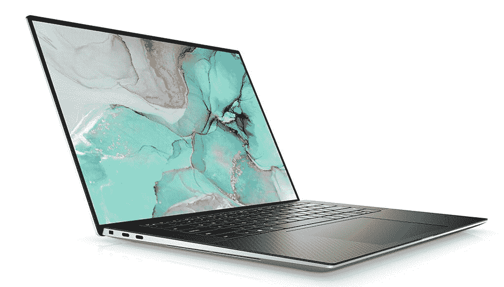
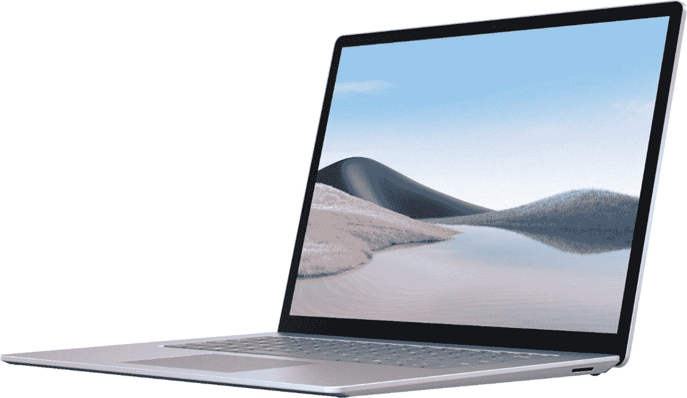

# 戴尔 XPS 15 vs Surface Laptop 4 15 寸:你该买哪个？

> 原文：<https://www.xda-developers.com/dell-xps-15-vs-surface-laptop-4-15/>

每个人在选择新笔记本电脑时都有不同的标准，即使是最好的笔记本电脑也不尽相同。有些人需要更多的电力来处理游戏等密集型任务，而其他人则需要可以每天带到学校或办公室的东西。但对许多人来说，一个主要的决定因素是屏幕尺寸。虽然有些人可能对 13 英寸的显示器感到满意，但其他人(比如我自己)更喜欢更大的笔记本电脑。如果您正在寻找一台 15 英寸的笔记本电脑，您现在可以找到的两个最佳选择是戴尔 XPS 15 和 Surface Laptop 4。

除了屏幕尺寸之外，这是两款非常不同的笔记本电脑。第一款专注于为视频编辑等任务提供更强大的功能，而另一款则更像是一款可以随身携带的日常笔记本电脑。就在这里，这可能会为您做出选择，但我们将进一步了解这两款笔记本电脑，以帮助您决定购买哪一款。

## 戴尔 XPS 15 与 Surface Laptop 4:规格

首先，让我们来看看戴尔 XPS 15 和 Surface Laptop 4 15 内部的规格概要。我们关注的是 15 英寸的 Surface Laptop 4，而不是 13.5 英寸的。

|  | 

戴尔 XPS 15

 | 

Surface Laptop 4 15 英寸

 |
| --- | --- | --- |
| **处理器** | 

*   英特尔酷睿 i5-11400H(最高 4.5GHz，6 核)
*   英特尔酷睿 i7-11800H(最高 4.8GHz，8 核)
*   英特尔酷睿 i9-11900H(最高 4.9GHz，8 核)

 | 

*   英特尔酷睿 i7-1185G7(最高 4.9GHz，四核)
*   AMD 锐龙 7 4980U 微软 Surface Edition(最高 4.4GHz，8 核)

 |
| **图形** | 

*   英特尔 UHD 显卡
*   NVIDIA GeForce RTX 3050 4GB gddr 6(45W)
*   NVIDIA GeForce RTX 3050 Ti 4GB gddr 6(45W)

 | 

*   英特尔 Iris Xe 显卡
*   AMD 镭龙显卡

 |
| **撞锤** |  |  |
| **存储** |  |  |
| **显示** | 

*   15.6 英寸，全高清+ (1920 x 1200)，InfinityEdge，防眩光，非触摸，500 尼特
*   15.6 英寸，3.5K (3456 x 2160)有机发光二极管，独立边缘，防眩光，触摸，400 尼特，100% DCI-P3
*   15.6 英寸，超高清+ (3840 x 2400)，InfinityEdge，防眩光，触摸屏，100% Adobe RGB，94% DCI-P3，500 尼特

 | 

*   15 英寸 PixelSense (2496 x 1664)，触摸屏

 |
| **音频** | 

*   四声道立体声扬声器(两个 2.5 瓦低音扬声器，两个 1.5 瓦高音扬声器)

 | 

*   配有杜比全景声的 Omnisonic 立体声扬声器

 |
| **网络摄像头** | 

*   2.25 毫米 720p 高清 30fps 摄像头

 |  |
| **生物认证** | 

*   Windows Hello 红外摄像机
*   指纹读取器

 |  |
| **电池** | 

*   3 芯 56 瓦时电池
*   6 芯 86 瓦时电池
    *   全高清+显示屏续航时间长达 13 小时 20 分钟
    *   有机发光二极管显示屏续航时间长达 9 小时 13 分钟
    *   超高清显示屏续航时间长达 8 小时 42 分钟

 | 

*   47.4 瓦时电池
    *   英特尔处理器:长达 16.5 小时的使用时间
    *   AMD 处理器:长达 17.5 小时的使用时间

 |
| **港口** | 

*   2 个 Thunderbolt 4(USB C 类)端口
*   一个 USB 3.2 第二代 C 类端口
*   SD 读卡器
*   3.5 毫米耳机插孔
*   包含 USB Type-C 至 Type-A 和 HDMI 2.0 适配器

 | 

*   1 个表面连接端口
*   1 个 USB Type-A (3.2 第 2 代/ 10Gbps)
*   1 个 USB Type-C (3.2 第 2 代/ 10Gbps)
*   3.5 毫米耳机插孔

 |
| **连通性** | 

*   黑仔 Wi-Fi 6 AX1650 (2x2)，蓝牙 5.1

 |  |
| **颜色** | 

*   铂金银外观+黑色内饰
*   霜冻外观+北极白内饰

 |  |
| **尺寸(WxDxH)** | 13.57 x 9.06 x 0.71 英寸(344.72 x 230.14 x 18 毫米) | 

*   13.4 x 9.6 x 0.58 英寸(339.5 x 244 x 14.7 毫米)

 |
| **重量** | 起始于:

*   3.99 磅(1.81 千克)(非触摸式 56 瓦时电池)
*   4.22 磅(1.91 千克)(非触摸式 86 瓦时电池)
*   4.31 磅(1.96 千克)(有机发光二极管，86 瓦时电池)
*   4.42 磅(2.01 千克)(UHD+86 瓦时电池)

 |  |
| **起始价格** | $1,299.99 | $1,299.99 |

## 性能:戴尔 XPS 15 处于不同的水平

很明显，戴尔 XPS 15 和 Surface Laptop 4 是完全不同的产品。首先是 CPU，戴尔 XPS 15 使用 45 瓦英特尔酷睿处理器，而 Surface Laptop 4 使用 15 瓦处理器。这些 CPU 有非常不同的性能水平，但也有不同的功耗水平，我们稍后会谈到。

但由于这些差异，很明显戴尔 XPS 15 的平均速度要快得多。让我们来看看一些基准测试分数，以了解其中的差异。

|  | 

英特尔酷睿 i7-1185G7(平均)

 | 

AMD 锐龙 7 4980U

 | 

英特尔酷睿 i5-11400H(平均)

 | 

英特尔酷睿 i7-11800H(平均)

 |
| --- | --- | --- | --- | --- |
| GeekBench(单核/多核) | 1,419 / 4,859 | 1,058 / 6,670 |  1,367 / 5,831 | 1,493 / 8,082 |

这还不包括戴尔 XPS 15 中的英特尔酷睿 i9-11900H，但您已经可以看到性能上的巨大差异，特别是在比较更高端的型号(酷睿 i7 和锐龙 7)时。

当你考虑到 Surface Laptop 4 只配有集成显卡时，无论是英特尔还是 AMD，性能差异都会变得更大。戴尔 XPS 15 可以配置 NVIDIA GeForce RTX 显卡，最高可配 RTX 3050 Ti。这意味着您实际上可以在 Dell XPS 15 上玩顶级游戏，而只有非常简单或旧的游戏才能在 Surface Laptop 4 上运行良好。

 <picture></picture> 

Dell XPS 15

随着戴尔 XPS 15 提供高达 64GB 的 RAM 和 4TB 的存储，这一趋势继续发展，这使得最大 32GB RAM 和 1TB 存储的 Surface Laptop 4 望尘莫及。

（...)基于 AMD 的型号的 Surface Laptop 4 充电后可以持续 17.5 小时，英特尔型号的可以持续 16.5 小时(...)

不过，Surface Laptop 4 在电池续航时间方面扭转了局面。Surface Laptop 4 采用了低功耗处理器，没有专用显卡，这意味着基于 AMD 的型号充电一次可以持续 17.5 小时，英特尔型号可以持续 16.5 小时，所有电池都是 47.4 瓦时。相比之下，戴尔 XPS 17 承诺长达 13 小时 20 分钟，但这只是在你升级到英特尔酷睿 i7 型号(配备 86 瓦时电池)并坚持使用全高清+非触摸显示屏的情况下。如果你升级显示器，这一承诺低于 10 小时的使用。这使得 Surface Laptop 4 成为你上学或旅行时携带的理想选择。

## 显示器:您可以在戴尔 XPS 15 上获得有机发光二极管

戴尔 XPS 15 和 Surface Laptop 4 都可以为您提供出色的显示体验，但在戴尔 XPS 15 上，您需要支付额外的费用。基本配置包括一个 15.6 英寸全高清+ (1920 x 1200)液晶显示器，虽然这是完全可以接受的，但它并不惊人。

然而，你可以获得令人惊叹的 3.5K (3456 x 2160)有机发光二极管显示屏，或超高清+ (3840 x 2400)液晶显示屏。这些都是令人难以置信的清晰显示器，有机发光二极管尤其是笔记本电脑中罕见的。这也是一款 16:1 显示屏，更高的宽高比有助于提高工作效率。

 <picture></picture> 

Surface Laptop 4

另一方面，Surface Laptop 4 只有一个显示器选项，它是一个 15 英寸的显示器，分辨率为 2496 x 1660。这也是一个非常锐利的面板，对于这种尺寸的显示器来说可能已经足够好了。它肯定比戴尔 XPS 15 上的全高清+配置好，但当你考虑戴尔提供的升级时，XPS 15 看起来会好得多。不过，Surface Laptop 4 的显示效果很好，长宽比为 3:2，甚至更高。此外，默认情况下，您可以获得触摸支持，以及对 Surface Pen 的支持。

在显示器周围，戴尔 XPS 1 有非常小的边框，不幸的是，这意味着相机也非常小。这是一个 720p 的相机，大小只有 2.25 毫米，所以很难捕捉到大量的光线，图像质量也是臭名昭著的低于标准。Surface Laptop 4 上的摄像头也是 720p，但是质量还是好很多。这两款笔记本电脑都配备了 Windows Hello 面部识别功能。

至于音频，这两款笔记本电脑听起来都很棒，但 XPS 15 可能会更好。戴尔 XPS 15 有一个四扬声器设置，带有两个低音扬声器和两个高音扬声器，扬声器格栅位于键盘两侧。总功率为 8W，对于笔记本电脑来说，这是一个强大的身临其境的音响系统，尤其是这种尺寸的笔记本电脑。

Surface Laptop 4 采用了一种非常规的设置，扬声器从键盘下方朝上，键盘用作扬声器格栅。虽然这里只有两个扬声器，这就是为什么你不会得到相同水平的音频体验。

## 设计:Surface Laptop 4 更加便携

最后，我们看到了 Surface Laptop 4 无可争议的胜利——它是两者中最容易携带的。它没有戴尔 XPS 15 宽，也比它薄得多，尽管它也明显更高。但最大的区别是重量。Surface Laptop 4 的起始重量为 3.4 磅，而 XPS 15 的起始重量为 3.99 磅。这是假设您得到的 XPS 15 的基本型号具有更小的电池、非触摸全高清显示屏和英特尔酷睿 i5。Dell XPS 15 的重量可高达 4.42 磅，如果您整天将它放在背包中，这是一个非常明显的差异。

Surface Laptop 4 的起始重量为 3.4 磅，而 XPS 15 的起始重量为 3.99 磅。

尽管如此，戴尔 XPS 15 在端口方面也有优势。通过两个 Thunderbolt 4 端口、一个额外的 USB Type-C 端口和一个 SD 读卡器，您已经拥有了不错的连接能力，此外，您还可以在包装盒中获得一个 USB Type-C 到 Type-A 和 HDMI 适配器。Surface Laptop 4 有一个 USB Type-C 端口、一个 USB Type-A 端口和一个 Surface Connect 端口。

内置 USB Type-A 端口很有用，但戴尔仍然为您提供免费适配器的选项，您还可以获得像 HDMI 和 SD 读卡器这样的东西。有了 Surface Laptop 4，如果你想使用外接显示器，你必须出去单独购买一个集线器。虽然 Surface Connect 端口和 Thunderbolt 都提供了很好的可扩展性，但 Thunderbolt 是更多设备采用的标准，因此更容易找到使用它的设备。

另外，戴尔 XPS 15 还包括内置在电源按钮中的指纹传感器，如果你喜欢它胜过面部识别的话。Surface Laptop 4 并没有给你这样的选择。

最后，让我们谈谈外观，这两款笔记本电脑都给了你几个选择。戴尔 XPS 15 因其使用的材料而更加独特。其中一款配有由铝制成的铂金银外壳，以及黑色碳纤维内饰。另一个型号有一个“霜”铝外部和一个由编织玻璃纤维复合材料制成的“北极白”内部。戴尔 XPS 15 使用不同的材料来制作键盘，这是非常独特的，但其外观大多是两种不同的灰色。

Surface Laptop 4 有一个全铝底盘，但内部和外部的颜色选择更加明显。你可以选择铂金色(Surface 设备的标志性颜色)或哑光黑色。然而，这些仍然是非常中性和柔和的颜色选择，如果 13.5 英寸型号的砂岩和冰蓝色也可以在 15 英寸型号上使用，那就更好了。最终，哪台更好看取决于你，每台笔记本电脑都有其设计上的优势。

## 戴尔 XPS 15 与 Surface Laptop 4 的对比:底线

如果有一件事是通过这种分析显而易见的，那就是这些笔记本电脑是为不同类型的用户制造的，即使他们有相似的屏幕尺寸。Dell XPS 15 功能更强大，如果您的工作更稳定，它可能是您的不二之选。您可以使用 Dell XPS 15 处理从视频编辑和渲染到游戏的任何事情，它会处理得很好。此外，它还可以选择超清晰的有机发光二极管显示屏，这一点不容忽视。

它在紧凑的底盘中集成了大量的动力，但为了实现这一目标，它确实做出了一些牺牲。Dell XPS 15 的网络摄像头低于平均水平，而且明显更重，尤其是如果您想要更好的配置。最重要的是，电池寿命并不惊人，这要归功于内部耗电的硬件。

您可以使用 Dell XPS 15 处理从视频编辑和渲染到游戏的任何事情，它会处理得很好。

相反，Surface Laptop 4 没有那么强大，但它在便携性方面胜出。它不仅更轻更薄，而且即使使用更小的电池，充电时间也更长。微软声称 AMD 驱动的型号可以工作 17.5 小时，英特尔驱动的型号可以工作 16.5 小时。这意味着，如果您想经常随身携带笔记本电脑，您可以依靠它度过一天，而 XPS 15 则不然。对于大学生、办公室工作人员或临时用户来说，这里仍然有足够的性能来完成工作。

因此，这取决于你的个人需求来决定哪一个是真正更好的。一旦你做出选择，你可以使用下面的链接购买任何一个。您还可以在[戴尔网站](https://www.anrdoezrs.net/links/100122946/type/dlg/sid/UUxdaUeUpU4620/https://www.dell.com/en-us/shop/dell-laptops/new-xps-15-touch-laptop/spd/xps-15-9510-laptop/xn9510cto235s)上全面配置戴尔 XPS 15，如果您想了解戴尔或微软的其他选项，我们也可以提供帮助。我们有一份你今天可以买到的[最佳 Surface PC](https://www.xda-developers.com/best-microsoft-surface-pcs/)的清单，以及一份[最佳戴尔笔记本电脑](https://www.xda-developers.com/best-dell-laptops/)的清单。

 <picture></picture> 

Dell XPS 15

##### 戴尔 XPS 15

Dell XPS 15 是一款功能强大的 15 英寸笔记本电脑，配备 45 瓦第 11 代英特尔酷睿处理器、独立 NVIDIA 显卡和强大的配置选项。你甚至可以用 3.5K 的有机发光二极管显示器得到它。

 <picture></picture> 

Surface Laptop 4 ($300 off)

##### 微软 Surface Laptop 4

Surface Laptop 4 采用高分辨率 PixelSense 触摸显示屏、高端处理器、持久耐用的电池以及仍然相当轻便的高级构造，非常适合学生和临时用户。