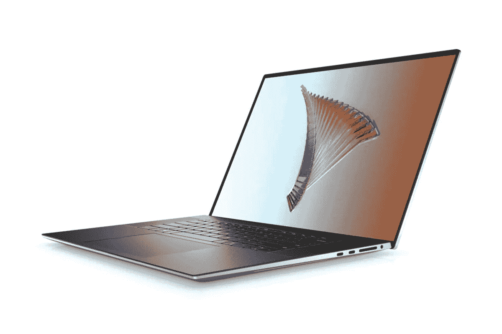

# 戴尔 XPS 17 vs Surface Book 3:你该买哪个？

> 原文：<https://www.xda-developers.com/dell-xps-17-vs-surface-book-3/>

购买新笔记本电脑可能是一个困难的决定。如今，你可以买到各式各样的顶级笔记本电脑,有时候你会觉得选择太多了。这显然是更好的，因为你可以找到适合你的东西。如果你正在寻找一台新的笔记本电脑，你可能会找到两种型号的戴尔 XPS 17 和 Surface Book 3。这两款笔记本电脑都面向创意专业人士，但这并不意味着它们都很相似。

这两种笔记本电脑在许多方面完全不同，因此在这两者之间进行选择实际上应该相对简单。通常情况下，你的选择取决于你需要什么。但是差别是明显的，所以你应该能够相当容易地做出决定。当然，我们是来提供帮助的，所以我们将在几个关键方面对戴尔 XPS 17 和 Surface Book 3 进行比较。

## 规范

和往常一样，我们先简单看一下这两款机器的规格表。一些很大的不同会马上出现在你面前，但是我们会在以后更多的讨论它们。

|  | 

戴尔 XPS 17

 | 

表面书 3

 |
| --- | --- | --- |
| **处理器** | 

*   英特尔酷睿 i5-11400H(最高 4.5GHz，6 核)
*   英特尔酷睿 i7-11800H(最高 4.8GHz，8 核)
*   英特尔酷睿 i9-11900H(最高 4.9GHz，8 核)
*   英特尔酷睿 i9-11980HK(最高 5GHz，8 核)

 | 

*   英特尔酷睿 i5-1035G7(最高 3.7GHz，四核) (仅 13.5 英寸)
*   英特尔酷睿 i7-1065G7(最高 3.9GHz，四核)

 |
| **图形** | 

*   英特尔 UHD 显卡
*   NVIDIA GeForce RTX 3050 4GB gddr 6(60W)
*   NVIDIA GeForce RTX 3060 6GB gddr 6(70W)

 | 

*   英特尔虹膜增强显卡
*   NVIDIA GeForce GTX 1650 4GB gddr 5(Max-Q)(13.5 英寸)
*   NVIDIA GeForce GTX 1660 Ti 6GB gddr 6(Max-Q)(15 英寸)
*   NVIDIA Quadro RTX 3000 (Max-Q) (15 英寸，仅商用)

 |
| **撞锤** |  | 

*   8GB (13.5 英寸)
*   16GB
*   32GB

 |
| **存储** |  | 

*   256GB
*   512GB
*   1TB
*   2TB(仅限 15 英寸)

 |
| **显示** | 

*   17 英寸，全高清+ (1920 x 1200)，InfinityEdge，防眩光，非触摸，500 尼特
*   17 英寸，超高清+ (3840 x 2400)，InfinityEdge，防眩光，触摸屏，100% Adobe RGB，94% DCI-P3，500 尼特

 | 

*   13.5 英寸 PixelSense (3000 x 2000)，触摸屏
*   15 英寸 PixelSense (3240 x 2160)，触摸屏

 |
| **音频** | 

*   四声道立体声扬声器(两个 2W 低音扬声器，两个 2.5 瓦高音扬声器)

 | 

*   带杜比 Atmos 的立体声扬声器

 |
| **网络摄像头** | 

*   2.25 毫米 720p 高清 30fps 红外摄像头

 | 

*   500 万像素 1080 像素前置网络摄像头(带红外)
*   800 万像素 1080 像素后置网络摄像头，支持自动对焦

 |
| **生物认证** | 

*   Windows Hello 红外摄像头+指纹识别器

 | 

*   Windows Hello 面部识别

 |
| **电池** |  | 

*   13.5 英寸:长达 15.5 小时的使用时间(容量未定)
*   15 英寸:长达 17.5 小时的使用时间(容量不明)

 |
| **港口** | 

*   4 个 Thunderbolt 4(USB C 类)端口
*   SD 读卡器
*   3.5 毫米耳机插孔
*   包括 USB Type-C 至 Type-A、USB Type-C 至 HDMI 2.0 适配器

 | 

*   2 个表面连接端口(一个在底座上，一个在平板电脑上)
*   两个 USB Type-A (3.2 第 2 代/ 10Gbps)
*   一个 USB Type-C (3.2 第 2 代/ 10Gbps)
*   SD 读卡器
*   3.5 毫米耳机插孔

 |
| **连通性** | 

*   黑仔 Wi-Fi 6 AX1650 (2x2)，蓝牙 5.1

 | 

*   Wi-Fi 6 +蓝牙 5.0
*   Xbox 无线内置(15 英寸)

 |
| **颜色** | 

*   铂金银外观+黑色内饰

 |  |
| **尺寸(WxDxH)** | 14.74 x 9.76 x 0.77 英寸(374.45 x 248.05 x 19.05 毫米) | 

*   13.5 英寸(酷睿 i5): 12.3 x 9.14 x 0.51-0.9 英寸(312 x 232 x 13 - 23 毫米)
*   13.5 英寸(酷睿 i7): 12.3 x 9.14 x 0.59-0.9 英寸(312 x 232 x 15 - 23 毫米)
*   15 英寸:13.5 x 9.87 x 0.568 - 0.9 英寸(343 x 251 x 15 - 23 毫米)

 |
| **重量** | 4.87 磅(2.21 千克)(非触控)，5.34 磅(2.42 千克)(触控) | 

*   13.5 英寸(酷睿 i5): 3.38 磅(1.53 千克)，带键盘
*   13.5 英寸(酷睿 i7 处理器):3.62 磅(1.62 千克)，带键盘
*   15 英寸:4.2 磅(1.91 千克)，带键盘

 |
| **起始价格** | $1,599.99 | $1,599.99 |

## 设计:Surface Book 3 拥有可拆卸屏幕

虽然戴尔 XPS 17 和 Surface Book 3 都可以用作传统的笔记本电脑，但这两款电脑的设计截然不同。首先，戴尔 XPS 17 只是一款翻盖笔记本电脑，而 Surface Book 3 是一款可拆卸的笔记本电脑。有了 Surface Book 3，你可以把屏幕和键盘底座分开，把屏幕当成平板电脑使用。例如，如果你想用它来看电影，你也可以把屏幕向后重新安装。Surface Book 3 的大部分组件都在显示部分，尽管更大的电池和 NVIDIA GPU 都在键盘底座上。这使得 Surface Book 3 很容易成为两者中更灵活的一个。

Surface Book 3 也明显更轻，因此更便于携带。Dell XPS 17 的起始重量为 4.87 磅，而且没有触摸屏选项。另外，这是基本重量，没有专用的 GPU。15 英寸的 Surface Book 3 重 4.2 磅，但这已经包括触摸、NVIDIA GPU 和强大的整体配置。这部分归功于其较小的尺寸，但也归功于镁合金外壳的使用，而不是戴尔的铝制外壳。

不过，戴尔 XPS 17 在端口方面有优势。首先，它使用 Thunderbolt 4 端口，这给你 40Gbps 的带宽来连接外设和外部显示器。微软坚决拒绝在其产品中使用 Thunderbolt，而是使用具有磁性的 Surface Connect 端口。然而，该公司对这个端口的规格不是很透明，所以很难将其与 Thunderbolt 进行比较。

尽管如此，该公司确实表示，它支持 Surface Book 3 上 60Hz 的双 4K 显示器(使用 Surface Dock 2)，所以你仍然可以获得稳定的带宽。戴尔 XPS 17 的另一个优势是它包括一个 HDMI 2.0 适配器，因此您可以更轻松地连接外部显示器。

微软坚决拒绝在其产品中使用 Thunderbolt，而是使用具有磁性的 Surface Connect 端口。

两款笔记本电脑都配有 Windows Hello 面部识别功能，不过戴尔 XPS 17 还增加了指纹传感器。虽然我个人认为当你有面部识别功能时没有理由使用指纹传感器，但有这个选项还是很好的。

## 性能:戴尔 XPS 17 远比 Surface 强大

Dell XPS 17 在多功能性或便携性方面有所欠缺，但其强大得多的硬件足以弥补这一不足。正如我们之前所说，这是两种完全不同的设备。戴尔 XPS 17 装载了第 11 代 45W 英特尔酷睿处理器，与 Surface Book 3 内部的第 10 代 15W 处理器相去甚远。表面上的低功率处理器使得性能不可避免地不如以前好。

不幸的是，GeekBench 没有提供英特尔酷睿 i7-1065G7 的平均分数，但即使我们为 Surface Book 3 取了一个我们能找到的最好的分数，也不是很接近。

| 

主标题 1

 | 

Surface Book 3(英特尔酷睿 i7-1065G7)

 | 

英特尔酷睿 i5-11400H(平均)

 | 

英特尔酷睿 i7-11800H(平均)

 |
| --- | --- | --- | --- |
| GeekBench 分数(单核/多核) | 1315 / 4554 | 1403 / 6028 | 1502 / 8152 |

当我们考虑到显卡时，戴尔 XPS 17 的优势就更大了。这款笔记本电脑最高可配 70W NVIDIA GeForce RTX 3060 GPU，这是一款非常强大的硬件。另一方面，Surface Book 3 配备了最高为 Max-Q 设计的 NVIDIA GeForce GTX 1660 Ti。需要明确的是，这仍然是一个相当强大的 GPU，但 RTX 3060 明显更好。对于企业来说，你可以选择 NVIDIA Quadro RTX 3000 GPU，但这并没有从根本上更强大。

这里值得指出的是，Surface Book 3 是时候更新换代了。它使用的是上一代英特尔处理器，RTX 30 系列 GPU 在 Surface Book 3 发布时也不可用。就当时而言，甚至在今天，Surface Book 3 仍然是一台强大的机器——比任何其他 [Surface 设备](https://www.xda-developers.com/best-microsoft-surface-pcs/)都更强大——你仍然可以用它来进行创意工作，甚至玩游戏。它远不如戴尔 XPS 17 强大。

总的来说，很明显戴尔 XPS 17 是更强大的机器，但考虑到它的尺寸和重量，这是意料之中的。

除了性能规格之外，Surface Book 3 可以配备高达 32GB 的内存和 2TB 的固态硬盘存储，而戴尔 XPS 17 可以将这两者增加一倍。总的来说，很明显戴尔 XPS 17 是更强大的机器，但考虑到它的尺寸和重量，这是意料之中的。

## 戴尔 XPS 17 与 Surface Book 3 的对比:显示器

这两款笔记本电脑都可以提供出色的显示体验，但它们仍然有很大的不同。Surface Book 3 的长宽比为 3:2，而戴尔 XPS 17 使用的是 16:10。这两个数字都高于传统的 16:9，因此，它们有利于提高生产率。每个人都有不同的最佳点，但我们最近看到越来越多的笔记本电脑使用 3:2 宽高比，所以它可能更可取。

还有尺寸问题，如果你想要更紧凑的东西，Surface Book 3 给了你两个选择，而 XPS 17 给了你最大的屏幕空间。

在显示清晰度和质量方面，这两者可能会有些针锋相对，但戴尔 XPS 17 需要额外付费。Surface Book 只为每种显示屏尺寸提供了一种分辨率选项。13.5 英寸的分辨率为 3000 x 2000，15 英寸的分辨率为 3240 x 2160。另一方面，Dell XPS 17 一开始只有全高清显示屏(1920 x 1200)，而且更大。为了获得更清晰的图像，你需要为 4K 超高清+选项(3840 x 2400)多花 400 美元。在这种配置下，两款笔记本电脑的像素密度相似，XPS 17 的像素密度略高。

至于声音，这两款笔记本电脑都有面向用户的立体声扬声器，这意味着声音直接向你发出。这将为您带来更响亮、更高质量的声音。戴尔 XPS 17 更好，因为它有一个四扬声器系统，有两个低音扬声器和两个高音扬声器。Surface Book 3 只使用了两个扬声器，所以不太好。

这里值得指出的最后一点是网络摄像头的质量。Surface 设备拥有一些 Windows 笔记本电脑上最好的网络摄像头，Surface Book 3 配备了两个 1080p 摄像头。图片方面，前置摄像头分辨率为 5MP，后置摄像头为 8MP，加上支持自动对焦。另一方面，戴尔 XPS 17 使用了一个只有 720p 的 2.25 毫米微型摄像头。这个网络摄像头的质量是出了名的差，所以如果你想经常打视频电话，你最好用 Surface Book 3。

## 底线是:这是一个平衡的行为

你可能听过很多这样的话，但是在选择合适的笔记本电脑时，总是要权衡它能提供什么和你需要什么。在这种情况下，你必须选择你更看重便携性还是顶级性能。Surface Book 3 是一款功能强大的笔记本电脑，毫无疑问。英特尔的第十代处理器仍然很好，GeForce GTX 1660 Ti 仍然可以很好地处理大量游戏和创意工作负载。

但除了是低功耗组件之外，它们还不是最新最棒的。作为额外动力的交换，你可以得到像可拆卸设计和轻质镁建筑这样的铃铛和哨子。另外，你有质量很好的相机。

对于要去上大学的学生，或者只关心随身携带笔记本电脑的人来说，Surface Book 3 是更好的选择(...)

另一方面，Dell XPS 17 是一款性能强大的产品，它做出了实现这一目标所需的权衡。这是一个简单的翻盖设计，而且是一个沉重的设计(至少通过直接比较)。但你从中获得的性能远远超过了 Surface Book 3 所能提供的。如果您要设置家庭办公室或基本固定的工作环境，Dell XPS 17 可能是您需要的。尤其是在处理复杂的创造性工作时，如 3D 设计或视频编辑。当然，你也可以用它来进一步推动游戏的发展。这是戴尔最好的笔记本电脑之一，这是有充分理由的。

对于一个要去上大学的学生，或者只关心随身携带笔记本电脑的人来说，Surface Book 3 是更好的选择，就个人而言，这是我希望我的用例。我喜欢可拆卸的设计，虽然我主要在办公桌前工作，但如果需要的话，我可以随身携带一些东西，这很好。但即使你同意这一点，也值得考虑 Surface Book 3 的继任者可能很快就会出现。自发布以来已经一年多了，一些报道已经开始出现关于一款具有全新设计的潜在 [Surface Book 4](https://www.xda-developers.com/microsofts-surface-book-4-might-not-detachable-display/) 。无论如何，如果你已经做出了选择，你可以使用下面的链接购买其中一台笔记本电脑。

 <picture></picture> 

Dell XPS 17

##### 戴尔 XPS 17

Dell XPS 17 是一款功能强大的笔记本电脑，采用高端规格，如第 11 代 45W 英特尔处理器、64GB 内存和 4TB 存储。此外，您可以通过 Nvidia 高达 70W 的 GeForce RTX 3060 获得它。您还可以通过高达 4K 触摸屏显示器获得它。

 <picture></picture> 

Microsoft Surface Book 3

##### 微软 Surface Book 3

Surface Book 3 采用高端第十代英特尔处理器和专用 NVIDIA 显卡，可以以可玩的帧速率处理大多数现代游戏以及创造性工作负载。你可以将屏幕从键盘上拆下来，当作平板电脑来使用，它拥有 Surface 系列所闻名的相同的高级设计。