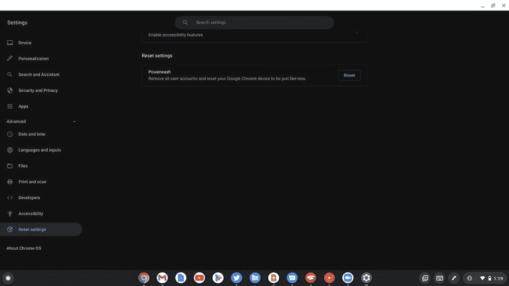
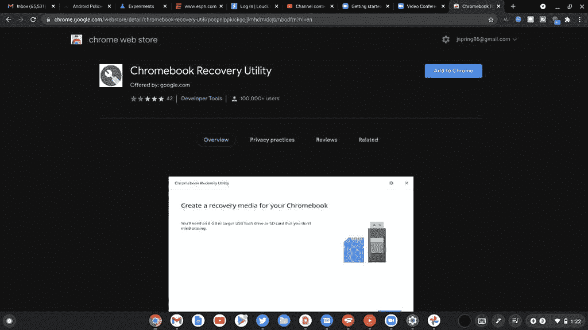

# 如何修复 Chromebook 上的“ChromeOS 丢失或损坏”

> 原文：<https://www.xda-developers.com/fix-chrome-os-missing-damaged/>

谷歌的 ChromeOS 是一个直观简单的导航界面。当然，即使是最好的操作系统也会偶尔出现错误或问题。如果你最近在 Chromebook 上遇到了 **ChromeOS 丢失或损坏**消息[，你可能会担心。这个错误相对容易解决，但理解为什么 Chromebook 上可能会出现这个消息也是一个好主意。](https://www.xda-developers.com/best-chromebooks/)

当您的设备在加载操作系统时遇到问题，会显示消息 **ChromeOS 丢失或损坏**。您通常会在启动时遇到这种情况，但在您使用电脑时，该信息也会随机出现。根据设备型号的不同，错误屏幕看起来略有不同，但所有 Chromebooks 的潜在解决方案都是一样的。

如果你决定在 Chromebook 或 Chromebox 上启用开发者模式，也会出现这条消息。请记住，如果您试图启用开发人员模式，这是完全正常的，实际上是必需过程的一部分。但是，如果您无意中遇到此消息，您可以采取一些步骤来解决问题。

以下是用于诊断 **ChromeOS 丢失或损坏**错误的选项。这些选项按严重性递增的顺序列出。如果你可以用最简单的选择来解决问题，不要进行任何进一步的选择。

## 关闭并重新打开 Chromebook 电源(最快的选项)

有时，您只需关闭设备电源，然后再打开即可解决此类问题。按住电源按钮直到设备关闭，然后等待几秒钟，再次按下电源按钮将其重新打开。

如果有小故障或 bug，这个选项可能只会修复问题，但它也是最耗时的选项，并且尝试一下也无妨。

## 强力清洗您的 Chromebook(恢复出厂设置)

在尝试此步骤之前，请注意这将删除您机器上所有本地存储的数据。确保**将您希望保留的任何内容**备份到外部驱动器或云存储服务。你可以在设置菜单中找到对 Chromebook [进行强力清洗的选项。](https://www.xda-developers.com/chrome-os-settings-guide/)

如果您在本地设备上存储了大量数据，此过程可能会更加耗时。如果您将大部分信息存储在云中，这应该不需要超过 5 到 10 分钟就可以完成。强力清洗修复了大多数问题，所以如果你收到了 *ChromeOS 丢失或损坏*的消息，这将有望解决问题。

## 重新安装 ChromeOS(最严重的问题)

如果简单的重启或 Powerwash 不起作用，你可能需要完全重新安装 ChromeOS。只有在前两个建议不起作用的情况下，才应该尝试这个选项。重新安装 ChromeOS 需要访问另一台 Chromebook、Mac 或 Windows PC。你还需要一个备用的 USB 闪存驱动器或 SD 卡，上面有大约 8GB 的可用空间。如果你准备冒险从头重新安装 ChromeOS，下面是如何做的:

1.  在另一台电脑上使用[谷歌 Chrome 浏览器](https://www.lifewire.com/what-is-google-chrome-4687647)，在 Chrome 网络商店中选择**添加到 Chrome** ，下载并安装 [Chromebook 恢复实用程序](https://chrome.google.com/webstore/detail/chromebook-recovery-utili/jndclpdbaamdhonoechobihbbiimdgai)。
2.  启动程序。系统会要求您提供 Chromebook 型号，您可以手动输入或从列表中选择。
3.  您可能会被要求授予对您的 USB 闪存驱动器或 SD 卡进行更改的权限。只需点击*是*。
4.  将 USB 闪存驱动器或 SD 卡插入 Chromebook，然后按照屏幕上的提示将 ChromeOS 下载到您的外部驱动器或卡中。
5.  下载完成后，取出 u 盘或 SD 卡。
6.  Chromebook 开机后，按住键盘上的 **Esc+Refresh** ，然后按下电源按钮以恢复模式重启。
7.  在 **ChromeOS 丢失或损坏**屏幕上，插入包含 ChromeOS 的 SD 卡或 USB 驱动器。然后，您应该完成操作系统的安装过程。

这个过程应该可以将你的 Chromebook 恢复到像新的一样，就像它从盒子里出来一样。如果您继续收到任何错误消息，很可能是您有硬件问题，需要您购买的 OEM 进行维修。像 Acer 这样的大多数原始设备制造商都提供某种类型的保修服务，所以请联系我们，看看您有什么选择。

希望你现在对让你的 Chromebook 回到工作状态感觉好一点。ChromeOS 丢失或损坏的消息并不是世界末日。大多数情况下，通过快速重启或动力清洗，问题很容易解决。确保在尝试任何选项之前，您备份了所有个人数据以防止丢失。

如果你对解决 Chromebook 的这个问题有任何其他问题，请在评论中提出。如果你想让你的 Chromebook 更上一层楼，看看我们的 ChromeOS Linux 应用的[指南。](https://www.xda-developers.com/linux-apps-chrome-os/)