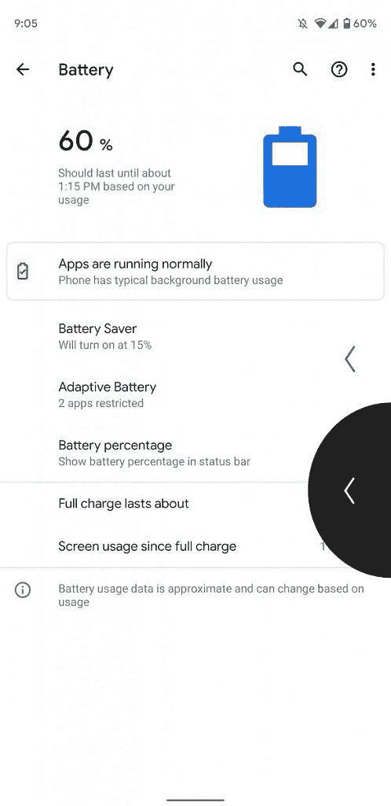
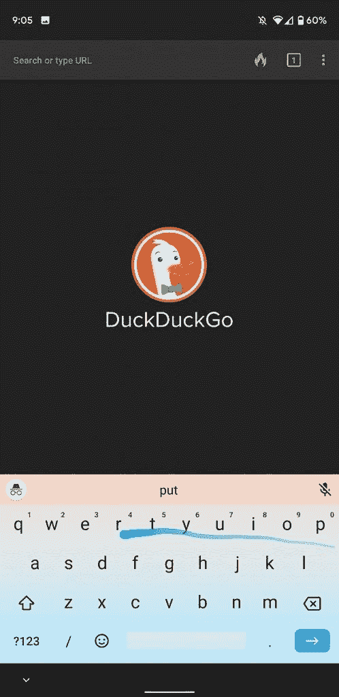

# 谷歌即将推出的 Android Q 手势一塌糊涂

> 原文：<https://www.xda-developers.com/google-android-q-gesture-mess/>

2019 年，似乎每个安卓设备都必须至少有手势导航的选项。三星、一加、华为和许多其他中国制造商现在都推出了手势控制选项。为了在真正的碎片化真正形成之前提前解决这个问题，谷歌也一直在努力想出一套手势。谷歌最新的 Android Q 测试版带来了一套新的系统导航手势。在 Android Q 的整个测试过程中，这些手势已经被[调整和改变](https://www.xda-developers.com/android-q-beta-3-released/)。不幸的是，谷歌在手势导航方面的最新突破对我来说并不理想，最终感觉像是安装在 Android 上的东西，而不是一个直观、智能、有助于在设备上移动的系统。让我们来看看为什么他们现在有点乱。

## 航海简史

要恰当地说一下 2019 年谷歌的手势导航，我觉得还得从头说起。2008 年 9 月，HTC 发布了首款商用安卓手机 G1。虽然自那以后，Android 几乎改变了一切，但 G1 配备了两个按钮，这两个按钮或多或少保留了 Android 当前的形式:返回和主页。事实上，从一开始，系统级的后退按钮就是 Android 的一个定义功能和区别。

几年来，Android 设备，比如我心爱的 Nexus One，都配备了四个**按钮布局:主页、返回、菜单、搜索。**

 <picture></picture> 

The Nexus One Button Layout

虽然许多制造商打乱了顺序，但这是当时 Android 的布局，几乎没有例外。在 [2012](https://android-developers.googleblog.com/2012/01/say-goodbye-to-menu-button.html) 年，Android 3.0，开始了菜单键的贬值(搜索键早就掉了)。虽然在当时这是一个有争议的变化，谷歌的推理是合理的。菜单本身总是一个问号。一个隐藏的菜单，可能有也可能没有你正在寻找的选项，只有通过按下按钮来检查才能发现，这不是一个清晰和交流的用户体验。应用程序适应了这种变化，开始在工具栏中包含菜单按钮。

从 2013 年的 Android 4 开始，“香草”设备配备了现在熟悉的最近应用程序导航布局。我们多年来一直沿用这种布局和按钮排列。不过，随着后 Nexus Pixel 系列的推出，谷歌已经开始有点尝试了。

最初的谷歌 Pixel 和 Pixel 2 配备了标准的 back-home-recent 布局，但 Pixel 3(和 Android Pie)推出了新的两按钮“手势”控制方案。home 键和全系统的 back 键依然存在，但最近的应用程序现在被向上滑动的手势所取代。就像取消菜单按钮一样，如此大的系统级改变遭到了批评和困惑。然而，与菜单按钮的移除不同，这种改变实际上并没有给用户带来好处。导航条的高度保持不变，而且可以说比简单的点击按钮要慢。这些手势可能是对 iPhone X 带来全系统导航手势的回应，但感觉更像是为了改变而改变。

## Android Q 手势——一次尝试性的改进

现在，很多安卓 OEM 厂商都拿出了自己的手势系统。它们中的许多都与 iPhone X 相似，尤其是在 Home 手势上。随着 Pixel 4(和 Android Q)的发布，谷歌将发布另一种系统导航方法，一种更加拥抱手势的方法。我们已经看到这些手势在整个 Android Q betas 中不断演变，但现在我们已经进入 beta 5 并接近 Q 的最终发布，这些手势可能的“最终版本”正在开始形成。坦白说，手势很糟糕。

 <picture></picture> 

Pixel 3 XL Gesture Bar (top), iPhone XS Max Home Bar (bottom)

首先，让我们看看这些新手势是如何工作的。一旦选择了全屏导航，导航栏大多会消失，取而代之的是一条横跨底部的小水平线。这个栏看起来和 iOS 上的 home 栏很像，只是更小。手势的功能也与 iOS 非常相似。在应用程序中，从滚动条向上滑动，将会进入主屏幕(自适应图标上整齐的反弹效果有助于销售运动)。向上滑动并按住将调出最近的应用切换器。沿着底部水平滑动可以滚动浏览最近的应用程序，就像在 iOS 中一样。

这就是事情变得混乱的地方。一直以来非常重要的后退按钮，仍然是 Android 导航的一个关键组件，已经被移动到从屏幕两侧滑动。从显示屏外部向内滑动会激活两侧的后退按钮。

 <picture></picture> 

Android Q's Back Gesture Arrow in Black and White

除非键盘打开，否则可以从显示器的整个高度激活背部手势。如果键盘是打开的，你必须在键盘上方滑动或从导航栏关闭键盘。最后，在 Beta 5 中，谷歌在底部角落的两侧添加了这些小半圆指示器，用于辅助手势，即从底部角落滑动。

安卓 Q 手势大多*没问题；*苹果和其他制造商已经向人们介绍了这些产品，虽然我不会称之为直观，但它们大多工作得足够好。然而，Back 手势有一些大问题，我真的希望谷歌能重新考虑整个系统。

## 问题和困惑

我的第一个也是主要的问题是使用应用程序。首先，大多数 Android 应用程序都有一个[导航抽屉](https://developer.android.com/guide/navigation/navigation-ui)。这个方便的滑出式面板出现在许多应用程序中，多年的 Android 使用训练我从边缘滑入打开它。人们可以按下汉堡菜单打开抽屉，但随着手机变得越来越大，越来越高，这就成了问题。由于背部和导航抽屉打开手势在功能上是相同的，在不激活或绊倒另一个的情况下做一个是非常挑剔、困难和烦人的。在 Android Q Beta 5 中，[谷歌试图用一种“开始扫入并暂停”的方法来打开抽屉，而不是返回，以我的经验来看，这是非常不可靠的。](https://www.xda-developers.com/android-q-beta-5-gesture-behavior-navigation-drawers/)

自从 Beta 5 发布以来，我强迫自己使用谷歌的手势，这让我看到了我经常打开导航抽屉的应用程序。这里有一个(绝非详尽的)列表，列出了现在使用手势时要麻烦得多的应用程序:

*   谷歌邮箱
*   游戏商店
*   几乎任何 Reddit 客户端
*   不调和
*   记笔记
*   推特

当然，这不是一个不可克服的问题，但它感觉像是一个不必要的问题。我们这里有多年的开发者惯性，新的 Android Q 手势正在与之斗争。

我对背部手势的另一个问题是，它没有连贯性或交流性。诚然，Android 的全系统后退行为一直有点古怪。在一些应用程序中，它会关闭应用程序，而在一些情况下，它可以带你在应用程序之间切换，然后最终回到家中。一种常见的情况是从启动器打开一个应用程序，然后点击后退按钮(至少一次)返回到启动器。

在 iOS 上，许多人声称谷歌的手势来自于此，但这是不可能的。苹果的操作系统更加“以应用为中心”，除了 Home 之外没有任何手势可以从一个应用回到主屏幕。而在 iOS 的大多数应用程序中，从(仅)左边缘滑动被视为后退手势。这通过新视图从右边缘滑入的微妙动画传达给用户。因此，自然而直观地，向相反的方向滑动会“返回”

这种流程和动画根本无法与 Android 的后台 UX 一起工作。如果我从 dock 启动一个应用程序，它会从图标“放大”视图。动画中没有任何信息表明，通过从任一边缘滑动来“返回”会将用户带到主屏幕。再说一次，这并不是一个精彩的表演，但我们进入这些移动操作系统已经超过十年了，这感觉像是在与用户直观地合作方面倒退了一步。

最后，我对 Android Q back 手势还有几个小问题。当键盘打开时，无论键盘有多高，您都无法在边缘上向后滑动。如果一个人想用向后的手势来合上键盘，他必须把手机抬起来，在键盘上方滑动。

 <picture></picture> 

No Back Gesture Over The Keyboard

目前，在旧的返回按钮位置仍然有一个“关闭键盘”按钮来帮助。对我来说，这感觉很混乱。最后，我完全愿意承认这可能只是我用手势而不是按钮做的事情，没有能力重复按下按钮返回几层。对我来说，在聊天室聊天([我仍然对你很生气，谷歌](https://www.xda-developers.com/through-allo-duo-google-continues-to-send-a-convoluted-message/))和快速点击后退按钮回到主屏幕并不罕见。或者，有时你在 Twitter 或 Reddit 上浏览了几层，想按几次后退按钮回到主页面。重复按下一个按钮总是比同等次数的滑动更容易。

## 请修复 Android Q 的手势，谷歌

坦率地说，自从 Android Q Beta 5 发布以来，我一直在使用它，这是我第一次在使用 Pixel 3 XL 时强迫自己使用手势。我仍然不喜欢它，而且我经常不得不抵制切换回 2 或 3 按钮导航的冲动。如此多的 Android Q 手势给人的感觉就像谷歌在玩追赶游戏，或者只是简单地重复 iOS 和 EMUI 已经做的事情。感觉不像是经过深思熟虑的连贯体验。它在几乎所有方面都比十年前的 3 键布局慢。我知道我们很快就要发布 Android Q 了，很可能我们在 Beta 5 中看到的很多东西都会进入 Q 的稳定发布。然而，我真的希望他们能尽快拿出更好的东西。现在，至少我还能切换回 3 键布局或者药丸。