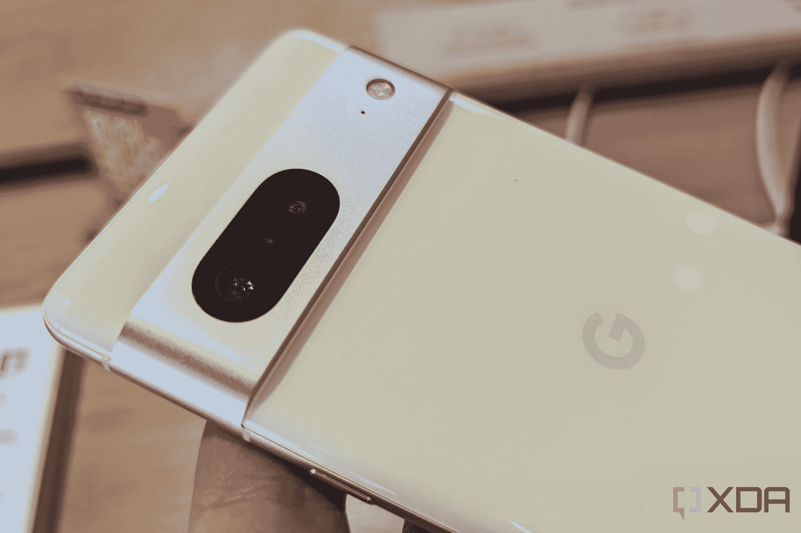

# 2023 年的谷歌:预测、传言和我们希望在新的一年看到什么

> 原文：<https://www.xda-developers.com/google-in-2023/>

2022 年对谷歌来说是重要的一年。它创造了新类别的产品，如 Pixel Watch，并更倾向于[改进 ChromeOS](https://www.xda-developers.com/chromeos-2022-year-in-review/) 。但也不全是好事。该公司在创新部门 120 区进行了裁员，并完全关闭了 Stadia。尽管如此，谷歌是一家大公司，在新的一年里肯定有很多计划，这些是我们对当前传言的一些预测。我们将它们从最有可能到最不可能排列如下。

## 谷歌 Pixel 8 系列和谷歌 Pixel 7a

 <picture></picture> 

The back of the Google Pixel 7 in Lemongrass showing the camera housing.

像时钟一样，我们预计谷歌将在 2023 年推出旗舰产品和中端产品的继任者。谷歌 Pixel 8 几乎肯定会和谷歌 Pixel 7a 一起出现，[，后者已经开始泄露](https://www.xda-developers.com/google-pixel-7a-early-specs/)。我们预计 Pixel 7a 将配备 90Hz 显示屏、无线充电和更好的摄像头，从谷歌多年来在所有智能手机中使用的同一款摄像头升级而来。

至于谷歌 Pixel 8，我们预计另一个张量继任者，可能是在三星的 3 纳米工艺上制造的。最近的一次泄露还暗示，该公司可能会对谷歌相机专业版应用程序进行改进，包括交错的 HDR 支持。其他细节目前很少，但关键是它很可能是渐进式的改进，就像 Pixel 7 系列相对于 Pixel 6 系列一样。

## 谷歌像素平板电脑

谷歌 Pixel 平板电脑的存在已经在谷歌 I/O 上得到证实，我们也了解到了一些小细节。该公司证实，它将为平板电脑配备一个磁性基座，可以帮助你像使用智能显示器一样使用它。然而，除此之外，我们只知道它将在 2023 年到来。

然而，泄露的消息表明，它可能会配备 10.95 英寸的显示屏，高达 256GB 的存储空间，谷歌的第一代张量 SoC 和两个 800 万像素的摄像头，但它不会支持 LTE。谷歌甚至可能正在开发 Pixel 平板电脑的“专业”版本，但目前这只是猜测。无论如何，我们都将看到该公司对 Android 平板电脑的全新尝试，如果做得好，可能会改变事情。

上一款谷歌平板电脑是 2015 年的 Pixel C 平板电脑。从技术上讲，在那之后有了 Pixel Slate，但它运行的是 ChromeOS。这两个选择都没有取得巨大成功，所以谷歌发布平板电脑表明，它似乎至少在一定程度上致力于改善 Android 平板电脑的体验。至少，该公司现在将有自己的利益，并且有理由去关心。

## 谷歌难以捉摸的像素折叠可能最终会出现

在这一点上，谷歌像素折叠已经传闻多年，尽管细节一直很少。该公司忽略了正式发布它(不像它在近一年前发布 Pixel 平板电脑)，我们所要做的就是泄露消息。由于泄露的渲染图，我们终于看到了它的样子[；它采用了三星首创的相同的内折叠外形，背部设计让人想起 Pixel 7 系列。不幸的是，或多或少其他的一切仍然是一个谜。](https://www.xda-developers.com/google-pixel-fold-first-renders/)

我们唯一知道的另一件事是，它据称有一个五月发布窗口，但它可能是一个有限的发布。虽然还没有*确定明年*到来，但是我们相当确信 2023 年*最终*会是它出现的一年。不管它何时发布，我们知道它的存在将以某种方式动摇可折叠场景，这令人兴奋。

## 谷歌 Pixel Watch 的继任者可能会出现

谷歌 Pixel Watch 还有很多不尽如人意的地方，那就是电池部分。这是一款好看的智能手表，有很多令人喜爱的地方，但它为该公司设立了一个完美的继任者。目前还不清楚我们今年是否会有继任者，但如果我们有，我们会在很多地方看到改进。

首先，该公司可以修复电池寿命。谷歌宣传 24 小时全收费，但我们发现这是绝对的最大限度。我们发现自己每天至少要充电两次，这在当今时代是不可原谅的。芯片组也可以使用升级。Pixel 手表采用了 Exynos 9110，这是 2019 年*推出 Galaxy Watch Active 2 时市场上的最新产品。早该升级了。拥有更高效的处理器也有助于延长电池寿命。只要谷歌至少专注于这两个领域，它就有可能获胜。*

## 高端安卓电视盒子

谷歌很少有设备被归类为 Android TV 的开发者设备。实际上只有三个，分别命名为 ADT-1 到 ADT-3。有证据表明，谷歌现在正在研究 ADT-4，正如 [*9to5Google*](https://9to5google.com/2022/12/06/adt-4-android-tv-source/) 所见。报告显示，ADT-4 将有 2GB 的内存，16GB 的存储空间，更多的 I/O 端口，甚至内置扬声器和麦克风。

这是说 ADT-4 提供的比 ADT-3 多得多，这表明谷歌可能会在未来创造一个高端的 Android 电视盒子。或者，它可能只是一个更强大的解决方案，供开发者测试他们的应用程序，谷歌没有计划在未来推出高端安卓电视盒子。

在这种假设的情况下，我认为它可能会出于品牌目的保留 Chromecast 的名字，并可能是 Chromecast Pro。或者，如果谷歌不想淡化 Chromecast 品牌，我们可以看到安卓电视盒子引入新的命名惯例。不能保证所有这些都会发生，但是推测起来还是很有趣的。

## 为 Pixel 智能手机提供更好的软件支持

这是证据最少的可能性，但可以说是最重要的可能性之一。感受到来自三星和一加等其他原始设备制造商的压力，认为谷歌可能在 2023 年宣布对未来 Pixel 设备的更长支持窗口并不疯狂。目前，三星和一加提供了四个主要的平台更新以及一年额外的安全补丁，将支持时间延长至五年。相比之下，谷歌只提供了*三个*重大平台更新。

从 Android 所有者的角度来看，在更短的时间内支持自己的第一方设备并不是一件好事，随着压力的增加，我认为至少*有可能*谷歌已经在考虑延长明年推出的新设备的更新窗口。谷歌没有就此事发表任何言论，但鉴于它在历史上一直是设备更新最多的原始设备制造商，我会非常惊讶地看到它至少不能与 Pixel 8 系列的四年保持一致。

* * *

## 2023 年谷歌的未来

谷歌在 2023 年的未来看起来很有趣，随着一些令人兴奋的产品即将推出，看看接下来会发生什么会很有趣。现有产品的继任者几乎总是既定的，但这将是谷歌多年来首次推出 Android 平板电脑，更不用说围绕扩展软件支持和某种更高端 Chromecast 继任者的可能性了。蛋糕上的糖衣将是一个像素折叠，因为我们多年来一直听到关于它的传言。

至于谷歌可能会在 2023 年推出的某种“主题”，这很难说。对于 2022 年，谷歌专注于引入新的产品类别，似乎在如何推出和讨论未来产品方面有所改变。由于今年谷歌的软件和硬件选择受到了很多批评，该公司可能会变得更加谦逊，尽管这更像是一厢情愿。总的来说，看起来该公司对未来的意图更加开放，我们有可能在明年对谷歌有一个更清晰、更透明的了解。