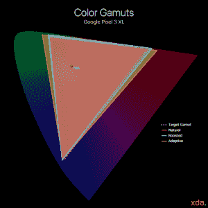
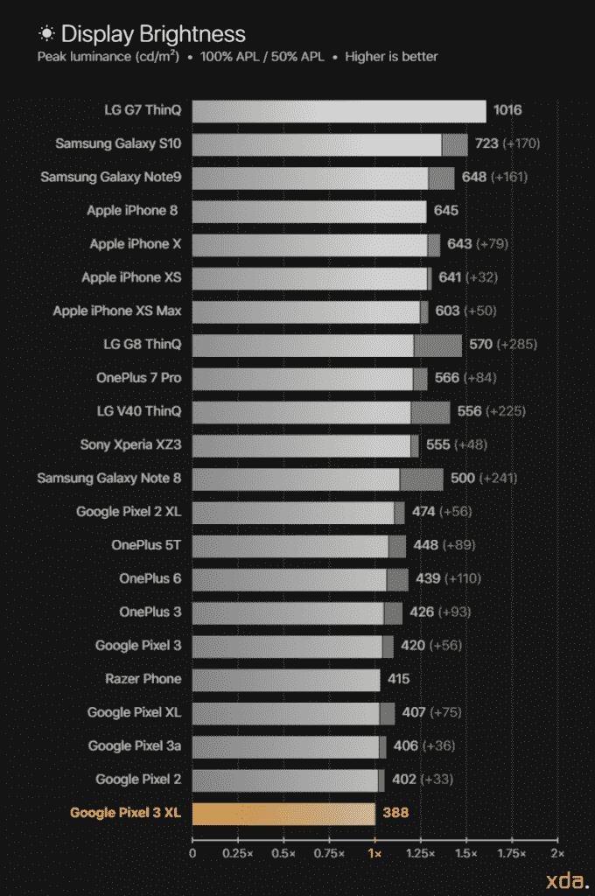
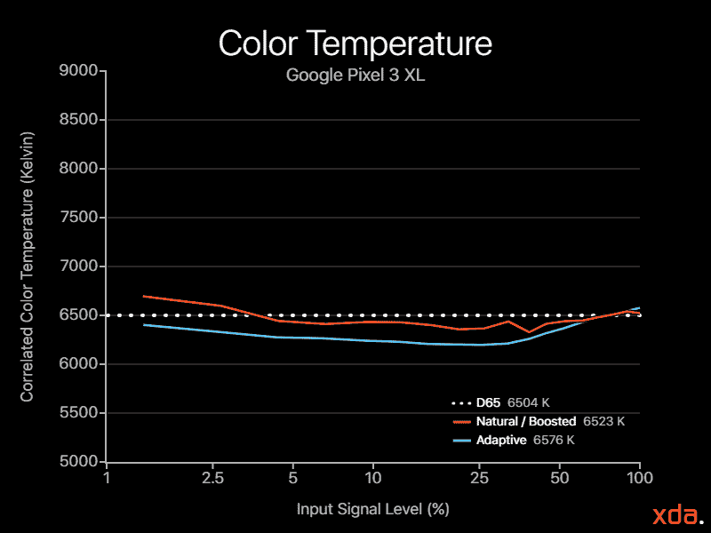
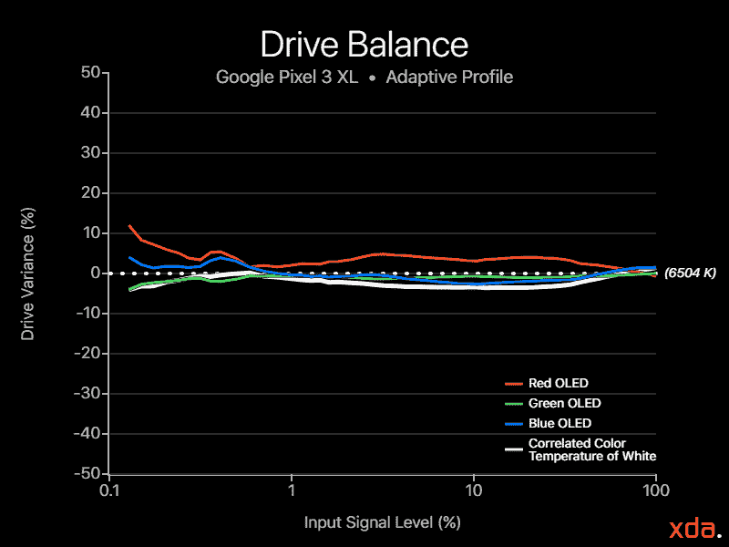
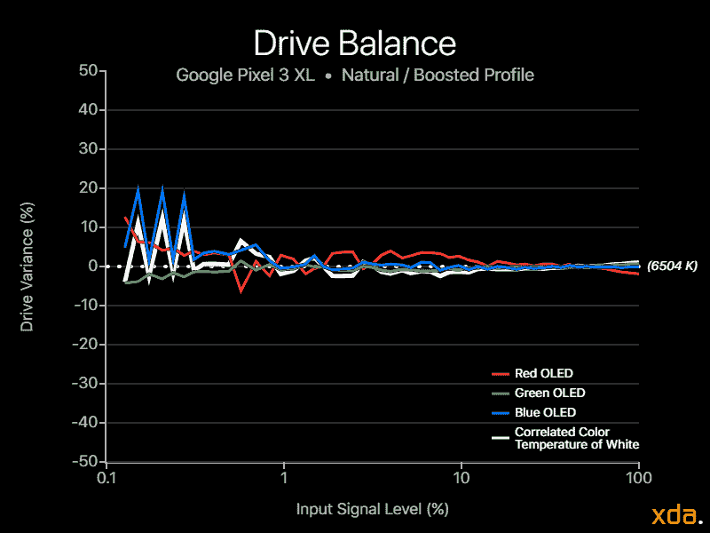

# 谷歌 Pixel 3 XL 显示器评论 Pixel 4 需要改进什么

> 原文：<https://www.xda-developers.com/google-pixel-3-xl-display-review-what-google-needs-to-improve-for-the-pixel-4/>

距离谷歌 Pixel 4 的推出只有几个月了，而今年谷歌格外早地启动了炒作列车，通过 [发布渲染](https://www.xda-developers.com/google-pixel-4-teaser/)智能手机背面的 *提前四个月* 其 [预计发布](https://www.xda-developers.com/verizon-roadmap-pixel-4-galaxy-note-10/) 。手机的正面仍然是猜测，但我们知道的是，谷歌正试图提高他们的屏幕部门的赌注。谷歌对其 Pixel 3 XL 的 [DisplayMate A+评级](http://www.displaymate.com/Pixel_3XL_ShootOut_1g.htm) 引以为豪，甚至诉诸 [将其吹捧为一种公关回应](https://www.reddit.com/r/GooglePixel/comments/9oc4ka/the_pixel_3_xl_at_least_the_unit_i_have_has/e7tu77w/?context=3) 来显示问题(我也遇到过这种固定的客服回应)。DisplayMate 的评论显然增强了谷歌的自尊心——以下是我对该显示器的看法。

[**谷歌 Pixel 3 XL 论坛**](https://forum.xda-developers.com/pixel-3-xl)

# 像素显示器的未来——序言

谷歌是 *如此接近于* 制造一款显示屏可以被认为是最好的智能手机。在室内，谷歌 Pixel 3 XL 显示器绝对具有 iPhone X(S)般的质量——颜色、对比度、视角等。设备正面的轮廓非常圆滑，当显示屏关闭时，漂亮的扁平深色平板可以很好地隐藏浴缸凹口和下巴(这是高质量防反射吸收层的结果)，显示屏看起来像 iPhone X 系列一样层压良好。就像苹果一样，谷歌决定在平板屏幕上使用柔性基板——我 *非常喜欢* 以实现贴满屏幕的外观(因此“柔性有机发光二极管”即使屏幕看起来是平的)。如果谷歌实现了其面板的高亮度模式，我会给 Pixel 3 XL 显示器一个“A”评级，但谷歌必须更进一步，因为竞争对手吹嘘 600+尼特的显示器亮度。在谷歌这样做之前，它的显示器将永远看起来黯淡无光，因为实际上有几十个美国人实际上在外面，与竞争对手相比，Pixel 手机的显示器只是显得不愉快地暗淡。

另一方面，谷歌也需要改善其显示器的阴影校准。在我们的一些本土环境中——在漆黑的——Pixel 手机显示屏比大多数其他手机显示出更高的黑色削波，使黑暗的场景变得一塌糊涂。谷歌 Pixel 3 XL 在这方面比其他 Pixel 设备做得更好，但很明显，问题在于谷歌的校准。在每部 Pixel 手机的原生宽色域中，黑色挤压明显较少，这表明低宽度 LUT 或 sRGB 的色调响应曲线/转换矩阵中的错误。

为了增加低亮度的细微差别，低端的亮度阶跃跳动且不平滑。在最低亮度下，谷歌 Pixel 3 XL 输出 2.1 尼特，并在下一步跃升至 3.5 尼特。这是一个比上一步增加 67%的步骤。作为参考，亮度变化需要大约 5%的幅度增加或减少才能被注意到(在随后的补丁中)，因此 67%是非常明显的跳跃。下一步输出 5.0 尼特(增加 43%)，然后 6.4 尼特(增加 28%)，然后 8.0 尼特(增加 25%)。这种情况发生在显示器的大部分较低亮度范围内，当使用自动亮度时，显示器偶尔出现亮度不稳定的情况可能会很烦人。它还降低了在昏暗环境中可供选择的亮度值的范围；在夜间，从 2.1 尼特到 3.5 尼特的跳跃非常大，你可能需要一个介于两者之间的设置。

接下来是色彩管理。我之前 在[我的谷歌 Pixel 3(非 XL)显示器评测](https://www.xda-developers.com/google-pixel-3-display-analysis-a-real-tangible-improvement-yet-still-behind-the-curve/#google-adaptive-profile-segment) 中写过一个类似的片段，我想让我的读者读一下，因为它仍然是相关的。随着 Pixel 3 和 Pixel 3 XL 的推出，谷歌从默认的精确色彩配置文件转向新的色彩饱和度扩展“自适应”配置文件。此描述文件没有任何形式的颜色管理，因此使用此描述文件不允许以任何适当的保真度查看其他颜色空间中的照片。这与谷歌最近宣布他们 [为 Android](https://android-developers.googleblog.com/2019/05/wide-color-photos-are-coming-to-android.html) 带来宽彩照片完全适得其反。在这篇文章中，谷歌解释了应用程序中颜色管理和颜色正确性的重要性，以及如何准备和实现这些想法，所有这些在自适应配置文件中都是毫无意义的。

此外，我相当肯定谷歌 Pixel 4 将是第一个在安卓系统中推出宽彩色摄影的产品。去年在 [Pixel 3 XL 泄露](https://www.xda-developers.com/google-pixel-3-xl-specs-features-pics-rumors/) 期间，当我注意到泄露的照片样本有一个显示 P3 嵌入式颜色配置文件时，我捕捉到了一丝 的迹象，来自谷歌相机的狗粮版。我很失望地看到它从发布产品中被省略，但最近谷歌宽彩色照片的公告让我毫不怀疑它将与谷歌 Pixel 4 一起发布。他们只是不能在自适应配置文件中正常显示，所以我很好奇谷歌会怎么做。谷歌也有可能 [实现类似于苹果 TrueTone 的自动白平衡功能](https://www.xda-developers.com/google-pixel-4-automatic-white-balance-true-tone/) ，这表明至少有一些专注于下一个像素的显示——哪怕只是一个功能。

咆哮结束。

## **方法论 ▼**

为了从显示器中获得定量的颜色数据，我们将特定设备的输入测试模式放入手机，并使用 i1Pro 2 分光光度计测量显示器产生的发射。我们使用的测试模式和设备设置针对各种显示特性和可能改变我们所需测量的潜在软件实现进行了修正。许多其他站点的显示分析没有正确考虑它们，因此它们的数据可能不准确。我们首先测量显示器的全灰度，并报告白色的感知色彩误差及其相关色温。从读数中，我们还通过对每一步的理论伽马值进行最小二乘法拟合，得出显示伽马值。这个 gamma 值比那些从 CalMAN 等显示校准软件报告 gamma 读数的值更有意义，也更真实，CalMAN 等显示校准软件是对每一步的理论 gamma 进行平均。我们测试图案的目标颜色灵感来自于

[DisplayMate’s absolute color accuracy plots](http://www.displaymate.com/Colors_43s.html)

。在整个 CIE 1976 色度标度中，颜色目标的间隔大致均匀，这使得它们成为评估显示器的完整颜色再现能力的极好目标。灰度和色彩准确度读数以显示器读数的 20%为增量

*perceptual*

(非线性)亮度范围并进行平均以获得精确到显示器整体外观的单个读数。另一个单独的读数取自我们的参考 200

*cd/m²*

这对于典型的办公室条件和室内照明来说是很好的白色水平。我们主要使用色差测量

*CIEDE2000*

(简称为

*ΔE*

)作为色度准确度的度量。

*ΔE*

是由提出的行业标准色差度量

[International Commission on Illumination (CIE)](http://www.cie.co.at/)

最好地描述了颜色之间的均匀差异。也存在其他色差度量，例如色差

*Δu′v′*

在 CIE 1976 色度标度上，但是已经发现当评估视觉显著性时，这种度量在感知均匀性方面较差，因为在色差度量之间，测量的颜色和目标颜色之间的视觉显著性的阈值可能变化很大。例如，颜色差异

*Δu′v′*

0.010 的色差对于蓝色来说在视觉上是不明显的，但是对于黄色来说，相同的测量色差一眼就可以看出。注意到

*ΔE*

本身并不完美，但它已经成为目前存在的最具经验准确性的色差度量标准。

*ΔE*

通常在其计算中考虑亮度误差，因为亮度是完整描述颜色的必要组成部分。然而，由于人类视觉系统分别解释色度和亮度，我们将测试模式保持在恒定亮度，并补偿我们的亮度误差

*ΔE*

价值观。此外，在评估显示器的性能时，将这两种错误分开是有帮助的，因为就像我们的视觉系统一样，它与显示器的不同问题有关。这样我们可以更彻底地分析和理解显示器的性能。当测得的色差

*ΔE*

都在 3.0 以上，色差一眼就能从视觉上看出来。当测得的色差

*ΔE*

介于 1.0 和 2.3 之间时，色差只能在诊断条件下被注意到(例如，当测量的颜色和目标颜色在被测量的显示器上紧挨着彼此出现时)，否则，色差在视觉上是不可察觉的，并且看起来是准确的。测得的色差

*ΔE*

1.0 或更小的颜色被认为是完全感觉不到的，并且即使在与目标颜色相邻时，所测量的颜色看起来也无法与目标颜色区分开来。显示器功耗通过手机电池消耗和显示器亮度之间的线性回归的斜率来测量。以 20%的亮度步长观察并平均三分钟的电池消耗，并在尽量减少外部电池消耗源的同时进行多次试验。

## **颜色配置文件**

 <picture></picture> 

Color gamut for Pixel 3 XL

**自适应** 配置文件是更有力的色彩饱和度扩展配置文件，默认设置在谷歌 Pixel 3 XL 上。它不支持任何形式的自动色彩管理，从我的使用来看，这个色彩配置文件没有什么“适应性”。

默认情况下， **自然** 配置文件是针对行业标准 sRGB 色彩空间的色彩精确配置文件。该配置文件还支持 Android 8.0 Oreo 的自动颜色管理系统，因此正确支持嵌入颜色配置文件(目前很少)的渲染内容的应用程序可以在各自的颜色空间中显示内容。

**增强** 轮廓是自然轮廓，不出所料，饱和度略有增强。根据谷歌的说法，该配置文件将所有方向的饱和度提高了 10%。您可以使用 [adb 和 root](https://www.xda-developers.com/custom-saturation-level-google-pixel-2/) 来更改提升量。

## **亮度**

桶底；阳光能见度差— **D**

我们的显示器亮度对比图比较了 Google Pixel 3 XL 相对于我们测量的其他显示器的最大显示器亮度。图表底部水平轴上的标签代表相对于谷歌 Pixel 3 XL 显示屏的感知亮度差异的乘数，该显示屏固定为“1×”。显示器亮度的大小，以每平方米坎德拉或尼特为单位，根据史蒂文幂定律使用点光源感知亮度的模态指数进行对数缩放，与谷歌 Pixel 3 XL 显示器的亮度成比例缩放。这是因为人眼对感知亮度有对数反应。在线性标度上呈现亮度值的其他图表不能恰当地表示显示器的感知亮度的差异。

测量 OLED 面板的显示性能时，了解其技术与传统 LCD 面板有何不同非常重要。液晶显示器需要一个背光来让光通过滤色器，滤色器会阻挡光的波长，从而产生我们看到的颜色。OLED 面板能够使它的每个单独的子像素发出它们自己的光。这意味着 OLED 面板必须从其最大分配中为每个点亮的像素分配一定量的功率。因此，需要点亮的子像素越多，需要在点亮的子像素上分配的面板功率就越多，每个子像素接收的功率就越少。

图像的 APL(平均像素级别)是整个图像中每个像素的单个 RGB 分量的平均比例。例如，一个完全红色、绿色或蓝色的图像具有 33%的 APL，因为每个图像只包括完全照亮三个子像素中的一个。完整的颜色混合青色(绿色和蓝色)、品红色(红色和蓝色)或黄色(红色和绿色)具有 67%的 APL，而完全照亮所有三个子像素的全白图像具有 100%的 APL。此外，一半黑一半白的图像具有 50%的 APL。最后，对于有机发光二极管面板，总的屏幕内容 APL 越高，每个点亮像素的相对亮度越低。LCD 面板没有这种特性(除了局部变暗)，因此，在较高的 APL 下，它们比有机发光二极管面板更亮。

 <picture></picture> 

Brightness reference chart

在典型的谷歌时尚中，Pixel 3 XL 的显示屏是所有旗舰智能手机中最暗的，甚至被许多中端设备所掩盖。主要原因是谷歌没有在显示器上使用高亮度模式，而所有谷歌的 Pixel 手机都有这种能力。它需要 root 来切换，但谷歌早就应该将它无缝地实现到自动亮度系统中了。在高亮度模式下，谷歌 Pixel 3 XL 在 100% APL 下可以达到 525 尼特，感觉上比没有高亮度模式时亮 16%左右。虽然 525 尼特与其他旗舰显示器相比仍然不是很有竞争力，但它仍然可以在更明亮的条件下稍微帮助查看谷歌 Pixel 3 XL。

要在您的 Pixel 设备上激活高亮度模式，您必须首先是 rooted 用户，然后输入以下 adb 命令:`adb shell echo "on" >> /sys/class/backlight/panel0-backlight/hbm_mode`

随着显示器总发射的增加，大多数 OLEDs 通常通过降低显示器的亮度来节能。谷歌 Pixel 3 XL 的显示屏几乎完全禁用了这一机制，其亮度随着内容 APL 的变化几乎为零，这是准确的色调响应所必需的。

在低端，谷歌 Pixel 3 XL 的亮度低至 2.1 尼特，这还不错，但更低的亮度将有助于一些人在夜间更舒适地使用手机。苹果 iPhone XS 和三星 Galaxy S10 等显示器可以降至 1.7 尼特，明显更暗。

谷歌 Pixel 3 XL 中的亮度步长仍然像以前的所有像素一样混乱。我最初在我的 [Google Pixel 3(非 XL)显示评测](https://www.xda-developers.com/google-pixel-3-display-analysis-a-real-tangible-improvement-yet-still-behind-the-curve#automatic-brightness) 中写过，一整个 [beta OS 更新](https://xda-developers.com/tag/android-q)和[设备发布](https://www.xda-developers.com/google-pixel-3a-3a-xl-specs-features-price/)之后，Google 仍然没有固定它们的亮度步长分布。简单来说，谷歌在亮度滑块的较低范围内没有足够的亮度步长，以允许在改变亮度水平时进行平滑过渡，谷歌使用(2.5)将亮度设置映射到输出亮度的指数太高，导致在暗端的斜坡上升太慢，在峰值附近太强。我最近测试过的其他手机都没有这些问题。

## **颜色精度**

优秀；包括宽色域支持— **A+**

我们的*色彩准确度图*为读者提供了显示器色彩性能和校准趋势的粗略评估。下面显示的是颜色准确度目标的基础，绘制在 CIE 1976 色度标度上，圆圈代表目标颜色。

 <picture></picture> 

Base Color Accuracy Plots chart

在下面的颜色准确度图中，白点代表谷歌 Pixel 3 XL 的测量颜色的位置。相关的拖尾颜色代表颜色错误的严重程度。绿色轨迹表示测得的色差非常小，颜色在显示器上显示准确，而黄色轨迹表示明显的色差，橙色和红色轨迹的色差更大。

在其自然轮廓中，谷歌 Pixel 3 XL 是色度精度最高的智能手机之一，与其他 Pixel 手机和 iPhones 共享顶部。所有谷歌 Pixel 设备都支持 Android 的自动色彩管理，因此如果应用程序支持，它们也可以在其他更宽的色彩空间中显示内容。测试表明，谷歌 Pixel 3 XL 不仅在再现 sRGB 色彩空间方面表现出色，而且在渲染 P3 内容时也同样准确:两个色域的平均*δE*为 0.9，方差非常低。两个色域的最大误差是在低亮度下渲染 100%蓝色时，报告 sRGB 和 P3 色域的*δE*分别为 2.7 和 3.0。这两个最大误差都是不明显的，这意味着谷歌 Pixel 3 XL 的显示器在所有亮度水平下所有颜色都显示准确(除了非常低的时候，< 10 尼特)。

## **对比&色调响应**

略显粗疏的阴影渲染，具有出色的色调响应— **A**

显示器的灰度系数决定了屏幕上的整体图像对比度和颜色亮度。大多数显示器上使用的行业标准伽马遵循 2.20 的幂函数。更高的显示器伽马功率将导致更高的图像对比度和更暗的颜色混合，这是电影业正在朝着的方向发展，但智能手机在许多不同的照明条件下观看，更高的伽马功率是不合适的。我们的*伽马图*下面是谷歌 Pixel 3 XL 显示器上看到的颜色亮度与其相关输入信号水平的对数-对数表示。高于 2.20 线的测量点表示色调比标准色调更亮，而低于 2.20 线的测量点表示色调比标准色调更暗。由于人眼对感知的亮度有对数反应，所以轴是对数标度的。

**现在，大多数现代旗舰智能手机显示屏都配有经过校准的色彩配置文件，色彩精确**。然而，由于随着内容 APL 的增加而降低屏幕上颜色的平均亮度的有机发光二极管特性，现代旗舰有机发光二极管显示器的总颜色准确度的主要差异现在在于显示器的最终伽马。伽马射线构成了非彩色(灰度分量)图像，或图像的结构，人类在感知时更敏感。因此，显示器的伽玛与内容的伽玛相匹配非常重要，通常遵循行业标准 2.20 幂函数。

色度精度只是等式的一半。另一个，可以说是颜色更重要的组成部分，是亮度，谷歌 Pixel 3 XL 也抓住了这一点。Pixel 3 XL 显示器的伽玛范围为 2.20 到 2.31，平均约为 2.25，这是一个非常好的结果，除了信号水平低于 10%的颜色混合之外，几乎对所有颜色混合都非常准确。正是在这些低信号水平下，Pixel 3 XL 显示器努力以其自然的配置文件呈现颜色，在 3%及以下的信号水平(8 位中低于 9 的通道值)下粉碎黑色。然而，在其自适应配置文件中，谷歌 Pixel 3 XL 的阴影渲染更胜一筹，将其黑色限幅阈值从 3%的信号水平降至 1.6%，获得了 5 个全通道 8 位通道值。

## **驱动平衡**

外观大多一致— **B**

白光源的色温描述了光的“暖”或“冷”程度。颜色通常需要至少两个点来描述，而相关色温是一维描述符，为了简单起见，省略了基本的色度信息。

sRGB 色彩空间以具有 D65 (6504 K)色温的白点为目标。以 D65 色温的白点为目标对于颜色准确性至关重要，因为白点会影响每种颜色混合的外观。然而，请注意，具有接近 6504 K 的相关色温的白点不一定看起来准确！有许多颜色混合可以具有相同的相关色温(称为 iso-CCT 线)，有些甚至看起来不是白色。因此，色温不应作为白点色彩准确度的衡量标准。相反，我们使用它作为一种工具来表现显示器白点的粗略外观，以及它如何在其亮度和灰度上变化。无论显示器的目标色温如何，理想情况下，其白色的相关色温在所有信号电平下都应保持一致，这在我们的下图中显示为一条直线。

驱动平衡图显示了单个红色、绿色和蓝色 led 的强度如何随显示器亮度变化，与显示器相关的白色色温重叠，并揭示了显示器颜色校准的“紧密度”。这些图表比一维色温图表显示更多的颜色信息。理想情况下，红色、绿色和蓝色 led 应在显示器的整个亮度范围内尽可能保持一致。

 <picture></picture> 

Average color temperature for Pixel 3 XL

 <picture></picture> 

Drive balance of Adaptive profile for Pixel 3 XL

 <picture></picture> 

Drive balance of Natural/Boosted profile for Pixel 3 XL

自然轮廓的驱动平衡良好。三个 OLEDs 紧密耦合，在 10%到 100%的信号电平范围内没有明显变化，阴影中有轻微的红色偏差，然后在更低的信号电平下转向冷。自适应配置文件似乎具有更平滑的 LUT，但其红色有机发光二极管的变化略高，显示的中间色调和阴影略暖。

## **谷歌 Pixel 3 XL 显示屏概述**

| 

### 好好好

*   *出色的色彩准确度*
*   *极好的* 声调反应
*   伟大的抗反射和偏振层

 | 

### 坏

*   *可怕的* 峰值亮度
*   阴影色调 *需要改善* 自然轮廓

 |
|  |

| 规格 | 谷歌 Pixel 3 XL | 注释 |
| --- | --- | --- |
| 类型 | 柔性 OLEDPenTile 钻石像素 |  |
| 制造商 | 三星显示公司。 |  |
| 大小 | 5.8 英寸乘 2.7 英寸 6.4 英寸对角线 15.2 平方英寸 |  |
| 解决 | 2960×1440 像素18.5:9 像素宽高比 | 由于圆角和剪切，实际像素数量会略少 |
| 像素密度 | 每英寸 370 个红色子像素每英寸 523 个绿色子像素 每英寸 370 个蓝色子像素 | 与绿色子像素相比，五边形菱形像素显示器具有较少的红色和蓝色子像素 |
| 像素灵敏度的距离 | < 9.3 英寸为全彩色图像 < 6.6 英寸为非彩色图像 | 视力为 20/20 的可分辨像素的距离。典型的智能手机观看距离约为 12 英寸 |
| **亮度** | 388 尼特@ 100%杀伤人员地雷 393 尼特@ 50%杀伤人员地雷 398 尼特@ 1%杀伤人员地雷 *差* (HBM) 525 尼特@ 100%杀伤人员地雷

* * *

3%与杀伤人员地雷的差异 | 动态亮度是屏幕亮度响应显示内容 APL 的变化 |
| **角度偏移** | -26%用于亮度偏移*δE*= 6.8 用于颜色偏移 | 倾斜 30 度测量 |
| **黑色限幅阈值** | < 3.1%为自然/增压 < 1.6%为自适应 | 信号电平被削波为黑色。以 10 cd/m 的速度测量 |

| 规格 | 自然 | 自适应 | 注释 |
| --- | --- | --- | --- |
| 微克 | 2.20–2.31 平均 2.25 *优秀* | 2.21–2.30 平均 2.26 *精确到标准* | 标准是 2.20 的直线伽玛 |
| **白点** | 6523K*δE*= 1.5*优秀* | 6576K*δE*= 1.1*精确到标准* | 标准是 6504 K |
| **色差** | 平均值*δE*= 0.9±0.5 最大值*δE*= 2.7 在 100%蓝光下对于 sRGB

* * *

平均值*δE*= 0.9±0.5 最大值*δE*= 3.0 在 100%蓝光下对于 P3 *异常精确* *最大误差出现精确* | 平均*δC*= 7.3**δC*= 10.6 为红色/*δH*= 0.1 为洋红色*δC*= 12.9 为绿色/*δH*= 4* | *低于 2.3 的δE*值看起来很准确*低于 1.0 的δE*值看起来与完美值没有区别*δC*测量相对于 sRGB 颜色的饱和度差异*δH*测量相对于 sRGB 颜色的色调差异 |

[**谷歌 Pixel 3 XL 论坛**](https://forum.xda-developers.com/pixel-3-xl) [**谷歌 Pixel 3 XL 产品页面**](https://store.google.com/product/pixel_3)