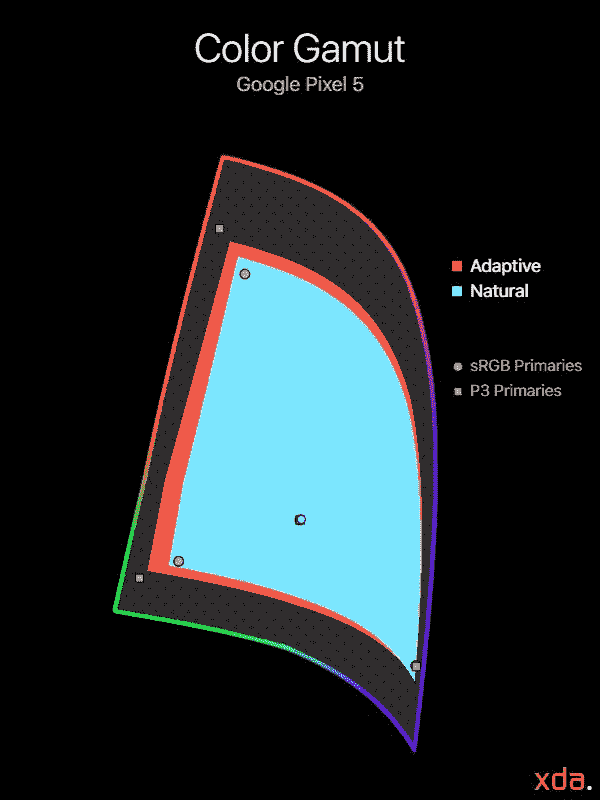
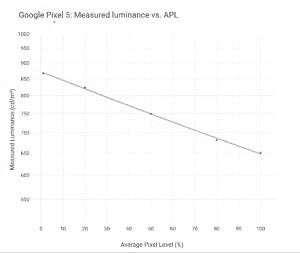
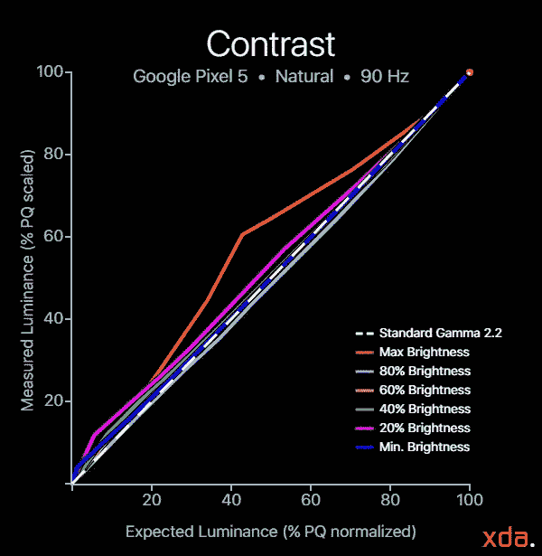
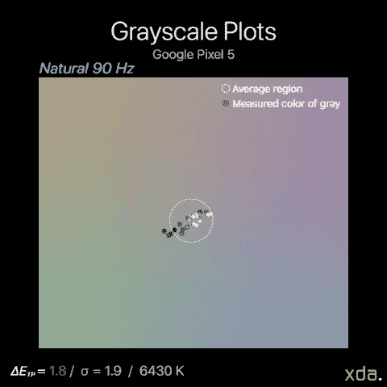

# 谷歌 Pixel 5 显示器评测:不愧为旗舰

> 原文：<https://www.xda-developers.com/google-pixel-5-display-review/>

对于谷歌 2020 年的旗舰产品，该公司已明确退出超高端智能手机类别，这类手机通常售价超过 1000 美元。似乎谷歌目前的口头禅坚持认为，它不需要尖端的硬件来创造一个*有用的*手机。但谷歌 Pixel 5 能否与其他公司的旗舰产品竞争是它自己的讨论点，我们在[的全面评论](https://www.xda-developers.com/google-pixel-5-review/)中对此进行了报道。我在这里只想谈谈现代手机中最昂贵的硬件:显示屏。

*我的谷歌 Pixel 5 是直接从谷歌商店买的。谷歌没有以任何方式补偿这一审查。*

## **谷歌 Pixel 5 显示屏评测集锦**

*   出色的近黑色色调控制(无黑色剪裁)
*   像样的色彩准确度和对比度
*   出色的白点和灰度精度
*   体面的峰值亮度
*   出色的 HDR10 再现能力

*   峰值亮度仍然落后于同等价格的竞争产品
*   低亮度下对比度和饱和度略有下降
*   省略 AmbientEQ
*   比目前的旗舰 OLEDs 更黑

谷歌 Pixel 5 立即以一种意想不到的方式从其前辈中脱颖而出:它实际上采用了一种现代的显示形式，具有真正统一的边框，每边约 4 毫米，这对安卓手机来说并不常见。谷歌继续为其旗舰产品使用柔性有机发光二极管基板，与他们在中端像素 a 系列中使用的刚性有机发光二极管相比，这种基板可以做得更薄，并具有更好的视角和偏振特性。柔性有机发光二极管的厚度还通过使发射像素更靠近防护玻璃(从而更靠近您的指尖)来增加光学清晰度，这有助于屏幕看起来更像纸和墨水。在过去几年中，大多数现代旗舰 OLEDs 都是由柔性基板制成的，但区分这一点很重要，因为它的光学优势在当前的显示测量中并没有显示出来。此外，谷歌 Pixel 5 上的前置摄像头切口似乎与显示屏齐平，而 Pixel 4a 上的摄像头与屏幕相比似乎略有凸起，组件周围有一个明显的银环。

Pixel 5 的 6 英寸显示屏可能会让一些人认为这是一款超大尺寸的设备，但它仍然是一款相对紧凑的设备。谷歌 Pixel 5 的机身实际上与所有较小尺寸的前代产品大小相同。显示器尺寸的大部分增加来自于沿垂直轴的边框的减少。与同样拥有 6 英寸显示屏的 Pixel 2 XL 相比，Pixel 5 确实感觉小了很多。在屏幕分辨率方面，谷歌 Pixel 5 包含 2340×1080 像素，约合每英寸 432 像素。对于较小的变体，过去的像素通常为每英寸 440 像素，因此与它们相比，像素密度的这种轻微降低应该不明显。然而，当我近距离观看显示器时，我会注意到一些彩色边缘，所以屏幕分辨率稍微高一点会更好。我更倾向于苹果的目标，即设定一个特定的像素密度(大约每英寸 460 像素)，并使用一个满足它的像素分辨率，同时最大化像素填充因子，以获得最佳的显示能效。

显示面板完全来自三星显示，硬件似乎比去年略有升级，以适应更高的峰值亮度。然而，显示驱动 IC 仍然与 Pixel 4 XL 的 (s6e3hc2)相同[，显示面板本身似乎是老一辈的三星有机发光二极管。这使得谷歌 Pixel 5 在峰值输出和能效方面落后于其他使用三星新一代有机发光二极管的旗舰产品，但它应该给谷歌一个机会来改进他们在其他领域的显示，我将在稍后进行探讨。在任何情况下，一个几乎没有缺点的完美显示器都会比一个输出稍多但有明显缺陷的显示器产生更好的用户体验。根据我的经验，我观察到三星显示的新款 OLEDs 遇到的质量控制问题比前几代产品多得多，所以谷歌跳过这一代产品的决定或许可以被视为一个积极因素。](https://www.xda-developers.com/google-pixel-4-4-xl-display-analysis/)

**采集数据的方法论**

为了从显示器中获得定量的颜色数据，我将特定于设备的输入测试模式转移到 Google Pixel 5，并使用 X-Rite i1Display Pro 测量显示器产生的发射，X-Rite i1Pro 2 分光光度计在其高分辨率 3.3 纳米模式下进行测量。我使用的测试模式和设备设置针对各种显示特性和可能改变我所需测量的潜在软件实现进行了修正。除非另有说明，我的测量通常是在禁用显示相关选项的情况下进行的。我使用

*constant power*

模式(有时称为

*equal energy*

图案)，与大约 42%的平均像素水平相关，以测量传递函数和灰度精度。测量发射型显示器时，不仅要测量恒定的平均像素水平，还要测量恒定的功率模式，这一点很重要，因为它们的输出取决于平均显示器亮度。此外，恒定的平均像素水平并不固有地意味着恒定的功率；我使用的模式满足这两者。我使用更高的平均像素水平(接近 50%)来捕捉较低像素水平和许多白色背景的应用程序和网页(像素水平较高)之间的中点。我使用最新的色差度量δ

*E[TP]* [(ITU-R BT.2124)](https://www.itu.int/dms_pubrec/itu-r/rec/bt/R-REC-BT.2124-0-201901-I!!PDF-E.pdf)

，这是一个

[overall better measure for color differences](https://www.ibc.org/publish/specifying-colour-tolerances-for-hdr-and-wcg-displays-/2449.article)

比δ

*E* [00]

这在我早期的评论中使用过，目前仍在许多其他网站的展示评论中使用。那些还在用δ的

*E* [00]

对于颜色误差报告，鼓励使用δ

*E[ITP.]*

Δ

*E[ITP]*

通常在计算中考虑亮度(强度)误差，因为亮度是完整描述颜色的必要组成部分。然而，由于人类视觉系统分别解释色度和亮度，我将我们的测试模式保持在恒定亮度，并且在我们的δ中不包括亮度(I/强度)误差

*E[ITP]*

价值观。此外，在评估显示器的性能时，将这两种错误分开是有帮助的，因为就像我们的视觉系统一样，它们属于显示器的不同问题。这样，我们可以更彻底地分析和理解显示器的性能。我们的颜色目标是基于 ITP 颜色空间，它比 CIE 1976 UCS 具有更好的色调线性，在感知上更均匀。我们的目标以 100 cd/m 的基准在整个 ITP 色彩空间中大致均匀地间隔开

²

白色级别，以及 100%、75%、50%和 25%饱和度的颜色。颜色是在 73%的刺激下测量的，假设伽马功率为 2.20，这相当于约 50%的亮度。对比度、灰度和颜色精度在显示器的整个亮度范围内进行测试。在 PQ 空间中，亮度增量均匀分布在最大和最小显示亮度之间。图表和图形也绘制在 PQ 空间中(如果适用),用于正确表示对亮度的实际感知。δ

*E[TP]*

值大约是 3

× the magnitude of Δ*E*[00] values for the same color difference. A measured color error Δ*E[TP]* of 1.0 denotes the smallest value for a just-noticeable-difference for the measured color, while the metric assumes the most critically-adapted state for the observer so as not to under-predict color errors. A color error Δ*E[TP]* less than 3.0 is an acceptable level of accuracy for a reference display (suggested from ITU-R BT.2124 Annex 4.2), and a Δ*E[TP]* value greater than 8.0 can be noticeable at a glance, which I've tested empirically.

HDR 测试模式是针对

[ITU-R BT.2100](https://www.itu.int/dms_pubrec/itu-r/rec/bt/R-REC-BT.2100-2-201807-I!!PDF-E.pdf)

使用感知量化器(ST 2084)。HDR sRGB 和 P3 图案与 sRGB/P3 原色均匀间隔，HDR 参考白色水平为 203 cd/m

² [(ITU-R BT.2408)](https://www.itu.int/dms_pub/itu-r/opb/rep/R-REP-BT.2408-2017-PDF-E.pdf)

，并且对于其所有模式，PQ 信号电平为 58%。所有 HDR 模式都是在 HDR 平均 20% APL 下用恒定功率测试模式测试的。

### **颜色配置文件**

Pixel 5 保持了谷歌的标准三种颜色配置:**自然**、**增强**和**自适应**，自适应是开箱即用的默认配置。

 <picture></picture> 

Color gamut for Google Pixel 5

所有三种颜色配置文件共享相同的白点，我在 6400 K 为我的 Pixel 5 测得。配置文件的色调映射也是相同的，目标是 2.20 的标准灰度系数。配置文件之间的唯一区别在于其目标色彩空间的原色:

**自适应**配置文件是谷歌 Pixel 5 的默认颜色配置文件，目标是一个红色和绿色原色的颜色空间，扩展到 sRGB 的颜色空间，但缺乏 DCI-P3。纯蓝色在所有三个轮廓之间是相似的，它们都共享相同的 sRGB-蓝色原色。这个概要文件的名字是一个误称，因为它没有任何“适应性”可言。这种命名可能会使许多用户认为配置文件会根据正在查看的内容来切换色彩空间。然而，事实完全不是这样；自适应配置文件类似于其他 Android 手机中的生动配置文件，只是增加了所有通用内容的颜色饱和度。

**自然**配置文件是手机的颜色精确配置文件，针对通用内容的 sRGB 色彩空间。该配置文件支持 Android 的颜色管理系统，该系统允许该配置文件使用高达 DCI-P3 的颜色来呈现内容。

**增强的**配置文件类似于自然配置文件，但*稍微*增强了每个原色的颜色。谷歌说，这个描述在每个方向上增加了 10%的色彩饱和度，尽管我没有实际测量这个描述有多准确。

对于 Pixel 2 和 Pixel 3 的用户来说，重要的是，与 Pixel 4 和更高版本中的自适应配置文件相比，这些手机的饱和和自适应配置文件具有更冷的白点。虽然 Pixel 2 和 Pixel 3 的饱和和自适应轮廓被校准到大约 7000 K 的白点，但 Pixel 4 和更高版本的目标是 6500 K 的行业标准，这将显得更温暖。不幸的是，谷歌没有为那些喜欢更冷的白点的人提供手动调整白点色温的选项，但令人欣慰的是，人类可以适应几乎任何白点，习惯标准 D65 白点比更冷的白点有好处。

### **亮度**

谷歌之前的 Pixel 设备在峰值显示亮度方面普遍表现平平。对于许多人来说，显示器的最大亮度是最重要的规格之一，如果不是最重要的规格的话。毕竟，如果显示屏不清晰，手机就没有任何用处。在智能手机吹捧全屏显示亮度为 700-800 尼特(100% APL)的世界里，谷歌推出了只能达到 450 尼特的旗舰产品 Pixel 4。因此，显示亮度已经成为像素行的障碍之一。

Pixel 4 系列的[更新](https://www.xda-developers.com/pixel-feature-drop-second-features-list/)通过最终实现其显示面板的高亮度模式，使这些设备更接近其竞争对手。这将全屏亮度从 450 尼特提高到了 550-600 尼特，这在发布时仍被认为是保守的旗舰产品，以今天的标准来看也很平庸。因此，为了与未来的设备竞争，谷歌需要迎头赶上。

 <picture></picture> 

Measured Luminance vs. APL for Google Pixel 5

*在这里，术语“平均像素水平”，或 APL，与显示器上点亮像素的面积同义，表示为总显示面积的百分比。像有机发光二极管这样的发射型显示器，亮度根据其发射的强度和像素面积而变化。“测量的亮度与显示面积”或“测量的亮度与窗口大小”都是更适合图表的名称，因为 APL 度量可能需要许多其他情况，但是 APL 已经被口语化地使用，并且在讨论显示器亮度时通常被理解。*

对于 Pixel 5，谷歌对显示屏亮度进行了适度的改善。在其 50% APL 中点，我测量了谷歌 Pixel 5 在自动亮度下的峰值约为 750 尼特(手动最大系统亮度为 470 尼特)，这些值与其竞争对手在校准颜色模式下的值相当。然而，在更高的 APL 下，谷歌 Pixel 5 表现出了比竞争对手更差的性能:在 80%的 APL 下，这大约是光主题应用的 APL，Pixel 5 仅输出约 680 尼特，而竞争对手可以达到约 800 尼特。Pixel 5 的这种亮度表现使其处于 Pixel 4 和其竞争对手之间，这对于 2020 年的旗舰智能手机来说似乎没有什么吸引力。最低亮度为 1.9 尼特的白色，与大多数竞争对手相同。

尽管谷歌 Pixel 5 在最大输出方面仍然落后于其他产品，但好消息是，我发现这个像素的亮度最终足够亮，在大多数阳光充足的条件下都可以清晰可见。在显示器亮度不令人满意的情况下，例如在加州夏天的阳光直射下，即使 LG G7 ThinQ 的 1000 尼特也不够用。

然而，额外的亮度净空对于提高显示色调映射的准确性和一致性是很重要的。最终，显示器受到其全屏/100% APL 亮度的严重限制，谷歌 Pixel 5 的亮度为 650 尼特。像其他旗舰产品一样，在 100% APL 下可以输出 800 尼特的更高亮度面板将允许 650 尼特的更高精度校准。我们看到，谷歌 Pixel 5 的峰值亮度随着屏幕 APL 的变化而显著变化，随着屏幕 APL 的增加，亮度下降。因此，我们可以预期色调映射性能也会随着屏幕上的 APL 而变化；亮度与 APL 的反比例关系意味着画面对比度将随着屏幕 APL 的增加而增加，这使得在这些亮度水平下的显示器校准变得复杂。在高亮度模式下，Pixel 5 的亮度范围为 1.9 至 470 尼特，谷歌可以保持显示器亮度恒定，而不管屏幕上的 APL 如何，这使得该公司可以高精度地校准显示器。但在最大亮度下，谷歌试图以校准一致性为代价，在较低的 APLs 下从面板中提取尽可能多的输出。

最后，为了谷歌的相机和“有益的”营销活动，在户外拍摄照片时，更高的峰值亮度对于提高相机取景器的准确性是不可或缺的，这将使像素相机的曝光和色调图控制更有用。

### **对比度和色调映射**

我不能夸大显示色调映射和对比度的重要性，也不能实际正确地评估它——感知量化器的出现让我们对亮度测量有了最好的了解。我认为显示器色调映射是显示器最重要的方面，色调映射不好的显示器绝对会破坏我的体验。糟糕的色调映射会导致阴影破碎、颜色过暗和/或显示褪色。幸运的是，谷歌 Pixel 5 上的所有三个配置文件共享相同的色调映射，这使得评估这一部分变得简单。90 Hz 和 60 Hz 模式下的色调映射略有不同，但大多数差异来自色调，因此我将只讨论 90 Hz，而在下一节中我将讨论 60 Hz。

 <picture></picture> 

Tone mapping for Google Pixel 5 @ 90 Hz; 42% APL ≈ 20% ADL

 *当使用 PQ 缩放和归一化轴查看色调映射时，我们可以更好地描绘感知对比度和显示变化。PQ 代表感知量化器，这是目前我们最好的亮度大小到人眼感知亮度刺激的感知线性映射。术语“平均显示亮度”或 ADL 是指显示器总面积上的平均预期亮度，表示为最大可能值的百分比，即全屏白色的亮度。*

像素 5 的色调映射以 2.20 的标准伽马功率为目标(除了在高亮度模式下)，这是精确色调和图像对比度的必要基线。在大多数情况下，我们看到谷歌 Pixel 5 *确实*准确地跟踪 2.20 伽马功率，有一些故障。

首先，最突出的轨迹是红色的最大亮度色调图曲线。我们看到它的色调映射似乎比标准的 2.20 gamma power 渲染的色调要亮得多，所以人们可能会认为谷歌 Pixel 5 在最大亮度下显得太亮了。然而，Pixel 5 的最大亮度仅在非常明亮的条件下才能看到，环境照明与显示器的感知对比度直接相关。当环境照明比显示器亮度亮得多时，显示器上的色调会显得相对较暗，因此为了补偿，显示器可以使色调变亮以抵消环境照明。这与增加显示器亮度以使显示器更清晰的原理相同；当您增加显示器亮度时，您会增加显示器的感知对比度。然而，如果显示器已经达到其峰值亮度，唯一的其他选择是增加色调的亮度，这就是像素 5 在这里所做的。这张色调图曲线显示了谷歌对感知对比度概念的良好理解，因此这一行为值得肯定。然而，正如前面的亮度部分所述，谷歌 Pixel 5 受到其全屏亮度峰值的限制，因此它会随着 APL 改变亮度，以最大化内容亮度。这导致最大亮度色调图曲线在较高 APL 时变得更陡和更暗，例如在以光为主题的应用程序中，这会降低较亮色调的效果。

在亮度光谱的另一端，较低亮度的色调图曲线显示了一些有问题的行为:

我们的 20% PQ-亮度色调图曲线为粉红色，与大约 10 尼特的白色水平相关联，显示像素 5 在其整个灰度级上呈现的颜色太浅。与最大亮度下的色调映射曲线不同，此亮度下的行为是不理想的。一般来说，人们保持他们的显示器亮度比他们周围的亮度亮或暗一个相对固定的差值，并且这两个亮度通常在同一范围内。因此，显示器色调映射应该在显示器的整个亮度范围内保持一致，除了极限(最大和最小亮度)，因为显示器可能无法变得足够亮或暗以满足用户的偏好。

在最低亮度下，Pixel 5 的色调图曲线(蓝色)显示了非常接近 2.20 的伽马功率的响应，并且在黑色附近有轻微的提升，以确保显示器不会修剪阴影。通常，这将是很好的色调映射行为，但是，与最大亮度的边缘情况相反，我们必须考虑周围环境光的亮度可能比像素 5 的最小亮度(1.9 尼特)的白色水平暗得多。房屋中的黑暗房间的照度通常低于 0.1 勒克斯，对于没有任何活动光源的房间，有时甚至低于 0.01 勒克斯。在这些条件下，在 1.9 尼特的显示器上观看一片白色，类似于在典型的办公室照明(约 200 勒克斯)下在 800-1000+尼特的显示器上观看，这对许多人来说都是不舒服和灼热的。这就是为什么黑暗模式对于夜间观看来说几乎是强制性的，除非你讨厌你的眼球。如果显示器与环境照明相比太亮，并且显示器不能变暗，那么显示器应该使色调*变暗*来补偿。但在这里，Pixel 5 的最小亮度色调图曲线，其 2.20 伽马功率响应可能会显得太亮，在黑暗的环境中会褪色。理想的行为是使色调映射曲线适应环境照明，但是到目前为止，据我所知还没有手机表现出这种行为。

Pixel 5 的 OLED 面板在其整个亮度范围内呈现零黑色破碎。

除了这两个问题之外，还有一个项目将谷歌 Pixel 5 与大多数其他显示器区分开来:Pixel 5 的 OLED 面板可以在其整个亮度范围内呈现第一步灰色(# 010101)*—*换句话说，显示器的*零*黑色挤压——这是我迄今为止只测量过 iPhones 的表现。

### **白平衡和灰度精度**

*R.I.P. AmbientEQ*

***灰度扩散为谷歌像素 5，自然轮廓***

*例如，如果 6400 K 光源接收太多来自绿色的成分而显得较冷，则 6300 K 光源比 6400 K 光源对 D65 光源更精确。沿着日光轨迹测量的白点和 D65 之间的色差度量δ*E[TP]T21 是目前白点准确度的最佳指标。**

谷歌在所有三种颜色配置文件之间共享相同的白点，类似于它的色调映射，这再次简化了我的测量和评估。

我们的像素 5 测量其白点非常准确。在 Pixel 5 的亮度范围内，颜色误差δ*E[TP]的测量值范围为 0.5 到 1.2，平均相关色温为 6400 K。这与 D65 标准相符，明显比我测量的其他一些旗舰产品更接近，这些旗舰产品在其校准显示模式下通常倾向于 6300 K。Pixel 5 的白点测量的一致性也非常出色。*

更令人印象深刻的是，我们的 Pixel 5 单元展示了相当严格的灰度校准。根据我的测量，所有灰色的色调报告的颜色误差δ*E[TP]*小于其各自显示器亮度的灰色平均颜色的 3.0。整个像素 5 的亮度范围都是这种情况。这意味着，对于任何单一给定的显示器亮度，我们的 Pixel 5 单元都没有显示出不同的灰色色调，这通常在查看界面中具有多层的深色主题应用程序时最为明显。这一壮举在 Android 显示器中非常罕见，包括三星 Galaxy 旗舰的显示器。请注意，这并不意味着谷歌 Pixel 5 相对于 D65 没有*或*色彩，只是在给定的系统亮度下，灰色保持相同的色彩。

关于这一点，在不同的亮度设置之间可能会有一些明显的灰色着色。我们的汇总图表结合了 Pixel 5 亮度范围内的灰度图，显示了绿色和洋红色之间较暗色调的一些扩散，超出了平均区域。我们可以看到，在 60%和 20% PQ-brightness 之间，灰度略呈绿色，当从其他亮度设置调整到这些亮度设置时，这种色调变化可能是可见的。它在我们的设备上并不明显，比我从其他显示器上看到的要好很多，但它确实存在，并且强度可能会根据您设备的制造差异而有所不同。

谷歌 Pixel 5 在近黑色色调渲染方面独树一帜

有趣的是，最小亮度灰度校准绝对出色——我可以说，它是完美校准的，颜色误差δ*E[TP]*和扩散小于 1.0。我提到这一点是因为最小亮度校准通常是最困难的，因为我们要在这么低的信号上对抗大量的噪声；这显然是谷歌的一个重点，尤其是考虑到他们以前的像素在这里缺乏性能。这一壮举，以及完全没有黑色剪裁，使 Pixel 5 在近黑色色调渲染方面处于自己的联盟(与 iPhone 并列)。

#### **刷新率色差**

当显示器静止或播放≤60 FPS 的内容时，谷歌 Pixel 5 的平滑显示功能将从 90 Hz 切换到 60 Hz。如果显示器亮度低于 25 尼特(14/255 亮度设置)，像素 5 将保持固定在 90 赫兹。在高刷新率显示器中，60 Hz 和 90/120 Hz 模式之间的颜色校准可能存在明显差异。

 <picture></picture> 

Grayscale difference between 120 Hz and 60 Hz

上图在 25 尼特以上的 90 赫兹图和 60 赫兹图之间切换，显示了谷歌 Pixel 5 切换到 60 赫兹显示模式时的色差。对于中间色调和较暗的颜色，我们看到轻微的绿色偏移，但从我的使用来看，这种偏移几乎看不到。这些差异远不如在 Pixel 4/4 XL 或[一加 8 Pro](https://www.xda-developers.com/oneplus-8-pro-display-analysis-premium-hardware-at-a-cost/) 上看到的[显著。一如既往，制造差异起着很大的作用，另一个 Pixel 5 单元可能会有与我们在我们的产品上测量的结果大不相同的结果。](https://www.xda-developers.com/google-pixel-4-4-xl-display-analysis/)

### **色彩准确度**

***sRGB 色彩准确度图为谷歌像素 5，自然轮廓图***

谷歌 Pixel 设备在其校准显示模式下的颜色准确度通常表现很好，所以我预计 Pixel 5 不会有任何问题。然而，虽然 Pixel 5 的颜色精度本身并不差，但我很惊讶地看到我发现的一些错误。

在 40% PQ-brightness 以下，我们开始看到色域和饱和度压缩，20% PQ-brightness 左右问题最多。结合在这一点上发现的更亮的色调映射和对比度，谷歌 Pixel 5 在这种显示亮度下确实显得稍微有点褪色。这个问题不是*像*一样在最低亮度下普遍存在，但是 Pixel 5 在 20% PQ 亮度下的微弱显色令人失望。

在最大亮度(高亮度模式)下，像素 5 显示红色和橙色的色调错误，这会导致肤色看起来太红。高饱和度的紫色也太蓝了。整个色域存在轻微的过饱和，但这是高亮度模式的理想行为，可以抵消高环境照明导致的部分色域压缩。

在 60%和 80% PQ-brightness(90-250 尼特)之间，涵盖了参考观看环境的显示亮度范围，Pixel 5 的色彩准确度很好，没有明显的色彩误差。

***P3 色彩准确度图为谷歌像素 5，自然轮廓图***

Pixel 5 的显示器 P3 色彩准确度与其 sRGB 色彩准确度非常相似，具有相似的色彩误差特征，所以它很不错。Android 上几乎没有任何非 HDR·P3 的内容，Android 相机仍然可以捕捉 sRGB 的颜色，所以这些测量方法目前没有太大用处。这个[在未来](https://www.xda-developers.com/google-camera-coming-with-wide-color-capture-support-possibly-with-google-pixel-4/)可能会改变，所以拥有像样的 P3 精度对于未来验证仍然是有用的。

### **HDR 回放**

色彩再现的基础始于对比度，对于 HDR 内容，对比度主要遵循 ST.2084 PQ 曲线。哦，Pixel 5 的表现如何:它的显示以教科书般的精度遵循 PQ 曲线，一直到其峰值亮度，对于 HDR 内容来说大约是 700 尼特。在黑色附近还有一个小升降机，以确保黑色不会被夹住。关于 Pixel 5 的 HDR 对比度响应，我真的没有什么好说的了——只要看看它跟踪目标有多干净就知道了。这是在 20% APL 和恒定显示功率下测得的，许多高端消费电视的 PQ 响应没有这么严格(通常是因为它们有更大的功率限制)。

然而，就像所有其他机器人一样，HDR10 色调映射是有缺陷的。即使有适当的 1K 或 4K 最大亮度元数据，Android 也会忽略它，色调映射的峰值亮度衰减高达 100% PQ 信号电平。HDR10 内容的最大值为 1，000 尼特，因此显示器的色调映射不应超过 1，000 尼特，这是 75% PQ 信号电平。在 75% PQ 信号电平下，像素 5 仅输出 560 尼特，这意味着 560 尼特而不是 700 尼特是像素 5 对于 HDR10 内容的有效峰值亮度。所有的机器人似乎都受到这个问题的影响，所以谷歌要对此负责。

峰值亮度可能是一个弱点，略低于 HDR10 标准能够提供的 1，000 尼特。然而，只有当正在观看的内容包含超过 700 尼特的亮点时，这才会成为一个问题，这在目前的大多数节目和电影中并不常见。此外，对于小镜面高光，700 尼特和 1000 尼特之间的差异实际上并不明显(但杜比视觉的 2000+尼特会让你陷入困境)。然而，由于 HDR10 色调映射问题，HDR 高光性能受到影响。

Pixel 5 的 DCI-P3 色彩精度非常出色，这令人惊讶，因为它的正常显示 P3 精度并不令人印象深刻。在整个 DCI-P3 色域上的平均颜色误差δ*E[TP]小于 3.0，这对于参考显示器来说是可接受的性能。我能挑剔的只有两点，分别是 100%红和 100%蓝，但这些最大误差相对较小。*

不幸的是，谷歌 Pixel 5 不支持杜比视觉，而是只支持 HDR10 和 HDR10+(后者目前似乎是一个死标准)。如果显示器的 HDR10 回放质量很好，那么杜比视觉的省略不会有什么大不了的，因为杜比视觉内容提供了 HDR10 基础层。但是如果没有杜比视觉支持，我们就只能使用 Android 无能的 HDR10 色调映射。

谷歌 Pixel 5 有一个非常好的显示屏，没有最先进的面板硬件，这是谷歌迄今为止最好的显示屏。这句话通常会在读者中引起一些眼球转动，因为为什么最新的旗舰不会是最好的呢？许多产品通常会在修订后的某些方面出现倒退。但在这种情况下，谷歌用一个受欢迎的改进装饰了它的旗舰产品，而没有让我想到“什么鬼东西？”不足之处。

Pixel 5 可能没有最先进的面板硬件，但它是今年最佳显示器之一的竞争者

我先收回这句话:我确实想念 AmbientEQ，我认为自动显示白平衡是一个很棒的功能。然而，我完全满足于拥有一台没有它的显示器，只要它的 D65 白点精度与我的 Pixel 5 一样准确，尽管我确信其他人可能想要一个调整白平衡的选项。

回到我的观点:从我审查这款手机开始，没有一个突出的问题让我希望我使用的是不同的显示屏。事实上，谷歌 Pixel 5 是我最近用过的*问题最少的*显示器之一。没有深色色调的粗糙着色，没有切换刷新率时令人讨厌的闪烁，没有面板一致性问题，没有让我挠头的巨大校准失误(尽管有 HDR10 色调映射问题)。由于上述所有问题，一加 8 Pro 及其卓越的显示硬件对我来说不可用。我对面板瑕疵非常敏感；可能我只是运气好，但我的 Pixel 5 的面板是原始的，没有瑕疵。

我通常不会谈论面板的一致性，只是因为从一个零售单位推断的不可靠性，但我觉得有必要指出这一点，因为今年以来，几乎所有我审查过的手机都有面板缺陷。谷歌是我期望从其获得完美面板的最后一家*原始设备制造商。从被称为 Pixel 2 XL 的[黑色碾压悲剧中，Pixel 5 近乎黑色的性能让我大吃一惊。这是一个非常谨慎的校准转变，并侧重于谷歌的阴影色调控制。谷歌 Pixel 4(非 XL)给了我们这种性能的第一个暗示](https://www.xda-developers.com/pixel-2-xl-xda-display-analysis/#:~:text=Android%2011-,Pixel%202%20XL%20XDA%20Display%20Analysis%3A%20A%20Well%2DCalibrated,Package%20with%20Some%20Critical%20Mistakes&text=The%20screen%20looks%20very%20sharp,a%20PenTile%20Diamond%20Pixel%20arrangement.)，但我对它的持久力感到犹豫，因为 Pixel 4 XL 没有表现出同样的性能。我曾担心这可能只是 Pixel 4 的 LG 面板相对于 Pixel 4 XL 的三星面板的侥幸，但看到它已经得到了改善，并被带到了 Pixel 5 的三星显示器上，Pixel 5 与 Pixel 4 XL 共享相同的 DDIC，这让我相信这是谷歌的所作所为。*

**[谷歌 Pixel 5 论坛](https://forum.xda-developers.com/pixel-5)**

似乎谷歌 Pixel 5 的普遍共识是，它是对以前 Pixel 手机的真正改进。谷歌在他们熟悉的部件上尽最大努力，他们继续专注于构成实用智能手机的各个方面。在显示器方面，Pixel 5 的色调性能已经得到了改善，几乎超过了所有其他旗舰产品。如果谷歌的工厂对你有利，并且你的 Pixel 5 的显示器与我的显示器性能相似，那么，尽管没有包装最新的三星面板，你仍然拥有我认为最完美的智能手机显示器之一。根据 XDA 的 Adam Conway 的说法，你还可以获得一流的软件体验、一流的相机软件和超越基准分数的性能。

### 谷歌像素 5

Pixel 5 可能没有最先进的面板硬件，但它拥有谷歌迄今为止最好的显示屏。

**Affiliate Links**

Amazon

[View at Amazon](https://www.amazon.com/Google-Pixel-Resistant-Smartphone-Ultrawide/dp/B08H8Y7W47/?tag=xda-4oqv7to-20&ascsubtag=UUxdaUeUpU30576&asc_refurl=https%3A%2F%2Fwww.xda-developers.com%2Fgoogle-pixel-5-display-review%2F&asc_campaign=Short-Term)

| **规格** | **谷歌像素 5** |
| --- | --- |
| **类型** | 灵活的有机发光二极管五边形菱形像素 |
| **制造商** | 三星显示公司。 |
| **尺寸** | 5.4 英寸乘 2.5 英寸6.0 英寸对角线13.5 平方英寸 |
| **决议** | 2340×108019.5:9 像素宽高比 |
| **像素密度** | 每英寸 305 个红色子像素每英寸 432 个绿色子像素每英寸 305 个蓝色子像素 |
| **像素视敏度距离** *视力为 20/20 的可分辨像素距离。典型的智能手机观看距离约为 12 英寸* | < 8.0 英寸为全彩图像< 11.3 英寸为非彩色图像 |
| **黑色削波阈值** *要削波为黑色的信号电平* | 0.4% @最大亮度<0.4% @ min brightness |

| **规格** | **自然** | **自适应** |
| --- | --- | --- |
| **亮度** | **最小值:**1.9 尼特**峰值 100% APL:**651 尼特**峰值 50% APL:**749 尼特**峰值 HDR 20%杀伤人员地雷:**696 尼特 |
| **伽玛** *标准是 2.20 的直线伽玛* | 1.89–2.22 |
| **白点** *标准是 6504 K* | 6400 Kδ*E[TP]= 1.0* |
| **色差***δ*E[TP]*值在 10 以上显得δ*E[TP]*值在 3.0 以下显得准确δ*E[TP]*值在 1.0 以下显得完美* | **sRGB:**平均δ*E[TP]*= 3.9**P3:**平均δ*E[TP]*= 4.3 | **比 sRGB** 的色域大 15%+12%红色饱和度，略带橙色+25%绿色饱和度+5%蓝色饱和度，略带青色 |