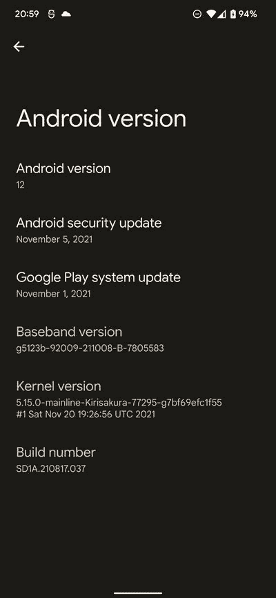

# 谷歌 Pixel 6 和 Pixel 6 Pro 看到了主流 Linux 内核支持的工作

> 原文：<https://www.xda-developers.com/google-pixel-6-6-pro-mainline-linux-kernel-support/>

谷歌 Pixel 6 和 Pixel 6 Pro 是第一批由公司内部的 T2 张量 SoC 驱动的智能手机。他们还附带了开箱即用的 [Android 12](https://www.xda-developers.com/android-12/) ，如果你看一下[内核来源](https://www.xda-developers.com/google-pixel-6-6-pro-factory-images-kernel-source-code/)，你可以在引擎盖下找到 Linux 内核 5.10。如果你已经为了售后开发而购买了其中一款设备[，那么你会很高兴地知道谷歌最近开始为 Pixel 6 家族填充一个主线 Linux 内核 5.15 分支。更有趣的是，XDA 公认的开发者](https://www.xda-developers.com/google-pixel-6-6-pro-first-custom-kernel/) [Freak07](https://forum.xda-developers.com/m/freak07.3428502/) 已经成功地编译并启动了设备二人组的主线内核版本。

 <picture></picture> 

The Google 6 Pro running the mainline Linux kernel 5.15

Android 设备拥有主流 Linux 内核支持有什么令人兴奋的？简而言之，这有点类似于 Project 通过将操作系统框架从供应商实现中分离出来而对 Android 进行三重模块化，但是[具有更大的范围](https://www.xda-developers.com/android-shifting-upstream-first-development-model-linux-kernel/)。随着成功纳入主流 Linux 内核，Pixel 6 家族将能够引导谷歌(或[kernel.org](https://www.kernel.org/))发布的未来内核版本，而**没有变化**，这使得跟上 AOSP 版本，甚至[普通 Linux 发行版](https://www.xda-developers.com/oneplus-6-6t-mainline-linux-kernel-support/)变得容易得多。最终，这是通用内核映像(GKI)项目的[真正精髓:隔离 SoC 供应商和 OEM 对插件模块的定制，并消除树外代码，以便谷歌可以直接向最终用户推送内核更新。](https://www.xda-developers.com/google-generic-kernel-image/)

 <picture></picture> 

Google Pixel 6

Pixel 6 配备了谷歌新的张量芯片、现代设计和旗舰相机。

 <picture></picture> 

Google Pixel 6 Pro

Pixel 6 Pro 是较大的兄弟，配有谷歌的新张量芯片、现代设计和额外的远摄相机。

话虽如此，请记住，Google Pixel 6 的整个主线内核离稳定标签还很远。正如[通过*freak 07*指出的，谷歌也](https://twitter.com/mile_freak07/status/1462166656441098240)[为](https://android-review.googlesource.com/c/kernel/common/+/1878437) [Android 13](https://www.xda-developers.com/google-android-13-t-tiramisu-dessert-name/) 奠定了通用 Linux 内核 5.15 的基础，这可能与下一个 Android 版本 bump 旁边即将到来的设备主要内核更新有关，或者它可能完全是为了未来的【Pixel 设备。

**[谷歌 Pixel 6 XDA 论坛](https://forum.xda-developers.com/f/google-pixel-6.12311/) ||| [谷歌 Pixel 6 Pro XDA 论坛](https://forum.xda-developers.com/f/google-pixel-6-pro.12313/)**

尽管如此，由于 *Freak07* 提供的概念验证内核构建，你现在可以在 Pixel 6 和 Pixel 6 Pro 上启动主线 Linux 内核 5.15，而不会弄乱代码。根据开发者的说法，Wi-Fi 通话和通过 USB-C 的音频输出等许多东西目前都被破坏了，但如果你可以忽略这些，你可以在你的手机上首次体验最新的长期支持(LTS) Linux 内核。要了解更多，请查看下面链接的 XDA 主题。

**[谷歌 Pixel 6 和 Pixel 6 Pro 的主线 Linux 内核 5.15——XDA 下载与讨论线程](https://forum.xda-developers.com/t/4364699/)**