# 谷歌 Pixel 6 Pro vs 苹果 iPhone 13 Pro:相机枪战

> 原文：<https://www.xda-developers.com/google-pixel-6-pro-vs-apple-iphone-13-pro-camera-shootout-comparison/>

谷歌 Pixel 经常被称为“安卓的 iPhone”，主要是因为谷歌据称是从零开始设计和制造 Pixel 的，还因为谷歌*制造安卓，*这给了 Pixel 一种只有苹果才能提供的软硬件协同的感觉。但这不是真的，至少在早期是这样。第一款 Pixel 基本上是由 HTC 使用 HTC 的剩余零件制造的，直到几个月前，Pixel 手机仍然从第三方供应商那里获得其大脑 SoC。但是[谷歌像素 6](https://www.xda-developers.com/google-pixel-6/) 改变了一切。谷歌现在对其硬件生产有了更多的控制，这是第一款运行谷歌自主设计的 SoC Tensor 的手机。这意味着谷歌 Pixel 6 终于成为了*，*安卓的 iPhone。

就像苹果对 iPhone 13 系列所做的一样，谷歌对 Pixel 6 的相机硬件进行了显著改进(两家公司在过去几年都顽固地抵制追逐相机硬件趋势)，因此今年两款手机之间的相机比较是迄今为止最有趣的。具体到摄像头，谷歌 Pixel 6 Pro 与苹果 iPhone 13 Pro 相比究竟如何？和我们一起探索这个精确的问题，看看哪一款手机的照相功能更好。

 <picture></picture> 

Google Pixel 6 Pro

Pixel 6 Pro 是较大的兄弟，配有谷歌的新张量芯片、现代设计和额外的远摄相机。

### 点击展开:谷歌 Pixel 6 Pro 和苹果 iPhone 13 Pro:规格

## 谷歌 Pixel 6 Pro 和苹果 iPhone 13 Pro:规格

| 

规范

 | 

谷歌 Pixel 6 Pro

 | 

苹果 iPhone 13 Pro 和 iPhone 13 Pro Max

 |
| --- | --- | --- |
| **打造** | 

*   铝制中框
*   大猩猩玻璃 Victus 回
*   大猩猩玻璃 Victus 正面

 | 

*   不锈钢中框
*   玻璃正面和背面
*   前玻璃的“陶瓷护罩”

 |
| **尺寸&重量** | 

*   163.9 x 75.9 x 8.9 毫米
*   210 克

 | 

*   iPhone 13 Pro:
    *   146.7 毫米 x 71.5mm 毫米 x 7.65mm 毫米
    *   204 克

 |
| **显示** | 

*   6.71 英寸 AMOLED
*   3120 x 1440 像素
*   可变 120Hz 可变刷新率

 | 

*   超级视网膜 XDR 有机发光二极管:
    *   iPhone 13 Pro: 6.1 英寸
    *   iPhone 13 Pro Max: 6.7”
*   推广 120Hz 可变刷新率

 |
| **SoC** | 谷歌张量 | 苹果 A15 仿生 |
| **闸板&存放** |  | 

*   RAM 未公开
*   128GB/256GB/512GB/1TB

 |
| **电池&充电** | 

*   5003 毫安时
*   高达 30W 的有线快速充电
*   高达 23W 的无线充电

 | 

*   电池尺寸未透露；监管文件中的大致大小:
*   高达 20W 的有线充电
*   最高 7.5W 的无线充电
*   MagSafe 充电功率高达 15W

 |
| **安全** | 光学显示指纹读取器 | Face ID |
| **后置摄像头** | 

*   **初级:** 50MP 宽，三星 GN1，f/1.57，1/1.31”
*   **二级:** 12MP 超宽，f/2.2
*   第三级:48MP 潜望镜，f/3.5

 | 

*   **初级:** 12MP 宽，f/1.5 光圈，1.9μm
*   **次要:** 12MP 超宽，f/1.8 光圈
*   **第三:** 12MP 长焦，3 倍光学变焦，f/2.8
*   激光雷达相机

 |
| **前置摄像头** | 11MP | 12MP 原深感摄像头系统 |
| **端口** | USB-C | 闪电 |
| **音频** | 立体声扬声器 | 立体声扬声器 |
| **连通性** | 

*   5G(毫米波)
*   支持 4x4 MIMO 和 LAA 的千兆级 LTE
*   支持 2x2 MIMO 的 Wi-Fi 6 (802.11ax)
*   蓝牙 5.0
*   国家足球联盟

 | 

*   5G(低于 6 GHz 和毫米波)
*   支持 4x4 MIMO 和 LAA 的千兆级 LTE
*   支持 2x2 MIMO 的 Wi-Fi 6 (802.11ax)
*   蓝牙 5.0
*   国家足球联盟

 |
| **软件** | 安卓 12 | iOS 15 |
| **其他功能** | 双物理 SIM | 双物理 SIM 或双 eSIM 支持 |

***关于这篇评测:**这篇相机对比是在对 XDA 购买的一台谷歌 Pixel 6 Pro 和苹果提供的一台 iPhone 13 Pro 进行了为期一周的测试后撰写的。谷歌爱尔兰公司确实向我的同事亚当·康威提供了一个 Pixel 6 Pro 审查单元，但它没有用在这一块。这两家公司在这篇文章中都没有任何投入。*

* * *

## 谷歌 Pixel 6 Pro vs 苹果 iPhone 13 Pro:主摄像头

谷歌 Pixel 6/6 Pro 依赖于来自三星的 50MP GN1 传感器。这是一个在过去几个 Android 手机(主要是 Vivo 的)中使用的传感器，效果很好。其 1/1.31 英寸的大尺寸可以吸收更多的光线，并通过更浅的聚焦板拍摄，以增加景深。像素宁滨将四个像素的数据合并成一个大像素，进一步改善了 Pixel 6 Pro 的 1250 万像素图像。

与此同时，iPhone 13 Pro 使用 1200 万像素的主摄像头，配有定制的索尼传感器。苹果没有公布图像传感器的尺寸，但计算得出的结论是，它是一个 1/1.5 英寸的传感器，所以比 Pixel 6 Pro 的小一点。但它的 f/1.5 光圈比 Pixel 6 Pro 的 f/1.8 更快。

在一周内用每部手机拍摄了 500 多张照片后，我注意到了一些总体趋势，这些趋势适用于主相机拍摄的大多数照片:

*   如果我放大和像素窥视，Pixel 6 Pro 的图像几乎总是更清晰/更详细。
*   Pixel 6 Pro 的图像往往有较冷的蓝色调，而苹果有较暖的黄色调。
*   然而，情况并非总是如此:有时 iPhone 13 Pro 会调高对比度以获得更醒目的颜色，这是过去的 iPhone 所没有的。
*   对于特写镜头，Pixel 6 Pro 的对焦衰减更强，意味着更自然的散景。
*   Pixel 6 Pro 始终比 iPhone 更亮，这可能是好的也可能是坏的。

### 主相机，光线充足的场景:颜色，对比度，清晰度

这第一张照片很简单，在理想的光线条件下拍摄。两部手机捕捉到了非常相似的图像。你已经可以看到 Pixel 的照片中的阴影比 iPhone 的照片略暗。但是因为这是一个非常明亮的场景，所以差别很小。

然而，放大 100%，我们可以看到 Pixel 6 Pro 的拍摄更加锐利。几乎每个镜头都会出现这种情况。

 <picture>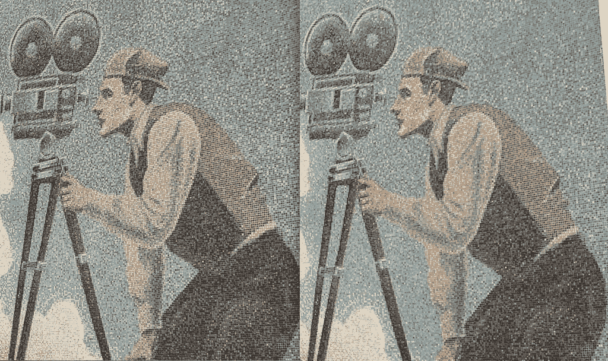</picture> 

100% crops, Pixel 6 Pro (left); iPhone 13 Pro (right).

接下来，让我们转到一个稍微更有挑战性的镜头。这个场景有更多的对比，这要归功于遮阳篷/天篷的随机补丁，以及照片右侧边缘被建筑二楼步行路径覆盖的咖啡店。所以我们在同一张图像的不同部分得到了一些非常不同的光照情况。

我们可以看到一个更激烈的例子，像素使阴影变亮了更大的幅度，这可能是由于像素摄像头能够吸引更多的光线和谷歌更具侵略性的 HDR 的结合。对于这个特殊的镜头，因为照明和阴影区域之间的对比度还没有那么大，我更喜欢像素 6 的镜头。前景中的植物细节更好，你可以在阴影下清楚地看到更多的咖啡店入口，特别是如果你像下面的作物一样放大 100%。

 <picture>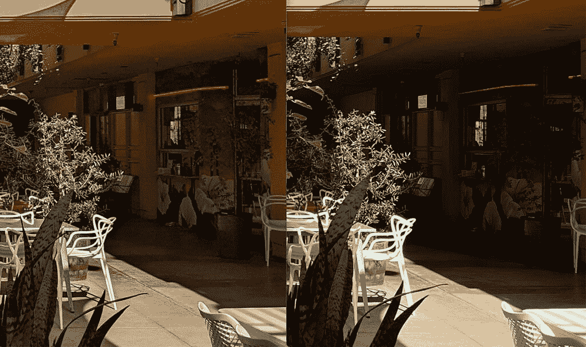</picture> 

Pixel 6 Pro (left); iPhone 13 Pro (right).

但谷歌更强大的 HDR 有时会与之背道而驰。对于一些场景，对比度和阴影增加了照片的气氛，就像下面这张明亮的橙色结构的照片。我更喜欢 iPhone 的图像，因为柔和的颜色结构和较深的阴影之间有更大的对比度。这只是一个更具视觉冲击力的镜头。有趣的是，iPhone 还人为地调高了对比度，以使照片更加流行。与 iPhone 的照片相比，这种结构更接近像素照片中表现的颜色，同样，那天的天空也不像 iPhone 的照片那样完美无瑕。在过去几年，这肯定不会是这样的情况，但苹果真的改变了 iPhone 13 Pro 的相机处理。

不过还是那句话，放大，Pixel 6 Pro 的镜头只是更锐利而已。这可能是因为 Pixel 6 Pro 有 5000 万像素的数据可供使用，而 iPhone 13 Pro 只有 1200 万像素。

 <picture>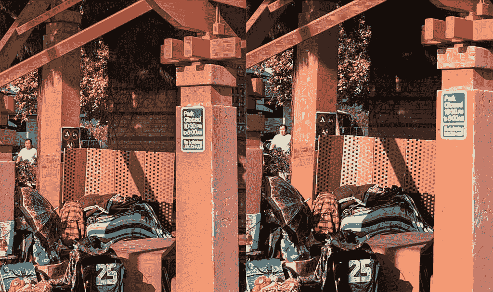</picture> 

Pixel 6 Pro (left); iPhone 13 Pro (right).

在下一集，我们移到一个更高对比度的场景，直接拍摄太阳。我再次发现 iPhone 的照片更引人注目，因为阴影更暗。在这样的镜头中，前景中的物体应该被阴影浸透。

但如果我们转到*极端对比度*的照片，就像下面的这张，我们会看到 iPhone 13 Pro 根本没有找到合适的平衡，完全将天空吹到窗外，只是为了恰当地突出棕色的架子。

### 主相机，特写镜头:清晰度，景深

苹果对 iPhone 13 Pro 手机获得比过去几年更大的传感器大做文章。虽然 iPhone 13 Pro 的 1/1.5 英寸图像传感器确实比以前的 iPhone 大得多，但它仍然小于几乎所有安卓旗舰机使用的传感器。Pixel 6 Pro 中使用的 GN1 传感器的 1/1.31 英寸肯定更大——这意味着它不仅可以吸收更多的光线，而且如果我们近距离拍摄物体，它的自然散景景深更浅。

这在下面的图片中很明显，因为墨西哥甜点(墨西哥帕莱塔冰棒奶昔)和背景中我的朋友之间有更多的分离。额外的深度增加了镜头的戏剧性和天赋，突出了甜点是节目的明星。

是的，如果我们放大，像素的镜头也更详细。不仅在帕莱塔冰棒上可以看到更好的质地，在鲜奶油上也是如此。

 <picture>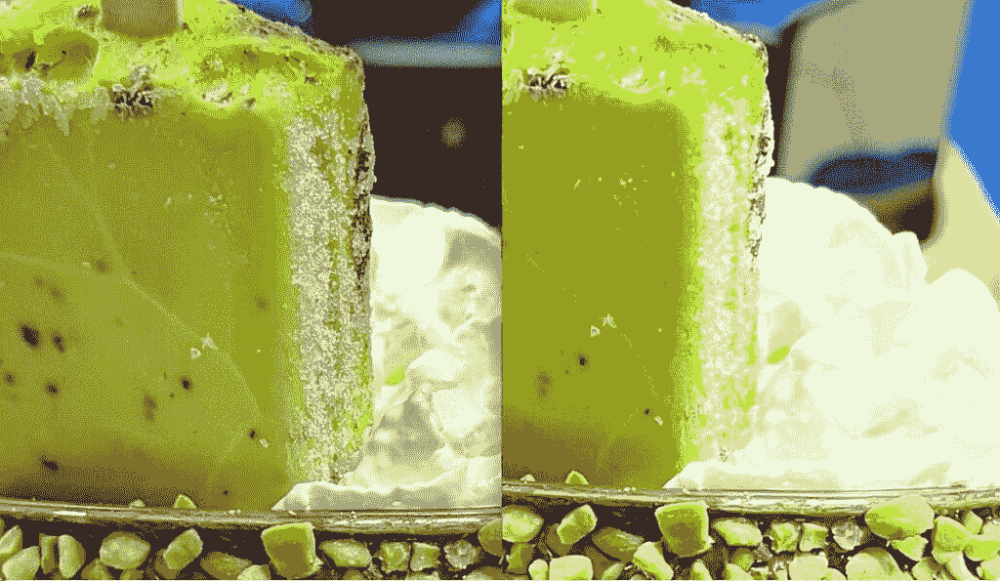</picture> 

Pixel 6 Pro (left); iPhone 13 Pro (right).

这是自然散景拍摄的另一个例子。

以及百分之百的收成。像素的拍摄再次更加清晰。

### 主相机，低光场景:动态范围，颜色，噪声

接下来，让我们转移到弱光拍摄条件。默认情况下，如果环境光不足，Pixel 6 Pro 和 iPhone 13 Pro 都会自动打开夜间模式。Pixel 6 Pro 因为有更大的传感器，所以不像 iPhone 13 Pro 那样经常需要夜间模式，但当它确实需要夜间模式时，Pixel 6 Pro 通常会花费长得多的时间来拍摄。iPhone 13 Pro 的自动夜间模式最多为 3 秒，而 Pixel 6 Pro 最多可以达到 5 或 6 秒。

如果环境光线不足，Pixel 6 Pro 和 iPhone 13 Pro 都会自动打开夜间模式。但 Pixel 6 Pro 因为有更大的传感器，所以不需要经常使用夜间模式

这里的每一个镜头——就像整篇文章中的每一个镜头一样——我都是自动拍摄的，没有任何手动调整。因此，我完全由手机决定是否在这些低光拍摄中使用夜间模式。这意味着模仿普通用户的行为，这些人只是想要一个易于使用的相机，而不需要识别何时激活某些设置。这是两款手机的目标受众，这也是我们判断它们的标准。

这第一组是在日落后不久拍摄的，因为唐人街有如此多的霓虹灯，这只是一个适度的低光镜头。我们可以看到 iPhone 图像的颜色明显更大胆(天空更蓝了)，这要感谢前面提到的苹果决定像三星一样处理颜色的随机情况。这是一个比 Pixel 更引人注目的照片，但 iPhone 13 Pro 在处理颜色方面的不一致真的很奇怪。值得注意的是，iPhone 13 Pro 开启了短暂的一秒钟夜间模式，而 Pixel 6 Pro 只是照原样拍摄。

放大到 100%，我们可以看到 iPhone 的颜色和对比度看起来更具视觉冲击力，但也有更多的噪音，特别是如果你看霓虹灯下照片的左下角。

 <picture>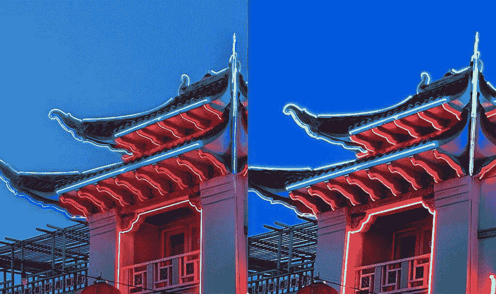</picture> 

Pixel 6 Pro (left); iPhone 13 Pro (right).

下一集，我们转到一个更黑暗的场景，晚上 10 点在洛杉矶市中心，只有街灯照亮了这个小公园。这两款手机都需要夜间模式，但 iPhone 13 Pro 能够在两秒内捕捉到照片，而 Pixel 6 Pro 需要三秒多一点。Pixel 6 Pro 比 iPhone 13 Pro 产生更多的镜头光晕，但这可以被视为一种风格选择。

我们可以看到 iPhone 拍摄的噪音更大，但树叶看起来更自然一些。在像素的拍摄中有点过度处理。

 <picture>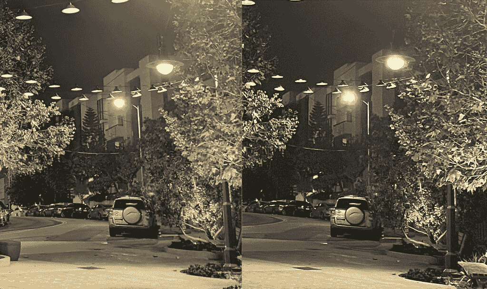</picture> 

Pixel 6 Pro (left); iPhone 13 Pro (right).

下一组照片是午夜时分在唐人街一条非常黑暗的街道上拍摄的，大部分光线来自这座寺庙。这是我们看到 Pixel 的冷色调与 iPhone 的暖色调相比的地方。在我看来，在现实生活中，iPhone 拍摄更好地再现了色彩，但在我看来，像素拍摄看起来更好。我们还可以看到 iPhone 镜头挣扎着曝光所有不同的灯，吹灭了寺庙右侧的红灯笼。但这就是为什么前面提到的 iPhone 随机打出颜色的情况令人困惑，因为大多数时候，iPhone 的颜色更柔和，更自然。iPhone 使用了三秒钟的夜间模式，而像素拍摄需要近五秒钟。

以 100%观看这些照片，两张照片在细节方面旗鼓相当，iPhone 照片显示的噪点更多。

 <picture>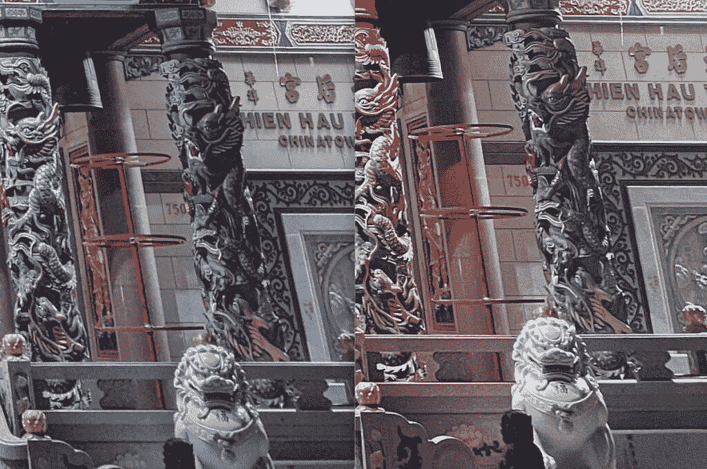</picture> 

Pixel 6 Pro (left); iPhone 13 Pro (right).

下一组是从行驶中的汽车内部拍摄的，真实地展示了这两款手机的主摄像头有多棒。首先，几乎没有运动模糊，因为快门响应快。两台相机都很好地曝光了天空和灯光，同时仍然保持较暗的区域(车内的帽子)足够亮。我们再次看到 Pixel 的镜头比 iPhone 的暖色调更冷。

在 iPhone 13 Pro 的早期测试中，我注意到如果场景有足够多样的光源，手机有时会熄灭灯光，下面的场景就是这种情况。iPhone 拍摄在真空中很棒，但像素拍摄只是更好的夜拍。这两款手机都需要夜间模式拍摄。

特别是如果你像素窥视，你可以看到像素拍摄只是更详细。iPhone 吹灭了玉米卷卡车上的灯，这使得菜单更难阅读。

 <picture>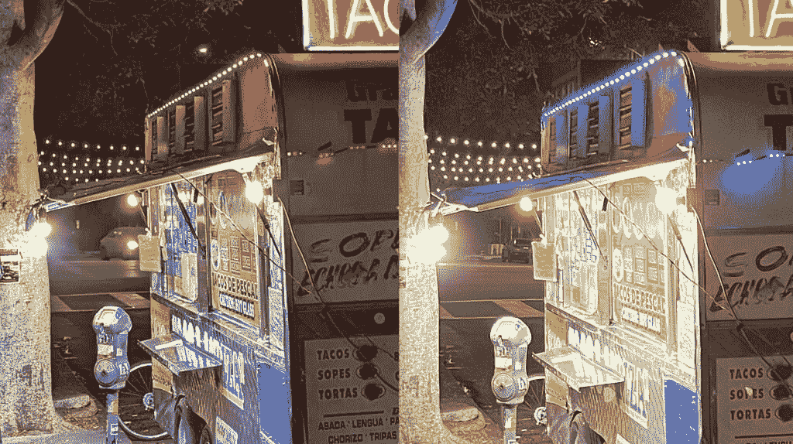</picture> 

Pixel 6 Pro (left); iPhone 13 Pro (right).

在一个不太具有挑战性的低光拍摄中，就像下面的设置，两款手机都做得很好，但再次归结为像素的冷色调与 iPhone 的暖色调。

下面另一个势均力敌的设定——直到你放大，然后你看到 iPhone 镜头满是噪点。所以在这些样本之后，我认为最好的结论是，Pixel 6 Pro 相机在低光拍摄方面略好，因为它有更高的天花板，不像 iPhone 13 Pro 那样经常出错。

 <picture>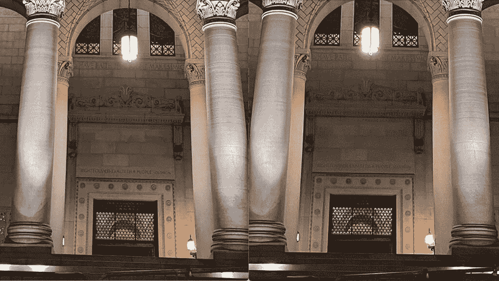</picture> 

Pixel 6 Pro (left); iPhone 13 Pro (right).

然而，当 Pixel 6 Pro 需要夜间模式时，它通常会占用它的甜蜜时间。在我上面分享的样本中，这基本上没什么问题，因为它们大多是静态照片，但如果我试图在晚上拍摄移动的物体，像素拍摄往往会有更多模糊的对象。

考虑到所有的事情，我不得不在主摄像头摄影方面给谷歌 Pixel 6 Pro 一个胜利。在上面的图片中，我想我有 70%的时间更喜欢 Pixel 的照片。

* * *

## 谷歌 Pixel 6 Pro vs 苹果 iPhone 13 Pro:超宽摄像头

Pixel 6 Pro 和 iPhone 13 Pro 都是 12MP 超宽拍摄者(Pixel 的 f/2.2 光圈，iPhone 的 f/1.8)，但 Pixel 的视野在 114 度时非常窄，几乎不能算作超宽。iPhone 的 120 度视野可以以更生动的角度拍摄更全面的照片，并且有自动对焦功能。但是让我们让照片来说话。

### 超宽相机，光线充足的场景:颜色，清晰度，动态范围

iPhone 13 Pro 的超宽镜头不仅捕捉到了更多的场景，而且它有点扭曲了取景，使垂直于我的墙(画面的右侧)看起来被拉长了。这种类型的失真在普通照片中并不理想，但对于超宽镜头来说，这很好，甚至可能是受欢迎的，因为这是预期的外观。

在这个超宽部分，我不会过多地偷窥像素，因为如果你要切入的话，这有点违背了超宽拍摄的目的，但为了测试这些相机，我们会做一些。

 <picture>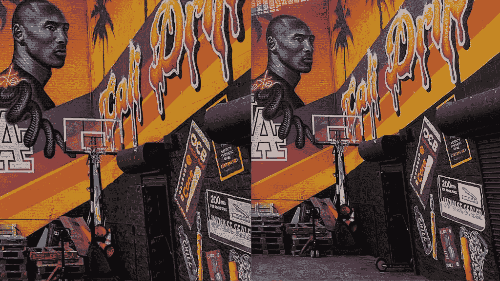</picture> 

Pixel 6 Pro (left); iPhone 13 Pro (right).

至少对于这一套，如果你放大观察，iPhone 13 Pro 的超宽更清晰。像素的拍摄也更嘈杂。这可能是因为 iPhone 的光圈更快，允许更多的光线进入。最终，在数码摄影中，光线是最重要的因素。

 <picture>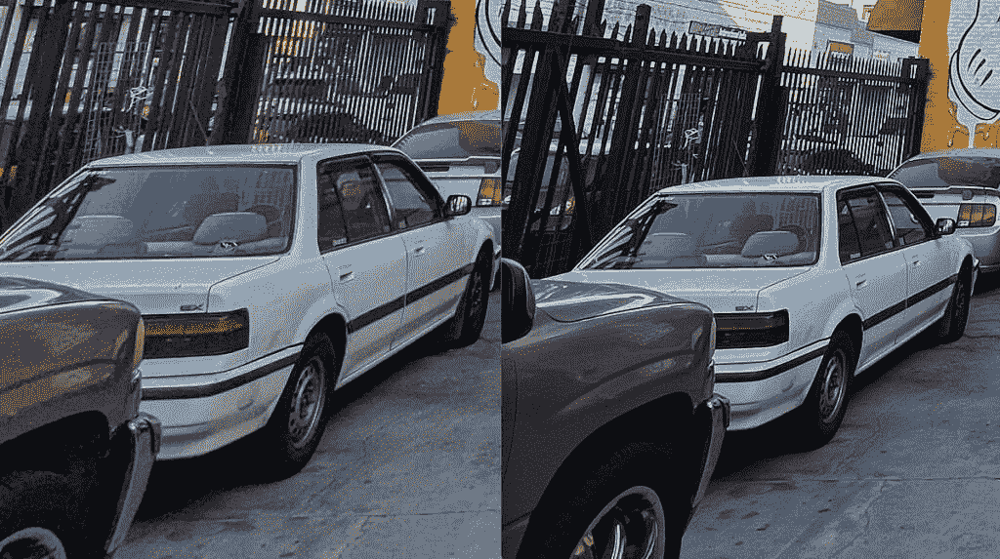</picture> 

Pixel 6 Pro (left); iPhone 13 Pro (right).

这是 iPhone 13 Pro 超宽的另一个例子，因为它有更宽的视野，加上 HDR 不会使阴影变亮，所以看起来更具戏剧性。

iPhone 13 Pro 超宽的另一个主要优势是它具有自动对焦功能，这意味着它可以锁定主题，而不是 Pixel 6 Pro 的固定对焦。在下面的照片中，你可以看到花更清晰，并且有轻微的散景效果将花从背景中分离出来。iPhone 的照片比 Pixel 的平面照片更有深度。

另一个镜头中，iPhone 更强的对比度和更戏剧性的角度确实增加了场景的氛围。

### 超宽相机，弱光场景:动态范围，颜色，噪声

到目前为止，iPhone 13 Pro 的超宽相机一直主导着 Pixel 6 Pro 的超宽相机，但当场景变暗时，Pixel 开始卷土重来，可能是因为谷歌的夜间模式比苹果的更好——夜间模式适用于所有低光样本。

在下面的照片中，iPhone 的照片过度曝光了寺庙中的光线，同时保持了外面的阴影非常暗。我说过，iPhone 镜头总会有较暗的阴影，是否管用取决于镜头和观看者的看法。我认为在这种黑暗的场景中，让阴影变亮会增加画面感。例如，你几乎看不到 iPhone 镜头中寺庙左侧的树，因为太黑了。

另一个例子是，虽然 iPhone 的照片很有戏剧性，但我认为 Pixel 6 Pro 的光线更均匀的照片更适合在社交媒体上发布的人。顺便说一下，现实生活中的场景是在中间的某个地方。

在下面的这个场景中，由于镜头眩光，iPhone 镜头的对比度和风格化程度如此之高，我几乎比像素镜头更喜欢它，但像素镜头在技术上更令人印象深刻——能够照亮只有 taco 卡车和街对面建筑中的灯光照亮的相对黑暗的街道。

### 超宽相机，微距拍摄:没有竞争

iPhone 13 Pro 超宽的一个额外的主要优势是:它兼作微距传感器，允许 iPhone 13 Pro 真正靠近拍摄对象。Pixel 6 Pro 没有这种模式。

事实上，iPhone 的微距模式可能是我测试过的所有智能手机中最好的微距模式(不包括 OPPO Find X3 Pro 的[临界显微镜](https://www.xda-developers.com/oppo-find-x3-pro-review/)相机，它需要一个独立的相机)。下面是更多 iPhone 13 Pro 宏样本。

即使不考虑微距模式，iPhone 13 Pro 的超宽相机仍然是更好的相机，在微距模式下，苹果取得了压倒性的胜利。

* * *

## 谷歌 Pixel 6 Pro vs 苹果 iPhone 13 Pro:变焦镜头

 <picture>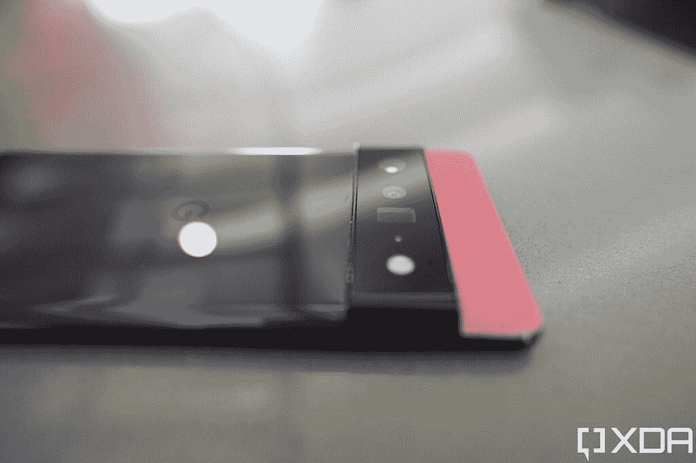</picture> 

The Pixel 6 Pro uses a rectangular-shaped Periscope zoom lens that produces 4x optical zoom.

转到变焦镜头，谷歌 Pixel 6 Pro 采用 48MP 潜望镜相机，具有 4 倍光学变焦，而 iPhone 13 Pro 使用传统的 3 倍长焦相机。这个类别对于 Pixel 6 Pro 来说将是一个胜利，因为潜望镜硬件只是更胜一筹。但在良好的照明条件下，iPhone 13 Pro 表现出色。

在上面的一组照片中，两款手机的 15 倍照片看起来很相似——直到你放大和像素窥视。

 <picture>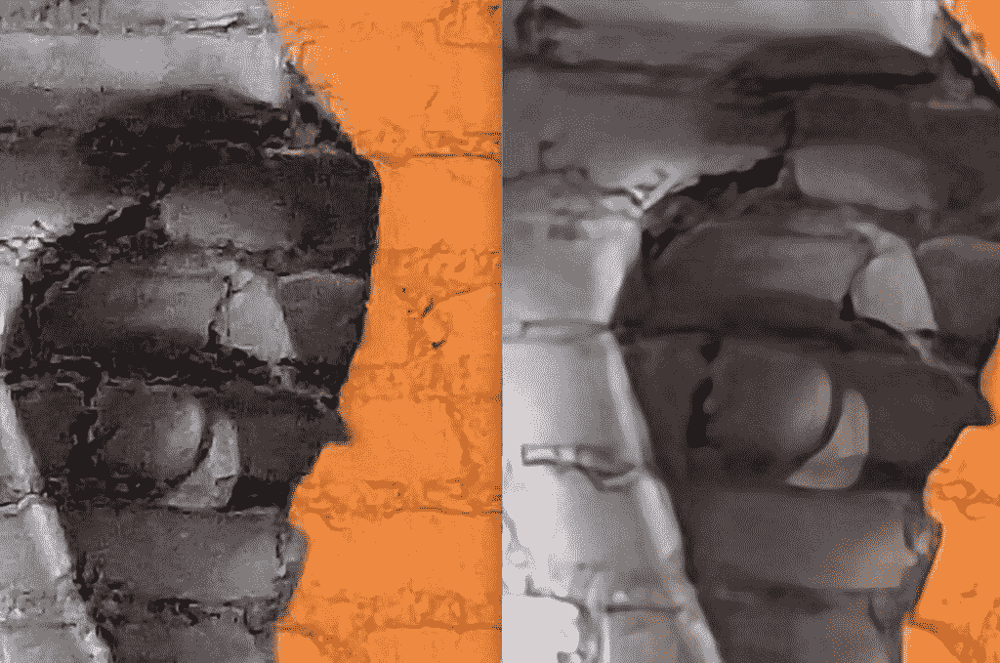</picture> 

Pixel 6 Pro (left); iPhone 13 Pro (right).

值得注意的是，iPhone 13 Pro 的最大数码变焦是 15 倍，而 Pixel 6 Pro 可以达到 20 倍。但是为了有一个并排的比较，我也将我的变焦镜头放在 15 倍。我们可以看到 iPhone 13 Pro 的 15x 在质量上非常接近 Pixel 6 Pro 的 15x。

不需要放大上面的设置来看猫在 Pixel 6 Pro 的 15 倍变焦中显然更详细。

下面，我们移动到一个更暗的场景，这是像素的潜望镜相机向前拉得更远，产生了更详细的 15 倍变焦。值得注意的是，iPhone 的 3 倍变焦确实不错，但是因为 Pixel 没有专用的 3 倍变焦，所以无法直接对比。

看，很明显 Pixel 6 Pro 有一个更好的变焦相机，但如果 iPhone 粉丝想看到光明的一面，他们可以安慰的是，3 倍变焦镜头可能比 4 倍变焦镜头更实用，因为后者在大多数设置下对大多数普通用户来说有点太强了。例如，如果你正在和朋友吃饭，你想拍一张照片，4 倍变焦可能会离他们的脸太近，而 3 倍(在 iPhone 上大约相当于“真正”相机的 77 毫米焦距)应该没问题，因为这是一个理想的人像取景。这将我们引向下一个类别...

* * *

## 谷歌 Pixel 6 Pro vs 苹果 iPhone 13 Pro:人像

iPhone 13 Pro 使用其 3 倍长焦拍摄人像，而 Pixel 6 Pro 使用其主摄像头拍摄人像，因为如前所述，4 倍变焦太长了。但是使用主(宽)相机拍摄人像太遥远了，所以谷歌在人像中给了 Pixel 6 Pro 这个数字作物。为了让下面我朋友的肖像看起来类似于取景，我不得不站得离我朋友更近，因为我用的是 Pixel 6 Pro 而不是 iPhone 13 Pro。

我们可以看到 Pixel 6 Pro 比 iPhone 13 Pro 有更强的(人工生成的)散景，尽管两款手机都允许你在事后调整模糊程度。仔细看，我们可以看到 Pixel 的镜头更清晰(因为它是用 50MP 主摄像头拍摄的)，但 iPhone 人像的边缘检测略好。

 <picture>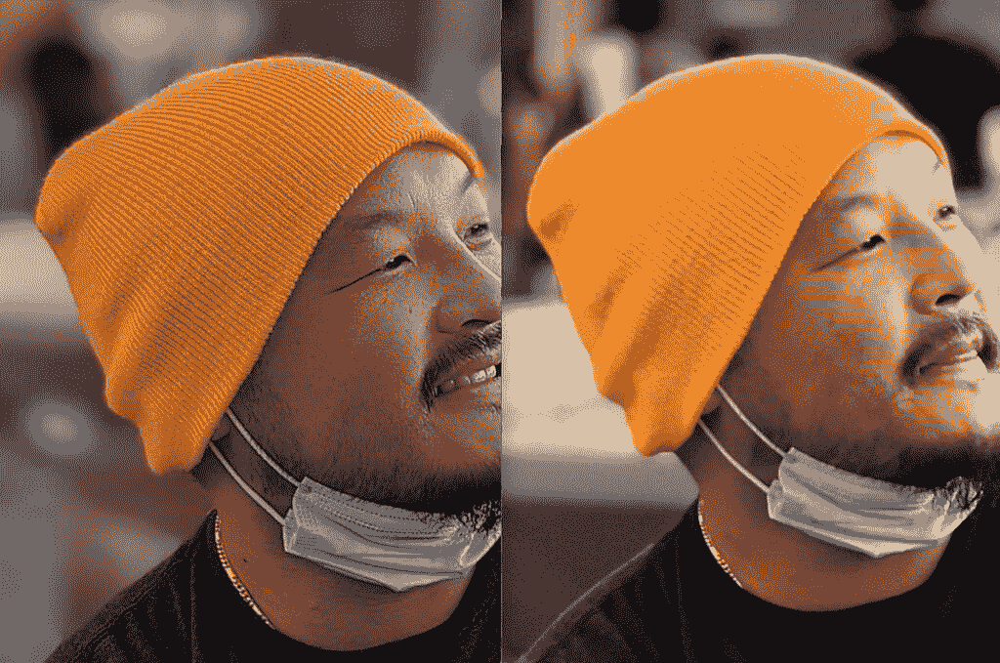</picture> 

Pixel 6 Pro (left); iPhone 13 Pro (right).

我不得不再次靠近 Pixel 6 Pro，以与 iPhone 13 Pro 的 3 倍人像拍摄大致相同的取景拍摄这张人像。我们可以看到 iPhone 的肖像让李小龙雕像增色不少，但作为回报，你会看到更多的噪音。然而，Pixel 的照片没有太多的散景，可能是因为在靠近时，我没有给手机足够的时间来找到布鲁斯周围的焦点。

在下面的照片中，我们可以再次看到像素的卓越清晰度。

以前像素占主导地位的事情之一是在无生命、非人类形状的物体周围产生令人信服的散景。iPhone 以前根本无法做到这一点，但苹果已经改进了它的算法，因此 iPhone 13 Pro 现在也可以在明显非人类、非生物的周围产生散景。

除了色温差异，这两个都是很好的假散景拍摄。总体而言，Pixel 6 Pro 的人像更清晰，散景更强，但 iPhone 13 Pro 的焦距更理想。这是迄今为止第一个获胜者可以参加辩论的类别。

* * *

## Pixel 6 Pro vs iPhone 13 Pro:自拍

与三星或 Vivo 等公司提供的自拍硬件相比，Pixel 和 iPhone 的自拍硬件都相对平庸 Pixel 6 Pro 的自拍分辨率为 11.1MP，f/2.2，而 iPhone 13 Pro 的自拍分辨率为 12MP，f/2.2——但这两款手机仍然可以拍摄出具有美感的自拍，不会像三星或 Vivo 手机那样过度平滑或美白我们的皮肤。

我承认我不是一个很喜欢自拍或者很在意自拍的人。在我为期一周的测试中，自拍相机无疑是最少使用的镜头，但我仍然在各种光线条件下拍摄了大约 12 张自拍，这些手机产生了差异很大的结果。有时候，iPhone 拍摄会比像素拍摄更好地照亮我的脸，其他时候则相反。在一些照片中，像素的散景更强，但在其他照片中，情况并非如此。但我们可以在拍摄质量方面达成一致，它们更接近，这并不是说一部手机的自拍总是优于另一部。

如果我必须选择一个获胜者，我会给 Pixel 6 Pro 一点优势，因为它的夜间模式看起来更自然，而且在主摄像头的反面，不太可能导致模糊的镜头(也许谷歌的面部去模糊算法有所帮助？).

* * *

## Pixel 6 Pro vs iPhone 13 Pro:视频

自从 iPhone 问世以来，iPhone 一直是摄像机之王，这要归功于它在切换镜头时的稳定性和流畅性，这是大多数 Android 手机无法比拟的。iPhone 能够实现这一点的一个主要原因是苹果公司在硬件和软件之间有更好的协同作用，因为该公司对硬件和软件都有控制权。然而，Pixel 6 Pro 是非常罕见的可以做出这一声明的 Android 手机，谷歌自己的 SoC 张量为 Pixel 6 系列提供动力。

因此，Pixel 6 Pro 很容易成为周围最好的 Android 拍照手机之一，我不一定是指视频清晰度或动态范围(两者都很好)，而是 Pixel 6 Pro 的视频录制只是以 iPhone 的方式响应。例如，Pixel 6 Pro 可能是第一款可以在点击录制按钮的一瞬间开始录制的 Android 手机。其他 Android 手机往往有半秒的滞后/延迟。这没什么大不了的，但每当我用 iPhone 与三星 Galaxy S21 Ultra 并排拍摄视频，并且我正好在同一时间创下纪录，iPhone 剪辑总是会提前开始。这意味着当我稍后将视频排列起来进行并排比较时，我总是必须从 iPhone 剪辑中剪掉前半秒左右。我不必对下面的像素剪辑做这些，因为剪辑出来的开始时间和长度大致相同。

在上面的镜头中，我们可以看到 Pixel 6 Pro 的稳定性非常好，甚至可能比 iPhone 更好。但在低光场景中，像素往往会显示更多的噪声。在下面的剪辑中，有更多的夜间镜头和自拍相机视频，我们可以看到像素的稳定性再次表现得更好，最大限度地减少了边走边说的镜头带来的抖动。然而，iPhone 13 Pro 的视频具有更好的动态范围，并且照亮了我的脸，更接近我的实际肤色。

总的来说，我还是会把胜利给 iPhone，但这已经非常接近了。谷歌 Pixel 6 Pro 绝对是安卓领域最好的视频手机之一。

* * *

## 谷歌 Pixel 6 Pro vs 苹果 iPhone 13 Pro:结论

这是一场势均力敌的战斗，双方都受到了电话交易的打击。根据我的计算，Pixel 6 Pro 赢得了主相机、变焦相机和自拍类别，而 iPhone 13 Pro 赢得了超宽和视频类别。

在我看来，肖像是一种束缚。这在技术上让 Pixel 6 Pro 以 3 比 2 获胜，但 iPhone 13 Pro 以比 Pixel 任何一场比赛都更大的优势赢得了超宽比赛。尽管如此，主摄像头最终还是最重要的镜头，Pixel 6 Pro 只是一直捕捉我喜欢的镜头。如果你想自己检查全分辨率照片，我已经上传了全尺寸的图片到下面的 Flickr。

 <picture></picture> 

Google Pixel 6 Pro

Pixel 6 Pro 是较大的兄弟，配有谷歌的新张量芯片、现代设计和额外的远摄相机。

不过总的来说，这种相机比较归结为注意到大多数人实际上不会注意到的东西。这两款智能手机拍摄的图片在社交媒体上分享时都会保持良好的外观，这两款手机都不会出错。你选择拿起哪部手机会受到其他因素的影响，操作系统可能会是一个非常重要的决定点。但是万一你是一个像素偷窥者，需要绝对最好的，这个[相机枪战](https://www.xda-developers.com/tag/camera-shootout/)会给你更好的判断。