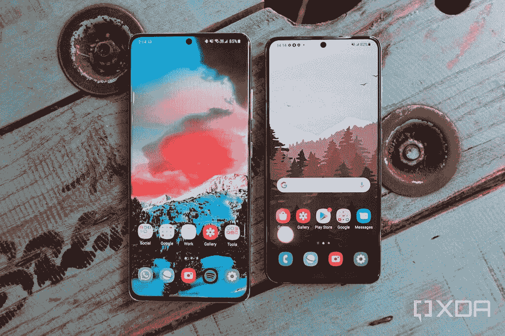
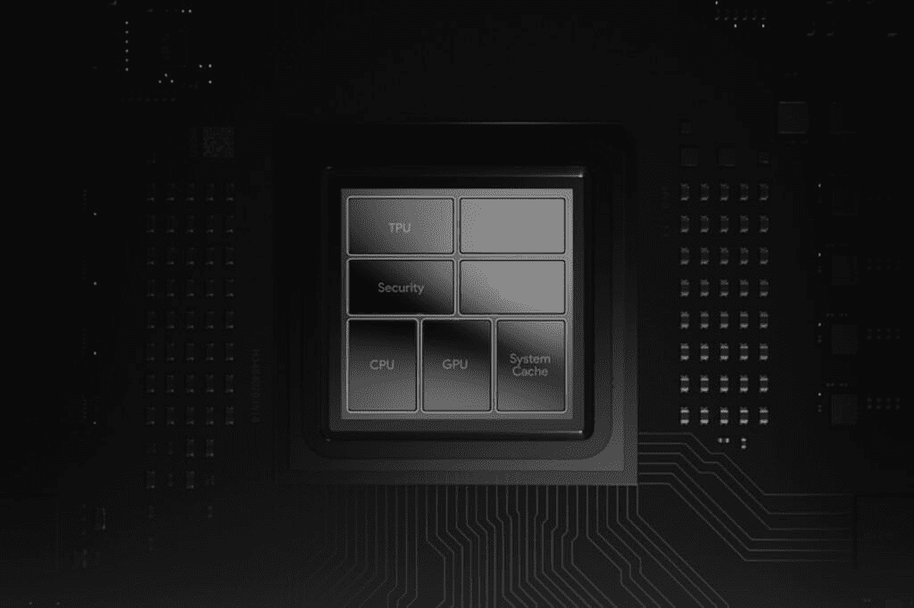

# 谷歌 Pixel 6a vs 三星 Galaxy S21:你应该考虑购买哪一款智能手机？

> 原文：<https://www.xda-developers.com/google-pixel-6a-vs-samsung-galaxy-s21/>

在生产一款价格适中的智能手机时，有一个很难实现的平衡。买家受到的教育比以往任何时候都多，因此通过选择正确的妥协来达到最佳状态变得越来越具有挑战性。但是，仔细计划，这是可能的。需要做出选择，但是如果做得正确，公司可以以合理的价格做出可靠、漂亮的东西。谷歌和三星凭借 [Pixel 6a](https://www.xda-developers.com/google-pixel-6a-review/) 和 [Galaxy S21](https://www.xda-developers.com/samsung-galaxy-s21/) 走钢丝，但他们能生产出检查所有盒子并仍然提供优质体验的手机吗？

**浏览这篇文章:**

## 谷歌 Pixel 6a 与三星 Galaxy S21:规格

|  | 

谷歌像素 6a

 | 

三星 Galaxy S21

 |
| --- | --- | --- |
| 建设 | 

*   铝制中框
*   大猩猩玻璃 3 前面板
*   IP67 防水/防尘
*   塑料背板

 | 

*   铝制中框
*   Gorilla Glass Victus 前面板
*   IP68 防水/防尘等级
*   塑料背板

 |
| 尺寸和重量 | 

*   152.2 x 71.8 x 8.9 毫米
*   178 克

 | 

*   151.7 x 71.2 x 7.9 毫米
*   171 克

 |
| 显示 | 

*   6.1 英寸有机发光二极管
*   60Hz 刷新率
*   1080 x 2400 像素
*   康宁大猩猩玻璃 3

 | 

*   6.2 英寸 AMOLED
*   120 赫兹刷新率
*   1080 x 2400 像素
*   大猩猩玻璃 Victus

 |
| 社会学 |  | 

*   高通骁龙 888
*   Exynos 2100

 |
| RAM 和存储 | 

*   6GB / 128GB 内部存储

 | 

*   6GB / 128GB 内部存储
*   8GB / 256GB 内部存储

 |
| 电池和充电 | 

*   4，410 毫安时电池
*   18W 快速充电
*   没有无线充电

 | 

*   4000 毫安时电池
*   25W 快速充电
*   无线充电 15W
*   反向无线充电 4.5W

 |
| 安全性 | 

*   指纹传感器(显示屏内)

 | 

*   指纹传感器(显示屏内)

 |
| 后置摄像头 | 

*   1220 万像素，f/1.7 主频(带 OIS)
*   12 兆像素，f/2.2 超宽

 | 

*   12 MP，f/1.8 Main(带 OIS)
*   12 兆像素，f/2.2 超宽
*   6400 万像素，f/2.0 长焦

 |
| 前置摄像头 |  |  |
| 港口 | 

*   USB 类型-C
*   没有耳机插孔

 | 

*   USB 类型-C
*   没有耳机插孔

 |
| 连通性 | 

*   5G
*   长期演进
*   Wi-Fi 802.11 a/b/g/n/ac/6e
*   蓝牙 5.2

 | 

*   5G
*   长期演进
*   Wi-Fi 802.11 a/b/g/n/ac/6
*   蓝牙 5.0

 |
| 软件 |  |  |
| 价格 |  |  |

* * *

## 建造和设计

Pixel 6a 的外观与众不同，你要么会喜欢它，要么会讨厌它，或者最终会对它产生好感。所以如果你第一眼不喜欢它，就让设计在你的脑海里浸泡。一段时间后，你会发现它的一些美。如果你讨厌它，最好是继续前进。当然，如果你想要这部手机，最坏的情况下，你可以尝试用外壳盖住它。这款手机的正面看起来相当标准，但背面有着独特的摄像头遮光板，这是一个争议点。遮阳板正在极化，但与此同时，它已经成为像素线的一个符号。以至于谷歌在即将推出的 [Pixel 7 系列](https://www.xda-developers.com/google-pixel-7-pro/)中继续使用该设计。

除了手机的物理形状之外，双色调的色彩美感也让你对细节非常关注。虽然在上面的图片中很难看到，但谷歌选择混合两种颜色，这只是一种微妙的对比。如果你仔细观察，你会发现相机遮阳板上方的颜色与下方的颜色不同。谷歌继续使用以前像素的主题，为其手机使用柔和的颜色，提供木炭色、粉笔色和鼠尾草色等选择。无论你选择哪一个，你都不会错。就质量而言，尽管它是由塑料制成的，但设备的后部感觉很好。纹理模仿玻璃制成的后面板，让人很难不被告知就知道。这款手机的坚固性来自于夹在正面显示屏和背面面板之间的铝制中框。这种结构提供了两个世界的最佳选择，一部既轻便又坚固的手机。

 <picture></picture> 

Samsung Galaxy S21

三星 Galaxy S21 的设计时尚而精致。正面显示屏不会吸引你的注意力，下巴很薄，屏幕周围的边框更薄。但事情看起来有所不同的是后部，三星在那里做了一些其他手机制造商没有真正做到的事情。该公司已经将其摄像头凸起巧妙地融入到手机的设计中。Galaxy S21 采用了传统的摄像头凸起，并将其移向设备的外边缘，与侧边框融为一体。现在，有些人会说这看起来很糟糕，但这是主观的。

有一点可以达成一致的是，由于其后部的最小凸起，这款手机看起来更加苗条。虽然设备的背面看起来不起眼，但手机的高级外观和感觉来自于塑料的使用。没错，虽然该公司传统上在背板上使用玻璃，但对于 Galaxy S21，该公司选择了高质量的光泽塑料，不仅外观和手感都很好，而且非常坚固。三星是三星，Galaxy S21 有多种颜色，因此每个人都有适合的东西。

* * *

## 显示

Pixel 6a 采用 6.1 英寸有机发光二极管平板屏幕，刷新率为 60Hz，分辨率为 1080 x 2400 像素。屏幕周围的边框很小，但由于过渡到相同颜色的铝制中框，你很少会注意到它们。屏幕底部也有一个小下巴，但也没什么好担心的。还有一个小摄像头被切向屏幕的顶部中心部分。当手机每天使用时，这两种元素都会消失，并且在使用一周后变得几乎不可见。由于这是一款有机发光二极管显示器，明亮的颜色看起来很活泼，而黑色则很暗，无缝地融入屏幕的侧边框。像素 6a 在室内变得非常亮，但在阳光下有点挣扎。如果在室外，您仍然可以看到屏幕，但颜色可能看起来不那么鲜艳。这不是一个大问题，因为大多数智能手机都在这种情况下挣扎。

有机发光二极管显示器上有内置指纹识别器，经过测试，它运行得相当好。指纹读取器相对准确，大约需要半秒钟才能解锁。在某些情况下，需要再次尝试解锁显示器，但没什么可担心的。总的来说，这是一个非常好的屏幕，为您提供了大多数情况下所需的一切。虽然在户外情况下可能会更好，但大多数手机都在努力尝试超越太阳。

 <picture></picture> 

Samsung Galaxy S21 Ultra (left) and the Galaxy S21 (right)

三星倾向于生产市场上最好的有机发光二极管显示器；也就是说，三星 Galaxy S21 的显示屏非常棒。Galaxy S21 的屏幕充满活力，明亮，也清晰。此外，它还提供 120Hz 的刷新率，分辨率为 1080 x 2400 像素。6.1 英寸的平板屏幕前面还有一个小切口，用于前置摄像头，并有一个快速的显示指纹读取器。就性能而言，显示器在阳光下表现很好，必要时会提高亮度。虽然它能够以 120Hz 的频率运行，但它是动态的，必要时会降至 48Hz 以节省电池。

两种显示器都能为大多数使用案例提供出色的观看体验。也许两者之间最大的区别在于刷新率。对于那些从未体验过 120Hz 刷新率的人来说，如果你使用 Pixel 6a，你不会注意到你错过了什么。但是，如果你过去有过使用更快面板的经验，这款手机可能会让你想要更多。如果你对此不太确定，试着去你当地的商店试试展示的手机。但是如果你需要在没有体验的情况下选择，这两款显示器都是很棒的选择。

* * *

## 表演

Pixel 6a 是一款中端手机，但它装有谷歌旗舰手机 Pixel 6 和 Pixel 6 Pro 中的处理器。张量是谷歌首次尝试制造自己的处理器，在很大程度上，它是一个非常好的芯片。它在所有正确的方面都很强大，并且有一个特殊的架构，使机器学习更有效。谷歌张量 SoC 将于 2021 年底发布，并与高通的骁龙 888 和三星的 Exynos 2100 处理器竞争。

 <picture></picture> 

Image via Google

我们做了一些测试，发现 SoC 适合日常使用，但在用于游戏等更密集的任务时会变热。这款手机还会严重减速，性能降低近一半。虽然没有发生这些事情的具体原因，但 Conway 推测这可能是由于 Pixel 6a 中的内存量较低。同样，这不是一个坏芯片，这是一个顶级芯片，只是没有按照其预期的规格执行。但是，在日常使用中，它应该没问题，而且它应该能够处理您需要它处理的所有事情，甚至更多。

高通骁龙 888 是 2021 年的顶级处理器之一。有一款高通骁龙 888 Plus 型号，但它是在三星 Galaxy S21 发布后的一年晚些时候推出的。无论如何，骁龙 888 过去是，现在仍然是一个顶级的表演者。它在性能的各个方面都获得了高分，处理器真的没有什么不好的。那些玩游戏的人会很高兴地知道，开发者往往倾向于为高通处理器优化他们的游戏，所以这款芯片应该没有什么不同。尽管如此，如果有一件事要注意的话，那就是芯片有时会变热，这对于长时间带负荷使用手机的人来说是一个问题。如果你是一个喜欢看数字的人，那就去看看[我们的基准测试](https://www.xda-developers.com/qualcomm-snapdragon-888-benchmarks/)，将其与其他高通骁龙处理器进行比较。

在这场对决中，高通骁龙 888 处理器只是一个比谷歌张量 SoC 更好的芯片。然而，高通的芯片并不是非常优越，但它确实在几乎每个领域都胜过谷歌张量处理器。此外，如前所述，由于高通处理器用于许多手机，有些东西，如游戏，只是更好地优化了芯片组。但是，就一般使用而言，就性能而言，你应该对这两款芯片都满意。

* * *

## 摄像机

谷歌 Pixel 系列以两件事闻名:拥有最新的软件更新和一个非常好的摄像头。六代之后，这两点仍然适用。谷歌 Pixel 6a 有一个很棒的摄像头，使用了 12MP 主传感器和 12MP 超宽传感器。虽然它没有使用最新的硬件，但由于它的计算摄影，它仍然可以获得可靠的结果。通过 Pixel 6a，张量处理器将传统硬件和机器学习结合在一起。使用张量处理器，有些事情可以在 Pixel 上完成，而在竞争对手的智能手机上则无法实现。

现场 HDR+，夜视，真正的语气，和频繁的面孔只是举几个例子。但是还有[脸部去模糊](https://www.xda-developers.com/face-unblur-pixel-6/)，创意特效，甚至还有像[魔法橡皮擦](https://www.xda-developers.com/google-magic-eraser-new-update/)这样的编辑工具。其中一些被其他人复制，而一些则完全是 Pixel 手机独有的。虽然你可能不会使用 Pixel 的所有工具，但知道你有它还是很好的。在很大程度上，其中一些不需要额外的思考就可以工作。你只是投你的球，如果有些事情不对，你有时可以在以后变得更好。就好像你的相机总是提前思考。准备好迎接任何到来的事情。当你看到它的运行时，你会印象深刻，而且在很大程度上，它是有效的。

三星在 12 年前首次推出了 Galaxy S 系列，在每一次迭代中，它都努力改进其手机的几乎每个方面。随着 Galaxy S21 的推出，它几乎达到了顶峰，提供了三星能够提供的一些最好的图片和视频。虽然大多数相机规格与更昂贵的 Galaxy S21 Ultra 相同，但也有一些差异，比如变焦范围更小。但是，除了像这样的小事情，它几乎是相同的。白天你可以拍出高质量的照片，细节清晰而丰富。如果你觉得有必要放大你的主题，你可以，因为 Galaxy S21 提供了高达 30 倍的空间变焦。

那些自拍的人会很高兴地知道，三星还使用计算摄影技术通过人工智能修复来清理任何瑕疵，并使用人工工作室照明来增强图片。如果你不喜欢，你可以关掉它。对于夜间照片，三星有自己的夜视版本，名为 Bright Night，让您能够在光线不足或黑暗的区域拍照。如果你在一个风景如画的地方，但不知道该拍什么样的照片或视频，那么使用所有可用的选项来拍摄怎么样？虽然这听起来很奇怪，但单次拍摄是一种使用手机上所有相机一次拍摄 14 种不同照片和视频的模式。如果说三星有什么特点的话，那就是他们会给你你需要的一切，有时会让人不知所措。但很高兴知道，到了成长的时候，你永远不会觉得两手空空。

* * *

## 电池寿命和充电

这两款手机都配有大小相似的电池，Galaxy S21 配有 4000 毫安时的电池，而谷歌 Pixel 6a 配有 4410 毫安时的电池。这两款手机在正常使用的情况下都可以给你一整天的续航，在重度使用的情况下也可以一天秒杀。在这一类别中，三星凭借其更快的充电速度占据了优势，Pixel 6a 的充电速度为 25W，而 Pixel 6a 的充电速度为 18W。Galaxy S21 还支持 15W 的无线充电，而 Pixel 6a 根本不提供任何类型的无线充电。最后但同样重要的是，Galaxy S21 提供 4.5W 的反向无线充电。虽然不是最实用的，但在为智能手表或无线耳机等外设充电时，它可以派上用场。也可以给其他智能手机充电，但我不推荐。

* * *

## 谷歌 Pixel 6a vs 三星 Galaxy S21:你该买哪个？

有时候，当你让两部智能手机相互竞争时，这就成了一个艰难的决定。你不能总是把有形的因素考虑在内，而常常要透过有形的因素去寻找答案。有时候，没有答案，这只是关于用户当时可能需要什么或者他们的感受。谢天谢地，有了谷歌 Pixel 6a 和三星 Galaxy S21，情况就完全不同了。虽然之前我们谈到了有形资产，但这里的价格差异如此之大，你真的无法比较这两者。

Galaxy S21 是一款很棒的手机，提供了顶级的规格，三星从手机中削减了适量的东西，使其具有竞争力的价格。Galaxy S21 的推出是多年经验的结晶。你会得到一部拥有强大处理器的手机，120 赫兹的出色显示屏，时尚的设计，令人印象深刻的摄像头，还有各种颜色。现在，当你支付 799 美元时，这是你必须预料到的。它包含了你想要的手机中的一切，价格为 799 美元，而三星之前的价格为 999 美元。Galaxy S21 的价格越低，它就越有说服力，所以如果你接近 600 美元的价格，那么它就更有意义。三星还在其今年的产品线中提供疯狂的折价交易，在撰写本文时将是 Galaxy S22 系列，在这种情况下，放弃 Galaxy S21 和 Pixel 6a 而选择 Galaxy S22 是一个显而易见的事情，你应该立即投入。

另一方面，Pixel 6a 是制造中档平价智能手机的一次伟大尝试。这款手机的零售价为 449 美元，与三星相比，它属于不同的类别。请注意，这绝不是一部糟糕的手机，提供了一个独特的设计，感觉非常优质。此外，这款手机还采用了良好的处理器，配备了一个在大多数情况下都表现良好的摄像头，只要谷歌支持，它就会一直获得最新的软件更新。如果你正在钻研 Android，这就是你想要的。

尽管如此，这两款手机都是很好的选择，但这取决于你愿意支付多少。这里有 350 美元的价格差距，所以你必须看看什么适合你的预算。如果三星 Galaxy S21 可行，那就去做吧。如果没有，买谷歌 Pixel 6a 也没什么不好。无论您选择哪一种，请务必使用下面的链接来获得当前最优惠的价格。

 <picture></picture> 

Google Pixel 6a

 <picture></picture> 

Samsung Galaxy S21