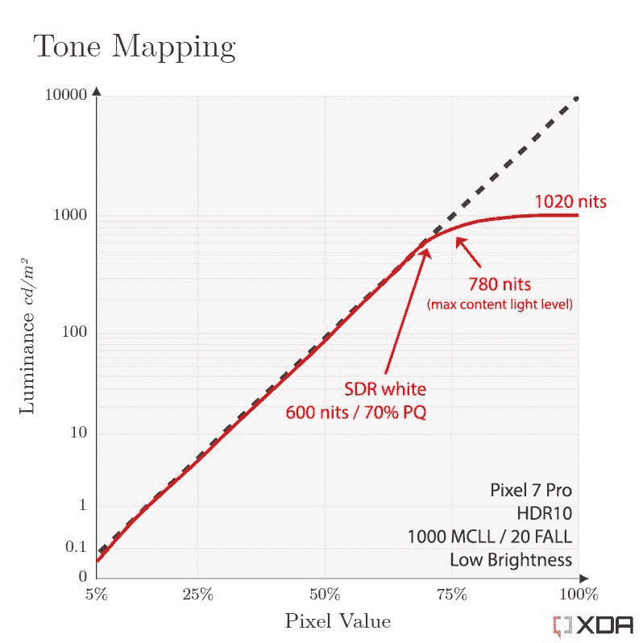
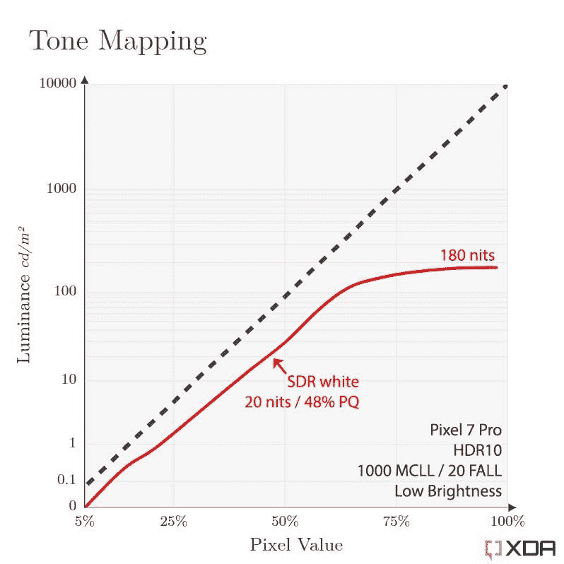

# 谷歌像素 7 专业显示器审查:颜色的安卓状态

> 原文：<https://www.xda-developers.com/google-pixel-7-pro-display-review/>

除了阅读“更高的峰值亮度！”每年，人们经常想知道在每年的显示器升级中是否有任何其他切实的改进。此外，如果其他媒体报道的彩色生殖声称“与完美无异”，他们还能改进什么呢？

嗯，事情比你想象的要复杂得多。

对于其显示屏，谷歌历来倾向于准确性而非生动性。这经常让来自其他品牌的消费者感到不安，这些品牌默认提倡增加色彩饱和度。可以理解的是，反过来，许多人可能会将颜色准确性与缺乏活力联系起来，但这两者并不相互排斥——谷歌只是在证明这一点上行动迟缓。例如，苹果通过全心全意地采用追溯到 iPhone 7 的宽色彩标准，基本上摆脱了这个问题。现在，iPhones 拍摄的所有照片都保存在更大的显示器 P3 色彩空间中。

直到今天，大多数 Android 手机仍然只能捕捉 sRGB 色彩空间中的照片，该空间只能存储最多约为 P3 最大饱和度五分之四的颜色。这本身并不太重要，但领先意味着苹果在其整个生态系统中对更鲜艳的颜色有更广泛的支持。如今，你可以在整个 iOS 中找到充满活力的 P3 色彩，包括它的默认壁纸、系统 UI 和许多第三方应用；甚至它的壁纸颜色选择器也允许你选择 sRGB 以外的颜色，不像谷歌的 Material You 提供的颜色。这显然是 Android 尚未建立的颜色采用水平。

这仅仅是开始。谷歌仍有许多方法可以改进其像素显示屏，所以我们让新的 [Pixel 7 Pro 的](https://www.xda-developers.com/google-pixel-7-pro)面板经受了考验。

***关于这篇评论:**这篇评论中的产品已经被 Google 借出。然而，该公司没有参与这篇文章的内容。*

 <picture></picture> 

Google Pixel 7 Pro

Pixel 7 Pro 是谷歌有史以来最好的手机，拥有精致、优质的设计和谷歌第二代硅芯片，以及一如既往的出色摄像头。

| 

赞成的意见

 | 

骗局

 |
| --- | --- |
| 

*   出色的峰值亮度和改进的亮度处理

 | 

*   屏幕在高亮度下消耗异常高的功率

 |
| 

*   出色的色彩准确度和精确度，即使在最小和最大亮度时也是如此

 | 

*   无法调整白平衡

 |
| 

*   出色的阴影色调再现，尤其是在自然模式下

 | 

*   对于那些想要更饱和颜色的人来说，没有鲜艳的颜色选项

 |
| 

*   整个操作系统中 HDR 视频播放的显著改进

 | 

*   HDR10 色调映射可以进一步改进

 |

## 硬件和功能:相同的三星显示器

三星显示仍然是有机发光二极管智能手机的主要供应商，所以谷歌的旗舰保持其采购也就不足为奇了。但我没想到的是，谷歌使用的是与去年的 Pixel 6 Pro 相同的一代面板，这在发布时可以被认为是过时的。更具体地说，Pixel 7 Pro 似乎使用了来自三星显示的 E4·有机发光二极管材料集，这种材料集已经有近两年的历史了，而不是更新、更高效的 E5 材料。这使得 Pixel 7 Pro 的有机发光二极管效率与 2020 年发布的 Galaxy Note 20 Ultra 处于同一水平。

谷歌声称，与去年的手机相比，Pixel 7 系列的峰值亮度增加了 25%。

幸运的是，新像素的显示屏并不完全相同。在谷歌制作的主题演讲中，该公司吹嘘 Pixel 7 系列的峰值亮度比去年的手机增加了 25%。还有一个更新的显示驱动程序来配置亮度的变化。最后，这一提升推动了 Pixel 7 的下一个最大变化，即它播放 HDR 视频的方式。

与之前的 Android 手机不同，Pixel 7 Pro(右)现在可以在正确的亮度下观看应用程序中的 HDR 视频，包括画中画模式。

虽然从技术上来说，Pixel 7 Pro 是 Android 13 的一项功能，但它是第一款支持 HDR 内容与应用程序和系统 UI 集成的 Android 手机。这意味着 Pixel 7 Pro 显示器可以显示*真正的*比白色更亮的高光，而无需将系统亮度提高到令人目眩的水平。

本质上，该功能的工作原理是在出现 HDR 内容时提升显示亮度，同时按比例降低 UI 其余部分的像素值，形成镜面高光的幻觉。该功能还直接解决了 Android 手机 HDR 视频的一般亮度问题，这通常需要将显示器设置为最大亮度，以便曝光看起来正确。

与之前的 Android 手机不同，Pixel 7 Pro 现在可以在正确的亮度下观看应用程序中的 HDR 视频

根据这一功能的战略时机，谷歌在其最新手机中添加了 10 位 HDR 视频录制功能，可以在 7 Pro 上无缝播放。谷歌还提到了与 Snap 和抖音的合作，将 HDR 视频引入 Android 平台，这应该有助于推动色彩管理的发展。此前，由于不存在 HDR 混合，应用程序只支持全屏模式下的 HDR 播放，但 Android 13 解决了这一问题，并允许在应用程序的内容提要中观看 HDR。《XDA》前主编[米沙·拉赫曼](https://twitter.com/MishaalRahman)几个月前就发现了这个即将到来的 Android 13 新功能，你可以在他的[斯珀博客](https://blog.esper.io/android-sdr-dimming/)中了解更多。

相反，在色彩管理方面，Pixel 7 系列仍然只能捕捉 sRGB 色彩空间中的照片。由于 Android 方面缺乏关注，Instagram、Twitter、脸书甚至 Chrome 等流行的社交应用仍然不支持查看宽彩色图像，所有这些应用都舒适地共存于苹果的生态系统中。

## 实验室测试:亮度和功耗

不同手机的峰值屏幕亮度与窗口大小的关系

毫无疑问，[Pixel 7 Pro 显示器最具决定性的进步是其更高的峰值亮度](https://www.xda-developers.com/google-pixel-7-pro-display-problem/)。谷歌 25%的亮度提升声明在所有方面都是真实的，这与安卓的最佳表现相一致。使用灯光主题的应用程序，7 Pro 与竞争对手一样明亮，但在黑暗模式或使用全屏媒体时，仅次于 iPhone 14 Pro(尽管差距很大)。

Pixel 7 Pro 最高可达 1620 尼特，或在光主题应用程序中约为 1050 尼特，与其他旗舰手机类似。

根据我的测试，Pixel 7 Pro 在 1%的小窗口尺寸下可以达到高达 1，620 尼特的峰值亮度，与三星 Galaxy S22 Plus 和 Ultra 相差不远。谷歌声称 Pixel 7 Pro 在 5%的窗口尺寸下可以达到 1500 尼特，这似乎是适度的，因为我可以在 10%的窗口尺寸下测量这一点。灯光主题的应用程序将显示大约 1050 尼特，类似于其他旗舰手机。HDR 内容的上限也在 1000 尼特左右，谷歌禁用了动态有机发光二极管亮度提升以提高色彩保真度。

不同手机的峰值屏幕亮度比较

在户外使用手机时，我肯定注意到了 Pixel 6 Pro 的明显改善，谷歌甚至降低了触发高亮度模式所需的环境亮度(从 10，000 勒克斯降至约 5，700 勒克斯)。当高亮度模式启用时，也有一个平滑的过渡，最终看起来亮度的粒度取决于勒克斯，而不是在断点后完全打开或关闭。峰值手动亮度也得到了小幅升级，从 500 尼特提升到 600 尼特。

### 现在是糟糕的部分

各种手机的全屏亮度与显示功率图

我立即注意到的是*Pixel 7 Pro 使用了多少*功率。在峰值发射时，仅它的显示屏*一项*就消耗了超过 6W 的电能，比我见过的任何其他手机都多。相比之下，iPhone 14 Pro Max 和 Galaxy S22 Plus 可以输出大约 1100 尼特的全屏功率，而 Pixel 6 Pro 可以输出 800 尼特的功率(在标准化屏幕面积之后)——这几乎是使用最新有机发光二极管材料在峰值亮度下效率提高了 40 %*。相反，Pixel 7 Pro 需要 6.4W 才能输出 964 尼特，而 iPhone 14 Pro Max 同样的输出只需要 4.4W。*

 *Pixel 7 Pro 的总显示功率比我见过的任何其他手机都大——比 Pixel 6 Pro 大 21%，比 iPhone 14 Pro Max 大 47%

此外，在高亮度水平下，Pixel 7 Pro 显示器实际上比 Pixel 6 Pro 消耗的*更多*电能。这里发生的情况是，Pixel 7 Pro 使用了比 6 Pro 更高的显示电压状态，高于 300 尼特。谷歌没有增加新的电压步长，而是用一个可以适应新的 600 尼特最大值的电压状态取代了以前的 500 尼特电压状态。同样，对于高亮度模式，以前的 800 尼特电压状态被提升到 1，000 尼特。虽然这似乎是短视的，但这是意料之中的，因为谷歌可能需要单独对每个电压状态进行工厂校准。

如果我们评估曲线下的面积来考虑显示器的亮度范围，Pixel 7 Pro 的功率-亮度面积比 Pixel 6 Pro 大 21%左右，直到 6 Pro 的峰值亮度。与 iPhone 14 Pro Max 相比，Pixel 7 Pro 的功率亮度足迹在其峰值亮度下增加了 47%。

当然，人们不会用他们的手机发出全白的测试图案(或者至少我希望不会)。当使用浅色主题的应用程序时，你可以预期这些测量值是大约五分之四，或者对于深色模式的应用程序，可以下降到大约十分之一。但从这些功率测量来看，你肯定希望将 Pixel 7 Pro 的曝光限制在发出明亮白光的场景下。屏幕也容易减速，在激活五分钟后退出其峰值亮度状态。

## 实验室测试:显示刷新

去年，[我调查了](https://www.reddit.com/r/GooglePixel/comments/rn5wrp/my_findings_on_the_pixel_6_pros_10120_hz_variable/?utm_source=share&utm_medium=ios_app&utm_name=iossmf)Pixel 6 Pro 的可变刷新率(VRR)情况，看看它的显示是否真的下降到了 10 Hz。许多人对此表示怀疑，因为 Android 在开发者选项中的刷新率读数似乎只有在屏幕空闲时才会下降到 60 赫兹。然而，Android 的刷新率指标并没有显示 OLED 面板的最低操作刷新率，部分原因是其可变刷新的实现方式。

这些三星面板有一个可变的刷新机制，它在显示驱动程序内的一个低得多的级别上运行，并且不暴露于 Android 用户空间。三星显示的 VRR 实现与典型的游戏显示器不同，后者可以针对任意刷新率。三星 HOP(“LTPO”)面板中的 VRR 仍然通过在离散刷新率模式之间切换来工作，就像旧的实现一样。但是这些 VRR 面板现在结合了一种低频驱动机制，该机制以当前刷新率模式的一小部分来操作有机发光二极管驱动率。

例如，通过以 60 Hz 的扫描速率操作面板，可以实现 10 Hz 的驱动刷新率，但是如果帧相同，则跳过每 6 个扫描间隔中的 5 个扫描间隔的重新驱动。这是由有机发光二极管的新型氧化物驱动 tft 实现的，这种 tft 的漏电流足够低，可以在没有明显亮度下降的情况下实现这一点。

Pixel 7 Pro 的闪烁频谱图

我们再次发现，当屏幕空闲时，Pixel 7 Pro 有机发光二极管确实会立即降至 10 赫兹，但今年谷歌如何配置显示驱动程序有明显的不同。对于那些对脉宽调制(PWM)敏感的人来说，Pixel 7 Pro 将其 PWM 频率从 360 Hz 降至 240 Hz。我不确定到底是什么导致了这种变化，但我并没有受到这种频闪效应的影响。

与去年一样，最低刷新率仍然存在相同的低光警告，这也存在于三星的设备中。在非常昏暗的条件下，当屏幕低于 15%的系统亮度*并且*环境亮度低于 5 勒克斯时，Pixel 7 Pro 有机发光二极管不会从 120 Hz 下降。这可以确保您在显示器切换刷新率时不会注意到闪烁，这种闪烁会在低光照水平下放大。通过强制屏幕在 120 Hz 和 10 Hz 之间切换，我能够注意到在最低亮度附近暗斑的亮度存在微弱但不可否认的差异，因此这种限制似乎是合理的。有趣的是，当禁用平滑显示时，这种约束不会出现，面板正常情况下在 10 Hz 和 60 Hz 之间切换。但仍然存在闪烁(尽管更加微弱)，所以我相信这要么是将 LFD 带到 60 赫兹模式时的疏忽，要么是谷歌决定差异小到足以让它滑动。

Pixel 7 Pro 有机发光二极管在 10 赫兹空闲时比在 120 赫兹驱动时少用 250 毫瓦的功率-除了在非常暗的条件下

我对 Pixel 6 Pro 上 VRR 实现的另一个抱怨是，当平滑显示被禁用时，有机发光二极管没有下降到 10 Hz。例如，当启用了电池节电功能时就会出现这种情况，这有时意味着屏幕在空闲时实际上比禁用时占用了*更多的*电量。我很高兴看到谷歌通过 Pixel 7 Pro 调解了这一问题，因为我可以验证屏幕现在在电池保护模式下降至 10 赫兹。无论照明条件如何，始终打开的显示屏也会如预期的那样降至 10 赫兹。

就节能而言，活动和空闲有很大的区别。当静止在 10 赫兹时，Pixel 7 Pro 有机发光二极管比驱动在 120 赫兹时少用 250 毫瓦的功率。然而，这种差异并不是真正归因于 10 Hz 空闲状态的省电，而是以 120 Hz 运行显示器的高昂价格。

当测量 60 Hz 和 120 Hz 之间的功率差异时，后者额外消耗 200 毫瓦，而 10 Hz 和 60 Hz 之间的节省仅约 50 毫瓦。并且在基本像素 7 上，60 Hz 和 90 Hz 之间的差异仅为大约 70 毫瓦。鉴于这些测量，我相信谷歌可以通过在空闲时将显示屏降低到至少 90 赫兹来显著改善其弱光电池的情况。

最后，可变刷新屏幕的优势之一是能够匹配以 24 或 25 FPS 运行的电影的帧速率。可悲的是，不管帧速率如何，Pixel 7 Pro 只会下降到 60 Hz，这意味着内容帧速率和显示刷新之间总是会不匹配。

## 实验室测试:色域和光谱

Pixel 7 Pro 的色域和 RGB 光谱图表

有机发光二极管的材料集不仅决定了面板的总体功效，还决定了其子像素的色纯度。Pixel 7 Pro 的有机发光二极管中的所有三个发射器都与典型的 E4 面板的光谱相匹配，这与去年的手机相同。这是一个耻辱，因为三星的最新材料已经完全升级了三个发射器，大大提高了能效，同时扩大了有机发光二极管的原生色域。对于 Pixel 7 Pro，其原生色域完全覆盖了 DCI-P3，同时在绿色和蓝色原色方面略有超越。

像素 2 中引入的增强色彩模式已经消失；自然和适应是现在仅有的两个选择。

像素 2 中引入的增强色彩模式已经消失；自然和适应是现在仅有的两个选择。自从增加了自适应模式后，这就像是一个多余的选项，已经过了很长时间了。与许多人认为的相反，增强配置文件并不比自适应配置文件更有活力——在 Pixel 4 和 Pixel 5 中，两者几乎相同，而在 Pixel 6 系列中，增强和自然模式被重新校准为更平坦的色调曲线，将增强模式置于自然和自适应之间。

这两种颜色模式都支持 Android 的颜色管理系统，如果应用程序和内容支持，该系统可以渲染高达 DCI-P3 的颜色。事实上，这两个配置文件都经过校准，以显示 P3 为基础，Pixel 7 Pro 以显示 P3 为默认合成空间来渲染整个 Android UI(尽管应用程序仍需要选择显示 P3 颜色)。

## 实验室测试:对比度和色调响应

像大多数手机和电脑显示器一样，Pixel 7 Pro 的屏幕在自适应颜色模式下被校准为 2.2 伽马色调响应。另一方面，选择自然模式使用带有较亮阴影的[不同色调曲线](https://i.imgur.com/Jp2dCtJ.png)，俗称分段 sRGB 曲线。在户外，Pixel 7 Pro 将大幅提高其阴影和中间色调的亮度，确保屏幕内容在阳光下仍然清晰可见。

Pixel 7 Pro 在自适应模式下的色调响应图表

从我的测量来看，自适应模式在接近 2.2 伽马幂的情况下做得很好，与内容 APL 无关。但在接近最低亮度时，事情会变得有点麻烦，校准轨迹会比平时暗一些。这使得阴影的细节更难辨认。即使有了完美的跟踪，2.2 的伽马功率在非常低的亮度水平下仍然会看起来太暗或被压碎，所以一个好的解决方案是在低亮度下提升阴影。但是尽管色调响应更陡，Pixel 7 Pro 仍然能够在这种模式下以 1/255 的像素值呈现黑灰色，这是对谷歌在 Pixel 5 之前的巨大改进。

自然模式下 Pixel 7 Pro 的色调响应图表

如前所述，*自然*模式遵循带有较浅阴影的色调响应，Pixel 7 Pro 精确再现了这一点。使用自然模式可以帮助您的屏幕看起来更舒适，尤其是在光线较暗的情况下。该曲线是 sRGB 色彩空间规范的最初意图，但是在实现时，使用纯 2.2 幂函数来近似该曲线更容易。所以虽然分段 sRGB 曲线是显示器输出的*[官方标准](https://www.colour-science.org/posts/srgb-eotf-pure-gamma-22-or-piece-wise-function/)，但实际上大多数消费级显示器只是使用 gamma-2.2。*

 *谷歌将分段 sRGB 曲线用于自然模式的决定是有争议的，因为它最终会为大多数随意的内容呈现更平坦的图像。此外，如果大多数显示器都调整到 gamma-2.2，为什么不坚持使用大多数人正在使用的显示器呢？一个问题是，许多专业色彩管理工作流程仍然使用分段 sRGB，包括使用 Lightroom 和 Photoshop 的摄影师。但更重要的细微差别是，大多数校准的显示器是液晶显示器，而不是有机发光二极管，液晶显示器的对比度在黑色附近要浅得多。在我看来，如果一致的色调表现至关重要，将有机发光二极管校准到分段 sRGB 是接近 LCD 近黑色色调斜率的一个很好的折衷方案。

HDR10 中 Pixel 7 Pro 的色调响应图表

 <picture></picture> 

Max brightness

 <picture></picture> 

Low brightness

虽然 Android 13 改进了 HDR 的在线播放，但谷歌在 HDR 色调映射方面仍有一些不足。Pixel 7 Pro *仍然*不会将显示器的峰值亮度色调映射到正在播放的内容的最大内容亮度级(MCLL)。简单来说，没有一款 Pixel 手机能够充分利用其峰值亮度来显示 HDR 内容。例如，对于 1000 尼特的 HDR 内容，Pixel 7 Pro 最多只能达到 780 尼特，这是其中的大部分。面板的其余亮度保留给内容从未使用过的像素值。像这样不正确的色调映射通常会导致轮廓和明亮区域细节的丢失。

Google tone 用系统亮度映射 HDR10 内容的方式也不太理想。高于 50%的系统亮度，Pixel 7 Pro 将始终以 ST.2084/PQ 曲线为目标，该曲线旨在黑暗的房间中观看。事实上，HDR10 视频在 50%和 95%系统亮度之间完全相同，峰值面板亮度仅在 95%系统亮度以上增加。这意味着 HDR10 内容在高亮度水平下会显得相对暗淡。低于 50%的系统亮度时，Pixel 7 Pro 会缩放 HDR10 内容的整体曝光，这应该是整个亮度范围的预期行为。在未来，我希望看到谷歌继续将视频曝光比例提高到超过 50%的系统亮度，这样 HDR 的内容就可以在更明亮的环境中欣赏。

## 实验室测试:色彩准确度和精确度

Pixel 7 Pro 的灰度分布图

从白色开始，Pixel 7 Pro 绝对确定了它的校准。在其整个亮度和灰度范围内，其白点接近 D65，在最大亮度时只有一点小问题。所有灰点都是在它们的圆圈内测量的，圆圈在图表上代表明显色差的阈值。最令人印象深刻的是它在最低亮度下的严格校准，在这种情况下，灰色色调的变化是最明显的。

但是，唉，如果不指出房间里的大象，我就无法进行适当的显示器审查:即使这些 OLED*精确到特定的白点测量*，也不意味着它们*在视觉上看起来*相同。我在我的[上一篇像素评论](https://www.xda-developers.com/google-pixel-6-pro-display-review/)中提出了这一点，我将继续这样做，直到这些公司提供解决这个问题的方案。

> 事实是，目前的颜色测量方法并没有为颜色匹配提供一个明确的评估。事实证明，OLEDs 和 LCD 之间光谱分布的差异造成了它们白点外观的不一致。更准确地说，与相同尺寸的 LCD 显示器相比，OLEDs 上的白色通常呈现黄绿色。这被称为 [*同色异谱故障*](https://www.chromapure.com/newgear-metamericfailure.asp) ，它被广泛认为会发生在 OLEDs 等宽色域显示器上。标准光源(例如 D65)的光谱分布与 LCD 的光谱分布更接近，现在用作参考。为此，[OLED 的白点需要向品红色偏移](https://pro.sony/s3/2021/01/22153635/Monitor_Colormatching_v100_201222_E.pdf)，以在感知上匹配两种显示技术。

作为对比，下面是 Pixel 7 Pro 在与我的校准液晶屏颜色匹配时的白点:

Pixel 7 Pro 的白点颜色测量，与校准的 LCD 显示器进行颜色匹配；同色异谱失败的典型例子。

最终，谷歌只需要提供 RGB 色彩平衡滑块来安抚所有阵营。如果该公司打算将它的参考色调曲线修改为一个利基规格，它可以更进一步，以满足纯粹主义者。现在来看看其余的颜色。

自然模式下 Pixel 7 Pro 的 sRGB 色彩准确度图表

自然模式下 Pixel 7 Pro 的 P3D65 色彩准确度图表

自然模式的剩余色度对于 sRGB 和 P3D65 颜色也很出色。一个缺陷是，接近最小亮度时，红色色调有些不饱和，并向橙色移动，实际上在*自适应*模式下更准确。HDR10 的色彩准确度也没什么好写的，但也没什么好抱怨的。在峰值亮度下，Pixel 7 Pro 还略微提升了色彩饱和度，以对抗由于眩光导致的一些色域降低；很含蓄，不夸张，不像三星的*视力增强器*。总的来说，谷歌在颜色准确性方面做得很好，Pixel 7 Pro 的颜色非常符合该公司的意图。

## 最后的想法:Pixel 7 Pro 的显示屏怎么样？

很多人对谷歌的硬件寄予厚望，包括我自己。但对于那些追求尖端规格的人来说，与苹果或三星等公司相比，像素系列往往是一种降级产品。在这方面，我很高兴地说，实际差异从来没有这么小。

Pixel 7 Pro 可产生符合创作者意图的色彩

非常清楚的是，严格地说，Pixel 7 Pro 在屏幕质量方面是首屈一指的。它产生完美的颜色，真实地反映了造物主的意图，其有效亮度可与其他顶级狗相媲美。这种一致性跨越了面板的整个亮度范围，使 Pixel 7 Pro 在户外拍摄阳光照片和接近就寝时间时都非常适合观看。随着 Android 处理 HDR 内容方式的改进，Pixel 7 Pro 为 HDR 革命做好了准备。

谷歌已经选择调整它的屏幕，使之更加精确——只有 T1，我完全支持。在 Android 方面没有其他这样的供应商，因为他们都屈服于提高色彩饱和度以脱颖而出。苹果是唯一一家不采取这种方法的竞争公司，所以我很高兴终于看到另一家公司承担这种风险。

但这种做法带有公司最了解的内涵；我们知道这并不总是对的。这几乎与 Android 的整个文化背道而驰，尽管在这一点上，重要的是要明白谷歌只是游戏中的另一个玩家，这就是它选择合作的方式。在谷歌的案例中，我认为在整个平台上推进色彩管理的界限是一个经过计算的风险。然而，我仍然希望它能为*不能*总是正确做出的决定提供选项，比如屏幕白平衡或色调响应曲线。

最后，我不能*而不是*谈论这个屏幕是如何的耗电。在所有其他因素都相同的情况下，Pixel 7 Pro 屏幕的功耗似乎比竞争对手大得多。去年的手机在电池方面也不太令人印象深刻，所以看到这个屏幕消耗更多的电量是很不公平的。

归根结底，它最终还是要回到硬件上来，谷歌只是尽最大努力使用公司决定使用的部件。结果是一个出色的显示体验，代价是整个手机封装的不同方面。

 <picture></picture> 

Google Pixel 7 Pro

Pixel 7 Pro 是谷歌有史以来最好的手机，拥有精致、优质的设计和谷歌第二代硅芯片，以及一如既往的出色摄像头。**