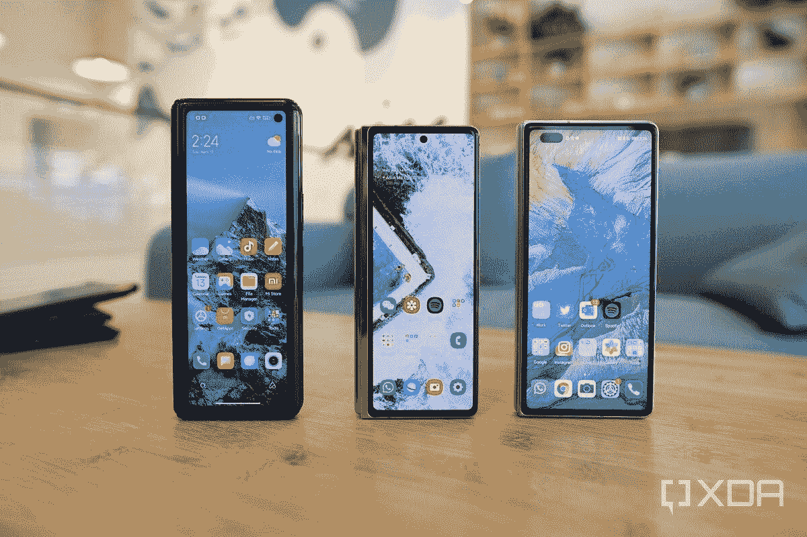
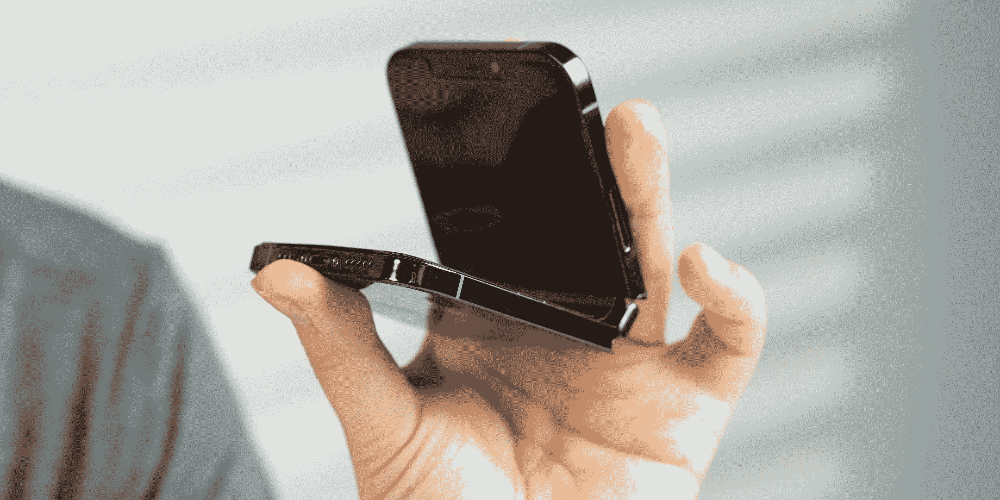

# 即使它很糟糕，谷歌像素折叠对可折叠世界来说也是很棒的

> 原文：<https://www.xda-developers.com/google-pixel-fold-foldable-scene-forward/>

有传言称，谷歌在一年多的时间里一直在研发可折叠手机。本周，我们终于看到了一些可靠的消息，不仅仅是它的外观，还有我们什么时候可以期待发布——显然，所谓的像素折叠将在明年五月发布。

从 YouTube 频道[头版科技](https://www.youtube.com/watch?v=1EZ7kTK0HLY) *，*分享的产品渲染图中，我们可以看到 Pixel Fold 使用了三星首创的相同的内折叠外形，背面设计继承了 Pixel 7 系列的设计语言。在我看来，它看起来不错。

问题是，谷歌*没有*在第一次(甚至第二次)就获得硬件的良好记录。正如我在我的 [Pixel 7 评测](https://www.xda-developers.com/google-pixel-7-review/)中指出的，之前的每个 Pixel 都有一个明显的硬件缺陷，有些缺陷如此严重，以至于我在评测期过后就不再使用它们了。考虑到可折叠手机的构造远比平板手机复杂，我不认为 Pixel Fold 的构造会像[顶级可折叠手机](https://www.xda-developers.com/best-foldable-phones/)那样好。见鬼，即使按照现在的渲染，对于 2023 年的设备来说，边框看起来也异常厚。

但即使像素折叠硬件真的失败了——假设屏幕只有 60Hz，铰链不能在中间折叠，电池寿命很短——它的存在仍然是重要和必要的，因为它将做三件事。

## Pixel Fold 最终让三星 foldables 在全球舞台上展开了竞争

可折叠场景现在非常奇怪。除了一个国家，三星在全球范围内几乎垄断了整个行业。在中国，可折叠场景正在蓬勃发展，竞争异常激烈。目前，Galaxy Z Fold 4 有不下五种可行的替代品，年底前还会有更多。

 <picture></picture> 

Foldables from Xiaomi, Samsung, and Huawei (left to right). 

小米、三星和华为的三款可折叠手机

让事情更加复杂的是，这些只在中国销售的中国可折叠手机并不是技术低劣的二流设备。事实上，其中一些可折叠产品的硬件比三星放在商店货架上的任何产品都要好。[小米 Mix Fold 2](https://www.xda-developers.com/xiaomi-mix-fold-2-review/) 明显更薄；[华为 Mate X2](https://www.xda-developers.com/huawei-mate-x2-review/) 拥有更强大的摄像系统；Vivo X Fold 有一个无褶皱的显示屏，下面有一个内置指纹扫描仪。所有这些设备都可以完全折叠，不会留下三星所有可折叠设备中存在的间隙。它们的价格也更低。

 <picture></picture> 

The Xiaomi Mix Fold 2 (right) is so, so much thinner than the Galaxy Z Fold 4. 

Galaxy Z Fold 4(左)和小米 Mix Fold 2(右)。

中国品牌迄今为止只在中国推出了这些可折叠产品，这让可折叠爱好者感到沮丧，但这对三星来说显然是个好消息。

我真的很喜欢 Galaxy Z Fold 4，如果我必须选择最好的*整体*可折叠手机，它仍然会在名单上排名第一。它拥有最精良的软件，但 Fold 4 的硬件远非最佳。我不敢相信三星苛刻的显示屏折痕和折叠间隙在四代之后仍然存在。我也很失望，三星没有为其可折叠手机提供最好的相机系统，特别是 Galaxy S21 和 S22 Ultra 中令人敬畏的 10 倍潜望镜变焦镜头。

 <picture></picture> 

A Samsung foldable display crease (right) next to a Chinese foldable with a far less prominent crease. 

我不认为 Fold 4 与中国可折叠手机相比在硬件上的不足是因为三星方面缺乏能力，而是缺乏意愿。多年来，三星一直呼吁让其可折叠产品更容易进入主流市场，因此它决定瞄准更低的价格，而不是追求最佳的可折叠创新。

在我看来，三星能够通过可折叠硬件开发继续巡航控制，因为它在全球范围内没有竞争对手。相反，中国的可折叠手机必须在厚度、电池尺寸、相机硬件和其他领域不断突破界限，因为它们面临着很多竞争。品牌竞争，消费者赢。目前，三星在中国以外没有竞争对手。

Vivo X Fold(中)与三星 Galaxy Z Fold 4(右)和 Oppo Find N(左)。

像素折叠的存在改变了这一点。至少，谷歌的可折叠手机将在美国销售，这是三星最重要的市场之一。一旦消费者有了另一种选择，三星将不再能够巡航。

## Pixel Fold 意味着谷歌将进一步优化 Android 的可折叠功能

早期困扰可折叠手机的一个问题是，Android 不知道如何适应具有两种不同屏幕纵横比的设备，特别是因为手机的展开形式导致了不寻常的方形纵横比。我记得在 2019 年使用最初的 Galaxy Fold，大多数应用程序只会扩展到充满屏幕，裁剪掉边缘，有时会导致应用程序无法使用。

值得称赞的是，三星与谷歌合作优化了一些应用程序，以适应奇怪的屏幕尺寸，到了第二代 Fold 2，问题就不那么突出了。三星和小米等可折叠手机品牌也内置了系统范围的缩放设置，允许用户手动添加立柱框(左右两侧垂直运行的数字挡板)，以“强制”未经优化的应用程序在可折叠屏幕上正确显示(参见下图中的 Instagram)。

在 Galaxy Z Fold 2 上，有一个信箱。

这些都是解决问题的创可贴，而不是治愈方法。谷歌开始用 Android 12L 为可折叠设备(和平板电脑)优化 Android，Android 12L 引入了利用额外屏幕空间的原生 UI 元素，以及一个非常有用的任务栏，类似于计算机主屏幕 dock。

随着可折叠屏幕的出现，谷歌肯定会更加努力地为可折叠屏幕优化 Android。这些潜在的软件功能不仅会在 Galaxy Fold 上推出，还会在小米、Vivo、Honor 等公司的 foldables 上推出。随着可折叠手机在美国变得越来越突出，这也可能吸引主要开发商为可折叠手机优化他们的应用程序。

## 如果谷歌正在这么做，或许苹果会更加关注

根据可靠的行业分析师 Kuo Ming-chi 和 Ross Young 的说法，苹果确实在开发可折叠手机，但这需要时间。这完全是这家科技巨头的品牌，它从未费心去追逐最新的硬件突破。

 <picture></picture> 

A fan-made foldable iPhone. 

苹果在把用户锁在它的围墙花园里方面做得如此出色，以至于 iPhones 几乎不受安卓方面激烈竞争的影响，这是有帮助的。因此，苹果可以按照自己的节奏开发移动硬件技术。

但也许谷歌进入可折叠手机领域会增加苹果制造可折叠手机的兴趣。亚洲的原始设备制造商这么做是一回事，但当你的硅谷竞争对手也这么做时，那就是另一回事了。这纯粹是我的猜测，但我认为，如果在山景城 12 分钟车程以外的地方开发可折叠产品，库比蒂诺的人们会更加关注。

## 我相信手机的未来是可折叠的

从第一天开始，我就完全支持可折叠的潮流。但我是那些疯狂的手机发烧友之一。甚至在我以写手机为生之前，我会每隔几个月就升级手机。我理解主流休闲消费者对高成本、易碎和体积增大的怀疑。

然而，在三星、小米、Oppo、Vivo 和华为的帮助下，这些批评正在得到纠正。在中国，可折叠手机的价格低于 iPhone 14 Pro Max。这并不意味着可折叠手机是“负担得起的”，但它们不像过去那样昂贵。可折叠结构也有所改善，使他们不再觉得脆弱；Galaxy Z Fold 4 实际上是像坦克一样建造的。三年来，我一直在大量使用可折叠手机，摔过几次，还没有损坏过一个。至于增加的笨重？小米用 Mix Fold 2 解决了这个问题。它几乎不比 iPhone 14 Pro Max 或 Galaxy S22 Ultra 厚。

 <picture></picture> 

The Huawei Mate Xs

随着可折叠设备的不断成熟，以及谷歌对安卓软件的不断微调，可折叠设备不受损害的那一天终将到来。它们只是“普通”的手机，只是有一个更大的屏幕，可以放在我们的口袋里。谁不想这样呢？

带上谷歌像素折叠。好与坏，几乎无关紧要。它将给予三星急需的竞争，给消费者更多的选择，推动可折叠场景向前发展。

Galaxy Z Fold 4 带回了 Fold 3 的所有优点，外加一个更好的相机系统，一个稍宽的外部屏幕和更智能的软件。