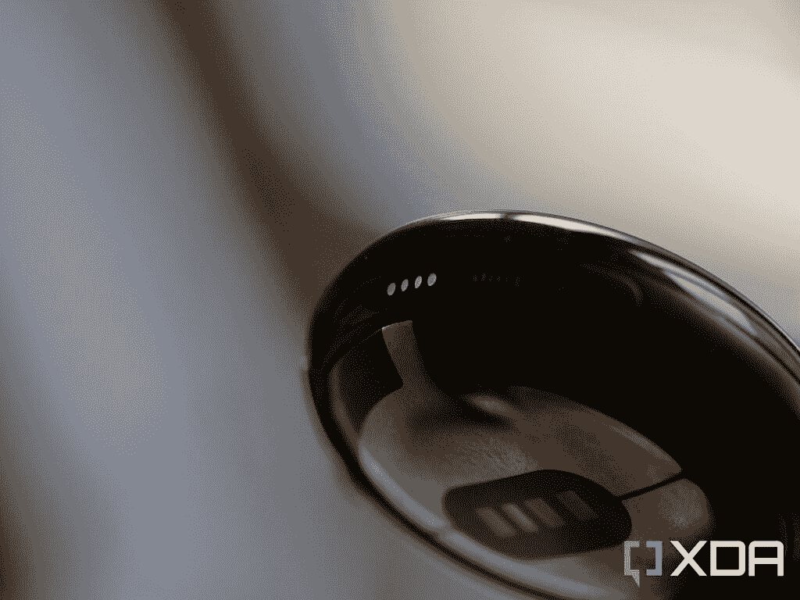

# 谷歌 Pixel Watch 内核源代码上线，但你不能做太多

> 原文：<https://www.xda-developers.com/google-pixel-watch-kernel-source-developer-friendliness/>

谷歌的 Wear OS 在许多方面已经成熟，随着 [Pixel Watch](https://www.xda-developers.com/google-pixel-watch-hands-on/) 的推出，智能手表的战场必将变得更加有趣。由于其创新的软件功能和与 Fitbit 核心健康功能的深度集成，谷歌的第一款智能手表具有独特的定位，可以在这一细分市场掀起风暴。

高级用户和开发人员倾向于谷歌设备还有另一个原因:解锁引导加载程序和运行第三方软件的能力，这要归功于山景城公司的售后开发友好性。这项政策吸引了许多用户参与修改或更换 Nexus 和 [Pixel 智能手机](https://www.xda-developers.com/best-pixel-phones/)上的预装软件。然而，Pixel Watch 的情况略有不同，因为这款设备的修补可能性非常有限。

嗯，这都是观点的问题。当你购买价格接近 350 美元的手表时，你往往会考虑规格和功能多于其他任何事情。你永远不会想到你的新穿戴设备对改装场景有多友好。或者，如果它使用回收材料和升级内容。你只是想要一款[最好的智能手表](https://www.xda-developers.com/best-smartwatches/)，感觉很高级，而且很耐用。

但这里是 XDA，这意味着这里的人们喜欢完全控制他们拥有的硬件——尤其是如果上面有“Pixel”品牌的话。如果你正在考虑购买 Pixel 手表，彻底了解一下它的改装友好性可能是个好主意。

**浏览本文:**

 <picture></picture> 

Google Pixel Watch

Pixel Watch 是谷歌的第一款 Wear OS 智能手表，具有独特的设计，支持许多健身跟踪功能。

* * *

## 谷歌 Pixel Watch 自带可解锁的引导加载程序吗？

可惜，**答案是否定的**。

与谷歌的 Pixel 手机不同，Pixel 手表没有可解锁的引导程序。虽然你可以启用开发者选项，但谷歌甚至没有在设备上提供典型的“OEM 解锁”开关。

不解锁 bootloader，就没有办法在第一代 Pixel 手表上运行第三方二进制。如果您正在寻找 root 访问权限，您必须依靠操作系统或硬件平台中的潜在安全漏洞来设计一种非官方的引导加载程序解锁方法。此外，一个锁定的 bootloader 意味着绝对零售后软件更新，所以在官方支持结束后没有[非官方扩展](https://www.xda-developers.com/samsung-gear-s3-wear-os-port/)。

当我们就引导加载程序的可解锁性联系谷歌时，我们得到了以下回应:

> 虽然 bootloader 本身并不比 Pixel 手机更严格，但 Fitbit 目前并没有提供解锁 bootloader 所需的调试适配器。

我们知道表带连接器内部有弹簧针。如果通过这些弹簧针进行调试是可能的，那么谷歌可能会在未来的软件更新中启用 OEM 解锁开关，并允许我们解锁 Pixel Watch 的引导加载程序。但目前，该设备只能运行谷歌的官方软件。

 <picture></picture> 

Pogo pins on the Google Pixel Watch

* * *

## Pixel Watch 是否有任何用户可刷新的工厂图像？

谷歌[为其 Pixel 智能手机的工厂图像和完整 OTA 包维护了一个专用的下载门户](https://developers.google.com/android/images)。该公司还提供了一个方便的[基于网络的 flash 工具](https://flash.android.com/)，用于轻松刷新。

然而，**Pixel Watch 没有这个选项**，至少目前没有。事实上，缺乏可解锁的引导加载程序意味着普通用户无法刷新官方工厂映像，即使谷歌提供了它们。

* * *

## 内核源代码呢？

GNU 通用公共许可证第 2 版(GPLv2)要求每一个 Android 设备制造商公开发布他们设备上的 Linux 内核代码部分。一个理想的内核源代码版本应该附有适当的提交历史，并且所有的依赖关系都应该被适当地记录下来。

由于 Wear OS(只不过是为智能手表和其他可穿戴设备设计的 Android)是建立在 Linux 内核之上的，谷歌必须应客户要求提供 Pixel Watch 的内核源代码。该公司在发布此类资源方面有着出色的记录，谢天谢地，Pixel Watch 也不例外。

如果您是一名开发人员，并且有兴趣研究与 Exynos 9110 SoC 以及手表的其他硬件组件相关的零碎内容，请通过以下链接查看内核源代码:

**Google Pixel Watch(代号:“rohan”)内核来源:[平台](https://android.googlesource.com/kernel/exynos/) |||模块([配置](https://android.googlesource.com/kernel/exynos-modules/config/) || [设备树](https://android.googlesource.com/kernel/exynos-modules/devicetree/) || [驱动](https://android.googlesource.com/kernel/exynos-modules/drivers/) )**

请记住，您需要关注以“android-wear-11.0.0”开头的标签。但是，没有可用的设备树源。

虽然内核源代码的可用性可能有助于为 Pixel Watch 构建自定义恢复或基于 AOSP 的 ROM，但如果没有解锁的引导加载程序，您就无法安装它们。

* * *

## 谷歌会为 Pixel 手表提供类似于 Pixel 手机的测试程序吗？

Pixel 手表保证在 2025 年 10 月之前从谷歌获得软件更新。这是手表三年的软件更新，而该公司已经证实，它将为其旗舰产品 [Pixel 7 系列](https://www.xda-developers.com/google-pixel-7-hands-on/)提供至少五年的软件更新。

除了前面提到的差异，**没有为 Pixel Watch 社区**计划测试程序。这听起来很合理，但是，为一个没有公开下载工厂图像的设备提供 beta 质量的软件真的不是一个好主意。

* * *

如果你想买一款简约的 Wear OS 智能手表，那就去买谷歌的产品吧。它还可以让你访问 Fitbit 智能手表上的许多功能，这是一个很大的优势。尽管如此，Pixel Watch 远不是许多人认为的修补 Wear OS 的理想参考设备。

**[谷歌像素手表 XDA 论坛](https://forum.xda-developers.com/f/google-pixel-watch.12613/)**

**你觉得 Pixel 手表值得买吗？我们很想知道你的意见！请在评论中分享你的想法。**