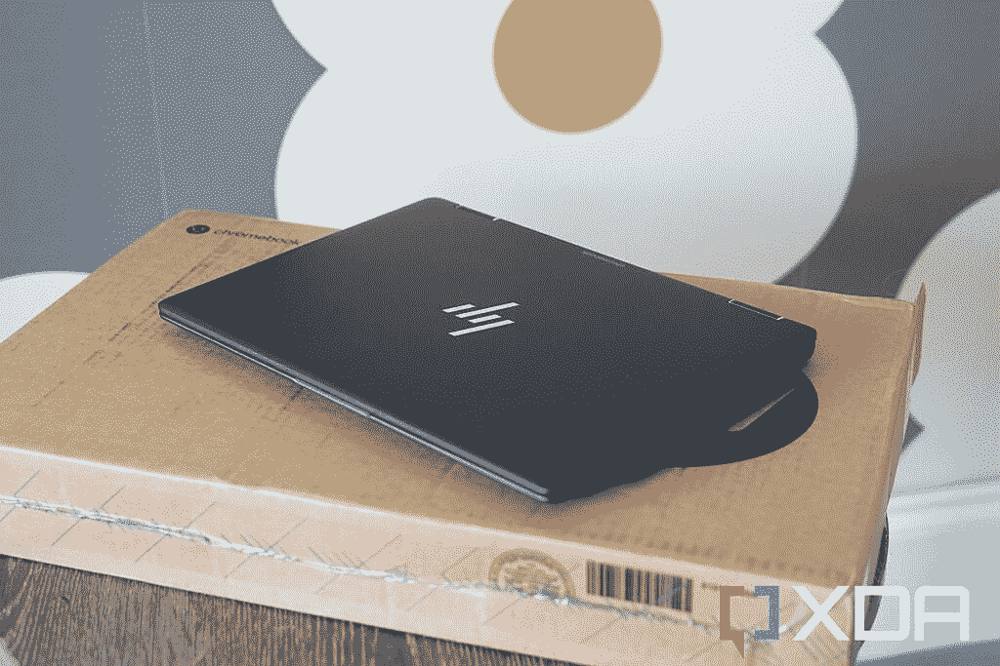

# 好消息:谷歌不再需要 Pixelbook 了

> 原文：<https://www.xda-developers.com/google-pixelbook-not-needed/>

嗯，就是这样。根据一份新的报告，谷歌已经解散了其正在开发下一款 Pixelbook 的团队，这意味着其第一方 ChromeOS 硬件计划不再存在。它加入了山景城公司已经终止的越来越多的产品名单，被一些人戏称为被谷歌终止。

我对这个消息的反应是响亮的...咩。如果我回头看看 2019 年的 Pixelbook Go 这样的产品，如果没有新的产品，我真的会觉得自己错过了吗？老实说，我想我们都会没事的。

## 第一方硬件被高估了

我称之为苹果效应。苹果因拥有全套硬件和软件而闻名，无论你喜欢还是讨厌这些产品，它们都非常有名。自然地，当软件制造商开始制造自己的硬件时，我认为人们期望他们将得到苹果客户所得到的。至少，他们认为他们会从这个软件中获得最好的体验。

这对每个人都不好。让客户认为他们从 Pixelbook 获得了最佳体验是不好的，如果这是真的，那就更糟了。

与苹果的生态系统不同，ChromeOS 是开放的，任何人都可以制作 Chromebook。这类似于 Windows 几十年来的工作方式。就像 Windows 一样，世界上有成千上万的原始设备制造商生产 Chromebooks。许多这样的公司已经生产笔记本电脑几十年了。在这样一个开放的环境中，谷歌的 Pixelbook 应该比其他公司提供的更好，这没有任何意义。

 <picture></picture> 

HP Elite Dragonfly Chromebook

现在，我将把你的注意力吸引到[惠普精英版蜻蜓 Chromebook](https://www.xda-developers.com/hp-elite-dragonfly-chromebook-review/) 上。这款笔记本电脑重量仅为 2.8 磅，具有 3:2 显示屏，可选 4G LTE，搭载英特尔第 12 代 U 系列处理器，最高可配酷睿 i7，具有 Thunderbolt 4 连接功能，并在 Chromebook 中提供了第一个触觉触摸板，所有这些都在时尚的蜻蜓蓝色机箱中。如果我想在 Chromebook 上获得最佳体验，我会更倾向于*而不是*。

然后是[联想 Chromebook Duet 5](https://www.xda-developers.com/lenovo-ideapad-duet-5-chromebook-review/) 。这是一款 13.3 英寸的平板电脑，配有有机发光二极管显示屏，有双色深渊蓝，售价 499 美元。它非常可爱，是我们最好的 Chromebooks 列表中最好的平板电脑。如果 13.3 英寸的平板电脑对你来说太大了，也有更小的型号。

三星也做得很好，无论是其 4K 有机发光二极管 Galaxy Chromebook 还是 QLED [Galaxy Chromebook 2](https://www.xda-developers.com/samsung-galaxy-chromebook-2-review/) 。当你开始审视 ChromeOS 生态系统和各种各样的可用设备时，我的问题是，你缺少什么，谷歌可以用新的 Pixelbook 来解决？

就像我说的，只是第一方硬件更好的看法是有问题的。如果谷歌以某种方式支持自己的 Chromebooks，而不支持其他设备，那么答案应该是更好地支持第三方设备。就这么简单。

## 谷歌 Pixelbook 在 2013 年更有意义

每个人都喜欢像素，对吧？你知道我的意思，当然是 Chromebook 的像素。在 Pixel 之前，谷歌手机曾经是该公司内部 Chromebooks 的品牌。2013 年 2 月，第一款 Chromebook Pixel 宣布采用第三代英特尔酷睿 i5 和 12.85 英寸 3:2 显示屏。尽管只包装了 4GB DDR3 内存和 32GB 固态硬盘，但它的起价为 1299 美元。

当时，目标与微软新推出的 Surface 系列产品非常相似。这是向原始设备制造商展示什么是可能的。在 2013 年，1300 美元的 Chromebook 的想法是荒谬的，但凭借合适的英特尔酷睿处理器和 2,560x1,700 的显示屏(谷歌实际上击败了微软的 3:2 热潮)，它实际上是一种溢价，因为 ChromeOS 被视为以极低的价格获得性能良好的低端笔记本电脑的一种方式。

下一代 Chromebook Pixel 于 2015 年上市，配备第五代英特尔处理器和 8GB 内存。随后是 2017 年的 Pixelbook，增加了第七代处理器，最高可达 Core i7，最高可达 16GB RAM，最高可达 512GB SSD。2018 年推出了 Pixel Slate，这是一款谷歌宣布永远不会更新的平板电脑。然后在 2019 年，我们得到了 Pixelbook Go，它的设计比以前的 Chromebook Pixel 笔记本电脑更主流。

但是随着 Pixelbook 系列的发展，市场的其他部分也在发展。如上所述，我们开始看到优质的 Chromebooks。惠普、戴尔、联想等公司也开始生产面向企业的 ChromeOS 设备。这个市场现在已经成熟，它不再渴望像谷歌在 2013 年那样的入口。

## 电话就不一样了...和手表

显然，谷歌将继续其 Pixel 手机，它还有一款 Pixel 手表，将于下个月与 Pixel 7 一起推出。那是不同的。在美国，实际上只有四个高端智能手机品牌:苹果、三星、谷歌和一加。你可以把摩托罗拉加入其中，但 Moto 在高端方面还有一些工作要做。如果你把谷歌排除在外，你在安卓方面只剩下三星和一加，如果你想要出色的智能手机摄影，那就只有三星了。在智能手机市场，谷歌给了你其他方式没有的选择。

它也给你像素的体验，这是非常接近于股票 Android。手机有不同的软件体验，笔记本电脑不是这样。当我们谈论 Chromebooks 时，这纯粹是一场硬件对话。

我们不要忘记 Pixel 手表。Wear OS 市场已经相当陈旧，而且已经持续了一段时间。三星是唯一一家使用最新版本 Wear OS 制造主流手表的公司，谷歌需要一款可穿戴设备的英雄产品。这是有道理的，Pixel 手表将致力于使这一类别合法化，希望能激励其他原始设备制造商也生产智能手表。

就我个人而言，我喜欢由 ChromeOS 和 Windows 等产品创建的生态系统，正是因为有这么多种公司在生产这么多种产品。每个人都有真正想要的东西。谷歌可能会得到所有的头条新闻，但我不需要一些第一方的英雄产品来炫耀 ChromeOS 可以做什么。给我看看惠普 Chromebook x11 平板电脑，或者戴尔的 Latitude 7410 Chromebook。我对那些东西更感兴趣。