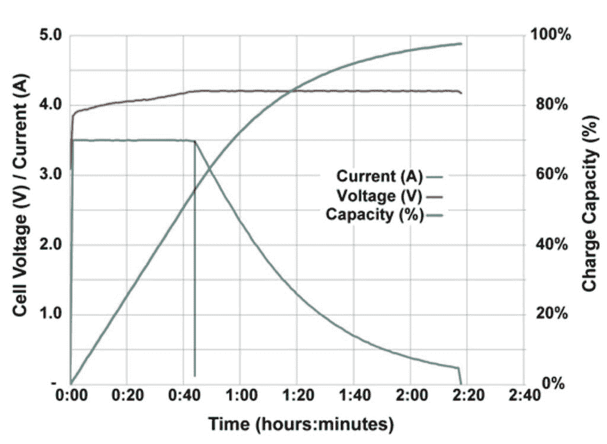
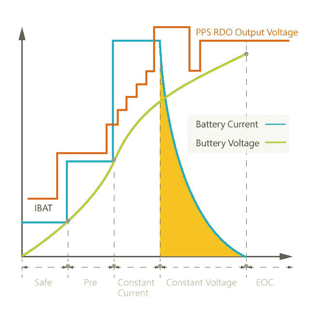
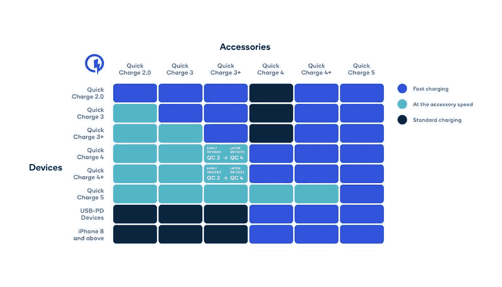

# 快速充电是如何工作的，如何使用最快的充电技术

> 原文：<https://www.xda-developers.com/how-does-fast-charging-work/>

智能手机变得越来越智能，因此，我们的智能手机使用量也在不断膨胀。智能手机使用量的激增促使公司设计出更新的方法来改善电池备份。虽然将电池做得更大是最明显的选择，但它给智能手机带来的体积膨胀也是不可避免的。下一个最好的选择是削减充电的痛苦等待时间，让用户从几分钟的充电中获得几个小时的使用时间。快速充电的需求与我们的智能手机需求同步增长。这就是为什么几乎所有的智能手机制造商都试图通过现有的充电技术来竞争。

在本文中，我们将讨论快速充电到底是什么，智能手机中的锂离子电池如何工作和充电，不同的通用和专有充电标准，以及如何为智能手机选择正确的充电器。您也可以通过单击或点击以下内容列表中列出的属性之一直接跳转到相关部分:

* * *

## 什么是快充？

智能手机公司经常吹嘘他们的手机比竞争对手充电更快。“快速充电”一词被频繁使用，同时还有声称几乎在几分钟内就能给手机电池充满电的说法。如果这还不够令人印象深刻的话，品牌还推销他们的手机充电瓦特数。这一切意味着什么？

手机的充电能力是以瓦特(W)来定义的

智能手机的充电能力通常由其支持的最高瓦特数来定义。电功率是电能传输的速率，用瓦特(W)或焦耳每秒(J/s)来表示。

功率是电压(T0)和电流(T2)的乘积，电压也被称为电位差，用伏特(V)表示，电流用安培(A)表示。对于智能手机来说，充电功率取决于充电器传输的电流量，以及智能手机在特定电压下成功接受的电流量。

智能手机的典型充电率或功率值为 10W (5V x 2A)。当智能手机能够以高于 USB 标准支持的最低速率的任何速率从充电砖接收电力时，它被认为支持快速充电。microUSB 和 USB-C 的标准充电率分别为 10W 和 15W(*USB-C 的标准充电率可根据品牌偏好而有所增减*)。电能传输速率由智能手机和充电器支持的电流和电压值决定。在接下来的部分中，我们将详细说明这些值是如何确定的。与普遍的看法不同，快速充电对智能手机的依赖程度不亚于对快速充电砖的依赖程度，因此找到合适的匹配非常重要。

简单来说，任何能以 15W 或更高功率充电的智能手机，在技术上都支持快充。然而，智能手机行业正在努力实现更快的充电速度。各公司已经突破了极限，提供了高达 210 瓦的智能手机充电率。其他品牌正在争取更高的价格，但也有收益递减的因素。

* * *

## 智能手机电池如何充电？

在我们讨论锂离子电池如何工作或充电之前，这是传统电池的工作和充电方式。传统上，电池或化学电池储存化学能。当一个装置，如灯泡，被连接在它的正极和负极之间时，这种化学能被转化为电能。当使用电池时，电子从阳极*或负端(或电极)*流向阴极*或正端*。这种电子流——或负电荷——就是我们通常所说的“电流”

*电池放电和充电示意图；来源:[澳大利亚科学院](https://www.science.org.au/curious/technology-future/batteries)*

随着时间的推移，这种从负极流向正极的电流会耗尽电极并最终停止。幸运的是，许多电池上的电极可以通过连接外部电流源来再生，这个过程通常被称为充电。当我们把电流源的两端连接起来时，电子的流动方向就反过来了，这种变化使得电极得到补充。

这是一个有趣的动画，解释了电池如何工作。

电流的流动速度取决于储存在电极上的能量之间的差异。这种差异被称为电势差——或通常被称为电压——当电子粒子从电池的一端移动到另一端时，它会发生变化。

上面的图片展示了电池的理想特性。但正如你所料，在补充衰变后，电极可能不会像以前一样。在现实生活中，随着时间的推移，这些不规则性会导致可充电电池腐蚀。虽然智能手机中使用的锂离子电池很少出现这些缺陷，但它们在高电压下往往会受到压力。我们将在以后的阶段讨论这个问题。

### 锂离子电池如何充电

锂离子电池是智能手机和其他电子设备中最常见的电池类型，因为它具有高能量密度。与我们上面讨论的理想系统不同，锂离子电池不是以恒定的速率充电，而是分三个阶段充电。

 <picture></picture> 

Different stages of Li-ion battery charging; Source: [Battery University](https://batteryuniversity.com/index.php/learn/article/charging_lithium_ion_batteries)

以下是锂离子电池充电的三个阶段:

**恒定电流** —当手机连接到充电器，即外部电源时，电池的电压立即上升，而电流保持恒定。电流流过电池的端子后不久，电压以比以前更慢的速度增加，电流继续保持恒定。这是电池在任何时间点所能容纳的最大电流量。

**饱和** —锂离子电池对高电压非常敏感，因此内置了保护系统，以防止电压超过特定的规定值。当充电电池趋于其推荐峰值电压时，电流减小，电压以不稳定但缓慢的速度增加。

**封顶** —当电池最终达到峰值时，电压停止上升，而电流随着电池达到最大容量而继续下降。当电流最终停止流动时，电池充满电。

* * *

## 快充是如何工作的？

由于锂离子电池可能会因高电压而损坏，制造商通常指望高电流传输速率来快速充电手机电池。快速充电旨在最大化恒流阶段的效用，以便在电压达到峰值之前将最大电荷转移到电池。

智能手机内部的专用电路用于限制电压和电流。标准电压调节器在不改变电流的情况下限制电压，这就是为什么旧手机在充电时经常发热。这些电路确保电池的温度保持在允许的水平以下，并保持电池的健康。

在高压充电中，电压下降，电流上升。

尽管锂离子电池由于电压而存在局限性，但具有高功率输出支持的充电器采用了高电压和低电流的组合。智能手机内部的电路使电流上升，电压下降。具有高压充电功能的智能手机具有称为[降压转换器](https://www.allaboutcircuits.com/technical-articles/buck-converters-and-their-cool-applications/)的仪器，可以在增加电流的同时将高压转换为低压。

这使得智能手机制造商可以使用高达 20A 甚至更高的高电流值来为典型电压为 4.2V 的锂离子电池充电，与标准调节器相反，降压转换器可以更有效地将高电压转换为高电流，而不会以热量的形式损失太多能量。

即使在快速充电中，电池在恒定电流和饱和阶段充电非常快，最终在封顶阶段变慢。这就是为什么智能手机制造商经常声称可以在 20 分钟内充满 60%的电池，因为这是充电最快的区域。

在接下来的章节中，我们将讨论不同智能手机制造商的各种方法，以确保他们的设备尽可能快地充电。在此之前，有一个更重要的问题需要回答，那就是让我们的手机一直插在充电器上。

### 充电的时候应该用手机吗？

锂离子电池通常每节电池的峰值电压值为 4.2V。当电池连接到电源并处于充电阶段时，它在峰值电压附近工作。 [*电池大学*](https://batteryuniversity.com/index.php/learn/article/charging_lithium_ion_batteries) 指出，因为高电压会对电池造成压力，当电池充满电时，它往往会回到较低的电压。因此，当电池充满电时，充电被切断。但是，当充电器长时间连续连接时，电池会保持高电压，这可能会导致不稳定，并可能会降低电池的健康状况。

充电时频繁使用智能手机会产生通常所说的寄生负载。当电池同时使用和充电时，会缩短电池寿命并增加发热。这种同时充电和放电会扭曲电池的充电周期并缩短其寿命。此外，如果电池处于恒压阶段，这可能会给电池带来额外的压力，从而影响电池的寿命，甚至增加自燃或爆炸的可能性。

虽然智能手机原始设备制造商有内置的安全机制来减轻这些风险，并适应同时充电和使用的广泛使用情况，但风险仍然存在，即使非常低。

* * *

## 快速充电的通用标准

快速充电目前非常普遍，但这种普遍流行的基础是在近 10 年前建立的。早期的 USB 标准可以在 5V 的电势差下提供 0.5A 的最大电流，从而产生 2.5W 的总功率输出。2010 年发布的 USB 3.0 规范将 5V 电势差下的电流传输限制提高到 0.9A，USB Type-A 端口上的功率输出为 4.5W。

相关:[你需要知道的关于 USB 标准、速度和端口类型的一切](https://www.xda-developers.com/usb-standards-explained/)

同时，使用微型 USB 电缆的传统充电器通常提供 10W (2A，5V)的功率，而 USB Type-C 充电器通常提供 15W (3A，5V)的功率。然而，智能手机制造商已经将充电速度推得远远超过这些适中的值。

### USB 供电(USB-PD)

2012 年，USB 推广组织宣布了一个更先进的向便携式设备供电的标准，并将其命名为 USB 供电(USB-PD)。该标准是专为满足耗电设备的需求而设计的。第一代 USB-PD 允许通过微型 USB 接口传输高达 60W 的功率，通过 USB Type-A 和 Type-B 连接器传输高达 100W (5A，20V)的功率。USB-PD Gen2 规范是作为 USB 3.1 标准的一部分发布的，它支持通过 USB Type-C 传输高达 100W 的功率。MacBooks 和 Dell XPS 等现代笔记本电脑利用这一标准进行超级快速充电。

带有 USB-PD 的设备可以使用各种电压值，如 5V、9V、15V、20V 或更高。然而，这些值是不可协商的，并且最大公共值被选择用于功率输送。

**电力数据对象(PDO)**

当我们将 USB-PD 充电器等电源连接到支持的设备(接收器)时，它会传输支持的电流和电压规格值。这种广播被称为电力数据对象(PDO)。作为回报，设备或接收器以其支持的值进行响应，这被称为请求数据对象(RDO)。双方支持的电压的最高匹配值被选择用于电力传输。如果不匹配，数据会发生变化，直到达到一个公共值。这种相互作用在确定最大充电速率时起着至关重要的作用。

例如，如果 USB-PD 充电器支持 5V、9V、15V 或 20V 等电压值，而智能手机仅支持 5V 和 9V，则充电将发生在 9V，最大支持电流对应于 9V。

虽然 USB-PD 仅在这些指定的电压值下工作，但一个更新的标准允许在源和宿之间进行更动态的电压协商。

### USB-PD PPS(可编程电源)

2017 年，USB 实现者论坛(USB-IF)协会在 USB-PD 3.0 规范中引入了 USB-PD PPS(可编程电源)。虽然以前的规格仅支持约 5V 的标准电压增量，但 PPS 允许电流(50mA 的步长)和电源电压(20mV)的更小步长变化。

 <picture></picture> 

Current and voltage negotiation in systems with USB-PD support; Source: [Pengo Home](https://www.pengohome.com/Learn_Detail.asp?LiD=D15D68D2FEB0FC44E732AA2EF5A01CFE)

这种微控制可以更有效地降低电压和提高电流，从而减少散热形式的能量损失。同时，PPS 允许在上述恒流供电阶段电压逐渐增加。

尽管开放的 USB 规范为统一和标准化的充电方法铺平了道路，但智能手机品牌和芯片制造商也创建了自己的专有标准，宣传智能手机的充电功率超过 100W。

* * *

## 快速充电的专有标准

专有的快速充电标准比更广泛接受的 USB 快速充电规范发展得更快。这是因为 USB 实现者论坛(USB-IF)协会在建立与专有协议同等的标准充电协议方面的延迟。当我们独家看智能手机的时候，USB-PD 和 PPS 已经被限制在 45W 的功率输出。相比之下，OPPO、Vivo 子品牌 iQOO 和小米等公司已经展示了突破 100W 大关的专有充电技术。在这一部分中，我们来看看原始设备制造商采用的一些最受欢迎的专有快速充电解决方案。

### 高通快速充电

高通的快速充电是最常见的快速充电标准之一。很明显，这种广泛的受欢迎程度可以归功于该公司的骁龙芯片组的受欢迎程度。最重要的是，尽管不同品牌实施了高通的快速充电技术，但充电器并不仅限于品牌，而是与所有支持的设备交叉兼容。

高通的快速充电功能为不同的充电器和智能手机品牌提供了交叉兼容性。

第一版快速充电于 2013 年推出，骁龙 600 是第一个支持它的芯片组。通过快速充电 1.0 认证的充电器支持 5V 的 2A 电流通道，最大功率输出为 10W。

[快充 2.0](https://www.qualcomm.com/news/onq/2015/06/30/qualcomm-quick-charge-20-technology-explained) 于 2014 年到来，同时到来的还有骁龙 800 系列 SOC。新规范将最大支持电压提高到了 12V。随着电压的增加，最大允许电流也增加到 3A。因此，使用 microUSB 电缆时，总输出功率从 10W 增加到 24W，使用 USB Type-C 电缆时增加到 36W。然而，实际上，大多数制造商将充电限制在 18W，因为这在当时已经足够快了。各种高通芯片组都支持快速充电 2.0，包括骁龙 200、骁龙 400、Snapdragon 410、Snapdragon 615、Snapdragon 800、骁龙 801、骁龙 805、Snapdragon 810，并且在推出时已经有至少 20 家原始设备制造商支持这项技术。

在接下来的一年里。2015 年，高通公布了[快充 3.0](https://www.qualcomm.com/news/releases/2015/09/15/qualcomm-introduces-next-generation-fast-charging-technology-quick-charge) ，最显著的变化是加入了 INOV(智能协商最优电压)。这使得电源管理 IC 能够以 200mV 的小步长协商电压，以确保恒流阶段的电压逐渐增加，这最终将成为我们上面提到的 PPS 技术的基础。这也使得原始设备制造商能够瞄准更高的充电器电压值——在 3.6V 到 20V 之间。电流限制也增加到了 4.6A。在 Quick Charge 3.0 中，高通还改进了其并行充电技术——*现在称为双充电+*——这将允许充电器将输入的电力分成两股并行的电流，以避免过热。一些最早支持快速充电 3.0 的 SOC 包括 Snapdragon 820、骁龙 620、骁龙 618、骁龙 617 和骁龙 430。

2016 年，高通宣布推出[快充 4.0](https://www.xda-developers.com/qualcomm-announces-quick-charge-4/) ，具有更高效的热量管理和更好的过流或过压保护。关键的补充是与 USB-PD 的交叉兼容性。高通推出了 Snapdragon 835 芯片组。第二年发布的 Quick Charge 4.0+主要是为了改进热保护和安全功能。快速充电 4.0+充电器还向后兼容支持快速充电 1.0、2.0 和 3.0 的智能手机。另一方面，快充 4 不是向后兼容的。

在长达三年的间隙之后，高通宣布在 2020 年推出支持超过 100W 功率输出的[快充 5.0](https://www.qualcomm.com/products/features/quick-charge) 。快充 5.0 与 USB-PD PPS 交叉兼容。新标准支持峰值速度下的双电池充电，同时最大限度地减少发热。要使用双充电，手机必须支持分成两个单元的电池。[小米 Mi 10 Ultra](https://www.xda-developers.com/xiaomi-mi-10-ultra-redmi-k30-ultra-flagships-commemorating-xiaomi-10th-anniversary-launch/) 是第一款支持高通快充 5.0 的[智能手机。](https://www.xda-developers.com/xiaomi-mi-10-ultra-first-phone-qualcomm-quick-charge-5/)

 <picture></picture> 

Qualcomm Quick Charge compatibility chart

与 Quick Charge 4.0、4.0+和 5.0 兼容的充电器也支持在苹果 iPhones 上更快地充电，正如你在上面的兼容性图表中看到的那样。

联发科也有与其竞争对手高通类似的专有快速充电协议。联发科为其快速充电技术起了一个花哨的绰号叫“泵快车”。

2014 年，联发科发布了规格类似于高通快充 2.0 的 Pump Express Plus。它支持高达 12V 的电压和 2A 电流。次年，联发科公布了与快充 3.0 并行的 Pump Express Plus 2.0。该协议支持 5V 和 20V 之间的电压，并且可以以 0.5V 的步长改变电压

2016 年公布了 Pump Express 3.0，它带来了对 USB-PD 的支持。该版本还引入了更精细的电压协商步骤，仅测量 10-20mV，在 3V 和 6V 之间变化，支持超过 5A 的电流。2018 年推出的 Pump Express 4.0 具有类似的电流和电压规格，并带来了 USB-PD PPS 支持。

### Oppo、Realme 和一加 SuperVOOC

Oppo 是最早开发自己独家充电技术的品牌之一，在快速充电方面，它也是智能手机行业的领导者之一。它在 2014 年宣布了该技术的第一个版本。Oppo Find 7 在很大程度上启发了 OnePlus One 的设计，是该公司第一款采用 VOOC(电压开环多步恒流充电)闪充技术的智能手机。Oppo 声称，该技术可用于在短短 35 分钟内将 Find 7 的 2800mAh 电池从 0%充电到 75%。

顾名思义，为 VOOC 标准设计的充电器依赖于更高的电流值，同时保持电压接近电池电压。这消除了有目的地降低电压的需要，从而防止过热。使用 VOOC，Oppo 智能手机可以在 20W (5v，4A)充电。

Oppo 的第一个商业标准——以 VOOC 2.0 上市——被用于各种手机，包括 OPPO R7、R9 Plus、R11、R15、R15 Pro、F1、F1s、F3、F5、F7、F9/F9 Pro。该技术还被授权给姐妹品牌一加，该品牌最初将其作为 Dash Charge 销售。一加 3/3T、5/5T、6 均提供 Dash Charge 技术。后来，由于商标纠纷，一加不得不放弃这个绰号，现在把 20W 充电技术简称为快速充电。Oppo 的分拆品牌 Realme 也在其 Realme 3 Pro 和 Realme X 智能手机上使用了该技术。

在 MWC 2016 上，Oppo 展示了其未来主义(当时)的超级 VOOC 技术，声称凭借其 50W (10v，5A)的功率输出，只需 15 分钟即可将电池充电至 75%。这项技术花了两年时间来实现，并于 2018 年与该公司的第一位主要国际负责人 Oppo Find X 一起推出。它后来在 Oppo R17 Pro 上推出，随后是 Realme X2 Pro 和 Realme 7 Pro。

2019 年，Oppo 与 Oppo Reno 系列推出了支持 25W 充电(5V，5A)的 VOOC 3.0。这据称比之前的 VOOC 2.0 (VOOC 闪充)技术快 23.8%。Oppo F11、F15 Pro 和 Realme 5 Pro 也支持它(限量 20W)。今年晚些时候，Oppo 推出了 VOOC 4.0，充电率提高到 30W (5V，6A)。这项技术在 Realme 6 和 Realme 7 上可用。一加比 OPPO 早一年在一加 6T 迈凯轮版上使用 Warp Charge 技术过渡到 30W。一加 7 Pro、7T、7T Pro、8 和 8 Pro 也支持一加的翘曲充电。

2020 年，Oppo 展示了 65W (10V，6.5A)输出的 SuperVOOC 2.0 充电技术。首先推出了 OPPO Find X2 Pro，后来又推出了 OPPO Reno 4 Pro 和 [Oppo Reno 5 Pro](https://www.xda-developers.com/oppo-reno5-pro-review/) 。然而，在 Oppo 正式宣布之前，Realme 在 Realme X50 Pro 上推出了相同的技术，但名称不同——super dart。此外，一加——最早采用超级快速充电的品牌之一——也加入了这一潮流，在[一加 8T](https://www.xda-developers.com/oneplus-8t-review/) 上使用 65W 充电，并采用了一个不同的名字，Warp Charge 65。

在 65W 充电技术的基础上， [Oppo 宣布了 125W 闪充](https://www.xda-developers.com/oppo-125w-flash-charge-wired-65w-wireless-airvooc-fast-charging-technology/)协议以及 110W GaN 充电器。利用这项技术，Oppo 声称 4000mAh 电池可以在 20 分钟内充满电。该技术使用 20V 的高电位以 6.25A 的速率传输电流。为了在高电压下提高效率，Oppo 使用氮化镓(GaN)充电器，这是一种比硅更节能的半导体。GaN 充电器也更小。

> 这里先来看看 125 瓦闪充技术的应用。它可以在 20 分钟内充满 4,000mAh 的电池。🤯[#闪影](https://twitter.com/hashtag/FlashForward?src=hash&ref_src=twsrc%5Etfw)[pic.twitter.com/EWtfGcsL4m](https://t.co/EWtfGcsL4m)
> 
> —OPPO(@ OPPO)[2020 年 7 月 15 日](https://twitter.com/oppo/status/1283305297340035073?ref_src=twsrc%5Etfw)

从那以后，Realme 和一加的设备都使用了 SuperVOOC 技术，替代命名方案已经被放弃。此外，Oppo 在 2022 年的 MWC 发布了 240W 充电，尽管它在商业设备中不可用。一加 Oppo 或 Realme 的商用设备中最快的充电设备是该公司的 160W 充电设备，首次亮相的是一加 10T。

### 华为超级充电站

华为在 2017 年推出了 Mate 10 的超级充电技术。就像 OPPO 一样，华为的快速充电技术也比其他使用快速充电和 Pump Express 等技术的竞争对手使用更高的电流。第一代提供了 22.5 瓦的功率输出(5V，4.5A)。华为通过 Mate 20 Pro 将这一额定功率提高到 40W (10V，4A)，并在华为 P30 Pro、Mate 30 Pro 和 P40 Pro/Pro Plus 智能手机上提供相同的额定功率。这种 40W 的充电技术首次由华为([最近出售的](https://www.xda-developers.com/huawei-has-sold-honor-smartphone-brand/))子品牌 Honor 在 2016 年的一款概念手机上展示——Honor Magic。

华为在 2020 年底推出的 Mate 40 Pro/Pro Plus 中加入了另一个增量，支持 66W (11V，6A)充电。从那以后，该公司一直坚持为其智能手机充电 66W。

### 小米快充

小米智能手机支持快充已经很久了。其旗舰产品，包括小米 Mi 4 至 Mi 6，都配备了 18W 快充。然而，小米之前依赖于高通的快速充电技术，而不是在自己的专有充电技术上倾注努力。目睹快速充电格局的演变和竞争的加剧，小米在 2019 年展示了自己的[超快 100W 充电技术](https://www.xda-developers.com/xiaomi-demos-100w-super-charge-turbo/)。

[https://www.youtube.com/embed/pcOpJ__4vzQ](https://www.youtube.com/embed/pcOpJ__4vzQ)

视频

由于[技术限制](https://www.xda-developers.com/xiaomi-100w-charging-not-ready-yet/)，100W 充电技术直到次年，也就是 2020 年，小米的米 10 Ultra 才以疯狂的 120W 充电推出。如上所述，[小米 Mi 10 Ultra](https://www.xda-developers.com/xiaomi-mi-10-ultra-redmi-k30-ultra-flagships-commemorating-xiaomi-10th-anniversary-launch/) 是[第一款支持高通快充 5.0](https://www.xda-developers.com/xiaomi-mi-10-ultra-first-phone-qualcomm-quick-charge-5/) 的智能手机。

从那以后，小米一直在推动自己的设备实现令人难以置信的快速充电，[推出了小米 11T Pro](https://www.xda-developers.com/xiaomi-11t-pro-review/) 的 120W 充电(当时世界上最快的充电)。从那以后，公司就越推越高。例如，红米 Note 12 Explorer 支持 210W 充电，据说只需九分钟就能充满 100%。

### 三星自适应/超级快速充电

三星的自适应快速充电类似于高通的快速充电，即它依赖于高电压和中等电流值。第一个自适应快速充电协议支持 18W(高达 9V，2A)充电，但仅限于旗舰机，从 Galaxy Note 5 开始，一直到 Galaxy S20 系列。

远在其他厂商之后，三星终于在 2019 年走向了 25W (11W，2.25A)充电，这个标准正式命名为三星超级快充。据称，25W 充电器可以在 60 分钟内将 Galaxy A70 上的 4500mAh 电池充电至约 65%。与三星的命名方案相反，这并不完全是“超级快”在我们的 [Galaxy Note 20 Ultra (Exynos)评测](https://www.xda-developers.com/samsung-galaxy-note-20-ultra-review-exynos/)中，充电器用了 35 分钟将 5000mAh 电池从 10%充电到 50%，大约 35 分钟，近 100 分钟就达到了 100%。

值得注意的是，三星还在 Galaxy Note 10 系列和 Galaxy S20 系列上推出了 45W (10V，4.5A)充电。这项技术被称为超级快充 2.0，预计比第一代快得多。不过，三星撤回了 45W 充电协议，在 Galaxy Note 20 和 Galaxy S21 系列上恢复了 25W 充电。

三星的快速充电标准依赖于 USB-PD，而 Galaxy Note 20 和 Galaxy S21 设备中使用的超级快速充电技术也使用 PPS。理想情况下，这应该允许第三方充电器以最大能力为这些设备充电。然而，在输入电压值方面有一些限制，如上文所讨论的由[功率数据对象(PDO)](#Power_Data_Objects_PDO) 确定。例如，Galaxy S21 使用非三星 USB-PD 充电器只能以 18W 充电，而不是 25W。较新的三星设备通过采用 USB-PD PPS 来处理这一限制。

如今，三星设备的充电速度仍然明显慢于竞争对手。该公司已经有点半途而废，并让其他公司以更快的充电速度领先，它似乎对此很高兴。三星也不再在盒子里放充电器了。

### 苹果 iPhones 上的快速充电

从 iPhone 8 开始的所有苹果智能手机都支持最高 18W 的充电，而 iPhone 11 Pro Max、iPhone 12 Pro Max、iPhone 13 Pro Max、iPhone 14 Pro 和 iPhone 14 Pro Max 支持最高 27W 的充电。为了确保最快的充电速度，你需要购买一个 USB-PD 兼容的充电器，或者使用 MacBook 充电器。由于 Apple 不再在包装盒内提供充电砖，您将需要单独购买一个。你可能还需要买一根 [USB Type-C 转 Lightning](https://www.amazon.com/Apple-MKQ42AM-A-Lightning-USB-C/dp/B07CMN7DCX?tag=xda-3oqermp-20&ascsubtag=UUxdaUeUpU912&asc_refurl=https%3A%2F%2Fwww.xda-developers.com%2Fhow-does-fast-charging-work%2F&asc_campaign=Authority) 线来享受 iPhone 最快的充电速度。

* * *

## 三星以非专有(PPS)标准引领行业。

一方面，Android 制造商一直在大肆宣传，并不懈地推出更快的充电技术。但另一方面，三星坚持更广泛接受的快速充电标准，如 USB-PD 和带 PPS 的 USB-PD 3.0。这些标准比专有标准慢得多。

三星所谓的超级快速充电比其同行慢得多，尽管 Galaxy Note 20 Ultra 和 Galaxy S21 系列的充电速度从 45 瓦进一步降低到 25 瓦，但 PPS 可以确保充电更有效。如上所述，PPS 允许更精确地协商输出电压和电流，从而减少热量形式的能量损失。

毫无疑问，OEM 被迫开发专有标准，因为 USB 实施者论坛(USB-IF)花了很长时间才宣布一个像 USB-PD PPS 这样的动态标准。有了 PPS 这样的单一标准，拥有不同品牌手机的用户可以使用相同的充电模块，而不必担心充电缓慢。

在 2020 年之前，这些较慢的充电速度似乎对三星不利。但当苹果宣布其计划从 iPhone 12 的盒子中取出充电砖时，这种情况发生了变化。在这起诉讼之后，三星(Samsung)和小米(Xiaomi)等品牌也开始从新手机的包装盒中移除充电器——但在巴西等地区除外，在这些地区，由于消费者法律的原因，它们被迫提供兼容的充电器。

现在，像三星这样的品牌可以放心地要求用户使用任何支持 UBS-PD PPS 的快速充电器。由于 PPS 的通用性，用户将能够用一块砖为多个受支持的设备充电。目前，只有少数几种充电器，我们真诚地希望其他制造商在他们专有的充电技术中包括对 USB-PD PPS 的支持——假设他们不会轻易放弃他们的技术来实现通用标准。

**相关:[三星 Galaxy S21](https://www.xda-developers.com/best-galaxy-s21-fast-chargers/)T5【最佳快速充电器】**

* * *

## 加速充电和收益递减的竞赛

很难说不断追求越来越快的充电速度到底好处在哪里。如果智能手机可以在 120W 充电的情况下在 15 分钟内充电，如小米 11T Pro 的情况，那么由于 210W 充电，在 9 分钟内充电真的有*净收益吗？*

最终，原始设备制造商将不得不开始退缩，专注于使他们的收费协议更有效。充电时间越快，回报越少，以至于用户不会在乎他们的手机是否在 15 分钟或 10 分钟后充电。我当然不会在意我的手机充电速度是否比其他手机快一点点，事实上，一些消费者甚至可能会被更高瓦数的充电器吓跑。120 瓦和 210 瓦的充电功率差别不大，但消费者可能会看到 90 瓦的差别，认为 120 瓦的充电功率更安全。

因此，我认为总有一天，制造商会放弃对最快充电速度的不断追求，转而将精力重新集中在与充电和电池寿命相关的其他方面。我不确定这一天什么时候会到来，但是给智能手机充电需要两个小时的日子已经一去不复返了。几乎每部旗舰智能手机都可以在不到一个小时内充满电，少数几款可以在不到半个小时内充满电。大多数人不会去寻找比这更快的东西。

## 如何在智能手机上使用快充？

我们习惯于用充电电池给智能设备充电。所以(*我们希望！*)我们不需要告诉你如何给智能手机充电。然而，如果你想确保智能手机尽可能快地充电，你必须小心谨慎。

第一个也是最明显的警告是，你必须仔细选择智能手机的充电砖，如果你购买的智能手机盒子里没有充电器，这一步就变得更加重要。除了合适的充电器，选择支持相同标准的电缆也很重要。

有各种各样的智能手机充电器支持快速充电 3.0，但你可能很难找到支持快速充电 4.0 和更高版本的充电器。与此同时，联发科 Pump Express 充电器可能很难买到，所以最好购买智能手机制造商推荐的充电器。

当涉及到 BBK 集团旗下公司——OPPO、Vivo、一加、Realme 和 iQOO——的专有充电技术时，你没有其他选择，只能选择官方充电器，以确保最快的充电速度。值得庆幸的是，这些充电器是交叉兼容的，你可以使用上述五个品牌中的任何一个品牌的手机来使用其中一个品牌的新充电器。例如，OPPO Reno 5 Pro 附带的 65W SuperVOOC 充电器将无缝工作，并确保一加 8T 的 65W 充电。

同样，当涉及到华为和 Honor 设备时，你也必须使用官方充电器。

与此同时，对于三星来说，许多 USB-PD PPS 充电器将允许你为最新的旗舰产品充电，如 25W 的 Galaxy S21 Ultra。然而，你必须确保智能手机和充电器的标准都匹配。如果智能手机只支持 USB-PD 而不支持 PPS，三星推出的支持 PPS 的新款 25W 充电器可能会将充电速率限制在 18W。所以在购买前一定要反复核对。

最后，如果你在为 iPhones 寻找快速充电器，你可以选择官方的 20W USB-C 充电器或者从 T2 页面上列出的快速充电器中选择。如果你拥有一台支持 USB-C 充电的 MacBook，苹果建议你将 MacBook 充电砖与 iPhone 配合使用，而不必担心更高的功率输出，因为正如我们在本文中了解到的那样，这是由智能手机控制的。

**我们还了解了许多关于快速充电的其他事情，以及快速充电的过去、现在和未来。你认为我们错过了任何重要的信息吗？请在下面的评论中告诉我们！**