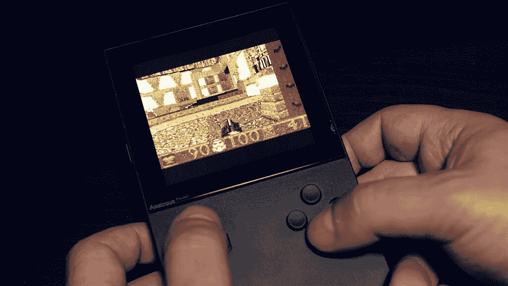
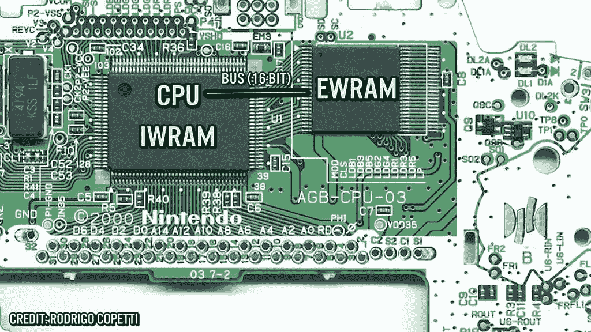
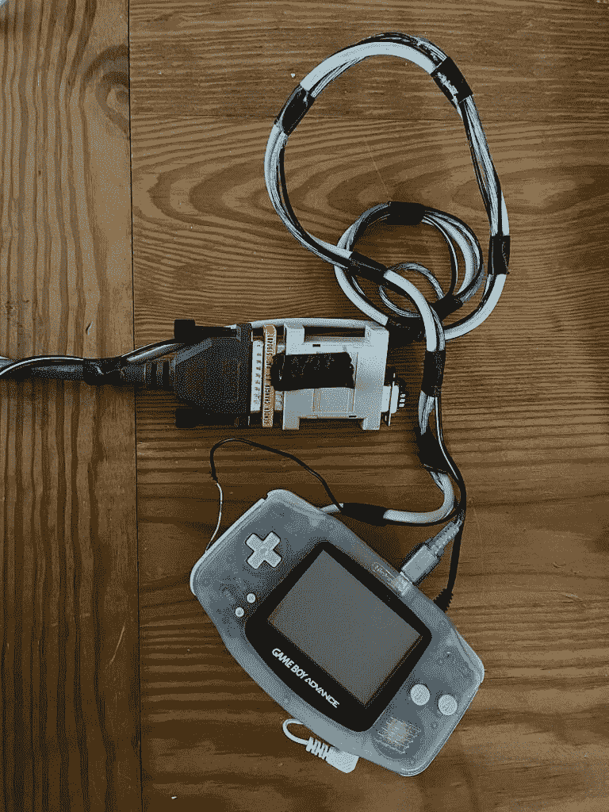

# 不可能港口的故事:地震是如何移植到游戏男孩前进

> 原文：<https://www.xda-developers.com/how-quake-ported-game-boy-advance/>

Game Boy Advance 是任天堂创造的一款掌上游戏机。它于 2001 年在日本发行，并作为游戏男孩颜色的继任者。它有一个时钟频率为 16.78 MHz 的 ARM7TDMI、32kb 内部工作 RAM、256kb 外部 RAM 和 96kb VRAM。它不是最强大的机器，但有许多游戏让许多人留有美好的记忆。一款从未在该设备上出现过的游戏是 Quake 的原型 port，这是一款由 id Software 开发的游戏，它帮助定义了我们今天所知的第一人称射击游戏。

《雷神之锤》是一款非常精细的游戏，有着梦幻般的配乐和令人上瘾的游戏玩法，就像《毁灭战士》一样，它已经被移植到你能想到的几乎每一个设备上。它对 Game Boy Advance 的移植尤其令人难以置信，因为它本身不支持 3D 图形，任天堂特别将这款手持设备作为二维游戏体验进行营销。然而，这并没有阻止 Randy Linden 开发自己的 port。

 <picture></picture> 

Photo of the Quake port played on an Analogue Pocket used with permission from Modern Vintage Gamer

如果你对 Linden 不熟悉，他最出名的是作为 bleem 的开发者！(一个 PlayStation 模拟器)和 SNES 末日港，id 软件的联合创始人约翰·罗梅洛曾在接受 [*Shacknews*](https://www.shacknews.com/article/117004/super-doom-how-id-softwares-opus-made-the-jump-to-super-nes) 采访时说，他认为这是不可能的。林登的开发水平证明，如果有人能够让游戏男孩前进之锤成为现实，那可能就是他。

这个端口的出现要归功于林登自己通过幻觉森林项目发布的版本。幻觉森林是一个旨在保存任天堂游戏历史的项目，林登伸出手来分发他在自己拥有的 256MB 闪存卡上找到的地震端口的副本。

我们要感谢兰迪林登花时间回答我们的问题，并确保本文的技术准确性。我们还要感谢*现代复古游戏玩家*允许我们使用他视频中任何需要的剧照。这个端口与 id 软件或 ZeniMax 没有官方关系，是由 Linden 作为一个独立项目开发的。

## 雷神之锤的游戏男孩前进港

从技术上来说，雷神之锤甚至可以达到 Game Boy Advance 的水平，这是一个奇迹。它以良好的帧速率运行，并保持了原始雷神之锤游戏的正确照明和调色板。一切都是 3D 的，包括武器和怪物。Game Boy Advance 上的游戏通常通过精灵实现 3D 图形，但这是真实的交易。它不像其他 3D 游戏那样在手持设备上使用光线投射，它甚至通过改变调色板来实现动态照明的幻觉，从而在预先渲染的对象上实现点照明效果。

需要澄清的是，这个端口并不是完整的游戏，它是一个原型，林登打算在 id 软件完成发布后使用。然而，游戏《男孩前进》(Boy Advance)的人气开始减弱，取而代之的是林登编写的定制引擎，后来成为林登完全开发的另一款游戏——cybo id 的引擎。林登告诉我们，“大块代码”仍然是 Game Boy Advance 版本的原始 ARM 代码。如果你想尝试 Cyboid，谷歌 Play 商店上有一个旧版本，但官方的 APK 现在在亚马逊应用商店分发，因为游戏有很多低级的 32 位代码。

林登还与我们分享了一段他的代码在 iPod 视频上运行的视频，这是 Cyboid 的最早版本之一。这是建立在相同的引擎代码，用于他的地震港口的游戏男孩前进。

Game Boy Advance port of Quake 不包含该游戏的任何官方资产，因为林登尚未就分发包含官方 Quake 资产的 E1M1 版本与 id Software 或 ZeniMax 联系。

目前发行的游戏也是一个调试版本。在启动时按住 R 键会将玩家直接带到游戏的第二个地图，在 D-pad 上按住左键会将他们带到第三个地图。玩家死亡时也可以访问地图交换，怪物不会攻击玩家，直到玩家先向它们开枪。

至于音乐，演示使用了公共的. S3M 文件，混音器处理立体声音乐和音效。

## 技术界限

当谈到 Game Boy Advance 时，有许多界限使得这成为一个困难的端口。一些最大的障碍是时钟速度低，手持设备缺乏 3D 图形功能，以及缺乏浮点单元(FPU)。在这个过程中还有很多其他的问题，但是这些都是 Linden 向我指出的有问题的痛点。在我们进入之前，了解游戏男孩前进的布局是很重要的。

 <picture></picture> 

Screenshot used with permission from Modern Vintage Gamer

Game Boy Advance 有三组 RAM——一组是内部工作 RAM (IWRAM)，另一组是外部工作 RAM (EWRAM)，第三组是视频 RAM (VRAM)。32kb 的 IWRAM 用于存储 ARM 指令以便快速执行，而 256kb 的 EWRAM 最适合存储纯 Thumb 指令和较小的数据块。正如 Rodrigo Copetti 指出的那样，EWRAM 的访问速度比 IWRAM 慢六倍。尽管 Game Boy Advance 作为 32 位手持设备上市，但 EWRAM 形式的大部分存储器只能通过 16 位总线访问。IWRAM 可以通过 32 位总线访问。Game Boy Advance 上的 VRAM 有 96kb，虽然它主要用于存储图形数据，但它可以在 CPU 的内存映射中找到，也可以用作普通的内存存储。

Thumb 指令是 32 位 ARM 指令的子集，是一组编码为 16 位字的指令。它们拥有 32 位指令的所有优势，而不占用太多空间，这使它们能够高效地进行优化开发。这意味着，虽然 EWRAM 的访问速度较慢，但高效的 Thumb 指令通常仍然可以像存储在 IWRAM 中的 ARM 指令一样快，尽管 Thumb 指令的缺点是有时没有您想要执行的 ARM 指令的 Thumb 等价物。EWRAM 用于存储 3D 数学变换逻辑的输出，该输出基本上是多边形边的列表，然后由光栅化代码逐扫描线地跟踪这些边。

正如 Linden 告诉我的，整个端口中最复杂和最困难的部分是扫描线渲染器。它由 10，000 多行高度优化的 ARM 汇编代码组成，旨在将一组像素绘制到 VRAM。扫描线渲染器用完了大部分 32kb IWRAM。最靠近相机的边是活动的并被渲染，它本质上是一个大的二进制空间划分(BSP)树。VRAM 用于将多边形转换输出的结果存储到边缘表中，因为没有足够的 IWRAM，但 Game Boy Advance 上的 VRAM 仍然比 EWRAM 快。图形也在这里储存和展示。

他花了大量时间关注优化，以确保它能够获得尽可能快的执行时间。为了加快执行时间，他做了以下三件事:

*   在执行代码之前自我修改代码，因此需要的指令更少
*   使用了一系列的查找表，例如倒数、正弦、余弦、正切等。
*   切换 CPU“模式”以访问额外的寄存器(类似于“变量”)，而不必保存和恢复寄存器的值。

切换 CPU 模式以获得额外的寄存器是一个非常聪明的策略，允许快速访问靠近 CPU 的值，以便可以在单个时钟周期内检索它们。正如林登告诉我的那样，在一个时钟周期内切换寄存器并检索一个值是可能的，而不是在 Game Boy Advance 的 RAM 中存储一个值，这需要更长的时间。CPU 本身是一个 16.78 MHz 的处理器，这意味着它每秒可以完成 16780000 个周期。这听起来很多，但当你需要计算并在屏幕上画出每个像素时，这些很快就会累加起来，尽可能多地减少运算变得很重要。

以上是 Game Boy Advance 内部 ARM7TDMI 芯片组的通用寄存器列表。通常，开发人员只会在“系统和用户”模式下访问寄存器，并在此之外使用普通变量。然而，他在芯片组的所有七种模式中都使用了寄存器，最棒的是切换模式仍然保留其他模式的寄存器中的值，因此他可以在它们之间切换。

有趣的是，林登还提到了他的银行转换方法如何在 Nanoboy Advance 仿真器中发现了一个错误。事实证明，该模拟器不支持使用 CPU 的其他模式来保存寄存器和切换，他的 Quake 演示是第一个真正做到这一点的已知游戏。

林登与我们分享了他创建的一些笔记的照片，并解释了他如何在缺乏适当的 FPU 的情况下优化他的浮点计算。

上面的图像是林登从他的笔记中与我们分享的一个图像，特别有趣的是“杂项 ARM 循环指令计数”。他设计了一种优化计算周期的方法，以便减少计算的时钟周期数。正如他向我描述的那样，一个 8 位数可以在一个时钟周期内相乘，一个 16 位数可以在两个时钟周期内相乘，一个 32 位数可以在三个时钟周期内相乘，一个 64 位数可以在四个时钟周期内相乘。

“(在 ARM 处理器中)有两到三个执行阶段。比方说，我将寄存器 1 乘以寄存器 2，并将结果放入寄存器 3。如果我知道寄存器 2 是一个 16 位数字，而不是说寄存器 1 乘以寄存器 2，我会翻转它，说寄存器 2 乘以寄存器 1，因为这样可以节省一个时钟周期。”

他告诉我，他这样做的原因是为了挤出 Game Boy Advance 的每一点性能，因为当执行大量计算时，这里和那里节省的时钟周期真的会增加。至于自我修改的代码，我请林登解释了一下。

“程序来自[存储]，它将一大块程序转移到内部 ram 中执行，因为这样更快。每次 RAM 访问都要慢得多，所以我对 rom 中的一大块进行 DMA[直接内存访问],然后更改实际的程序代码。例如，ARM 能够左移或右移操作数，或者它可以屏蔽掉某些位作为指令集的一部分。该指令指定了要屏蔽哪些位，或者要移位多少位。所以，我会生成代码，根据我需要移动多少位来修改将要执行的内容。另一个例子是关于 3D 矩阵乘法。这里涉及到一大堆乘法运算。我会将执行乘法运算的实际指令生成到内部 RAM 中，然后执行它们，这样代码就可以在运行时构建自己的一部分。”

自我修改代码也有自己的缺点，尤其是在调试的时候。它还消除了对分支指令的需求，在分支指令中，代码会跳转到另一个执行序列，并会剥夺主线程宝贵的计算时间。林登还告诉我们，查找表在 ROM 中是完全对齐的，因此它们是左移的 8 位值的完美倍数。查找表的大小是巨大的，不适合 RAM，并且对齐也避免了需要额外的加载指令来获得表的基地址。

总而言之，最终的原型是在将近两年的时间里开发出来的。

## 兰迪·林登地震港的未来

我问林登雷神之锤端口的未来会怎么样，他告诉我，他正在考虑询问 ZeniMax 和 id Software 关于发布官方雷神之锤资产版本的问题。他还告诉我，在某个时候他会发布源代码，但目前，它不会构建，因为它需要一台旧电脑。

 <picture></picture> 

Randy Linden's setup for connecting a Game Boy Advance to a computer for development.

我问林登为什么选择雷神之锤，他告诉我，他喜欢这个游戏，他喜欢这个“不可能的项目”的挑战，因为这是他对 SNES 港的厄运。他还提到，虽然由于空间限制，他不认为整个游戏可以被移植，但游戏的绝大部分可以在同一个引擎中。

如果你对游戏男孩进阶版的雷神之锤感兴趣，一定要看看它在幻觉森林上的发布，你可以在下面看看。

* * *

[**从幻觉森林下载**](https://forestillusion.com/2022/quake-usa-prototype)