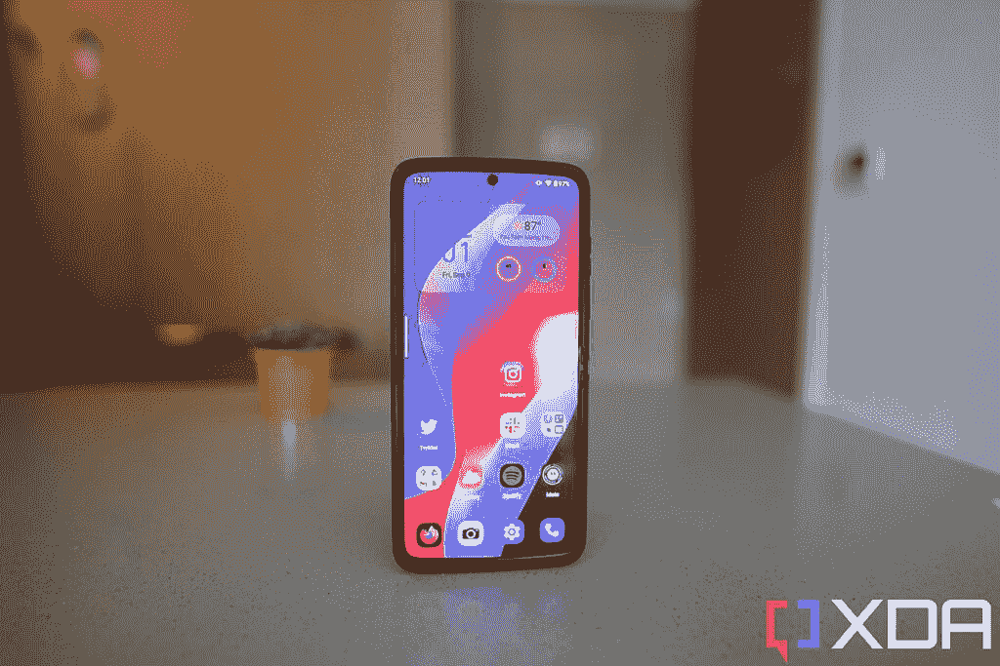

# 如何使用按钮组合、ADB 和 root 应用程序启动到恢复模式

> 原文：<https://www.xda-developers.com/how-to-boot-to-recovery/>

每部智能手机都有内置的恢复模式，可用于执行各种任务，具体取决于设备的操作系统。在 [Android 智能手机](https://www.xda-developers.com/best-android-phones/)上，恢复模式可用于执行清除缓存、手机出厂重置或安装更新包等任务。在 iPhone 上，如果设备遇到问题，如卡在 Apple 标志上，恢复模式用于使用电脑恢复设备。

虽然预装在您的设备上的股票恢复功能有限，但您可以使用像 [TWRP](https://www.xda-developers.com/how-to-install-twrp/) 这样的定制恢复功能做更多的事情。如果你是 XDA 论坛的常客，你肯定知道使用定制恢复的好处，比如刷新 rom、内核、备份整个系统等等。您可以了解更多有关自定义恢复的优势以及如何在智能手机上安装自定义恢复的信息，但本文将告诉您如何在智能手机上启动恢复。

这里提到的步骤可以应用于启动到股票恢复和自定义恢复(如果您安装了一个)。请注意，每部手机的步骤因品牌而异。如果您想知道如何在您的特定手机上启动恢复，只需按照手机制造商名称下的步骤操作，您就可以开始了。此外，有多种方法可以在您的智能手机上恢复，最常见的一种是按下按钮的组合。稍后我们将讨论其他方法。

## 如何使用按钮组合启动到恢复模式

这是在智能手机上启动恢复的最基本方式，因为它不需要任何额外的工具或软件。在继续之前，请确保您的手机已关机。一旦你做到了这一点，从下面的列表中为你的智能手机执行相关的步骤。

### 华硕

*   按住音量增大按钮和电源按钮，看到 Asus 徽标时松开电源按钮。一直按住调高音量按钮，直到看到引导程序选项。
*   现在，使用音量按钮滚动各种选项，直到您看到“恢复模式”，然后按下电源按钮选择它。现在你会在屏幕上看到一个机器人。按住此处的调高音量和电源按钮，以引导至恢复屏幕。

### 谷歌像素

*   按住音量调低按钮和电源按钮，看到 Google 徽标时松开电源按钮。一直按住调低音量按钮，直到看到引导程序选项。
*   现在使用音量按钮滚动各种选项，直到您看到“recovery ”,然后按电源按钮选择它。现在你会在屏幕上看到一个机器人。按住此处的调高音量和电源按钮，以引导至恢复屏幕。

### 华为/荣誉

*   按住音量调高键和电源键，看到华为/Honor 标志时松开电源键。
*   一直按住调高音量按钮，直到您看到恢复屏幕。

### 水平规ˌ水准仪(Level Gauge)

*   按住音量调低按钮和电源按钮，看到 LG 标志时松开电源按钮。
*   一直按住音量降低按钮，直到您看到恢复屏幕。

### 摩托罗拉

 <picture></picture> 

Motorola Razr 2022

*   按住音量调低键和电源键，看到 Moto 标志时松开电源键。一直按住调低音量按钮，直到看到引导程序选项。
*   现在使用音量按钮滚动各种选项，直到您看到“recovery ”,然后按电源按钮选择它。现在你会在屏幕上看到一个机器人。按住此处的调高音量和电源按钮，以引导至恢复屏幕。

### 一加

*   按住调低音量按钮和电源按钮，看到一加徽标时松开电源按钮。
*   一直按住音量降低按钮，直到您看到恢复屏幕。

### OPPO

*   按住音量调低键和电源键，看到 Oppo logo 时松开电源键。
*   一直按住音量降低按钮，直到您看到恢复屏幕。

### 真我

*   按住音量调低按钮和电源按钮，看到 Realme 徽标时松开电源按钮。
*   一直按住音量降低按钮，直到您看到恢复屏幕。

### 三星电子

OneUI 3.0 更新后，三星不允许在没有用 USB-C 线将手机连接到 PC 的情况下启动恢复。所以，在你执行这些步骤之前，把你的手机插到你的电脑上。

*   **如果您有一部属于 Galaxy S22 或 S21 系列的三星手机:**
    *   按住调低音量按钮和电源按钮，看到 Samsung 徽标时松开电源按钮。
    *   一直按住音量降低按钮，直到您看到恢复屏幕。

*   **如果你有一部属于 Galaxy S20、Note 20 或 Note 10 系列的三星手机:**
    *   按住音量增大按钮和电源按钮，看到三星徽标时松开电源按钮。
    *   一直按住调高音量按钮，直到您看到恢复屏幕。

*   **如果你使用的是 Galaxy S10、S9、S8、Note 9 或 Note 8 系列的三星智能手机:**
    *   按住音量增大按钮、Bixby 键和电源按钮，看到 Samsung 徽标时松开电源按钮。
    *   一直按住音量键和 Bixby 键，直到看到恢复屏幕。

*   **如果你有一部旧的三星智能手机，它有一个物理 home 键:**
    *   按住音量增大按钮、主屏幕按钮和电源按钮，看到三星徽标时松开电源按钮。
    *   一直按住调高音量和主屏幕按钮，直到您看到恢复屏幕。

### 索尼

*   按住音量增大按钮和电源按钮，看到 Sony 徽标时松开电源按钮。
*   一直按住调高音量按钮，直到您看到恢复屏幕。

### Vivo / iQOO

*   按住音量调高键和电源键，看到 Vivo logo 时松开电源键。
*   一直按住调高音量按钮，直到您看到恢复屏幕。

### 小米

*   按住音量增大按钮和电源按钮，看到 Mi 徽标时松开电源按钮。
*   一直按住调高音量按钮，直到您看到恢复屏幕。

### 各种 Android 设备

如果你的智能手机制造商没有在上面列出，那么逐一尝试我们提到的所有组合，其中一个应该会很理想。如果没有一个组合键适合您，您可以尝试通过软件访问恢复屏幕的其他方法。

### 苹果 iPhone

根据您的 iPhone 型号，有不同的方法将您的 iPhone 置于恢复模式

*   **iPhone 8 及以上**(基本上所有没有 home 键的 iPhone 设备):按一次音量增大键并释放，然后快速连续按音量减小键，也需要释放。然后快速按住侧面按钮，直到您看到恢复屏幕。
*   **iPhone 7 和 7 Plus** :按住音量调低键和电源键，直到看到恢复画面。
*   **iPhone 6s 及以下**:按住 home 键和电源键，直到看到恢复画面。

如前所述，iPhone 上的恢复模式主要用于连接 iTunes，以便在 iPhone 无法启动或表现不佳时恢复原始固件。

* * *

## 如何使用 ADB 启动恢复

如果您的智能手机的物理按钮由于任何原因不再工作，或者没有一个按键组合对您有效，通过 ADB 访问恢复是一个好主意。你只需要在你的电脑或 Mac 上安装最少的 ADB 和 Fastboot 就可以完成这项工作。因此，如果你还没有安装 ADB，请确保按照这些说明为你的电脑操作系统安装 ADB。

*   安装 ADB 后，通过 USB 电缆将手机连接到电脑。确保在开发人员设置中启用了 USB 调试。
*   前往安装 ADB 的文件夹。按住键盘上的“control”键，右键单击 ADB 文件夹并选择*在此打开命令窗口*或*在此打开 PowerShell 窗口*。或者，您也可以启动一个命令提示符窗口，然后“cd”到 ADB 目录。
*   接下来，输入 *adb 设备*并按回车键，确保你的智能手机连接正确。如果是，命令窗口将返回一串数字。

*   你现在所要做的就是输入 *adb 重启恢复，*，你的手机就会重启恢复。

* * *

## 如何在根设备上使用应用程序启动恢复

如果你有一个根 Android 设备，你可以使用像[恢复重启](https://play.google.com/store/apps/details?id=gt.recovery.reboot&hl=en_IN&gl=US)和[快速重启](https://play.google.com/store/apps/details?id=com.awiserk.kundalias.rootboot&hl=en_IN&gl=US)这样的应用程序轻松启动恢复。你只需要打开应用程序并授予 root 访问权限，然后你会发现启动到恢复选项。许多定制的 rom 还提供了从电源菜单中直接启动到恢复模式的选项。

* * *

如前所述，所有这些方法都可以用于启动到常规恢复和自定义恢复。确保你知道你在做什么，而在你的智能手机上访问恢复，因为它可能会导致清除内部存储，如果你重置你的设备误或更糟的是，一个砖设备，如果你闪存错误的 zip 文件。如果你正在使用自定义恢复，在修改你的设备之前做一个备份总是明智的——特别是在用 4%的电池刷新 ROM 的时候。