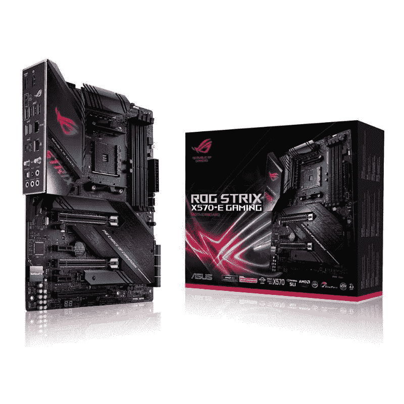
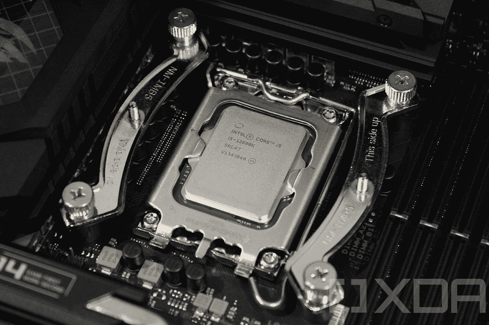
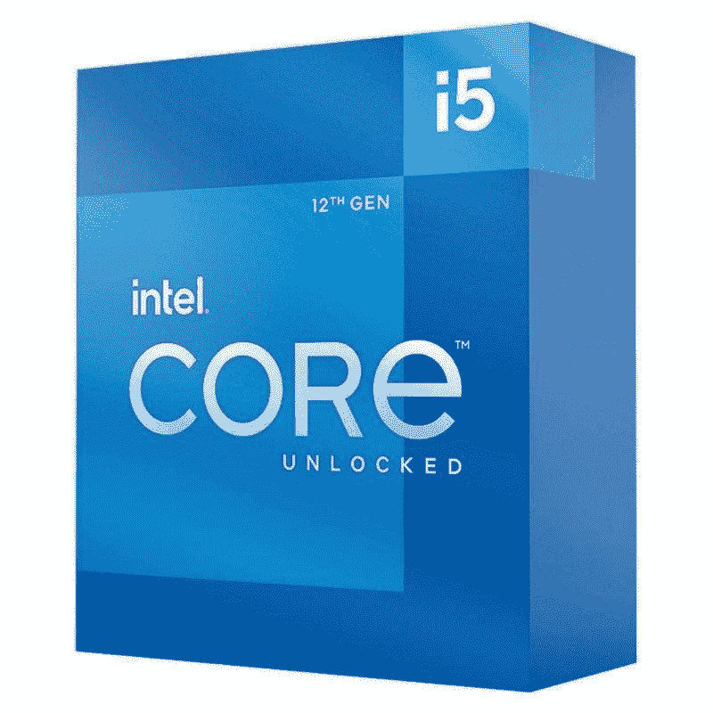
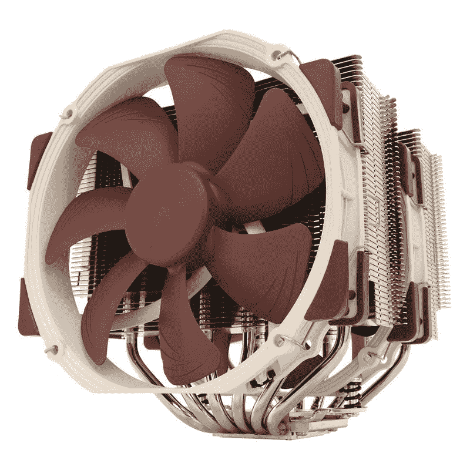
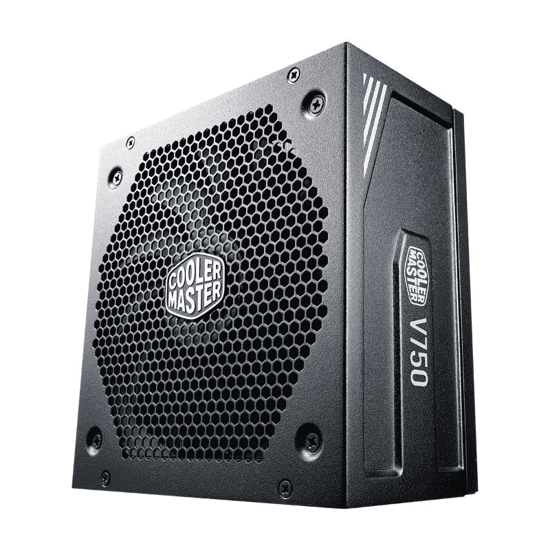
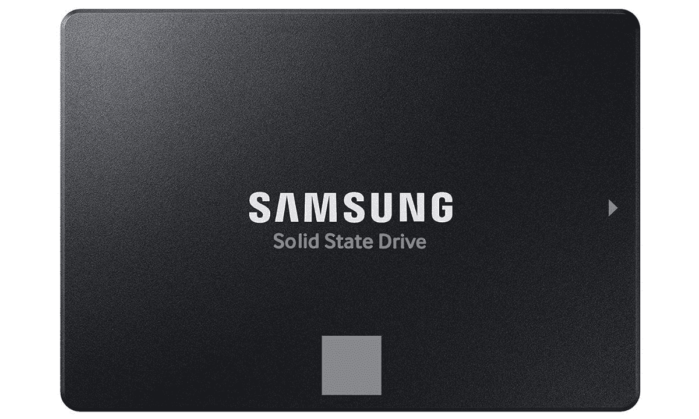

# 如何建造一台电脑:新电脑初学者指南

> 原文：<https://www.xda-developers.com/how-to-build-a-computer-beginners/>

构建自己的 PC 似乎是一项艰巨的任务，尤其是如果你是第一次。但是学习如何组装电脑是一种令人满意的体验，而且组装比购买更能帮你省钱。这个过程实际上比你想象的更简单、更愉快！

除了提供一些初学者技巧，如果你正在寻找灵感，我们还推荐了每个部分的一些部分。没有两个版本是相同的，对一个人有效的可能对你完全不适用。但是一旦你选择了你的箱子和里面的零件，剩下的就比你想象的简单了。

## 如何建造一台计算机:先决条件

最好做好准备，准备好所有必要的工具，以免在组装电脑时分心。在将所有东西放在一起之前，你可能需要先了解以下几点:

*   **所有的电脑组件:**将所有的组件放在身边，这样就很容易伸手去拿东西。
*   **精密螺丝刀套件:** PC 制造涉及到处理大量的螺钉和支架，这就是为什么一把好的精密螺丝刀是必须的。
*   **散热膏:**很多 CPU 散热器都预装了这个，但是如果没有的话你可能需要一个。
*   手电筒:在电脑机箱的角落里会变得很暗，所以你肯定需要一个手电筒。
*   在构建的早期，你可能不需要这个，因为电缆管理可以在最后处理，但是在早期抓住它可能不是一个坏主意。
*   **防静电设备:**只要你在木制或塑料桌面上组装电脑，你可能不会短路任何东西(避免金属桌面)，但安全行事没有错。
*   **磁性零件托盘:**你不会想让那些小螺丝和支架滚得到处都是。每当你在电脑上工作时，手边有一个磁性部件托盘将它们放在一个地方是个好主意。

## 向主板添加组件

建议您连接一些核心组件，如 CPU、RAM、SSD 等。在将主板装入机箱之前。PC 机箱往往空间有限，因此在安装主板之前更容易做到这一点。您还有机会在安装机箱中的所有部件和管理电缆之前检查系统电源和开机自检。你应该**总是**在你把它放进箱子之前检查你的系统电源。专业提示:主板盒是一个很好的工作台。

本质上，在你承诺把任何东西放进箱子之前，你想要有一个工作系统。因此，一旦你的 CPU、RAM、启动 SSD 和显卡(如果你有的话)就位，连接电源和显示器并启动它。在没有电源按钮的情况下，具体的开机方式会有所不同，所以请查阅您的手册。这可能需要在电路板上的两个引脚之间建立连接。但是这是构建的关键部分，因为如果有问题要解决，在案例之外解决要容易得多。

至于选择主板，我们建议购买一些为未来升级提供潜在空间的东西。你总是会受到 CPU 制造商所支持的插槽和芯片组的限制。但是，如果你想添加额外的 PCIe 卡，如捕获或声卡，或额外的存储空间，你会想给自己留一些空间来添加更多。

华硕 ROG Strix X570-E 游戏是基于 AMD 的版本的可靠选择，而华硕 TUF 游戏 Z690-Plus WiFi D4 是基于英特尔的版本的绝佳选择。值得记住的是，Z690 主板只能与英特尔新的第 12 代处理器一起使用，随着 AMD 转向[锐龙 7000](https://www.xda-developers.com/amd-ryzen-7000/) ，插槽也将发生变化。此外，你需要不同的英特尔和 AMD 处理器的主板，所以选择你的毒药。这两种主板都是 ATX 单元，有大量的扩展槽和端口供您使用。

如果你想买什么，我们已经收集了[最好的主板](https://www.xda-developers.com/best-motherboard/)。

 <picture></picture> 

ASUS ROG Strix X570-E Gaming

##### 华硕 ROG Strix X570-E 游戏

华硕 ROG Strix X570-E 游戏主板使用高品质组件来提供可靠的性能。对于大多数希望构建主流 AMD 机器的用户来说，这是最好的主板。

 <picture></picture> 

ASUS TUF Gaming Z690-Plus WiFi D4 motherboard

##### 华硕 TUF 游戏 Z690 Plus WiFi

华硕 TUF 游戏 Z690-Plus WiFi D4 是最好的 Z690 主板之一，支持 DDR4 内存模块和 PCIe 5.0。

## 中央处理器

 <picture></picture> 

Intel Core i5-12600K

CPU 是你连接到主板上的第一件东西。第一步是松开 CPU 插槽上的拉杆，这样您就可以将处理器放入其中。您需要将 CPU 顶部的箭头/三角形与插槽或盖子上的箭头/三角形对齐。这是至关重要的一步，如果你不注意你的方向，你可能会损坏你的芯片，电路板，或者两者都损坏。

由于其自身重量，CPU 将理想地固定在插槽中。如果没有，将其捡起来并重新安装。不要强行将处理器插入插座。一旦就位，向下压张力杆并将其锁定到位。

对于市场上的英特尔和 AMD 主流 CPU，上述指令保持不变。最大的区别是连接引脚在哪里——在英特尔的版本中，引脚在插座上，而在 AMD 的版本中，引脚在 CPU 上。此外，AMD 的 Threadripper 和 Intel Core X 等发烧友平台的步骤略有不同，涉及多个杠杆甚至 Torx 螺钉。如果有疑问，请查阅您的主板手册。

在锐龙 7000 到来之前，锐龙 5 5600X 是一个基于 AMD 的全面构建的好选择。对于目前倾向于蓝队的人来说，英特尔酷睿 i5-12600K 是一个很好的选择。

 <picture></picture> 

AMD Ryzen 5 5600X processor

##### AMD 锐龙 5 5600X

AMD 锐龙 5 5600X 可在单线程和多线程工作负载中提供强大的性能。它也是目前最可靠的游戏 CPU 之一。

 <picture></picture> 

Intel Core i5-12600K processor

##### 英特尔酷睿 i5-12600K

英特尔凭借其第 12 代处理器重返最佳 CPU 竞赛，我们认为新的酷睿 i5-12600K 是目前您可以购买的第二好的整体 CPU，无论是用于游戏还是其他工作负载。

## CPU 冷却器

你还必须安装一个 CPU 冷却器来控制 CPU 的热量输出。如果没有连接到主板的 CPU 冷却器，您的电脑将无法启动。许多 CPU 在盒子里都有冷却器，它们应该足以让你运转，但售后冷却器总是会释放你的 CPU 的最佳性能。冷却器安装到主板上的确切方式将因其设计而异。

在一些 AMD 插座上，您的冷却器可能会简单地夹在 CPU 周围的预装支架上。有些冷却器会要求您移除这些支架，并使用主板上的孔来代替。同样，请查阅您的冷却器手册，了解具体的安装说明。将冷却器安装到主板上所需的任何附加硬件都将包括在内。这同样适用于英特尔插座，尽管没有预装支架。你几乎总是会使用主板上的孔来直接连接冷却器，或者连接到定制的固定支架上。这适用于空气和 AIO 液体冷却器。

但是你也需要考虑热糊。您需要一种导热膏来填充 CPU 散热器和冷却器底板之间的空隙。很多 CPU 冷却器都预装了导热膏，你应该没问题。如果没有，那么你可以查看我们的指南[如何在 CPU](https://www.xda-developers.com/apply-thermal-paste-cpu/) 上使用导热膏来了解更多信息。简短的版本是不要使用太多，适用于中央处理器的中心小轻拍，然后固定下来的冷却器。

 <picture></picture> 

Noctua NH-D15

##### Noctua NH-D15

Noctua NH-D15 是市场上最强大的空气冷却器之一。它也可以处理市场上的高性能 CPU。

 <picture></picture> 

Cooler Master MasterLiquid ML360 Illusion

##### 酷派大师原液 ML360 幻视

更酷的 MasterLiquid ML360 幻象可以说是你能买到的最好的 AIO 冷却器。

## 记忆

安装内存模块可能是最简单的工作。您需要做的就是在将模块扣入之前，确保每个内存插槽的闩锁都是打开的。有些主板在内存插槽的两侧都有这些闩锁，而其他主板则在一侧有。按下每个插槽上的 DIMM 将允许闩锁自行关闭。这需要一点力，但要确保你没有把 RAM 装反。每个内存棒上都有一个缺口，对应于内存通道中的一个中断，你需要做的就是将它们对齐。

如果你在一个有四个插槽的板上安装两个 RAM 棒，你应该把第一个模块安装在 CPU 插槽的远端(不是靠近插槽的那个)。第二个模块进入第三个插槽，这意味着第一个模块旁边有一个空插槽。如果您将它们放在错误的插槽中，它们仍然可以工作，但您可能无法获得最佳性能。再次确认主板手册中的正确步骤。

选择 RAM 时，你必须在 DDR4 和 DDR5 之间做出选择。第 12 代英特尔处理器和即将推出的锐龙 7000 支持后者。但是在你的构建中可能没有必要，所以看看我们的指南，看看[最佳 DDR4 内存](https://www.xda-developers.com/best-ddr4-ram)和[最佳 DDR5 内存。](https://www.xda-developers.com/best-ddr5-ram)

 <picture></picture> 

Team Xtreem ARGB DDR4-3600MHz c14

##### 团队 XTREEM ARGB DDR4-3600MHZ C14

Xtreem ARGB 团队勾选了所有正确的框，成为我们现在可以购买的最佳 DDR4 RAM。它提供可靠的速度和低延迟，以提供稳定的性能。

## M.2 固态硬盘

我们还建议在将主板装入机箱之前安装启动驱动器。您也可以稍后再做，但是其他部分可能会妨碍您。与 RAM 模块不同，安装 M.2 SSD 需要一点点努力。您必须卸下位于 M.2 插槽对面的螺钉，并以一定角度滑入 SSD。现在，慢慢将 SSD 放平，并固定安装螺丝。就是这样！一些主板可能有一个散热片/护罩盖住这些 M.2 插槽，所以您必须先打开它才能看到 M.2 插槽。

需要考虑的一件重要事情是您正在使用哪个插槽。在您的主板上，您可能有多个 M.2 插槽，但并非所有插槽都是全速的。例如，您可能有一个是 PCIe 4.0，但另一个仅限于 SATA。虽然较快的驱动器可能在较慢的插槽中工作，但您需要进行匹配，以确保获得最佳性能。

如果你需要一些灵感，WD SN850 Black 是目前市场上最好的 M.2 SSD。你可以查看我们收集的[最佳 M.2 固态硬盘](https://www.xda-developers.com/best-m-2-ssd/)，看看哪些最适合你。

 <picture></picture> 

Western Digital Black SN850

##### WD Black SN850 NVMe M.2 固态硬盘

Western Digital Black SN850 是目前市场上性能最好的 PCIe 4.0 NVMe M.2 固态硬盘，具有令人印象深刻的顺序读/写速度。

## 电脑机箱

现在，您已经将一些核心组件安装到了主板上，并且已经进行了测试以确保一切正常，是时候开始将所有组件装入电脑机箱了。市场上有大量的橱柜，选择电脑机箱取决于个人喜好。从全塔式电脑机箱到紧凑型迷你 ITX 机箱，我们收集的[最佳电脑机箱](https://www.xda-developers.com/best-pc-cases/)中有大量选项。

##### 联立 PC-O11 动态

联立 PC-O11 Dynamic 可以说是目前市场上最好的 PC 机箱之一。

在电脑机箱内安装主板需要小心操作。你必须把你箱子里的所有支架收集起来，并找到合适的地方安装它们。现在市场上几乎所有的电脑机箱都有基于你选择的主板尺寸的标记。事实上，许多情况下甚至已经预装了支架，所以你可以完全跳过这一步。多少和在哪里修复它们将取决于你去的主板的大小。支座使主板保持在机箱上方，但也作为螺钉的固定点。

在将主板安装到位之前，您必须安装 I/O 屏蔽罩，它覆盖了您的后端口周围的区域。I/O shield 与您的主板一起提供，您必须在设置主板之前将该 shield 安装到机箱中。一旦两者都安装好，板上的端口将通过孔配合。您必须使用一些力量将屏蔽的所有四个角扣入机箱，就像您在安装 RAM 模块时所做的那样。一些高级主板预装了 I/O 屏蔽，在这种情况下，您也可以跳过这一步。

## 电源

电源装置通常安装在电脑机箱的背面，朝向底部。很长一段时间以来，这一直是 PSU 的指定位置，它是一个安全的空间，通过从机箱下面吸入冷空气，该单元可以正常工作。安装电源装置非常简单，只需用电脑机箱背面的四颗螺丝将其固定到位。我们建议购买一个模块化 PSU，这样你就可以避免在你的箱子里乱七八糟的电缆。安装 PSU 时，应该让风扇朝下，安装在机箱底部的通风口上方。然后你只需要用附带的螺丝把它固定在表壳的背面。

一旦 PSU 就位，您就可以将 24 针电源连接器和辅助/CPU 电源连接器连接到主板上。电源单元，顾名思义，为整个 PC 供电，所以你实际上是通过电缆将许多组件连接到 PSU。如果你有一个模块化的 PSU，这部分会简单一点，因为你只需要使用你实际需要的电缆。最起码，您将使用 24 针连接器、CPU 电源连接器、GPU 电源连接器(如果您有显卡)，以及足够的 SATA 电源连接器来为任何固态硬盘或光驱供电。

我们认为 750 瓦或 800 瓦的电源对大多数用户来说已经足够了，但这取决于你使用的硬件。您还可以查看我们收集的[最佳电源单元](https://www.xda-developers.com/best-power-supply-pc/)，查看市场上不同功率输出范围的所有可用选项。

 <picture></picture> 

Cooler Master V750 Gold V2

##### 酷派大师 V750 金色 V2

更酷的主人 V750 黄金 V2 是一个伟大的 PSU 为大多数用户寻找发放一个新的电脑建设。这是一个完全模块化的装置，能效等级为 80 Plus。

## SATA 存储

你的电脑的启动驱动器希望成为你最快的可用存储器，通常是安装在主板上的 M.2/NVMe 驱动器。但对于大容量存储，你可能需要添加 SATA 固态硬盘或硬盘，或者传统的 3.5 英寸硬盘。

在每种情况下，您都需要将驱动器的 SATA 数据线连接到主板，然后将 PSU 的 SATA 电源连接器连接到驱动器。然后你必须找到一个地方来安装固态硬盘或硬盘，因为你不能把它们放在机箱里。所有电脑机箱都有专门的硬盘安装支架，所以应该很容易找到。

大多数情况下仍然会为 3.5 英寸驱动器提供球童，而 2.5 英寸版本通常附在主板托盘的背面。除了一点电缆管理，没有太多其他内容。

 <picture></picture> 

Samsung 870 EVO SSD

##### 三星 870 EVO 固态硬盘

三星 870 EVO 是你现在能买到的最好的固态硬盘之一。它提供令人印象深刻的持续性能，坚固的耐用性，并附带 5 年保修。

## 图形卡

如果您使用带有集成显卡的英特尔或 AMD CPU，安装显卡是一个可选步骤。然而，如果您的 CPU 没有板载显卡，您将需要一个独立的 GPU 来连接您的显示器。如果你正在建造一台游戏电脑。首先要做的是移除机箱背面的一些插槽盖。这是 HDMI、DVI 和 DisplayPort 的接口，可以让你连接[你选择的显示器](https://www.xda-developers.com/best-monitors/)。

一旦完成，你必须将 GPU 连接到主板上的 PCIe X16 插槽。是长的那个，一般找到最近的 CPU 插座。如果主板上有多个插槽，建议您使用最上面的插槽。高端 GPU 需要更多的功率，所以你必须将 PCIe 电源连接器从电源插入到 GPU 的卡中。你可以通过 PCIe 插槽来判断 GPU 是否可以工作，因为它的末端没有任何电源连接器。

PCIe 插槽将有一个闩锁，可以自动抓住卡的底部，但你也需要将它拧到外壳上。I/O 板上将有两个螺丝安装点，与机箱上 PCIe 插槽旁边的孔相对应。这些应该足以固定卡，但较大的卡可能需要 GPU 支架的额外支持。你的情况可能

如果您正在寻找显卡，我们建议您查看我们收集的[最佳显卡](https://www.xda-developers.com/these-are-the-best-graphics-cards-you-can-buy-nvidia-geforce-rtx-3080-amd-radeon-rx-6800-xt-and-more/)。我们认为 [RTX 3080 GPU](https://www.xda-developers.com/nvidia-geforce-rtx-3080-restocks/) 是你现在能找到的最好的 GPU 之一，但还有一些其他选项可以满足不同的需求和预算。

## 收尾

现在，您已经安装了大多数主要组件，您的电脑已经准备就绪。但是，在我们尝试打开电脑之前，还有一些事情要做。您需要确保任何风扇/AIO 泵的连接器都插入主板风扇接头，尤其是从 CPU 冷却器。您还需要将前面板音频电缆和 USB 外壳连接器连接到主板接头。

这些接头的位置因主板型号而异，因此我们建议查阅手册来找到它们。但是在大多数情况下，你可能会在主板的底部找到它们。不要忘记连接前面板连接器，包括电源、复位、LED 指示灯等。因为它们对建筑也很重要。安装这些微小的接头会非常烦人，你会经常发现自己伸手到箱子最黑暗的角落去找它们。但是慢慢地走，有耐心，最终你会到达那里。

## 发布时间

如果你已经做到了这一步，那么恭喜你，你已经完成了你的电脑。现在剩下的就是确保没有额外的风扇接头或电源电缆等待连接。如果没有，则插入 PC，连接显示器和其他外围设备，如键盘和鼠标。现在，打开电源开关，按下显示器上的电源按钮，最后，按下电脑的电源按钮。如果一切正常，PC 应该会打开并运行开机自检(也称为 POST)。如果您使用的是新的存储驱动器，并且还没有安装操作系统，您将直接进入 BIOS。不过，这没关系，因为我们会在最后这样做。

我们现在建议您关闭所有设备，开始使用电缆管理。我们在发布后这样做，因为你现在知道一切都工作正常，你不再需要重新安装或重新布线任何组件。如果您的箱子没有窗口，您可以选择避免电缆管理，但将所有东西都放在箱子里仍然是一个好习惯。在可能的情况下，使用电缆扎带将它们捆在一起，并利用机箱背面的电缆管理点。除了更好的组织和良好的实践，它还会使清理你的电脑比你把你的箱子弄得一团糟要容易得多。

## 操作系统和驱动程序

这是你必须安装你选择的操作系统的部分。您可以查看我们的[如何在新电脑上安装 Windows](https://www.xda-developers.com/how-to-install-windows/)指南，该指南涵盖了从创建可启动的 Windows USB 到成功激活操作系统的所有内容。如果你打算使用 Linux 而不是 Windows，你仍然需要在不同的 PC 上创建一个可引导的 USB 来开始。

您可能还需要启动到您的电脑的 BIOS 或 UEFI 第一手动告诉它从 USB 启动。通常，您会希望第一个引导设备是您的 SSD，您现在就可以设置它。但是将第二引导优先级设置为 USB。因为你安装了一个空白的固态硬盘，电脑将不会启动，然后它会转到优先级列表中的下一个。在这种情况下，您的操作系统安装闪存驱动器。

一旦你有了一个正常工作的操作系统，就开始安装任何重要的更新、驱动程序，当然还有你的应用程序。在 Windows 10 和 11 上，Windows Update 会解决很多这方面的问题。尽管如此，还是有必要查看一下你的主板制造商的支持页面，AMD/Intel 的 CPU 支持页面，AMD/NVIDIA 的显卡驱动页面。在你感到舒适之前，你将想要确定你已经为你的所有硬件得到最新的驱动程序。

## 如何建造一台计算机:最终想法

恭喜你，因为你刚刚给自己造了一台新电脑！拍拍自己的背，现在就开始使用您的新电脑。我们建议您安装一些基准测试和硬件监控软件，如 3DMark suite 来运行一些压力测试。基准测试将允许你把你的电脑推到极限，看看它是否过热，节流等。

这将有助于您更好地了解您的电脑，并知道它已准备好处理您每天要做的任何事情。祝你好运，别忘了享受这个过程。您也可以加入我们的 [XDA 计算论坛](https://forum.xda-developers.com/c/xda-computing.12289/)，讨论您的新版本和其他用户的建议/推荐。