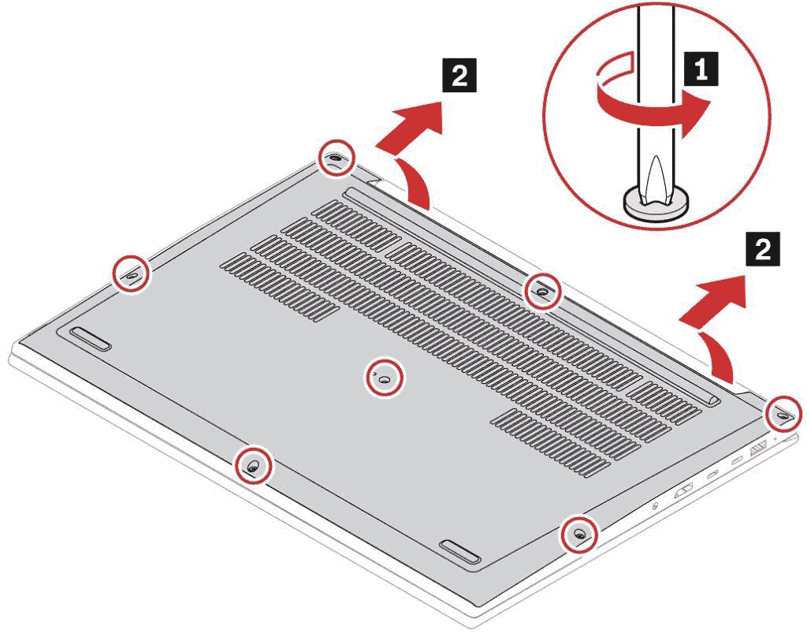
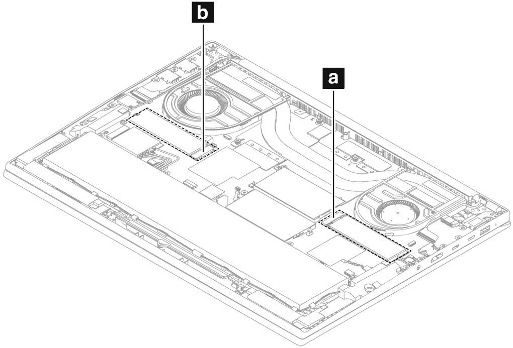
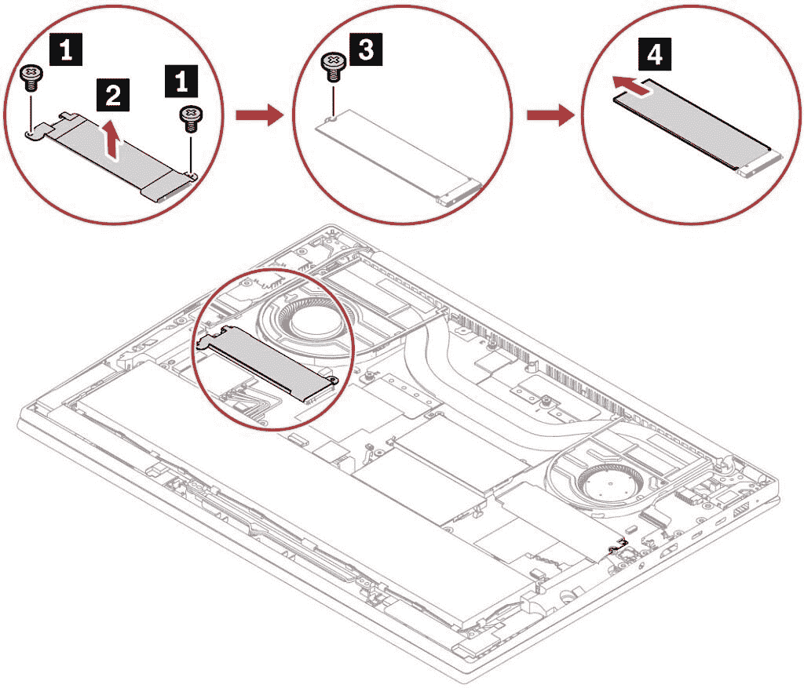
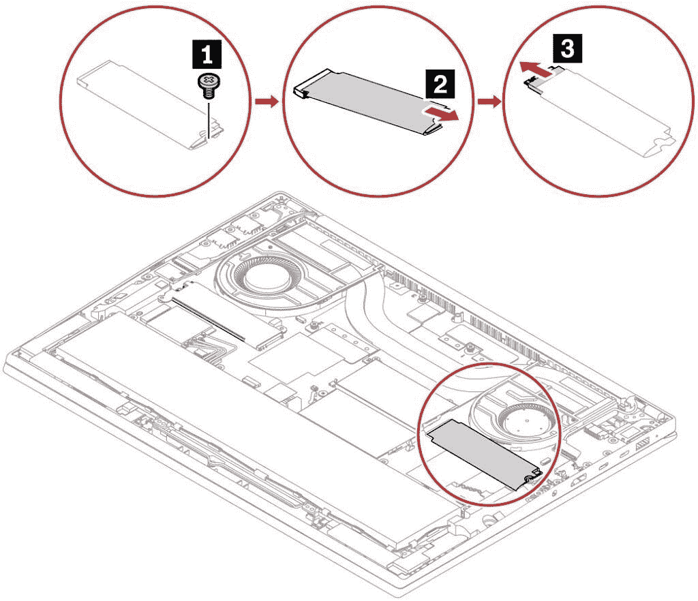

# 如何升级联想 ThinkPad X1 Extreme Gen 5 上的 SSD

> 原文：<https://www.xda-developers.com/how-to-lenovo-upgrade-ssd-thinkpad-x1-extreme-gen-5/>

联想 ThinkPad X1 Extreme Gen 5 是该公司最强大的[商务笔记本电脑](https://www.xda-developers.com/best-business-laptops/)之一，也是最可配置的笔记本电脑之一。[大多数 ThinkPad](https://www.xda-developers.com/best-thinkpads/)都以高度可配置而闻名，但 ThinkPad X1 Extreme 是一款非常高性能的机器，它有很多升级空间。但正因为如此，一次性升级也会变得非常昂贵。值得庆幸的是，ThinkPad X1 Extreme 还给了你一些空间来升级 SSD 或 RAM，所以你可以节省一些钱，以后再结账和升级。

在这一点上，如果你需要一些帮助来升级你的联想 ThinkPad X1 Extreme Gen 5 的固态硬盘，你就来对地方了。我们将指导您完成为笔记本电脑更换或添加固态硬盘的过程。根据您的配置，您可能有两个 SSD 插槽可用，但采用 Nvidia GeForce RTX 3060 GPU 或更高的型号只有一个 SSD 插槽。

## 你需要什么

如果您计划升级您的联想 ThinkPad X1 Extreme 上的 SSD，您将需要一些东西，包括:

*   十字螺丝刀
*   撬动工具
*   防静电腕带
*   导热垫(可能是可选的)
*   （同 solid-statedisk）固态（磁）盘
*   外部存储或云存储(备份您的数据)
*   USB 驱动器(用于重新安装 Windows)

获得螺丝刀和撬动工具的一个好方法是使用 [iFixit 基本电子工具包](https://www.amazon.com/iFixit-Essential-Electronics-Toolkit-Smartphone/dp/B0964G2Y7S?tag=xda-2r3gkcs-20&ascsubtag=UUxdaUeUpU43885&asc_refurl=https%3A%2F%2Fwww.xda-developers.com%2Fhow-to-lenovo-upgrade-ssd-thinkpad-x1-extreme-gen-5%2F&asc_campaign=Evergreen)。当你在笔记本电脑内工作时，你还需要佩戴一个[防静电腕带](https://www.amazon.com/Wristband-Bracelet-Grounding-Alligator-Extendable/dp/B08CXQN86W?tag=xda-2r3gkcs-20&ascsubtag=UUxdaUeUpU43885&asc_refurl=https%3A%2F%2Fwww.xda-developers.com%2Fhow-to-lenovo-upgrade-ssd-thinkpad-x1-extreme-gen-5%2F&asc_campaign=Evergreen)来防止放电。

如果你要更换支持 PCIe 4.0 速度的主固态硬盘，你会想要一个高速 PCIe 4.0 固态硬盘，如三星 980 Pro。二级 SSD 插槽只支持 PCIe 3.0 速度，所以如果你想省钱，你可以买一个更便宜的 PCIe 3.0 SSD。如果你想要一个，标准的三星 980 固态硬盘是一个不错的选择。

 <picture></picture> 

Samsung 980 Pro SSD

##### 三星 980 Pro

三星 980 Pro SSD 拥有快速的 PCIe 4.0 速度，是最受欢迎的选择之一。

如果 SSD 的布局与已经安装的不同，或者如果你的 SSD 坏了，你也可能需要为 SSD 购买一个散热垫。如果你买的 SSD 是双面的(通常只有 4TB 的型号)，联想推荐 1.25mm 厚的散热垫如[这款来自 Kritical](https://www.amazon.com/Kritical-Thermal-Pads-Conductivity-microelectronic/dp/B09PZJ79F7?tag=xda-2r3gkcs-20&ascsubtag=UUxdaUeUpU43885&asc_refurl=https%3A%2F%2Fwww.xda-developers.com%2Fhow-to-lenovo-upgrade-ssd-thinkpad-x1-extreme-gen-5%2F&asc_campaign=Evergreen) ，对于单面 SSD，你会想要更厚的(2.5mm)，如[这款 thermal all one](https://www.amazon.com/Thermalright-85x45x1-5mm-Conductive-Resistance-Silicone/dp/B09JLHQK7Z?tag=xda-2r3gkcs-20&ascsubtag=UUxdaUeUpU43885&asc_refurl=https%3A%2F%2Fwww.xda-developers.com%2Fhow-to-lenovo-upgrade-ssd-thinkpad-x1-extreme-gen-5%2F&asc_campaign=Evergreen)。

最后，如果您要移除预装的固态硬盘，需要注意的一点是，新的固态硬盘上不会有任何数据。您可能希望在外部 USB 驱动器或云存储上备份您的个人数据，并按照我们的指南[安装 Windows 11](https://www.xda-developers.com/download-windows-11/) 来创建可以安装 Windows 11 的 USB 驱动器。或者，您可以从 Lenovo 请求[恢复介质来恢复您安装了所有原装 Lenovo 软件的 PC。](https://pcsupport.lenovo.com/us/en/lenovorecovery)

## 准备升级

一旦你准备好了所有的设备并备份了你的数据，你也要确保你不会冒任何可能损坏笔记本电脑的放电风险。首先，你必须禁用笔记本电脑内部的内置电池。**在此过程中，保持笔记本电脑插入电源插座**。以下是如何做到这一点:

*   进入控制面板，将视图从**类别**更改为**大图标**或**小图标**。找到一个选项叫做**电源选项**。
*   在此页面上，单击左侧菜单中的**选择电源按钮的功能**。
*   点击页面顶部附近的**更改当前不可用的设置**(您需要管理员权限才能执行)。然后，禁用显示**打开快速启动(推荐)**的框。点击**保存更改**。
*   重新启动电脑，当出现联想标志时，按 F1 键进入 ThinkPad 设置菜单。
*   导航至**配置** **>电源**。在该子菜单中，选择**禁用内置电池**。
*   确认你的选择，然后电脑将关闭电源。

完成后，从笔记本电脑上拔下交流适配器和任何其他附件，并等待 5 分钟后开始。

## 升级联想 ThinkPad X1 Extreme 中的固态硬盘

完成所有这些工作后，您终于可以开始升级联想 ThinkPad X1 Extreme 内部的 SSD 了。将笔记本电脑倒置，转轴背向您，然后按照以下步骤操作:

*   使用十字螺丝刀拧下固定底部基座盖的七颗螺钉。从转轴开始提起基座盖(可能需要撬动工具)，然后将其完全卸下。<picture></picture>

    形象功劳:联想

*   根据您的配置，您可能有一个或两个 SSD 插槽。如果你的型号有 Nvidia GeForce RTX 3060 GPU 或更高，只有一个固态硬盘插槽在右边(a)，就在冷却风扇的下面。<picture></picture>

    映像来源:联想

    但是，如果您有两个 SSD 插槽，主插槽(PCIe 4.0)在左侧(b)，右侧的一个是 PCIe 3.0 的辅助插槽。某些型号还可能在笔记本电脑的左侧有一个覆盖 SSD 的支架。
*   对于左侧的 SSD，首先拧下固定支架的两个螺钉(如果有)。然后，卸下固定 SSD 本身的螺钉，小心地将 SSD 以一定角度滑离 M.2 插槽。<picture></picture>

    形象功劳:联想

    *   对于右侧的 SSD，您可以卸下固定 SSD 的螺钉，然后小心地将其滑出 M.2 插槽。这个 SSD 在一个套筒内，您会希望新的 SSD 放在同一个套筒内。<picture></picture>

        形象功劳:联想

*   如果你的新固态硬盘是双面的(通常情况下，应该只有 4TB 固态硬盘)，你可能需要将固态硬盘下的散热垫更换为更薄的散热垫。取下现有的导热垫，将新的导热垫放回原位。
*   要安装新的 SSD，只需将其滑动到您刚刚卸下的位置，将 SSD 上的槽口与 M.2 插槽对齐。然后，重新装上固定 SSD 的螺钉。你要小心避免过紧——过紧的螺丝会损坏笔记本电脑内部的组件。对于左侧的 SSD 插槽，也使用两颗螺钉重新连接 SSD 支架(如果有)。
*   将笔记本电脑的底盖重新装回原来的位置，并拧紧七颗螺丝将其固定到位。

你现在应该可以启动你的电脑了。如果您移除了包含您的操作系统的主 SSD，请插入您的 USB 恢复介质，以便您可以从它启动并重新安装 Windows 11，正如我们在上面链接的指南中解释的那样。如果您只是在系统中添加了一个新的 SSD，只需按下电源按钮，您就可以像往常一样启动进入 Windows。

因为您禁用了内置电池，所以您需要接通交流电源。你可以按照上面*准备升级*部分的步骤，重新启用电池，在 Windows 中快速启动。

* * *

如果你想升级联想 ThinkPad X1 Extreme Gen 5 中的 SSD，就这么多了。这可能是一个有点漫长的过程，尤其是如果你要更换笔记本电脑上的主 SSD，但如果你想要更多的存储空间，这是获得它的方式。当然，如果您不希望以后必须这样做，您可以随时获得更高的存储配置。

联想让您可以通过许多选项来配置 ThinkPad X1 Extreme Gen 5，无论是存储、RAM、CPU 还是更多。您可以使用下面的链接开始。如果你正在寻找一些不同的东西，看看[最好的联想笔记本电脑](https://www.xda-developers.com/best-lenovo-laptops/)，看看该公司在其他细分市场提供什么。如果你想扩大搜索范围，我们也有一份[最佳笔记本电脑](https://www.xda-developers.com/best-laptops/)的列表。

 <picture></picture> 

Lenovo ThinkPad X1 Extreme Gen 5

##### 联想 ThinkPad X1 Extreme Gen 5

联想 ThinkPad X1 Extreme Gen 5 是一款功能强大的商用笔记本电脑，采用英特尔 H 系列处理器和英伟达 RTX 显卡，可以处理要求最苛刻的工作负载。