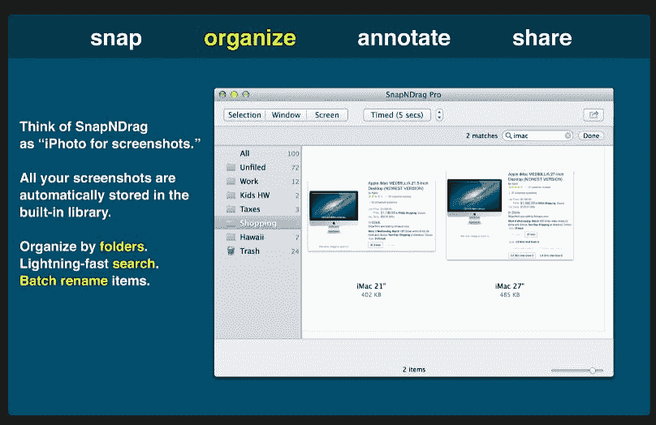

# 如何使用键盘快捷键在 Mac 上截屏等等！

> 原文：<https://www.xda-developers.com/how-to-take-a-screenshot-mac/>

在任何你用来工作或娱乐的设备上，截屏都是一项必要的任务。大多数用户都很清楚如何在最[流行的手机](https://www.xda-developers.com/best-phones)上截图。然而，如果你最近从 Windows 切换到 Mac，你可能想知道如何在新电脑上截屏。幸运的是，在 macOS 中，截图是一项非常简单的任务。

在这篇文章中，我们将看看如何拍摄一个基本的截图，以及一些更高级的选项。对于那些熟悉终端命令的人，我们也将看到如何使用这种方法在 Mac 上截屏。最后，我们将简要了解如何将您的截图存储在自定义文件夹中，以便进行组织。

## 如何在 Mac 上使用键盘快捷键截图

在 Mac 上截屏最简单的方法是使用内置键盘快捷键。我们所有[喜爱的 Mac 台式机和笔记本电脑](https://www.xda-developers.com/best-macs)都内置了这一功能。如果你对在 Mac 上捕捉整个屏幕感兴趣，只需按下 **Shift + Command** + **3** (所有按钮同时按下)。这将捕获您桌面上的所有内容，并将图片保存为 PNG 文件。

通常，您可能想要对屏幕的特定部分进行截图，为此，请按下**Shift**+**Command**+**4**。此命令会弹出一组十字准线，允许您通过快速单击鼠标来选择屏幕的一部分。突出显示所需部分后，只需释放鼠标点击，屏幕截图就会保存到您的桌面。

默认情况下，macOS 会使用拍摄的日期和时间来命名您的截图。如果您对更改屏幕截图的名称或文件格式感兴趣，请参阅下面介绍终端命令的部分。

## 如何用第三方 app 在 Mac 上截图

也有一些可靠的第三方应用程序可以在你的 Mac 上拍摄和编辑屏幕截图。所有这些应用程序都提供基本的屏幕截图功能，并根据您的特定用例添加额外的高级工具。如果你想了解第三方选项，下面是我们最喜欢的一些选择。

*   <picture></picture>

    snapdrag

    ##### snapdrag

    snapdrag 是一款付费 app，售价 9.99 美元，但非常值得。组织、注释和共享截图的能力是无缝的。如果你需要跨设备或社交渠道同步截图，这款应用正适合你。

*   <picture></picture>

    Monosnap

    ##### Monosnap

    Monosnap 提供了一个具有强大功能集的免费版本。这是一个具有 8 倍放大镜窗口的应用程序，用于像素完美的截图。此外，您可以设置自定义热键，并采取延迟截图。有一个附加商业功能的付费版本。

## 如何使用终端在 Mac 上拍摄和重命名屏幕截图

如果你是高级 macOS 用户，你可能在某个时候使用过终端。终端命令允许您在更精细的层次上控制 Mac，同时避免过多使用鼠标。“终端”应用程序位于 Mac 上的“实用工具”文件夹中。打开终端将显示一个简单的命令行界面来输入文本。要使用终端拍摄交互式屏幕截图，请键入命令，

```
 screencapture -i ~/Downloads/myScreenCapture1.jpg 
```

然后按**键进入**。该命令将调出一组十字准线来选择所需的屏幕部分。选择您希望包含的部分后，此命令会将文件作为 JPG 文件保存到您的下载文件夹中，文件名为“myScreenCapture1”由此可见，使用终端进行截图的主要好处是显而易见的——很容易更改文件名、格式或保存位置。

值得注意的是，上面终端命令中的'-i '扩展告诉你的 Mac 进行交互式截图。这是启用十字准线选择工具的命令部分。在“终端”中，您可能想要将许多其他扩展与此命令配合使用。例如，添加“-x”命令将获得没有动画声音的屏幕截图，而“-C”将强制屏幕截图显示光标。也可以同时组合几个命令扩展。

```
 screencapture -ixC ~/Dropbox/myScreenCapture3.png 
```

上面的命令把你的交互截图保存到 Dropbox 文件夹，截图动画不发声，你的截图会包含光标。使用终端命令，对屏幕截图功能的控制更加精确，您甚至可以更改默认设置。

## 如何使用“终端”更改屏幕截图的默认文件格式或文件夹

使用“终端”拍摄一些屏幕截图后，您可能会决定通过更改默认偏好设置来更仔细地管理您的屏幕截图。要更改屏幕截图的默认保存位置，请使用命令，

```
 defaults write com.apple.screencapture location ~/Dropbox/Screenshots 
```

用所需的文件夹代替“Dropbox/screens”

这是一个非常方便的选项，可以自动将截图保存到云中的一个文件夹中，就像我在这个例子中所做的那样。除了默认文件夹之外，您可能还希望更改屏幕截图的默认文件格式。默认格式可以很容易地修改为 PDF，JPG，TIFF 或 GIF 格式。例如，要将默认屏幕截图格式更改为 JPG，请使用以下命令。

```
 defaults write com.apple.screencapture type jpg 
```

用任何其他格式替换 JPG 扩展都会产生类似的结果。正如你所看到的，在 Mac 上使用终端完全控制你的截图输出是非常简单的。

* * *

在 Mac 上截图有很多种方法。如果你只是追求基本的功能，你可以坚持使用内置的键盘快捷键。对于那些寻找专用工作工具的人来说，许多第三方应用程序为社交媒体和云集成提供了出色的注释和共享功能。使用 Snagit 应用程序，您甚至可以使用我们最喜欢的 Mac 网络摄像头之一将画中画添加到教程中。高级用户会喜欢使用终端命令来控制截屏体验的方方面面。无论您选择使用哪种方法，您现在都已经为任何需要在 Mac 上截屏的任务做好了充分准备。

 <picture></picture> 

Apple MacBook Air M2

##### 苹果 MacBook Air (2022)

2022 年的 MacBook Air 提供了 M2 芯片和重新设计的带缺口的机箱，支持 MagSafe 和更多的颜色选择。

*您使用以下哪种方法在 Mac 电脑上截屏？请在下面的评论区告诉我们。*