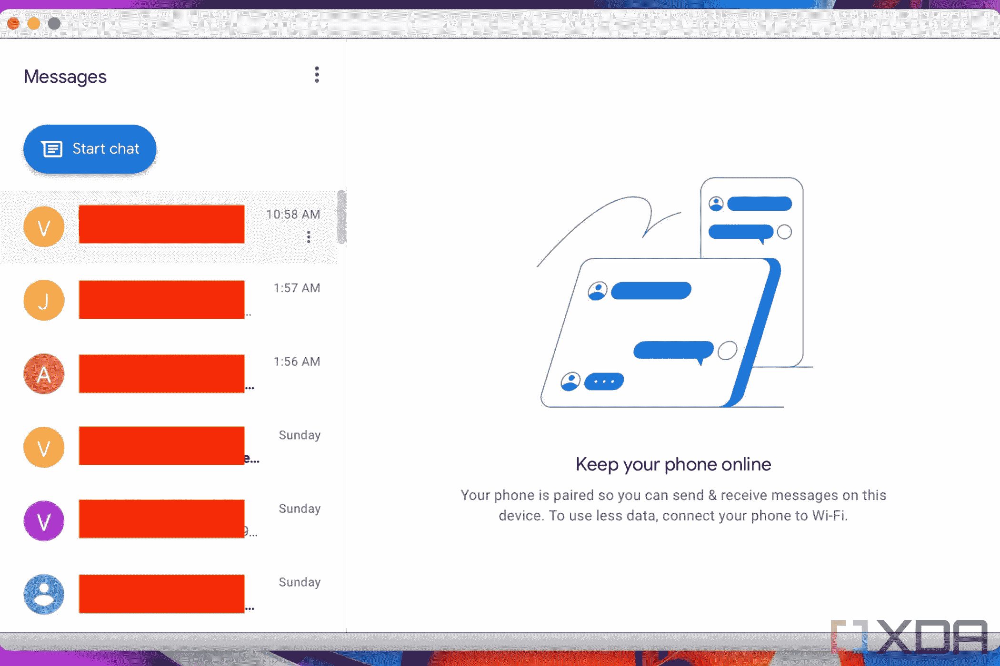

# 如何在 Mac 上使用 Android 手机:应用程序、服务等等

> 原文：<https://www.xda-developers.com/how-to-use-android-with-mac/>

今年早些时候，我决定买一部新的 iPhone 来搭配我的 M1 MacBook Air。我被说服带着一部新的 [iPhone 14 型号](https://www.xda-developers.com/apple-iphone-14-series-explained/)进入苹果的围墙花园，但我不打算买它，直到[黑色星期五](https://www.xda-developers.com/black-friday/)，看看我是否能抢到一笔好交易。

然而，谷歌在 10 月份推出了 Pixel 7。599 美元，普通的 [Pixel 7](https://www.xda-developers.com/google-pixel-7-review/) 是无与伦比的便宜货。所以我最终还是买了它，这意味着我还必须继续在 Mac 上使用 Android 手机。我对此并不太激动，但我知道该怎么做。

如果你对苹果略知一二，那么你可能会意识到让苹果的 Mac 电脑与安卓手机兼容是多么具有挑战性。苹果仍然倾向于自己的生态系统，所以你不会有 iPhone 和 Mac 用户享受的相同的一致体验。但是，如果你不想仅仅为了获得无缝体验而放弃你值得信赖的安卓手机，还是有办法让事情运转起来的。

## 信息传递:蓝色和绿色泡沫的困境

现在是 2022 年，谷歌和苹果仍然在错综复杂的信息系统上争论不休。你在 Android 上无法获得 iMessage，[苹果也不会采用 RCS](https://www.xda-developers.com/google-calls-out-apple-rcs-again/) 。这意味着安卓用户给 iPhone 用户发的短信会显示为短信或彩信。这也是为什么通过 iMessage 发送的文本在 iPhones 上显示为蓝色气泡，而短信/彩信显示为绿色。我很想看到有一天谷歌和苹果能摆脱这一切，让我们两全其美，但我认为我去火星的机会更大。对吧， [Elon](https://www.xda-developers.com/elon-musk-twitter-two-weeks/) ？

无论如何，如果你愿意忽略整个泡沫的情况，那么我建议使用 Mac 上的谷歌信息网络应用程序来查看和回复你在手机上收到的所有短信。Google Messages 网络应用出奇的好，可以完美地收发你所有联系人的短信，不管他们用的是 Android 还是 iOS。

我希望我能像使用 Telegram、WhatsApp 等其他消息应用程序一样，在 Mac 上使用谷歌官方消息应用程序。但由于 Mac 上没有官方的谷歌消息应用程序，我不得不使用一个名为 Fluid 的第三方应用程序来创建谷歌消息的桌面应用程序。

 <picture></picture> 

The Google Messages web app turned into a desktop Mac app using 'Fluid'.

Fluid 是一款出色而可靠的应用，可以让你将任何网站变成桌面应用，你可以像其他 Mac 应用一样启动它。它甚至将网站的 Favicon 作为应用程序图标导入，这非常简洁。你可以在几分钟内通过 Fluid 设置好谷歌信息，它对我来说工作得很好。它也可以免费使用，你可以创建尽可能多的流体应用程序。

没有在 Android 手机上使用 iMessage 的官方方法，我怀疑它会很快出现。但是如果你愿意忽略气泡的颜色，那么 Google Messages 会做得很好，它的 web 应用程序(通过 Fluid)在 Mac 上也运行得很好。Google Messages 也一天比一天好，所以谁知道呢？或许谷歌最终会迫使苹果采用 RCS。

## 连续性和文件共享:移交选择...有一点

Handoff 是苹果设备上的帐篷杆功能之一，让 Android 用户感觉他们错过了一些神奇的东西。你可能不会一直使用它，但能够在你的 iPhone 上打开并开始编辑一个文档，并在比如说你的 iPad 上通过 Handoff 继续这项任务是非常方便的。解决这一问题的方法是依靠其他云存储平台在不同设备之间同步您的文档和照片。

我所有的重要文档和文件都绑定在一个谷歌账户上，这意味着我可以在几乎任何设备上访问它们，包括我的 MacBook Air。它们都通过云进行同步，因此我可以在任何设备上无缝访问最新更新的副本。使用 Microsoft Office 应用程序也可以获得相同的结果，因为它们也可以通过云在设备之间进行同步。你甚至可以在 Mac 上为它们安装专门的应用程序，这样就可以很容易地在我的手机上完成任务，然后在我的 MacBook 上继续。

我还严重依赖谷歌照片来访问我的 Pixel 上拍摄的图像并将其传输到我的 MacBook 上。除非你不介意访问网页版，否则你将不得不再次依赖 Fluid 来创建谷歌照片的桌面应用。同样，我也依靠 Google Drive 在我的 Pixel 7 和 MacBook Air 之间传输文件。当然，你总是可以使用物理连接在 MAC 和 Android 手机之间移动文件，但我喜欢通过云同步它们，以节省一些额外的时间和精力。这可能不像通过隔空投送导入它们那样无缝，但如果你有互联网连接，你可以通过 Google Drive 或微软 OneDrive 额外点击几次来实现同样的效果。

## 与 Clipit 无缝共享剪贴板

与 Handoff 类似，Apple 也允许您在其设备之间共享剪贴板，只要它们连接到同一个网络。它运行完美，你不需要在任何苹果设备上下载任何额外的应用程序。你可以在 Android 手机和 Mac 电脑上实现类似的功能，但你必须在这两款设备上下载一款名为 Clipt 的应用。

Clipt 是一个简单的变通方法，可以让你在 Android 和 macOS 上访问一个共享的剪贴板。你所要做的就是下载这个应用程序，然后用同一个谷歌账户登录。完成后，您可以开始在手机或 Mac 上拷贝项目，并跨设备访问它们。然而，你必须在你的手机和 Mac 电脑上点击一个额外的按钮，才能让内容在其他设备上显示。

在我的 Pixel 7 上，我启用了快速设置磁贴，点击它可以将我复制到剪贴板的内容发送到我的 Mac 上。类似地，在 Mac 上，我通常在后台运行 [Stage Manager](https://www.xda-developers.com/how-to-use-stage-manager-macos/) 中的 Clipit，我可以很容易地访问它，将我的剪贴板项目发送到我的 Android 手机。这可能不是最无缝的解决方法，但对于我的日常使用来说效果很好。

## 结束语

如果你不同时使用 iPhone 和 MacBook，你肯定会错过一些苹果独有的功能。例如，你不能用苹果手表或手机解锁你的 MacBook。同样，你也不能跨 Android 和 macOS 共享 Wi-Fi 网络。这些可能不是你每天使用和想念的东西，但是当事情只是...工作！这类似于我的同事 Ben Sin 在去一家多年未去的老咖啡店时感到惊讶，但他的新 iPhone 14 Pro Max 自动连接到 Wi-Fi，因为这是他上次访问时保存的。你可以在他的 [iPhone 14 Pro Max](https://www.xda-developers.com/apple-iphone-14-pro-max-review/) 评论中了解更多相关信息——太棒了！

在 2022 年，完全有可能同时使用 Android 手机和 Mac 电脑，并获得良好的体验。是的，很多事情不会像你希望的那样天衣无缝，但它比你想象的更容易实现。我一直在寻找更多的应用和服务，试图让我的体验变得无缝。所以如果你有任何建议或想法，请在下面的评论中提出来！