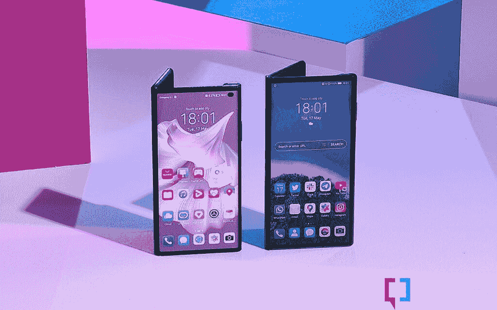

# 华为 Mate Xs 2 上手:迄今最轻的大尺寸可折叠手机

> 原文：<https://www.xda-developers.com/huawei-mate-xs-2-hands-on/>

当 [foldables](https://www.xda-developers.com/best-foldable-phones/) 在 2019 年首次出现时，有两种形式:三星的 Galaxy Fold 建立的书状内折叠，或华为在 Mate X 上看到的环绕式外折叠。虽然我一直认为内折叠更有意义，因为这种设计在不使用时保护主屏幕，但有几位[知名评论家更喜欢外折叠设计](https://pocketnow.com/huawei-mate-xs-first-impressions) *。*他们的理由是内部折叠设计需要两块屏幕，这大大增加了可折叠部分的重量和厚度。

当华为在 2021 年推出第三款采用内部折叠设计的可折叠手机时，似乎是一种让步，即[三星一直有正确的想法](https://www.xda-developers.com/huawei-mate-x2-proves-samsung-right-foldables/)。但事实显然并非如此，因为华为又推出了一款新的环绕式折叠设备 Mate Xs 2。

这款手机实际上是上个月底在中国推出的，但它今天在米兰的华为活动上首次亮相，同时发布了三款新的智能手表。我参加了这次活动，并接触了这款设备一段时间，在过去两年测试了一系列内部折叠的可折叠产品后，我意识到，是的，外部折叠设计确实更轻更薄。华为甚至设计了一个新的保护套，在某种程度上解决了我对屏幕过于暴露的担忧。

 <picture></picture> 

Huawei Mate XS 2

##### 华为 Mate Xs 2

华为 Mate Xs 2 带回了华为的首款可折叠设计，但外形更轻更小。它有漂亮的屏幕和功能强大的摄像头，但没有 5G 的过时 SoC。

## 华为 Mate Xs 2:规格

| 

规格

 | 

华为 Mate Xs 2

 |
| --- | --- |
| **尺寸** | 

*   展开后:156.5 x 139.3 x 5.4 毫米
*   折叠后:156.5 x 75.5 x 11.1 毫米
*   255 克

 |
| **显示** | 

*   折叠
    *   6.5 英寸 AMOLED
    *   120 赫兹
    *   1176 x 2480
*   展开的
    *   7.8 英寸 AMOLED
    *   120 赫兹
    *   2200 x 2480

 |
| **SoC** | 高通骁龙 888 4G |
| **RAM 和存储器** | 

*   8GB/12GB 内存
*   256GB/512GB 存储空间

 |
| **电池&充电** | 

*   4880 毫安时
*   66W 快速有线充电

 |
| **后置摄像头** | 

*   **初级:** 50MP f/1.8
*   **二级:** 13MP 超宽 f/2.2
*   **第三:** 8MP 长焦 f/2.4

 |
| **前置摄像头** |  |
| **连通性** |  |
| **安全** | *未知* |
| **软件** | EMUI |

***关于这次动手:**这篇第一印象文章是在华为发布会之前，在受控的室内环境中使用华为 Mate Xs 2 大约 45 分钟后撰写的。华为让我飞到米兰参加发布会。该公司在这篇文章中没有任何投入。*

## 华为 Mate Xs 2:有什么新的？

华为 Mate Xs 2 对于大多数看过或读过最初的华为 Mate X 或 2020 年的后续产品 Mate Xs 的人来说都很熟悉。整体设计和外形看起来几乎相同，但在各个方面都有明显和细微的改进。

对我来说，最显著的变化是 Mate Xs 2 感觉*明显比以前的华为可折叠袋轻*，当然，这还不包括小翻盖华为 P50 口袋。一小部分原因是因为华为将 Mate Xs 2 的屏幕尺寸与其前身相比缩小了一点，折叠后为 7.8 英寸，折叠后为 6.5 英寸，但主要原因是四周使用了更轻的材料，包括航空级钛合金。

这些数字支持了我的感觉:Mate Xs 2 的重量只有 255 克，而华为 Mate Xs 的重量为 300 克，鉴于尺寸差异并不显著，这是一个不和谐的重量差异。

 <picture></picture> 

The new Mate Xs 2 (left) and the Mate Xs (right) released in 2020.

由于华为 Mate Xs 与内部折叠手机相比已经相对轻薄(因为后者需要使用两个独立的屏幕)，这使得 Mate Xs 2 与典型的内部可折叠手机相比感觉很精致。例如，Galaxy Z Fold 3 重 271 克，我测试的 Vivo X Fold 是一个庞然大物，重 311 克。华为自己的内折叠伴侣 X2 重 295 克

Mate Xs 2 明显比以前的任何大屏幕可折叠手机都要轻

当 Mate Xs 2 处于折叠状态时，与其他可折叠手机相比，它几乎像一部传统的平板手机，这要归功于其典型的 19.5:9 纵横比和圆形侧面。它 11 毫米的厚度几乎相当于任何一款带表壳的现代旗舰产品。

屏幕的刷新率升级到了 120 赫兹(最初的 Mate X 是 60 赫兹，Mate X2 是 90 赫兹)，其 2200 x 2480 看起来足够清晰。另一个值得注意的变化是:现在在显示屏的右上角有一个 100 万像素的自拍相机，采用典型的打孔格式。之前的两款 Mate X 和 Mate Xs 手机没有传统的自拍相机，而是需要你翻转手机才能使用主相机系统进行自拍——这之所以成为可能，是因为环绕式屏幕设计在折叠时基本上给了手机一个前后屏幕。你仍然可以这样做，但最好有一个额外的选项，可以轻松地快速自拍。

华为 Mate Xs 2 运行在没有 5G 的骁龙 888 上，有 8GB 内存和 256GB 存储空间，以及 4，600 mAh 电池。不支持 5G 网络的旧 SoC 令人失望，但这是由于华为无法控制的限制。

### 摄像机

主摄像头系统由一个 50MP 主摄像头、13MP 超宽和 8MP 3.5x 长焦变焦镜头组成，以华为的 XD Optics 软件图像处理算法为后盾。我使用手机的时间非常有限，而且不允许分享照片样本，所以目前我没有太多可以报告的。我会说，我认为华为 P50 Pro 有一个出色的相机系统，但 P50 Pocket 有一个很好的，但不是很棒的系统。这个相机系统在规格和硬件上似乎更倾向于 P50 Pro。变焦镜头高达 10 倍变焦看起来相当不错。

### 软件

华为 Mate Xs 2 运行在 EMUI 上(而不是中国版的鸿蒙系统),它的外观和行为与任何安卓手机一样，明显的警告是它不支持谷歌移动服务。这已经是旧闻了，几乎所有读到这里的读者都已经知道了。在这一点上，读者应该有一个公平的想法，这是否是一个交易破坏者。我公开说过，没有谷歌移动服务对我来说永远不会是理想的，但这并不会让我的手机不能用。有许多合法/授权的变通办法仍然可以访问 Gmail 和谷歌日历，我使用的大多数应用程序，如 WhatsApp、Instagram，都运行良好。我在我的 [P50 Pocket review](https://www.xda-developers.com/huawei-p50-pocket-review/) 中写了我使用 EMUI 的经历，供感兴趣的人参考。

### 外部可折叠物的潜在易碎性问题

之前我写道，我一直倾向于内部可折叠，因为这种设计可以在不使用时保护柔软的可弯曲屏幕，而华为的外部折叠设计让折叠屏幕一直暴露在外。在折叠的形式下，手机的背面仍然是一个屏幕，这让我在任何时候把手机放在表面上都感到紧张。使用传统的外壳是一个麻烦，因为这意味着每次我需要打开设备时，我都需要取下外壳。

华为试图解决这一问题，首先建造一种据称更坚固、更耐用的折叠屏幕，具有四层保护。鉴于我有限的测试，我现在不能保证这种额外的耐用性，但这种材料确实比以前感觉更像玻璃，更不像塑料。

华为做的第二件事是设计了一个智能外壳，将包含在手机中。这款保护套看起来就像一个典型的塑料保护套，起初只是套在折叠的 Mate Xs 2 的背面和侧面，但保护套有一个铰链，可以在合适的角度轻轻一推，就可以很容易地从一侧取下。这使得 Mate Xs 2 在折叠状态下可以容纳在保护其背面的外壳中，即使在展开状态下也可以保持不动。

是的，这种情况确实会减缓展开的动作——需要额外的半秒钟摆弄——而且材料感觉不如裸手机好，所以这仍然是一种妥协，但我不知道任何其他适合向外折叠手机的解决方案。

## 华为 Mate Xs 2:早期印象

华为 Mate Xs 2 是第一款大屏幕折叠手机，与使用典型的平板旗舰手机相比，感觉并不明显更重更笨重，所以在我看来这是一个重大优势。鉴于华为的 XD 光学引擎之前给我留下了深刻的印象，我也相信相机系统应该非常好。

但 Mate Xs 2 在国际上将是一款非常小众的设备，只适合发烧友。这不仅仅是因为较老的 SoC 或缺乏谷歌移动服务，还因为€1999 的价格真的很高(2103 美元)。这比欧洲 8999 元(约 1500 美元)的价格高出不少。但这往往是所有在欧洲销售的中国手机的情况。很难看到普通人拿起这款手机，但华为知道这一点，无论如何它似乎都打算推进全球发布。我会说，在香港和马来西亚，华为手机的需求仍然很高。

无论如何，我总是支持更多的手机选择。华为 Mate Xs 2 为急需更多选择的国际市场增添了又一款可折叠设备。

 <picture></picture> 

Huawei Mate XS 2

##### 华为 Mate Xs 2

华为 Mate Xs 2 带回了华为的首款可折叠设计，但外形更轻更小。它有漂亮的屏幕和功能强大的摄像头，但没有 5G 的过时 SoC。