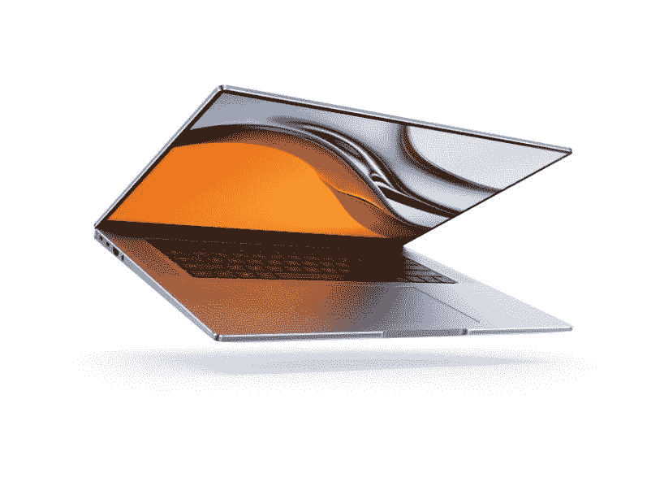

# 华为 MateBook 16 评测:一款出色的笔记本电脑，没有网络摄像头

> 原文：<https://www.xda-developers.com/huawei-matebook-16-review/>

在我相对较短的时间里，作为一名 PC 评测人员，我的大部分经历都是关于 Honor 笔记本电脑的。Honor 的 MagicBook 笔记本电脑以前是华为的子品牌，使用了与华为非常相似的设计，通常也有相似的规格。所有这些都是性能良好、设计高端的笔记本电脑，但它们并没有太多突出之处，而且它们被糟糕的网络摄像头位置所破坏。华为 MateBook 16 是我第一次使用真正的华为笔记本电脑，它非常棒，远远好于我使用过的任何荣誉品牌的笔记本电脑。

华为 MateBook 16 有很多令人喜欢的地方，我当然喜欢用它做几乎任何事情。但这是这里的关键词:几乎。虽然它比我用过的其他 Honor 笔记本电脑要好，但它仍然使用着那个可怕的网络摄像头，这在在家工作的时代已经变得至关重要。

**浏览此评论:**

### 华为 MateBook 16 规格

| 

中央处理器

 | AMD 锐龙 7 5800H (8 核 16 线程，最高 4.4GHz) |
| 

制图法

 | AMD 镭龙显卡(集成) |
| 

身体

 | 13.82 英寸 x 10.04 英寸 x 0.7 英寸(351 毫米 x 254.9mm 毫米 x 17.8mm 毫米)，4.39 磅(1.99 千克) |
| 

显示

 | 16 英寸(3:2) 2520 x 1680 IPS，400 尼特，100% sRGB，平均 Delta E = 1 |
| 

记忆

 | 16GB DDR4(双通道) |
| 

储存；储备

 | 512GB NVMe PCIe 固态硬盘 |
| 

港口

 | 2 个 USB Type-A(USB 3.2 Gen 1)2 个 USB Type-C(支持充电、显示端口和数据)1 个耳机/麦克风组合插孔(3.5 毫米)1 个 HDMI |
| 

连通性

 | Wi-Fi 6 2 x 2 MIMO +蓝牙 5.1 |
| 

照相机

 | 720p 高清嵌入式摄像头 |
| 

键盘

 | 6 排 LED 背光，包括带多点触控功能的内置摄像头玻璃触摸板 |
| 

声音的

 | 双顶置扬声器、杜比、带 5 米拾音器的双麦克风、回声降低和人工智能噪音消除 |
| 

安全性

 | 电源按钮中的指纹传感器 |
| 

电池

 | 84 Wh，支持华为 SuperCharge 配 135W USB-C 电源适配器 |
| 

颜色

 | 太空灰 |
| 

材料

 | 铝金属 |
| 

价格

 | $1,150 |

## 设计:华为 MateBook 16 是它的标准配置

就外观而言，你不可能得到比华为 MateBook 16 更基本的东西。我得到的太空灰是唯一的一种颜色，它完全无害，但也不是特别令人兴奋。银色的变化似乎是许多[最好的笔记本电脑](https://www.xda-developers.com/best-laptops/)的标准，我想很多人会发现这完全符合他们的需求，但对我来说，这只是有点无聊。

不过，这款笔记本电脑看起来和感觉都不错。盖子的边缘弯曲得很好，当你打开它时，键盘面板上有这些蚀刻的边缘，这让我想起了我过去评论的 Honor MagicBook 笔记本电脑上的盖子。不同的是，那些使用了蓝色突出的边缘，而这仍然是银色的，只是现在更具反射性。它确实为整体设计增添了一点点光彩。

[sc name = " pull-quote-left " quote = "对于没有独立 GPU 的笔记本电脑来说，MateBook 16 有点重。"]考虑到缺乏专用显卡，MateBook 16 重得惊人，只有 4.39 磅。我确实尝试过在短途散步时(大约 20 到 30 分钟)把它放在背包里，它一点也不困扰我，但如果我整天都在散步，它可能会开始对我的背部和肩膀产生影响。

看看笔记本电脑周围的端口，总的来说有一个稳定的供应。左侧有两个 USB Type-C 端口，都支持充电和显示端口，附带的 135W 电源适配器也是 USB Type-C。你还可以获得一个 HDMI 端口——这是我非常重视的，因为我仍然使用相当传统的显示器和组合耳机/麦克风音频插孔。

在右边，你只有两个 USB 型端口，如果你需要一些传统的外设，可以满足你的需求。总的来说，这里有很多端口，所以你可以连接任何你需要的东西。当然，除了 Thunderbolt 设备，因为这是一台 AMD 驱动的笔记本电脑。

## 显示屏:惊艳的 3:2 IPS 面板和强劲的音效

华为 MateBook 16 上的显示屏绝对是它的亮点之一。这是一个 16 英寸的面板，长宽比为 3:2，分辨率为 2520 x 1680，类似于 Quad HD。多年来，我已经习惯了标准的全高清笔记本电脑显示器，它们一直是 16:9 的宽高比，所以开始使用如此不同的东西几乎是不和谐的，但这太棒了。与大多数 15 英寸笔记本电脑相比，这种高长宽比确实让人感觉有更多的空间，在这里浏览网页、阅读文章等感觉非常好。

与我用过的其他 16 英寸笔记本电脑相比，这也让这台笔记本电脑感觉更紧凑，这得益于屏幕周围的小边框。它的屏幕与身体的比例为 90%，这得益于屏幕顶部没有网络摄像头。它的亮度高达 300 尼特，虽然还可以更好，但我发现 MateBook 16 的显示屏上的室外能见度还不错。屏幕有点反光，但它足够亮，可以保持可见。

MateBook 16 的显示屏高大、锐利、充满活力

它有 189ppi，当我们在一些手机上有技术上更清晰的屏幕时，这在纸上听起来可能不太清晰，但这仍然是绝对神奇的。即使仔细看屏幕，我也看不到一个像素。这种像素密度和分辨率还允许我将 Windows UI 缩小很多，这是我在任何笔记本电脑上经常做的。这也有助于屏幕感觉更宽敞。显示器不支持触控，这对于我个人来说是个扫兴的事情，不过那要看个人喜好了。我是[敞篷笔记本电脑](https://www.xda-developers.com/best-convertible-laptops/)的忠实粉丝，但它们并不适合所有人。

华为宣称 100%覆盖了 sRGB 色域，平均色彩准确度为δE = 1。不幸的是，我没有能力在更高的技术层面上测量显示器上的颜色值，但同样，这个屏幕看起来棒极了。色彩明亮而充满活力，对比度也很好。华为声称对比度为 1，500:1，同样，我无法准确测试，但它看起来确实很棒。

如果你想改变它的外观，你可以随时使用华为的显示管理器来调整色温。我个人喜欢它开箱即用，但我确实改变了 AMD 镭龙软件设置中的一个设置。许多笔记本电脑(不仅仅是 AMD 的)在使用电池电源时都有一个改变颜色显示方式的功能，它破坏了显示器的对比度，使某些元素非常难以阅读。在 AMD 笔记本电脑上，这个功能被称为 VariBright，如果你注意到类似这样的问题，我建议禁用它。

声音方面，华为在键盘旁边打包了两个顶射扬声器，这些东西功能强大。拥有顶部发射扬声器总是一件好事，但在我使用过的几台拥有它们的笔记本电脑中，它们并不比底部发射扬声器好多少。在这里，情况并非如此，这些扬声器声音很大，它们提供了一种非常身临其境的立体声体验。

## 键盘:太棒了，它隐藏了一个网络摄像头

对于一个以写作为生的人来说，我对键盘并不那么挑剔，但我确实觉得华为 MateBook 16 非常舒适。所有的键都有很好的行程，我从来没有遇到过任何驱动或稳定的问题，一切都很好。键盘还有一个亮度可调的白色背光，这是一个我不常使用的功能，但它有时真的很方便。

但是我们来谈谈这个键盘的一个大缺点:网络摄像头。如果你从未见过华为笔记本电脑，在键盘上安装网络摄像头的想法可能听起来很荒谬——事实确实如此。正如我在上面所说的，我在过去使用过几台 Honor 笔记本电脑，它们做了同样的事情，但这太糟糕了。网络摄像头本身只有 720p，这不是很好，但坦率地说，在我看来也没那么糟糕。

MateBook 16 的键盘摄像头放置很糟糕。

键盘内置摄像头的问题是它在键盘上——如果你在打字，你的手就在键盘上。每当我在开会并试图同时写作时，我的手指不可避免地覆盖了框架的很大一部分，这在重要会议期间不是最好的外观。此外，它很可能会把你的吸顶灯也放在框架里，所以你必须小心保持良好的照明。我是少数几个在去年之前就非常关心笔记本电脑网络摄像头的人之一，所以我从来不明白为什么公司要这样做。世界变了一年半之后，就更不可理解了。开会时你会变成这样。

键盘下面是一个玻璃触控板，它确实很大，至少与我用过的其他 Windows 笔记本电脑相比是如此。屏幕的高纵横比意味着笔记本电脑本身也很高，这为使用起来非常棒的大型触控板腾出了空间。用多个手指做手势非常容易，而且由于触摸板的大小，四处移动鼠标指针永远不会中断。我最近注意到的一件事是，当我打字时，我经常触摸触摸板，它会记录为一次点击，这真的会打乱我的打字。这不是我在这台笔记本电脑上遇到的问题，但我真的希望有某种形式的 palm rejection 能够防止这样的误击。

键盘面板上的另一个东西是电源按钮，它包括一个内置的指纹读取器。这是华为笔记本电脑的一个主要特点，在这里非常好用。它的大小很好，所以总是很容易获得准确的读数，而且只要你按下按钮，它就可以读取你的指纹，所以当你打开它时，它可以自动解锁你的电脑。

## 性能:AMD 锐龙 5000 很棒，但是没有独立的 GPU

现在让我们谈谈性能，这是我第一次以任何方式体验 AMD 的锐龙 5000 系列处理器。华为 MateBook 16 配有一个 AMD 锐龙 7 5800H，它有 8 个核心和 16 个线程。它的基本时钟为 3.2GHz，可以提升到 4.4GHz，这意味着您已经有了稳定性能的秘诀。虽然没有专用的 GPU，但对于使用 45W 处理器的笔记本电脑来说，这总是一个奇怪的选择。

当然，在日常使用中，你不会将它推到极限，它可以轻松地浏览网页和写作，这是我每天做的大部分事情。不过，我确实运行了一些基准测试，华为 MateBook 16 的表现和你预期的一样好。当然，因为没有独立的 GPU，3DMark 的性能比大多数其他配备这种 CPU 的笔记本电脑要差得多。

|  | 

华为 MateBook 16Ryzen 7 5800H

 | 

[Surface Laptop Studio](https://www.xda-developers.com/surface-laptop-studio-review/) 酷睿 i7-11370H，RTX A2000

 | 

[联想军团 Slim 7](https://www.xda-developers.com/lenovo-legion-slim-7-review/) 锐龙 7 5800H，RTX 3060

 | 

[戴尔 XPS 15 9510](https://www.xda-developers.com/dell-xps-15-9510-review/) 酷睿 i7-11800H，RTX 3050 Ti

 |
| --- | --- | --- | --- | --- |
| 

PCMark 8:主页

 | 4,599 | 4,181 | 5,322 | 3,969 |
| 

PCMark 8:创意

 | 4,734 | 4,962 | 6,223 | 5,731 |
| 

PCMark 8:工作

 | 3,813 | 3,843 | 4,504 | 3,571 |
| 

PCMark 10

 | 5,992 | 5,573 | 6,428 | 5,988 |
| 

3DMark:时间间谍

 | 1,376 | 5,075 | 8,316 | 4,801 |
| 

极客工作台

 | 1,474 / 7,323 | 1,546 / 5,826 | 1,446 / 7,335 | 1,538 / 7,514 |
| 

电影院长凳

 | 1,434 / 11,769 | 1,504 / 6,283 | 1,415 / 11,833 | 1,491 / 9,339 |

除此之外，MateBook 16 的性能非常好，正如你对这样强大的 CPU 的预期。我也试过渲染视频。我用手机以 60fps 的速度录制了一段 4K 视频，时长约 1 分 1 秒。我把它扔进 DaVinci Resolve(版本 17.4)，用同样的分辨率和帧率渲染出来，花了 4 分 1 秒完成。为了它，我也试着玩过火箭联盟，运行的还算不错。在原生分辨率和渲染质量设置为质量配置文件，我得到了大约 30 帧/秒的帧速率。你当然可以降低分辨率，但它看起来仍然很棒，所以你可以在不大幅降低分辨率的情况下获得更高的性能。尽管如此，你不应该指望这个运行最新的 AAA 游戏流畅，它显然不是为了那个。

我花了 11 个半小时才用完 MateBook 16 的电池。

尽管使用了更耗电的 45W 处理器，但华为 MateBook 16 的电池续航时间令人印象深刻。在实际使用中很难获得正确的测量值，因为在我的典型使用情况下，我不容易让笔记本电脑达到空电池水平。我通常在笔记本电脑从我的第二个屏幕上拔下的情况下测量电池寿命，最终，在一天使用了大约 11 个半小时后，我让它耗尽了电池。这是在亮度为 30%左右，Wi-Fi 打开，使用主要包括使用 Edge 浏览器在 WordPress 中浏览网页和写作的情况下。它也是基于笔记本电脑自带的 Windows 10，不过我后来升级到了 Windows 11。

它持续的时间比我预期的长得多，所以我也决定连接第二块屏幕来测试它，即使这样也令人印象深刻。Matebook 16 在一次充电后坚持了 9 个多小时，除了主显示器外，我还连接了全高清显示器。当然，如果你在做像视频编辑或游戏这样的密集型任务，这个数字会更低，但这仍然给我留下了非常深刻的印象。

## 华为生态系统和 MateBook 16

华为笔记本电脑的一个主要特点是与公司的其他设备集成，随着最近鸿蒙系统的推出，该公司进一步推进了这一点。华为给我发了一个 MatePad 11 平板电脑和 MateBook 16，以测试笔记本电脑和平板电脑之间的新集成，老实说，它非常酷。

使用华为 PC Manager 应用程序，您可以连接这两台设备，然后您可以选择如何在使用笔记本电脑的同时使用平板电脑。您可以将笔记本电脑的屏幕扩展到平板电脑或复制设备上，就像使用有线显示器一样。一旦你这样做了，平板电脑本身会给你一个侧边栏，上面有常见的 Windows 操作按钮，如显示桌面、打开任务视图或截屏。您还可以快速将活动应用从平板电脑屏幕切换回笔记本电脑屏幕，反之亦然。

华为平板电脑让您在旅途中拥有第二块屏幕。

这并不一定要用在你的办公室里。事实上，如果您连接了有线显示器，您就不能在平板电脑上添加另一个显示器。然而，如果你在旅途中需要一个多屏设置，这非常好，是扩展你工作空间的好方法。你甚至可以将音频设置为来自平板电脑的扬声器，这些扬声器的声音也很大。

连接笔记本电脑和平板电脑时，最酷的功能可能是将触摸板用作平板电脑中鼠标的光标。你不用将屏幕投影到平板电脑上，只需使用笔记本电脑的鼠标控制平板电脑的界面，甚至可以将文件从一台设备拖放到另一台设备上。

当然，如果你有一部华为手机，旧的华为功能仍然存在。您可以轻松地将文件从手机共享到笔记本电脑，或者将手机屏幕镜像到笔记本电脑上，同时还能在两个设备之间移动文件。您甚至可以在电脑连接时使用手机来录制电脑屏幕。在美国，这几乎无关紧要，因为你不太可能拥有华为手机，但如果你能利用这个生态系统，那就太酷了。

## 结论:华为 MateBook 16 值吗？

归根结底，华为 MateBook 16 在很多方面都是一款真正伟大的笔记本电脑。它采用坚固的铝制设计，漂亮锐利的显示屏，出色的性能和超长的电池续航时间。如果你碰巧在华为生态系统中，它也是你的平板电脑或手机的一个很好的补充，也是你在 Windows 上可以获得的更集成的体验之一。考虑到这一点，1150 美元(含税)的要价还算不错。你确实以这个价格买到了一台很棒的笔记本电脑，而且它会在很长一段时间内为你服务。

但你必须问问自己，在我们今天生活的时代，像网络摄像头这样的东西有多重要。随着远程和混合工作比以往任何时候都更加普遍，一个坏的网络摄像头足以让一些人的整个笔记本电脑变得糟糕，MateBook 16 的网络摄像头很糟糕。我也认为 MateBook 16 的外形和整体设计相当无聊，但那些都是非常主观的领域，这完全取决于你的需求。

您还应该考虑您的具体工作负载需求。有很多工作负载需要像这样的高功率 CPU，但独立 GPU 不会带来好处，例如戴尔 XPS 15 中的 GPU。当然，这将是一台昂贵得多的笔记本电脑，如果你想要一台能够处理视频渲染等更苛刻任务的笔记本电脑，即使没有独立 GPU，像锐龙 7 5800H 这样的快速 CPU 也已经很不错了。结合出色的显示屏和相对实惠的价格，这确实使它成为一些使用案例的有效选择。

 <picture></picture> 

Huawei MateBook 16

##### 华为 MateBook 16

华为 MateBook 16 是一款高端笔记本电脑，配备 AMD 锐龙 H 系列处理器和夏普显示屏。