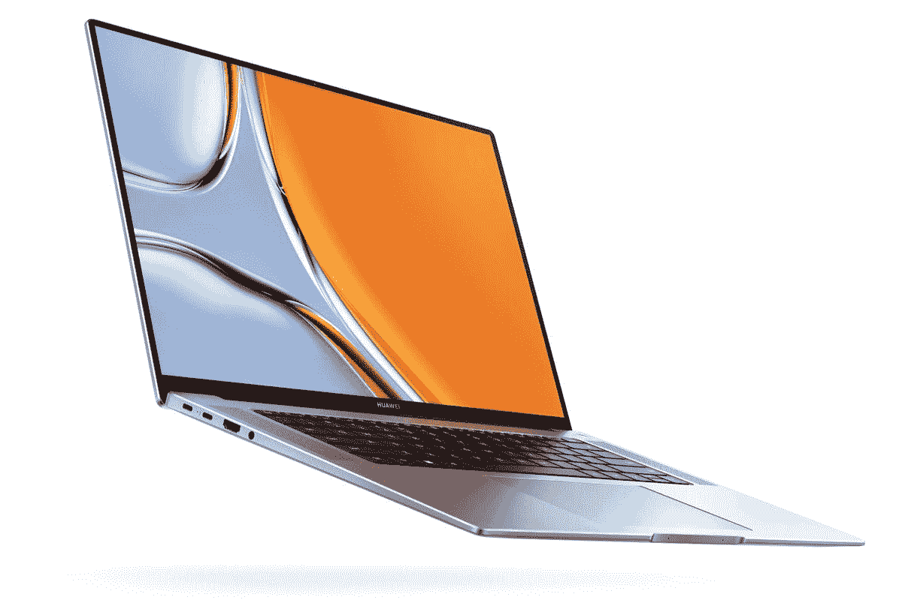

# 华为 MateBook 16s 回顾:加强其生态系统

> 原文：<https://www.xda-developers.com/huawei-matebook-16s-review/>

华为做的笔记本电脑不错，MateBook 16s 也没什么不同。你可以就这么买，但真正的价值主张是华为的生态系统。事实上，无论你使用的是华为手机、智能手表、耳塞、PC、显示器等等，这些东西都是为了无缝地协同工作而设计的。有了华为的超级设备功能，这个想法就是不管你用的是什么屏幕；都是一样的装置。

我对 MateBook 16s 最大的问题是它没有专用显卡。如果是这样的话，我宁愿看到这款笔记本电脑拥有 P 系列处理器。还有一些小事，比如只有一个 USB Type-C 端口支持 Thunderbolt。

但像往常一样，MateBook 16s 是一个胜利。这是一款[伟大的全能笔记本电脑](https://www.xda-developers.com/best-laptops/)，如果你已经在华为生态系统中，那就更好了。

 <picture></picture> 

Huawei MateBook 16s

##### 华为 MateBook 16s

华为 MateBook 16s 是一款 16 英寸的笔记本电脑，旨在与华为的其他产品集成，并且不会失败。

## 华为 MateBook 16s:定价和供货情况

*   MateBook 16s Core i7 型号现在可以从华为商店获得，Core i9 型号稍后将从华为、亚马逊等公司获得
*   如果你现在订购，华为将免费赠送一台显示器

华为在 6 月份宣布了 MateBook 16s，该产品于 7 月 13 日上市。Core i7 型号为 1，299.99，现在从华为商店发货。然而，如果你在 8 月 23 日之前订购，它实际上附带一个免费的 MateView GT 27 显示器。

核心 i9 型号为 1，499.99，来自华为、亚马逊、AO、Argos 和 Currys，将于 8 月 10 日上市。如果您在 7 月 26 日之前从华为商店预购，您将免费获得一台华为 MateView 显示器。

## 华为 MateBook 16s:规格

| 

处理器

 | 第 12 代英特尔酷睿 i7-12700H 处理器 |
| 

制图法

 | 英特尔虹膜 Xᵉ显卡 |
| 

身体

 | 351 x 254.9 x 17.8 毫米，1.99 千克 |
| 

显示

 | 16 英寸，IPS，90%屏幕与机身比例，3:2 纵横比，2,520x1,680，189ppi，300 尼特，100% sRGB，△E<1，1500:1 对比度，178 度视角，10 点多点触控 |
| 

记忆

 | 16GB LPDDR5 |
| 

储存；储备

 | 1TB NVMe PCIe 固态硬盘 |
| 

港口

 | USB-A 3.2 Gen 1 × 2 USB-C × 1(支持数据、充电和显示端口)USB-C × 1 (Thunderbolt 4，支持数据、充电和显示端口)HDMI × 1 3.5 mm 耳机和麦克风二合一插孔× 1 |
| 

电池

 | 84 Wh(额定容量)锂聚合物 |
| 

网络摄像头

 | 1080P FHD 相机 |
| 

声音的

 | 麦克风× 2 扬声器× 2 |
| 

连通性

 | WLAN IEEE 802.11 a/b/g/n/AC/ax 2.4 GHz、5 GHz 和 6 GHz 2×2 MIMO WPA/WPA2/WPA 3 蓝牙:蓝牙 5.2 |
| 

在盒子里

 | 华为 MateBook 16s 90 W/135 W USB-C 电源适配器 USB-C 充电器线缆快速入门指南保修卡 |
| 

材料

 | 铝金属 |
| 

颜色

 | 太空灰 |
| 

操作系统（Operating System）

 | Windows 11 主页 |
| 

价格

 | £1,299.99 |

## 设计、显示屏和键盘:它有一个 1080p 网络摄像头！

*   华为终于使用了一个好的网络摄像头
*   屏幕很好，但不太好

自 2017 年进入 Windows 笔记本电脑领域以来，华为的设计选择一直非常一致(它于 2016 年以平板电脑进入 Windows 领域)。MateBook 16s 由铝制成，感觉它具有优质的制造质量，并有太空灰。多年来，华为一直使用其他颜色，但这种颜色似乎是其几乎所有笔记本电脑通用的颜色。

盖子上印有华为的文字，不像早些年使用花瓣标志。感觉就像 16 英寸笔记本电脑应该有的感觉，重量为 4.38 磅，没有专用显卡。对于一个屏幕又大又好看的东西来说，它足够轻，便于携带。

说到 2，520x1，680 显示屏，支持 97% sRGB，67% NTSC，72% Adobe RGB，72% P3，略低于平均水平。如果您在工作流程中需要颜色准确性，这可能不适合您。它的亮度达到了 320.3 尼特，超过了承诺的 300 尼特，对比度达到了 1，210:1。

虽然色域有点不尽如人意，但它感觉像是一个优质的显示器，具有 178 度的视角。这意味着，如果你从侧面看，不会有任何可见的颜色失真。

90%的屏幕与机身比例意味着它的四周都有窄边框，但网络摄像头在顶部边框，这是一个很好的边框。你可能还记得，在以前的 MateBook 产品中，华为实际上是将网络摄像头放在键盘中，将其作为一项安全功能，迫使用户弹出网络摄像头来使用它。这是一次可怕的经历。

网络摄像头是全高清的，非常棒。

不过，这种情况有多糟糕，其实不能怪华为。2020 年 3 月之前，没人关心网络摄像头质量。现在，随着在家工作的蓬勃发展，这是一个重要的功能，不幸的是，个人电脑的设计变化需要 12 到 18 个月才能上市，所以我们在这里。

但没错，网络摄像头是全高清的，放置得当，非常棒。

回到设计，你会注意到在左侧有两个 USB Type-C 端口。不幸的是，其中只有一个是 Thunderbolt，如果你使用 Thunderbolt dock 或外部 GPU，你必须记住是哪一个。通常，当我谈到连接双 4K 显示器或外部 GPU 时，我是在假设，但这是一台配备 H 系列处理器和集成显卡的笔记本电脑。您可能需要适当的图形能力来完成一些创造性的工作。

键盘有标准的 1.5 毫米键程，你会在大多数华为笔记本电脑上找到，打字感觉很好。它下面还有一个很大的旧触摸板，看起来总是很棒。

自然，指纹传感器是一款好的华为笔记本电脑的必备组件。它们是你能在任何设备上找到的最好的，既快又准。当您按下按钮打开笔记本电脑时，它会扫描您的指纹，因此您不必在启动后再次扫描指纹。它只是让你无缝登录。

华为不是唯一这样做的公司。我要说的是，在我测试过的所有电源按钮上有指纹传感器的笔记本电脑中，华为的最不可能出现故障。有很多指纹传感器，它会说它不能识别我的指纹，而华为不是这样。

## 性能:有一个 45W 处理器，没有专用显卡

*   华为最终转向了英特尔第 12 代处理器，但如果没有专用显卡，45W CPU 提供的功率会超出您的需求，但会影响电池寿命

华为发给我的型号包括一个酷睿 i7-12700H CPU，一个 45W 处理器，六个性能核心(P-Core)和八个效率核心(E-Core)，总共 20 个线程。英特尔新的第 12 代处理器具有混合架构，可实现更好的电源管理，这是它能够从 Arm 方面借鉴的东西。然而，AMD 还没有模仿它。

酷睿 i7-12700H 是一个很好的 CPU，华为也提供这款笔记本电脑，要么采用酷睿 i5-12500H，要么采用酷睿 i9-12900H。真正的问题是没有专用的图形。这感觉像是这一代笔记本电脑中更常见的东西，事实上，英特尔已经在 H 系列上提升了 Iris Xe 图形，以匹配更高效的 SKU 上的图形。

通常，我们在生产力笔记本电脑中看到 U 系列处理器，然后在更强大的笔记本电脑中，我们看到 H 系列处理器与专用显卡配对。英特尔现在也推出了 28W P 系列来弥补这两者之间的差距。我真的不知道没有专用显卡的 H 系列适合哪里。你不会用它来玩游戏或编辑视频。

你可以用它在 Lightroom 和 Photoshop 中编辑照片，当然，它对提高工作效率很有帮助。尽管如此，我还是忍不住认为，采用相同显卡的更高效芯片组将拥有更持久的性能，同时电池寿命也更长。

|  | 

华为 MateBook 16s 酷睿 i7-12700H

 | 

[联想 Yoga 9i](https://www.xda-developers.com/lenovo-yoga-9i-2022-review/) 酷睿 i7-1260P

 | 

[Surface Laptop Studio](https://www.xda-developers.com/surface-laptop-studio-review/) 酷睿 i7-11370H，RTX A2000

 |
| --- | --- | --- | --- |
| 

PCMark 10

 | 5,501 | 5,616 | 5,573 |
| 

3DMark:时间间谍

 | 1,957 | 1,678 | 5,075 |
| 

极客工作台 5

 | 1,779 / 9,789 | 1,736 / 9,525 | 1,546 / 5,826 |
| 

Cinebench R23

 | 1,815 / 10,615 | 1,638 / 7,757 | 1,504 / 6,283 |
| 

十字标记

 | 1,720 / 1,576 / 1,917 / 1,619 |  |  |

电池寿命远远超过竞争对手。

从 3DMark 与 Surface Laptop Studio 的比较中可以看出，专用图形对创意工作流程有很大影响。我还添加了一台 P 系列机器，以证明至少在基准测试中，当迁移到 H 系列时，我并不总是看到改进。有时会有短暂的性能提升，但不会持续，我不喜欢这种体验。

电池寿命实际上真的很好，我很高兴地报告。我没有一次不到五个小时，平均下来，我不到六个小时。这是在使用浏览器和做我的日常工作的时候。电源滑块处于平衡状态，屏幕亮度处于中等水平。有一次，我花了八个多小时，却无法复制它。不过，对于 Windows 笔记本电脑来说，任何超过四个小时的时间都是好的。任何超过五个小时的都是非常好的。

## 与竞争对手相比，华为有一些独特的优势

*   华为是少数几家围绕个人电脑建立生态系统的个人电脑原始设备制造商之一，另外两家是苹果和三星
*   超级设备可以让你无缝地使用你所有的设备
*   华为甚至建立了自己的 Android 子系统来运行 AppGallery

在今年的世界移动通信大会上，尽管自上个月的 CES 以来，该领域的所有竞争对手都在宣布第 12 代英特尔和 AMD 锐龙 6000 电脑，但华为推出了一系列仍然采用第 11 代英特尔或 AMD 锐龙 5000 处理器的电脑。此外，像 MateStation X 一体机这样的产品将不会有任何类型的专用图形。

在与媒体的问答环节中，该公司证实，它基本上是最后一个收到新东西的。我们现在都知道，美国公司不得不通过重重困难才与华为做生意，这也是为什么华为的手机不再附带谷歌服务。

由于在传统途径中受到阻碍，华为选择了不同的方向。它专注于自己的优势，以及它能够控制的事情。它开始建立自己的生态系统，而不是依赖谷歌，甚至微软，尽管事实上这家位于雷德蒙德的公司没有华为的同样问题。

华为专注于自己的优势，建立自己的生态系统，并抓住了这一点。

由于这一战略，尽管仍然使用第三方操作系统，华为已经构建了一个最无缝的生态系统。目前，唯一尝试这样做的是苹果和三星，尽管我不会睡在联想/摩托罗拉上。苹果的解决方案是一切都在内部完成，而三星选择了与微软、谷歌、高通等公司紧密合作。华为的回答有点内部，同时也还在使用第三方解决方案。

### 超级设备

当我第一次听到超级装置这个词的时候，我真的很困惑。当一个东西里面有“设备”这个词的时候，你以为它是硬件，其实不是。从某种意义上说，超级设备是你在整个生态系统中获得的体验的术语。它的理念是，无论你使用什么界面，你本质上都在使用相同的设备。

我将它与华为 MateView 显示器和华为 P40 Pro Plus 配合使用，一切都可以无缝地工作。此外，它们无线工作。你只需点击连接到你想要的东西，它就工作了。

华为追求的关键体验是无缝。如果你登录了华为账户，你看的是哪个屏幕都没关系。此外，外设也可以工作，无论它们是来自 FreeBuds 系列还是一些便携式扬声器。我没有这些，但假设它们像所有其他华为设备一样，你应该可以把它们带到设备附近，它们就会工作。

### 应用程序库

这不是我最后一次告诉你 AppGallery，因为我发现这个*真的*有趣。随着 [Windows 11](https://www.xda-developers.com/windows-11/) ，微软为 Android 引入了 Windows 子系统，Android 应用将通过微软商店分发，由亚马逊应用商店提供支持。就像我上面说的，华为似乎已经吸取了依赖美国公司的教训，所以它建立了自己的公司。

我必须承认，当华为代表在 2 月份告诉我这不会由 WSA 支持时，我有点不相信，但事实并非如此。华为在 Windows 上运行 Android 应用。此外，你实际上不需要一个新的 MateBook 来工作。它可以在 2020 年的 MateBooks 上运行，即使他们已经安装了 Windows 10。

但我已经滔滔不绝地谈论华为似乎已经开发了自己的 Android 子系统。首先安装 AppGallery，它来自华为的网站(你可能会在 PC Manager 中找到链接)。AppGallery 实际上应该可以在任何 MateBook 上工作，但如果它没有资格，它就不会给你 Android 应用程序。它可以让你在你的华为手机上安装一个应用程序，该公司也在努力建立一个精选的 PC 应用程序，尽管我没有看到很多。

当你安装你的第一个手机应用程序时，系统会提示你安装华为 mobile app 引擎。一旦完成，你就可以安装你想要的所有 Android 应用程序，只要它们来自 AppGallery。

坏消息是。你似乎确实局限于来自 AppGallery 的内容。什么都没想好怎么侧装，连华为自己的花瓣搜索都不行。你可以下载并运行花瓣搜索——华为通过搜索第三方 APK 提供商来解决其应用程序缺口的方式——但当你试图安装一个应用程序时，它无法运行。

不过在 PC 上看到 AppGallery 还是很不错的，这也是让生态系统更加紧密的一种方式。

## 该不该买华为 MateBook 16s？

虽然华为 MateBook 16s 是一款具有许多优势的出色笔记本电脑，但它肯定不适合所有人。

**如果:**你应该买华为 MateBook 16s

*   你在投资华为生态系统
*   您想要一台整体质量好、性能稳定的大型笔记本电脑

**你不应该购买华为 MateBook 16s，如果:**

*   你住在美国
*   你不用其他华为设备
*   您的工作量包括编辑视频或其他将受益于专用图形的内容

虽然华为 MateBook 16s 本身就是一款出色的笔记本电脑，但让它超越竞争对手的关键是该公司在软件方面投入的所有工作。它旨在与华为生态系统的其他部分无缝协作。