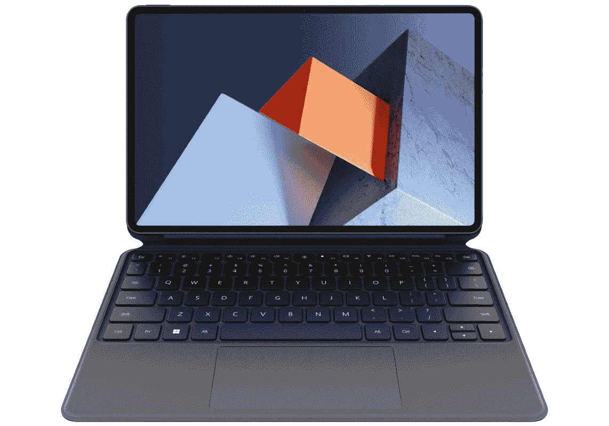

# 华为 MateBook E review:一款带有 OLED 面板的 Windows 平板电脑

> 原文：<https://www.xda-developers.com/huawei-matebook-e-2022-review/>

华为 MateBook E 是该公司第一款采用有机发光二极管显示屏的 Windows 平板电脑，它提供了出色的观看体验。这是我评测的第一台带 OLED 面板的笔记本电脑，看起来很棒。搭配强大的扬声器，这是一个非常棒的媒体消费平板电脑，无论是电影，视频还是音乐。我还喜欢外形的多功能性，可拆卸键盘允许您将平板电脑用作笔记本电脑或单独使用。它很轻，你可以轻松地把它带到任何地方去完成一些工作。

但一切都不如我所愿，触摸板的一些问题使得可用性不太理想。此外，由于低功耗 9W 处理器，性能受到影响，电池寿命也可能更长。也就是说，它与你从许多其他[轻型笔记本电脑](https://www.xda-developers.com/best-lightweight-laptops/)中得到的东西相差不远。

 <picture></picture> 

HUAWEI Matebook E

##### 华为 MateBook E

华为 MateBook E 是一款轻便的可拆卸 2 合 1 PC。它有一个 12.6 英寸的有机发光二极管显示屏，并支持雷电 4。

**浏览此评论:**

## 华为 MateBook E 定价和供货情况

*   华为 MateBook E 不会在美国上市，但会在欧洲和其他市场上市。
*   我评测的这款机型在德国售价为€1199 英镑，包括一个智能磁性键盘和 M-Pencil，但 M-Pencil 并不是每个市场都有。
*   基本配置价格为€649，配备酷睿 i3、8GB 内存和 128GB 存储。还有一款搭载酷睿 i7 的更贵型号。

按照华为设备的惯例，如果你住在美国，你将无法通过传统方式购买华为 MateBook E。华为设备在该地区根本就买不到，而且已经有一段时间没有了。华为主要专注于中国本土市场，以及各种欧洲市场。

目前，你只能在德国购买 MateBook E，并且只有几个配置可用。基本款，英特尔酷睿 i3-1110G4，8GB 内存，128GB 存储，S 模式 Windows 11 Home，售价€649；以及配备英特尔酷睿 i5、16GB 内存、512GB 存储和普通版 Windows 11 家庭版的中端配置，售价€1199 英镑。该设备将进入包括法国在内的其他市场，还将有一款采用英特尔酷睿 i7-1160G7 处理器的型号。

## 规范

| 

中央处理器

 | 英特尔酷睿 i5-1130G7 (4 核、8 线程、最高 4 GHz、8MB 英特尔智能高速缓存) |
| 

制图法

 | 英特尔 Iris Xe 显卡(80 EUs，最高 1.1GHz) |
| 

显示

 | 12.6 英寸有机发光二极管，2.5K (2560 x 1600)，240 DPI，100% DCI-P3，最高 600 尼特(HBM 模式)，触控 |
| 

身体

 | 286.5 x 184.7 x 7.99 毫米，709 克 |
| 

记忆

 | 16GB LPDDR4x |
| 

储存；储备

 | 512GB NVMe PCIe 固态硬盘 |
| 

电池

 | 42Wh 电池 |
| 

港口

 | 1 个 Thunderbolt 4/USB Type-C(显示端口、数据、电源) |
| 

声音的

 | 四扬声器、四麦克风 |
| 

连通性

 | wi-Fi 6 蓝牙 5.1 |
| 

照相机

 | 800 万像素前置网络摄像头，1080 像素 60 帧/秒视频，1300 万像素后置摄像头，4K 30 帧/秒视频 |
| 

颜色

 | 星云灰 |
| 

操作系统（Operating System）

 | Windows 11 主页 |
| 

价格

 | €1,199 |

## 设计:它很薄很轻，但键盘增加了一些重量

*   华为 MateBook E 的厚度仅为 7.99 毫米，重量为 709 克，因此比 Surface Pro 8 更轻。
*   附带的磁性键盘保护了整个平板电脑，但也使其变得更厚。

华为 MateBook E 的一切都是为了便携性，这一点在设备的设计中得到了体现。华为 MateBook E 厚度仅为 7.99 毫米，重量为 709 克。这明显比 Surface Pro 8(厚度为 9.3 毫米，重量为 889 克)更薄。乍一看，这似乎是华为的一大胜利，但有一个警告，因为 MateBook E 没有内置的支架。所有这些测量都是针对没有连接键盘的平板电脑，但 Surface Pro 8 在你没有连接键盘的时候仍然有一个支架，所以如果你想看视频，它随时可以被支撑起来。这里不是这样的。

华为 MateBook E 上的支架是智能磁性键盘的一部分，这也有好处。当你连接它时，它可以保护平板电脑的正面和背面，所以与微软的 Surface 设备相比，它感觉更安全一些。但是这也带来了设备更厚更重的缺点。根据我的测量，这款平板电脑大约有 15 毫米厚，附带智能磁性键盘，重量为 1.15 公斤。

支架也与通常的有点不同，因为你向下折叠盖子的顶部作为支架。这确实限制了它在某些边缘情况下的可用性，因为最小张角大约是 60 度。从技术上来说，它可以一直打开到 180 度(外壳可以弹回到平板电脑上)，但这也意味着一些接近 180 度的角度是不可用的，因为平板电脑的重量只会导致支架关闭。

平板电脑本身看起来不错。它只有星云灰，几乎是黑色的，键盘也是如此。它使用镁合金作为中框，背面由玻璃纤维制成，因此它看起来与大多数 Windows 平板电脑非常不同。通常，你会看到全金属机箱，这是一个很好的节奏变化。通风口位于金属框架和背板之间，几乎覆盖了所有侧面。这有助于冷却以及作为扬声器格栅。

端口非常有限，在我看来，这是这款平板电脑的一大缺点。你在右边有一个 Thunderbolt 4 端口(横向)，在左边底部有一个耳机插孔——就是这样。左侧还有电源按钮，内置指纹传感器，在顶部，你会发现音量摇杆。这也是 M-Pencil 磁性附着的地方，如果你有的话。最后，底部只有弹簧针来连接智能磁性键盘。

## 显示屏:华为 MateBook E 拥有充满活力和锐利的 OLED 面板

*   华为 MateBook E 拥有 12.6 英寸的 OLED 面板，分辨率为 Quad HD+分辨率。
*   四扬声器立体声系统提供身临其境的音频体验。
*   前置的 800 万像素网络摄像头非常适合视频通话。

对我来说，华为 MateBook E 的亮点绝对是媒体消费。这是我评测过的第一台拥有 OLED 面板的电脑，我不得不说，它看起来棒极了。华为说它覆盖了 100%的 DCI-P3 色域，我倾向于相信这一点。这款显示器上的一切看起来都令人难以置信地充满活力，当它与黑色背景形成对比时，没有什么能与之媲美。直到我把它放在我的主要笔记本电脑旁边，我才意识到这些颜色有多强烈，但这是一个巨大的差异。

这些都适用于显示器的本机模式，但你可以将其更改为 DCI-P3 或 sRGB 模式，相比之下，这些模式看起来明显更乏味。然而，当您处理对颜色敏感的项目时，拥有此选项对于确保奇偶性非常重要。我应该提到，显示器有圆角，因为我知道有些人可能不喜欢这样。我觉得没问题。

为了让媒体体验更好，华为 MateBook E 还打包了一套四个立体声扬声器，音频体验非常棒。扬声器开得很大，这样我可以在房子里轻松走动时听些东西。在我看来，扬声器在低频上确实有点重，但这可能只是因为我习惯了我手机上更小的扬声器。我不完全是一个音响发烧友，所以我的判断可能不是最好的。

说到捕捉媒体，华为 MateBook E 拥有一些你在 Windows 设备上可以找到的更好的网络摄像头，这一切都是因为它是一台平板电脑。这里的摄像头更符合你在 Android 平板电脑上找到的东西，而不是像 Windows PC 一样。前面有一个 800 万像素的摄像头，当你在风景模式下使用平板电脑时，它位于屏幕的顶部。在背面，有一个 1300 万像素的 LED 闪光灯，所以你可以在必要时用这款平板电脑拍照或录制 4K 视频。它不会像你的智能手机一样好，但这是意料之中的。

前置摄像头确实比大多数笔记本电脑的摄像头质量好得多，不过我注意到，在 Google Meet 这样的网络应用中，即使笔记本电脑是横向的，我的视频也是纵向的。这肯定是一个 bug，因为相机应用程序可以按预期工作，所以希望它可以通过更新来修复。我最初发现的另一个错误是，当相机正在使用时，我不能旋转平板电脑，但在我的审查期快结束时，BIOS 更新修复了这个问题。可悲的是，Google Meet 中的垂直视频并没有改变。

## 键盘和触控板:打字很好用，但触控板不行

*   华为 MateBook E 包括一个智能磁性键盘，按键行程为 1.3 毫米，令人印象深刻。
*   然而，附带的触摸板使用起来很不舒服。

现在，华为 MateBook E 是一款平板电脑，但它知道自己在做什么。Windows PC 使用键盘更有意义，华为提供了智能磁性键盘，正如我们提到的，它还可以作为平板电脑的外壳。对于这么薄的键盘来说，我对它打字的舒适程度印象深刻。华为宣称 MateBook E 的关键行程为 1.3 毫米，这一说法似乎成立。按键感觉非常好，它们不会很快触底，我让它们启动从来没有任何问题。

有些键比平时小一点，对于这种尺寸的键盘来说可以理解，但对我来说没什么大不了的。我很少用这里缩水的按键，所以其实并不影响我的使用。坦白地说，我最大的问题来自于键盘是美式布局，我更习惯葡萄牙键盘。

然而，事情变糟的地方是触控板。就尺寸而言，华为做对了。对于这里的可用空间来说，这是一个相当大的触摸板，所以使用起来应该很好。但触摸板的表面有一个轻微的抓握感，使用起来感觉很差。当点击和拖动时，我经常遇到鼠标开始移动不稳定的问题，它不能做我想要的。我也希望整个触摸板都可以被点击。考虑到它不是很高，这可能会有所帮助，所以必须按下下半部分有点限制性。

我还经常遇到一个问题，当我使用触摸板时，移动鼠标只是开始跑偏。它与外部鼠标(我现在几乎总是插在一起)一起工作很好，但使用触摸板感觉每秒钟只刷新一次屏幕。我发现我可以通过断开智能磁性键盘然后重新连接来解决这个问题，但它仍然很烦人，并且妨碍了我的工作。

此外还有 M-Pencil，据称它并不包含在平板电脑中，尽管它似乎至少在一些市场上是免费捆绑销售的。根据我的经验，这是一支有 4096 级压力的合适的数字笔，它工作得很好。它还配有可更换的笔尖，甚至还有一个功能，让你双击笔来截图或做其他一些动作。

笔的另一端没有橡皮擦或按钮，尽管其他笔已经做了一段时间了。它通过磁性附着在平板电脑的顶部来充电，但很容易错位。磁铁会将笔固定在不充电的错误位置。不过，一旦你习惯了，就很容易判断出你什么时候插错了笔。

## 性能:它可以处理一些生产力，但电池寿命令人失望

*   华为 MateBook E 采用英特尔酷睿 i5-1130G7，也有酷睿 i3 和酷睿 i7 型号。
*   这些 CPU 来自英特尔的 9W 系列，所以它们没有典型的笔记本电脑处理器快。
*   尽管瓦数很低，电池寿命勉强超过 4 小时。

这篇评论是我第一次使用由英特尔 9W 处理器驱动的设备，但我已经听到了关于第 11 代机型的很好的消息。大多数笔记本电脑和 Surface Pro 8 等设备都使用更典型的 15W 处理器，这些处理器为生产力提供了足够的性能。我的华为 MateBook E 评测单元配备了英特尔酷睿 i5-1130G7，这让我感到有点失望，尽管我的期望可能是罪魁祸首。

当我第一次设置笔记本电脑时，由于下载应用程序更新，体验有一点点缓慢，但在你获得所需的一切后，大多数都消失了。我仍然发现它在编辑一些照片时很费劲，尤其是当它们的分辨率很高并且我打开了其他程序时。不过，对于它所拥有的那种处理器来说，这并不令人惊讶，而且它仍然完全可用。你可能只是想更清楚地知道你想一次做多少事情。

让我真正失望的是，我无法为双屏设置插入外部显示器。如果我这么做了，平板电脑几乎就不能用了，尤其是在打字的时候。每当我连接第二个屏幕打字时，笔记本电脑会很快停止正常响应，无论我最后按了什么键，都会不断地输入，直到我按下另一个键。由于这是我第一次体验这种处理器，这是令人失望的，但这可能是意料之中的。

对于基准测试，我使用了我常用的 PCMark10、Geekbench、Cinebench 和 3DMark 的组合:

|  | 

华为 MateBook ECore i5-1130G7

 | 

三星 Galaxy Book Pro 360 5g core i5-1130 G7

 | 

微软 Surface Pro 7+酷睿 i5-1135G7

 |
| --- | --- | --- | --- |
| 

PCMark 10

 | 4,193 | 3,815 | 3,963 |
| 

极客工作台

 | 1,323 / 4,614 | 1,333 / 4,745 | 1,358 / 5,246 |
| 

电影院长凳

 | 1,028 / 2,647 | 1,269 / 3,403 | 1,235 / 2,854 |
| 

3DMark:时间间谍

 | 1,021 | 1,115 |  |

与类似规格的 Galaxy Book Pro 360 5G 相比，华为 MateBook E 在一些测试中表现不错，但在其他测试中表现不佳，尤其是 Cinebench。不过，性能与 15W 处理器相差不远，至少理论上是这样。

我本以为低功耗处理器意味着这是一台很棒的便携式机器，但它通常只能支持我工作大约四个小时。我离开它的最多时间大约是 4 小时 28 分钟，这是在显示器通常设置为 50%或更低的亮度，同时连接到稳定的 Wi-Fi 的情况下。如果你需要一台能支持你工作一整天的设备，我不建议你这么做。这似乎是采用这些处理器的其他设备的趋势，如联想 ThinkBook 13x，所以这不完全是华为的错。这只是拥有这样一个极轻设备的代价。

## 谁应该购买华为 MateBook E？

华为 MateBook E 有一些积极的方面，但最终，有许多人可能不应该购买它。

**谁应该购买华为 MateBook E:**

*   希望在惊艳的有机发光二极管显示器上观看大量电影和电视节目的用户
*   需要一台轻便的笔记本电脑以便偶尔在旅途中工作的客户
*   喜欢用好的网络摄像头进行视频通话和会议的人

**谁不该买华为 MateBook E:**

*   美国的任何人
*   需要经久耐用的笔记本电脑在远离电源插座的地方工作的人
*   具有双显示器设置或视频编辑等高要求工作负载的用户
*   计划经常使用触摸板的客户

我最喜欢华为 MateBook E 的一点肯定是有机发光二极管显示屏。它看起来绝对令人惊叹，它让 Windows 11 感觉更加生动。与液晶显示器相比，当你在有机发光二极管显示器上通过云母材料看到色彩时，这确实是一种不同的效果。扬声器也很棒，让这款手机成为了一款非常棒的媒体消费设备。不过，我对触摸板很不满意，因为它用起来感觉不好。当我把它当作笔记本电脑使用时，我总是想带着我的鼠标。我也有点失望，我不能用我的外部显示器，因为它使打字变得难以忍受。